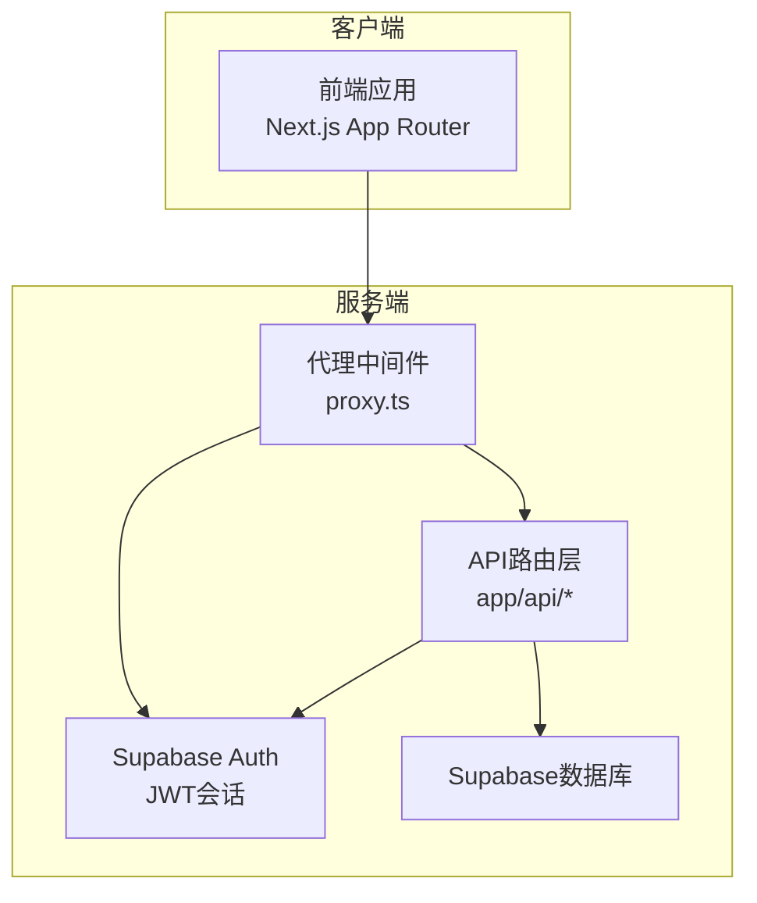
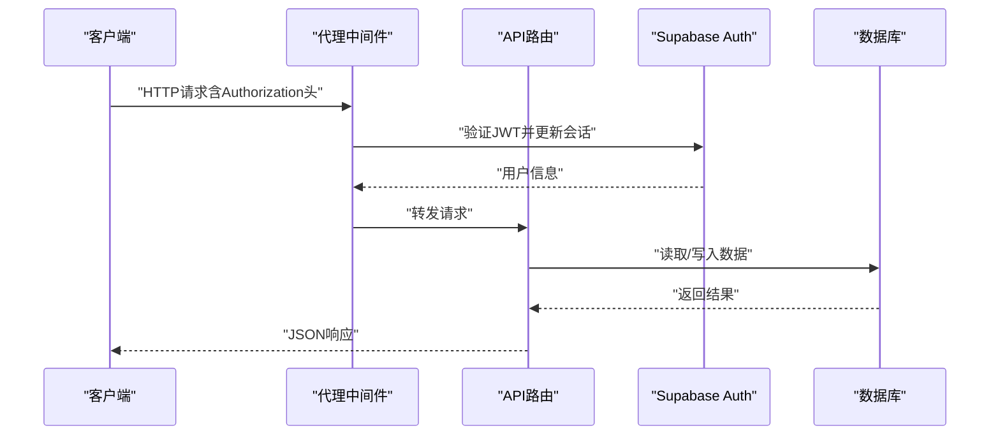
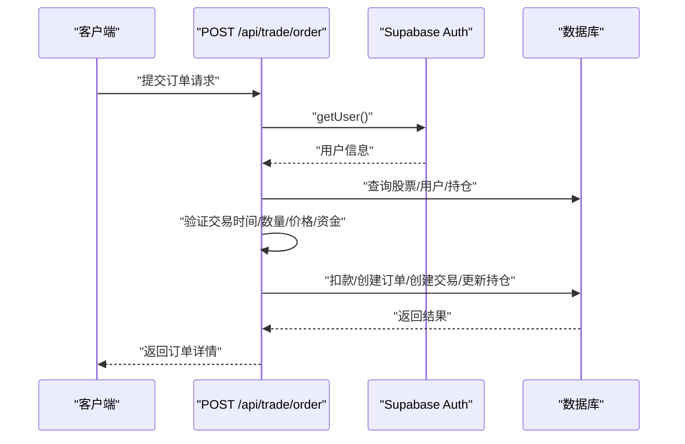
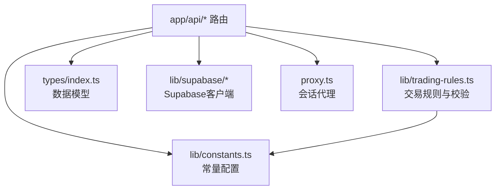

# API接口文档

<cite>
**本文引用的文件**
- [README.md](file://README.md)
- [API接口规范.md](file://docs/API接口规范.md)
- [app/api/stocks/route.ts](file://app/api/stocks/route.ts)
- [app/api/stocks/[symbol]/route.ts](file://app/api/stocks/[symbol]/route.ts)
- [app/api/trade/order/route.ts](file://app/api/trade/order/route.ts)
- [app/api/trade/orders/route.ts](file://app/api/trade/orders/route.ts)
- [app/api/trade/positions/route.ts](file://app/api/trade/positions/route.ts)
- [app/api/watchlist/route.ts](file://app/api/watchlist/route.ts)
- [app/api/watchlist/[symbol]/route.ts](file://app/api/watchlist/[symbol]/route.ts)
- [app/api/user/profile/route.ts](file://app/api/user/profile/route.ts)
- [lib/trading-rules.ts](file://lib/trading-rules.ts)
- [lib/constants.ts](file://lib/constants.ts)
- [types/index.ts](file://types/index.ts)
- [lib/utils.ts](file://lib/utils.ts)
- [proxy.ts](file://proxy.ts)
- [package.json](file://package.json)
</cite>

## 目录
1. [简介](#简介)
2. [项目结构](#项目结构)
3. [核心组件](#核心组件)
4. [架构总览](#架构总览)
5. [详细组件分析](#详细组件分析)
6. [依赖关系分析](#依赖关系分析)
7. [性能考虑](#性能考虑)
8. [故障排除指南](#故障排除指南)
9. [结论](#结论)
10. [附录](#附录)

## 简介
本文件为虚拟股票交易平台的API接口文档，基于仓库中的实际实现与规范文档整理而成。文档覆盖RESTful API设计原则、HTTP方法、URL模式、请求参数与响应格式，并对每个端点提供规格说明、请求/响应示例与错误码定义。同时说明认证机制（基于Supabase Auth的JWT）、数据验证规则、版本控制策略、速率限制与错误处理机制，并提供测试指南与调试工具使用方法。

## 项目结构
- API路由采用Next.js App Router风格，位于 app/api 下，按功能模块划分：
  - 用户与账户：/api/user/profile
  - 行情数据：/api/stocks、/api/stocks/:symbol、/api/stocks/:symbol/kline
  - 自选股：/api/watchlist、/api/watchlist/:symbol
  - 交易：/api/trade/order、/api/trade/orders、/api/trade/positions
- 认证与会话：通过Supabase SSR包与代理中间件维护JWT会话，API层统一从Supabase获取当前用户。
- 数据模型与常量：类型定义位于 types/index.ts；交易规则与常量位于 lib/trading-rules.ts 与 lib/constants.ts。
- 实时通信：行情与持仓变更通过Supabase Realtime订阅数据库变更，不单独定义WebSocket接口。

**图表来源**
- [proxy.ts:1-21](file://proxy.ts#L1-L21)
- [app/api/trade/order/route.ts:1-331](file://app/api/trade/order/route.ts#L1-L331)
- [app/api/user/profile/route.ts:1-42](file://app/api/user/profile/route.ts#L1-L42)

**章节来源**
- [README.md:1-110](file://README.md#L1-L110)
- [package.json:1-44](file://package.json#L1-L44)

## 核心组件
- 认证与授权
  - 所有需要用户身份的接口均通过 Supabase Auth 的 JWT Token 鉴权，在请求头中携带 Authorization: Bearer <token>。
  - 代理中间件用于更新会话，确保会话在服务端可用。
- 数据验证与业务规则
  - 交易时间检查、涨跌停限制、手续费计算、数量合法性（100股整数倍）、T+1规则等由 lib/trading-rules.ts 统一提供。
  - 常量配置（初始资金、费率、最小交易单位、交易时间等）位于 lib/constants.ts。
- 数据模型
  - 用户、股票、持仓、订单、交易、自选股等类型定义于 types/index.ts。
- 实时通信
  - 行情与持仓变更通过 Supabase Realtime 订阅数据库变更，不单独定义WebSocket接口。

**章节来源**
- [API接口规范.md:9-16](file://docs/API接口规范.md#L9-L16)
- [proxy.ts:1-21](file://proxy.ts#L1-L21)
- [lib/trading-rules.ts:1-272](file://lib/trading-rules.ts#L1-L272)
- [lib/constants.ts:1-101](file://lib/constants.ts#L1-L101)
- [types/index.ts:1-166](file://types/index.ts#L1-L166)

## 架构总览
下图展示API调用链路与数据流：

**图表来源**
- [proxy.ts:1-21](file://proxy.ts#L1-L21)
- [app/api/trade/order/route.ts:10-331](file://app/api/trade/order/route.ts#L10-L331)
- [app/api/user/profile/route.ts:4-42](file://app/api/user/profile/route.ts#L4-L42)

## 详细组件分析

### 用户与账户模块

#### 获取当前用户资料
- 方法与路径：GET /api/user/profile
- 认证：需要 Bearer Token
- 响应字段：id、email、virtual_balance、created_at
- 错误码：401 未认证；500 服务器内部错误

**章节来源**
- [API接口规范.md:18-41](file://docs/API接口规范.md#L18-L41)
- [app/api/user/profile/route.ts:1-42](file://app/api/user/profile/route.ts#L1-L42)

### 行情数据模块

#### 获取股票列表
- 方法与路径：GET /api/stocks
- 查询参数：
  - q：搜索关键词（代码或名称）
  - page：页码，默认1
  - limit：每页数量，默认20，最大100
- 响应字段：data（数组，包含股票信息与计算字段）、total、page、limit
- 计算字段：change、change_percent
- 错误码：500 服务器内部错误

**章节来源**
- [API接口规范.md:65-106](file://docs/API接口规范.md#L65-L106)
- [app/api/stocks/route.ts:1-69](file://app/api/stocks/route.ts#L1-L69)

#### 获取单只股票实时行情
- 方法与路径：GET /api/stocks/:symbol
- 路径参数：symbol（股票代码）
- 响应字段：symbol、name、market、current_price、prev_close、open、high、low、volume、change、change_percent、updated_at
- 错误码：404 股票不存在；500 服务器内部错误

**章节来源**
- [API接口规范.md:108-138](file://docs/API接口规范.md#L108-L138)
- [app/api/stocks/[symbol]/route.ts:1-51](file://app/api/stocks/[symbol]/route.ts#L1-L51)

#### 获取K线数据
- 方法与路径：GET /api/stocks/:symbol/kline
- 路径参数：symbol（股票代码）
- 查询参数：
  - period：K线周期（day、week、month）
  - limit：返回条数，默认100，最大500
- 响应字段：symbol、period、data（数组，包含date、open、high、low、close、volume）

**章节来源**
- [API接口规范.md:140-176](file://docs/API接口规范.md#L140-L176)

### 自选股模块

#### 获取自选股列表
- 方法与路径：GET /api/watchlist
- 认证：需要 Bearer Token
- 响应字段：data（数组，包含stock及计算字段change、change_percent）
- 错误码：401 未认证；500 服务器内部错误

**章节来源**
- [API接口规范.md:179-206](file://docs/API接口规范.md#L179-L206)
- [app/api/watchlist/route.ts:1-129](file://app/api/watchlist/route.ts#L1-L129)

#### 添加自选股
- 方法与路径：POST /api/watchlist
- 认证：需要 Bearer Token
- 请求体：{ symbol }
- 响应字段：success、symbol、message
- 错误码：400 股票代码不能为空；404 股票不存在；401 未认证；500 服务器内部错误

**章节来源**
- [API接口规范.md:209-236](file://docs/API接口规范.md#L209-L236)
- [app/api/watchlist/route.ts:58-129](file://app/api/watchlist/route.ts#L58-L129)

#### 移除自选股
- 方法与路径：DELETE /api/watchlist/:symbol
- 认证：需要 Bearer Token
- 响应字段：success、symbol、message
- 错误码：401 未认证；500 服务器内部错误

**章节来源**
- [API接口规范.md:238-256](file://docs/API接口规范.md#L238-L256)
- [app/api/watchlist/[symbol]/route.ts:1-50](file://app/api/watchlist/[symbol]/route.ts#L1-L50)

### 交易模块

#### 提交委托订单
- 方法与路径：POST /api/trade/order
- 认证：需要 Bearer Token
- 请求体字段：symbol、type（buy/sell）、price（市价单可传0）、quantity（必须为100的整数倍）、orderType（默认limit）
- 业务规则：
  - 非交易时间禁止下单
  - 价格需在涨跌停范围内
  - 买入：资金充足且数量合法；卖出：持仓足够且数量合法
  - 手续费计算：佣金（买卖双向）+ 印花税（卖出单边）
- 响应字段：order_id、symbol、type、price、quantity、filled_quantity、status、fee、created_at
- 状态说明：filled（全部成交）、partial（部分成交）、cancelled（已撤销）、pending（等待成交，仅限限价单）
- 错误码：400 参数不完整/非法；401 未登录；403 非交易时间；404 股票不存在；500 服务器内部错误

**图表来源**
- [app/api/trade/order/route.ts:10-331](file://app/api/trade/order/route.ts#L10-L331)
- [lib/trading-rules.ts:164-247](file://lib/trading-rules.ts#L164-L247)

**章节来源**
- [API接口规范.md:259-304](file://docs/API接口规范.md#L259-L304)
- [app/api/trade/order/route.ts:1-331](file://app/api/trade/order/route.ts#L1-L331)
- [lib/trading-rules.ts:1-272](file://lib/trading-rules.ts#L1-L272)

#### 获取当前持仓
- 方法与路径：GET /api/trade/positions
- 认证：需要 Bearer Token
- 响应字段：data（数组，包含stock及计算字段market_value、profit_loss、profit_loss_percent）
- 错误码：401 未认证；500 服务器内部错误

**章节来源**
- [API接口规范.md:307-335](file://docs/API接口规范.md#L307-L335)
- [app/api/trade/positions/route.ts:1-46](file://app/api/trade/positions/route.ts#L1-L46)

#### 获取委托记录
- 方法与路径：GET /api/trade/orders
- 认证：需要 Bearer Token
- 查询参数：status（filled/pending/cancelled）、page、limit
- 响应字段：data（数组，包含订单详情）、total、page、limit
- 错误码：401 未认证；500 服务器内部错误

**章节来源**
- [API接口规范.md:338-378](file://docs/API接口规范.md#L338-L378)
- [app/api/trade/orders/route.ts:1-66](file://app/api/trade/orders/route.ts#L1-L66)

#### 撤销委托订单
- 方法与路径：DELETE /api/trade/order/:orderId
- 认证：需要 Bearer Token
- 响应字段：success、order_id、status
- 错误码：401 未认证；500 服务器内部错误

**章节来源**
- [API接口规范.md:381-400](file://docs/API接口规范.md#L381-L400)

### 交易复盘模块

#### 获取交易统计
- 方法与路径：GET /api/trade/statistics
- 认证：需要 Bearer Token
- 响应字段：total_trades、win_rate、avg_profit、avg_loss、max_profit、max_loss、max_drawdown、sharpe_ratio
- 错误码：401 未认证；500 服务器内部错误

**章节来源**
- [API接口规范.md:403-429](file://docs/API接口规范.md#L403-L429)

#### 获取收益走势数据
- 方法与路径：GET /api/trade/performance
- 认证：需要 Bearer Token
- 查询参数：start_date（默认30天前）、end_date（默认今日）
- 响应字段：data（数组，包含date、total_asset、daily_return、cumulative_return、benchmark_return）
- 错误码：401 未认证；500 服务器内部错误

**章节来源**
- [API接口规范.md:432-464](file://docs/API接口规范.md#L432-L464)

### 策略分析模块（P1）
- 首板观察池：GET /api/analysis/first-board
- 五大回调战法信号：GET /api/analysis/signals（可选signal_type筛选）
- 订阅/更新预警条件：POST /api/analysis/alert/subscribe（请求体包含symbol、pressure_break、tail_confirm、stop_loss_percent）

**章节来源**
- [API接口规范.md:467-551](file://docs/API接口规范.md#L467-L551)

### 系统管理接口（P2，非MVP）
- GET /api/admin/users：获取用户列表
- POST /api/admin/users/:id/reset：重置用户密码
- POST /api/admin/announcement：发布系统公告
- PUT /api/admin/datasource：切换数据源API Key

**章节来源**
- [API接口规范.md:554-564](file://docs/API接口规范.md#L554-L564)

## 依赖关系分析

**图表来源**
- [app/api/trade/order/route.ts:1-331](file://app/api/trade/order/route.ts#L1-L331)
- [lib/trading-rules.ts:1-272](file://lib/trading-rules.ts#L1-L272)
- [lib/constants.ts:1-101](file://lib/constants.ts#L1-L101)
- [types/index.ts:1-166](file://types/index.ts#L1-L166)
- [proxy.ts:1-21](file://proxy.ts#L1-L21)

**章节来源**
- [app/api/trade/order/route.ts:1-331](file://app/api/trade/order/route.ts#L1-L331)
- [lib/trading-rules.ts:1-272](file://lib/trading-rules.ts#L1-L272)
- [lib/constants.ts:1-101](file://lib/constants.ts#L1-L101)
- [types/index.ts:1-166](file://types/index.ts#L1-L166)
- [proxy.ts:1-21](file://proxy.ts#L1-L21)

## 性能考虑
- 分页与排序
  - 股票列表默认按成交量降序分页，limit上限为100，避免一次性返回过多数据。
- 实时数据
  - 行情与持仓变更通过Supabase Realtime订阅，减少轮询开销。
- 交易流程
  - 买入/卖出涉及多步数据库操作（资金、订单、交易、持仓），建议在数据库层面使用事务以保证一致性。
- 缓存与刷新
  - 前端可设置合理的刷新间隔（如30秒）以平衡实时性与性能。

**章节来源**
- [app/api/stocks/route.ts:10-39](file://app/api/stocks/route.ts#L10-L39)
- [lib/constants.ts:70-95](file://lib/constants.ts#L70-L95)

## 故障排除指南
- 认证失败（401）
  - 确认请求头包含正确的 Authorization: Bearer <token>。
  - 检查代理中间件是否正确更新会话。
- 参数错误（400）
  - 检查请求体字段是否完整，数量是否为100的整数倍，价格是否在涨跌停范围内。
- 资源不存在（404）
  - 股票代码无效或用户资料缺失。
- 交易受限（403）
  - 非交易时间下单或违反T+1规则。
- 服务器错误（500）
  - 查看服务端日志定位具体错误位置，优先检查数据库连接与事务执行。

**章节来源**
- [API接口规范.md:567-577](file://docs/API接口规范.md#L567-L577)
- [app/api/trade/order/route.ts:18-49](file://app/api/trade/order/route.ts#L18-L49)
- [lib/trading-rules.ts:164-247](file://lib/trading-rules.ts#L164-L247)

## 结论
本API文档基于仓库中的实际实现与规范文档整理，覆盖了用户、行情、自选股、交易、复盘与策略分析等模块。认证采用Supabase JWT，数据验证与业务规则集中在lib层，实时通信通过Supabase Realtime实现。建议在生产环境中结合速率限制、监控告警与完善的日志体系进一步提升稳定性与可观测性。

## 附录

### 认证机制与权限验证
- 认证方式：Bearer Token（JWT）
- 会话更新：通过代理中间件更新Supabase会话，确保服务端可获取当前用户。
- 权限验证：所有需要用户身份的接口均需通过 Supabase Auth getUser() 获取用户并进行鉴权。

**章节来源**
- [API接口规范.md:11-14](file://docs/API接口规范.md#L11-L14)
- [proxy.ts:1-21](file://proxy.ts#L1-L21)
- [app/api/user/profile/route.ts:9-17](file://app/api/user/profile/route.ts#L9-L17)

### 数据验证规则与输入参数校验
- 数量合法性：必须为100的整数倍。
- 价格范围：必须在涨跌停范围内，涨跌停比例根据股票类型（主板/科创板/创业板/北交所）而定。
- 交易时间：仅在交易时间内允许下单。
- 资金与持仓：买入需资金充足，卖出需持仓足够。
- T+1规则：当日买入的股票次日才能卖出（实际实现需数据库记录买入时间）。

**章节来源**
- [lib/trading-rules.ts:127-247](file://lib/trading-rules.ts#L127-L247)
- [lib/constants.ts:29-68](file://lib/constants.ts#L29-L68)

### API版本控制与向后兼容
- Base URL：/api
- 版本策略：当前文档为V1.0，涵盖MVP接口；P1/P2模块作为扩展逐步引入，保持现有端点不变以保证向后兼容。
- 迁移建议：新增端点采用新路径，旧端点保持原签名，避免破坏既有客户端。

**章节来源**
- [API接口规范.md:3-6](file://docs/API接口规范.md#L3-L6)

### 速率限制、错误处理与异常情况
- 速率限制：未在代码中显式实现，建议在网关或边缘层增加限流策略。
- 错误处理：统一返回 { error } 结构，状态码遵循REST约定。
- 异常情况：交易时间外、资金不足、价格越界、库存不足等均返回相应错误码与消息。

**章节来源**
- [API接口规范.md:567-577](file://docs/API接口规范.md#L567-L577)
- [app/api/trade/order/route.ts:30-49](file://app/api/trade/order/route.ts#L30-L49)

### API测试指南与调试工具
- 测试建议：
  - 使用HTTP客户端（如curl或Postman）发送请求，设置 Authorization: Bearer <token>。
  - 先调用 GET /api/user/profile 确认认证有效。
  - 逐步验证 GET /api/stocks、POST /api/watchlist、POST /api/trade/order 等关键流程。
- 调试工具：
  - 浏览器开发者工具查看网络请求与响应。
  - 服务端日志定位异常（如数据库错误、事务回滚）。

**章节来源**
- [API接口规范.md:11-16](file://docs/API接口规范.md#L11-L16)

### WebSocket实时接口与Socket通信协议
- 实时通信：行情与持仓变更通过 Supabase Realtime 订阅数据库变更，不单独定义WebSocket接口。
- 建议：若需自定义实时通道，可在Supabase Realtime基础上扩展，保持与现有认证体系一致。

**章节来源**
- [API接口规范.md:14](file://docs/API接口规范.md#L14)