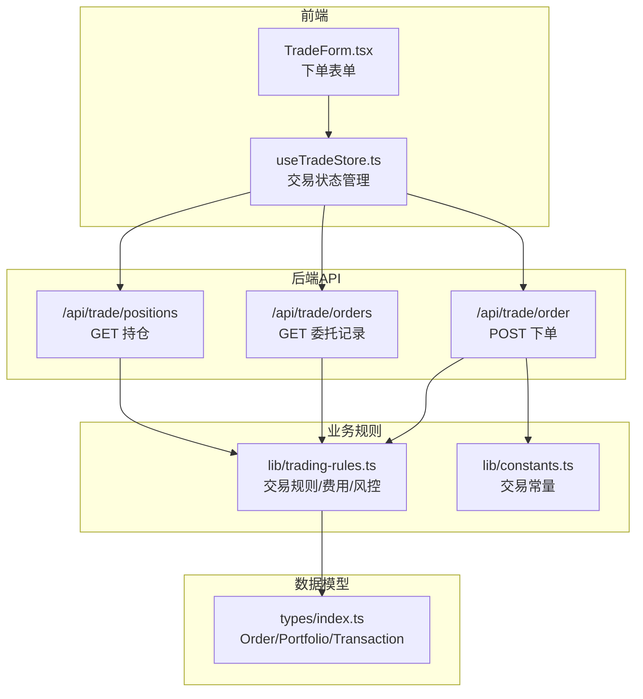
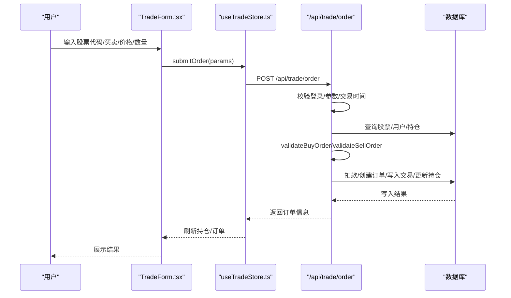
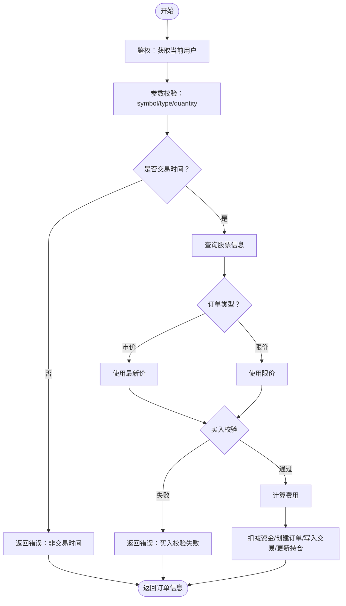
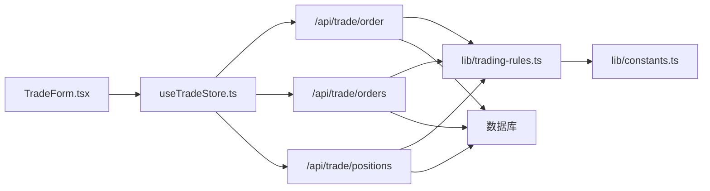

# 交易系统API

<cite>
**本文引用的文件**
- [app/api/trade/order/route.ts](file://app/api/trade/order/route.ts)
- [app/api/trade/orders/route.ts](file://app/api/trade/orders/route.ts)
- [app/api/trade/positions/route.ts](file://app/api/trade/positions/route.ts)
- [lib/trading-rules.ts](file://lib/trading-rules.ts)
- [lib/constants.ts](file://lib/constants.ts)
- [types/index.ts](file://types/index.ts)
- [stores/useTradeStore.ts](file://stores/useTradeStore.ts)
- [components/trade/TradeForm.tsx](file://components/trade/TradeForm.tsx)
- [docs/API接口规范.md](file://docs/API接口规范.md)
- [app/api/cron/update-prices/route.ts](file://app/api/cron/update-prices/route.ts)
</cite>

## 目录
1. [简介](#简介)
2. [项目结构](#项目结构)
3. [核心组件](#核心组件)
4. [架构总览](#架构总览)
5. [详细组件分析](#详细组件分析)
6. [依赖关系分析](#依赖关系分析)
7. [性能考量](#性能考量)
8. [故障排查指南](#故障排查指南)
9. [结论](#结论)
10. [附录](#附录)

## 简介
本文件面向交易系统API，围绕委托下单、持仓查询、委托记录查询、撤销委托、交易状态、费用与资金、交易时间与风控、安全与异常处理等方面进行系统化说明。文档基于仓库中的实际实现与接口规范，确保技术细节与前端调用一致。

## 项目结构
交易相关API集中在应用层的API路由中，配合通用交易规则与常量、类型定义以及前端状态管理与表单组件共同构成完整的交易闭环。

图表来源
- [components/trade/TradeForm.tsx:1-234](file://components/trade/TradeForm.tsx#L1-L234)
- [stores/useTradeStore.ts:1-192](file://stores/useTradeStore.ts#L1-L192)
- [app/api/trade/order/route.ts:1-331](file://app/api/trade/order/route.ts#L1-L331)
- [app/api/trade/orders/route.ts:1-66](file://app/api/trade/orders/route.ts#L1-L66)
- [app/api/trade/positions/route.ts:1-46](file://app/api/trade/positions/route.ts#L1-L46)
- [lib/trading-rules.ts:1-272](file://lib/trading-rules.ts#L1-L272)
- [lib/constants.ts:1-101](file://lib/constants.ts#L1-L101)
- [types/index.ts:1-166](file://types/index.ts#L1-L166)

章节来源
- [components/trade/TradeForm.tsx:1-234](file://components/trade/TradeForm.tsx#L1-L234)
- [stores/useTradeStore.ts:1-192](file://stores/useTradeStore.ts#L1-L192)
- [app/api/trade/order/route.ts:1-331](file://app/api/trade/order/route.ts#L1-L331)
- [app/api/trade/orders/route.ts:1-66](file://app/api/trade/orders/route.ts#L1-L66)
- [app/api/trade/positions/route.ts:1-46](file://app/api/trade/positions/route.ts#L1-L46)
- [lib/trading-rules.ts:1-272](file://lib/trading-rules.ts#L1-L272)
- [lib/constants.ts:1-101](file://lib/constants.ts#L1-L101)
- [types/index.ts:1-166](file://types/index.ts#L1-L166)

## 核心组件
- 委托下单接口：支持市价单与限价单，校验交易时间、数量、价格区间、资金/持仓约束，执行资金冻结/解冻与订单、交易、持仓的原子性更新。
- 委托记录查询接口：按用户维度查询，支持状态筛选、分页与总数统计。
- 持仓查询接口：返回当前有效持仓，包含市场价值与盈亏计算字段。
- 撤销委托：前端通过store发起，后端接口定义见接口规范；当前路由文件未实现具体撤销逻辑，但前端具备调用入口。
- 交易规则与费用：统一的交易时间判断、涨跌停限制、手续费与印花税计算、数量单位校验。
- 实时行情：定时任务从第三方API批量更新股价，保障委托下单与持仓展示的价格时效性。

章节来源
- [app/api/trade/order/route.ts:1-331](file://app/api/trade/order/route.ts#L1-L331)
- [app/api/trade/orders/route.ts:1-66](file://app/api/trade/orders/route.ts#L1-L66)
- [app/api/trade/positions/route.ts:1-46](file://app/api/trade/positions/route.ts#L1-L46)
- [lib/trading-rules.ts:1-272](file://lib/trading-rules.ts#L1-L272)
- [lib/constants.ts:1-101](file://lib/constants.ts#L1-L101)
- [docs/API接口规范.md:259-401](file://docs/API接口规范.md#L259-L401)

## 架构总览
交易系统采用“前端状态管理 + 后端API路由 + 业务规则库”的分层设计。前端通过store封装API调用与订阅，后端路由负责鉴权、参数校验、业务规则校验与数据库操作。

图表来源
- [components/trade/TradeForm.tsx:84-127](file://components/trade/TradeForm.tsx#L84-L127)
- [stores/useTradeStore.ts:99-121](file://stores/useTradeStore.ts#L99-L121)
- [app/api/trade/order/route.ts:11-331](file://app/api/trade/order/route.ts#L11-L331)

## 详细组件分析

### 委托下单接口（POST /api/trade/order）
- 功能概述
  - 支持市价单与限价单：市价单以最新价成交，限价单按指定价格成交。
  - 交易类型：买入/卖出。
  - 数量验证：必须为100的整数倍。
  - 价格验证：必须在涨跌停范围内。
  - 资金/持仓校验：买入需可用资金充足；卖出需持有足够数量。
  - 交易时间：仅在交易时段内允许下单。
  - 费用计算：包含佣金与印花税（卖出单边收取）。
  - 数据一致性：通过数据库事务保证资金变动、订单创建、交易记录与持仓更新的原子性。

- 请求与响应
  - 请求头：Authorization: Bearer <token>，Content-Type: application/json。
  - 请求体字段：symbol（股票代码）、type（buy/sell）、price（委托价格，市价单可为0）、quantity（委托数量，股）。
  - 响应字段：order_id、symbol、type、price、quantity、filled_quantity、status、fee、created_at。

- 核心流程图

图表来源
- [app/api/trade/order/route.ts:11-331](file://app/api/trade/order/route.ts#L11-L331)
- [lib/trading-rules.ts:170-201](file://lib/trading-rules.ts#L170-L201)
- [lib/trading-rules.ts:211-247](file://lib/trading-rules.ts#L211-L247)
- [lib/trading-rules.ts:88-125](file://lib/trading-rules.ts#L88-L125)

- 价格类型与数量验证
  - 价格类型：市价单与限价单分别处理；市价单以当前价成交。
  - 数量验证：必须为100的整数倍。
  - 涨跌停限制：根据股票类型（主板/科创板/创业板/北交所）计算涨跌停范围。

- 资金与费用
  - 买入：总成本 = 成交金额 + 佣金（最低收费取较大值）+ 印花税（卖出单边）。
  - 卖出：到账金额 = 成交金额 - 佣金 - 印花税。
  - 资金冻结：买入时先扣减可用余额，成交后写入订单与交易记录。

- 数据模型映射
  - 订单：Order（包含状态字段）。
  - 交易：Transaction（记录每笔成交）。
  - 持仓：Portfolio（包含平均成本、数量）。

章节来源
- [app/api/trade/order/route.ts:1-331](file://app/api/trade/order/route.ts#L1-L331)
- [lib/trading-rules.ts:1-272](file://lib/trading-rules.ts#L1-L272)
- [types/index.ts:68-80](file://types/index.ts#L68-L80)
- [types/index.ts:53-66](file://types/index.ts#L53-L66)
- [types/index.ts:36-51](file://types/index.ts#L36-L51)

### 持仓查询接口（GET /api/trade/positions）
- 功能概述
  - 返回当前用户的有效持仓（quantity > 0）。
  - 支持关联查询股票基础信息。
  - 前端store在获取持仓时会计算市场价值与盈亏。

- 响应字段
  - data：包含持仓详情及关联股票信息，计算字段如market_value、profit_loss、profit_loss_percent由前端计算。

- 盈亏与市值计算
  - 市值：current_price × quantity。
  - 盈亏：(current_price - avg_cost) × quantity。
  - 盈亏百分比：((current_price - avg_cost) / avg_cost) × 100。

章节来源
- [app/api/trade/positions/route.ts:1-46](file://app/api/trade/positions/route.ts#L1-L46)
- [stores/useTradeStore.ts:33-66](file://stores/useTradeStore.ts#L33-L66)
- [lib/trading-rules.ts:250-271](file://lib/trading-rules.ts#L250-L271)

### 委托记录查询接口（GET /api/trade/orders）
- 功能概述
  - 按当前用户查询委托记录。
  - 支持状态筛选（如filled/pending/cancelled）。
  - 支持分页（page/limit）与总数统计。

- 查询参数
  - status：按状态过滤。
  - page：页码，默认1。
  - limit：每页数量，默认20。

- 响应字段
  - data：订单列表。
  - total/page/limit：分页信息。

章节来源
- [app/api/trade/orders/route.ts:1-66](file://app/api/trade/orders/route.ts#L1-L66)
- [stores/useTradeStore.ts:68-84](file://stores/useTradeStore.ts#L68-L84)
- [docs/API接口规范.md:338-378](file://docs/API接口规范.md#L338-L378)

### 撤销委托订单
- 接口定义
  - DELETE /api/trade/order/:orderId（接口规范定义）。
- 前端实现
  - 前端store提供cancelOrder方法，调用DELETE /api/trade/order/:orderId并刷新订单列表。
- 当前状态
  - 后端路由文件未实现该接口；前端仍保留调用入口，建议尽快补齐后端逻辑以支持真实撤销。

章节来源
- [stores/useTradeStore.ts:123-142](file://stores/useTradeStore.ts#L123-L142)
- [docs/API接口规范.md:381-399](file://docs/API接口规范.md#L381-L399)

### 交易状态说明
- 状态枚举
  - pending：等待成交（仅限限价单）。
  - filled：全部成交。
  - partial：部分成交。
  - cancelled：已撤销。
- 状态转换
  - 新建委托：pending/filled（市价单直接成交）。
  - 部分成交：partial（后续可能转为filled或cancelled）。
  - 撤销：cancelled（仅限未完全成交的委托）。

章节来源
- [types/index.ts:68-80](file://types/index.ts#L68-L80)
- [docs/API接口规范.md:303](file://docs/API接口规范.md#L303)

### 交易费用与资金冻结机制
- 费用构成
  - 佣金：双向收取，最低收费取max(金额×费率, 最低收费)。
  - 印花税：卖出单边收取。
- 资金冻结
  - 买入：先从可用余额扣减总成本，成交后写入订单与交易记录。
  - 卖出：成交后增加可用余额（成交金额-费用）。

章节来源
- [lib/trading-rules.ts:88-125](file://lib/trading-rules.ts#L88-L125)
- [app/api/trade/order/route.ts:106-150](file://app/api/trade/order/route.ts#L106-L150)
- [app/api/trade/order/route.ts:244-291](file://app/api/trade/order/route.ts#L244-L291)

### 交易时间限制与风控规则
- 交易时间
  - A股工作日：9:30-11:30、13:00-15:00。
  - 非交易时间禁止下单。
- 涨跌停限制
  - 根据股票类型（主板/科创板/创业板/北交所）设置不同的涨跌停幅度。
- 数量单位
  - 交易数量必须为100的整数倍。
- T+1规则
  - 当日买入的股票次日方可卖出（接口预留，实际实现需结合买入时间记录）。

章节来源
- [lib/trading-rules.ts:3-24](file://lib/trading-rules.ts#L3-L24)
- [lib/trading-rules.ts:62-86](file://lib/trading-rules.ts#L62-L86)
- [lib/trading-rules.ts:127-135](file://lib/trading-rules.ts#L127-L135)
- [lib/trading-rules.ts:145-160](file://lib/trading-rules.ts#L145-L160)
- [lib/constants.ts:48-68](file://lib/constants.ts#L48-L68)

### 交易安全与异常处理
- 认证与授权
  - 所有需要用户身份的接口均通过Supabase Auth的JWT鉴权。
- 异常处理
  - 参数缺失/非法、未登录、非交易时间、资金不足、持仓不足、数据库错误等均有明确的错误码与响应。
- 前端体验
  - 表单在非交易时间禁用下单按钮并提示下一次交易时间。
  - 提交过程中显示加载状态，失败时弹出Toast提示。

章节来源
- [docs/API接口规范.md:9-15](file://docs/API接口规范.md#L9-L15)
- [components/trade/TradeForm.tsx:84-127](file://components/trade/TradeForm.tsx#L84-L127)
- [app/api/trade/order/route.ts:18-23](file://app/api/trade/order/route.ts#L18-L23)
- [app/api/trade/orders/route.ts:12-17](file://app/api/trade/orders/route.ts#L12-L17)
- [app/api/trade/positions/route.ts:12-17](file://app/api/trade/positions/route.ts#L12-L17)

## 依赖关系分析
- 组件耦合
  - 前端TradeForm依赖store与交易规则函数；store依赖API路由与实时订阅。
  - 后端路由依赖交易规则库与数据库；交易规则依赖常量配置。
- 外部依赖
  - Supabase用于认证与数据库访问。
  - 第三方行情API（iTick）用于定时批量更新股价。

图表来源
- [components/trade/TradeForm.tsx:1-234](file://components/trade/TradeForm.tsx#L1-L234)
- [stores/useTradeStore.ts:1-192](file://stores/useTradeStore.ts#L1-L192)
- [app/api/trade/order/route.ts:1-331](file://app/api/trade/order/route.ts#L1-L331)
- [app/api/trade/orders/route.ts:1-66](file://app/api/trade/orders/route.ts#L1-L66)
- [app/api/trade/positions/route.ts:1-46](file://app/api/trade/positions/route.ts#L1-L46)
- [lib/trading-rules.ts:1-272](file://lib/trading-rules.ts#L1-L272)
- [lib/constants.ts:1-101](file://lib/constants.ts#L1-L101)

章节来源
- [components/trade/TradeForm.tsx:1-234](file://components/trade/TradeForm.tsx#L1-L234)
- [stores/useTradeStore.ts:1-192](file://stores/useTradeStore.ts#L1-L192)
- [app/api/trade/order/route.ts:1-331](file://app/api/trade/order/route.ts#L1-L331)
- [app/api/trade/orders/route.ts:1-66](file://app/api/trade/orders/route.ts#L1-L66)
- [app/api/trade/positions/route.ts:1-46](file://app/api/trade/positions/route.ts#L1-L46)
- [lib/trading-rules.ts:1-272](file://lib/trading-rules.ts#L1-L272)
- [lib/constants.ts:1-101](file://lib/constants.ts#L1-L101)

## 性能考量
- 批量行情更新
  - 定时任务按市场分批拉取行情，避免第三方API限流与超时。
- 数据库写入
  - 使用upsert批量更新股票数据，减少往返次数。
- 前端渲染
  - 持仓与订单列表采用分页查询，避免一次性传输大量数据。

章节来源
- [app/api/cron/update-prices/route.ts:24-124](file://app/api/cron/update-prices/route.ts#L24-L124)

## 故障排查指南
- 常见错误与定位
  - 400：参数不完整或数量/价格不合法（检查前端输入与交易规则）。
  - 401：未登录或Token无效（检查前端鉴权头）。
  - 403：非交易时间（查看getNextTradingTime提示）。
  - 404：股票不存在或持仓不足（检查股票代码与用户持仓）。
  - 500：服务器内部错误（查看后端日志与数据库错误）。
- 建议排查步骤
  - 确认当前交易时间与涨跌停范围。
  - 检查可用资金与持仓数量是否满足下单要求。
  - 核对请求头Authorization与请求体字段。
  - 查看后端路由与交易规则函数的错误分支。

章节来源
- [docs/API接口规范.md:567-577](file://docs/API接口规范.md#L567-L577)
- [app/api/trade/order/route.ts:28-49](file://app/api/trade/order/route.ts#L28-L49)
- [lib/trading-rules.ts:170-201](file://lib/trading-rules.ts#L170-L201)
- [lib/trading-rules.ts:211-247](file://lib/trading-rules.ts#L211-L247)

## 结论
本交易系统API围绕“安全、合规、易用”设计：严格的交易时间与风控校验、清晰的费用与资金处理、完善的委托与持仓查询能力。建议尽快补齐撤销委托的后端实现，并持续优化前端交互与错误提示，以提升用户体验与系统稳定性。

## 附录
- 接口规范参考：[docs/API接口规范.md](file://docs/API接口规范.md)
- 数据模型参考：[types/index.ts](file://types/index.ts)
- 交易常量参考：[lib/constants.ts](file://lib/constants.ts)
- 交易规则参考：[lib/trading-rules.ts](file://lib/trading-rules.ts)