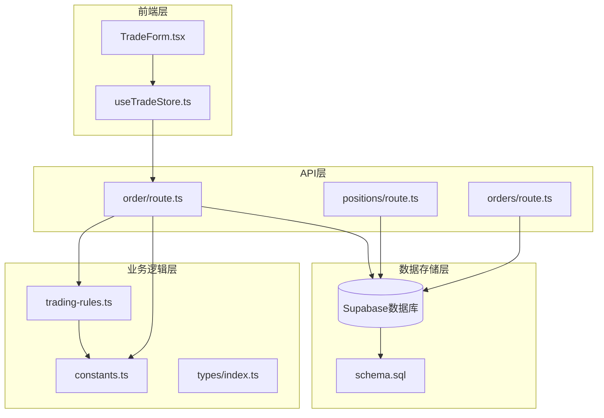
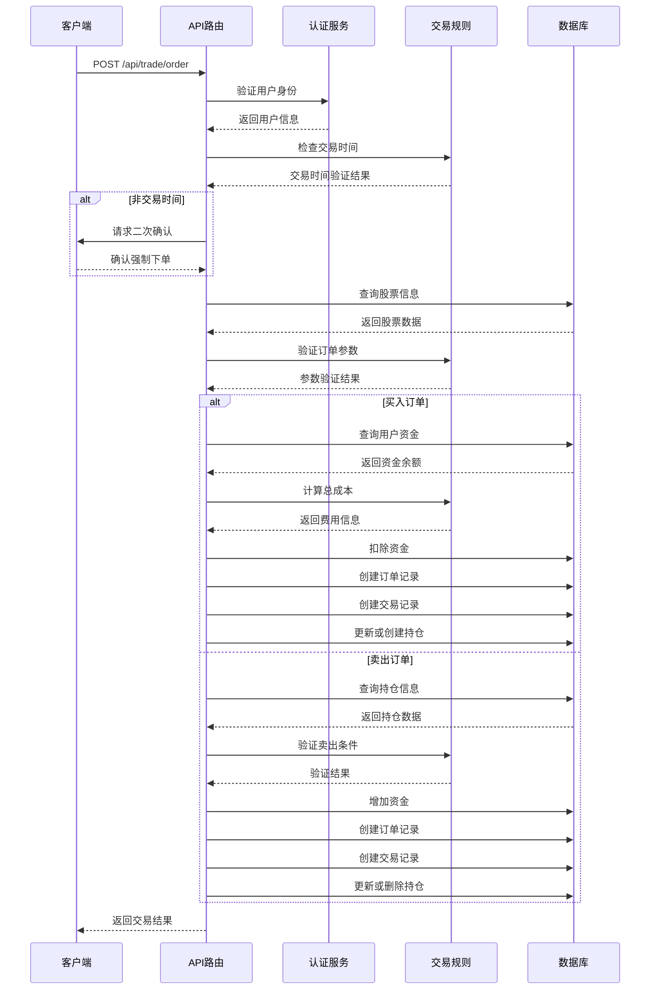
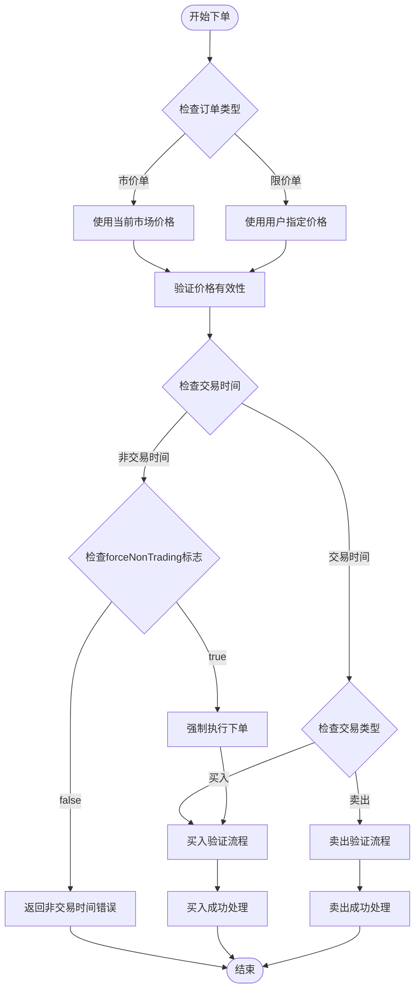
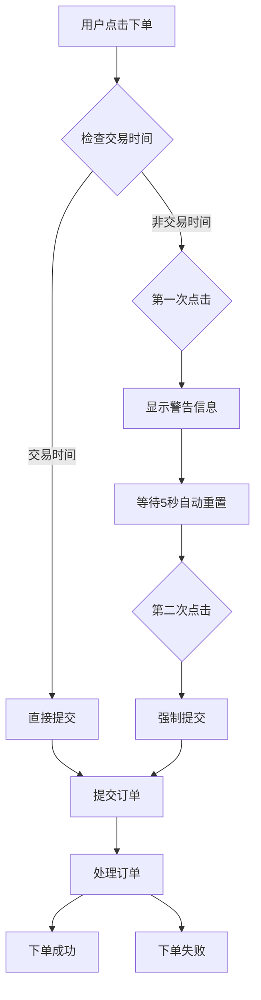
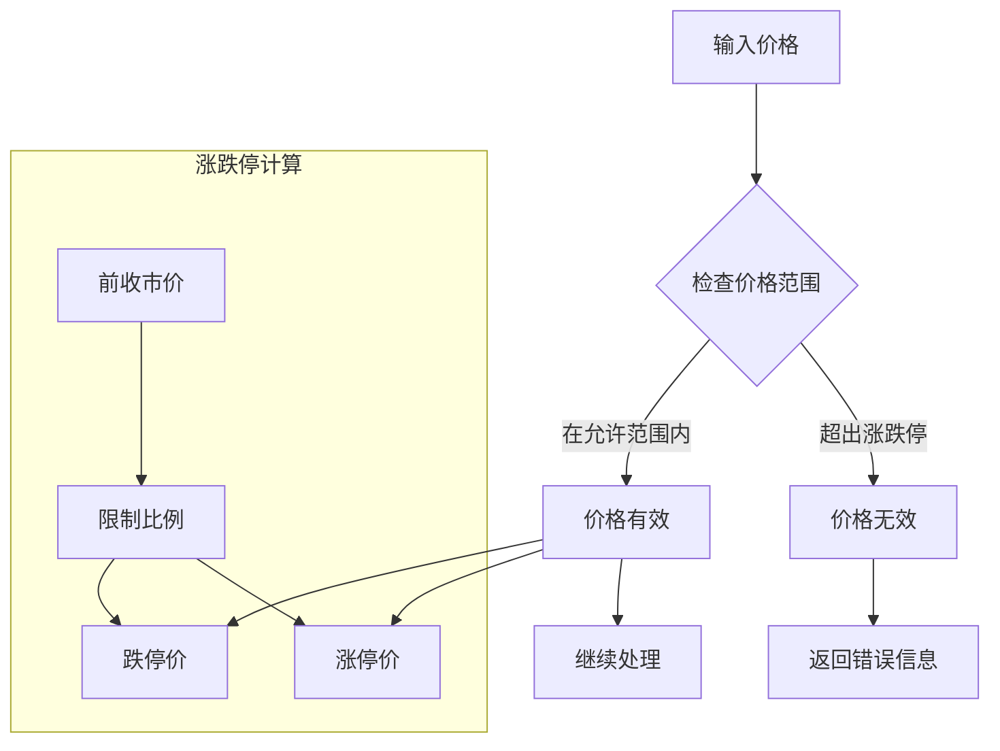
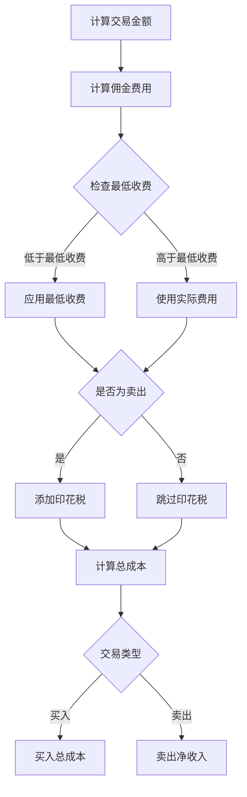
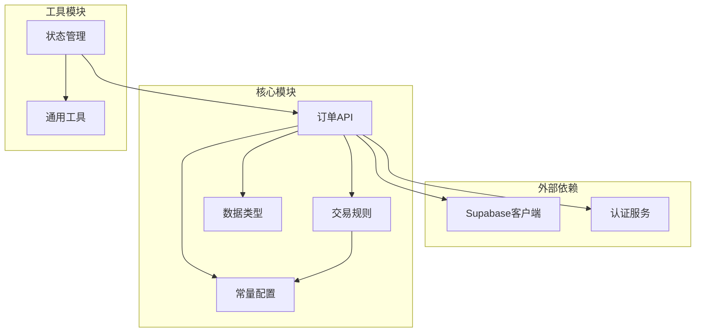

# 委托下单API

<cite>
**本文档引用的文件**
- [route.ts](file://app/api/trade/order/route.ts)
- [TradeForm.tsx](file://components/trade/TradeForm.tsx)
- [useTradeStore.ts](file://stores/useTradeStore.ts)
- [trading-rules.ts](file://lib/trading-rules.ts)
- [constants.ts](file://lib/constants.ts)
- [index.ts](file://types/index.ts)
- [orders/route.ts](file://app/api/trade/orders/route.ts)
- [positions/route.ts](file://app/api/trade/positions/route.ts)
- [schema.sql](file://supabase/schema.sql)
</cite>

## 更新摘要
**变更内容**
- 新增非交易时间双重确认机制，提升用户体验和安全性
- 增强服务端认证和交易规则验证
- 优化前端交互流程，支持强制下单功能
- 完善交易时间检查和错误处理机制

## 目录
1. [简介](#简介)
2. [项目结构](#项目结构)
3. [核心组件](#核心组件)
4. [架构概览](#架构概览)
5. [详细组件分析](#详细组件分析)
6. [依赖关系分析](#依赖关系分析)
7. [性能考虑](#性能考虑)
8. [故障排除指南](#故障排除指南)
9. [结论](#结论)

## 简介

委托下单API是虚拟股票交易系统的核心功能模块，负责处理用户的股票委托下单请求。该API实现了完整的交易流程，包括参数验证、交易规则检查、资金管理、持仓更新和实时数据同步等功能。

**更新** 新增非交易时间双重确认机制，支持测试环境下的强制下单功能，提升了系统的安全性和用户体验。

## 项目结构

虚拟股票交易系统的委托下单API位于Next.js应用程序的API路由层中，采用模块化的架构设计：



**图表来源**
- [route.ts:1-328](file://app/api/trade/order/route.ts#L1-L328)
- [trading-rules.ts:1-281](file://lib/trading-rules.ts#L1-L281)
- [constants.ts:1-101](file://lib/constants.ts#L1-L101)

**章节来源**
- [route.ts:1-328](file://app/api/trade/order/route.ts#L1-L328)
- [schema.sql:1-152](file://supabase/schema.sql#L1-L152)

## 核心组件

委托下单API由多个核心组件协同工作，实现完整的交易功能：

### API路由组件
- **POST /api/trade/order**: 主要的委托下单入口
- **GET /api/trade/positions**: 持仓查询接口
- **GET /api/trade/orders**: 委托记录查询接口

### 业务逻辑组件
- **交易规则验证器**: 处理交易时间、价格限制、数量验证等
- **费用计算器**: 计算交易手续费和总成本
- **数据模型**: 定义交易相关的数据结构

### 数据存储组件
- **用户资料表**: 存储用户虚拟资金信息
- **股票行情表**: 存储实时股价数据
- **持仓表**: 记录用户持有的股票信息
- **订单表**: 存储委托订单信息
- **交易记录表**: 记录已完成的交易详情

**章节来源**
- [route.ts:10-328](file://app/api/trade/order/route.ts#L10-L328)
- [trading-rules.ts:179-256](file://lib/trading-rules.ts#L179-L256)
- [constants.ts:1-101](file://lib/constants.ts#L1-L101)

## 架构概览

委托下单API采用分层架构设计，确保了代码的可维护性和扩展性：



**图表来源**
- [route.ts:11-328](file://app/api/trade/order/route.ts#L11-L328)
- [trading-rules.ts:179-256](file://lib/trading-rules.ts#L179-L256)

## 详细组件分析

### 主要API接口实现

#### POST /api/trade/order 接口

该接口是委托下单的核心入口，实现了完整的交易流程：

**请求参数验证**
- 必需参数：symbol（股票代码）、type（交易类型）、quantity（数量）
- 可选参数：price（价格）、orderType（订单类型，默认限价单）、forceNonTrading（强制非交易时间下单标志）
- 类型验证：type必须为'buy'或'sell'

**交易时间检查**
- 支持A股交易时间：周一至周五 9:30-11:30, 13:00-15:00
- 非交易时间返回403状态码

**市价单与限价单处理**



**图表来源**
- [route.ts:63-70](file://app/api/trade/order/route.ts#L63-L70)
- [route.ts:209-319](file://app/api/trade/order/route.ts#L209-L319)

**章节来源**
- [route.ts:27-43](file://app/api/trade/order/route.ts#L27-L43)

#### 买入订单处理流程

买入订单的处理流程包含了严格的资金验证和风险控制：

**资金验证步骤**
1. 获取用户当前虚拟余额
2. 计算总成本（金额+手续费）
3. 验证资金是否充足

**持仓更新逻辑**
- 如果存在相同股票：更新平均成本和数量
- 如果是新股票：创建新的持仓记录

**数据一致性保证**
- 使用数据库事务确保操作的原子性
- 同步更新多个表的数据

**章节来源**
- [route.ts:73-207](file://app/api/trade/order/route.ts#L73-L207)

#### 卖出订单处理流程

卖出订单的处理更加复杂，需要考虑T+1交易规则：

**T+1交易规则**
- 当日买入的股票次日才能卖出
- 实际实现需要记录买入时间进行判断

**持仓验证**
- 检查用户是否持有足够的股票
- 验证交易数量的有效性

**章节来源**
- [route.ts:209-319](file://app/api/trade/order/route.ts#L209-L319)

### 非交易时间双重确认机制

**更新** 新增的非交易时间双重确认机制显著提升了系统的安全性和用户体验：

#### 前端实现



**图表来源**
- [TradeForm.tsx:85-137](file://components/trade/TradeForm.tsx#L85-L137)

#### 状态管理增强

**forceNonTrading参数支持**
- 在useTradeStore中新增forceNonTrading可选参数
- 支持测试环境下的强制下单功能
- 通过submitOrder方法传递给后端API

**章节来源**
- [TradeForm.tsx:121-127](file://components/trade/TradeForm.tsx#L121-L127)
- [useTradeStore.ts:14-21](file://stores/useTradeStore.ts#L14-L21)

### 交易规则验证系统

#### 价格限制机制

系统实现了严格的涨跌停限制机制：



**图表来源**
- [trading-rules.ts:71-95](file://lib/trading-rules.ts#L71-L95)
- [trading-rules.ts:68-74](file://lib/trading-rules.ts#L68-L74)

#### 数量验证规则

系统要求交易数量必须是100的整数倍：
- 最小交易单位：1手 = 100股
- 批量交易：支持多手交易

**章节来源**
- [trading-rules.ts:139-144](file://lib/trading-rules.ts#L139-L144)

### 费用计算系统

#### 手续费结构

系统实现了多层次的费用计算机制：

**佣金费率**
- 标准费率：0.025%（万分之2.5）
- 最低收费：5元
- 买卖双向收取

**印花税**
- 卖出时单边收取
- 税率：0.05%（万分之5）

**费用计算流程**



**图表来源**
- [trading-rules.ts:102-134](file://lib/trading-rules.ts#L102-L134)

**章节来源**
- [trading-rules.ts:102-115](file://lib/trading-rules.ts#L102-L115)

### 数据模型定义

#### 核心数据结构

系统使用TypeScript定义了完整的数据模型：

**用户资料模型**
- id: 用户唯一标识
- email: 用户邮箱
- virtual_balance: 虚拟余额
- created_at/updated_at: 时间戳

**股票模型**
- symbol: 股票代码
- name: 股票名称
- current_price: 当前价格
- prev_close: 昨收价
- volume: 成交量

**订单模型**
- order_id: 订单ID
- symbol: 股票代码
- type: 交易类型（buy/sell）
- price: 委托价格
- quantity: 委托数量
- filled_quantity: 已成交数量
- status: 订单状态
- fee: 手续费

**章节来源**
- [index.ts:1-166](file://types/index.ts#L1-L166)

### 实时数据同步

#### WebSocket订阅机制

系统实现了基于Supabase Realtime的实时数据同步：

**订阅配置**
- 持仓变更：portfolios-{userId}
- 订单变更：orders-{userId}

**自动刷新机制**
- 订阅到数据变更事件
- 自动触发数据重新获取
- 保持界面与数据库同步

**章节来源**
- [useTradeStore.ts:145-193](file://stores/useTradeStore.ts#L145-L193)

## 依赖关系分析

委托下单API的依赖关系体现了清晰的分层架构：



**图表来源**
- [route.ts:1-10](file://app/api/trade/order/route.ts#L1-L10)
- [trading-rules.ts:1-2](file://lib/trading-rules.ts#L1-L2)

**章节来源**
- [route.ts:1-10](file://app/api/trade/order/route.ts#L1-L10)
- [trading-rules.ts:1-2](file://lib/trading-rules.ts#L1-L2)

## 性能考虑

### 数据库优化

系统采用了多种数据库优化策略：

**索引优化**
- 股票表：按symbol和updated_at建立索引
- 持仓表：按user_id建立索引
- 订单表：按user_id和created_at建立索引
- 交易表：按user_id和created_at建立索引

**查询优化**
- 使用单表查询减少连接操作
- 合理使用LIMIT和OFFSET实现分页
- 避免N+1查询问题

### 缓存策略

**前端缓存**
- 使用Zustand状态管理减少重复请求
- 实现本地数据缓存机制
- 支持手动刷新和自动更新

**后端缓存**
- 利用数据库索引提高查询性能
- 减少不必要的数据传输

## 故障排除指南

### 常见错误类型及解决方案

**认证相关错误**
- 401 未登录：检查用户认证状态
- 403 权限不足：验证用户权限

**参数验证错误**
- 400 参数不完整：检查必需参数
- 400 价格无效：验证价格范围
- 400 数量无效：检查交易单位

**业务逻辑错误**
- 400 资金不足：检查虚拟余额
- 400 持仓不足：验证持股数量
- 400 非交易时间：检查交易时间

**数据库错误**
- 500 数据库连接失败：检查连接配置
- 500 事务回滚：检查数据一致性

### 错误响应格式

所有API错误都遵循统一的响应格式：

```json
{
  "error": "错误描述信息",
  "status": 400
}
```

**章节来源**
- [route.ts:18-48](file://app/api/trade/order/route.ts#L18-L48)

### 调试建议

**开发调试**
- 使用浏览器开发者工具监控网络请求
- 检查控制台中的错误信息
- 验证API响应数据格式

**生产监控**
- 监控API响应时间和错误率
- 跟踪用户交易行为
- 定期检查数据库性能

## 结论

委托下单API是一个功能完整、架构清晰的交易系统核心模块。它实现了以下关键特性：

**完整性保障**
- 支持买入和卖出两种交易类型
- 实现了完整的交易规则验证
- 提供了实时数据同步机制

**安全性设计**
- 严格的参数验证
- 完善的错误处理机制
- 数据库层面的安全策略
- **新增** 非交易时间双重确认机制，提升安全性

**用户体验**
- 简洁的API接口设计
- 实时的状态更新
- 详细的错误反馈
- **新增** 智能的交易时间提示和强制下单功能

**技术增强**
- 前端二次确认机制
- 状态管理参数支持
- 服务端认证改进

该系统为虚拟股票交易提供了坚实的技术基础，可以根据实际需求进一步扩展功能，如支持更多交易类型、增加风控机制、优化性能表现等。