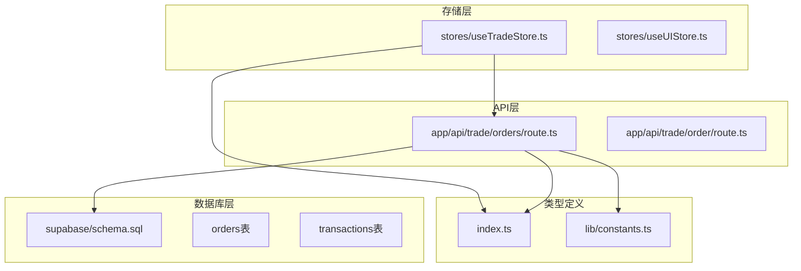
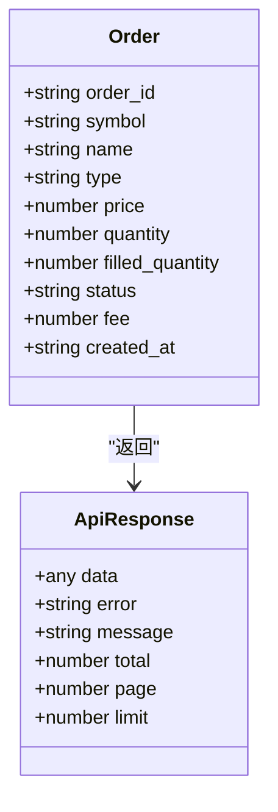
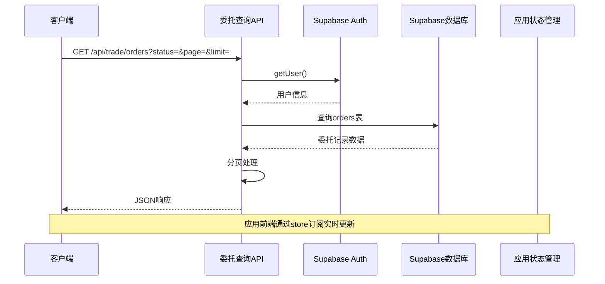
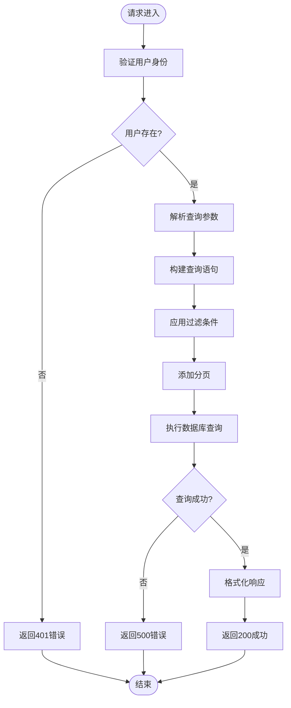
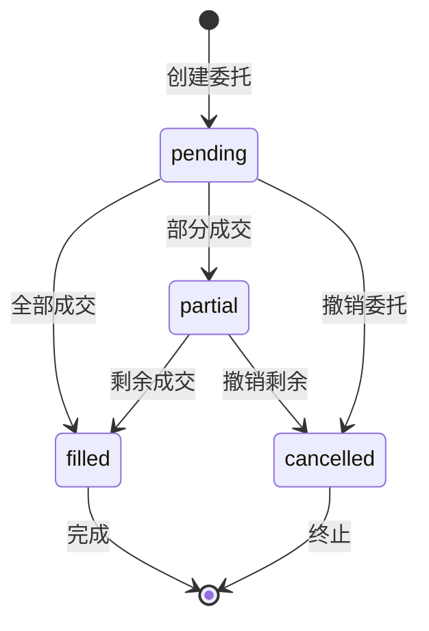
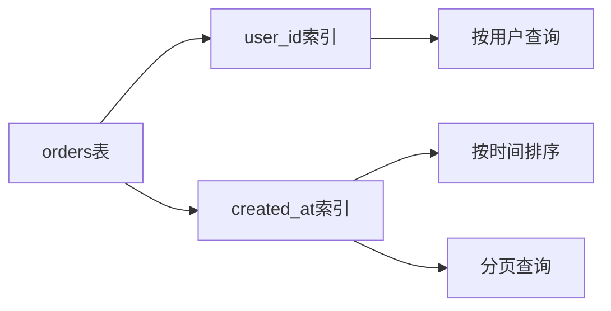
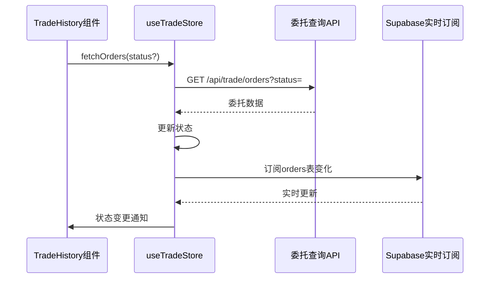
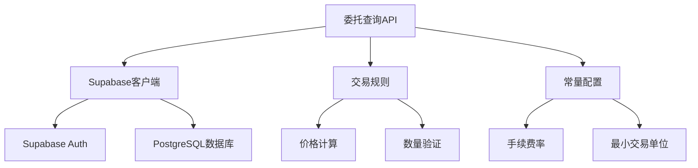
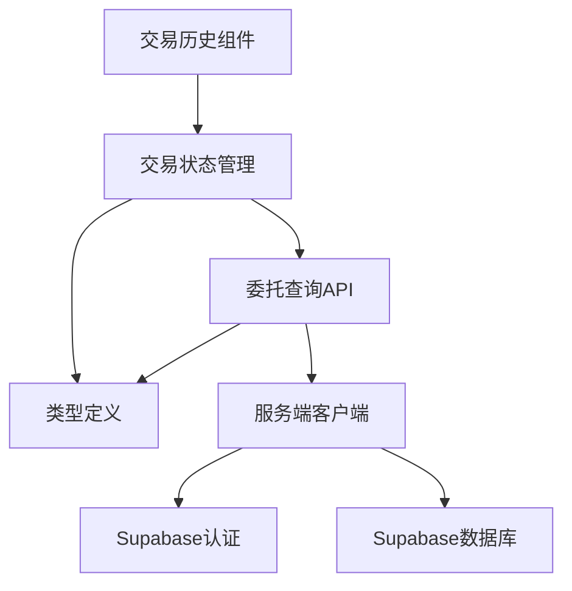
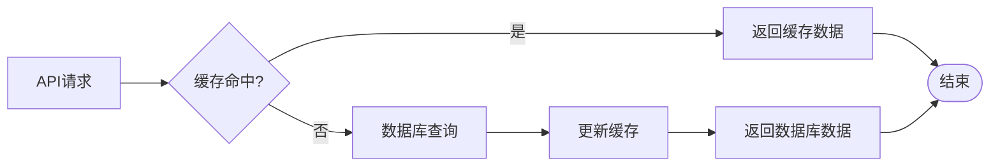

# 委托查询API

<cite>
**本文档引用的文件**
- [app/api/trade/orders/route.ts](file://app/api/trade/orders/route.ts)
- [types/index.ts](file://types/index.ts)
- [lib/constants.ts](file://lib/constants.ts)
- [lib/trading-rules.ts](file://lib/trading-rules.ts)
- [stores/useTradeStore.ts](file://stores/useTradeStore.ts)
- [components/trade/TradeHistory.tsx](file://components/trade/TradeHistory.tsx)
- [lib/supabase/server.ts](file://lib/supabase/server.ts)
- [supabase/schema.sql](file://supabase/schema.sql)
- [docs/API接口规范.md](file://docs/API接口规范.md)
</cite>

## 目录
1. [简介](#简介)
2. [项目结构](#项目结构)
3. [核心组件](#核心组件)
4. [架构概览](#架构概览)
5. [详细组件分析](#详细组件分析)
6. [依赖关系分析](#依赖关系分析)
7. [性能考虑](#性能考虑)
8. [故障排除指南](#故障排除指南)
9. [结论](#结论)
10. [附录](#附录)

## 简介

委托查询API是虚拟股票交易系统的核心功能之一，负责为用户提供委托记录的查询、筛选和分页展示能力。该API基于Next.js Serverless Functions构建，采用Supabase作为数据库后端，实现了完整的委托查询功能，包括状态筛选、分页查询、实时订阅等功能。

## 项目结构

委托查询API位于应用的API路由层，采用模块化的文件组织方式：



**图表来源**
- [app/api/trade/orders/route.ts:1-66](file://app/api/trade/orders/route.ts#L1-L66)
- [stores/useTradeStore.ts:1-192](file://stores/useTradeStore.ts#L1-L192)
- [supabase/schema.sql:75-91](file://supabase/schema.sql#L75-L91)

**章节来源**
- [app/api/trade/orders/route.ts:1-66](file://app/api/trade/orders/route.ts#L1-L66)
- [stores/useTradeStore.ts:1-192](file://stores/useTradeStore.ts#L1-L192)

## 核心组件

### API路由实现

委托查询API的核心实现位于`app/api/trade/orders/route.ts`文件中，提供了完整的GET /api/trade/orders接口：

- **认证机制**：使用Supabase Auth验证用户身份
- **查询参数处理**：支持status、page、limit参数
- **分页逻辑**：基于offset和range实现高效分页
- **状态筛选**：支持多种委托状态的过滤查询

### 数据模型定义

委托记录的数据结构在`types/index.ts`中明确定义：



**图表来源**
- [types/index.ts:68-80](file://types/index.ts#L68-L80)
- [types/index.ts:148-156](file://types/index.ts#L148-L156)

**章节来源**
- [types/index.ts:68-80](file://types/index.ts#L68-L80)
- [types/index.ts:148-156](file://types/index.ts#L148-L156)

## 架构概览

委托查询API采用分层架构设计，确保了良好的可维护性和扩展性：



**图表来源**
- [app/api/trade/orders/route.ts:5-65](file://app/api/trade/orders/route.ts#L5-L65)
- [stores/useTradeStore.ts:68-84](file://stores/useTradeStore.ts#L68-L84)

## 详细组件分析

### API接口实现

#### 请求处理流程



**图表来源**
- [app/api/trade/orders/route.ts:5-65](file://app/api/trade/orders/route.ts#L5-L65)

#### 查询参数详解

| 参数名 | 类型 | 必填 | 默认值 | 说明 |
|--------|------|------|--------|------|
| status | string | 否 | 无 | 委托状态过滤：pending、filled、partial、cancelled |
| page | number | 否 | 1 | 页码，从1开始 |
| limit | number | 否 | 20 | 每页记录数，最大100 |

#### 委托状态定义

根据数据库schema和业务逻辑，委托状态具有以下含义：



**图表来源**
- [supabase/schema.sql:84](file://supabase/schema.sql#L84)

**章节来源**
- [app/api/trade/orders/route.ts:19-42](file://app/api/trade/orders/route.ts#L19-L42)
- [supabase/schema.sql:84](file://supabase/schema.sql#L84)

### 数据库设计

#### orders表结构

| 字段名 | 类型 | 约束 | 说明 |
|--------|------|------|------|
| id | UUID | PRIMARY KEY | 委托记录唯一标识 |
| user_id | UUID | NOT NULL | 关联用户ID |
| stock_symbol | TEXT | NOT NULL | 股票代码 |
| type | TEXT | CHECK(type IN ('buy','sell')) | 交易类型 |
| price | DECIMAL(10,3) | NOT NULL | 委托价格 |
| quantity | INTEGER | NOT NULL | 委托数量 |
| filled_quantity | INTEGER | DEFAULT 0 | 已成交数量 |
| status | TEXT | CHECK(status IN ('pending','filled','partial','cancelled')) | 委托状态 |
| fee | DECIMAL(10,2) | DEFAULT 0 | 手续费 |
| created_at | TIMESTAMPTZ | DEFAULT NOW() | 创建时间 |

#### 索引设计



**图表来源**
- [supabase/schema.sql:89](file://supabase/schema.sql#L89)
- [supabase/schema.sql:90](file://supabase/schema.sql#L90)

**章节来源**
- [supabase/schema.sql:75-91](file://supabase/schema.sql#L75-L91)

### 前端集成

#### 状态管理集成

应用使用Zustand状态管理库来管理委托数据：



**图表来源**
- [stores/useTradeStore.ts:68-84](file://stores/useTradeStore.ts#L68-L84)
- [components/trade/TradeHistory.tsx:16-24](file://components/trade/TradeHistory.tsx#L16-L24)

**章节来源**
- [stores/useTradeStore.ts:68-84](file://stores/useTradeStore.ts#L68-L84)
- [components/trade/TradeHistory.tsx:16-24](file://components/trade/TradeHistory.tsx#L16-L24)

## 依赖关系分析

### 外部依赖



**图表来源**
- [app/api/trade/orders/route.ts:1-3](file://app/api/trade/orders/route.ts#L1-L3)
- [lib/trading-rules.ts:1-2](file://lib/trading-rules.ts#L1-L2)
- [lib/constants.ts:1-27](file://lib/constants.ts#L1-L27)

### 内部依赖



**图表来源**
- [stores/useTradeStore.ts:1-5](file://stores/useTradeStore.ts#L1-L5)
- [lib/supabase/server.ts:1-35](file://lib/supabase/server.ts#L1-L35)

**章节来源**
- [app/api/trade/orders/route.ts:1-3](file://app/api/trade/orders/route.ts#L1-L3)
- [stores/useTradeStore.ts:1-5](file://stores/useTradeStore.ts#L1-L5)

## 性能考虑

### 查询优化策略

1. **索引优化**
   - `user_id`索引：支持按用户快速查询
   - `created_at`索引：支持时间排序和分页查询

2. **分页优化**
   - 使用`range()`方法替代`offset`避免深度偏移
   - 限制最大分页大小防止资源消耗过大

3. **查询优化**
   - 只选择必要字段，避免`SELECT *`
   - 使用精确匹配过滤条件

### 缓存策略



### 监控指标

- 查询响应时间
- 数据库连接数
- 缓存命中率
- 错误率统计

## 故障排除指南

### 常见错误及解决方案

| 错误类型 | 错误码 | 可能原因 | 解决方案 |
|----------|--------|----------|----------|
| 认证失败 | 401 | 用户未登录或会话过期 | 检查JWT令牌有效性 |
| 参数错误 | 400 | 查询参数格式不正确 | 验证status、page、limit参数 |
| 数据库错误 | 500 | 数据库查询异常 | 检查索引和查询条件 |
| 权限错误 | 403 | 用户无访问权限 | 验证用户身份和数据隔离 |

### 性能问题诊断

1. **查询缓慢**
   - 检查索引是否存在
   - 分析查询执行计划
   - 优化分页参数

2. **内存泄漏**
   - 检查数据库连接管理
   - 验证实时订阅清理
   - 监控状态管理器

**章节来源**
- [app/api/trade/orders/route.ts:12-17](file://app/api/trade/orders/route.ts#L12-L17)
- [app/api/trade/orders/route.ts:44-50](file://app/api/trade/orders/route.ts#L44-L50)

## 结论

委托查询API提供了完整的委托记录查询功能，具备以下特点：

1. **功能完整性**：支持状态筛选、分页查询、实时订阅
2. **性能优化**：合理的索引设计和查询优化
3. **用户体验**：前后端协同的实时数据更新
4. **可扩展性**：清晰的架构设计便于功能扩展

该API为虚拟股票交易系统的核心功能之一，为用户提供了便捷的委托记录管理能力。

## 附录

### API使用示例

```javascript
// 基本查询
fetch('/api/trade/orders')

// 状态筛选
fetch('/api/trade/orders?status=pending')

// 分页查询
fetch('/api/trade/orders?page=2&limit=50')

// 组合查询
fetch('/api/trade/orders?status=cancelled&page=1&limit=30')
```

### 最佳实践建议

1. **参数验证**：始终验证查询参数的有效性
2. **错误处理**：完善的错误捕获和用户友好的错误消息
3. **性能监控**：建立查询性能监控机制
4. **安全考虑**：确保用户数据隔离和访问控制
5. **缓存策略**：合理使用缓存提高响应速度