# 持仓查询API

<cite>
**本文档引用的文件**
- [app/api/trade/positions/route.ts](file://app/api/trade/positions/route.ts)
- [lib/trading-rules.ts](file://lib/trading-rules.ts)
- [types/index.ts](file://types/index.ts)
- [stores/useTradeStore.ts](file://stores/useTradeStore.ts)
- [lib/constants.ts](file://lib/constants.ts)
- [components/portfolio/PositionList.tsx](file://components/portfolio/PositionList.tsx)
- [app/api/cron/update-prices/route.ts](file://app/api/cron/update-prices/route.ts)
- [stores/useUserStore.ts](file://stores/useUserStore.ts)
- [lib/supabase/server.ts](file://lib/supabase/server.ts)
- [components/portfolio/AssetCard.tsx](file://components/portfolio/AssetCard.tsx)
- [docs/prd.md](file://docs/prd.md)
</cite>

## 目录
1. [简介](#简介)
2. [项目结构](#项目结构)
3. [核心组件](#核心组件)
4. [架构概览](#架构概览)
5. [详细组件分析](#详细组件分析)
6. [依赖关系分析](#依赖关系分析)
7. [性能考虑](#性能考虑)
8. [故障排除指南](#故障排除指南)
9. [结论](#结论)

## 简介

本文档详细说明了虚拟股票交易系统中的持仓查询API，特别是GET /api/trade/positions接口的完整实现。该API负责为已认证用户提供当前持有的股票持仓信息，包括实时价格、市值计算和浮动盈亏统计。

系统采用Next.js构建，使用Supabase作为数据库后端，实现了完整的虚拟股票交易功能，包括实时股价更新、交易执行和持仓管理。

## 项目结构

虚拟股票交易系统采用模块化的文件组织方式，主要分为以下几个核心部分：

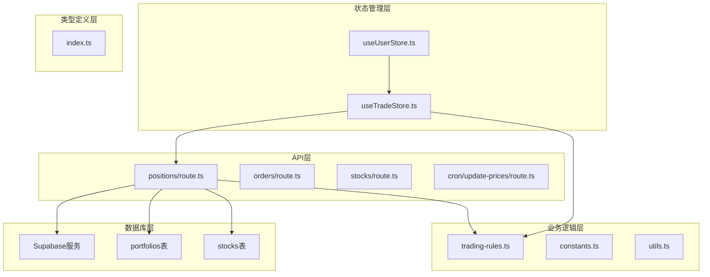

**图表来源**
- [app/api/trade/positions/route.ts:1-46](file://app/api/trade/positions/route.ts#L1-L46)
- [lib/trading-rules.ts:1-272](file://lib/trading-rules.ts#L1-L272)
- [stores/useTradeStore.ts:1-192](file://stores/useTradeStore.ts#L1-L192)

**章节来源**
- [app/api/trade/positions/route.ts:1-46](file://app/api/trade/positions/route.ts#L1-L46)
- [lib/trading-rules.ts:1-272](file://lib/trading-rules.ts#L1-L272)
- [stores/useTradeStore.ts:1-192](file://stores/useTradeStore.ts#L1-L192)

## 核心组件

### 持仓查询API接口

GET /api/trade/positions 接口是系统的核心功能之一，负责返回当前用户的持仓信息。该接口实现了以下关键功能：

1. **用户身份验证**：通过Supabase认证系统验证请求用户的身份
2. **数据查询**：从portfolios表中获取用户的持仓记录
3. **关联查询**：同时获取股票基本信息（名称、当前价格等）
4. **过滤条件**：只返回持有数量大于0的持仓记录
5. **排序处理**：按最后更新时间降序排列

### 数据模型设计

系统使用标准化的数据模型来表示持仓信息：

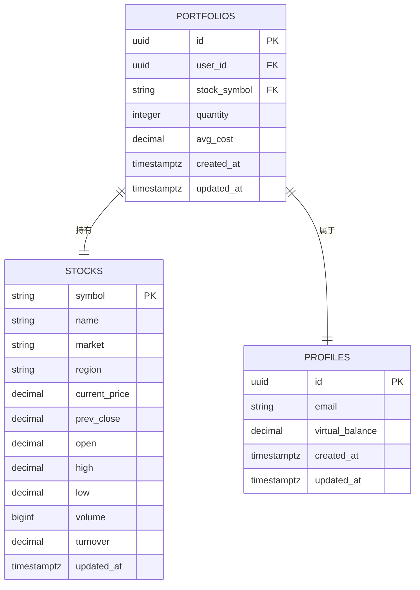

**图表来源**
- [docs/prd.md:129-141](file://docs/prd.md#L129-L141)
- [docs/prd.md:113-127](file://docs/prd.md#L113-L127)

**章节来源**
- [types/index.ts:37-51](file://types/index.ts#L37-L51)
- [docs/prd.md:129-141](file://docs/prd.md#L129-L141)

## 架构概览

系统采用前后端分离的架构设计，API层与前端应用通过RESTful接口通信：

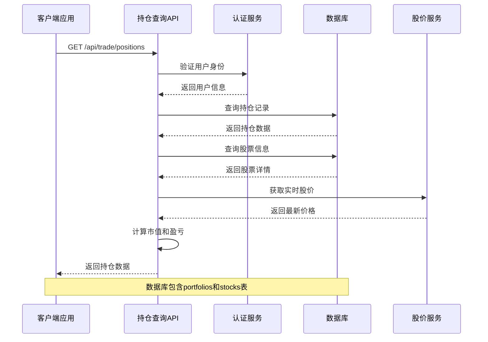

**图表来源**
- [app/api/trade/positions/route.ts:5-37](file://app/api/trade/positions/route.ts#L5-L37)
- [stores/useTradeStore.ts:33-66](file://stores/useTradeStore.ts#L33-L66)

## 详细组件分析

### 持仓查询API实现

#### 接口定义和参数

GET /api/trade/positions 接口支持以下功能：
- **路径参数**：无
- **查询参数**：无
- **请求头**：标准HTTP头部
- **响应格式**：JSON

#### 认证机制

API使用Supabase的服务器端客户端进行用户认证：

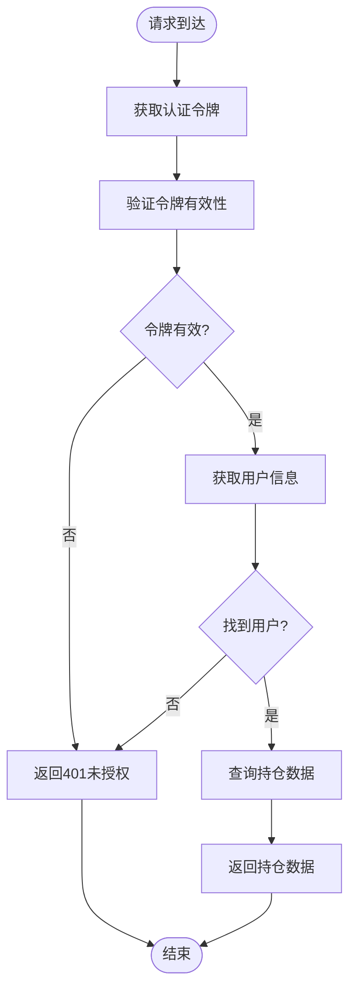

**图表来源**
- [app/api/trade/positions/route.ts:10-17](file://app/api/trade/positions/route.ts#L10-L17)

#### 数据查询逻辑

API执行以下数据库查询操作：

1. **用户识别**：通过认证服务获取当前用户ID
2. **主表查询**：从portfolios表查询用户持仓
3. **关联查询**：通过stock关联查询股票基本信息
4. **过滤条件**：只返回持有数量大于0的持仓
5. **排序处理**：按updated_at降序排列

#### 实时数据计算

前端应用在接收到API响应后，会进行实时数据计算：

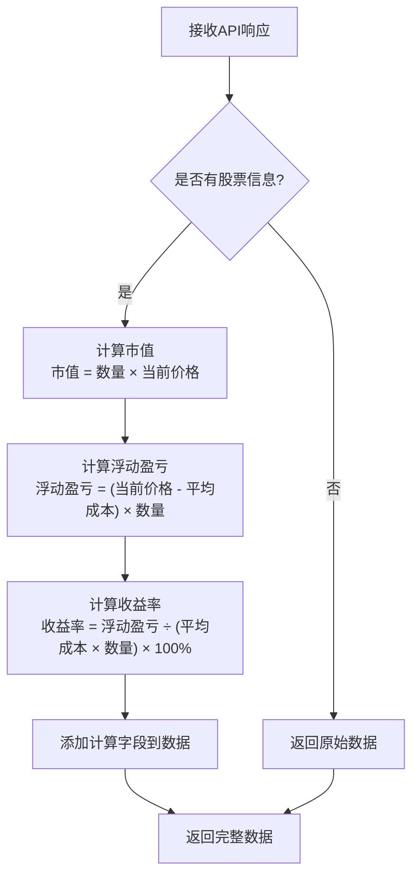

**图表来源**
- [stores/useTradeStore.ts:42-57](file://stores/useTradeStore.ts#L42-L57)
- [lib/trading-rules.ts:252-264](file://lib/trading-rules.ts#L252-L264)

**章节来源**
- [app/api/trade/positions/route.ts:19-37](file://app/api/trade/positions/route.ts#L19-L37)
- [stores/useTradeStore.ts:33-66](file://stores/useTradeStore.ts#L33-L66)

### 数据结构定义

#### 持仓数据模型

```typescript
interface Portfolio {
  id: string;
  user_id: string;
  stock_symbol: string;
  quantity: number;
  avg_cost: number;
  created_at: string;
  updated_at: string;
  
  // 关联字段
  stock?: Stock;
  
  // 计算字段
  market_value?: number;
  profit_loss?: number;
  profit_loss_percent?: number;
}
```

#### 股票数据模型

```typescript
interface Stock {
  symbol: string;
  name: string;
  market: 'A' | 'HK' | 'US';
  current_price: number;
  prev_close: number;
  open: number;
  high: number;
  low: number;
  volume: number;
  updated_at: string;
  
  // 计算字段
  change?: number;
  change_percent?: number;
}
```

**章节来源**
- [types/index.ts:37-51](file://types/index.ts#L37-L51)
- [types/index.ts:11-25](file://types/index.ts#L11-L25)

### 实时价格更新机制

#### 定时任务架构

系统使用定时任务定期更新股票价格：

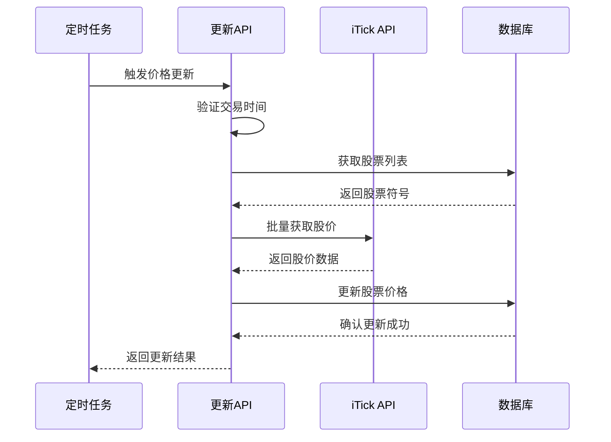

**图表来源**
- [app/api/cron/update-prices/route.ts:49-133](file://app/api/cron/update-prices/route.ts#L49-L133)

#### 价格更新策略

1. **批量处理**：每次最多处理5只股票，避免API限流
2. **市场分组**：沪市和深市分别处理，提高效率
3. **错误处理**：单个股票错误不影响整体更新
4. **交易时间检查**：非交易时间自动跳过更新

**章节来源**
- [app/api/cron/update-prices/route.ts:24-124](file://app/api/cron/update-prices/route.ts#L24-L124)

### 盈亏计算算法

#### 浮动盈亏计算

系统实现了精确的浮动盈亏计算算法：

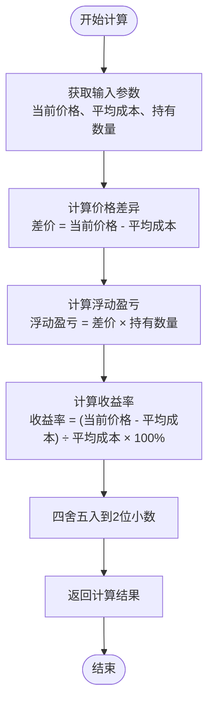

**图表来源**
- [lib/trading-rules.ts:252-264](file://lib/trading-rules.ts#L252-L264)

#### 市值计算

市值计算采用简单的乘法运算：
- **公式**：市值 = 持有数量 × 当前价格
- **精度**：保留2位小数

**章节来源**
- [lib/trading-rules.ts:252-271](file://lib/trading-rules.ts#L252-L271)

### 资产概览计算

#### 总资产统计

系统提供完整的资产概览功能：

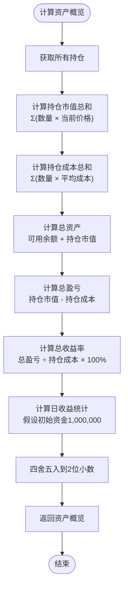

**图表来源**
- [stores/useUserStore.ts:50-83](file://stores/useUserStore.ts#L50-L83)

**章节来源**
- [stores/useUserStore.ts:50-83](file://stores/useUserStore.ts#L50-L83)

### 前端展示组件

#### 持仓列表组件

前端使用React组件展示持仓信息：

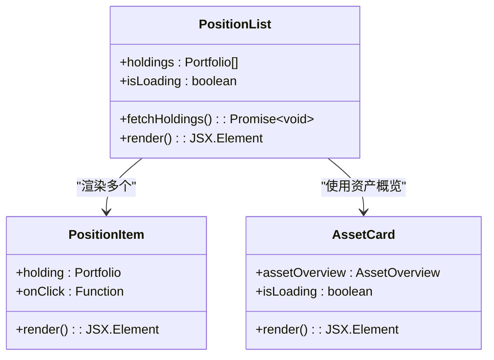

**图表来源**
- [components/portfolio/PositionList.tsx:24-112](file://components/portfolio/PositionList.tsx#L24-L112)
- [components/portfolio/AssetCard.tsx:7-63](file://components/portfolio/AssetCard.tsx#L7-L63)

**章节来源**
- [components/portfolio/PositionList.tsx:24-194](file://components/portfolio/PositionList.tsx#L24-L194)
- [components/portfolio/AssetCard.tsx:7-63](file://components/portfolio/AssetCard.tsx#L7-L63)

## 依赖关系分析

### 组件间依赖关系

系统各组件之间的依赖关系如下：

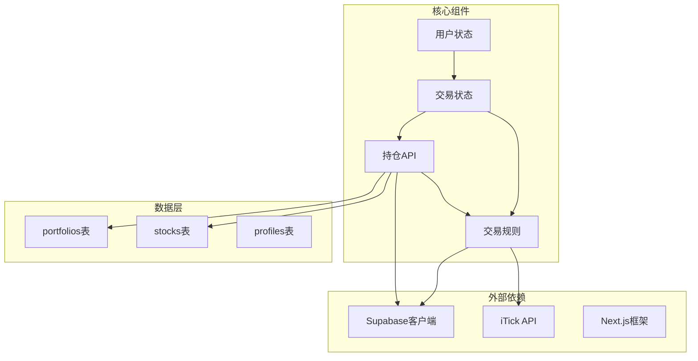

**图表来源**
- [app/api/trade/positions/route.ts:1-46](file://app/api/trade/positions/route.ts#L1-L46)
- [stores/useTradeStore.ts:1-192](file://stores/useTradeStore.ts#L1-L192)

### 数据库模式设计

系统使用PostgreSQL数据库，核心表结构设计如下：

#### 持仓表(portfolios)

| 字段名 | 类型 | 约束 | 描述 |
|--------|------|------|------|
| id | UUID | PRIMARY KEY | 主键标识符 |
| user_id | UUID | FOREIGN KEY | 用户标识符 |
| stock_symbol | TEXT | FOREIGN KEY | 股票代码 |
| quantity | INTEGER | CHECK (quantity > 0) | 持有数量 |
| avg_cost | DECIMAL(10,3) | DEFAULT 0 | 平均成本 |
| created_at | TIMESTAMPTZ | DEFAULT NOW() | 创建时间 |
| updated_at | TIMESTAMPTZ | DEFAULT NOW() | 更新时间 |

#### 股票表(stocks)

| 字段名 | 类型 | 约束 | 描述 |
|--------|------|------|------|
| symbol | TEXT | PRIMARY KEY | 股票代码 |
| name | TEXT | NOT NULL | 股票名称 |
| market | TEXT | CHECK (market IN ('A','HK','US')) | 市场类型 |
| current_price | DECIMAL(10,3) | DEFAULT 0 | 当前价格 |
| prev_close | DECIMAL(10,3) | DEFAULT 0 | 昨收价 |
| open | DECIMAL(10,3) | DEFAULT 0 | 开盘价 |
| high | DECIMAL(10,3) | DEFAULT 0 | 最高价 |
| low | DECIMAL(10,3) | DEFAULT 0 | 最低价 |
| volume | BIGINT | DEFAULT 0 | 成交量 |
| turnover | DECIMAL(20,2) | DEFAULT 0 | 成交额 |
| updated_at | TIMESTAMPTZ | DEFAULT NOW() | 更新时间 |

**章节来源**
- [docs/prd.md:129-141](file://docs/prd.md#L129-L141)
- [docs/prd.md:113-127](file://docs/prd.md#L113-L127)

## 性能考虑

### 缓存策略

系统采用了多层次的缓存策略来优化性能：

#### 前端缓存

1. **状态缓存**：使用Zustand状态管理库缓存持仓数据
2. **计算缓存**：缓存实时计算结果，避免重复计算
3. **订阅机制**：通过Supabase实时订阅监听数据变化

#### 后端缓存

1. **数据库索引**：为常用查询字段建立索引
2. **批量查询**：减少数据库连接次数
3. **查询优化**：使用关联查询减少N+1问题

### 性能优化建议

#### API层面优化

1. **分页查询**：对于大量持仓用户，考虑实现分页功能
2. **条件过滤**：支持按股票代码、时间范围等条件过滤
3. **字段选择**：使用SELECT指定需要的字段，避免全表查询

#### 数据库层面优化

1. **索引优化**：确保user_id和stock_symbol字段有适当索引
2. **查询优化**：使用EXPLAIN ANALYZE分析慢查询
3. **连接池**：合理配置数据库连接池大小

#### 前端层面优化

1. **虚拟滚动**：对于大量持仓数据使用虚拟滚动
2. **懒加载**：实现按需加载和懒加载机制
3. **防抖节流**：对频繁的API调用使用防抖节流

## 故障排除指南

### 常见问题及解决方案

#### 认证失败

**问题描述**：用户未登录或认证令牌无效

**解决方法**：
1. 检查浏览器Cookie设置
2. 确认Supabase认证服务正常运行
3. 验证用户会话状态

#### 数据查询错误

**问题描述**：API返回数据库查询错误

**解决方法**：
1. 检查数据库连接配置
2. 验证表结构完整性
3. 确认用户权限设置

#### 实时数据更新失败

**问题描述**：股价更新定时任务失败

**解决方法**：
1. 检查iTick API密钥配置
2. 验证网络连接状态
3. 查看定时任务日志

### 错误处理机制

系统实现了完善的错误处理机制：

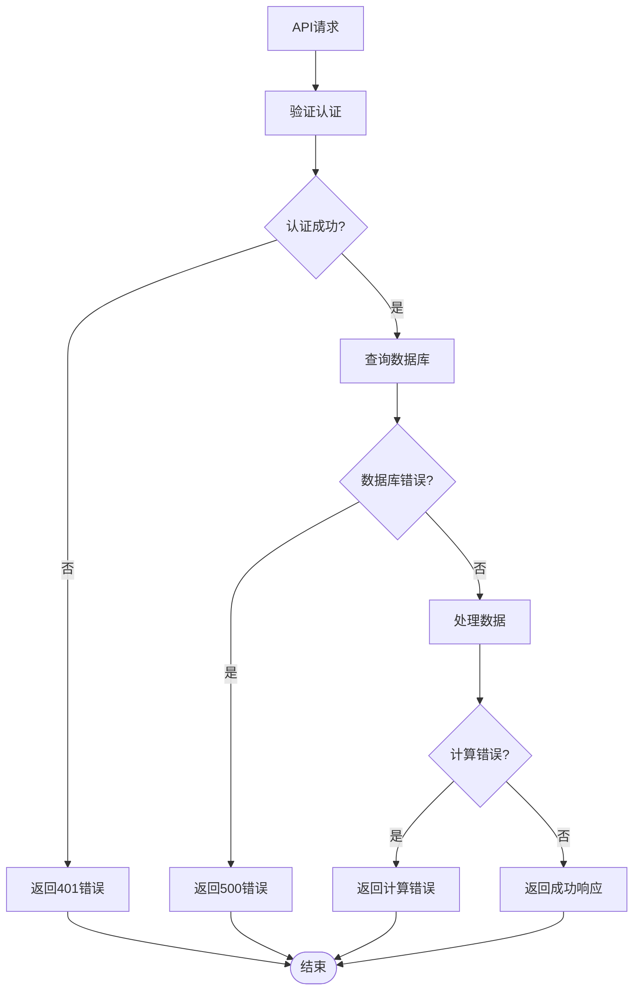

**图表来源**
- [app/api/trade/positions/route.ts:38-44](file://app/api/trade/positions/route.ts#L38-L44)

**章节来源**
- [app/api/trade/positions/route.ts:38-44](file://app/api/trade/positions/route.ts#L38-L44)

## 结论

虚拟股票交易系统的持仓查询API实现了完整的实时持仓管理功能。通过合理的架构设计、清晰的数据模型和高效的性能优化策略，系统能够为用户提供准确、及时的持仓信息。

### 主要特性总结

1. **实时性**：通过定时任务和实时订阅机制确保数据及时更新
2. **准确性**：精确的盈亏计算算法和数据验证机制
3. **可扩展性**：模块化的架构设计支持功能扩展
4. **可靠性**：完善的错误处理和监控机制
5. **用户体验**：直观的前端展示和交互设计

### 技术优势

- **技术栈成熟**：基于Next.js和Supabase的现代Web开发技术
- **数据一致性**：通过数据库约束和事务保证数据完整性
- **性能优化**：多层缓存和查询优化策略
- **安全性**：完善的认证授权和数据访问控制

该系统为虚拟股票交易提供了坚实的技术基础，能够满足用户对实时行情和持仓管理的需求。