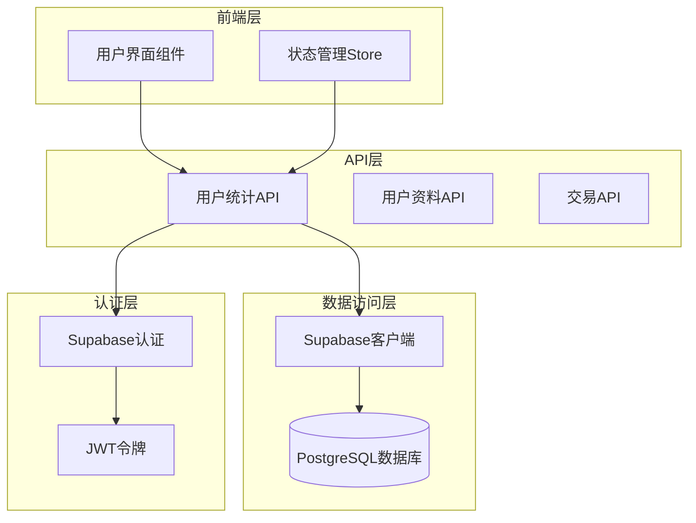
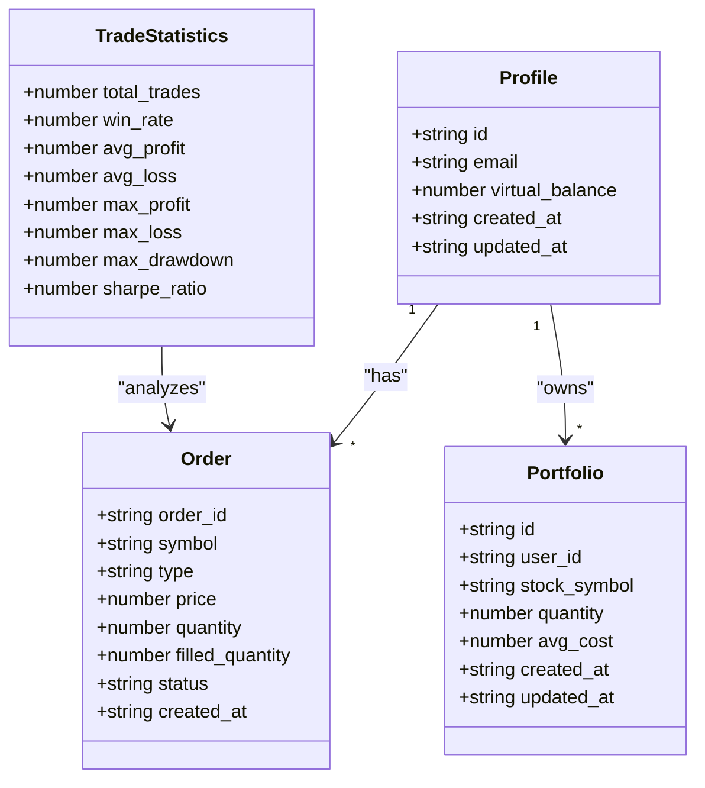
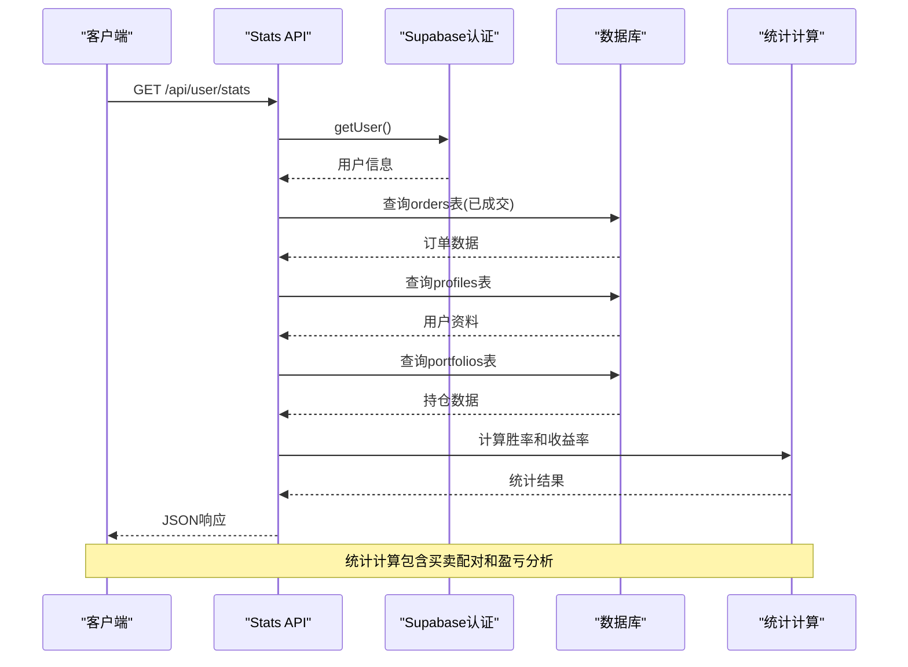
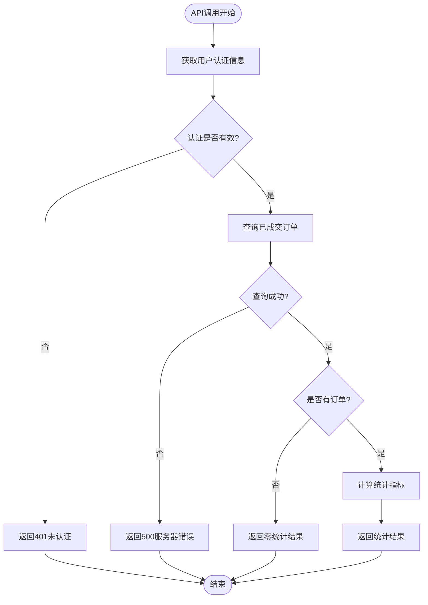
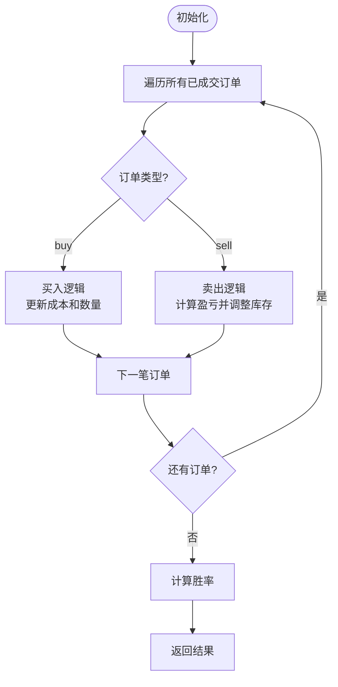
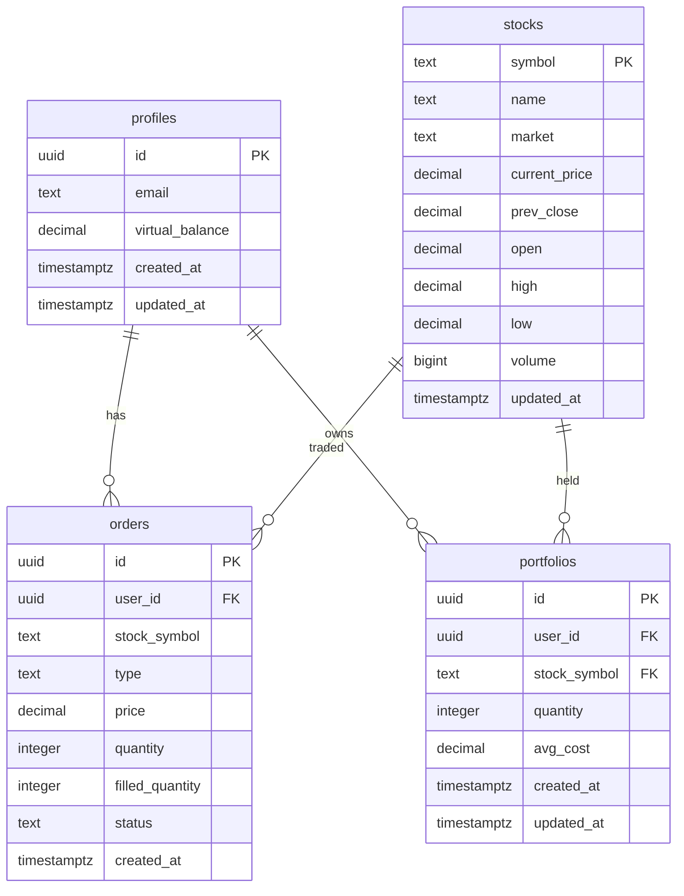
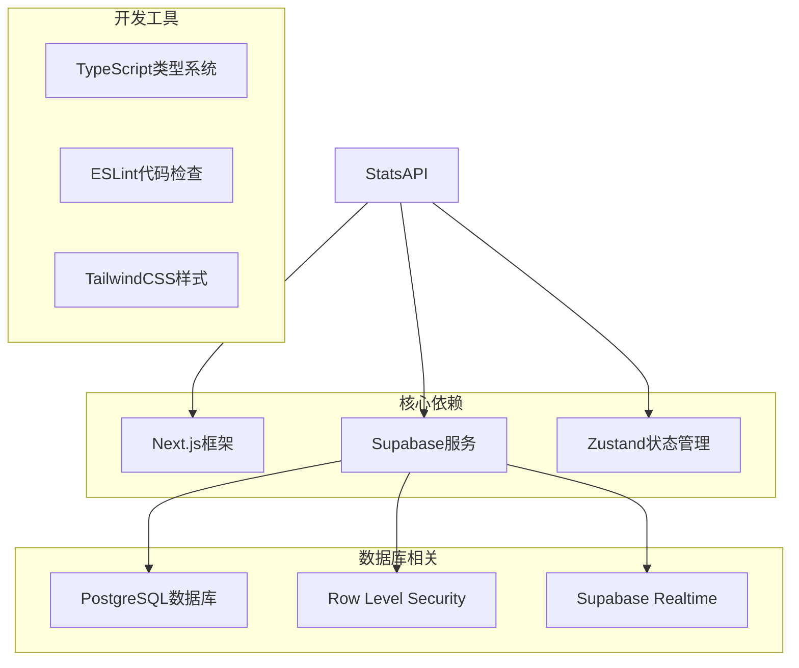
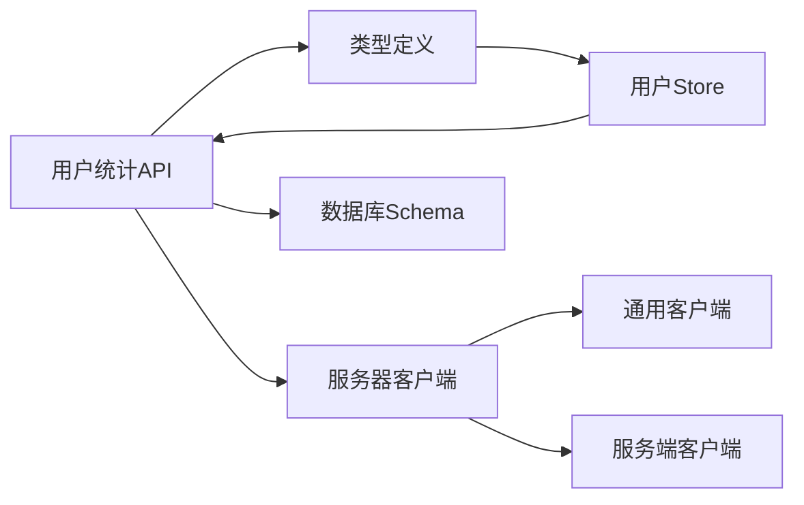

# 用户统计API

<cite>
**本文档引用的文件**
- [app/api/user/stats/route.ts](file://app/api/user/stats/route.ts)
- [lib/supabase/server.ts](file://lib/supabase/server.ts)
- [lib/supabase/client.ts](file://lib/supabase/client.ts)
- [lib/supabase/service.ts](file://lib/supabase/service.ts)
- [types/index.ts](file://types/index.ts)
- [stores/useUserStore.ts](file://stores/useUserStore.ts)
- [stores/useAuthStore.ts](file://stores/useAuthStore.ts)
- [supabase/schema.sql](file://supabase/schema.sql)
- [docs/API接口规范.md](file://docs/API接口规范.md)
- [app/api/user/profile/route.ts](file://app/api/user/profile/route.ts)
</cite>

## 目录
1. [简介](#简介)
2. [项目结构](#项目结构)
3. [核心组件](#核心组件)
4. [架构概览](#架构概览)
5. [详细组件分析](#详细组件分析)
6. [依赖关系分析](#依赖关系分析)
7. [性能考虑](#性能考虑)
8. [故障排除指南](#故障排除指南)
9. [结论](#结论)

## 简介

用户统计API是虚拟股票交易系统中的核心功能模块，负责为已认证用户提供个人交易统计数据。该API基于Next.js App Router构建，采用Server-Side Rendering模式，通过Supabase进行数据访问和认证管理。

该API主要提供以下统计指标：
- 总交易次数
- 胜率（基于买卖配对的盈利概率）
- 最大回撤（预留字段，暂未实现）
- 总收益率（基于初始资金1,000,000计算）

## 项目结构

虚拟股票交易系统采用现代化的Next.js架构，用户统计API位于API路由层，与前端组件和数据存储层形成清晰的分层结构。



**图表来源**
- [app/api/user/stats/route.ts:1-103](file://app/api/user/stats/route.ts#L1-L103)
- [lib/supabase/server.ts:1-35](file://lib/supabase/server.ts#L1-L35)
- [supabase/schema.sql:1-152](file://supabase/schema.sql#L1-L152)

**章节来源**
- [app/api/user/stats/route.ts:1-103](file://app/api/user/stats/route.ts#L1-L103)
- [lib/supabase/server.ts:1-35](file://lib/supabase/server.ts#L1-L35)
- [supabase/schema.sql:1-152](file://supabase/schema.sql#L1-L152)

## 核心组件

### 统计API核心逻辑

用户统计API的核心实现位于`app/api/user/stats/route.ts`文件中，采用异步函数处理GET请求，实现了完整的认证、数据查询和统计计算流程。

#### 认证机制
API通过Supabase的`getUser()`方法获取当前认证用户，确保只有已登录用户才能访问统计信息。

#### 数据查询策略
系统从三个核心表中获取数据：
- `orders`表：获取用户的已成交委托订单
- `profiles`表：获取用户虚拟资金余额
- `portfolios`表：获取用户当前持仓情况

#### 统计计算算法
API实现了基于买卖配对的胜率计算算法，通过维护每个股票的买入成本和数量来准确计算每笔交易的盈亏情况。

**章节来源**
- [app/api/user/stats/route.ts:4-102](file://app/api/user/stats/route.ts#L4-L102)

### 数据模型定义

系统使用TypeScript接口定义了完整的数据模型，包括用户资料、股票信息、交易记录等核心实体。



**图表来源**
- [types/index.ts:2-166](file://types/index.ts#L2-L166)

**章节来源**
- [types/index.ts:1-166](file://types/index.ts#L1-L166)

## 架构概览

用户统计API采用分层架构设计，确保了良好的可维护性和扩展性。



**图表来源**
- [app/api/user/stats/route.ts:5-97](file://app/api/user/stats/route.ts#L5-L97)
- [lib/supabase/server.ts:9-34](file://lib/supabase/server.ts#L9-L34)

### 数据流分析

API的数据流遵循严格的顺序处理模式：

1. **认证阶段**：验证用户身份，确保数据安全
2. **数据收集**：并行查询多个数据表获取完整信息
3. **计算处理**：执行复杂的统计算法
4. **结果封装**：格式化输出JSON响应

**章节来源**
- [app/api/user/stats/route.ts:6-97](file://app/api/user/stats/route.ts#L6-L97)

## 详细组件分析

### 统计API实现详解

#### 认证与授权
API首先通过Supabase的认证服务获取当前用户信息，这是系统安全性的关键保障。



**图表来源**
- [app/api/user/stats/route.ts:7-35](file://app/api/user/stats/route.ts#L7-L35)

#### 胜率计算算法

API实现了精确的买卖配对算法来计算胜率：

1. **买入处理**：记录每种股票的总成本和数量
2. **卖出处理**：计算平均买入价并比较卖出价格
3. **盈亏判断**：卖出价 > 平均买入价视为盈利
4. **库存调整**：减少相应的持仓数量



**图表来源**
- [app/api/user/stats/route.ts:38-62](file://app/api/user/stats/route.ts#L38-L62)

#### 收益率计算

API通过以下步骤计算总收益率：

1. **资产计算**：虚拟余额 + 当前持仓市值
2. **基准设定**：以1,000,000作为初始资金
3. **百分比计算**：((总资产 - 初始资金) / 初始资金) × 100

**章节来源**
- [app/api/user/stats/route.ts:66-90](file://app/api/user/stats/route.ts#L66-L90)

### Supabase集成架构

#### 客户端类型分离

系统区分了不同场景下的Supabase客户端：

```mermaid
graph LR
subgraph "客户端类型"
BrowserClient[浏览器客户端<br/>createClient()<br/>用于前端]
ServerClient[服务器客户端<br/>createClient()<br/>用于API路由]
ServiceClient[服务端客户端<br/>createServiceClient()<br/>绕过RLS]
end
subgraph "应用场景"
Frontend[前端组件]
API[API路由]
Admin[管理员功能]
end
BrowserClient --> Frontend
ServerClient --> API
ServiceClient --> Admin
```

**图表来源**
- [lib/supabase/client.ts:1-9](file://lib/supabase/client.ts#L1-L9)
- [lib/supabase/server.ts:1-35](file://lib/supabase/server.ts#L1-L35)
- [lib/supabase/service.ts:1-22](file://lib/supabase/service.ts#L1-L22)

**章节来源**
- [lib/supabase/client.ts:1-9](file://lib/supabase/client.ts#L1-L9)
- [lib/supabase/server.ts:1-35](file://lib/supabase/server.ts#L1-L35)
- [lib/supabase/service.ts:1-22](file://lib/supabase/service.ts#L1-L22)

### 数据库Schema设计

系统使用PostgreSQL作为数据存储，通过Supabase提供的Row Level Security (RLS) 实现数据隔离。



**图表来源**
- [supabase/schema.sql:6-152](file://supabase/schema.sql#L6-L152)

**章节来源**
- [supabase/schema.sql:1-152](file://supabase/schema.sql#L1-L152)

## 依赖关系分析

### 外部依赖

用户统计API依赖于多个外部库和服务：



**图表来源**
- [package.json](file://package.json)

### 内部模块依赖

API模块之间的依赖关系相对简单，主要体现在数据类型共享和工具函数复用上。



**图表来源**
- [app/api/user/stats/route.ts:1-2](file://app/api/user/stats/route.ts#L1-L2)
- [types/index.ts:1-166](file://types/index.ts#L1-L166)

**章节来源**
- [app/api/user/stats/route.ts:1-2](file://app/api/user/stats/route.ts#L1-L2)
- [types/index.ts:1-166](file://types/index.ts#L1-L166)

## 性能考虑

### 查询优化策略

1. **索引利用**：数据库表建立了适当的索引以优化查询性能
2. **数据过滤**：API只查询已成交的订单，减少数据量
3. **批量处理**：使用单次查询获取所需的所有数据

### 缓存策略

虽然当前实现没有显式的缓存机制，但可以考虑以下优化方案：

- **短期缓存**：对频繁访问的统计数据进行缓存
- **增量更新**：通过Supabase Realtime订阅数据变更
- **预计算**：定期计算常用统计指标

### 扩展性考虑

随着用户量的增长，可能需要考虑：

- **分页查询**：对于大量订单数据的分页处理
- **并发控制**：限制同时进行的统计计算任务
- **异步处理**：将复杂的统计计算放到后台任务中

## 故障排除指南

### 常见问题及解决方案

#### 认证失败
**症状**：返回401未认证错误
**原因**：用户未登录或JWT令牌无效
**解决**：检查用户登录状态和认证流程

#### 数据查询错误
**症状**：返回500服务器内部错误
**原因**：数据库连接或查询异常
**解决**：检查数据库连接配置和表结构

#### 统计结果异常
**症状**：胜率或收益率计算不正确
**原因**：买卖配对算法或数据处理逻辑问题
**解决**：验证订单数据完整性和计算逻辑

### 调试建议

1. **日志记录**：在关键节点添加详细的日志输出
2. **单元测试**：为统计计算逻辑编写测试用例
3. **性能监控**：监控API响应时间和数据库查询性能

**章节来源**
- [app/api/user/stats/route.ts:98-101](file://app/api/user/stats/route.ts#L98-L101)

## 结论

用户统计API是虚拟股票交易系统的重要组成部分，它通过精确的统计算法和安全的认证机制，为用户提供了全面的交易表现分析。该API的设计体现了现代Web应用的最佳实践，包括：

- **安全性**：基于JWT的认证机制确保数据安全
- **可扩展性**：清晰的架构设计便于功能扩展
- **性能优化**：合理的数据查询策略和索引设计
- **用户体验**：及时的统计信息反馈

未来可以考虑的功能增强包括：
- 更丰富的统计指标（如夏普比率、最大回撤等）
- 实时统计数据更新
- 多维度的交易分析报告
- 历史数据的长期趋势分析

通过持续的优化和改进，用户统计API将成为提升用户体验和促进投资决策的重要工具。