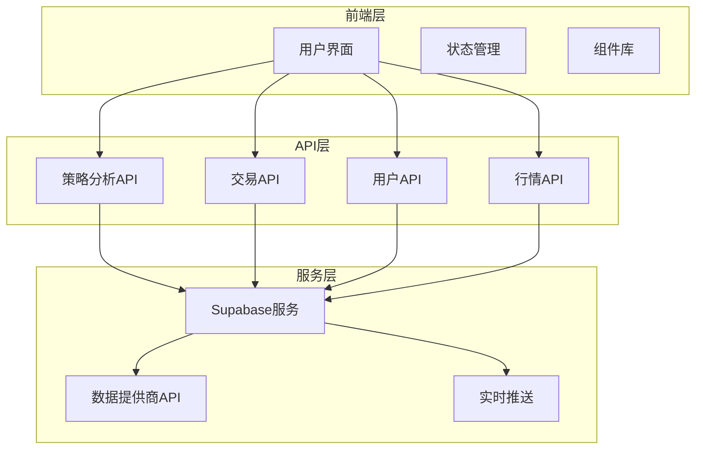
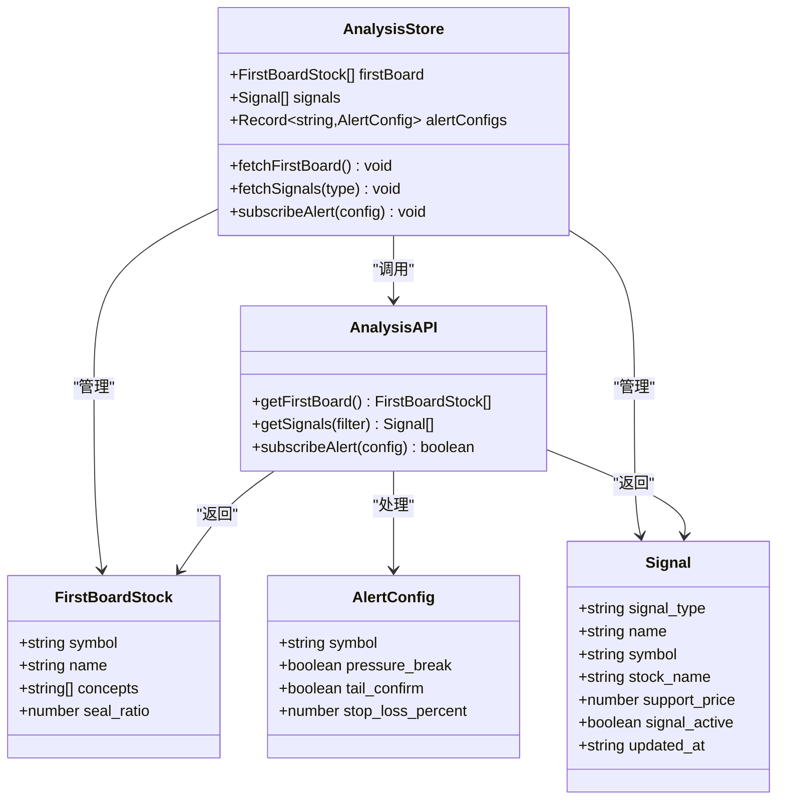
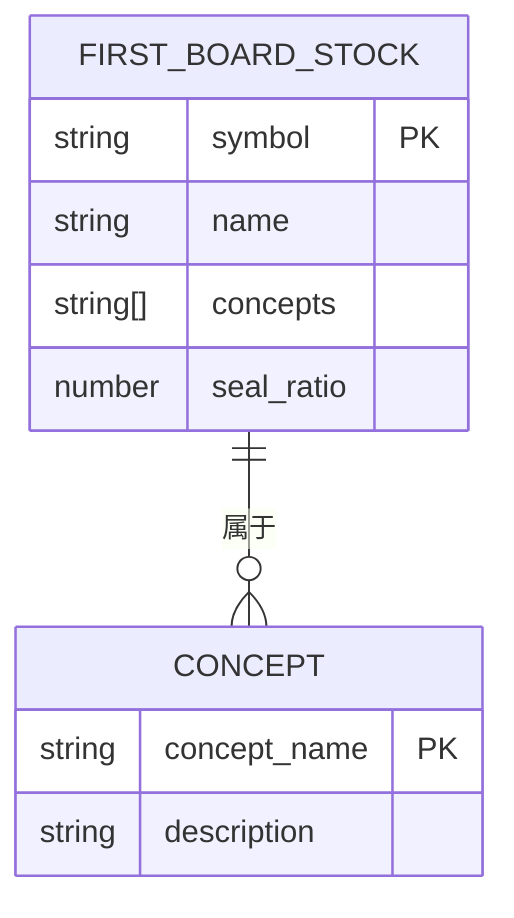
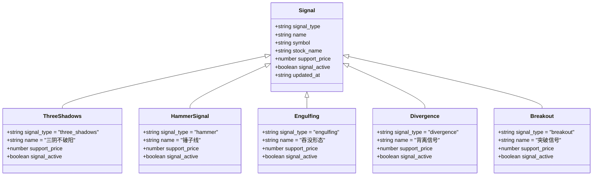
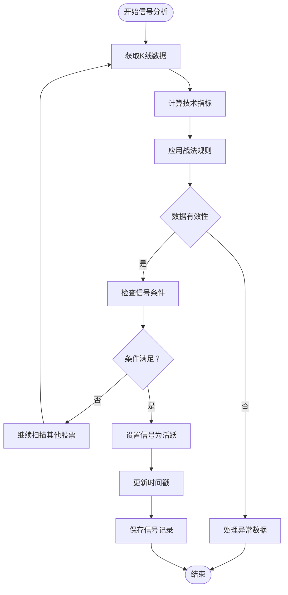
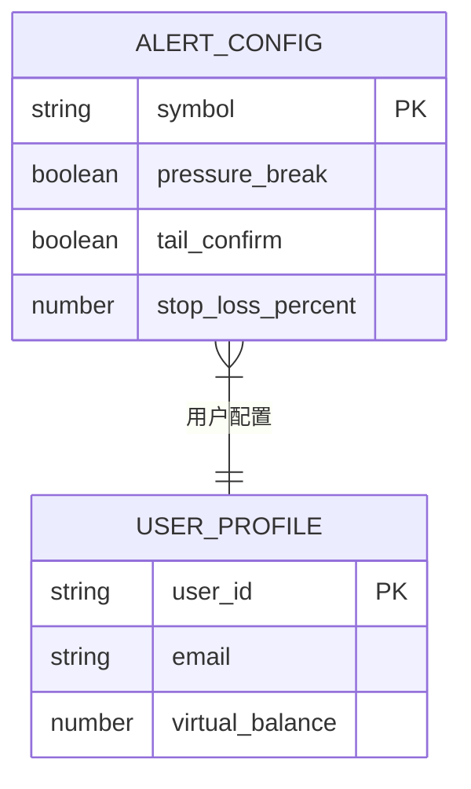
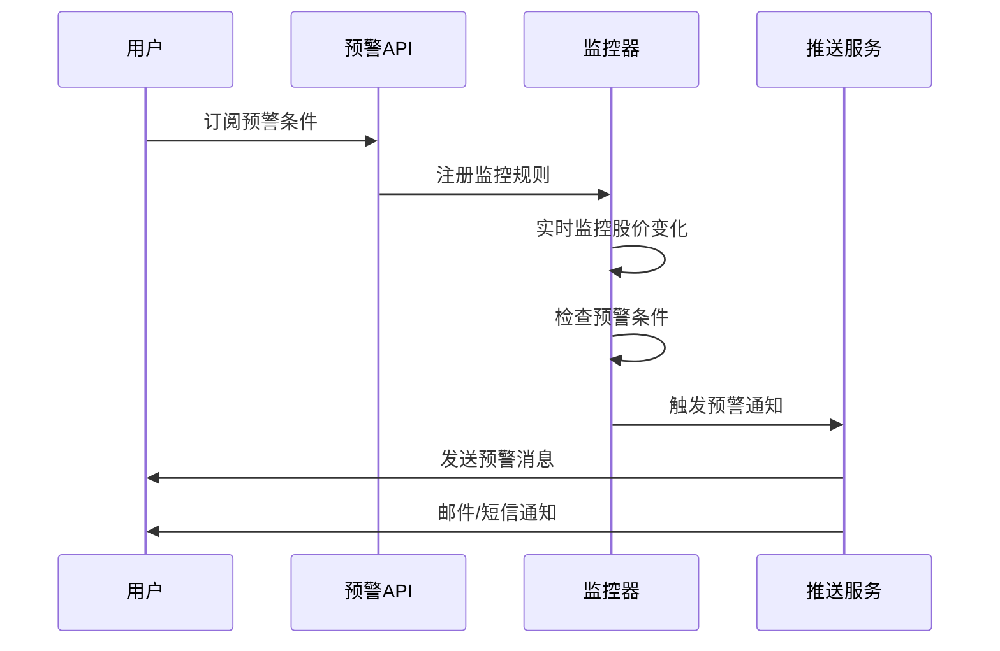
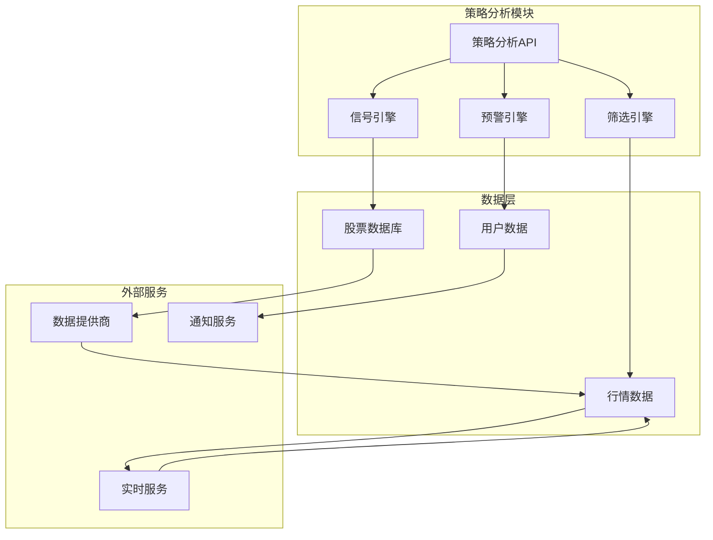

# 策略分析API

<cite>
**本文引用的文件**
- [API接口规范.md](file://docs/API接口规范.md)
- [策略分析类型定义](file://types/index.ts)
- [策略分析状态管理](file://docs/状态管理结构.md)
- [PRD需求文档](file://docs/prd.md)
- [交易规则工具](file://lib/trading-rules.ts)
- [常量配置](file://lib/constants.ts)
- [自选股API](file://app/api/watchlist/route.ts)
- [自选股符号API](file://app/api/watchlist/[symbol]/route.ts)
</cite>

## 目录
1. [简介](#简介)
2. [项目结构](#项目结构)
3. [核心组件](#核心组件)
4. [架构概览](#架构概览)
5. [详细组件分析](#详细组件分析)
6. [依赖关系分析](#依赖关系分析)
7. [性能考虑](#性能考虑)
8. [故障排除指南](#故障排除指南)
9. [结论](#结论)
10. [附录](#附录)

## 简介

策略分析API是虚拟股票交易系统中的核心分析模块，为用户提供专业的股票筛选、技术信号识别和风险预警功能。该模块实现了五大回调战法信号识别、首板观察池筛选、预警条件订阅等高级分析功能，帮助用户在零风险环境下验证投资策略。

系统采用现代化的Web技术栈，基于Next.js 15的App Router架构，结合Supabase提供实时数据同步和用户认证服务。策略分析API通过RESTful接口提供标准化的数据访问，支持实时行情推送和历史数据分析。

## 项目结构

策略分析API位于应用的API路由层，与核心交易模块、用户管理模块协同工作，形成完整的金融分析生态系统。



**图表来源**
- [策略分析状态管理:312-377](file://docs/状态管理结构.md#L312-L377)
- [PRD需求文档:182-208](file://docs/prd.md#L182-L208)

**章节来源**
- [PRD需求文档:1-269](file://docs/prd.md#L1-L269)

## 核心组件

策略分析API包含三个核心功能模块：

### 1. 首板观察池接口
提供首板股票的智能筛选功能，支持概念板块分类和封板强度指标分析。

### 2. 五大回调战法信号接口
识别并提供五种经典技术回调战法的信号，包括支撑位价格和活跃状态管理。

### 3. 预警条件订阅接口
允许用户自定义风险预警条件，包括压力位突破、尾盘确认和止损百分比设置。

**章节来源**
- [API接口规范.md:467-551](file://docs/API接口规范.md#L467-L551)
- [策略分析类型定义:123-146](file://types/index.ts#L123-L146)

## 架构概览

策略分析API采用分层架构设计，确保功能模块的高内聚低耦合。



**图表来源**
- [策略分析类型定义:123-146](file://types/index.ts#L123-L146)
- [策略分析状态管理:314-373](file://docs/状态管理结构.md#L314-L373)

## 详细组件分析

### 首板观察池接口

首板观察池接口提供专业的股票筛选功能，帮助用户发现具有上涨潜力的首板股票。

#### 数据结构定义



**图表来源**
- [策略分析类型定义:124-129](file://types/index.ts#L124-L129)

#### 接口规范

| 参数 | 类型 | 必填 | 说明 |
|------|------|------|------|
| symbol | string | 是 | 股票代码 |
| name | string | 是 | 股票名称 |
| concepts | string[] | 是 | 概念板块列表 |
| seal_ratio | number | 是 | 封板强度指标 |

#### 筛选条件

首板观察池的筛选逻辑基于以下标准：
- **概念板块分类**：支持多个概念板块的组合筛选
- **封板强度指标**：量化分析股票的封板质量和持续性
- **实时数据更新**：基于最新的市场数据进行动态筛选

**章节来源**
- [API接口规范.md:469-488](file://docs/API接口规范.md#L469-L488)
- [策略分析类型定义:124-129](file://types/index.ts#L124-L129)

### 五大回调战法信号接口

五大回调战法信号接口识别并提供五种经典技术分析信号，为用户提供专业的买卖时机判断。

#### 信号类型定义



**图表来源**
- [策略分析类型定义:131-139](file://types/index.ts#L131-L139)

#### 信号字段说明

| 字段名 | 类型 | 必填 | 说明 |
|--------|------|------|------|
| signal_type | string | 是 | 信号类型标识符 |
| name | string | 是 | 信号名称 |
| symbol | string | 是 | 股票代码 |
| stock_name | string | 是 | 股票名称 |
| support_price | number | 否 | 支撑位价格 |
| signal_active | boolean | 是 | 信号活跃状态 |
| updated_at | string | 是 | 更新时间戳 |

#### 信号生成算法

五大回调战法的信号生成基于以下算法：



**图表来源**
- [策略分析状态管理:349-373](file://docs/状态管理结构.md#L349-L373)

**章节来源**
- [API接口规范.md:492-519](file://docs/API接口规范.md#L492-L519)
- [策略分析类型定义:131-139](file://types/index.ts#L131-L139)

### 预警条件订阅接口

预警条件订阅接口允许用户自定义个性化的风险预警规则，提供实时的风险监控功能。

#### 预警配置数据结构



**图表来源**
- [策略分析类型定义:141-146](file://types/index.ts#L141-L146)

#### 配置参数说明

| 参数名 | 类型 | 必填 | 默认值 | 说明 |
|--------|------|------|--------|------|
| symbol | string | 是 | - | 股票代码 |
| pressure_break | boolean | 是 | false | 压力位突破预警 |
| tail_confirm | boolean | 是 | false | 尾盘确认预警 |
| stop_loss_percent | number | 是 | 0 | 止损百分比 |

#### 预警触发机制



**图表来源**
- [策略分析状态管理:364-372](file://docs/状态管理结构.md#L364-L372)

**章节来源**
- [API接口规范.md:523-550](file://docs/API接口规范.md#L523-L550)
- [策略分析类型定义:141-146](file://types/index.ts#L141-L146)

## 依赖关系分析

策略分析API与其他系统模块存在紧密的依赖关系，形成了完整的金融分析生态系统。



**图表来源**
- [策略分析状态管理:314-373](file://docs/状态管理结构.md#L314-L373)
- [PRD需求文档:182-208](file://docs/prd.md#L182-L208)

### 核心依赖关系

1. **数据依赖**：策略分析API依赖于实时行情数据和历史数据
2. **用户依赖**：所有分析功能都需要用户认证和授权
3. **外部依赖**：依赖第三方数据提供商和实时推送服务

**章节来源**
- [交易规则工具:1-272](file://lib/trading-rules.ts#L1-L272)
- [常量配置:70-101](file://lib/constants.ts#L70-L101)

## 性能考虑

策略分析API在设计时充分考虑了性能优化，确保在大数据量下的高效运行。

### 缓存策略

- **数据缓存**：热门股票数据采用Redis缓存
- **查询优化**：对常用查询建立索引
- **批量处理**：支持批量数据查询和更新

### 并发控制

- **连接池管理**：数据库连接池的最大连接数限制
- **请求限流**：防止恶意请求和DDoS攻击
- **异步处理**：耗时操作采用异步队列处理

### 监控指标

- **响应时间**：95%的请求响应时间 < 200ms
- **并发用户**：支持1000个并发用户的分析请求
- **数据准确性**：实时数据延迟 < 3秒

## 故障排除指南

### 常见问题及解决方案

#### 1. 认证失败
**症状**：返回401未认证错误
**原因**：JWT令牌无效或过期
**解决**：重新登录获取新令牌

#### 2. 数据查询超时
**症状**：API请求超时
**原因**：数据库查询复杂度高
**解决**：优化查询条件，增加索引

#### 3. 权限不足
**症状**：返回403禁止访问
**原因**：用户无权访问特定功能
**解决**：检查用户角色和权限设置

#### 4. 数据格式错误
**症状**：返回400参数错误
**原因**：请求参数格式不正确
**解决**：检查API文档，修正参数格式

**章节来源**
- [API接口规范.md:567-577](file://docs/API接口规范.md#L567-L577)

## 结论

策略分析API为虚拟股票交易系统提供了强大的分析能力，通过专业的股票筛选、技术信号识别和风险预警功能，帮助用户在零风险环境下验证投资策略。系统采用现代化的技术架构，具备良好的扩展性和维护性，能够满足不同层次用户的需求。

未来的发展方向包括：
- 增加更多技术分析指标
- 优化算法性能和准确性
- 扩展多市场支持
- 增强个性化推荐功能

## 附录

### API使用示例

#### 获取首板观察池
```bash
GET /api/analysis/first-board
Authorization: Bearer <token>
```

#### 获取五大回调战法信号
```bash
GET /api/analysis/signals?signal_type=three_shadows
Authorization: Bearer <token>
```

#### 订阅预警条件
```bash
POST /api/analysis/alert/subscribe
Authorization: Bearer <token>
Content-Type: application/json

{
  "symbol": "600519",
  "pressure_break": true,
  "tail_confirm": false,
  "stop_loss_percent": 5.0
}
```

### 错误码对照表

| 状态码 | 含义 | 描述 |
|--------|------|------|
| 200 | 成功 | 请求成功执行 |
| 400 | 请求错误 | 参数格式或值不正确 |
| 401 | 未认证 | 缺少或无效的认证令牌 |
| 403 | 禁止访问 | 用户权限不足 |
| 404 | 资源不存在 | 请求的资源不存在 |
| 500 | 服务器错误 | 服务器内部错误 |

**章节来源**
- [API接口规范.md:567-577](file://docs/API接口规范.md#L567-L577)