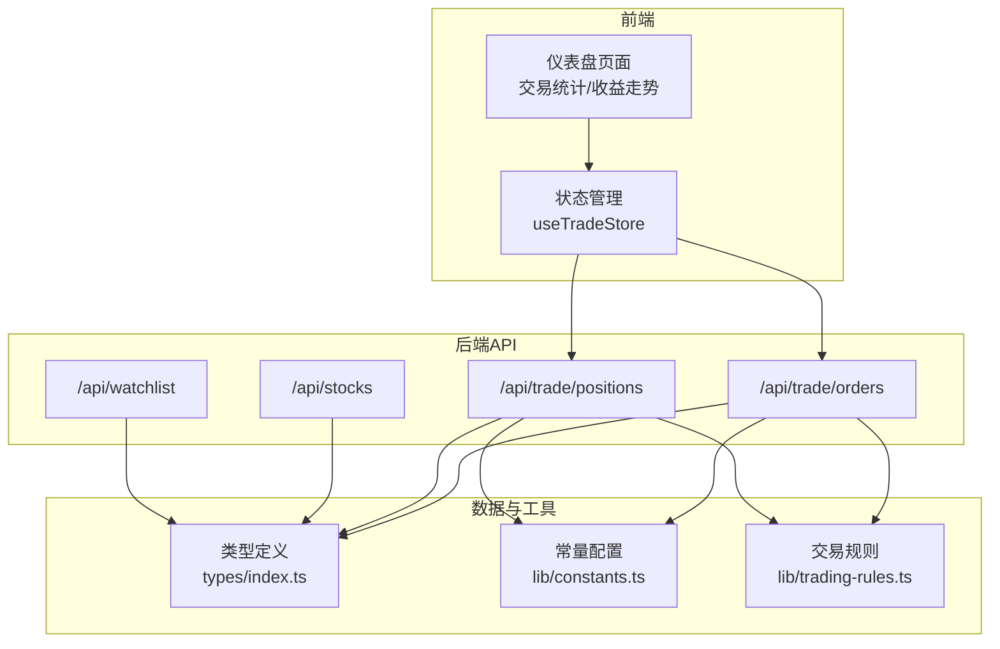
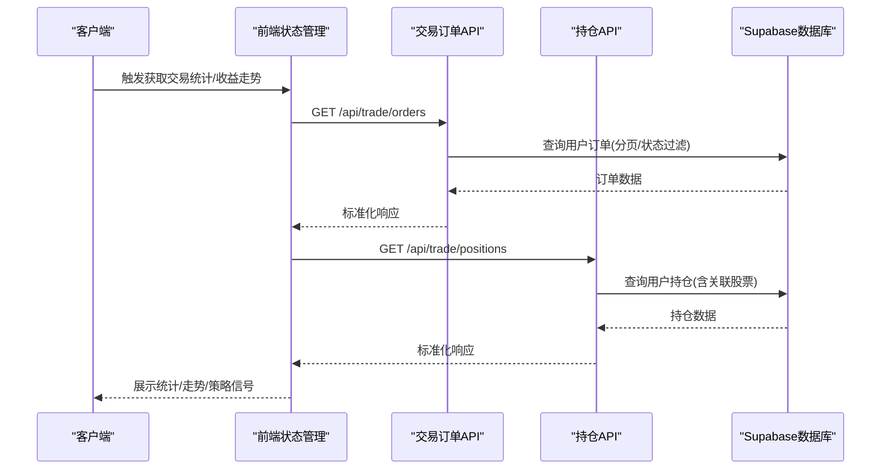
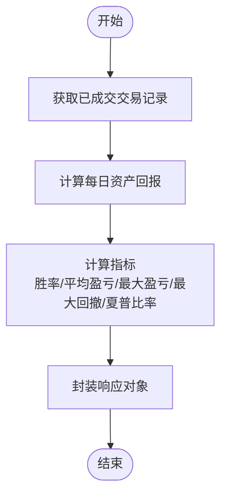
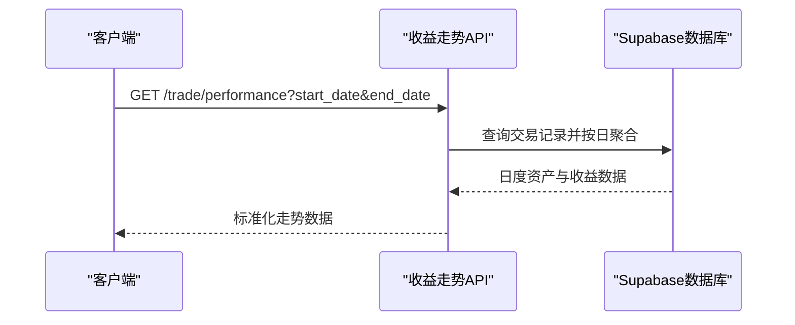
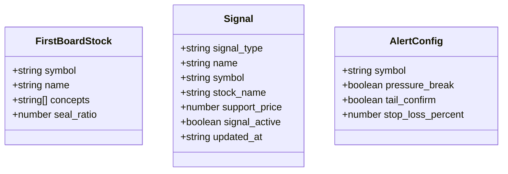
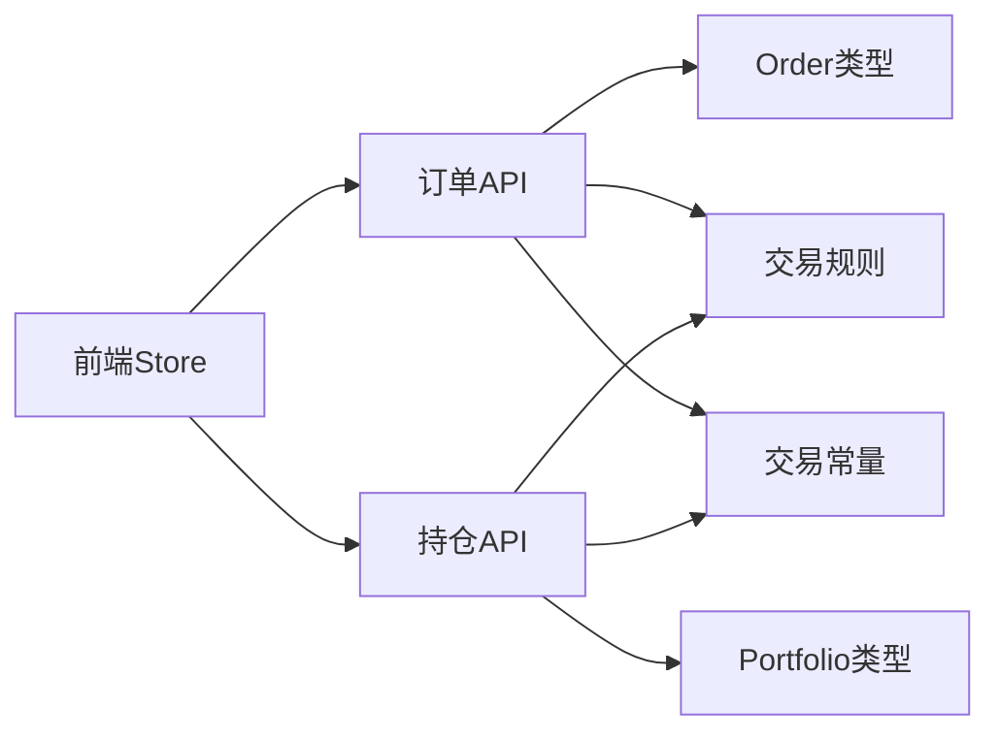

# 系统分析API

<cite>
**本文档引用的文件**
- [API接口规范.md](file://docs/API接口规范.md)
- [constants.ts](file://lib/constants.ts)
- [trading-rules.ts](file://lib/trading-rules.ts)
- [index.ts](file://types/index.ts)
- [route.ts](file://app/api/trade/orders/route.ts)
- [route.ts](file://app/api/trade/positions/route.ts)
- [route.ts](file://app/api/stocks/route.ts)
- [route.ts](file://app/api/watchlist/route.ts)
- [useTradeStore.ts](file://stores/useTradeStore.ts)
- [page.tsx](file://app/(dashboard)/portfolio/page.tsx)
</cite>

## 目录
1. [简介](#简介)
2. [项目结构](#项目结构)
3. [核心组件](#核心组件)
4. [架构总览](#架构总览)
5. [详细组件分析](#详细组件分析)
6. [依赖关系分析](#依赖关系分析)
7. [性能考虑](#性能考虑)
8. [故障排除指南](#故障排除指南)
9. [结论](#结论)
10. [附录](#附录)

## 简介
本文件面向系统分析API，聚焦以下能力：
- 交易统计接口：总交易次数、胜率、平均盈亏、最大盈亏、最大回撤、夏普比率等指标。
- 收益走势数据接口：时间范围选择、数据聚合与趋势分析。
- 策略分析接口：首板观察池、技术信号、预警条件订阅。
- 完整的数据分析接口规范：参数校验、结果格式、实时与历史回测支持。
- 图表数据输出与可视化建议。
- 分析结果解读与应用场景。

## 项目结构
系统采用Next.js应用结构，分析API主要位于`app/api`目录下的各模块路由中，配合`types`类型定义、`lib`工具函数以及`stores`状态管理使用。

**图示来源**
- [route.ts:1-66](file://app/api/trade/orders/route.ts#L1-L66)
- [route.ts:1-46](file://app/api/trade/positions/route.ts#L1-L46)
- [route.ts:1-69](file://app/api/stocks/route.ts#L1-L69)
- [route.ts:1-129](file://app/api/watchlist/route.ts#L1-L129)
- [index.ts:1-166](file://types/index.ts#L1-L166)
- [constants.ts:1-101](file://lib/constants.ts#L1-L101)
- [trading-rules.ts:1-272](file://lib/trading-rules.ts#L1-L272)

**章节来源**
- [route.ts:1-66](file://app/api/trade/orders/route.ts#L1-L66)
- [route.ts:1-46](file://app/api/trade/positions/route.ts#L1-L46)
- [route.ts:1-69](file://app/api/stocks/route.ts#L1-L69)
- [route.ts:1-129](file://app/api/watchlist/route.ts#L1-L129)
- [index.ts:1-166](file://types/index.ts#L1-L166)
- [constants.ts:1-101](file://lib/constants.ts#L1-L101)
- [trading-rules.ts:1-272](file://lib/trading-rules.ts#L1-L272)

## 核心组件
- 交易统计接口：提供总交易次数、胜率、平均盈亏、最大盈亏、最大回撤、夏普比率等指标，用于评估交易表现。
- 收益走势数据接口：按日聚合资产曲线，提供日收益、累计收益、基准收益，支持时间范围筛选。
- 策略分析接口：首板观察池、五大回调战法信号、预警条件订阅，辅助决策与风控。

以上接口在API规范文档中有明确的请求方法、路径、参数与响应格式定义。

**章节来源**
- [API接口规范.md:405-428](file://docs/API接口规范.md#L405-L428)
- [API接口规范.md:432-463](file://docs/API接口规范.md#L432-L463)
- [API接口规范.md:469-550](file://docs/API接口规范.md#L469-L550)

## 架构总览
系统分析API遵循统一的鉴权与数据格式规范，前端通过store调用后端API，后端基于Supabase进行数据查询与聚合，最终返回标准化的JSON响应。

**图示来源**
- [route.ts:1-66](file://app/api/trade/orders/route.ts#L1-L66)
- [route.ts:1-46](file://app/api/trade/positions/route.ts#L1-L46)
- [useTradeStore.ts:1-192](file://stores/useTradeStore.ts#L1-L192)

**章节来源**
- [useTradeStore.ts:1-192](file://stores/useTradeStore.ts#L1-L192)
- [route.ts:1-66](file://app/api/trade/orders/route.ts#L1-L66)
- [route.ts:1-46](file://app/api/trade/positions/route.ts#L1-L46)

## 详细组件分析

### 交易统计接口
- 接口路径：`GET /trade/statistics`
- 功能：计算并返回交易表现指标，包括总交易次数、胜率、平均盈亏、最大盈亏、最大回撤、夏普比率。
- 数据来源：基于已成交的交易记录进行聚合与计算。
- 参数：无。
- 响应：包含上述指标的对象。

**图示来源**
- [API接口规范.md:405-428](file://docs/API接口规范.md#L405-L428)

**章节来源**
- [API接口规范.md:405-428](file://docs/API接口规范.md#L405-L428)

### 收益走势数据接口
- 接口路径：`GET /trade/performance`
- 功能：返回按日聚合的收益走势数据，支持起止日期筛选。
- 参数：
  - `start_date`：开始日期（YYYY-MM-DD），默认30天前
  - `end_date`：结束日期（YYYY-MM-DD），默认今日
- 响应：包含日期、总资产、日收益、累计收益、基准收益的数组。

**图示来源**
- [API接口规范.md:432-463](file://docs/API接口规范.md#L432-L463)

**章节来源**
- [API接口规范.md:432-463](file://docs/API接口规范.md#L432-L463)

### 策略分析接口
- 首板观察池
  - 接口路径：`GET /analysis/first-board`
  - 响应：包含日期与观察池列表，每项含股票代码、名称、概念、封单比例等。
- 五大回调战法信号
  - 接口路径：`GET /analysis/signals`
  - 参数：`signal_type`（可选，筛选特定战法）
  - 响应：信号列表，含信号类型、名称、股票代码、支撑位、信号激活状态等。
- 预警条件订阅
  - 接口路径：`POST /analysis/alert/subscribe`
  - 请求体：包含股票代码、压力突破、尾盘确认、止损百分比等。
  - 响应：订阅成功标志。

**图示来源**
- [index.ts:124-146](file://types/index.ts#L124-L146)

**章节来源**
- [API接口规范.md:469-488](file://docs/API接口规范.md#L469-L488)
- [API接口规范.md:492-519](file://docs/API接口规范.md#L492-L519)
- [API接口规范.md:523-550](file://docs/API接口规范.md#L523-L550)
- [index.ts:124-146](file://types/index.ts#L124-L146)

### 数据计算逻辑与算法实现细节
- 交易统计指标计算
  - 胜率：盈利交易次数 / 总交易次数 × 100%
  - 平均盈亏：总盈亏 / 总交易次数；平均盈利、平均亏损分别取正负值
  - 最大盈亏：单笔交易最大盈利与最大亏损
  - 最大回撤：基于资产曲线的回撤幅度
  - 夏普比率：基于日收益序列的波动率与无风险收益差值
- 收益走势聚合
  - 按日聚合交易，计算日终总资产、日收益、累计收益、基准收益
- 策略信号与预警
  - 信号：基于形态学与技术面规则识别
  - 预警：基于压力位突破、尾盘确认、止损阈值等条件

**章节来源**
- [API接口规范.md:405-428](file://docs/API接口规范.md#L405-L428)
- [API接口规范.md:432-463](file://docs/API接口规范.md#L432-L463)
- [API接口规范.md:469-550](file://docs/API接口规范.md#L469-L550)

### 实时分析与历史回测
- 实时分析：通过Supabase Realtime订阅持仓与订单变更，前端store自动刷新交易统计与收益走势。
- 历史回测：收益走势接口支持时间范围筛选，结合交易记录进行历史回测与趋势分析。

**章节来源**
- [useTradeStore.ts:144-191](file://stores/useTradeStore.ts#L144-L191)

### 图表数据输出与可视化支持
- 收益走势：返回日期、总资产、日收益、累计收益、基准收益，便于绘制折线图与对比分析。
- 交易统计：返回指标卡片数据，适合仪表盘展示。
- 策略信号：返回信号列表与支撑/压力位，便于标注在K线图上。

**章节来源**
- [API接口规范.md:416-427](file://docs/API接口规范.md#L416-L427)
- [API接口规范.md:450-462](file://docs/API接口规范.md#L450-L462)
- [page.tsx](file://app/(dashboard)/portfolio/page.tsx#L31-L66)

### 分析结果解读与应用场景
- 交易统计：用于评估策略有效性、风险控制能力与执行效率。
- 收益走势：用于观察策略长期表现与市场适应性，对比基准收益判断超额收益。
- 策略分析：用于捕捉阶段性机会与规避风险，结合预警条件进行动态管理。

**章节来源**
- [page.tsx](file://app/(dashboard)/portfolio/page.tsx#L31-L66)

## 依赖关系分析
- 类型与常量
  - `types/index.ts` 定义了交易统计、收益走势、策略分析等数据模型。
  - `lib/constants.ts` 提供交易常量与API常量，影响交易费用、涨跌停等计算。
  - `lib/trading-rules.ts` 提供交易规则与计算函数，如手续费、涨跌停、盈亏计算等。
- API与存储
  - `app/api/trade/orders/route.ts` 与 `app/api/trade/positions/route.ts` 通过Supabase查询用户订单与持仓，并结合类型定义返回标准化响应。
  - `stores/useTradeStore.ts` 调用API并订阅数据库变更，驱动前端实时更新。

**图示来源**
- [route.ts:1-66](file://app/api/trade/orders/route.ts#L1-L66)
- [route.ts:1-46](file://app/api/trade/positions/route.ts#L1-L46)
- [index.ts:69-81](file://types/index.ts#L69-L81)
- [index.ts:37-51](file://types/index.ts#L37-L51)
- [trading-rules.ts:88-125](file://lib/trading-rules.ts#L88-L125)
- [constants.ts:1-27](file://lib/constants.ts#L1-L27)
- [useTradeStore.ts:1-192](file://stores/useTradeStore.ts#L1-L192)

**章节来源**
- [index.ts:69-81](file://types/index.ts#L69-L81)
- [index.ts:37-51](file://types/index.ts#L37-L51)
- [trading-rules.ts:88-125](file://lib/trading-rules.ts#L88-L125)
- [constants.ts:1-27](file://lib/constants.ts#L1-L27)
- [route.ts:1-66](file://app/api/trade/orders/route.ts#L1-L66)
- [route.ts:1-46](file://app/api/trade/positions/route.ts#L1-L46)
- [useTradeStore.ts:1-192](file://stores/useTradeStore.ts#L1-L192)

## 性能考虑
- 分页与查询优化：订单与股票列表接口支持分页与过滤，避免一次性加载大量数据。
- 实时订阅：通过Supabase Realtime减少轮询开销，提升交互体验。
- 数据聚合：收益走势按日聚合，降低前端渲染压力。
- 前端缓存：store层对频繁访问的数据进行缓存，减少重复请求。

**章节来源**
- [route.ts:19-42](file://app/api/trade/orders/route.ts#L19-L42)
- [route.ts:10-34](file://app/api/stocks/route.ts#L10-L34)
- [useTradeStore.ts:33-97](file://stores/useTradeStore.ts#L33-L97)

## 故障排除指南
- 未登录或鉴权失败：检查请求头中的Authorization是否正确携带JWT Token。
- 参数错误：核对查询参数类型与必填项，确保日期格式与数值范围符合要求。
- 服务器内部错误：查看后端日志，确认Supabase连接与查询异常。
- 数据为空：确认用户数据存在且已完成初始化交易。

**章节来源**
- [route.ts:12-17](file://app/api/trade/orders/route.ts#L12-L17)
- [route.ts:12-17](file://app/api/trade/positions/route.ts#L12-L17)
- [API接口规范.md:567-577](file://docs/API接口规范.md#L567-L577)

## 结论
系统分析API提供了从交易统计、收益走势到策略信号与预警的完整分析能力，配合实时订阅与历史回测，能够满足用户对交易表现评估与策略优化的需求。通过标准化的接口规范与清晰的数据模型，便于前端可视化与扩展。

## 附录
- 接口规范与参数详情请参考API接口规范文档相应章节。
- 类型定义与字段说明请参考类型文件。

**章节来源**
- [API接口规范.md:1-577](file://docs/API接口规范.md#L1-L577)
- [index.ts:1-166](file://types/index.ts#L1-L166)