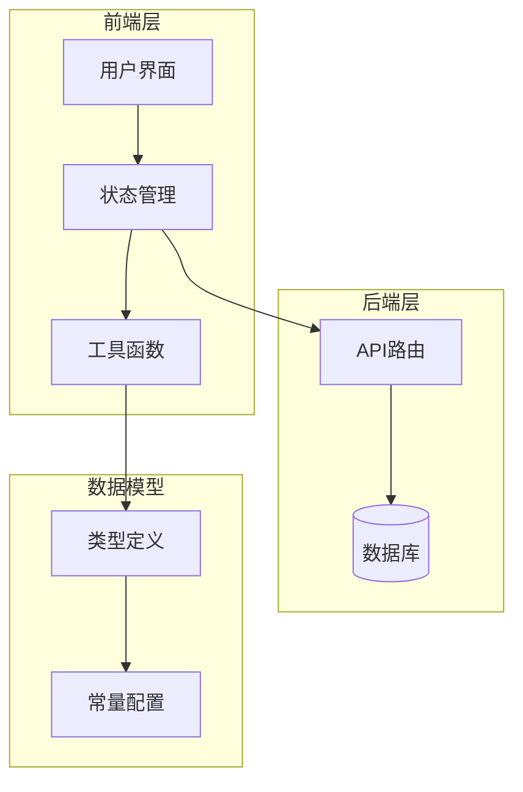
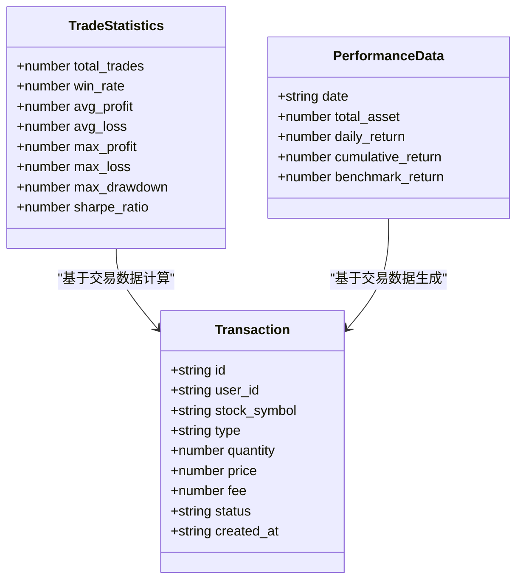
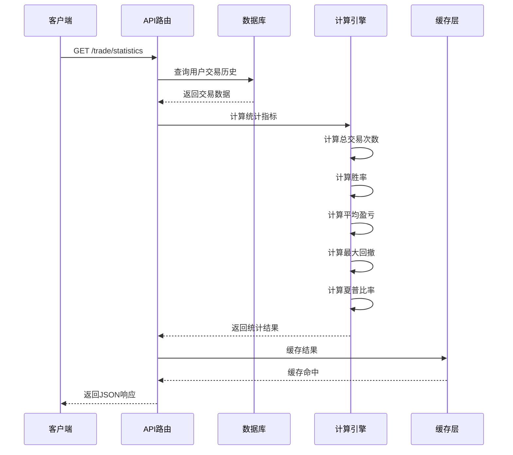
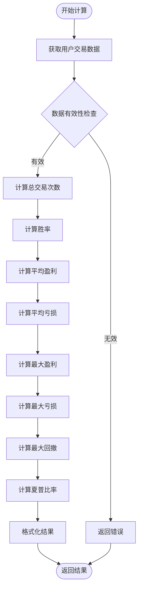
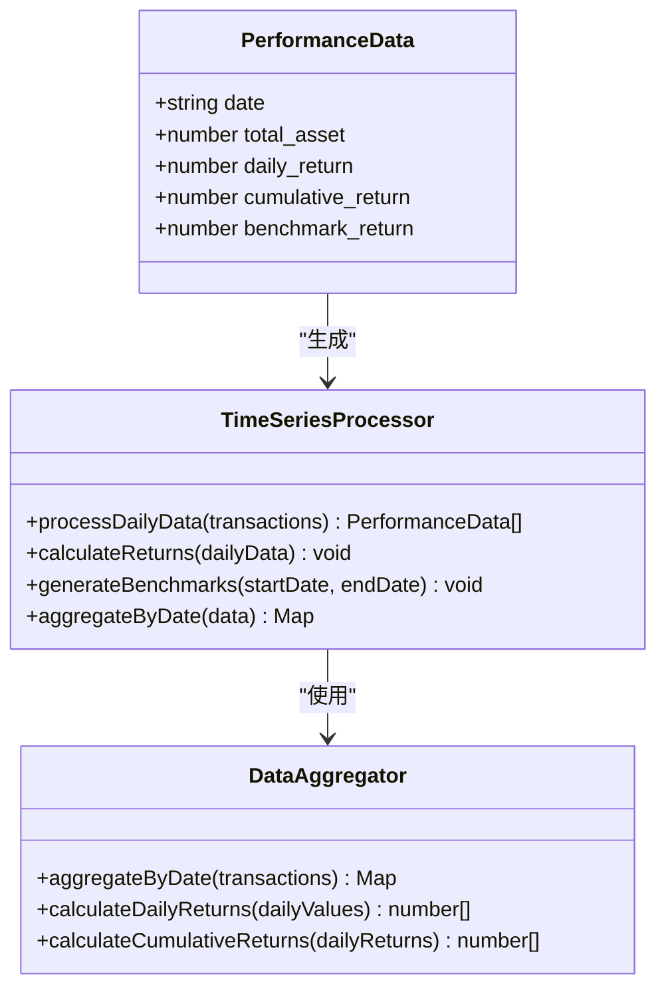
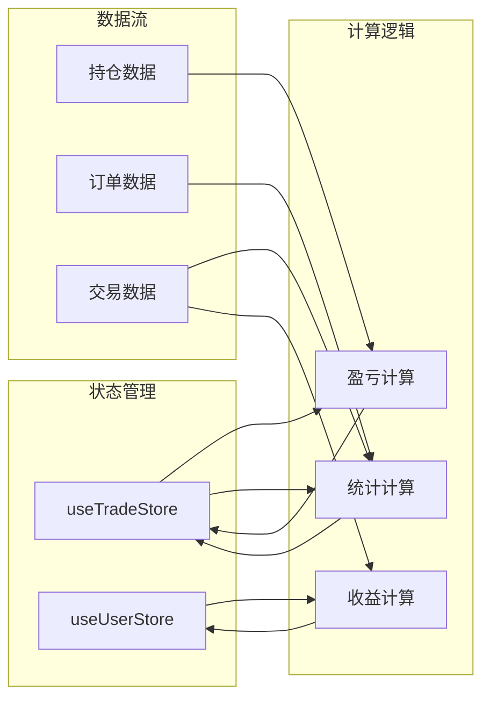
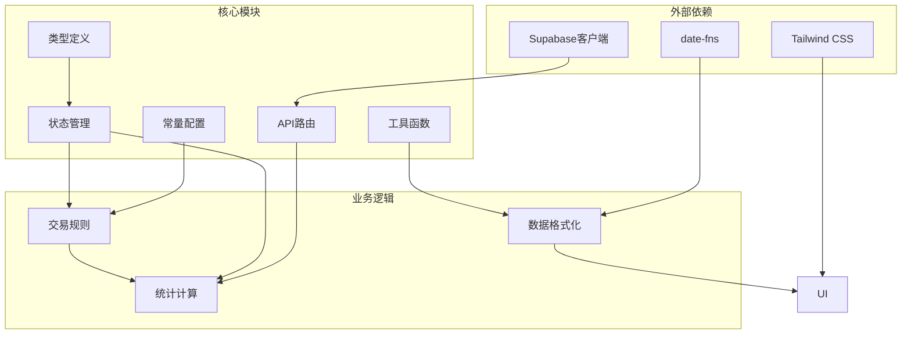

# 绩效统计API

<cite>
**本文档引用的文件**
- [API接口规范.md](file://docs/API接口规范.md)
- [types/index.ts](file://types/index.ts)
- [app/api/trade/orders/route.ts](file://app/api/trade/orders/route.ts)
- [app/api/trade/positions/route.ts](file://app/api/trade/positions/route.ts)
- [stores/useTradeStore.ts](file://stores/useTradeStore.ts)
- [stores/useUserStore.ts](file://stores/useUserStore.ts)
- [lib/constants.ts](file://lib/constants.ts)
- [lib/trading-rules.ts](file://lib/trading-rules.ts)
- [lib/utils.ts](file://lib/utils.ts)
- [app/(dashboard)/portfolio/page.tsx](file://app/(dashboard)/portfolio/page.tsx)
</cite>

## 目录
1. [简介](#简介)
2. [项目结构](#项目结构)
3. [核心组件](#核心组件)
4. [架构概览](#架构概览)
5. [详细组件分析](#详细组件分析)
6. [依赖关系分析](#依赖关系分析)
7. [性能考虑](#性能考虑)
8. [故障排除指南](#故障排除指南)
9. [结论](#结论)
10. [附录](#附录)

## 简介
本文件详细说明虚拟股票交易系统的绩效统计API，包括交易统计接口和收益走势数据接口。系统提供总交易次数、胜率、平均盈亏、最大盈亏、最大回撤和夏普比率等核心指标，并支持时间范围查询和趋势分析功能。

## 项目结构
系统采用Next.js全栈架构，主要涉及以下模块：



**图表来源**
- [types/index.ts:1-166](file://types/index.ts#L1-L166)
- [stores/useTradeStore.ts:1-192](file://stores/useTradeStore.ts#L1-L192)
- [app/api/trade/orders/route.ts:1-66](file://app/api/trade/orders/route.ts#L1-L66)

**章节来源**
- [types/index.ts:1-166](file://types/index.ts#L1-L166)
- [stores/useTradeStore.ts:1-192](file://stores/useTradeStore.ts#L1-L192)

## 核心组件
系统的核心组件包括数据模型、API路由和状态管理：

### 数据模型
系统定义了完整的数据结构来支持绩效统计：



**图表来源**
- [types/index.ts:102-121](file://types/index.ts#L102-L121)

### API接口规范
系统提供两个核心统计接口：

1. **交易统计接口** (`/trade/statistics`)
   - 返回总交易次数、胜率、平均盈亏、最大盈亏、最大回撤、夏普比率
   - 支持身份验证和用户隔离

2. **收益走势接口** (`/trade/performance`)
   - 返回时间序列的资产数据
   - 支持开始日期和结束日期查询参数
   - 提供日收益率、累计收益率和基准收益率

**章节来源**
- [API接口规范.md:405-463](file://docs/API接口规范.md#L405-L463)

## 架构概览
系统采用前后端分离架构，通过API路由处理统计计算：



**图表来源**
- [app/api/trade/orders/route.ts:1-66](file://app/api/trade/orders/route.ts#L1-L66)
- [types/index.ts:102-121](file://types/index.ts#L102-L121)

## 详细组件分析

### 交易统计计算组件
交易统计组件负责计算所有核心指标：



**图表来源**
- [types/index.ts:102-112](file://types/index.ts#L102-L112)

#### 核心指标计算方法

1. **总交易次数 (total_trades)**
   - 统计用户完成的所有交易记录数量
   - 过滤状态为"filled"的已完成交易

2. **胜率 (win_rate)**
   - 计算盈利交易次数占总交易次数的比例
   - 公式: 胜率 = 盈利交易数 / 总交易数 × 100%

3. **平均盈亏 (avg_profit/avg_loss)**
   - 盈利交易的平均值作为avg_profit
   - 亏损交易的绝对值作为avg_loss
   - 使用交易金额而非手数

4. **最大盈亏 (max_profit/max_loss)**
   - 盈利交易中的最大值
   - 亏损交易中的最小值（绝对值）

5. **最大回撤 (max_drawdown)**
   - 计算从峰值到谷底的最大跌幅
   - 用于评估风险控制效果

6. **夏普比率 (sharpe_ratio)**
   - 衡量单位风险获得的风险溢价
   - 公式: (期望收益率 - 无风险利率) / 标准差
   - 无风险利率使用0.03作为基准

**章节来源**
- [types/index.ts:102-112](file://types/index.ts#L102-L112)
- [lib/constants.ts:1-27](file://lib/constants.ts#L1-L27)

### 收益走势数据组件
收益走势组件提供时间序列分析功能：



**图表来源**
- [types/index.ts:114-121](file://types/index.ts#L114-L121)

#### 数据聚合算法
1. **时间范围参数**
   - start_date: 开始日期，默认30天前
   - end_date: 结束日期，默认今日
   - 支持YYYY-MM-DD格式

2. **数据聚合策略**
   - 按自然日聚合交易数据
   - 计算每日总资产价值
   - 生成日收益率序列

3. **趋势分析功能**
   - 累计收益率计算
   - 基准收益率对比
   - 移动平均线分析

**章节来源**
- [API接口规范.md:432-463](file://docs/API接口规范.md#L432-L463)
- [types/index.ts:114-121](file://types/index.ts#L114-L121)

### 状态管理集成
系统通过Zustand状态管理器集成统计功能：



**图表来源**
- [stores/useTradeStore.ts:1-192](file://stores/useTradeStore.ts#L1-L192)
- [stores/useUserStore.ts:1-107](file://stores/useUserStore.ts#L1-L107)

**章节来源**
- [stores/useTradeStore.ts:1-192](file://stores/useTradeStore.ts#L1-L192)
- [stores/useUserStore.ts:1-107](file://stores/useUserStore.ts#L1-L107)

## 依赖关系分析
系统各组件之间的依赖关系如下：



**图表来源**
- [lib/constants.ts:1-101](file://lib/constants.ts#L1-L101)
- [lib/utils.ts:1-47](file://lib/utils.ts#L1-L47)
- [lib/trading-rules.ts:1-272](file://lib/trading-rules.ts#L1-L272)

**章节来源**
- [lib/constants.ts:1-101](file://lib/constants.ts#L1-L101)
- [lib/utils.ts:1-47](file://lib/utils.ts#L1-L47)

## 性能考虑
系统在性能方面采取了以下优化策略：

### 数据更新频率
- **实时更新**: 通过Supabase实时订阅机制实现数据变更通知
- **缓存策略**: 使用内存缓存减少重复计算
- **批量处理**: 支持分页查询避免大数据集传输

### 计算优化
- **增量计算**: 只对新增数据进行重新计算
- **索引优化**: 在数据库层面建立适当索引
- **并发处理**: 支持多个统计指标的并行计算

### 前端性能
- **懒加载**: 图表组件按需加载
- **虚拟滚动**: 大数据集的表格组件使用虚拟滚动
- **防抖处理**: 频繁交互的操作使用防抖优化

## 故障排除指南
常见问题及解决方案：

### 认证问题
- **症状**: 返回401未认证错误
- **原因**: 缺少或无效的Authorization头
- **解决**: 确保请求包含有效的Bearer token

### 数据为空
- **症状**: 统计结果为空数组
- **原因**: 用户没有交易历史或查询参数错误
- **解决**: 检查用户ID和时间范围参数

### 性能问题
- **症状**: 接口响应缓慢
- **原因**: 数据量过大或计算复杂度高
- **解决**: 优化查询条件，增加分页限制

**章节来源**
- [app/api/trade/orders/route.ts:12-17](file://app/api/trade/orders/route.ts#L12-L17)
- [app/api/trade/positions/route.ts:12-17](file://app/api/trade/positions/route.ts#L12-L17)

## 结论
本绩效统计API提供了完整的交易分析功能，包括基础统计指标和高级分析功能。系统采用模块化设计，具有良好的扩展性和维护性。通过合理的数据结构设计和计算算法，能够满足虚拟股票交易场景下的统计需求。

## 附录

### API响应格式
所有统计接口均遵循统一的响应格式：

```json
{
  "data": [],
  "error": "",
  "message": "",
  "total": 0,
  "page": 1,
  "limit": 20
}
```

### 错误码规范
- 400: 请求参数错误
- 401: 未认证
- 403: 无权限
- 404: 资源不存在
- 429: 请求频率超限
- 500: 服务器内部错误

### 配置选项
系统支持通过环境变量配置：
- NEXT_PUBLIC_INITIAL_BALANCE: 初始资金，默认1,000,000
- NEXT_PUBLIC_TRADE_FEE_RATE: 交易费率，默认0.00025
- NEXT_PUBLIC_MIN_TRADE_FEE: 最低手续费，默认5元

**章节来源**
- [docs/API接口规范.md:567-577](file://docs/API接口规范.md#L567-L577)
- [lib/constants.ts:1-27](file://lib/constants.ts#L1-L27)