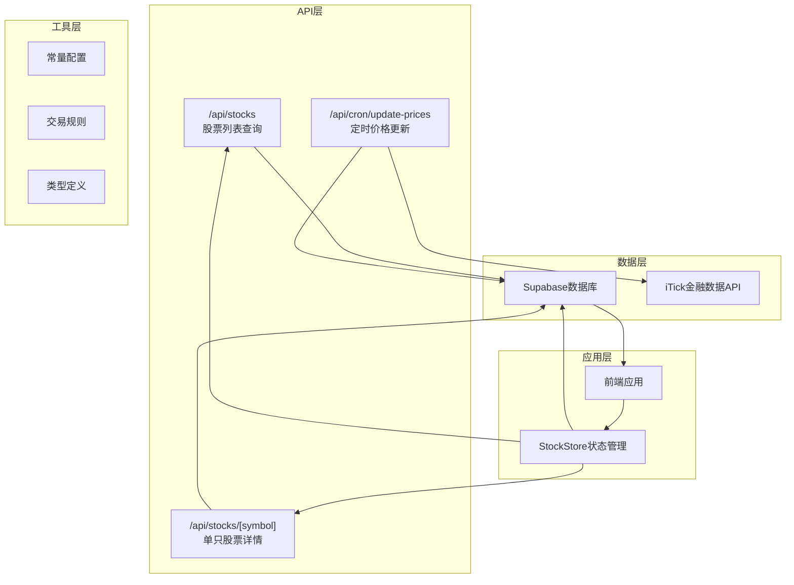
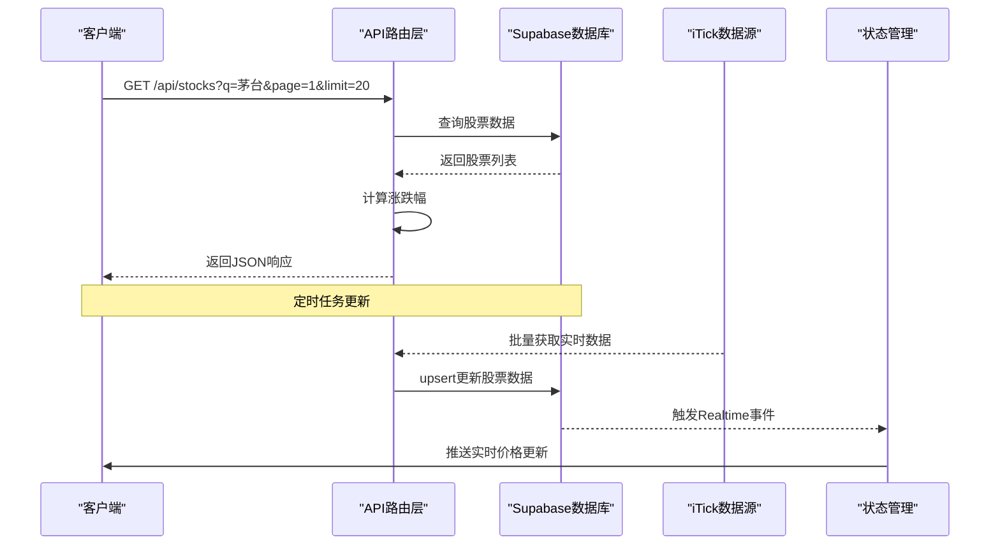
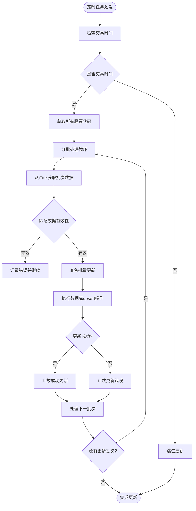
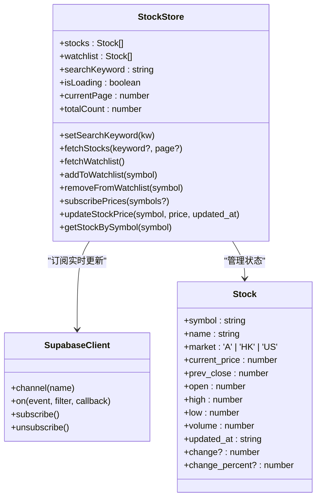
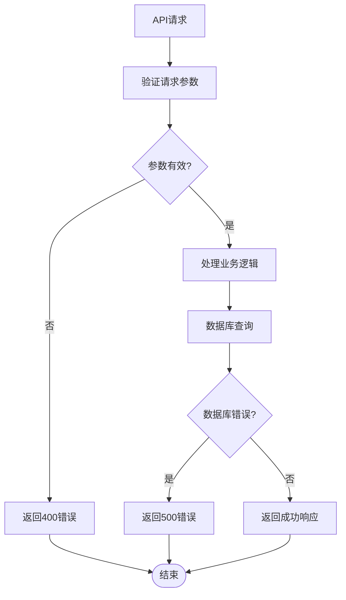
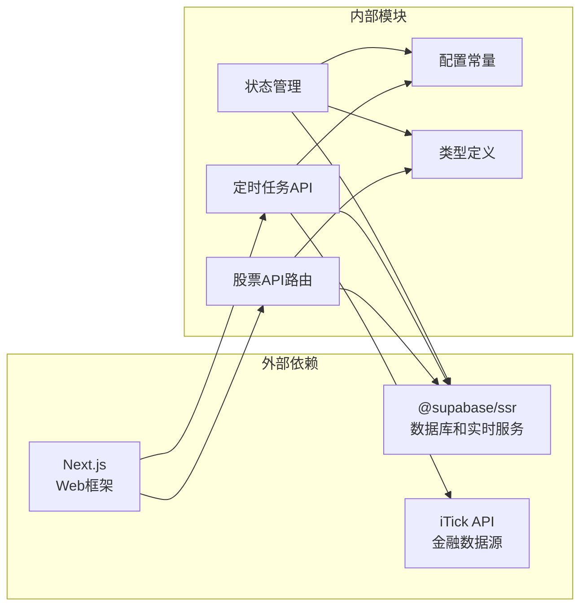

# 股票行情API

<cite>
**本文档引用的文件**
- [app/api/stocks/route.ts](file://app/api/stocks/route.ts)
- [app/api/stocks/[symbol]/route.ts](file://app/api/stocks/[symbol]/route.ts)
- [app/api/cron/update-prices/route.ts](file://app/api/cron/update-prices/route.ts)
- [lib/constants.ts](file://lib/constants.ts)
- [lib/trading-rules.ts](file://lib/trading-rules.ts)
- [types/index.ts](file://types/index.ts)
- [stores/useStockStore.ts](file://stores/useStockStore.ts)
- [lib/supabase/server.ts](file://lib/supabase/server.ts)
- [lib/supabase/client.ts](file://lib/supabase/client.ts)
- [docs/API接口规范.md](file://docs/API接口规范.md)
</cite>

## 目录
1. [简介](#简介)
2. [项目结构](#项目结构)
3. [核心组件](#核心组件)
4. [架构概览](#架构概览)
5. [详细组件分析](#详细组件分析)
6. [依赖关系分析](#依赖关系分析)
7. [性能考虑](#性能考虑)
8. [故障排除指南](#故障排除指南)
9. [结论](#结论)

## 简介

本文件为虚拟股票交易系统的股票行情API综合文档，详细说明了以下核心功能接口：

- **股票列表查询接口**：支持关键词搜索、分页参数和排序选项
- **单只股票实时行情获取接口**：包含股票代码参数和实时数据格式
- **K线数据接口**：支持日线、周线、月线周期和数据条数限制
- **数据更新频率和缓存策略**
- **性能优化建议和批量查询最佳实践**

该系统基于Next.js构建，使用Supabase作为数据库和实时数据服务，集成了iTick金融数据API进行实时行情更新。

## 项目结构

虚拟股票交易系统采用模块化的文件组织结构，股票行情API位于`app/api/stocks/`目录下，核心架构如下：



**图表来源**
- [app/api/stocks/route.ts:1-69](file://app/api/stocks/route.ts#L1-L69)
- [app/api/stocks/[symbol]/route.ts](file://app/api/stocks/[symbol]/route.ts#L1-L51)
- [app/api/cron/update-prices/route.ts:1-150](file://app/api/cron/update-prices/route.ts#L1-L150)

**章节来源**
- [app/api/stocks/route.ts:1-69](file://app/api/stocks/route.ts#L1-L69)
- [app/api/stocks/[symbol]/route.ts](file://app/api/stocks/[symbol]/route.ts#L1-L51)
- [app/api/cron/update-prices/route.ts:1-150](file://app/api/cron/update-prices/route.ts#L1-L150)

## 核心组件

### 股票列表查询接口

股票列表查询接口提供完整的股票筛选、分页和排序功能：

**接口规范**：
- **URL**: `/api/stocks`
- **方法**: `GET`
- **功能**: 获取股票列表，支持关键词搜索、分页和排序

**请求参数**：
- `q` (string, 可选): 搜索关键词，支持股票代码和名称模糊匹配
- `page` (number, 可选): 页码，默认值为1
- `limit` (number, 可选): 每页数量，默认值为20，最大值为100

**响应数据结构**：
```typescript
interface ApiResponse {
  data: Stock[];
  total: number;
  page: number;
  limit: number;
}

interface Stock {
  symbol: string;
  name: string;
  market: 'A' | 'HK' | 'US';
  current_price: number;
  prev_close: number;
  open: number;
  high: number;
  low: number;
  volume: number;
  updated_at: string;
  change?: number;
  change_percent?: number;
}
```

**排序规则**：
- 默认按成交量降序排列
- 支持关键词搜索过滤

**章节来源**
- [app/api/stocks/route.ts:5-69](file://app/api/stocks/route.ts#L5-L69)
- [types/index.ts:10-25](file://types/index.ts#L10-L25)

### 单只股票实时行情接口

单只股票实时行情接口提供详细的实时市场数据：

**接口规范**：
- **URL**: `/api/stocks/:symbol`
- **方法**: `GET`
- **功能**: 获取指定股票的实时行情数据

**路径参数**：
- `symbol` (string): 股票代码，如"600519"

**响应数据结构**：
与股票列表中的Stock接口相同，额外包含计算字段：
- `change`: 当前价格与昨收价的差额
- `change_percent`: 涨跌幅百分比

**错误处理**：
- 股票不存在时返回404状态码
- 数据库查询错误时返回500状态码

**章节来源**
- [app/api/stocks/[symbol]/route.ts](file://app/api/stocks/[symbol]/route.ts#L4-L51)
- [types/index.ts:10-25](file://types/index.ts#L10-L25)

### K线数据接口

**注意**: 根据代码库分析，当前代码库中未实现K线数据接口。根据API规范文档，K线接口应为：
- **URL**: `/api/stocks/:symbol/kline`
- **方法**: `GET`
- **参数**: `period`(day|week|month)、`limit`(默认100，最大500)

**章节来源**
- [docs/API接口规范.md:140-175](file://docs/API接口规范.md#L140-L175)

## 架构概览

系统采用分层架构设计，实现了数据获取、业务逻辑处理和实时更新的分离：



**图表来源**
- [app/api/stocks/route.ts:6-69](file://app/api/stocks/route.ts#L6-L69)
- [app/api/cron/update-prices/route.ts:10-150](file://app/api/cron/update-prices/route.ts#L10-L150)
- [stores/useStockStore.ts:125-150](file://stores/useStockStore.ts#L125-L150)

**章节来源**
- [app/api/stocks/route.ts:1-69](file://app/api/stocks/route.ts#L1-L69)
- [app/api/cron/update-prices/route.ts:1-150](file://app/api/cron/update-prices/route.ts#L1-L150)
- [stores/useStockStore.ts:1-184](file://stores/useStockStore.ts#L1-L184)

## 详细组件分析

### 数据更新流程

系统通过定时任务实现数据的定期更新，确保行情数据的实时性：



**图表来源**
- [app/api/cron/update-prices/route.ts:9-150](file://app/api/cron/update-prices/route.ts#L9-L150)

### 实时数据订阅机制

系统使用Supabase Realtime实现客户端的实时数据订阅：



**图表来源**
- [stores/useStockStore.ts:6-21](file://stores/useStockStore.ts#L6-L21)
- [lib/supabase/client.ts:1-8](file://lib/supabase/client.ts#L1-L8)
- [types/index.ts:10-25](file://types/index.ts#L10-L25)

**章节来源**
- [stores/useStockStore.ts:1-184](file://stores/useStockStore.ts#L1-L184)
- [lib/supabase/client.ts:1-8](file://lib/supabase/client.ts#L1-L8)
- [types/index.ts:10-25](file://types/index.ts#L10-L25)

### 错误处理和异常情况

系统实现了完善的错误处理机制：



**章节来源**
- [app/api/stocks/route.ts:38-44](file://app/api/stocks/route.ts#L38-L44)
- [app/api/stocks/[symbol]/route.ts](file://app/api/stocks/[symbol]/route.ts#L19-L31)

## 依赖关系分析

系统的关键依赖关系如下：



**图表来源**
- [lib/supabase/server.ts:1-34](file://lib/supabase/server.ts#L1-L34)
- [lib/constants.ts:71-79](file://lib/constants.ts#L71-L79)
- [types/index.ts:1-166](file://types/index.ts#L1-L166)

**章节来源**
- [lib/supabase/server.ts:1-34](file://lib/supabase/server.ts#L1-L34)
- [lib/constants.ts:71-79](file://lib/constants.ts#L71-L79)
- [types/index.ts:1-166](file://types/index.ts#L1-L166)

## 性能考虑

### 数据更新频率

系统采用定时任务更新机制，确保数据的及时性和准确性：

- **更新频率**: 在交易时间内定期执行
- **批量处理**: 使用50只股票的批次大小，避免单次请求过大
- **超时控制**: 每个批次请求设置10秒超时
- **错误重试**: 处理过程中出现的错误会记录但不影响整体流程

### 缓存策略

系统采用多层缓存策略：

1. **浏览器缓存**: 前端使用React状态管理缓存最近的数据
2. **数据库缓存**: Supabase提供内置的查询缓存
3. **实时缓存**: 使用Supabase Realtime实现增量更新

### 性能优化建议

1. **批量查询优化**:
   - 使用分页参数限制单次查询的数据量
   - 合理设置`limit`参数，避免一次性获取过多数据
   - 对频繁访问的股票代码建立索引

2. **实时数据优化**:
   - 使用Supabase Realtime订阅机制，减少轮询开销
   - 按需订阅特定股票的实时数据
   - 合理设置更新频率，避免过度更新

3. **网络请求优化**:
   - 使用HTTP缓存头避免重复请求
   - 实现请求去重机制
   - 优化数据库查询语句，添加适当的索引

**章节来源**
- [app/api/cron/update-prices/route.ts:58-131](file://app/api/cron/update-prices/route.ts#L58-L131)
- [stores/useStockStore.ts:125-150](file://stores/useStockStore.ts#L125-L150)
- [lib/constants.ts:94-95](file://lib/constants.ts#L94-L95)

## 故障排除指南

### 常见问题和解决方案

1. **API响应超时**:
   - 检查网络连接和API密钥配置
   - 验证iTick API的可用性和配额限制
   - 检查数据库连接状态

2. **股票数据不更新**:
   - 确认定时任务是否正常运行
   - 检查交易时间判断逻辑
   - 验证Supabase Realtime订阅状态

3. **实时数据不同步**:
   - 检查Supabase Realtime连接状态
   - 验证数据模型的一致性
   - 确认前端状态更新逻辑

### 调试工具和方法

1. **API调试**:
   - 使用浏览器开发者工具查看网络请求
   - 检查API响应的状态码和错误信息
   - 验证请求参数的正确性

2. **数据库调试**:
   - 使用Supabase Dashboard查看数据状态
   - 检查数据库查询的执行计划
   - 验证索引的使用情况

3. **实时数据调试**:
   - 监控Supabase Realtime事件
   - 检查前端订阅的生命周期
   - 验证数据更新的时序一致性

**章节来源**
- [app/api/stocks/route.ts:61-67](file://app/api/stocks/route.ts#L61-L67)
- [app/api/stocks/[symbol]/route.ts](file://app/api/stocks/[symbol]/route.ts#L43-L49)

## 结论

虚拟股票交易系统的股票行情API提供了完整的股票数据查询和实时更新功能。系统采用现代化的技术栈，实现了高性能、可扩展的金融数据服务。

**主要特点**：
- **完整的股票数据服务**: 支持股票列表查询、单只股票详情和实时行情
- **高效的批量处理**: 通过定时任务实现批量数据更新
- **实时数据推送**: 使用Supabase Realtime实现低延迟的数据更新
- **完善的错误处理**: 提供全面的错误处理和异常恢复机制
- **性能优化**: 采用多层缓存和批量处理策略

**未来改进方向**：
- 实现K线数据接口以支持技术分析需求
- 优化数据库查询性能，支持更复杂的筛选条件
- 增强实时数据的可靠性和稳定性
- 扩展更多的金融数据源和数据类型

该系统为虚拟股票交易提供了坚实的数据基础，能够满足用户对实时股票行情的需求。