# 自选股管理API

<cite>
**本文档引用的文件**
- [app/api/watchlist/route.ts](file://app/api/watchlist/route.ts)
- [app/api/watchlist/[symbol]/route.ts](file://app/api/watchlist/[symbol]/route.ts)
- [stores/useStockStore.ts](file://stores/useStockStore.ts)
- [types/index.ts](file://types/index.ts)
- [lib/constants.ts](file://lib/constants.ts)
- [lib/supabase/client.ts](file://lib/supabase/client.ts)
- [components/stocks/StockCard.tsx](file://components/stocks/StockCard.tsx)
- [docs/prd.md](file://docs/prd.md)
- [app/api/stocks/route.ts](file://app/api/stocks/route.ts)
</cite>

## 目录
1. [简介](#简介)
2. [项目结构](#项目结构)
3. [核心组件](#核心组件)
4. [架构概览](#架构概览)
5. [详细组件分析](#详细组件分析)
6. [依赖关系分析](#依赖关系分析)
7. [性能考虑](#性能考虑)
8. [故障排除指南](#故障排除指南)
9. [结论](#结论)

## 简介

自选股管理API是虚拟股票交易系统的核心功能模块，负责管理用户的自定义股票关注列表。该API提供了完整的自选股生命周期管理，包括获取自选股列表、添加自选股、移除自选股等功能，并集成了实时价格更新机制，确保用户能够获得最新的市场数据。

## 项目结构

自选股管理API主要分布在以下目录结构中：

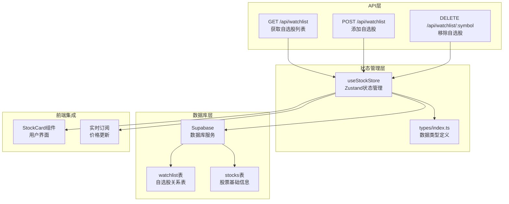

**图表来源**
- [app/api/watchlist/route.ts:1-129](file://app/api/watchlist/route.ts#L1-L129)
- [stores/useStockStore.ts:1-184](file://stores/useStockStore.ts#L1-L184)
- [types/index.ts:82-89](file://types/index.ts#L82-L89)

**章节来源**
- [app/api/watchlist/route.ts:1-129](file://app/api/watchlist/route.ts#L1-L129)
- [stores/useStockStore.ts:1-184](file://stores/useStockStore.ts#L1-L184)

## 核心组件

### 数据模型

自选股管理涉及两个核心数据模型：

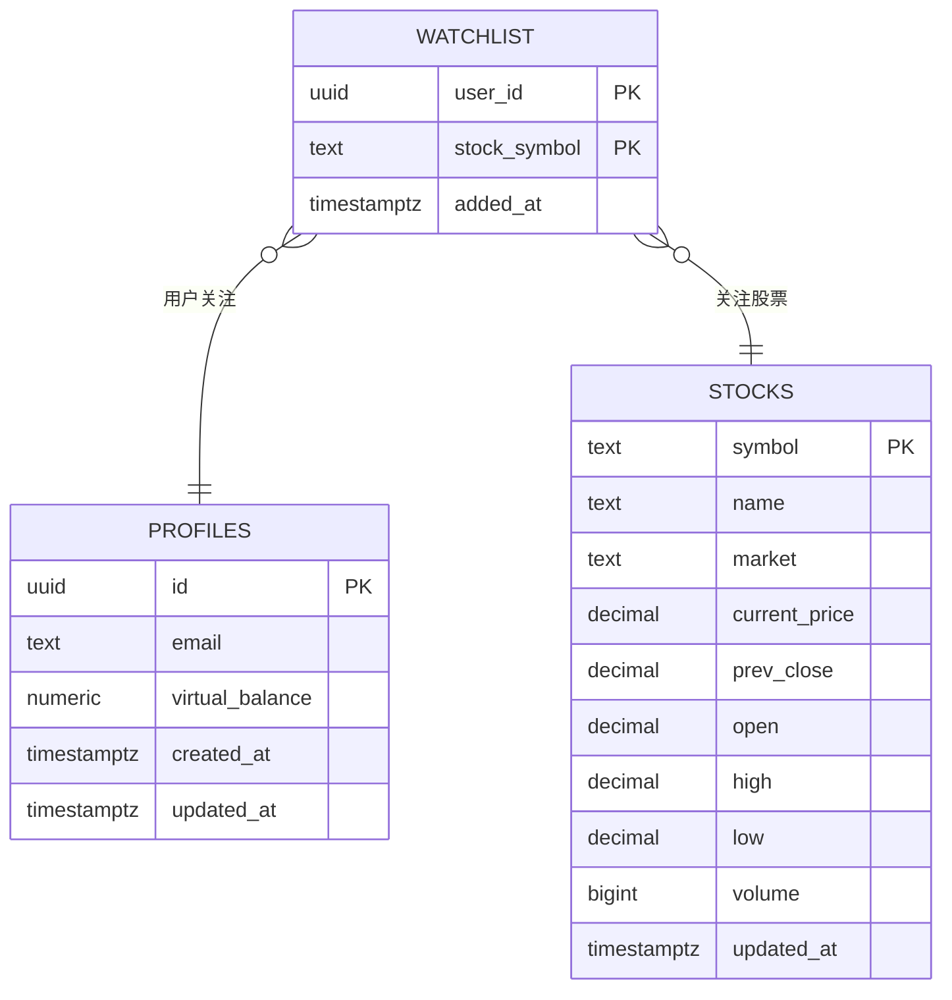

**图表来源**
- [docs/prd.md:158-166](file://docs/prd.md#L158-L166)
- [types/index.ts:11-25](file://types/index.ts#L11-L25)
- [types/index.ts:82-89](file://types/index.ts#L82-L89)

### API端点规范

#### 获取自选股列表

**HTTP方法**: GET  
**路径**: `/api/watchlist`  
**认证**: 必需（需要登录状态）

**请求参数**: 无

**响应格式**:
```json
{
  "data": [
    {
      "user_id": "uuid-string",
      "stock_symbol": "600036",
      "added_at": "2024-01-15T10:30:00Z",
      "stock": {
        "symbol": "600036",
        "name": "招商银行",
        "market": "A",
        "current_price": 32.50,
        "prev_close": 32.10,
        "open": 32.15,
        "high": 32.80,
        "low": 32.05,
        "volume": 15000000,
        "updated_at": "2024-01-15T10:30:00Z",
        "change": 0.40,
        "change_percent": 1.25
      }
    }
  ]
}
```

#### 添加自选股

**HTTP方法**: POST  
**路径**: `/api/watchlist`  
**认证**: 必需（需要登录状态）

**请求体**:
```json
{
  "symbol": "600036"
}
```

**响应格式**:
```json
{
  "success": true,
  "symbol": "600036",
  "message": "添加成功"
}
```

#### 移除自选股

**HTTP方法**: DELETE  
**路径**: `/api/watchlist/:symbol`  
**认证**: 必需（需要登录状态）

**路径参数**:
- `symbol`: 股票代码

**响应格式**:
```json
{
  "success": true,
  "symbol": "600036",
  "message": "移除成功"
}
```

**章节来源**
- [app/api/watchlist/route.ts:4-56](file://app/api/watchlist/route.ts#L4-L56)
- [app/api/watchlist/route.ts:58-128](file://app/api/watchlist/route.ts#L58-L128)
- [app/api/watchlist/[symbol]/route.ts:4-49](file://app/api/watchlist/[symbol]/route.ts#L4-L49)

## 架构概览

自选股管理API采用分层架构设计，实现了前后端分离和实时数据同步：

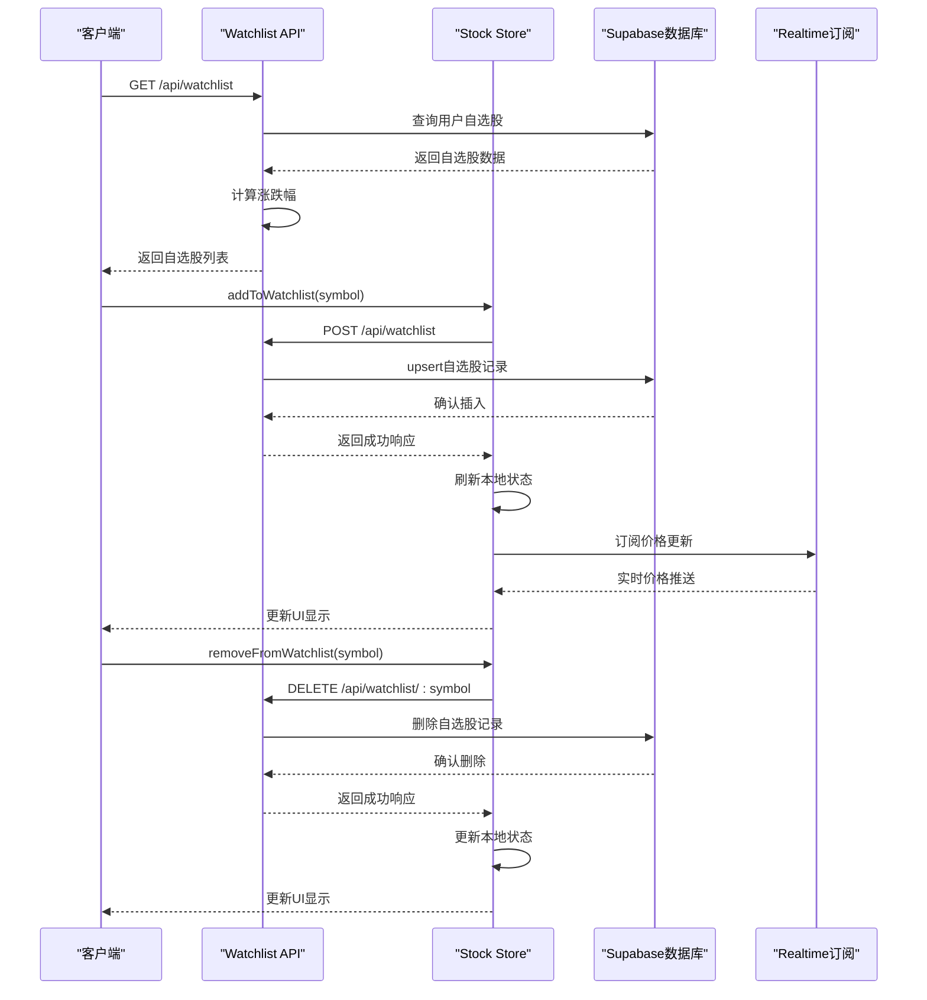

**图表来源**
- [stores/useStockStore.ts:59-123](file://stores/useStockStore.ts#L59-L123)
- [app/api/watchlist/route.ts:19-48](file://app/api/watchlist/route.ts#L19-L48)
- [app/api/watchlist/[symbol]/route.ts:23-41](file://app/api/watchlist/[symbol]/route.ts#L23-L41)

## 详细组件分析

### Watchlist API控制器

Watchlist API控制器实现了完整的自选股管理功能，包括认证、数据验证和错误处理：

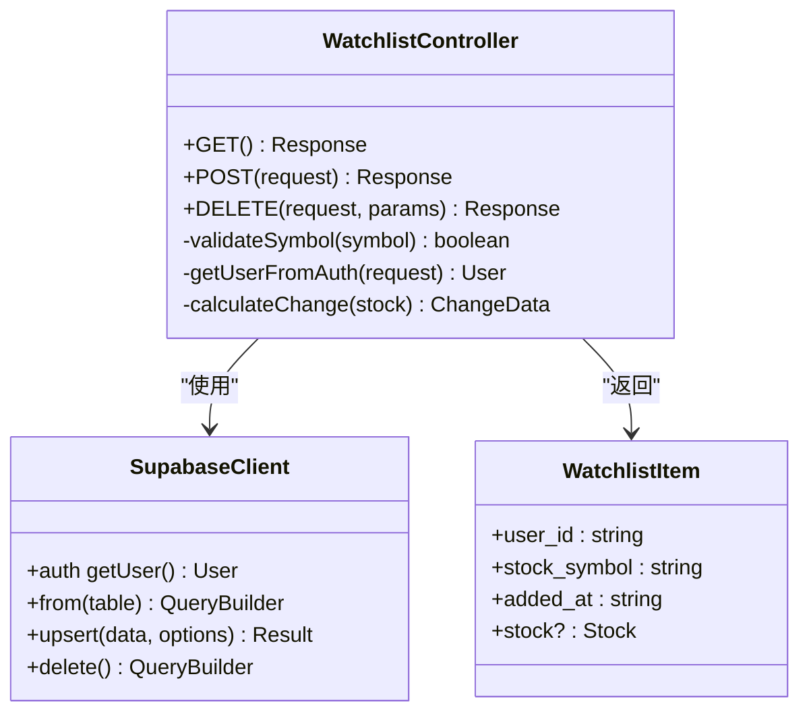

**图表来源**
- [app/api/watchlist/route.ts:1-129](file://app/api/watchlist/route.ts#L1-L129)
- [types/index.ts:82-89](file://types/index.ts#L82-L89)

#### 认证机制

API使用Supabase Auth进行用户认证，所有操作都需要有效的用户会话：

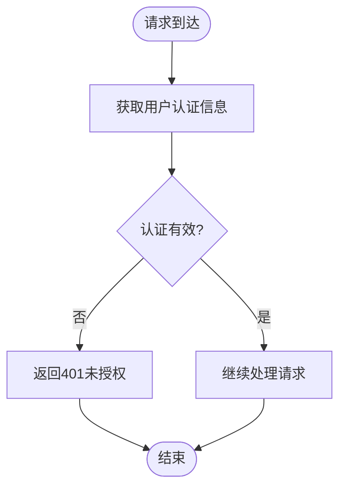

**图表来源**
- [app/api/watchlist/route.ts:9-17](file://app/api/watchlist/route.ts#L9-L17)

#### 数据验证流程

添加自选股时执行严格的验证流程：

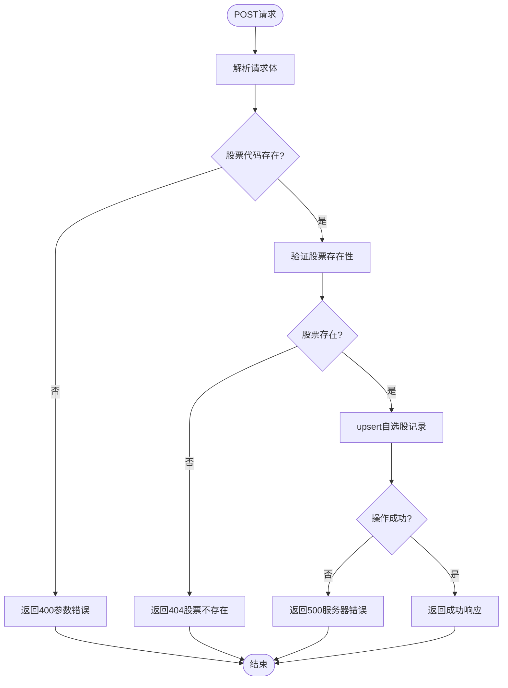

**图表来源**
- [app/api/watchlist/route.ts:73-95](file://app/api/watchlist/route.ts#L73-L95)

**章节来源**
- [app/api/watchlist/route.ts:1-129](file://app/api/watchlist/route.ts#L1-L129)

### Zustand状态管理

useStockStore实现了完整的状态管理，包括自选股操作和实时数据同步：

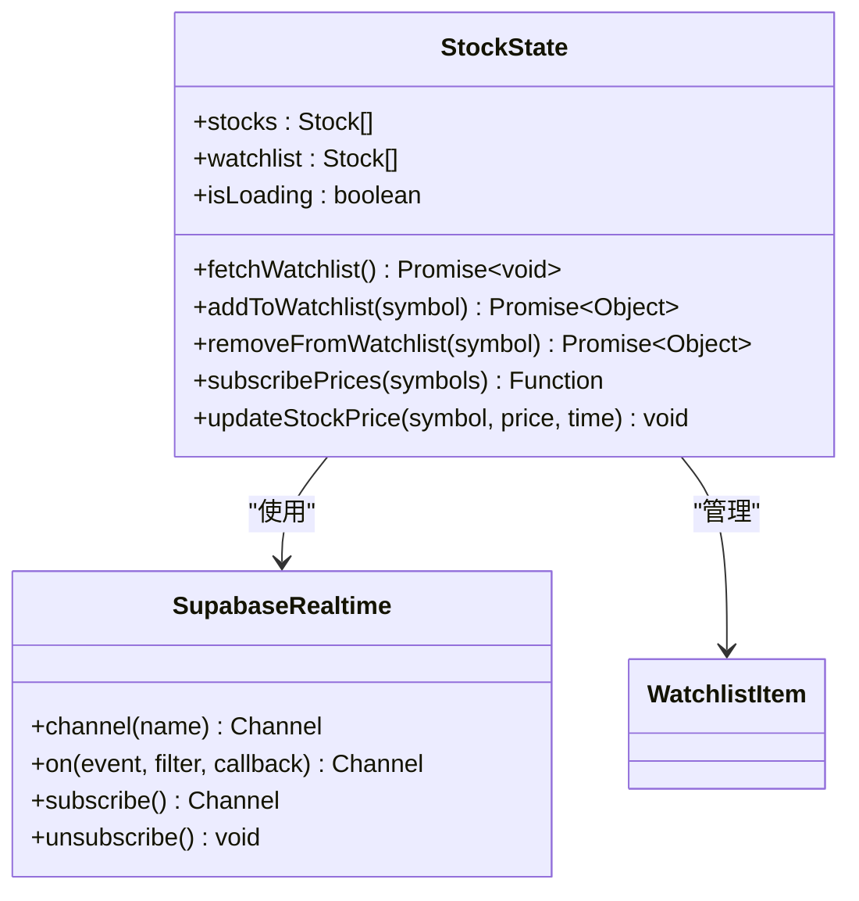

**图表来源**
- [stores/useStockStore.ts:6-21](file://stores/useStockStore.ts#L6-L21)
- [types/index.ts:82-89](file://types/index.ts#L82-L89)

#### 实时价格更新机制

系统使用Supabase Realtime实现价格数据的实时同步：

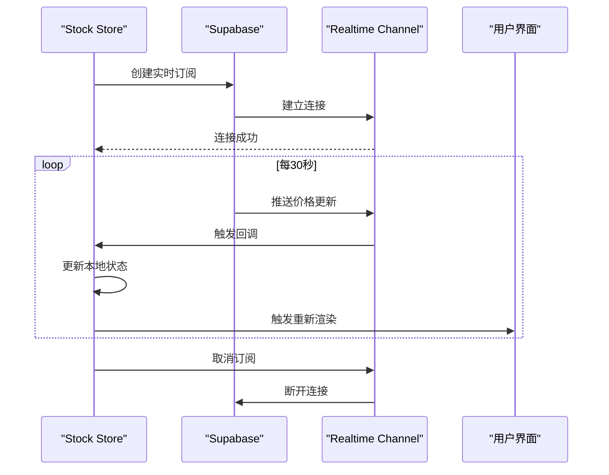

**图表来源**
- [stores/useStockStore.ts:125-150](file://stores/useStockStore.ts#L125-L150)

**章节来源**
- [stores/useStockStore.ts:1-184](file://stores/useStockStore.ts#L1-L184)

### 前端集成组件

StockCard组件提供了用户友好的自选股操作界面：

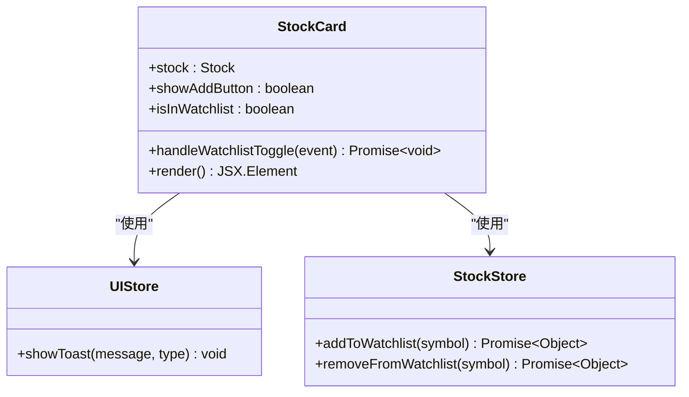

**图表来源**
- [components/stocks/StockCard.tsx:11-27](file://components/stocks/StockCard.tsx#L11-L27)
- [types/index.ts:11-25](file://types/index.ts#L11-L25)

**章节来源**
- [components/stocks/StockCard.tsx:1-150](file://components/stocks/StockCard.tsx#L1-L150)

## 依赖关系分析

自选股管理API的依赖关系呈现清晰的分层结构：

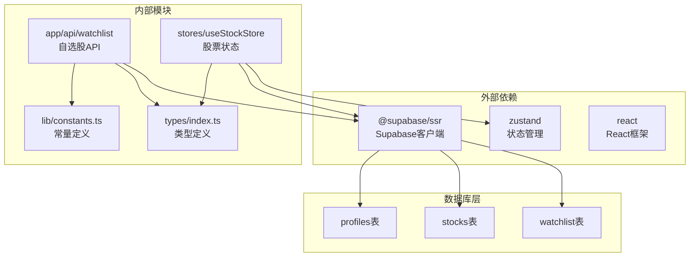

**图表来源**
- [lib/supabase/client.ts:1-9](file://lib/supabase/client.ts#L1-L9)
- [stores/useStockStore.ts:1-5](file://stores/useStockStore.ts#L1-L5)
- [types/index.ts:1-166](file://types/index.ts#L1-L166)

**章节来源**
- [lib/supabase/client.ts:1-9](file://lib/supabase/client.ts#L1-L9)
- [stores/useStockStore.ts:1-184](file://stores/useStockStore.ts#L1-L184)

## 性能考虑

### 数据库优化

1. **索引设计**: watchlist表使用复合主键`(user_id, stock_symbol)`，确保查询和去重的高效性
2. **查询优化**: 使用`select`指定字段，避免不必要的数据传输
3. **排序优化**: 按`added_at`降序排列，提供最新的自选股顺序

### 前端性能优化

1. **状态缓存**: 使用Zustand实现本地状态缓存，减少重复API调用
2. **实时订阅**: 通过Supabase Realtime实现增量更新，避免轮询
3. **批量操作**: 支持批量价格更新，提高渲染效率

### 实时同步机制

系统采用Supabase Realtime实现高效的数据同步：

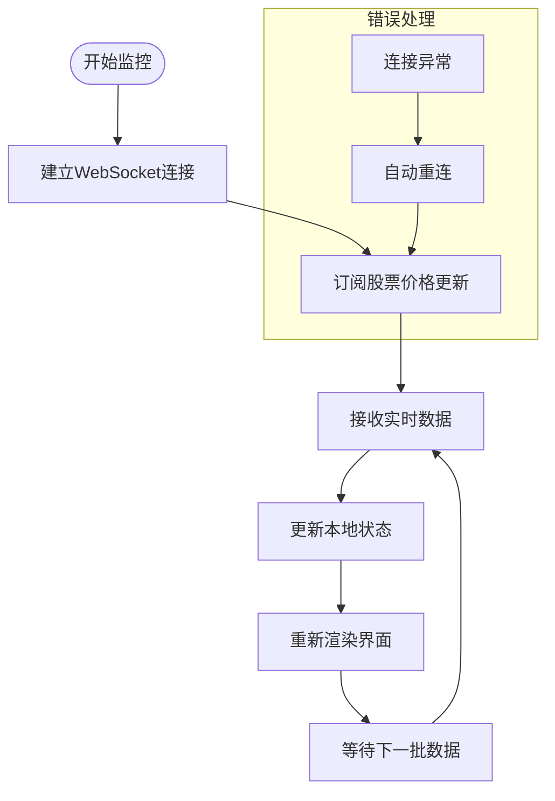

**图表来源**
- [stores/useStockStore.ts:125-150](file://stores/useStockStore.ts#L125-L150)

## 故障排除指南

### 常见错误及解决方案

| 错误代码 | 错误类型 | 可能原因 | 解决方案 |
|---------|---------|---------|---------|
| 401 | 未授权 | 用户未登录或会话失效 | 检查用户认证状态，重新登录 |
| 400 | 参数错误 | 股票代码为空或格式不正确 | 验证股票代码格式，确保非空 |
| 404 | 股票不存在 | 股票代码在数据库中不存在 | 检查股票代码是否正确 |
| 500 | 服务器错误 | 数据库操作失败或系统异常 | 查看服务器日志，检查数据库连接 |

### 错误处理流程

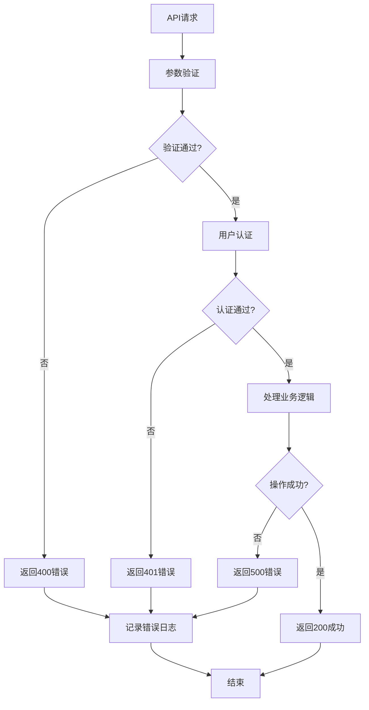

**图表来源**
- [app/api/watchlist/route.ts:12-55](file://app/api/watchlist/route.ts#L12-L55)

### 调试建议

1. **启用详细日志**: 在开发环境中启用详细的API日志记录
2. **监控实时连接**: 使用浏览器开发者工具监控WebSocket连接状态
3. **测试数据流**: 通过单元测试验证数据流的正确性
4. **性能监控**: 监控API响应时间和数据库查询性能

**章节来源**
- [app/api/watchlist/route.ts:12-55](file://app/api/watchlist/route.ts#L12-L55)
- [stores/useStockStore.ts:52-77](file://stores/useStockStore.ts#L52-L77)

## 结论

自选股管理API通过清晰的架构设计和完善的错误处理机制，为用户提供了一个稳定可靠的自选股管理功能。系统采用分层架构，实现了前后端分离和实时数据同步，确保了良好的用户体验。

### 主要优势

1. **安全性**: 完整的用户认证和授权机制
2. **实时性**: 基于Supabase Realtime的实时数据同步
3. **可扩展性**: 模块化设计，易于功能扩展
4. **可靠性**: 完善的错误处理和日志记录机制

### 未来改进方向

1. **批量操作支持**: 扩展批量添加和删除自选股的功能
2. **性能优化**: 实现更高效的缓存策略和数据预加载
3. **用户体验**: 增加自选股排序、分组等高级功能
4. **监控告警**: 增强系统的监控和告警能力

通过持续的优化和改进，自选股管理API将为用户提供更加优质的股票交易体验。