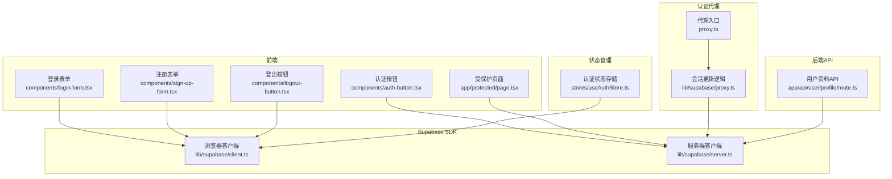
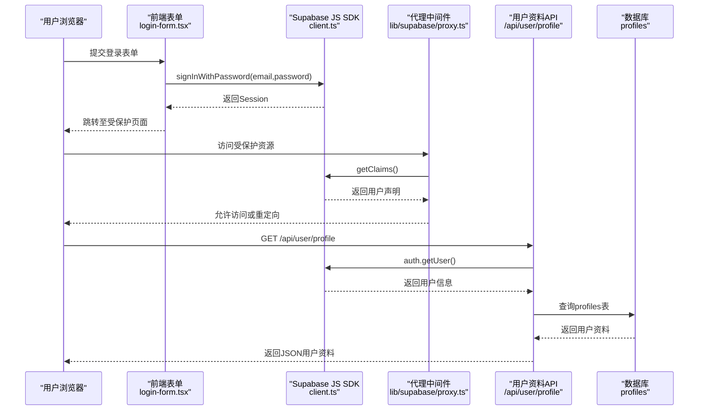
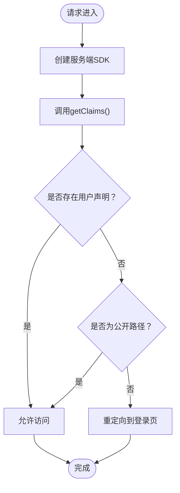
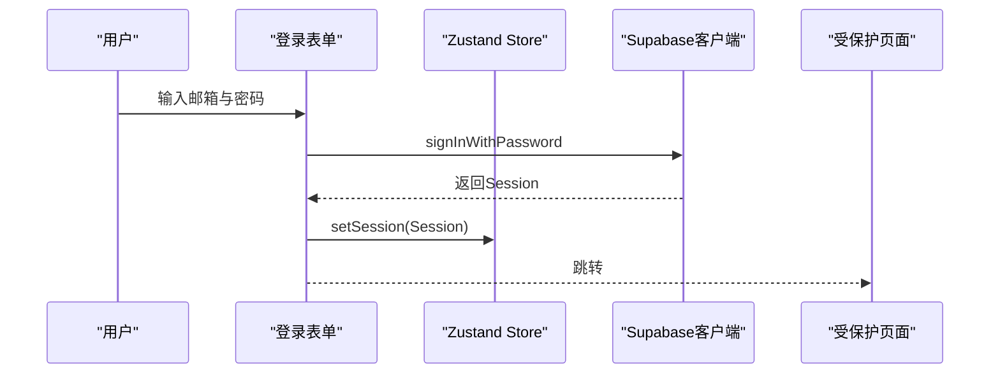
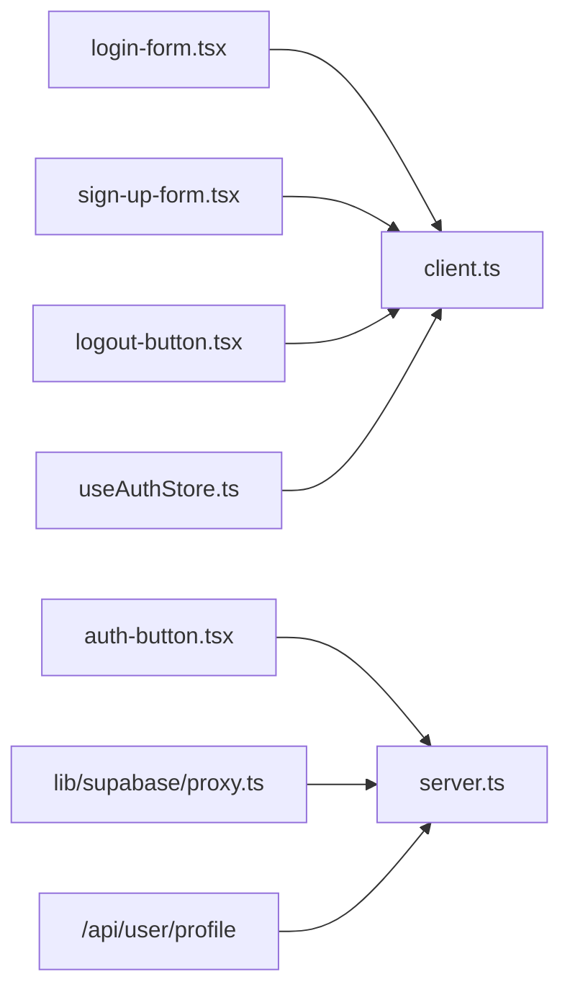

# 认证与用户管理API

<cite>
**本文档引用的文件**
- [app/api/user/profile/route.ts](file://app/api/user/profile/route.ts)
- [lib/supabase/server.ts](file://lib/supabase/server.ts)
- [lib/supabase/client.ts](file://lib/supabase/client.ts)
- [stores/useAuthStore.ts](file://stores/useAuthStore.ts)
- [components/login-form.tsx](file://components/login-form.tsx)
- [components/sign-up-form.tsx](file://components/sign-up-form.tsx)
- [components/auth-button.tsx](file://components/auth-button.tsx)
- [components/logout-button.tsx](file://components/logout-button.tsx)
- [lib/supabase/proxy.ts](file://lib/supabase/proxy.ts)
- [proxy.ts](file://proxy.ts)
- [types/index.ts](file://types/index.ts)
- [app/protected/page.tsx](file://app/protected/page.tsx)
- [app/auth/confirm/route.ts](file://app/auth/confirm/route.ts)
</cite>

## 目录
1. [简介](#简介)
2. [项目结构](#项目结构)
3. [核心组件](#核心组件)
4. [架构总览](#架构总览)
5. [详细组件分析](#详细组件分析)
6. [依赖关系分析](#依赖关系分析)
7. [性能考虑](#性能考虑)
8. [故障排除指南](#故障排除指南)
9. [结论](#结论)

## 简介
本文件面向认证与用户管理API的使用者与维护者，系统性阐述以下内容：
- 用户认证流程与会话管理机制
- JWT令牌与Supabase会话的工作方式
- 获取用户资料API的完整规范（请求方法、参数、响应、错误码）
- 用户资料字段定义与业务含义
- 请求与响应示例（成功与失败场景）
- 认证中间件与权限验证机制
- 用户状态管理与会话处理最佳实践

## 项目结构
围绕认证与用户管理的关键目录与文件如下：
- API层：用户资料接口位于 `/app/api/user/profile/route.ts`
- 客户端SDK封装：`lib/supabase/client.ts`（浏览器端）、`lib/supabase/server.ts`（服务端）
- 认证状态管理：`stores/useAuthStore.ts`（Zustand）
- 前端认证表单：`components/login-form.tsx`、`components/sign-up-form.tsx`
- 认证按钮与登出：`components/auth-button.tsx`、`components/logout-button.tsx`
- 会话代理与中间件：`lib/supabase/proxy.ts`、`proxy.ts`
- 类型定义：`types/index.ts`（包含Profile接口）
- 受保护页面与回调：`app/protected/page.tsx`、`app/auth/confirm/route.ts`

**图表来源**
- [components/login-form.tsx:1-111](file://components/login-form.tsx#L1-L111)
- [components/sign-up-form.tsx:1-121](file://components/sign-up-form.tsx#L1-L121)
- [components/auth-button.tsx:1-30](file://components/auth-button.tsx#L1-L30)
- [components/logout-button.tsx:1-18](file://components/logout-button.tsx#L1-L18)
- [stores/useAuthStore.ts:1-104](file://stores/useAuthStore.ts#L1-L104)
- [proxy.ts:1-21](file://proxy.ts#L1-L21)
- [lib/supabase/proxy.ts:1-77](file://lib/supabase/proxy.ts#L1-L77)
- [app/api/user/profile/route.ts:1-42](file://app/api/user/profile/route.ts#L1-L42)
- [lib/supabase/client.ts:1-9](file://lib/supabase/client.ts#L1-L9)
- [lib/supabase/server.ts:1-35](file://lib/supabase/server.ts#L1-L35)

**章节来源**
- [components/login-form.tsx:1-111](file://components/login-form.tsx#L1-L111)
- [components/sign-up-form.tsx:1-121](file://components/sign-up-form.tsx#L1-L121)
- [components/auth-button.tsx:1-30](file://components/auth-button.tsx#L1-L30)
- [components/logout-button.tsx:1-18](file://components/logout-button.tsx#L1-L18)
- [stores/useAuthStore.ts:1-104](file://stores/useAuthStore.ts#L1-L104)
- [proxy.ts:1-21](file://proxy.ts#L1-L21)
- [lib/supabase/proxy.ts:1-77](file://lib/supabase/proxy.ts#L1-L77)
- [app/api/user/profile/route.ts:1-42](file://app/api/user/profile/route.ts#L1-L42)
- [lib/supabase/client.ts:1-9](file://lib/supabase/client.ts#L1-L9)
- [lib/supabase/server.ts:1-35](file://lib/supabase/server.ts#L1-L35)

## 核心组件
- 用户资料API：提供GET /api/user/profile，返回当前用户的资料信息
- 浏览器端Supabase客户端：封装NEXT_PUBLIC_SUPABASE_URL与NEXT_PUBLIC_SUPABASE_PUBLISHABLE_KEY
- 服务端Supabase客户端：基于cookies读写，支持SSR与Next.js Server Components
- 认证状态存储：Zustand Store封装登录、注册、登出与会话初始化
- 会话代理中间件：统一处理会话校验与重定向逻辑
- 前端认证表单与按钮：负责用户输入、调用Supabase API与页面跳转

**章节来源**
- [app/api/user/profile/route.ts:1-42](file://app/api/user/profile/route.ts#L1-L42)
- [lib/supabase/client.ts:1-9](file://lib/supabase/client.ts#L1-L9)
- [lib/supabase/server.ts:1-35](file://lib/supabase/server.ts#L1-L35)
- [stores/useAuthStore.ts:1-104](file://stores/useAuthStore.ts#L1-L104)
- [lib/supabase/proxy.ts:1-77](file://lib/supabase/proxy.ts#L1-L77)

## 架构总览
认证与用户管理采用“前端表单+Supabase JS SDK+服务端API”的组合模式：
- 前端通过浏览器端SDK进行登录/注册/登出
- 服务端通过服务端SDK读取cookies中的会话信息
- 会话代理中间件在请求进入时校验用户是否已登录
- 用户资料API通过服务端SDK查询数据库表profiles

**图表来源**
- [components/login-form.tsx:29-48](file://components/login-form.tsx#L29-L48)
- [lib/supabase/client.ts:1-9](file://lib/supabase/client.ts#L1-L9)
- [lib/supabase/proxy.ts:45-76](file://lib/supabase/proxy.ts#L45-L76)
- [app/api/user/profile/route.ts:5-41](file://app/api/user/profile/route.ts#L5-L41)

## 详细组件分析

### 用户资料API（GET /api/user/profile）
- 功能：获取当前已登录用户的资料
- 请求方法：GET
- 路径：/api/user/profile
- 认证要求：需要有效会话（由Supabase会话cookie提供）
- 成功响应：返回用户资料对象（JSON）
- 失败响应：
  - 401 未登录：当无法获取用户或会话无效
  - 500 服务器内部错误：数据库查询异常或其他运行时错误

请求示例（curl）
- 成功场景
  - curl -H "Cookie: sb-session-cookie=...; Path=/; HttpOnly" https://your-domain/api/user/profile
- 失败场景（未登录）
  - curl https://your-domain/api/user/profile

响应示例
- 成功响应
  - {"id":"user-id","email":"user@example.com","virtual_balance":100000,"created_at":"2024-01-01T00:00:00Z","updated_at":"2024-01-01T00:00:00Z"}
- 失败响应（未登录）
  - {"error":"未登录"}
- 失败响应（服务器错误）
  - {"error":"获取用户信息失败"}

错误处理
- 当auth.getUser()返回错误或user为空时，返回401
- 数据库查询错误时返回500
- 捕获异常时返回500

**章节来源**
- [app/api/user/profile/route.ts:1-42](file://app/api/user/profile/route.ts#L1-L42)
- [types/index.ts:2-8](file://types/index.ts#L2-L8)

### 用户资料字段定义
- id：字符串，用户唯一标识
- email：字符串，用户邮箱
- virtual_balance：数值，虚拟余额
- created_at：字符串（ISO 8601），创建时间
- updated_at：字符串（ISO 8601），更新时间

用途说明
- virtual_balance用于虚拟股票交易的可用资金管理
- created_at/updated_at用于审计与排序

**章节来源**
- [types/index.ts:2-8](file://types/index.ts#L2-L8)

### 认证流程与JWT令牌使用
- 登录流程
  - 前端表单提交邮箱与密码
  - 使用浏览器端SDK调用signInWithPassword
  - Supabase返回Session（包含访问令牌与刷新令牌）
  - 前端可选择保存Session并跳转页面
- 会话保持
  - 浏览器端SDK通过cookies维持会话
  - 服务端SDK通过cookies读取会话并调用getClaims()进行校验
- JWT令牌
  - Supabase会话基于JWT实现，客户端与服务端共享会话状态
  - 代理中间件在每次请求时调用getClaims()以确保会话有效性

请求头格式
- 无需手动设置Authorization头；Supabase会话通过Cookie自动携带
- Cookie名称通常为sb-session-cookie（具体以部署环境为准）

认证失败处理
- 401 未登录：当getClaims()无用户或路径不在允许列表时触发重定向
- 404/500：API内部错误或数据库异常

**章节来源**
- [components/login-form.tsx:29-48](file://components/login-form.tsx#L29-L48)
- [lib/supabase/client.ts:1-9](file://lib/supabase/client.ts#L1-L9)
- [lib/supabase/proxy.ts:45-76](file://lib/supabase/proxy.ts#L45-L76)
- [app/protected/page.tsx:8-17](file://app/protected/page.tsx#L8-L17)

### 认证中间件与权限验证机制
- 代理中间件职责
  - 在请求进入时创建服务端SDK实例
  - 调用getClaims()获取用户声明
  - 若用户未登录且访问非公开路径，则重定向至登录页
  - 必须原样返回supabaseResponse，避免浏览器与服务器会话不同步
- 匹配规则
  - 对除静态资源外的所有路径生效
- 重要约束
  - 不要在createServerClient与getClaims()之间执行其他逻辑
  - 必须复制cookies（getAll/setAll）以保持会话一致

**图表来源**
- [lib/supabase/proxy.ts:50-60](file://lib/supabase/proxy.ts#L50-L60)

**章节来源**
- [lib/supabase/proxy.ts:1-77](file://lib/supabase/proxy.ts#L1-L77)
- [proxy.ts:1-21](file://proxy.ts#L1-L21)

### 前端认证表单与状态管理
- 登录表单
  - 收集邮箱与密码，调用Supabase登录
  - 登录成功后跳转至受保护页面
- 注册表单
  - 校验两次密码一致性
  - 调用Supabase注册，并携带emailRedirectTo参数
- 认证状态存储
  - 维护session、user、isLoading、isInitialized
  - 提供initialize方法监听AuthStateChange事件
  - 提供signIn/signUp/signOut方法

**图表来源**
- [components/login-form.tsx:29-48](file://components/login-form.tsx#L29-L48)
- [stores/useAuthStore.ts:31-48](file://stores/useAuthStore.ts#L31-L48)

**章节来源**
- [components/login-form.tsx:1-111](file://components/login-form.tsx#L1-L111)
- [components/sign-up-form.tsx:1-121](file://components/sign-up-form.tsx#L1-L121)
- [stores/useAuthStore.ts:1-104](file://stores/useAuthStore.ts#L1-L104)

### 会话处理最佳实践
- 服务端SDK必须在每次请求内创建，避免全局变量导致上下文污染
- 代理中间件必须调用getClaims()以保持会话一致性
- 始终复制cookies（getAll/setAll），防止浏览器与服务器会话不同步
- 在受保护页面中优先使用服务端SDK进行权限校验
- 前端Store应监听onAuthStateChange事件，确保UI与会话同步

**章节来源**
- [lib/supabase/server.ts:9-34](file://lib/supabase/server.ts#L9-L34)
- [lib/supabase/proxy.ts:41-43](file://lib/supabase/proxy.ts#L41-L43)
- [lib/supabase/proxy.ts:62-76](file://lib/supabase/proxy.ts#L62-L76)
- [app/protected/page.tsx:8-17](file://app/protected/page.tsx#L8-L17)

## 依赖关系分析
- 前端表单依赖Supabase浏览器端SDK
- 代理中间件依赖Supabase服务端SDK与cookies
- 用户资料API依赖Supabase服务端SDK与数据库profiles表
- Zustand Store作为状态中心协调前端与Supabase会话

**图表来源**
- [components/login-form.tsx:1-111](file://components/login-form.tsx#L1-L111)
- [components/sign-up-form.tsx:1-121](file://components/sign-up-form.tsx#L1-L121)
- [components/auth-button.tsx:1-30](file://components/auth-button.tsx#L1-L30)
- [components/logout-button.tsx:1-18](file://components/logout-button.tsx#L1-L18)
- [lib/supabase/proxy.ts:1-77](file://lib/supabase/proxy.ts#L1-L77)
- [app/api/user/profile/route.ts:1-42](file://app/api/user/profile/route.ts#L1-L42)
- [stores/useAuthStore.ts:1-104](file://stores/useAuthStore.ts#L1-L104)

**章节来源**
- [components/login-form.tsx:1-111](file://components/login-form.tsx#L1-L111)
- [components/sign-up-form.tsx:1-121](file://components/sign-up-form.tsx#L1-L121)
- [components/auth-button.tsx:1-30](file://components/auth-button.tsx#L1-L30)
- [components/logout-button.tsx:1-18](file://components/logout-button.tsx#L1-L18)
- [lib/supabase/proxy.ts:1-77](file://lib/supabase/proxy.ts#L1-L77)
- [app/api/user/profile/route.ts:1-42](file://app/api/user/profile/route.ts#L1-L42)
- [stores/useAuthStore.ts:1-104](file://stores/useAuthStore.ts#L1-L104)

## 性能考虑
- 减少不必要的getClaims()调用：仅在需要鉴权的页面或API中使用
- 合理缓存用户资料：前端Store可缓存Profile以减少重复请求
- 优化数据库查询：用户资料API仅查询必要字段
- 会话代理中间件应尽量短路无用户请求，避免额外开销

## 故障排除指南
常见问题与解决步骤
- 401 未登录
  - 检查浏览器是否正确接收并发送会话Cookie
  - 确认代理中间件是否正常调用getClaims()
  - 确认受保护页面是否正确重定向
- 500 服务器内部错误
  - 检查数据库连接与profiles表结构
  - 查看API日志中的错误堆栈
- 会话不同步
  - 确保代理中间件返回supabaseResponse并复制cookies
  - 避免在createServerClient与getClaims()之间插入其他逻辑
- 注册/登录无反应
  - 检查Supabase环境变量是否正确配置
  - 确认前端表单提交的邮箱与密码格式

**章节来源**
- [app/api/user/profile/route.ts:12-40](file://app/api/user/profile/route.ts#L12-L40)
- [lib/supabase/proxy.ts:62-76](file://lib/supabase/proxy.ts#L62-L76)
- [components/login-form.tsx:35-47](file://components/login-form.tsx#L35-L47)
- [components/sign-up-form.tsx:36-56](file://components/sign-up-form.tsx#L36-L56)

## 结论
本系统采用Supabase提供的会话与JWT机制，结合代理中间件与服务端SDK，实现了可靠的认证与用户管理能力。用户资料API提供了简洁的接口以获取当前用户的核心信息。遵循本文档中的最佳实践，可确保会话一致性、安全性与可维护性。