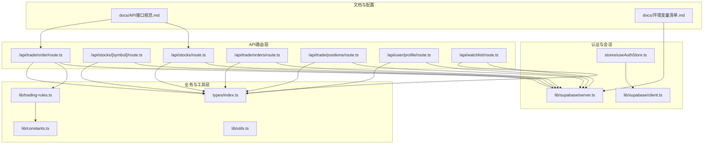
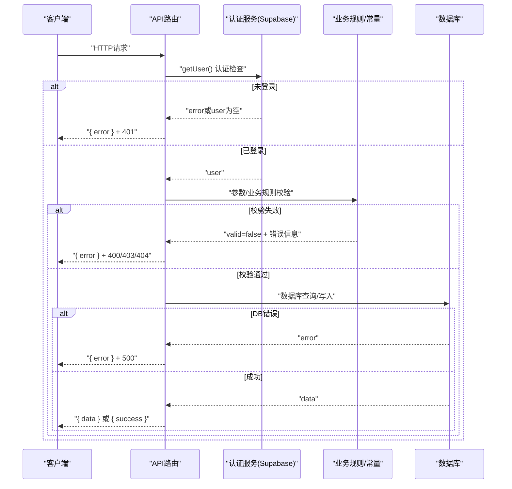
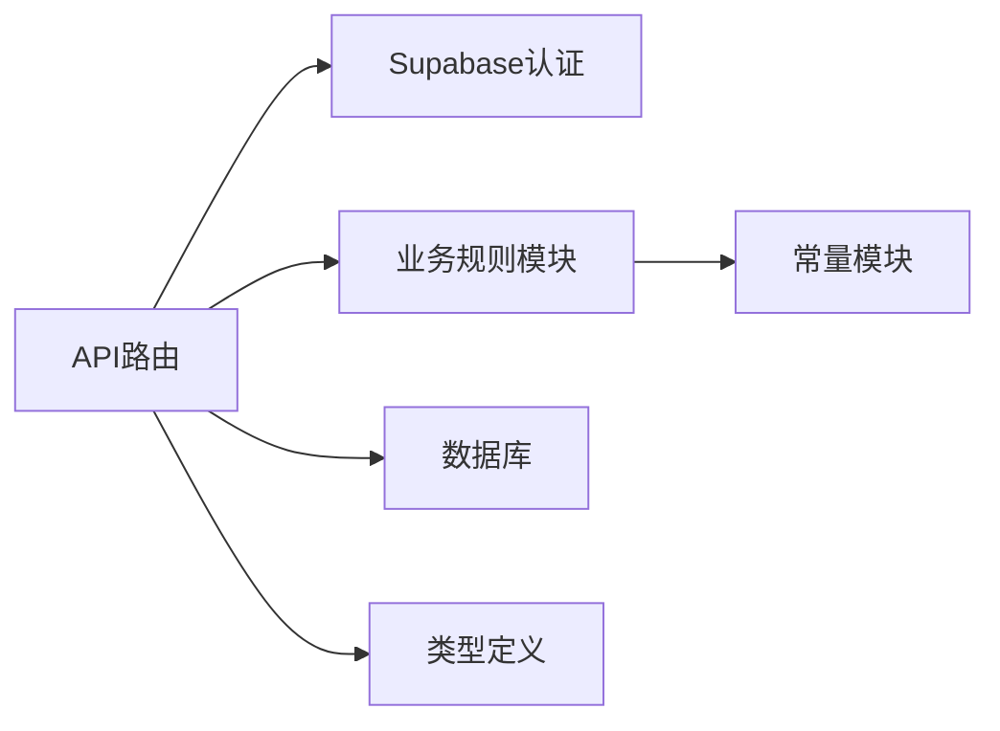

# 错误处理与状态码

<cite>
**本文引用的文件**
- [app/api/stocks/route.ts](file://app/api/stocks/route.ts)
- [app/api/stocks/[symbol]/route.ts](file://app/api/stocks/[symbol]/route.ts)
- [app/api/trade/order/route.ts](file://app/api/trade/order/route.ts)
- [app/api/trade/orders/route.ts](file://app/api/trade/orders/route.ts)
- [app/api/trade/positions/route.ts](file://app/api/trade/positions/route.ts)
- [app/api/user/profile/route.ts](file://app/api/user/profile/route.ts)
- [app/api/watchlist/route.ts](file://app/api/watchlist/route.ts)
- [lib/trading-rules.ts](file://lib/trading-rules.ts)
- [lib/constants.ts](file://lib/constants.ts)
- [types/index.ts](file://types/index.ts)
- [lib/utils.ts](file://lib/utils.ts)
- [lib/supabase/server.ts](file://lib/supabase/server.ts)
- [lib/supabase/client.ts](file://lib/supabase/client.ts)
- [stores/useAuthStore.ts](file://stores/useAuthStore.ts)
- [docs/API接口规范.md](file://docs/API接口规范.md)
- [docs/环境变量清单.md](file://docs/环境变量清单.md)
- [app/auth/error/page.tsx](file://app/auth/error/page.tsx)
</cite>

## 目录
1. [简介](#简介)
2. [项目结构](#项目结构)
3. [核心组件](#核心组件)
4. [架构总览](#架构总览)
5. [详细组件分析](#详细组件分析)
6. [依赖关系分析](#依赖关系分析)
7. [性能考量](#性能考量)
8. [故障排查指南](#故障排查指南)
9. [结论](#结论)
10. [附录](#附录)

## 简介
本文件聚焦于本项目的API错误处理与状态码规范，结合现有代码实现，系统性梳理标准HTTP状态码的使用边界、自定义错误语义、统一错误响应格式、最佳实践（重试、降级、监控告警）、不同错误类型的用户提示策略、API版本与向后兼容性建议，以及错误诊断与调试工具使用方法。目标是帮助开发者与产品/测试人员在理解现有实现的基础上，进一步完善与落地一致化的错误处理体系。

## 项目结构
本项目采用Next.js App Router风格的API路由组织，业务模块按功能域划分（如stocks、trade、user、watchlist）。错误处理主要集中在各API路由层，通过NextResponse.json返回统一的错误响应，并依据错误类型选择合适的HTTP状态码；部分业务校验逻辑位于独立的工具模块（如交易规则）。

图表来源
- [app/api/stocks/route.ts:1-69](file://app/api/stocks/route.ts#L1-L69)
- [app/api/stocks/[symbol]/route.ts:1-71](file://app/api/stocks/[symbol]/route.ts#L1-L71)
- [app/api/trade/order/route.ts:1-331](file://app/api/trade/order/route.ts#L1-L331)
- [app/api/trade/orders/route.ts:1-66](file://app/api/trade/orders/route.ts#L1-L66)
- [app/api/trade/positions/route.ts:1-46](file://app/api/trade/positions/route.ts#L1-L46)
- [app/api/user/profile/route.ts:1-42](file://app/api/user/profile/route.ts#L1-L42)
- [app/api/watchlist/route.ts:1-129](file://app/api/watchlist/route.ts#L1-L129)
- [lib/trading-rules.ts:1-272](file://lib/trading-rules.ts#L1-L272)
- [lib/constants.ts:1-101](file://lib/constants.ts#L1-L101)
- [types/index.ts:1-166](file://types/index.ts#L1-L166)
- [lib/supabase/server.ts:1-35](file://lib/supabase/server.ts#L1-L35)
- [lib/supabase/client.ts:1-9](file://lib/supabase/client.ts#L1-L9)
- [stores/useAuthStore.ts:1-104](file://stores/useAuthStore.ts#L1-L104)
- [docs/API接口规范.md:567-577](file://docs/API接口规范.md#L567-L577)
- [docs/环境变量清单.md:54-122](file://docs/环境变量清单.md#L54-L122)

章节来源
- [app/api/stocks/route.ts:1-69](file://app/api/stocks/route.ts#L1-L69)
- [app/api/stocks/[symbol]/route.ts:1-71](file://app/api/stocks/[symbol]/route.ts#L1-L71)
- [app/api/trade/order/route.ts:1-331](file://app/api/trade/order/route.ts#L1-L331)
- [app/api/trade/orders/route.ts:1-66](file://app/api/trade/orders/route.ts#L1-L66)
- [app/api/trade/positions/route.ts:1-46](file://app/api/trade/positions/route.ts#L1-L46)
- [app/api/user/profile/route.ts:1-42](file://app/api/user/profile/route.ts#L1-L42)
- [app/api/watchlist/route.ts:1-129](file://app/api/watchlist/route.ts#L1-L129)
- [lib/trading-rules.ts:1-272](file://lib/trading-rules.ts#L1-L272)
- [lib/constants.ts:1-101](file://lib/constants.ts#L1-L101)
- [types/index.ts:1-166](file://types/index.ts#L1-L166)
- [lib/supabase/server.ts:1-35](file://lib/supabase/server.ts#L1-L35)
- [lib/supabase/client.ts:1-9](file://lib/supabase/client.ts#L1-L9)
- [stores/useAuthStore.ts:1-104](file://stores/useAuthStore.ts#L1-L104)
- [docs/API接口规范.md:567-577](file://docs/API接口规范.md#L567-L577)
- [docs/环境变量清单.md:54-122](file://docs/环境变量清单.md#L54-L122)

## 核心组件
- API路由层：集中处理认证检查、参数校验、业务规则校验、数据库操作与错误捕获，统一返回JSON错误响应与状态码。
- 业务规则与常量：提供交易时间判断、涨跌停校验、手续费与金额计算、分页与交易常量等，作为路由层的校验依据。
- 类型系统：统一定义API响应结构（含data、error、message、分页字段），便于前后端一致性。
- 认证与会话：基于Supabase的SSR与浏览器客户端，提供会话初始化、状态监听与错误映射。
- 文档与配置：错误码规范与环境变量清单，指导错误响应格式与运行时配置。

章节来源
- [app/api/trade/order/route.ts:18-23](file://app/api/trade/order/route.ts#L18-L23)
- [lib/trading-rules.ts:170-201](file://lib/trading-rules.ts#L170-L201)
- [lib/constants.ts:70-79](file://lib/constants.ts#L70-L79)
- [types/index.ts:148-156](file://types/index.ts#L148-L156)
- [stores/useAuthStore.ts:81-101](file://stores/useAuthStore.ts#L81-L101)
- [docs/API接口规范.md:567-577](file://docs/API接口规范.md#L567-L577)
- [docs/环境变量清单.md:54-122](file://docs/环境变量清单.md#L54-L122)

## 架构总览
下图展示API路由层与业务/工具层的交互关系，以及错误处理在调用链中的位置。

图表来源
- [app/api/trade/order/route.ts:11-331](file://app/api/trade/order/route.ts#L11-L331)
- [lib/trading-rules.ts:170-247](file://lib/trading-rules.ts#L170-L247)
- [lib/supabase/server.ts:9-34](file://lib/supabase/server.ts#L9-L34)

## 详细组件分析

### 统一错误响应格式与状态码使用
- 统一响应结构：所有API路由在错误分支返回形如{ error: string }的JSON对象；部分列表接口返回{ data, total, page, limit }结构。
- 标准状态码使用：
  - 400 请求参数错误/业务规则校验失败
  - 401 未认证
  - 403 无权限/非交易时间
  - 404 资源不存在
  - 500 服务器内部错误
- 文档化错误码规范：项目文档明确列出常见状态码与含义，建议在生产环境中保持一致。

章节来源
- [app/api/stocks/route.ts:38-44](file://app/api/stocks/route.ts#L38-L44)
- [app/api/trade/order/route.ts:18-23](file://app/api/trade/order/route.ts#L18-L23)
- [app/api/watchlist/route.ts:12-17](file://app/api/watchlist/route.ts#L12-L17)
- [app/api/user/profile/route.ts:12-17](file://app/api/user/profile/route.ts#L12-L17)
- [docs/API接口规范.md:567-577](file://docs/API接口规范.md#L567-L577)

### 2xx 成功响应
- 股票列表与详情：成功时返回包含计算字段（涨跌幅等）的数据结构；列表接口包含分页统计字段。
- 用户资料、自选股、委托记录、持仓：成功时返回对应实体或数组结构。
- 交易下单：成功时返回订单关键字段（含费用、状态等）。

章节来源
- [app/api/stocks/route.ts:55-60](file://app/api/stocks/route.ts#L55-L60)
- [app/api/stocks/[symbol]/route.ts:57-64](file://app/api/stocks/[symbol]/route.ts#L57-L64)
- [app/api/user/profile/route.ts:33](file://app/api/user/profile/route.ts#L33)
- [app/api/watchlist/route.ts:48](file://app/api/watchlist/route.ts#L48)
- [app/api/trade/orders/route.ts:52-57](file://app/api/trade/orders/route.ts#L52-L57)
- [app/api/trade/positions/route.ts:37](file://app/api/trade/positions/route.ts#L37)
- [app/api/trade/order/route.ts:199-210](file://app/api/trade/order/route.ts#L199-L210)

### 4xx 客户端错误
- 未认证：路由层通过认证服务检测失败后返回401。
- 参数不完整/非法：下单接口对必填字段与类型进行校验，返回400。
- 非交易时间：下单接口检查交易时间，返回403。
- 资源不存在：查询股票或自选股时，数据库返回空或错误，返回404。
- 自选股添加：股票代码为空或不存在，返回400/404。

章节来源
- [app/api/trade/order/route.ts:28-41](file://app/api/trade/order/route.ts#L28-L41)
- [app/api/trade/order/route.ts:43-49](file://app/api/trade/order/route.ts#L43-L49)
- [app/api/trade/order/route.ts:58-63](file://app/api/trade/order/route.ts#L58-L63)
- [app/api/watchlist/route.ts:76-95](file://app/api/watchlist/route.ts#L76-L95)
- [app/api/user/profile/route.ts:12-17](file://app/api/user/profile/route.ts#L12-L17)

### 5xx 服务器错误
- 数据库查询/写入异常：统一返回500，包含通用错误消息。
- 未捕获异常：try/catch兜底，返回500。

章节来源
- [app/api/stocks/route.ts:38-44](file://app/api/stocks/route.ts#L38-L44)
- [app/api/user/profile/route.ts:25-31](file://app/api/user/profile/route.ts#L25-L31)
- [app/api/watchlist/route.ts:108-114](file://app/api/watchlist/route.ts#L108-L114)
- [app/api/trade/order/route.ts:119-125](file://app/api/trade/order/route.ts#L119-L125)
- [app/api/trade/order/route.ts:144-150](file://app/api/trade/order/route.ts#L144-L150)

### 业务规则与自定义错误
- 交易规则校验：下单前执行交易时间、数量合法性、涨跌停范围、资金/持仓充足性等校验，失败返回400及具体错误信息。
- 价格与费用计算：提供统一的费用与总成本计算函数，供下单流程复用。
- 分页与交易常量：默认分页大小、最大分页、交易费率、涨跌停比例等集中管理。

章节来源
- [lib/trading-rules.ts:170-247](file://lib/trading-rules.ts#L170-L247)
- [lib/trading-rules.ts:88-125](file://lib/trading-rules.ts#L88-L125)
- [lib/constants.ts:70-79](file://lib/constants.ts#L70-L79)

### 认证与会话错误
- 路由层认证：通过getUser()检查会话有效性，失败返回401。
- 前端状态管理：初始化会话并监听状态变化，错误时返回给调用方。

章节来源
- [app/api/user/profile/route.ts:10-17](file://app/api/user/profile/route.ts#L10-L17)
- [stores/useAuthStore.ts:81-101](file://stores/useAuthStore.ts#L81-L101)

### 错误降级与容错
- 实时行情降级：当第三方实时接口调用失败或超时时，降级返回数据库中的基础数据，确保服务可用性。
- 交易流程事务化：下单涉及多步写入，出现错误时记录日志并返回500，建议在生产中引入更细粒度的回滚策略与幂等设计。

章节来源
- [app/api/stocks/[symbol]/route.ts:53-55](file://app/api/stocks/[symbol]/route.ts#L53-L55)
- [app/api/trade/order/route.ts:109-150](file://app/api/trade/order/route.ts#L109-L150)

### 错误响应格式与结构
- 统一字段：所有错误响应包含error字段；列表接口包含分页统计字段（total/page/limit）。
- 类型约束：响应类型接口定义了data、error、message、分页字段，便于前端统一处理。

章节来源
- [types/index.ts:148-156](file://types/index.ts#L148-L156)
- [app/api/stocks/route.ts:55-60](file://app/api/stocks/route.ts#L55-L60)
- [app/api/watchlist/route.ts:116-120](file://app/api/watchlist/route.ts#L116-L120)

### API版本与向后兼容性
- 当前实现未显式使用版本号路径（如/api/v1/...），建议在新增或变更接口时增加版本前缀，保证向后兼容。
- 对于破坏性变更，保留旧版本接口一段时间并标注废弃，同时提供迁移指引。

（本节为概念性建议，不直接分析具体文件）

### 用户提示策略
- 明确错误语义：错误消息应清晰描述问题原因与解决方向（如“非交易时间”、“资金不足”）。
- 与UI联动：前端根据状态码与错误信息展示Toast或弹窗，避免暴露技术细节。

（本节为概念性建议，不直接分析具体文件）

## 依赖关系分析
- 路由层依赖认证服务（Supabase）进行用户校验，依赖业务规则模块进行下单校验，依赖数据库进行数据读写。
- 业务规则模块依赖常量模块（交易费率、涨跌停比例、交易时间等）。
- 类型系统为所有API响应提供统一结构，降低前后端耦合。

图表来源
- [app/api/trade/order/route.ts:11-331](file://app/api/trade/order/route.ts#L11-L331)
- [lib/trading-rules.ts:1-272](file://lib/trading-rules.ts#L1-L272)
- [lib/constants.ts:1-101](file://lib/constants.ts#L1-L101)
- [types/index.ts:148-156](file://types/index.ts#L148-L156)

## 性能考量
- 降级策略：实时接口失败时快速降级，减少等待时间，提升用户体验。
- 日志与监控：错误发生时打印日志，建议接入统一监控（如Sentry）以便追踪与告警。
- 幂等与事务：下单流程涉及多次数据库写入，建议引入幂等键与事务/回滚策略，避免数据不一致。

（本节为一般性建议，不直接分析具体文件）

## 故障排查指南
- 环境变量缺失：若缺少Supabase或第三方API密钥，可能导致认证失败或实时接口调用异常。请参考环境变量清单核对配置。
- 认证页面错误：认证错误页面支持从URL参数接收错误码，便于定位登录/注册阶段的问题。
- 日志定位：路由层在错误分支打印详细错误信息，可据此快速定位数据库错误或业务规则校验失败点。

章节来源
- [docs/环境变量清单.md:54-122](file://docs/环境变量清单.md#L54-L122)
- [app/auth/error/page.tsx:13-21](file://app/auth/error/page.tsx#L13-L21)
- [app/api/stocks/route.ts:62-67](file://app/api/stocks/route.ts#L62-L67)

## 结论
本项目在API错误处理方面已形成较为一致的模式：统一的错误响应结构、明确的状态码使用边界、基于业务规则的前置校验、以及在实时接口失败时的降级策略。建议在后续迭代中进一步完善版本化接口、增强监控告警、细化错误分类与用户提示，并在下单等关键流程中引入更强的事务与幂等保障。

## 附录

### 常见错误场景与处理建议
- 请求参数错误：返回400，携带具体错误信息；前端提示用户修正输入。
- 认证失败：返回401，引导重新登录或检查会话状态。
- 权限不足/非交易时间：返回403，提示交易时间段或权限限制。
- 资源不存在：返回404，提示用户检查资源ID或权限。
- 服务器内部错误：返回500，记录日志并触发告警，向用户显示通用错误提示。

章节来源
- [docs/API接口规范.md:567-577](file://docs/API接口规范.md#L567-L577)
- [app/api/trade/order/route.ts:28-41](file://app/api/trade/order/route.ts#L28-L41)
- [app/api/trade/order/route.ts:43-49](file://app/api/trade/order/route.ts#L43-L49)
- [app/api/trade/order/route.ts:58-63](file://app/api/trade/order/route.ts#L58-L63)