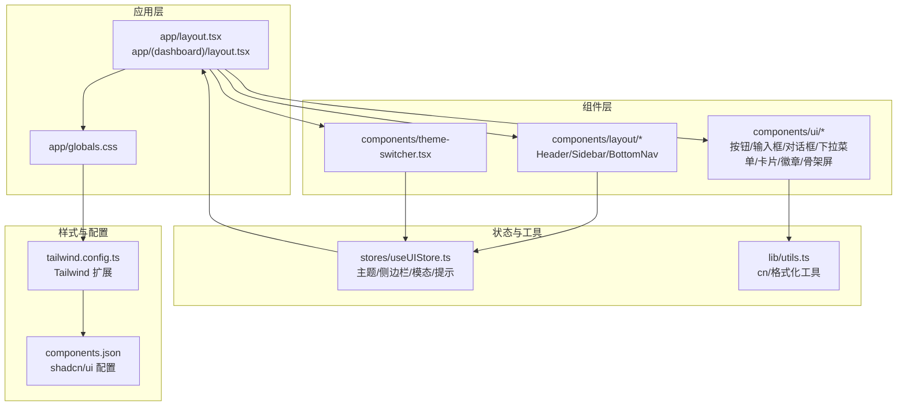
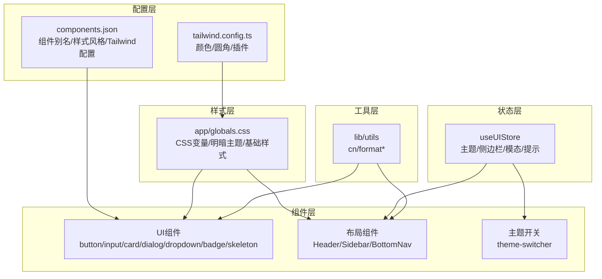
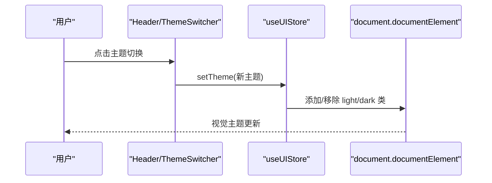
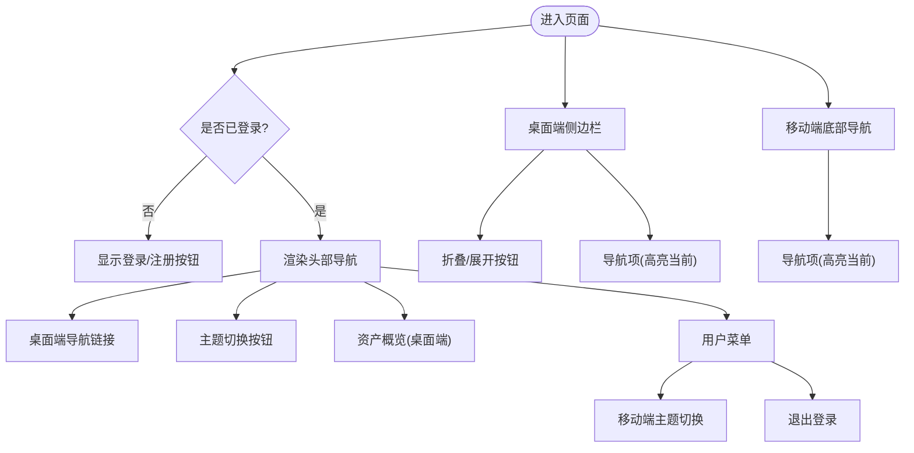
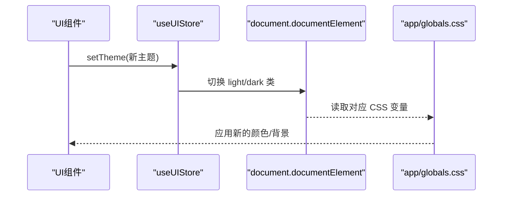
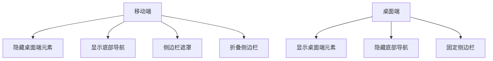
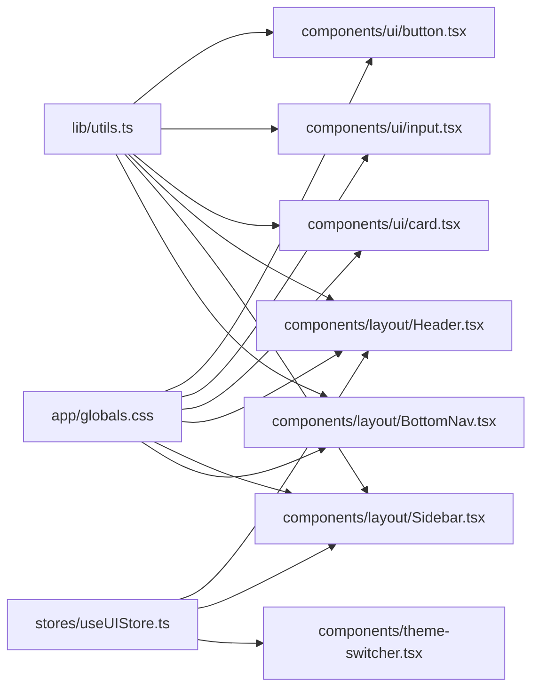

# UI组件系统

<cite>
**本文档引用的文件**
- [components.json](file://components.json)
- [tailwind.config.ts](file://tailwind.config.ts)
- [app/globals.css](file://app/globals.css)
- [components/ui/button.tsx](file://components/ui/button.tsx)
- [components/ui/card.tsx](file://components/ui/card.tsx)
- [components/ui/input.tsx](file://components/ui/input.tsx)
- [components/ui/dialog.tsx](file://components/ui/dialog.tsx)
- [components/ui/dropdown-menu.tsx](file://components/ui/dropdown-menu.tsx)
- [components/ui/badge.tsx](file://components/ui/badge.tsx)
- [components/ui/skeleton.tsx](file://components/ui/skeleton.tsx)
- [components/layout/Header.tsx](file://components/layout/Header.tsx)
- [components/layout/Sidebar.tsx](file://components/layout/Sidebar.tsx)
- [components/layout/BottomNav.tsx](file://components/layout/BottomNav.tsx)
- [components/theme-switcher.tsx](file://components/theme-switcher.tsx)
- [stores/useUIStore.ts](file://stores/useUIStore.ts)
- [lib/utils.ts](file://lib/utils.ts)
</cite>

## 目录
1. [简介](#简介)
2. [项目结构](#项目结构)
3. [核心组件](#核心组件)
4. [架构总览](#架构总览)
5. [详细组件分析](#详细组件分析)
6. [依赖关系分析](#依赖关系分析)
7. [性能考量](#性能考量)
8. [故障排除指南](#故障排除指南)
9. [结论](#结论)
10. [附录](#附录)

## 简介
本文件为虚拟股票交易平台的UI组件系统文档，聚焦于基于 shadcn/ui 的组件库集成与扩展、主题定制与样式覆盖、布局组件（头部导航、侧边栏、底部导航）的响应式实现、基础UI组件（按钮、表单、卡片等）的使用规范与自定义选项、主题切换机制（深色模式支持与动态主题更新）、响应式设计（移动端适配与断点管理）、无障碍访问支持与浏览器兼容性考虑，并提供组件使用示例与最佳实践指南。

## 项目结构
项目采用按功能域组织的组件结构，结合 shadcn/ui 组件库与 Tailwind CSS 实现统一风格与可维护性。关键配置位于组件别名、Tailwind 扩展与全局 CSS 变量中，确保主题与样式的一致性。



图表来源
- [app/layout.tsx](file://app/layout.tsx)
- [app/globals.css](file://app/globals.css)
- [components.json](file://components.json)
- [tailwind.config.ts](file://tailwind.config.ts)

章节来源
- [components.json:1-22](file://components.json#L1-L22)
- [tailwind.config.ts:1-64](file://tailwind.config.ts#L1-L64)
- [app/globals.css:1-69](file://app/globals.css#L1-L69)

## 核心组件
本节概述UI系统的关键构件及其职责：
- 组件库与样式基线：通过 shadcn/ui 配置与 Tailwind 扩展，统一颜色、圆角与动画变量；全局 CSS 定义了明暗主题变量。
- 基础UI组件：按钮、输入框、卡片、徽章、骨架屏、对话框与下拉菜单，均遵循变体与尺寸约定，便于一致化使用。
- 布局组件：头部导航（含主题切换与用户菜单）、侧边栏（折叠/展开与移动端遮罩）、底部导航（移动端固定导航）。
- 主题系统：本地状态存储与 next-themes 协同，支持 light/dark/system 三种模式，动态更新根元素类名以驱动 CSS 变量。
- 工具函数：cn 合并类名、格式化货币/数字/百分比/成交量等，提升组件复用与数据展示一致性。

章节来源
- [components/ui/button.tsx:1-58](file://components/ui/button.tsx#L1-L58)
- [components/ui/input.tsx:1-23](file://components/ui/input.tsx#L1-L23)
- [components/ui/card.tsx:1-84](file://components/ui/card.tsx#L1-L84)
- [components/ui/badge.tsx:1-37](file://components/ui/badge.tsx#L1-L37)
- [components/ui/skeleton.tsx:1-16](file://components/ui/skeleton.tsx#L1-L16)
- [components/ui/dialog.tsx:1-123](file://components/ui/dialog.tsx#L1-L123)
- [components/ui/dropdown-menu.tsx:1-202](file://components/ui/dropdown-menu.tsx#L1-L202)
- [components/layout/Header.tsx:1-205](file://components/layout/Header.tsx#L1-L205)
- [components/layout/Sidebar.tsx:1-115](file://components/layout/Sidebar.tsx#L1-L115)
- [components/layout/BottomNav.tsx:1-55](file://components/layout/BottomNav.tsx#L1-L55)
- [components/theme-switcher.tsx:1-79](file://components/theme-switcher.tsx#L1-L79)
- [stores/useUIStore.ts:1-78](file://stores/useUIStore.ts#L1-L78)
- [lib/utils.ts:1-47](file://lib/utils.ts#L1-L47)

## 架构总览
UI系统围绕“配置—样式—组件—布局—状态—工具”形成闭环：配置层定义组件别名与 Tailwind 变量；样式层提供明暗主题与原子类；组件层封装可复用UI；布局层负责导航与响应式行为；状态层集中管理主题与交互；工具层提供通用方法。



图表来源
- [components.json:1-22](file://components.json#L1-L22)
- [tailwind.config.ts:11-62](file://tailwind.config.ts#L11-L62)
- [app/globals.css:5-68](file://app/globals.css#L5-L68)
- [stores/useUIStore.ts:20-77](file://stores/useUIStore.ts#L20-L77)
- [lib/utils.ts:4-6](file://lib/utils.ts#L4-L6)

## 详细组件分析

### 组件库与主题系统
- 组件库集成：通过组件别名映射至 @/components 与 @/components/ui，确保导入路径一致；启用 TSX 与 RSC 支持，图标库使用 lucide。
- Tailwind 扩展：在 theme.extend 中映射 CSS 变量，使组件颜色与圆角继承自 CSS 变量，便于主题切换。
- 全局样式：定义 :root 与 .dark 两套变量，配合 next-themes 在根元素添加 light/dark 类名，实现明暗主题切换。
- 主题开关：提供两种入口：Header 内部的简单切换与独立的 DropdownMenu 主题开关，后者支持 light/dark/system 三态选择。



图表来源
- [components/layout/Header.tsx:28-31](file://components/layout/Header.tsx#L28-L31)
- [components/theme-switcher.tsx:15-26](file://components/theme-switcher.tsx#L15-L26)
- [stores/useUIStore.ts:29-37](file://stores/useUIStore.ts#L29-L37)
- [app/globals.css:33-58](file://app/globals.css#L33-L58)

章节来源
- [components.json:3-21](file://components.json#L3-L21)
- [tailwind.config.ts:11-62](file://tailwind.config.ts#L11-L62)
- [app/globals.css:5-68](file://app/globals.css#L5-L68)
- [components/layout/Header.tsx:28-31](file://components/layout/Header.tsx#L28-L31)
- [components/theme-switcher.tsx:15-79](file://components/theme-switcher.tsx#L15-L79)
- [stores/useUIStore.ts:29-37](file://stores/useUIStore.ts#L29-L37)

### 布局组件：头部导航、侧边栏与底部导航
- 头部导航（Header）：包含 Logo、桌面端导航、主题切换、资产概览与用户菜单；移动端通过按钮触发侧边栏；用户菜单内含移动端资产展示与主题切换入口。
- 侧边栏（Sidebar）：桌面端固定侧栏，支持折叠/展开；移动端点击遮罩关闭；根据当前路由高亮激活项。
- 底部导航（BottomNav）：移动端固定底部导航，按路由高亮当前页面。



图表来源
- [components/layout/Header.tsx:21-205](file://components/layout/Header.tsx#L21-L205)
- [components/layout/Sidebar.tsx:26-115](file://components/layout/Sidebar.tsx#L26-L115)
- [components/layout/BottomNav.tsx:21-55](file://components/layout/BottomNav.tsx#L21-L55)

章节来源
- [components/layout/Header.tsx:21-205](file://components/layout/Header.tsx#L21-L205)
- [components/layout/Sidebar.tsx:26-115](file://components/layout/Sidebar.tsx#L26-L115)
- [components/layout/BottomNav.tsx:21-55](file://components/layout/BottomNav.tsx#L21-L55)

### 基础UI组件：按钮、表单、卡片与对话框
- 按钮（Button）：支持多种变体（default/destructive/outline/secondary/ghost/link）与尺寸（default/sm/lg/icon），通过变体函数与类合并工具实现一致外观。
- 输入框（Input）：继承边框、背景、占位符与焦点环等样式，适配移动端与桌面端字体大小。
- 卡片（Card）：提供 Card/CardHeader/CardTitle/CardDescription/CardContent/CardFooter 结构化容器，便于内容分组与排版。
- 对话框（Dialog）：包含 Overlay/Portal/Content/Header/Footer/Title/Description 等子组件，支持动画与键盘交互。
- 下拉菜单（DropdownMenu）：支持普通项、复选/单选项、分组、子菜单与快捷键，满足复杂交互场景。
- 徽章（Badge）：用于标签或状态标识，支持多变体。
- 骨架屏（Skeleton）：提供加载态占位，增强用户体验。

```mermaid
classDiagram
class Button {
+变体 : default/destructive/outline/secondary/ghost/link
+尺寸 : default/sm/lg/icon
+asChild : 是否作为子组件渲染
}
class Input {
+类型 : text/password/number...
+禁用/聚焦状态
}
class Card {
+CardHeader
+CardTitle
+CardDescription
+CardContent
+CardFooter
}
class Dialog {
+Overlay
+Portal
+Content
+Header/Footer
+Title/Description
}
class DropdownMenu {
+Trigger
+Content
+Item/Checkbox/Radio
+Label/Separator
+Sub/Group
}
class Badge {
+变体 : default/secondary/destructive/outline
}
class Skeleton {
+animate-pulse
}
Button --> "使用" lib_utils_cn["lib/utils.cn"]
Input --> "使用" lib_utils_cn
Card --> "组合" CardHeader/CardTitle/CardDescription/CardContent/CardFooter
Dialog --> "组合" Overlay/Portal/Content
DropdownMenu --> "组合" Trigger/Content/Item
Badge --> "使用" lib_utils_cn
Skeleton --> "使用" lib_utils_cn
```

图表来源
- [components/ui/button.tsx:37-58](file://components/ui/button.tsx#L37-L58)
- [components/ui/input.tsx:5-23](file://components/ui/input.tsx#L5-L23)
- [components/ui/card.tsx:5-84](file://components/ui/card.tsx#L5-L84)
- [components/ui/dialog.tsx:9-123](file://components/ui/dialog.tsx#L9-L123)
- [components/ui/dropdown-menu.tsx:9-202](file://components/ui/dropdown-menu.tsx#L9-L202)
- [components/ui/badge.tsx:26-37](file://components/ui/badge.tsx#L26-L37)
- [components/ui/skeleton.tsx:3-16](file://components/ui/skeleton.tsx#L3-L16)
- [lib/utils.ts:4-6](file://lib/utils.ts#L4-L6)

章节来源
- [components/ui/button.tsx:1-58](file://components/ui/button.tsx#L1-L58)
- [components/ui/input.tsx:1-23](file://components/ui/input.tsx#L1-L23)
- [components/ui/card.tsx:1-84](file://components/ui/card.tsx#L1-L84)
- [components/ui/dialog.tsx:1-123](file://components/ui/dialog.tsx#L1-L123)
- [components/ui/dropdown-menu.tsx:1-202](file://components/ui/dropdown-menu.tsx#L1-L202)
- [components/ui/badge.tsx:1-37](file://components/ui/badge.tsx#L1-L37)
- [components/ui/skeleton.tsx:1-16](file://components/ui/skeleton.tsx#L1-L16)
- [lib/utils.ts:4-6](file://lib/utils.ts#L4-L6)

### 主题切换机制与动态更新
- 状态同步：useUIStore.setTheme 将主题写入状态并同步到 document.documentElement 类名，驱动 CSS 变量生效。
- 组件联动：Header 与 theme-switcher 均可触发主题切换；DropdownMenu 提供 light/dark/system 三态选择。
- 明暗变量：app/globals.css 定义 :root 与 .dark 两套变量，Tailwind config 映射为 hsl(var(--*))，确保组件颜色随主题变化。



图表来源
- [stores/useUIStore.ts:29-37](file://stores/useUIStore.ts#L29-L37)
- [app/globals.css:5-68](file://app/globals.css#L5-L68)
- [tailwind.config.ts:11-62](file://tailwind.config.ts#L11-L62)

章节来源
- [stores/useUIStore.ts:29-37](file://stores/useUIStore.ts#L29-L37)
- [app/globals.css:5-68](file://app/globals.css#L5-L68)
- [tailwind.config.ts:11-62](file://tailwind.config.ts#L11-L62)

### 响应式设计与断点管理
- 断点策略：利用 Tailwind 的 sm/lg 等断点控制元素显示/隐藏与布局调整（如移动端隐藏资产概览、显示底部导航）。
- 移动端适配：Header 使用 lg 隐藏菜单按钮；Sidebar 在 lg 以下使用遮罩与全屏定位；BottomNav 固定在底部并在 lg 以上隐藏。
- 交互细节：移动端用户菜单内嵌资产概览；侧边栏支持折叠以节省空间。



图表来源
- [components/layout/Header.tsx:44-61](file://components/layout/Header.tsx#L44-L61)
- [components/layout/Header.tsx:103-118](file://components/layout/Header.tsx#L103-L118)
- [components/layout/Sidebar.tsx:33-40](file://components/layout/Sidebar.tsx#L33-L40)
- [components/layout/Sidebar.tsx:105-111](file://components/layout/Sidebar.tsx#L105-L111)
- [components/layout/BottomNav.tsx:25-52](file://components/layout/BottomNav.tsx#L25-L52)

章节来源
- [components/layout/Header.tsx:44-61](file://components/layout/Header.tsx#L44-L61)
- [components/layout/Header.tsx:103-118](file://components/layout/Header.tsx#L103-L118)
- [components/layout/Sidebar.tsx:33-40](file://components/layout/Sidebar.tsx#L33-L40)
- [components/layout/Sidebar.tsx:105-111](file://components/layout/Sidebar.tsx#L105-L111)
- [components/layout/BottomNav.tsx:25-52](file://components/layout/BottomNav.tsx#L25-L52)

### 无障碍访问与浏览器兼容性
- 无障碍支持：大量使用 sr-only 文本实现屏幕阅读器友好；下拉菜单与对话框提供键盘可达性与焦点管理；按钮与链接具备语义化标签。
- 浏览器兼容性：Tailwind animate 插件与 Radix UI 组件提供跨浏览器一致性；next-themes 在客户端挂载后渲染，避免首屏不一致问题。

章节来源
- [components/layout/Header.tsx:54-55](file://components/layout/Header.tsx#L54-L55)
- [components/layout/Header.tsx:129-130](file://components/layout/Header.tsx#L129-L130)
- [components/ui/dialog.tsx:49-50](file://components/ui/dialog.tsx#L49-L50)
- [components/ui/dropdown-menu.tsx:67-75](file://components/ui/dropdown-menu.tsx#L67-L75)
- [components/theme-switcher.tsx:20-26](file://components/theme-switcher.tsx#L20-L26)

## 依赖关系分析
UI组件系统内部依赖清晰，组件间通过共享工具函数与状态存储进行解耦，配置层与样式层为组件提供统一基线。



图表来源
- [lib/utils.ts:4-6](file://lib/utils.ts#L4-L6)
- [stores/useUIStore.ts:20-77](file://stores/useUIStore.ts#L20-L77)
- [app/globals.css:5-68](file://app/globals.css#L5-L68)

章节来源
- [lib/utils.ts:4-6](file://lib/utils.ts#L4-L6)
- [stores/useUIStore.ts:20-77](file://stores/useUIStore.ts#L20-L77)
- [app/globals.css:5-68](file://app/globals.css#L5-L68)

## 性能考量
- 组件复用：通过变体与尺寸约定减少重复样式代码，降低构建体积。
- 动画与过渡：仅在必要处使用动画（如 Dialog/DropdownMenu），避免过度动画影响性能。
- 状态持久化：UI 状态（主题、侧边栏状态）持久化到本地存储，减少重载时的闪烁与回退。
- 样式变量：CSS 变量与 Tailwind 扩展减少重复声明，提升主题切换效率。

## 故障排除指南
- 主题未生效：检查 useUIStore.setTheme 是否正确更新 document.documentElement 类名；确认 app/globals.css 中 :root/.dark 变量存在且 Tailwind config 已映射。
- 下拉菜单/对话框不可见：确认 Portal 渲染与 z-index 设置；检查 Radix UI 动画类是否正确加载。
- 移动端遮罩无法关闭：检查事件绑定与条件渲染逻辑，确保在 lg 以下显示遮罩并在点击时调用关闭。
- 样式冲突：使用 lib/utils.cn 合并类名，避免重复覆盖；优先使用 Tailwind 原子类而非内联样式。

章节来源
- [stores/useUIStore.ts:29-37](file://stores/useUIStore.ts#L29-L37)
- [app/globals.css:5-68](file://app/globals.css#L5-L68)
- [components/ui/dialog.tsx:36-54](file://components/ui/dialog.tsx#L36-L54)
- [components/ui/dropdown-menu.tsx:63-76](file://components/ui/dropdown-menu.tsx#L63-L76)
- [components/layout/Sidebar.tsx:105-111](file://components/layout/Sidebar.tsx#L105-L111)
- [lib/utils.ts:4-6](file://lib/utils.ts#L4-L6)

## 结论
该UI组件系统以 shadcn/ui 为基础，结合 Tailwind CSS 与 CSS 变量实现了统一、可扩展的主题体系；通过布局组件与状态存储提供了良好的响应式体验；基础UI组件遵循变体与尺寸约定，便于复用与维护。建议在后续迭代中持续完善无障碍细节与性能优化，并保持组件别名与样式配置的一致性。

## 附录
- 组件使用示例与最佳实践
  - 按钮：根据场景选择变体与尺寸，避免在同一页面滥用不同变体；使用 asChild 与图标组合时注意可访问性文本。
  - 表单：输入框统一使用 Input，配合 Label 与错误提示；在 Dialog 中使用 DialogTrigger/DialogClose 管理交互。
  - 卡片：使用 CardHeader/CardTitle/CardContent 组织内容层次；在列表中使用卡片容器提升可读性。
  - 主题：优先使用 useUIStore.setTheme 进行主题切换；在 Header 与独立主题开关中保持一致性。
  - 响应式：利用断点控制元素显示/隐藏；移动端优先使用 BottomNav 与 Sidebar 遮罩。
  - 无障碍：为所有交互元素提供 sr-only 文本；确保键盘可达性与焦点管理。