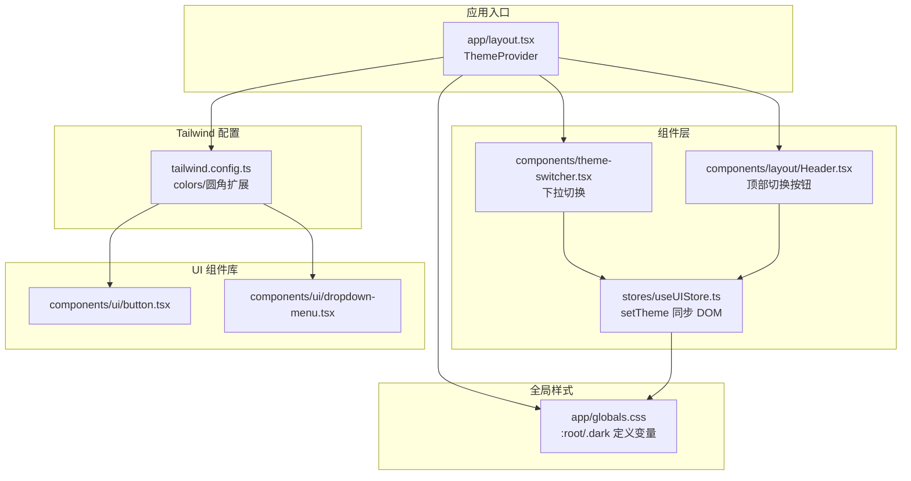
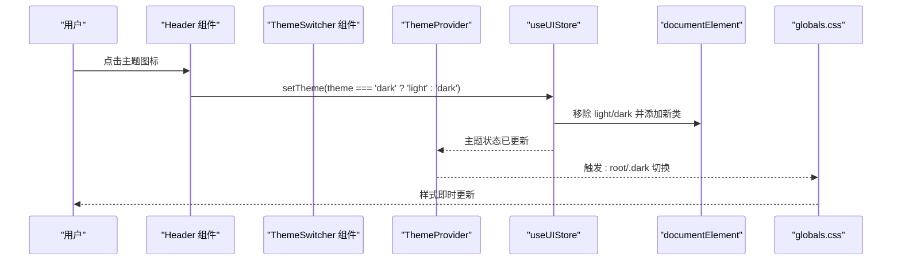
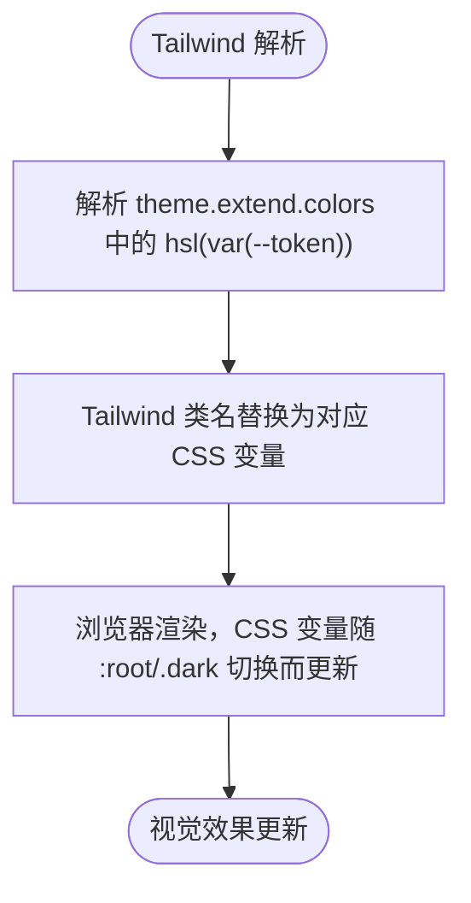
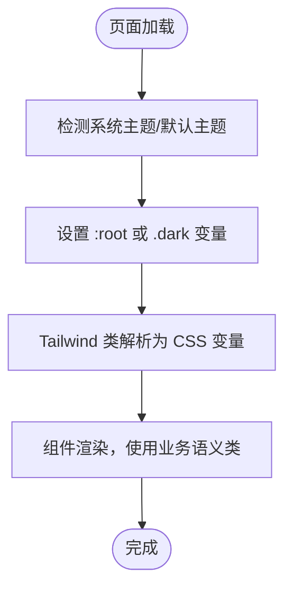
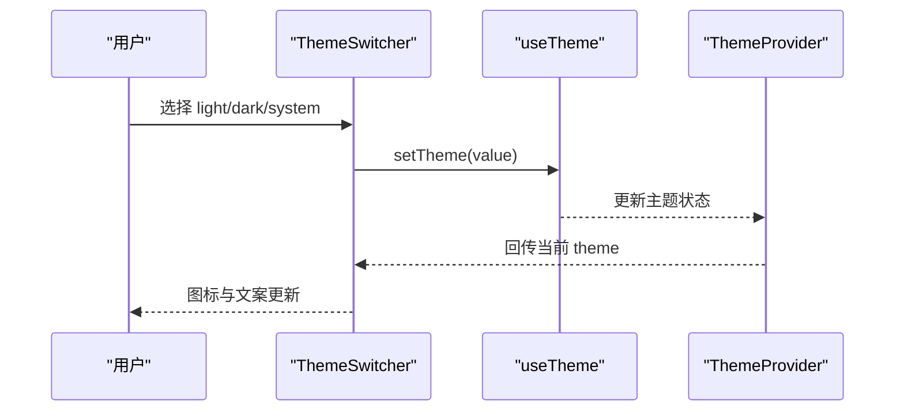
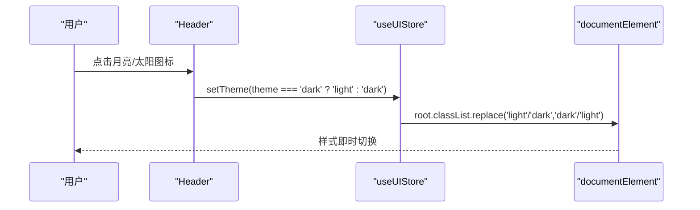
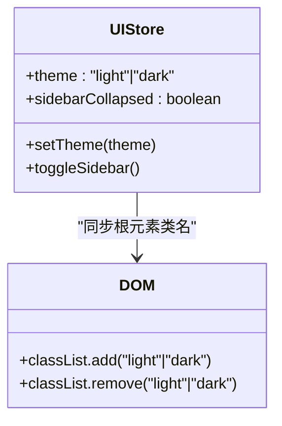
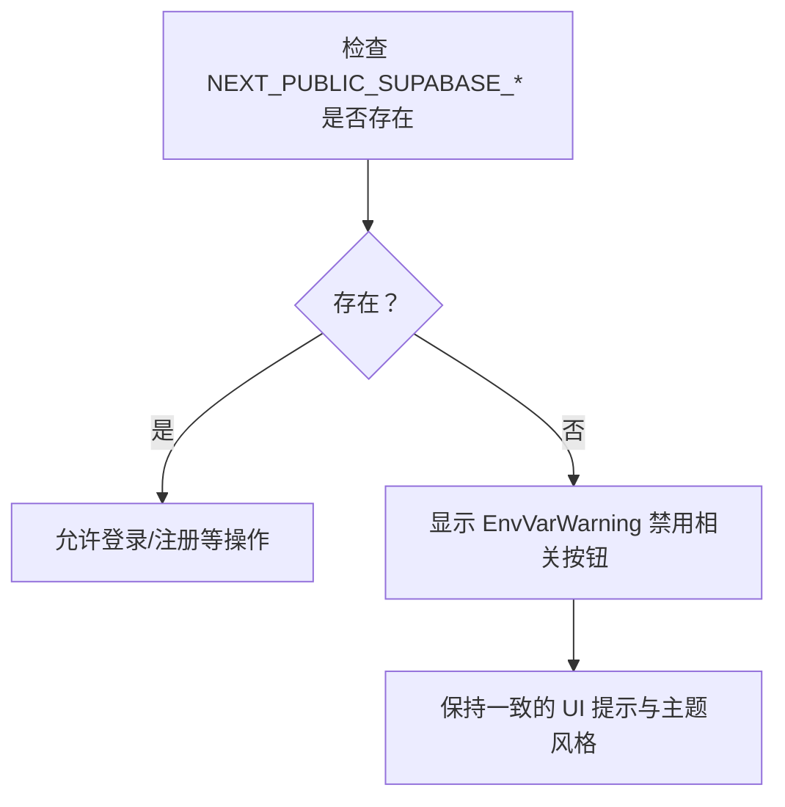
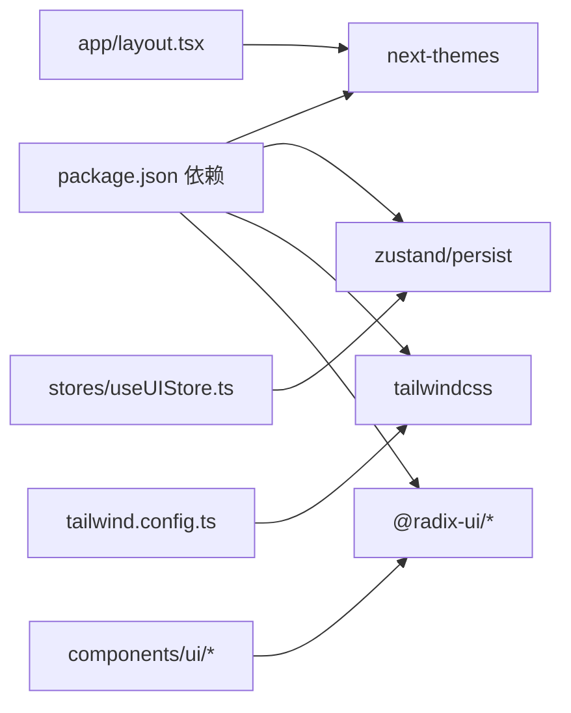

# 主题系统

<cite>
**本文引用的文件**
- [tailwind.config.ts](file://tailwind.config.ts)
- [app/globals.css](file://app/globals.css)
- [components/theme-switcher.tsx](file://components/theme-switcher.tsx)
- [components/layout/Header.tsx](file://components/layout/Header.tsx)
- [components/layout/Sidebar.tsx](file://components/layout/Sidebar.tsx)
- [components/env-var-warning.tsx](file://components/env-var-warning.tsx)
- [stores/useUIStore.ts](file://stores/useUIStore.ts)
- [types/index.ts](file://types/index.ts)
- [app/layout.tsx](file://app/layout.tsx)
- [components/ui/button.tsx](file://components/ui/button.tsx)
- [components/ui/dropdown-menu.tsx](file://components/ui/dropdown-menu.tsx)
- [lib/utils.ts](file://lib/utils.ts)
- [package.json](file://package.json)
- [next.config.ts](file://next.config.ts)
</cite>

## 目录
1. [简介](#简介)
2. [项目结构](#项目结构)
3. [核心组件](#核心组件)
4. [架构总览](#架构总览)
5. [详细组件分析](#详细组件分析)
6. [依赖关系分析](#依赖关系分析)
7. [性能考量](#性能考量)
8. [故障排查指南](#故障排查指南)
9. [结论](#结论)
10. [附录](#附录)

## 简介
本文件系统性阐述虚拟股票交易平台的主题系统，涵盖 Tailwind CSS 的配置与自定义、深色/浅色主题切换机制、CSS 变量驱动的动态更新、全局样式组织与优先级、以及与环境变量相关的警告提示。同时提供主题定制最佳实践、可访问性建议、性能优化与缓存策略，并给出扩展更多主题变体的思路。

## 项目结构
主题系统围绕“CSS 变量 + Tailwind 扩展 + 主题提供者 + UI 存储”协同工作：
- 全局样式层：在基础层定义 CSS 变量，分别提供浅色与深色两套主题；在工具层提供一组语义化类名映射到自定义变量。
- Tailwind 层：将设计令牌映射为 hsl 变量，使 Tailwind 类与 CSS 变量解耦。
- 组件层：通过 next-themes 提供主题上下文，UI 组件读取当前主题并触发切换；应用入口统一挂载 ThemeProvider。
- 状态层：UI 状态存储负责持久化主题选择并同步到 DOM 根元素类名，确保 SSR 与 CSR 一致。

图表来源
- [app/layout.tsx:22-41](file://app/layout.tsx#L22-L41)
- [app/globals.css:5-137](file://app/globals.css#L5-L137)
- [tailwind.config.ts:3-63](file://tailwind.config.ts#L3-L63)
- [components/theme-switcher.tsx:15-79](file://components/theme-switcher.tsx#L15-L79)
- [components/layout/Header.tsx:10-96](file://components/layout/Header.tsx#L10-L96)
- [stores/useUIStore.ts:20-78](file://stores/useUIStore.ts#L20-L78)
- [components/ui/button.tsx:7-58](file://components/ui/button.tsx#L7-L58)
- [components/ui/dropdown-menu.tsx:9-202](file://components/ui/dropdown-menu.tsx#L9-L202)

章节来源
- [app/layout.tsx:22-41](file://app/layout.tsx#L22-L41)
- [app/globals.css:5-137](file://app/globals.css#L5-L137)
- [tailwind.config.ts:3-63](file://tailwind.config.ts#L3-L63)

## 核心组件
- 主题提供者与入口：应用根布局挂载 ThemeProvider，启用系统主题检测与过渡禁用，确保主题切换平滑且可预测。
- CSS 变量与全局样式：在基础层定义 :root 与 .dark 两套变量集，覆盖背景、前景、卡片、弹出层、主要/次要、破坏性、边框、输入、环形高亮、图表色板等；同时提供一组业务自定义变量（如页面背景、卡片、输入、警示、K 线涨跌色等）。
- Tailwind 配置：将设计令牌映射为 hsl(var(--token))，并扩展圆角半径使用 CSS 变量，保证主题切换时圆角一致性。
- 主题切换器：提供浅色/深色/系统三种模式的下拉切换，使用 next-themes hooks 读取与设置当前主题。
- UI 存储：Zustand 状态持久化保存主题，setTheme 方法同步到 documentElement 的 class（light/dark），确保 Tailwind 与业务自定义变量同时生效。
- UI 组件：Button、DropdownMenu 等组件直接使用 Tailwind 类，这些类最终解析为 CSS 变量，从而随主题变化。

章节来源
- [app/layout.tsx:22-41](file://app/layout.tsx#L22-L41)
- [app/globals.css:5-137](file://app/globals.css#L5-L137)
- [tailwind.config.ts:11-61](file://tailwind.config.ts#L11-L61)
- [components/theme-switcher.tsx:15-79](file://components/theme-switcher.tsx#L15-L79)
- [stores/useUIStore.ts:20-78](file://stores/useUIStore.ts#L20-L78)
- [components/ui/button.tsx:7-58](file://components/ui/button.tsx#L7-L58)
- [components/ui/dropdown-menu.tsx:9-202](file://components/ui/dropdown-menu.tsx#L9-L202)

## 架构总览
主题系统采用“CSS 变量驱动 + Tailwind 设计令牌 + 主题提供者 + 状态同步”的分层架构。切换流程如下：

图表来源
- [components/layout/Header.tsx:54-60](file://components/layout/Header.tsx#L54-L60)
- [components/theme-switcher.tsx:58-58](file://components/theme-switcher.tsx#L58-L58)
- [stores/useUIStore.ts:29-36](file://stores/useUIStore.ts#L29-L36)
- [app/layout.tsx:30-37](file://app/layout.tsx#L30-L37)
- [app/globals.css:5-93](file://app/globals.css#L5-L93)

## 详细组件分析

### Tailwind 配置与颜色系统
- 设计令牌映射：将 background、foreground、card、popover、primary、secondary、muted、accent、destructive、border、input、ring、chart 系列映射为 hsl(var(--token))，使 Tailwind 类与 CSS 变量解耦。
- 圆角扩展：使用 var(--radius) 及其派生值，确保不同尺寸组件圆角一致。
- 插件：启用 tailwindcss-animate，为下拉菜单等交互提供动画能力。

图表来源
- [tailwind.config.ts:11-61](file://tailwind.config.ts#L11-L61)
- [app/globals.css:5-93](file://app/globals.css#L5-L93)

章节来源
- [tailwind.config.ts:11-61](file://tailwind.config.ts#L11-L61)

### 全局样式与 CSS 变量
- :root 定义浅色模式变量，包含基础色板、圆角半径与业务自定义变量（页面背景、卡片、输入、警示、K 线涨跌色等）。
- .dark 定义深色模式变量，覆盖上述变量，形成完整主题。
- @layer base：统一 border、body 字体与背景/文字色。
- @layer utilities：提供一组业务语义类（文本主/次、卡片/统计背景、资产渐变、涨跌色等），直接绑定到自定义变量，便于组件快速使用。

图表来源
- [app/globals.css:5-137](file://app/globals.css#L5-L137)
- [tailwind.config.ts:11-61](file://tailwind.config.ts#L11-L61)

章节来源
- [app/globals.css:5-137](file://app/globals.css#L5-L137)

### 主题切换器组件实现原理
- 组件职责：提供浅色/深色/系统三种模式的下拉切换，图标随当前主题变化。
- 实现要点：
  - 使用 next-themes 的 useTheme 读取/设置当前主题。
  - 客户端挂载后才显示 UI，避免 SSR 与 CSR 不一致。
  - 下拉项 onValueChange 直接调用 setTheme，触发 Provider 内部状态更新与 CSS 变量切换。

图表来源
- [components/theme-switcher.tsx:15-79](file://components/theme-switcher.tsx#L15-L79)
- [app/layout.tsx:30-37](file://app/layout.tsx#L30-L37)

章节来源
- [components/theme-switcher.tsx:15-79](file://components/theme-switcher.tsx#L15-L79)

### Header 中的主题切换
- Header 提供顶部快捷切换按钮，点击在 light 与 dark 之间切换。
- 与 UI Store 的 setTheme 协同，确保切换后同步到 DOM 根元素类名，从而影响全局样式。

图表来源
- [components/layout/Header.tsx:54-60](file://components/layout/Header.tsx#L54-L60)
- [stores/useUIStore.ts:29-36](file://stores/useUIStore.ts#L29-L36)

章节来源
- [components/layout/Header.tsx:54-60](file://components/layout/Header.tsx#L54-L60)
- [stores/useUIStore.ts:29-36](file://stores/useUIStore.ts#L29-L36)

### UI 存储与 DOM 同步
- Zustand 状态持久化保存 theme、侧边栏折叠等 UI 状态。
- setTheme 方法会移除旧类并添加新类到 document.documentElement，确保 Tailwind 与业务自定义变量同时生效。
- 仅持久化必要的 UI 字段，减少存储体积。

图表来源
- [stores/useUIStore.ts:20-78](file://stores/useUIStore.ts#L20-L78)

章节来源
- [stores/useUIStore.ts:20-78](file://stores/useUIStore.ts#L20-L78)
- [types/index.ts:159](file://types/index.ts#L159)

### 环境变量与警告系统
- 环境变量检查：lib/utils.ts 提供 hasEnvVars，用于判断前端所需 Supabase 变量是否存在。
- 警告组件：当环境变量缺失时，EnvVarWarning 会禁用登录/注册按钮，提示用户补充变量。
- 注意：该警告与主题系统无直接耦合，但会影响功能可用性，建议在主题切换前后保持一致的用户体验提示。

图表来源
- [lib/utils.ts:8-11](file://lib/utils.ts#L8-L11)
- [components/env-var-warning.tsx:4-20](file://components/env-var-warning.tsx#L4-L20)

章节来源
- [lib/utils.ts:8-11](file://lib/utils.ts#L8-L11)
- [components/env-var-warning.tsx:4-20](file://components/env-var-warning.tsx#L4-L20)

### UI 组件与主题集成
- Button：使用 Tailwind 类（如 bg-primary、text-primary-foreground、hover 效果等），这些类最终解析为 CSS 变量，随主题变化。
- DropdownMenu：提供下拉内容与动画，配合 ThemeSwitcher 的下拉项使用，形成统一的交互体验。

章节来源
- [components/ui/button.tsx:7-58](file://components/ui/button.tsx#L7-L58)
- [components/ui/dropdown-menu.tsx:9-202](file://components/ui/dropdown-menu.tsx#L9-L202)

## 依赖关系分析
- 主题提供者：ThemeProvider 来自 next-themes，负责维护主题状态与系统偏好联动。
- 状态存储：Zustand + persist 用于 UI 状态持久化，避免刷新丢失主题选择。
- 样式系统：Tailwind CSS + tailwindcss-animate，结合 CSS 变量实现主题切换。
- 组件库：Radix UI（DropdownMenu 等）提供无障碍与可访问性保障。

图表来源
- [package.json:9-42](file://package.json#L9-L42)
- [app/layout.tsx:30-37](file://app/layout.tsx#L30-L37)
- [stores/useUIStore.ts:20-78](file://stores/useUIStore.ts#L20-L78)
- [tailwind.config.ts:62](file://tailwind.config.ts#L62)

章节来源
- [package.json:9-42](file://package.json#L9-L42)

## 性能考量
- 样式体积控制：通过 Tailwind 配置限制未使用类，减少打包体积。
- CSS 变量切换：无需重绘整个页面，仅需更新 CSS 变量，切换成本低。
- 动画禁用：在 ThemeProvider 中禁用过渡，避免主题切换时的闪烁与抖动。
- 组件缓存：Next.js 开启 cacheComponents，提升组件渲染性能。
- 状态持久化：UI 状态持久化于本地存储，减少初始化开销。

章节来源
- [app/layout.tsx:30-37](file://app/layout.tsx#L30-L37)
- [next.config.ts:4](file://next.config.ts#L4)

## 故障排查指南
- 主题切换无效
  - 检查 ThemeProvider 是否包裹根节点。
  - 确认 useUIStore.setTheme 已同步到 documentElement.classList。
  - 验证 globals.css 中 :root 与 .dark 变量是否正确。
- 切换出现闪烁
  - 确保禁用了过渡动画（disableTransitionOnChange）。
  - 确保客户端挂载后再渲染切换器（ThemeSwitcher 使用 mounted 控制）。
- 样式未按预期变化
  - 检查 Tailwind 类是否映射到 CSS 变量（hsl(var(--token))）。
  - 确认业务语义类（如 text-guzhang-primary）是否正确绑定到自定义变量。
- 环境变量缺失导致功能受限
  - 使用 lib/utils.ts 的 hasEnvVars 判断变量是否就绪。
  - 使用 EnvVarWarning 提示用户补齐变量。

章节来源
- [app/layout.tsx:30-37](file://app/layout.tsx#L30-L37)
- [components/theme-switcher.tsx:20-26](file://components/theme-switcher.tsx#L20-L26)
- [app/globals.css:5-137](file://app/globals.css#L5-L137)
- [tailwind.config.ts:11-61](file://tailwind.config.ts#L11-L61)
- [lib/utils.ts:8-11](file://lib/utils.ts#L8-L11)
- [components/env-var-warning.tsx:4-20](file://components/env-var-warning.tsx#L4-L20)

## 结论
本主题系统通过 CSS 变量与 Tailwind 设计令牌的解耦，实现了轻量、可维护、可扩展的主题切换机制。配合 next-themes、Zustand 与 Radix UI，既保证了良好的用户体验，也兼顾了可访问性与性能。后续可通过增加更多 CSS 变量组合或引入多品牌色板，进一步扩展主题变体。

## 附录

### Tailwind 配置与自定义选项
- 颜色系统：background、foreground、card、popover、primary、secondary、muted、accent、destructive、border、input、ring、chart 系列全部映射至 CSS 变量。
- 字体配置：通过 Google Fonts Geist 设置字体变量，确保全局字体一致。
- 间距与圆角：使用 var(--radius) 控制圆角，提供 lg/md/sm 派生值。

章节来源
- [tailwind.config.ts:11-61](file://tailwind.config.ts#L11-L61)
- [app/layout.tsx:16-20](file://app/layout.tsx#L16-L20)

### 深色/浅色模式切换逻辑
- 切换来源：Header 快捷按钮与 ThemeSwitcher 下拉菜单。
- 切换过程：setTheme -> 同步到 documentElement.classList -> Tailwind 与业务类解析为 CSS 变量 -> 样式即时更新。

章节来源
- [components/layout/Header.tsx:54-60](file://components/layout/Header.tsx#L54-L60)
- [components/theme-switcher.tsx:58-58](file://components/theme-switcher.tsx#L58-L58)
- [stores/useUIStore.ts:29-36](file://stores/useUIStore.ts#L29-L36)

### CSS 变量使用与动态更新机制
- 变量定义：:root 与 .dark 分别定义浅色/深色变量集。
- 动态更新：通过修改 documentElement.classList 切换 :root 与 .dark，进而驱动 hsl(var(--token)) 与业务变量生效。
- 业务变量：如 --guzhang-* 系列变量，直接用于组件内联样式或工具类。

章节来源
- [app/globals.css:5-137](file://app/globals.css#L5-L137)

### 环境变量对主题配置的影响与警告系统
- 影响：环境变量缺失会导致部分功能不可用，但不影响主题切换本身。
- 警告：EnvVarWarning 会在变量缺失时提示用户，保持一致的 UI 提示风格。

章节来源
- [lib/utils.ts:8-11](file://lib/utils.ts#L8-L11)
- [components/env-var-warning.tsx:4-20](file://components/env-var-warning.tsx#L4-L20)

### 全局样式组织与优先级管理
- @layer base：统一基础样式与字体。
- @layer utilities：提供业务语义类，优先级高于基础层，便于覆盖。
- Tailwind 类：通过 theme.extend 将设计令牌映射到 CSS 变量，避免硬编码颜色。

章节来源
- [app/globals.css:95-137](file://app/globals.css#L95-L137)
- [tailwind.config.ts:11-61](file://tailwind.config.ts#L11-L61)

### 主题定制最佳实践
- 颜色搭配建议：遵循语义化命名（primary/secondary/muted/destructive），保证在浅/深色模式下具备足够对比度。
- 可访问性考虑：确保文本与背景对比度满足 WCAG 建议；为交互元素提供可见焦点状态。
- 统一风格：通过 CSS 变量集中管理品牌色与业务色，避免散落的硬编码颜色。
- 渐进增强：先保证基础样式（:root），再叠加 .dark；确保降级场景仍可读。

### 性能优化与缓存策略
- 禁用过渡：在 ThemeProvider 中禁用过渡，避免切换闪烁。
- 组件缓存：开启 cacheComponents，减少重复渲染。
- 状态持久化：UI 状态持久化，降低初始化成本。
- 样式体积：Tailwind 配置按需裁剪，减少未使用类。

章节来源
- [app/layout.tsx:30-37](file://app/layout.tsx#L30-L37)
- [next.config.ts:4](file://next.config.ts#L4)

### 扩展主题系统以支持更多主题变体
- 新增变量集：在 :root 与 .dark 中新增一组变量，或引入新的 CSS 变量命名空间。
- 新增主题枚举：在 Theme 类型中加入新变体，并在 UI 存储与切换器中扩展。
- 组件适配：为新主题提供对应的业务变量映射，确保组件样式一致。
- 渐进式迁移：先在局部组件测试新主题，再逐步推广至全局。

章节来源
- [types/index.ts:159](file://types/index.ts#L159)
- [stores/useUIStore.ts:29-36](file://stores/useUIStore.ts#L29-L36)
- [app/globals.css:5-93](file://app/globals.css#L5-L93)