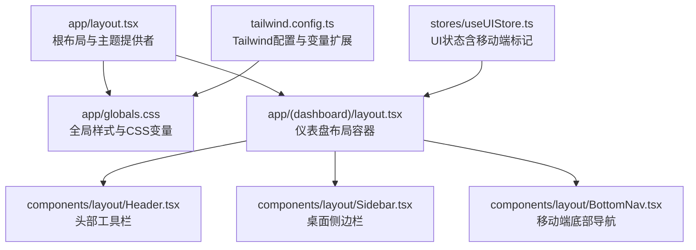
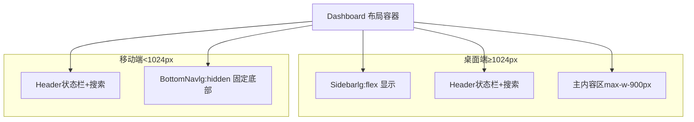
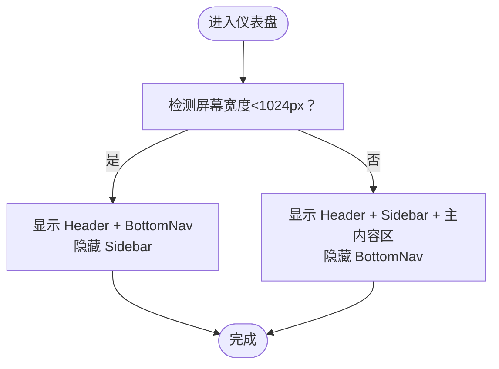
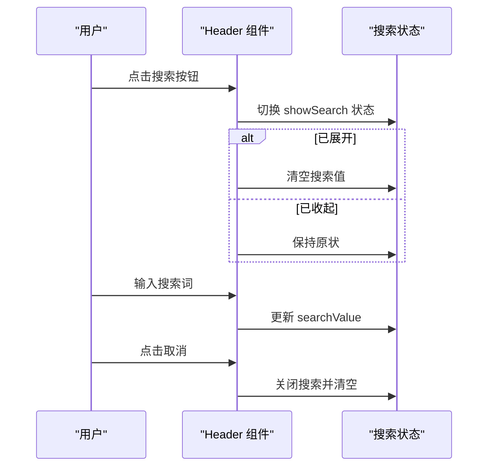
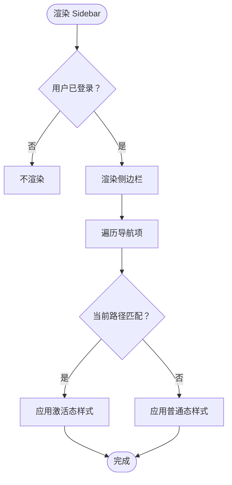
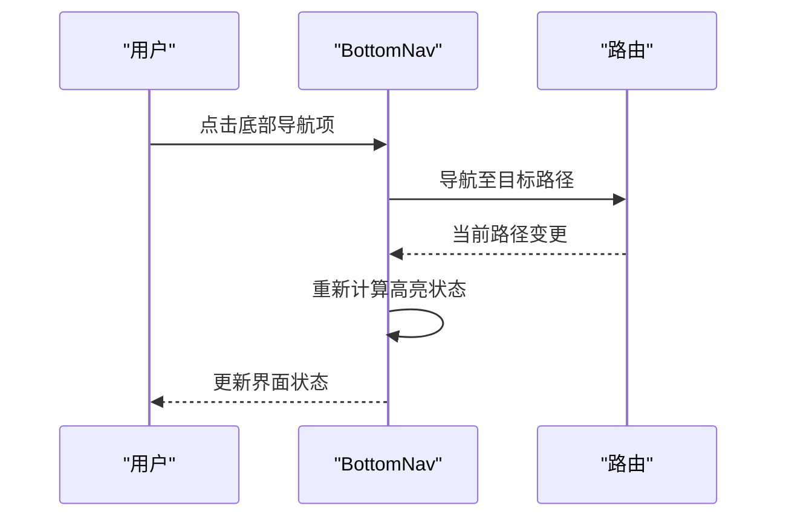
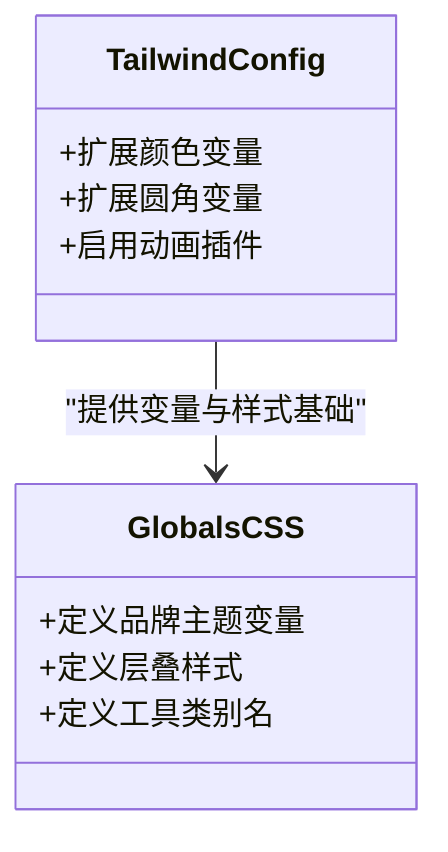
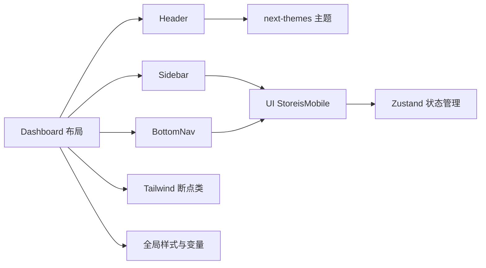

# 响应式设计

<cite>
**本文引用的文件**
- [app/layout.tsx](file://app/layout.tsx)
- [app/globals.css](file://app/globals.css)
- [tailwind.config.ts](file://tailwind.config.ts)
- [app/(dashboard)/layout.tsx](file://app/(dashboard)/layout.tsx)
- [components/layout/Header.tsx](file://components/layout/Header.tsx)
- [components/layout/Sidebar.tsx](file://components/layout/Sidebar.tsx)
- [components/layout/BottomNav.tsx](file://components/layout/BottomNav.tsx)
- [components/ui/button.tsx](file://components/ui/button.tsx)
- [components/ui/input.tsx](file://components/ui/input.tsx)
- [stores/useUIStore.ts](file://stores/useUIStore.ts)
- [docs/prd.md](file://docs/prd.md)
- [docs/prototype.html](file://docs/prototype.html)
</cite>

## 目录
1. [简介](#简介)
2. [项目结构](#项目结构)
3. [核心组件](#核心组件)
4. [架构总览](#架构总览)
5. [详细组件分析](#详细组件分析)
6. [依赖关系分析](#依赖关系分析)
7. [性能考量](#性能考量)
8. [故障排查指南](#故障排查指南)
9. [结论](#结论)
10. [附录](#附录)

## 简介
本文件系统性梳理虚拟股票交易平台的响应式设计实现，重点覆盖移动端适配与断点管理策略。文档基于实际源码，解释 Tailwind CSS 断点在项目中的使用方式（含 sm、md、lg、xl、2xl 的语义与边界），并逐项说明 Header、Sidebar、BottomNav 在不同屏幕尺寸下的表现与交互差异。同时给出触摸友好设计建议、图片与字体优化策略、手势支持要点，以及测试与调试响应式布局的方法。

## 项目结构
项目采用 Next.js App Router 结构，响应式布局由全局样式、Tailwind 配置、页面布局与组件协作共同实现：
- 全局样式与主题变量集中于全局 CSS，通过 CSS 变量驱动明暗主题与品牌色系。
- Tailwind 配置扩展了颜色与圆角变量，确保组件一致的视觉与交互体验。
- 页面布局在仪表盘容器中组合 Header、Sidebar、BottomNav，并通过媒体查询与断点类控制显示策略。
- UI 状态（如是否移动端）通过 Zustand store 维护，用于运行时行为调整。

**图示来源**
- [app/layout.tsx:1-42](file://app/layout.tsx#L1-L42)
- [app/globals.css:1-137](file://app/globals.css#L1-L137)
- [app/(dashboard)/layout.tsx:1-105](file://app/(dashboard)/layout.tsx#L1-L105)
- [components/layout/Header.tsx:1-96](file://components/layout/Header.tsx#L1-L96)
- [components/layout/Sidebar.tsx:1-80](file://components/layout/Sidebar.tsx#L1-L80)
- [components/layout/BottomNav.tsx:1-52](file://components/layout/BottomNav.tsx#L1-L52)
- [tailwind.config.ts:1-64](file://tailwind.config.ts#L1-L64)
- [stores/useUIStore.ts:1-78](file://stores/useUIStore.ts#L1-L78)

**章节来源**
- [app/layout.tsx:1-42](file://app/layout.tsx#L1-L42)
- [app/globals.css:1-137](file://app/globals.css#L1-L137)
- [tailwind.config.ts:1-64](file://tailwind.config.ts#L1-L64)
- [app/(dashboard)/layout.tsx:1-105](file://app/(dashboard)/layout.tsx#L1-L105)
- [stores/useUIStore.ts:1-78](file://stores/useUIStore.ts#L1-L78)

## 核心组件
- Header：移动端状态栏与搜索框的折叠/展开逻辑，右侧包含通知、主题切换等操作入口。
- Sidebar：桌面端固定侧边栏，使用 lg 隐藏/显示策略，导航项根据路径高亮。
- BottomNav：移动端底部导航，lg 以下固定在底部，提供五个主要功能入口。
- UI Store：维护 isMobile 标记，用于运行时行为判断（例如移动端检测）。

**章节来源**
- [components/layout/Header.tsx:1-96](file://components/layout/Header.tsx#L1-L96)
- [components/layout/Sidebar.tsx:1-80](file://components/layout/Sidebar.tsx#L1-L80)
- [components/layout/BottomNav.tsx:1-52](file://components/layout/BottomNav.tsx#L1-L52)
- [stores/useUIStore.ts:1-78](file://stores/useUIStore.ts#L1-L78)

## 架构总览
下图展示了响应式布局在不同断点下的组件呈现与交互流程：

**图示来源**
- [app/(dashboard)/layout.tsx:73-103](file://app/(dashboard)/layout.tsx#L73-L103)
- [components/layout/Sidebar.tsx:24-30](file://components/layout/Sidebar.tsx#L24-L30)
- [components/layout/BottomNav.tsx:20-26](file://components/layout/BottomNav.tsx#L20-L26)

## 详细组件分析

### 断点与布局策略
- 断点边界：项目以 1024px 作为移动端与桌面端的分界，使用 lg 作为断点控制类（如 lg:flex、lg:hidden、lg:pb-6）。
- 移动端策略：小于 1024px 时，Sidebar 隐藏，BottomNav 固定在底部；主内容区限制最大宽度并增加内边距。
- 桌面端策略：大于等于 1024px 时，Sidebar 显示，BottomNav 隐藏，主内容区获得更宽展示空间。

**图示来源**
- [app/(dashboard)/layout.tsx:30-39](file://app/(dashboard)/layout.tsx#L30-L39)
- [components/layout/Sidebar.tsx:24-30](file://components/layout/Sidebar.tsx#L24-L30)
- [components/layout/BottomNav.tsx:20-26](file://components/layout/BottomNav.tsx#L20-L26)

**章节来源**
- [app/(dashboard)/layout.tsx:30-39](file://app/(dashboard)/layout.tsx#L30-L39)
- [app/(dashboard)/layout.tsx:82-98](file://app/(dashboard)/layout.tsx#L82-L98)
- [components/layout/Sidebar.tsx:24-30](file://components/layout/Sidebar.tsx#L24-L30)
- [components/layout/BottomNav.tsx:20-26](file://components/layout/BottomNav.tsx#L20-L26)

### Header 组件（移动端折叠导航与汉堡菜单）
- 折叠搜索：Header 提供一个“展开/收起”搜索框的交互，适合移动端紧凑空间。
- 汉堡菜单：当前实现未包含传统汉堡菜单图标，但可结合 UI Store 的 isMobile 标记与路由状态，在需要时引入汉堡菜单与抽屉式导航。
- 交互要点：搜索框支持自动聚焦与清空；主题切换按钮在移动端同样适用。

**图示来源**
- [components/layout/Header.tsx:17-27](file://components/layout/Header.tsx#L17-L27)
- [components/layout/Header.tsx:65-92](file://components/layout/Header.tsx#L65-L92)

**章节来源**
- [components/layout/Header.tsx:1-96](file://components/layout/Header.tsx#L1-L96)

### Sidebar 组件（桌面端侧边栏与移动端显示策略）
- 显示策略：使用 lg:flex 控制桌面端显示，lg 以下隐藏；桌面端宽度固定为 260px。
- 导航高亮：根据当前路径高亮对应导航项，激活态使用品牌色与背景强调。
- 底部信息：包含初始资金与登出按钮，提供统一的用户操作入口。

**图示来源**
- [components/layout/Sidebar.tsx:17-79](file://components/layout/Sidebar.tsx#L17-L79)

**章节来源**
- [components/layout/Sidebar.tsx:1-80](file://components/layout/Sidebar.tsx#L1-L80)

### BottomNav 组件（移动端底部导航优化）
- 固定定位：使用 fixed、bottom-0、left-0、right-0 将导航固定在屏幕底部。
- 断点控制：lg:hidden 保证桌面端不显示；安全区域适配使用 env(safe-area-inset-bottom)。
- 交互反馈：根据当前路径高亮对应入口，文字尺寸与图标尺寸适配移动端点击目标。

**图示来源**
- [components/layout/BottomNav.tsx:16-51](file://components/layout/BottomNav.tsx#L16-L51)

**章节来源**
- [components/layout/BottomNav.tsx:1-52](file://components/layout/BottomNav.tsx#L1-L52)

### Tailwind 断点与变量体系
- 断点使用：项目以 1024px 为 lg 断点，配合 lg:flex、lg:hidden、lg:pb-6 等类名实现桌面端布局。
- 变量扩展：Tailwind 配置扩展了颜色与圆角变量，使组件在不同主题下具有一致的视觉表现。
- 全局样式：全局 CSS 定义品牌主题变量与层叠样式，确保 Header、Sidebar、BottomNav 等组件共享统一风格。

**图示来源**
- [tailwind.config.ts:11-62](file://tailwind.config.ts#L11-L62)
- [app/globals.css:5-136](file://app/globals.css#L5-L136)

**章节来源**
- [tailwind.config.ts:1-64](file://tailwind.config.ts#L1-L64)
- [app/globals.css:1-137](file://app/globals.css#L1-L137)

### 触摸友好设计与手势支持
- 触摸目标：按钮与导航项尺寸适中，满足移动端点击热区要求。
- 手势建议：可在需要时引入轻量手势库，支持自选列表左滑删除、长按菜单等操作。
- 表单输入：输入组件在 md 断点下字号调整，便于移动端输入；可结合自动聚焦与数字键盘优化。

**章节来源**
- [components/ui/button.tsx:23-28](file://components/ui/button.tsx#L23-L28)
- [components/ui/input.tsx:10-13](file://components/ui/input.tsx#L10-L13)
- [docs/prd.md:240-249](file://docs/prd.md#L240-L249)

## 依赖关系分析
- 组件耦合：Dashboard 布局容器聚合 Header、Sidebar、BottomNav；Sidebar 与 BottomNav 通过路由状态进行高亮联动。
- 外部依赖：next-themes 提供主题切换；Radix UI 与 class-variance-authority 用于 UI 组件变体；Zustand 管理 UI 状态。
- 断点依赖：Tailwind 断点类与全局 CSS 变量共同决定组件在不同屏幕尺寸下的显示与交互。

**图示来源**
- [app/(dashboard)/layout.tsx:14-104](file://app/(dashboard)/layout.tsx#L14-L104)
- [stores/useUIStore.ts:20-77](file://stores/useUIStore.ts#L20-L77)
- [tailwind.config.ts:11-62](file://tailwind.config.ts#L11-L62)
- [app/globals.css:5-136](file://app/globals.css#L5-L136)

**章节来源**
- [app/(dashboard)/layout.tsx:14-104](file://app/(dashboard)/layout.tsx#L14-L104)
- [stores/useUIStore.ts:1-78](file://stores/useUIStore.ts#L1-L78)

## 性能考量
- 图片优化：采用懒加载与按需渲染策略，非首屏图表延迟加载，减少初始渲染压力。
- 字体与文本：全局字体族与字号在不同断点下保持一致，避免频繁重排。
- 组件体积：通过动态导入重型组件（如图表）降低首屏包体。
- 交互反馈：Toast 与骨架屏等手段提升感知性能与可用性。

**章节来源**
- [docs/prd.md:248-249](file://docs/prd.md#L248-L249)

## 故障排查指南
- 断点不生效：检查 Tailwind 配置与断点类是否正确拼写；确认页面容器未被其他样式覆盖。
- 移动端显示异常：验证 Dashboard 布局中 isMobile 的设置逻辑与断点阈值（1024px）。
- 导航高亮错误：确认路由路径与导航项 href 是否一致，以及高亮判断逻辑是否正确。
- 主题切换无效：检查 next-themes 的主题切换与 CSS 变量是否同步更新。
- 触摸目标过小：调整按钮与导航项尺寸，确保符合移动端点击热区标准。

**章节来源**
- [app/(dashboard)/layout.tsx:30-39](file://app/(dashboard)/layout.tsx#L30-L39)
- [components/layout/BottomNav.tsx:29-41](file://components/layout/BottomNav.tsx#L29-L41)
- [stores/useUIStore.ts:29-37](file://stores/useUIStore.ts#L29-L37)

## 结论
本项目以 1024px 为断点分界，结合 Tailwind 断点类与全局 CSS 变量，实现了 Header、Sidebar、BottomNav 在桌面端与移动端的差异化呈现。通过 UI Store 的 isMobile 标记与路由高亮机制，组件在不同屏幕尺寸下具备清晰的交互与视觉反馈。建议在现有基础上补充汉堡菜单与手势能力，并持续优化图片与交互细节，以进一步提升移动端体验。

## 附录

### 断点与断点类对照
- 移动端：<1024px，使用 lg:hidden、lg:pb-6 等类控制显示与间距。
- 桌面端：≥1024px，使用 lg:flex 显示 Sidebar，隐藏 BottomNav。

**章节来源**
- [app/(dashboard)/layout.tsx:89-98](file://app/(dashboard)/layout.tsx#L89-L98)
- [components/layout/Sidebar.tsx:24-30](file://components/layout/Sidebar.tsx#L24-L30)
- [components/layout/BottomNav.tsx:20-26](file://components/layout/BottomNav.tsx#L20-L26)

### 响应式设计最佳实践
- 图片优化：使用懒加载与按需渲染，避免首屏阻塞。
- 字体缩放：在 md 断点下调整输入与文本字号，提升可读性。
- 触摸目标：确保按钮与导航项尺寸满足移动端点击热区要求。
- 手势支持：引入轻量手势库，支持滑动与长按等操作。
- 测试与调试：使用浏览器开发者工具的设备模拟器与断点调试，验证各断点下的布局与交互。

**章节来源**
- [docs/prd.md:240-259](file://docs/prd.md#L240-L259)
- [components/ui/button.tsx:23-28](file://components/ui/button.tsx#L23-L28)
- [components/ui/input.tsx:10-13](file://components/ui/input.tsx#L10-L13)