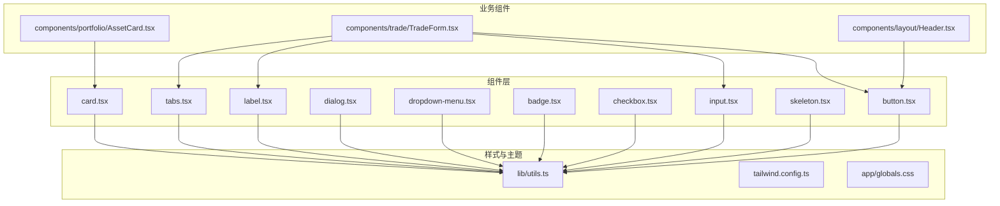
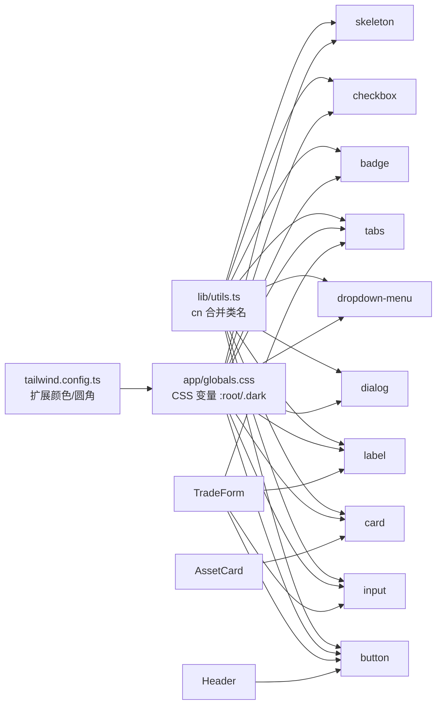
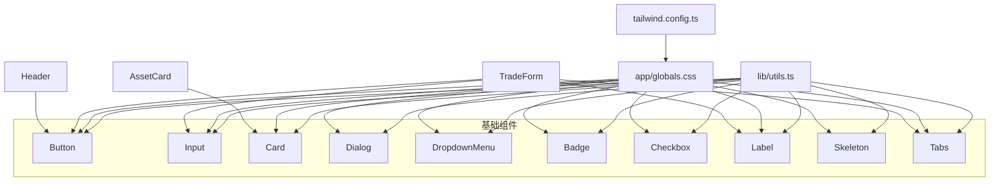

# 基础UI组件

<cite>
**本文引用的文件**
- [components/ui/button.tsx](file://components/ui/button.tsx)
- [components/ui/input.tsx](file://components/ui/input.tsx)
- [components/ui/card.tsx](file://components/ui/card.tsx)
- [components/ui/dialog.tsx](file://components/ui/dialog.tsx)
- [components/ui/dropdown-menu.tsx](file://components/ui/dropdown-menu.tsx)
- [components/ui/badge.tsx](file://components/ui/badge.tsx)
- [components/ui/checkbox.tsx](file://components/ui/checkbox.tsx)
- [components/ui/label.tsx](file://components/ui/label.tsx)
- [components/ui/skeleton.tsx](file://components/ui/skeleton.tsx)
- [components/ui/tabs.tsx](file://components/ui/tabs.tsx)
- [lib/utils.ts](file://lib/utils.ts)
- [tailwind.config.ts](file://tailwind.config.ts)
- [app/globals.css](file://app/globals.css)
- [components/portfolio/AssetCard.tsx](file://components/portfolio/AssetCard.tsx)
- [components/trade/TradeForm.tsx](file://components/trade/TradeForm.tsx)
- [components/layout/Header.tsx](file://components/layout/Header.tsx)
</cite>

## 目录
1. [简介](#简介)
2. [项目结构](#项目结构)
3. [核心组件](#核心组件)
4. [架构总览](#架构总览)
5. [组件详解](#组件详解)
6. [依赖关系分析](#依赖关系分析)
7. [性能与可访问性](#性能与可访问性)
8. [故障排查指南](#故障排查指南)
9. [结论](#结论)
10. [附录](#附录)

## 简介
本文件系统梳理虚拟股票交易项目中使用的 shadcn/ui 基础 UI 组件，涵盖 button、input、card、dialog、dropdown-menu、badge、checkbox、label、skeleton、tabs 等组件。内容包括：
- 组件功能特性与 props 接口
- 事件处理与样式定制
- 在交易、资产卡片、头部导航等场景中的使用范式
- 主题定制与样式覆盖技巧
- 无障碍访问与响应式行为
- 组件组合最佳实践与常见问题

## 项目结构
UI 组件集中于 components/ui 目录，采用“原子化组件 + 组合容器”的分层设计；全局样式通过 Tailwind CSS 与 CSS 变量实现深浅色主题；工具函数统一使用 cn 合并类名。

图表来源
- [components/ui/button.tsx:1-58](file://components/ui/button.tsx#L1-L58)
- [components/ui/input.tsx:1-23](file://components/ui/input.tsx#L1-L23)
- [components/ui/card.tsx:1-84](file://components/ui/card.tsx#L1-L84)
- [components/ui/dialog.tsx:1-123](file://components/ui/dialog.tsx#L1-L123)
- [components/ui/dropdown-menu.tsx:1-202](file://components/ui/dropdown-menu.tsx#L1-L202)
- [components/ui/badge.tsx:1-37](file://components/ui/badge.tsx#L1-L37)
- [components/ui/checkbox.tsx:1-31](file://components/ui/checkbox.tsx#L1-L31)
- [components/ui/label.tsx:1-27](file://components/ui/label.tsx#L1-L27)
- [components/ui/skeleton.tsx:1-16](file://components/ui/skeleton.tsx#L1-L16)
- [components/ui/tabs.tsx:1-56](file://components/ui/tabs.tsx#L1-L56)
- [lib/utils.ts:1-47](file://lib/utils.ts#L1-L47)
- [tailwind.config.ts:1-64](file://tailwind.config.ts#L1-L64)
- [app/globals.css:1-69](file://app/globals.css#L1-L69)
- [components/portfolio/AssetCard.tsx:1-92](file://components/portfolio/AssetCard.tsx#L1-L92)
- [components/trade/TradeForm.tsx:1-300](file://components/trade/TradeForm.tsx#L1-L300)
- [components/layout/Header.tsx:1-205](file://components/layout/Header.tsx#L1-L205)

章节来源
- [lib/utils.ts:1-47](file://lib/utils.ts#L1-L47)
- [tailwind.config.ts:1-64](file://tailwind.config.ts#L1-L64)
- [app/globals.css:1-69](file://app/globals.css#L1-L69)

## 核心组件
本节概述各组件的能力边界与通用能力：
- button：支持多种变体与尺寸，支持作为容器渲染（asChild），具备焦点可见环与禁用态。
- input：基础输入框，聚焦态带 ring 效果，禁用态与占位符颜色遵循语义。
- card：卡片容器及子块（头、标题、描述、内容、尾），语义化结构便于布局与主题继承。
- dialog：基于 Radix 的对话框，含门户、遮罩、内容、标题、描述、页脚等。
- dropdown-menu：下拉菜单根、触发器、子菜单、复选/单选项、标签、分割线、快捷键等。
- badge：徽标，强调状态或标签。
- checkbox：受控/非受控复选框，指示器内含图标。
- label：配合表单控件使用，禁用态与 peer 行为一致。
- skeleton：骨架屏，脉动动画，用于加载态占位。
- tabs：标签页根、列表、触发器、内容区。

章节来源
- [components/ui/button.tsx:1-58](file://components/ui/button.tsx#L1-L58)
- [components/ui/input.tsx:1-23](file://components/ui/input.tsx#L1-L23)
- [components/ui/card.tsx:1-84](file://components/ui/card.tsx#L1-L84)
- [components/ui/dialog.tsx:1-123](file://components/ui/dialog.tsx#L1-L123)
- [components/ui/dropdown-menu.tsx:1-202](file://components/ui/dropdown-menu.tsx#L1-L202)
- [components/ui/badge.tsx:1-37](file://components/ui/badge.tsx#L1-L37)
- [components/ui/checkbox.tsx:1-31](file://components/ui/checkbox.tsx#L1-L31)
- [components/ui/label.tsx:1-27](file://components/ui/label.tsx#L1-L27)
- [components/ui/skeleton.tsx:1-16](file://components/ui/skeleton.tsx#L1-L16)
- [components/ui/tabs.tsx:1-56](file://components/ui/tabs.tsx#L1-L56)

## 架构总览
组件体系以“原子组件 + 组合容器”为主，通过 cn 合并类名与 Tailwind 变量实现主题一致性；业务组件按功能域组织，复用基础组件形成稳定交互模式。

图表来源
- [lib/utils.ts:1-47](file://lib/utils.ts#L1-L47)
- [tailwind.config.ts:1-64](file://tailwind.config.ts#L1-L64)
- [app/globals.css:1-69](file://app/globals.css#L1-L69)
- [components/trade/TradeForm.tsx:1-300](file://components/trade/TradeForm.tsx#L1-L300)
- [components/portfolio/AssetCard.tsx:1-92](file://components/portfolio/AssetCard.tsx#L1-L92)
- [components/layout/Header.tsx:1-205](file://components/layout/Header.tsx#L1-L205)

## 组件详解

### Button（按钮）
- 功能特性
  - 多变体：default、destructive、outline、secondary、ghost、link
  - 多尺寸：default、sm、lg、icon
  - 支持 asChild 将其渲染为任意元素（如链接）
  - 焦点可见环与禁用态
- Props 接口
  - 继承原生 button 属性
  - 可选参数：variant、size、asChild
- 事件与样式
  - 通过 className 扩展样式
  - 使用 data-[state=...] 伪类控制激活态
- 使用示例路径
  - [交易表单提交按钮:282-294](file://components/trade/TradeForm.tsx#L282-L294)
  - [头部主题切换按钮:86-98](file://components/layout/Header.tsx#L86-L98)
- 无障碍与响应式
  - 提供 sr-only 文本用于屏幕阅读器
  - 响应式尺寸与对齐

章节来源
- [components/ui/button.tsx:1-58](file://components/ui/button.tsx#L1-L58)
- [components/trade/TradeForm.tsx:282-294](file://components/trade/TradeForm.tsx#L282-L294)
- [components/layout/Header.tsx:86-98](file://components/layout/Header.tsx#L86-L98)

### Input（输入框）
- 功能特性
  - 聚焦态带 ring 效果
  - 禁用态与占位符颜色
  - 文件输入风格剥离
- Props 接口
  - 继承原生 input 属性
  - 可选参数：className、type
- 使用示例路径
  - [价格输入:211-219](file://components/trade/TradeForm.tsx#L211-L219)
  - [数量输入:241-249](file://components/trade/TradeForm.tsx#L241-L249)

章节来源
- [components/ui/input.tsx:1-23](file://components/ui/input.tsx#L1-L23)
- [components/trade/TradeForm.tsx:211-219](file://components/trade/TradeForm.tsx#L211-L219)
- [components/trade/TradeForm.tsx:241-249](file://components/trade/TradeForm.tsx#L241-L249)

### Card（卡片）
- 功能特性
  - 容器 Card 与子块：CardHeader、CardTitle、CardDescription、CardContent、CardFooter
  - 语义化结构，便于主题继承
- 使用示例路径
  - [资产卡片网格:62-89](file://components/portfolio/AssetCard.tsx#L62-L89)
  - [加载态骨架卡片:19-24](file://components/portfolio/AssetCard.tsx#L19-L24)

章节来源
- [components/ui/card.tsx:1-84](file://components/ui/card.tsx#L1-L84)
- [components/portfolio/AssetCard.tsx:14-25](file://components/portfolio/AssetCard.tsx#L14-L25)
- [components/portfolio/AssetCard.tsx:62-89](file://components/portfolio/AssetCard.tsx#L62-L89)

### Dialog（对话框）
- 功能特性
  - Root、Trigger、Portal、Overlay、Close、Content、Header、Footer、Title、Description
  - 内容居中、动画入场/出场、焦点管理
- 使用建议
  - 通过 Portal 渲染到文档根部，避免层级遮挡
  - 关闭按钮提供 sr-only 文本
- 使用示例路径
  - [对话框组合使用:9-123](file://components/ui/dialog.tsx#L9-L123)

章节来源
- [components/ui/dialog.tsx:1-123](file://components/ui/dialog.tsx#L1-L123)

### DropdownMenu（下拉菜单）
- 功能特性
  - Root、Trigger、Group、Portal、Sub、RadioGroup
  - Content、Item、CheckboxItem、RadioItem、Label、Separator、Shortcut
  - SubTrigger/SubContent 支持二级菜单
- 使用示例路径
  - [头部用户菜单:133-179](file://components/layout/Header.tsx#L133-L179)

章节来源
- [components/ui/dropdown-menu.tsx:1-202](file://components/ui/dropdown-menu.tsx#L1-L202)
- [components/layout/Header.tsx:133-179](file://components/layout/Header.tsx#L133-L179)

### Badge（徽标）
- 功能特性
  - 多变体：default、secondary、destructive、outline
  - 适合状态标签与强调信息
- 使用示例路径
  - [状态徽标:1-37](file://components/ui/badge.tsx#L1-L37)

章节来源
- [components/ui/badge.tsx:1-37](file://components/ui/badge.tsx#L1-L37)

### Checkbox（复选框）
- 功能特性
  - 受控/非受控，指示器内含图标
  - 焦点环与禁用态
- 使用示例路径
  - [复选框基础用法:1-31](file://components/ui/checkbox.tsx#L1-L31)

章节来源
- [components/ui/checkbox.tsx:1-31](file://components/ui/checkbox.tsx#L1-L31)

### Label（标签）
- 功能特性
  - 配合表单控件，禁用态与 peer 行为一致
- 使用示例路径
  - [与 Input 配合:199-219](file://components/trade/TradeForm.tsx#L199-L219)

章节来源
- [components/ui/label.tsx:1-27](file://components/ui/label.tsx#L1-L27)
- [components/trade/TradeForm.tsx:199-219](file://components/trade/TradeForm.tsx#L199-L219)

### Skeleton（骨架屏）
- 功能特性
  - 脉动动画，用于加载态占位
- 使用示例路径
  - [资产卡片加载态:19-24](file://components/portfolio/AssetCard.tsx#L19-L24)

章节来源
- [components/ui/skeleton.tsx:1-16](file://components/ui/skeleton.tsx#L1-L16)
- [components/portfolio/AssetCard.tsx:19-24](file://components/portfolio/AssetCard.tsx#L19-L24)

### Tabs（标签页）
- 功能特性
  - Root、List、Trigger、Content
  - 激活态样式与焦点环
- 使用示例路径
  - [买卖切换与内容区:167-296](file://components/trade/TradeForm.tsx#L167-L296)

章节来源
- [components/ui/tabs.tsx:1-56](file://components/ui/tabs.tsx#L1-L56)
- [components/trade/TradeForm.tsx:167-296](file://components/trade/TradeForm.tsx#L167-L296)

## 依赖关系分析
- 组件间耦合
  - 基础组件彼此低耦合，通过共享工具函数与主题变量连接
  - 业务组件（如 TradeForm、AssetCard、Header）组合多个基础组件
- 外部依赖
  - class-variance-authority（cva）用于变体样式
  - radix-ui（dialog、dropdown、tabs、checkbox、label 等）提供无障碍与状态管理
  - lucide-react 图标库
- 样式依赖
  - cn 合并类名
  - Tailwind CSS + CSS 变量驱动主题

图表来源
- [lib/utils.ts:1-47](file://lib/utils.ts#L1-L47)
- [tailwind.config.ts:1-64](file://tailwind.config.ts#L1-L64)
- [app/globals.css:1-69](file://app/globals.css#L1-L69)
- [components/trade/TradeForm.tsx:1-300](file://components/trade/TradeForm.tsx#L1-L300)
- [components/portfolio/AssetCard.tsx:1-92](file://components/portfolio/AssetCard.tsx#L1-L92)
- [components/layout/Header.tsx:1-205](file://components/layout/Header.tsx#L1-L205)

## 性能与可访问性
- 性能
  - 使用 cn 合并类名，减少无效样式叠加
  - Skeleton 仅在必要时渲染，避免阻塞主线程
  - Tabs、Dialog 等组件使用 Portal，降低 DOM 层级复杂度
- 可访问性
  - 所有交互组件均提供焦点环与键盘可达性
  - 关闭按钮与菜单项提供 sr-only 文本
  - Label 与表单控件配对，提升读屏体验
- 响应式
  - 组件尺寸与布局适配移动端与桌面端
  - 头部导航在小屏隐藏菜单按钮，大屏展示导航

章节来源
- [components/ui/dialog.tsx:47-50](file://components/ui/dialog.tsx#L47-L50)
- [components/ui/dropdown-menu.tsx:23-37](file://components/ui/dropdown-menu.tsx#L23-L37)
- [components/layout/Header.tsx:47-56](file://components/layout/Header.tsx#L47-L56)
- [components/trade/TradeForm.tsx:167-181](file://components/trade/TradeForm.tsx#L167-L181)

## 故障排查指南
- 样式未生效
  - 检查是否正确引入 app/globals.css
  - 确认 Tailwind 配置 content 路径包含组件目录
- 主题不一致
  - 确认 :root 与 .dark 变量定义完整
  - 检查 CSS 变量优先级与覆盖顺序
- 对话框/下拉菜单位置异常
  - 确保使用 Portal 渲染
  - 检查 z-index 与定位类
- 焦点环缺失或不可见
  - 确保启用 focus-visible 与 focus-visible:ring
- 加载态骨架屏闪烁
  - 控制渲染时机，避免过早显示真实内容

章节来源
- [app/globals.css:1-69](file://app/globals.css#L1-L69)
- [tailwind.config.ts:1-64](file://tailwind.config.ts#L1-L64)
- [components/ui/dialog.tsx:36-52](file://components/ui/dialog.tsx#L36-L52)
- [components/ui/dropdown-menu.tsx:63-75](file://components/ui/dropdown-menu.tsx#L63-L75)

## 结论
本项目的基础 UI 组件以 shadcn/ui 为基础，结合工具函数与主题变量，实现了高内聚、低耦合的组件体系。通过在交易、资产、头部导航等场景中的组合使用，形成了清晰的交互模式与一致的视觉语言。建议在后续迭代中持续完善无障碍细节与主题覆盖策略，并保持组件 API 的稳定性。

## 附录

### 主题定制与样式覆盖
- CSS 变量
  - 在 :root 与 .dark 中定义背景、前景、卡片、弹层、主色、次色、破坏性、边框、输入、环等变量
- Tailwind 扩展
  - 在 tailwind.config.ts 中扩展 colors 与 borderRadius，确保组件圆角与阴影一致
- 类名合并
  - 使用 lib/utils.ts 中的 cn 合并类名，避免冲突与重复

章节来源
- [app/globals.css:6-58](file://app/globals.css#L6-L58)
- [tailwind.config.ts:11-60](file://tailwind.config.ts#L11-L60)
- [lib/utils.ts:4-6](file://lib/utils.ts#L4-L6)

### 组件组合最佳实践
- 交易表单
  - 使用 Tabs 切换买卖类型，TabsTrigger 激活态自定义颜色
  - 使用 Label + Input 构建表单项，Button 作为提交入口
  - 使用 Card 包裹整体布局，Skeleton 作为加载态
- 资产卡片
  - 使用 Card + Skeleton 实现加载态网格
  - 使用 Badge 或颜色类标识涨跌状态
- 头部导航
  - 使用 Button + DropdownMenu 组合用户菜单
  - 使用 sr-only 文本提升可访问性

章节来源
- [components/trade/TradeForm.tsx:167-296](file://components/trade/TradeForm.tsx#L167-L296)
- [components/portfolio/AssetCard.tsx:14-25](file://components/portfolio/AssetCard.tsx#L14-L25)
- [components/layout/Header.tsx:133-179](file://components/layout/Header.tsx#L133-L179)