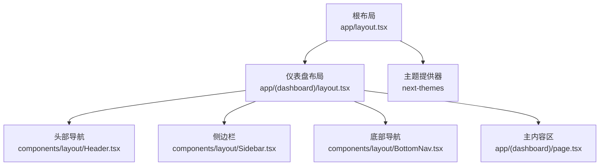
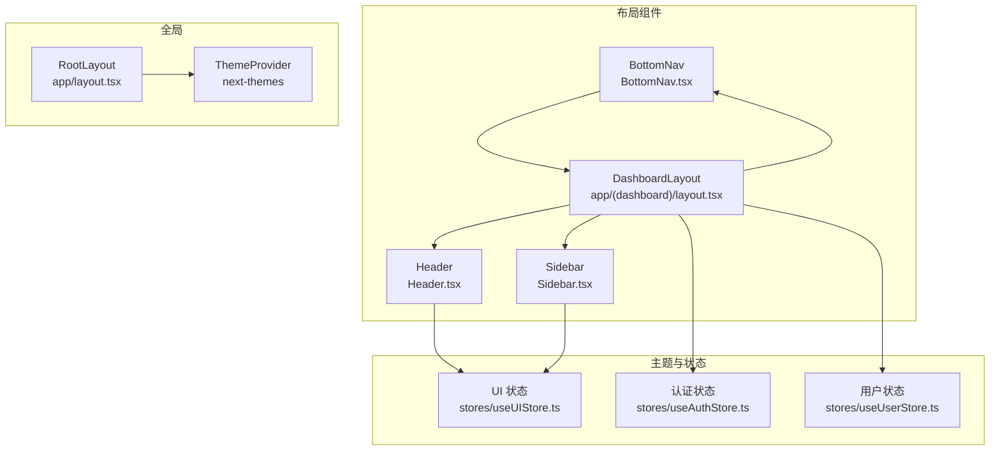
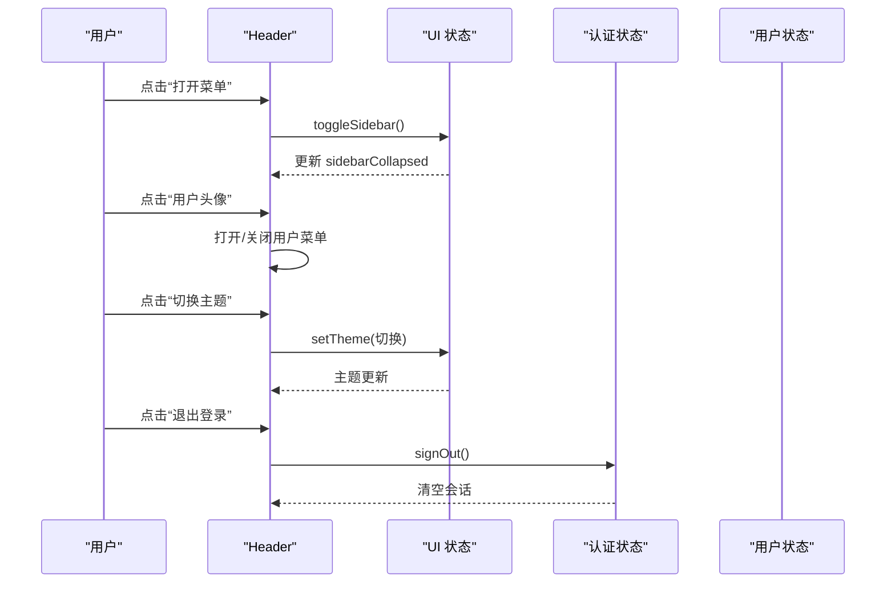
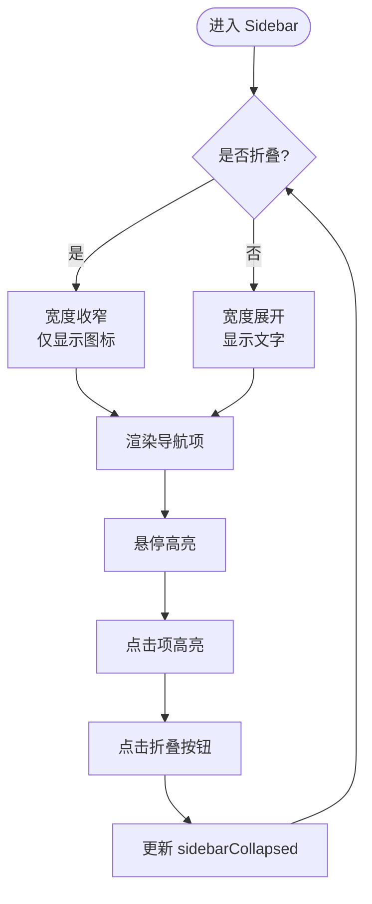
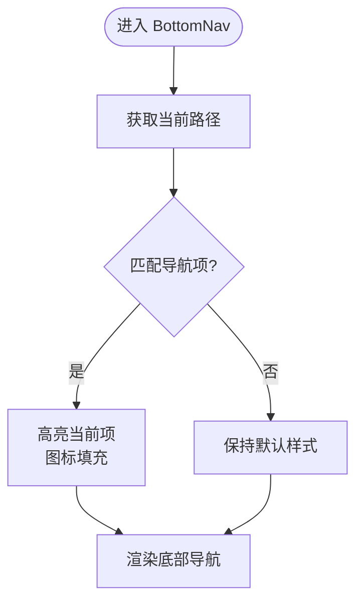
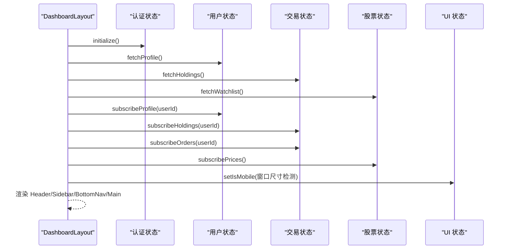
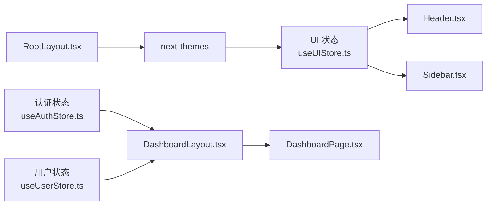

# 布局组件

<cite>
**本文引用的文件**
- [app/layout.tsx](file://app/layout.tsx)
- [app/(dashboard)/layout.tsx](file://app/(dashboard)/layout.tsx)
- [app/(dashboard)/page.tsx](file://app/(dashboard)/page.tsx)
- [components/layout/Header.tsx](file://components/layout/Header.tsx)
- [components/layout/Sidebar.tsx](file://components/layout/Sidebar.tsx)
- [components/layout/BottomNav.tsx](file://components/layout/BottomNav.tsx)
- [stores/index.ts](file://stores/index.ts)
- [stores/useUIStore.ts](file://stores/useUIStore.ts)
- [stores/useAuthStore.ts](file://stores/useAuthStore.ts)
- [stores/useUserStore.ts](file://stores/useUserStore.ts)
- [lib/constants.ts](file://lib/constants.ts)
- [lib/utils.ts](file://lib/utils.ts)
- [tailwind.config.ts](file://tailwind.config.ts)
- [types/index.ts](file://types/index.ts)
</cite>

## 目录
1. [简介](#简介)
2. [项目结构](#项目结构)
3. [核心组件](#核心组件)
4. [架构总览](#架构总览)
5. [详细组件分析](#详细组件分析)
6. [依赖关系分析](#依赖关系分析)
7. [性能考量](#性能考量)
8. [故障排查指南](#故障排查指南)
9. [结论](#结论)
10. [附录](#附录)

## 简介
本文件系统性梳理虚拟股票交易平台的页面布局架构，重点覆盖以下方面：
- Header 组件：导航菜单、用户信息展示与响应式行为
- Sidebar 组件：侧边导航菜单、折叠展开逻辑与移动端适配
- BottomNav 组件：移动端底部导航
- 主布局组件的嵌套结构与路由集成
- 布局组件之间的数据传递与状态共享机制
- 响应式断点与移动端优化策略
- 布局定制与扩展方法（含主题切换对布局的影响）
- 在不同页面中正确使用与配置布局组件的方法

## 项目结构
平台采用 App Router 的嵌套路由组织方式，根级应用通过全局主题包装器提供主题能力；受保护的仪表盘区域通过专用布局承载 Header、Sidebar、BottomNav 与主内容区。

图表来源
- [app/layout.tsx:22-41](file://app/layout.tsx#L22-L41)
- [app/(dashboard)/layout.tsx:14-99](file://app/(dashboard)/layout.tsx#L14-L99)
- [components/layout/Header.tsx:21-205](file://components/layout/Header.tsx#L21-L205)
- [components/layout/Sidebar.tsx:26-115](file://components/layout/Sidebar.tsx#L26-L115)
- [components/layout/BottomNav.tsx:21-55](file://components/layout/BottomNav.tsx#L21-L55)

章节来源
- [app/layout.tsx:22-41](file://app/layout.tsx#L22-L41)
- [app/(dashboard)/layout.tsx:14-99](file://app/(dashboard)/layout.tsx#L14-L99)

## 核心组件
- Header：负责站点 Logo、桌面端导航、用户信息与下拉菜单、主题切换、移动端侧边栏触发等。
- Sidebar：桌面端侧边导航菜单，支持折叠/展开，移动端点击遮罩关闭。
- BottomNav：移动端底部导航，用于快速跳转主要功能入口。
- DashboardLayout：整合 Header、Sidebar、BottomNav 与主内容区，统一处理认证初始化、实时订阅与移动端检测。

章节来源
- [components/layout/Header.tsx:21-205](file://components/layout/Header.tsx#L21-L205)
- [components/layout/Sidebar.tsx:26-115](file://components/layout/Sidebar.tsx#L26-L115)
- [components/layout/BottomNav.tsx:21-55](file://components/layout/BottomNav.tsx#L21-L55)
- [app/(dashboard)/layout.tsx:14-99](file://app/(dashboard)/layout.tsx#L14-L99)

## 架构总览
布局层通过 Zustand 状态库进行跨组件的状态共享，包括主题、侧边栏折叠状态、移动端标记等；通过 next-themes 提供主题切换能力；通过 Supabase 客户端进行认证与实时订阅。

图表来源
- [stores/useUIStore.ts:20-78](file://stores/useUIStore.ts#L20-L78)
- [stores/useAuthStore.ts:17-104](file://stores/useAuthStore.ts#L17-L104)
- [stores/useUserStore.ts:15-110](file://stores/useUserStore.ts#L15-L110)
- [components/layout/Header.tsx:21-205](file://components/layout/Header.tsx#L21-L205)
- [components/layout/Sidebar.tsx:26-115](file://components/layout/Sidebar.tsx#L26-L115)
- [components/layout/BottomNav.tsx:21-55](file://components/layout/BottomNav.tsx#L21-L55)
- [app/(dashboard)/layout.tsx:14-99](file://app/(dashboard)/layout.tsx#L14-L99)
- [app/layout.tsx:22-41](file://app/layout.tsx#L22-L41)

## 详细组件分析

### Header 组件
- 设计要点
  - Logo 与菜单按钮：在移动端显示“打开菜单”按钮以触发侧边栏；桌面端不显示。
  - 桌面端导航：固定显示主要入口（首页、行情、交易、持仓），根据当前路径高亮。
  - 用户信息展示：当用户登录时显示资产概览（总资产、可用余额），桌面端与移动端显示位置不同。
  - 用户菜单：右上角用户头像按钮，支持移动端主题切换与退出登录。
  - 主题切换：支持桌面端图标按钮与移动端下拉项两种入口。
- 响应式行为
  - 使用断点控制桌面端/移动端元素显示与布局。
  - 移动端通过 Header 内部状态控制用户菜单开合，并提供遮罩点击外部关闭。
- 数据与状态
  - 读取认证状态与用户资产概览，调用 UI Store 切换侧边栏。
  - 通过工具函数格式化货币值，提升可读性。

图表来源
- [components/layout/Header.tsx:21-205](file://components/layout/Header.tsx#L21-L205)
- [stores/useUIStore.ts:29-41](file://stores/useUIStore.ts#L29-L41)
- [stores/useAuthStore.ts:71-79](file://stores/useAuthStore.ts#L71-L79)

章节来源
- [components/layout/Header.tsx:21-205](file://components/layout/Header.tsx#L21-L205)
- [lib/utils.ts:14-21](file://lib/utils.ts#L14-L21)

### Sidebar 组件
- 功能特性
  - 固定定位于桌面端左侧，支持折叠/展开，折叠时宽度收窄，仅显示图标。
  - 导航项高亮基于当前路径或前缀匹配，确保子路由也能正确高亮。
  - 底部设置入口，支持折叠模式下的图标模式。
  - 移动端点击遮罩关闭侧边栏，避免遮挡内容。
- 折叠展开逻辑
  - 通过 UI Store 的 toggleSidebar 控制 sidebarCollapsed 状态。
  - 折叠时调整容器宽度与文本显示，旋转折叠按钮图标以指示状态。
- 移动端适配
  - 仅在非折叠状态下显示遮罩层，点击关闭侧边栏。
  - 折叠时侧边栏宽度收窄，适合窄屏显示。

图表来源
- [components/layout/Sidebar.tsx:26-115](file://components/layout/Sidebar.tsx#L26-L115)
- [stores/useUIStore.ts:39-41](file://stores/useUIStore.ts#L39-L41)

章节来源
- [components/layout/Sidebar.tsx:26-115](file://components/layout/Sidebar.tsx#L26-L115)

### BottomNav 组件
- 设计目标
  - 专为移动端设计的底部导航，提供首页、行情、交易、持仓四个入口。
  - 根据当前路径高亮对应入口，图标填充强调当前页。
- 响应式策略
  - 仅在小屏设备显示（lg 及以下），桌面端隐藏。
  - 固定在屏幕底部，保证移动端触达性。

图表来源
- [components/layout/BottomNav.tsx:21-55](file://components/layout/BottomNav.tsx#L21-L55)

章节来源
- [components/layout/BottomNav.tsx:21-55](file://components/layout/BottomNav.tsx#L21-L55)

### 主布局与路由集成
- DashboardLayout 负责：
  - 初始化认证状态，订阅用户资料、持仓、订单与股价实时数据。
  - 检测移动端尺寸并设置 UI 状态，控制侧边栏与 BottomNav 的显示。
  - 统一渲染 Header、Sidebar、BottomNav 与主内容区，计算主内容区的边距与过渡动画。
- 页面集成
  - 仪表盘页面作为主内容区，内部组合资产卡片、持仓列表、热门股票等业务组件。

图表来源
- [app/(dashboard)/layout.tsx:14-99](file://app/(dashboard)/layout.tsx#L14-L99)
- [stores/useAuthStore.ts:81-102](file://stores/useAuthStore.ts#L81-L102)
- [stores/useUserStore.ts:20-37](file://stores/useUserStore.ts#L20-L37)
- [stores/useUIStore.ts:67](file://stores/useUIStore.ts#L67)

章节来源
- [app/(dashboard)/layout.tsx:14-99](file://app/(dashboard)/layout.tsx#L14-L99)
- [app/(dashboard)/page.tsx:17-99](file://app/(dashboard)/page.tsx#L17-L99)

## 依赖关系分析
- 状态共享
  - UI 状态：主题、侧边栏折叠、移动端标记、模态框与提示消息。
  - 认证状态：会话、用户信息、加载状态与初始化流程。
  - 用户状态：个人资料、资产概览、实时订阅与计算逻辑。
- 外部依赖
  - next-themes：提供主题切换与系统主题感知。
  - Tailwind CSS：提供响应式断点与样式变量。
  - Lucide React：提供图标资源。
  - Supabase：提供认证与实时订阅能力。

图表来源
- [stores/useUIStore.ts:20-78](file://stores/useUIStore.ts#L20-L78)
- [stores/useAuthStore.ts:17-104](file://stores/useAuthStore.ts#L17-L104)
- [stores/useUserStore.ts:15-110](file://stores/useUserStore.ts#L15-L110)
- [app/(dashboard)/layout.tsx:14-99](file://app/(dashboard)/layout.tsx#L14-L99)
- [app/(dashboard)/page.tsx:17-99](file://app/(dashboard)/page.tsx#L17-L99)
- [app/layout.tsx:22-41](file://app/layout.tsx#L22-L41)

章节来源
- [stores/index.ts:1-7](file://stores/index.ts#L1-L7)
- [tailwind.config.ts:1-64](file://tailwind.config.ts#L1-L64)

## 性能考量
- 状态持久化：UI 状态通过持久化中间件保存主题与侧边栏折叠状态，减少重复初始化成本。
- 实时订阅：仅在用户登录后建立订阅，避免无意义的网络请求。
- 响应式渲染：通过断点控制组件显示与布局，降低移动端不必要的渲染开销。
- 动画与过渡：侧边栏与遮罩使用过渡动画，注意在低端设备上的性能影响。

## 故障排查指南
- 主题切换无效
  - 检查主题提供器是否包裹根布局，确认主题类名是否正确写入到根节点。
  - 章节来源
    - [app/layout.tsx:30-37](file://app/layout.tsx#L30-L37)
    - [stores/useUIStore.ts:29-37](file://stores/useUIStore.ts#L29-L37)
- 侧边栏无法折叠/展开
  - 确认 UI Store 的 toggleSidebar 是否被调用，检查折叠状态是否持久化。
  - 章节来源
    - [stores/useUIStore.ts:39-41](file://stores/useUIStore.ts#L39-L41)
    - [components/layout/Sidebar.tsx:42-55](file://components/layout/Sidebar.tsx#L42-L55)
- 移动端导航不显示
  - 检查移动端检测逻辑与断点设置，确认 isMobile 状态是否正确更新。
  - 章节来源
    - [app/(dashboard)/layout.tsx:31-39](file://app/(dashboard)/layout.tsx#L31-L39)
    - [lib/constants.ts:82-95](file://lib/constants.ts#L82-L95)
- 用户菜单无法关闭
  - 确认 Header 内部状态 isMenuOpen 的切换逻辑与遮罩点击事件。
  - 章节来源
    - [components/layout/Header.tsx:196-201](file://components/layout/Header.tsx#L196-L201)

## 结论
本布局体系通过清晰的组件职责划分与状态共享机制，实现了桌面端与移动端的一致体验。Header、Sidebar、BottomNav 协同工作，结合 UI Store 的主题与布局状态，为用户提供高效、直观的操作界面。通过合理的响应式断点与实时订阅策略，兼顾了性能与交互体验。

## 附录

### 响应式断点与移动端优化策略
- 断点定义
  - 移动端：sm（640）
  - 小屏：lg（1024）
  - 桌面端：xl（1280）
- 优化策略
  - 移动端隐藏桌面端导航与侧边栏文字，仅保留图标与必要信息。
  - 侧边栏支持折叠，减少横向占用。
  - 底部导航仅在小屏设备显示，保证触达性。

章节来源
- [lib/constants.ts:82-95](file://lib/constants.ts#L82-L95)
- [tailwind.config.ts:11-64](file://tailwind.config.ts#L11-L64)

### 布局定制与扩展方法
- 主题切换
  - 通过 UI Store 的 setTheme 更新主题，并同步到根节点类名，影响全局样式变量。
  - 章节来源
    - [stores/useUIStore.ts:29-37](file://stores/useUIStore.ts#L29-L37)
- 侧边栏扩展
  - 新增导航项时，遵循现有结构与高亮逻辑，确保路径匹配与图标一致。
  - 章节来源
    - [components/layout/Sidebar.tsx:18-24](file://components/layout/Sidebar.tsx#L18-L24)
- 移动端导航扩展
  - 新增 BottomNav 项需与现有高亮逻辑保持一致，确保图标与标签语义明确。
  - 章节来源
    - [components/layout/BottomNav.tsx:14-19](file://components/layout/BottomNav.tsx#L14-L19)

### 在不同页面中正确使用与配置布局组件
- 仪表盘页面
  - 通过 DashboardLayout 统一承载 Header、Sidebar、BottomNav 与主内容区。
  - 章节来源
    - [app/(dashboard)/layout.tsx:73-98](file://app/(dashboard)/layout.tsx#L73-L98)
    - [app/(dashboard)/page.tsx:35-99](file://app/(dashboard)/page.tsx#L35-L99)
- 公共页面
  - 若页面无需布局组件，可直接渲染内容或使用受保护布局（如登录页）。
  - 章节来源
    - [app/(dashboard)/layout.tsx:14-99](file://app/(dashboard)/layout.tsx#L14-L99)