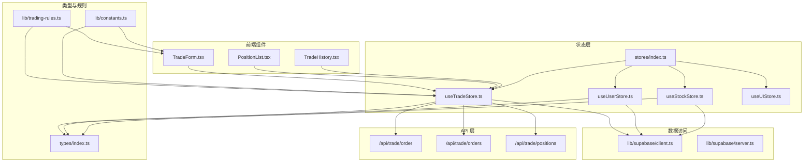
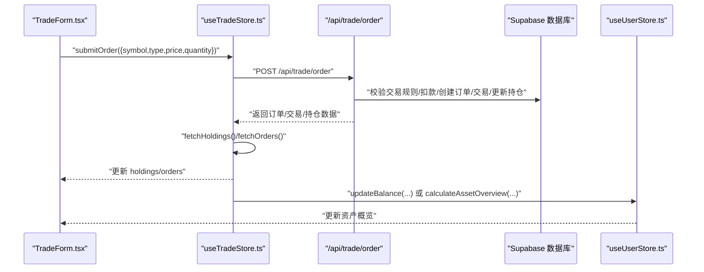
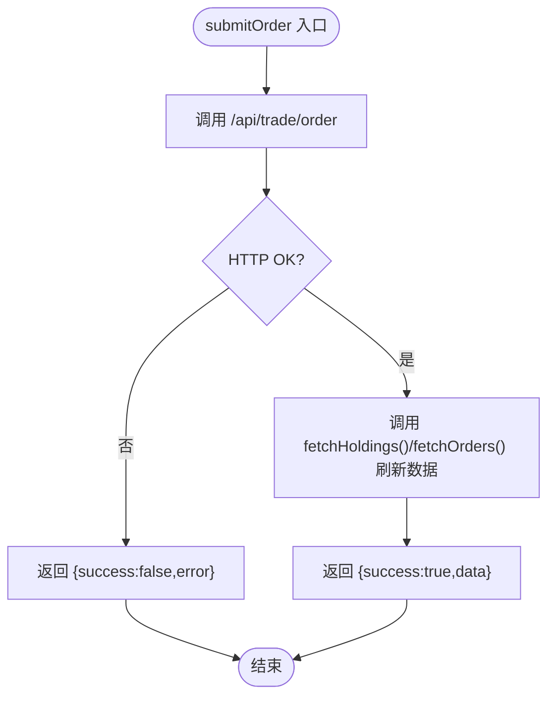
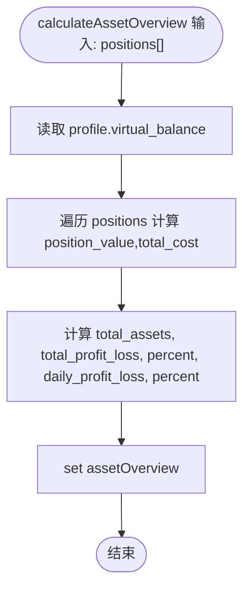
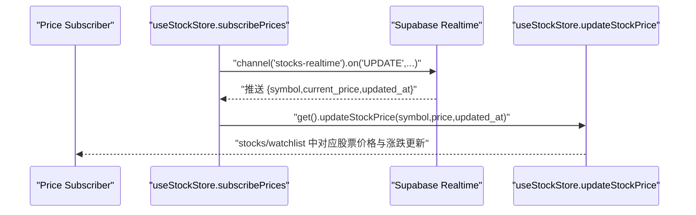
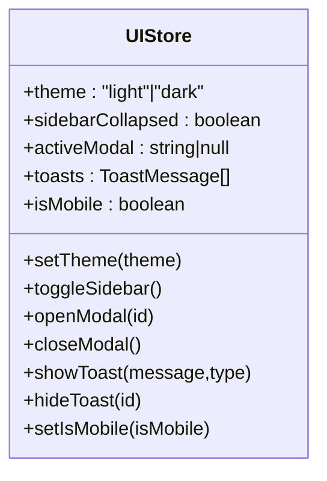
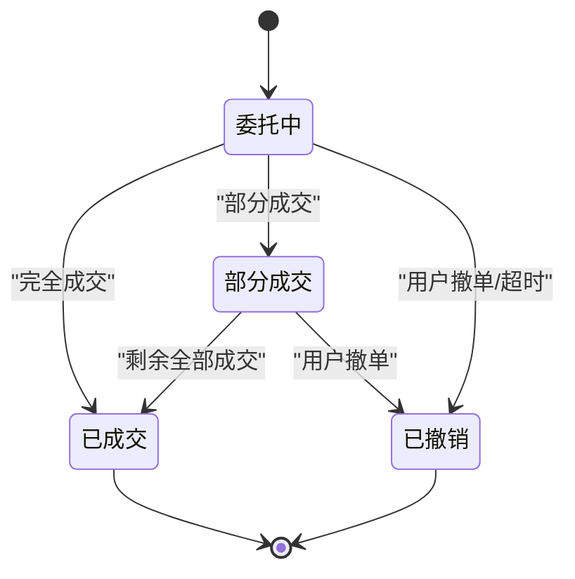
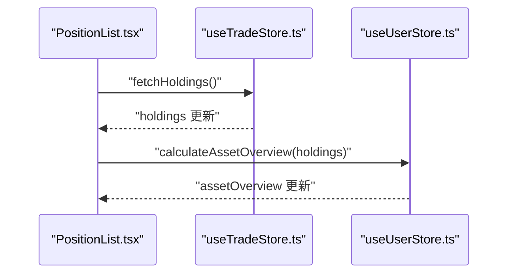
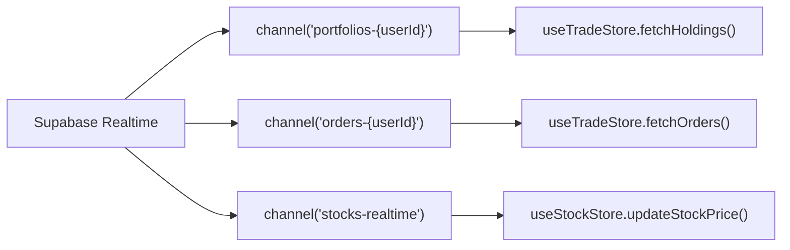
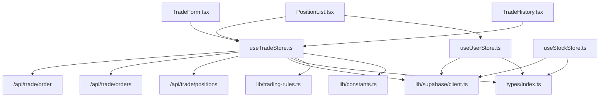

# 交易状态管理

<cite>
**本文引用的文件**
- [stores/index.ts](file://stores/index.ts)
- [stores/useTradeStore.ts](file://stores/useTradeStore.ts)
- [stores/useUserStore.ts](file://stores/useUserStore.ts)
- [stores/useStockStore.ts](file://stores/useStockStore.ts)
- [stores/useUIStore.ts](file://stores/useUIStore.ts)
- [types/index.ts](file://types/index.ts)
- [lib/trading-rules.ts](file://lib/trading-rules.ts)
- [lib/constants.ts](file://lib/constants.ts)
- [lib/supabase/client.ts](file://lib/supabase/client.ts)
- [lib/supabase/server.ts](file://lib/supabase/server.ts)
- [app/api/trade/order/route.ts](file://app/api/trade/order/route.ts)
- [app/api/trade/orders/route.ts](file://app/api/trade/orders/route.ts)
- [app/api/trade/positions/route.ts](file://app/api/trade/positions/route.ts)
- [components/trade/TradeForm.tsx](file://components/trade/TradeForm.tsx)
- [components/portfolio/PositionList.tsx](file://components/portfolio/PositionList.tsx)
- [components/trade/TradeHistory.tsx](file://components/trade/TradeHistory.tsx)
- [lib/utils.ts](file://lib/utils.ts)
</cite>

## 目录
1. [简介](#简介)
2. [项目结构](#项目结构)
3. [核心组件](#核心组件)
4. [架构总览](#架构总览)
5. [详细组件分析](#详细组件分析)
6. [依赖关系分析](#依赖关系分析)
7. [性能考量](#性能考量)
8. [故障排查指南](#故障排查指南)
9. [结论](#结论)
10. [附录](#附录)

## 简介
本文件面向“交易状态管理系统”的架构文档，聚焦于基于 Zustand 的状态管理模式，涵盖状态结构、动作函数、中间件使用、订单状态流转、交易数据流、用户状态集成、实时数据同步、状态持久化与恢复、调试与性能监控以及最佳实践。系统通过 Supabase 实现实时订阅与后端 API 交互，前端组件通过 Store 驱动 UI 更新，并在交易过程中进行严格的规则校验与费用计算。

## 项目结构
- 状态层：stores 目录下集中定义了交易、用户、股票、UI 等多个 Zustand Store，统一导出于 stores/index.ts。
- 类型层：types/index.ts 定义了交易、持仓、订单、用户、资产概览等核心类型。
- 规则与常量：lib/trading-rules.ts 提供交易规则校验与费用计算；lib/constants.ts 提供交易常量与 UI 常量。
- 数据访问：lib/supabase/client.ts 与 lib/supabase/server.ts 提供浏览器端与服务端 Supabase 客户端。
- API 层：app/api/trade 下提供订单、委托、持仓等后端接口。
- 前端组件：components/trade 与 components/portfolio 中的组件消费 Store 并驱动 UI。

图表来源
- [stores/index.ts:1-7](file://stores/index.ts#L1-L7)
- [stores/useTradeStore.ts:1-192](file://stores/useTradeStore.ts#L1-L192)
- [stores/useUserStore.ts:1-110](file://stores/useUserStore.ts#L1-L110)
- [stores/useStockStore.ts:1-184](file://stores/useStockStore.ts#L1-L184)
- [stores/useUIStore.ts:1-78](file://stores/useUIStore.ts#L1-L78)
- [types/index.ts:1-166](file://types/index.ts#L1-L166)
- [lib/trading-rules.ts:1-272](file://lib/trading-rules.ts#L1-L272)
- [lib/constants.ts:1-101](file://lib/constants.ts#L1-L101)
- [lib/supabase/client.ts:1-9](file://lib/supabase/client.ts#L1-L9)
- [lib/supabase/server.ts:1-35](file://lib/supabase/server.ts#L1-L35)
- [app/api/trade/order/route.ts:1-331](file://app/api/trade/order/route.ts#L1-L331)
- [app/api/trade/orders/route.ts:1-66](file://app/api/trade/orders/route.ts#L1-L66)
- [app/api/trade/positions/route.ts:1-46](file://app/api/trade/positions/route.ts#L1-L46)
- [components/trade/TradeForm.tsx:1-234](file://components/trade/TradeForm.tsx#L1-L234)
- [components/portfolio/PositionList.tsx:1-194](file://components/portfolio/PositionList.tsx#L1-L194)
- [components/trade/TradeHistory.tsx:1-155](file://components/trade/TradeHistory.tsx#L1-L155)

章节来源
- [stores/index.ts:1-7](file://stores/index.ts#L1-L7)
- [stores/useTradeStore.ts:1-192](file://stores/useTradeStore.ts#L1-L192)
- [stores/useUserStore.ts:1-110](file://stores/useUserStore.ts#L1-L110)
- [stores/useStockStore.ts:1-184](file://stores/useStockStore.ts#L1-L184)
- [stores/useUIStore.ts:1-78](file://stores/useUIStore.ts#L1-L78)
- [types/index.ts:1-166](file://types/index.ts#L1-L166)
- [lib/trading-rules.ts:1-272](file://lib/trading-rules.ts#L1-L272)
- [lib/constants.ts:1-101](file://lib/constants.ts#L1-L101)
- [lib/supabase/client.ts:1-9](file://lib/supabase/client.ts#L1-L9)
- [lib/supabase/server.ts:1-35](file://lib/supabase/server.ts#L1-L35)
- [app/api/trade/order/route.ts:1-331](file://app/api/trade/order/route.ts#L1-L331)
- [app/api/trade/orders/route.ts:1-66](file://app/api/trade/orders/route.ts#L1-L66)
- [app/api/trade/positions/route.ts:1-46](file://app/api/trade/positions/route.ts#L1-L46)
- [components/trade/TradeForm.tsx:1-234](file://components/trade/TradeForm.tsx#L1-L234)
- [components/portfolio/PositionList.tsx:1-194](file://components/portfolio/PositionList.tsx#L1-L194)
- [components/trade/TradeHistory.tsx:1-155](file://components/trade/TradeHistory.tsx#L1-L155)

## 核心组件
- 交易状态 Store（useTradeStore）：负责持仓、订单、交易流水的获取与更新，支持下单、撤单、实时订阅。
- 用户状态 Store（useUserStore）：负责用户资料、资产概览、余额更新与实时订阅。
- 股票状态 Store（useStockStore）：负责股票列表、自选股、实时价格更新与订阅。
- UI 状态 Store（useUIStore）：负责主题、侧边栏、模态框、Toast 等 UI 状态，并使用持久化中间件。
- 类型系统（types/index.ts）：定义交易、持仓、订单、用户、资产概览等强类型。
- 交易规则（lib/trading-rules.ts）：提供交易时间判断、涨跌停限制、手续费计算、数量校验、T+1 规则等。
- 常量配置（lib/constants.ts）：提供交易费率、最小交易单位、交易时间、API 分页等常量。
- Supabase 客户端（lib/supabase/client.ts、server.ts）：提供浏览器端与服务端 Supabase 客户端封装。
- API 接口（/api/trade/*）：提供下单、委托查询、持仓查询等后端接口。

章节来源
- [stores/useTradeStore.ts:6-25](file://stores/useTradeStore.ts#L6-L25)
- [stores/useUserStore.ts:5-13](file://stores/useUserStore.ts#L5-L13)
- [stores/useStockStore.ts:6-21](file://stores/useStockStore.ts#L6-L21)
- [stores/useUIStore.ts:5-18](file://stores/useUIStore.ts#L5-L18)
- [types/index.ts:1-166](file://types/index.ts#L1-L166)
- [lib/trading-rules.ts:1-272](file://lib/trading-rules.ts#L1-L272)
- [lib/constants.ts:1-101](file://lib/constants.ts#L1-L101)
- [lib/supabase/client.ts:1-9](file://lib/supabase/client.ts#L1-L9)
- [lib/supabase/server.ts:1-35](file://lib/supabase/server.ts#L1-L35)
- [app/api/trade/order/route.ts:1-331](file://app/api/trade/order/route.ts#L1-L331)
- [app/api/trade/orders/route.ts:1-66](file://app/api/trade/orders/route.ts#L1-L66)
- [app/api/trade/positions/route.ts:1-46](file://app/api/trade/positions/route.ts#L1-L46)

## 架构总览
系统采用前端 Zustand Store 驱动的状态管理方案，结合 Supabase Realtime 订阅与 Next.js API Routes 后端接口，形成“前端 Store -> API -> 数据库”的闭环。交易流程中，前端组件通过 Store 的 action 发起请求或订阅事件，Store 在收到响应或实时推送后更新状态，UI 自动刷新。

图表来源
- [components/trade/TradeForm.tsx:84-127](file://components/trade/TradeForm.tsx#L84-L127)
- [stores/useTradeStore.ts:99-121](file://stores/useTradeStore.ts#L99-L121)
- [app/api/trade/order/route.ts:11-331](file://app/api/trade/order/route.ts#L11-L331)
- [stores/useUserStore.ts:39-86](file://stores/useUserStore.ts#L39-L86)

## 详细组件分析

### 交易状态 Store（useTradeStore）
- 状态结构
  - 持仓数组（holdings）、订单数组（orders）、交易流水数组（transactions）、加载状态（isLoading）。
- 动作函数
  - 获取持仓：fetchHoldings，调用 /api/trade/positions，计算市值与盈亏后更新状态。
  - 获取订单：fetchOrders，调用 /api/trade/orders，支持按状态过滤。
  - 获取交易流水：fetchTransactions，调用 /api/trade/transactions。
  - 下单：submitOrder，调用 /api/trade/order，成功后刷新持仓与订单。
  - 撤单：cancelOrder，调用 /api/trade/order/{id}，成功后刷新订单。
  - 订阅持仓与订单：subscribeHoldings、subscribeOrders，基于 Supabase Realtime 订阅，收到变更即刷新对应数据。
  - 辅助查询：getHoldingBySymbol。
- 中间件
  - 未使用中间件，直接通过 set/get 控制状态与派发异步逻辑。
- 错误处理
  - 对 fetch/cancel/submit 等异步操作包裹 try/catch，失败时返回 {success:false, error}，并在 UI 层提示。

图表来源
- [stores/useTradeStore.ts:99-121](file://stores/useTradeStore.ts#L99-L121)
- [app/api/trade/order/route.ts:11-331](file://app/api/trade/order/route.ts#L11-L331)

章节来源
- [stores/useTradeStore.ts:6-25](file://stores/useTradeStore.ts#L6-L25)
- [stores/useTradeStore.ts:33-97](file://stores/useTradeStore.ts#L33-L97)
- [stores/useTradeStore.ts:99-142](file://stores/useTradeStore.ts#L99-L142)
- [stores/useTradeStore.ts:144-191](file://stores/useTradeStore.ts#L144-L191)

### 用户状态 Store（useUserStore）
- 状态结构
  - 用户资料（profile）、资产概览（assetOverview）、加载状态（isLoading）。
- 动作函数
  - 获取资料：fetchProfile，从 profiles 表按用户 ID 查询并更新。
  - 更新余额：updateBalance，同时更新资产概览中的可用余额与总资产。
  - 计算资产概览：calculateAssetOverview，遍历持仓计算总值、总盈亏、日收益等。
  - 订阅资料：subscribeProfile，监听 profiles 表 UPDATE 事件，实时更新用户资料。
- 中间件
  - 未使用中间件，直接通过 set/get 控制状态。

图表来源
- [stores/useUserStore.ts:53-86](file://stores/useUserStore.ts#L53-L86)

章节来源
- [stores/useUserStore.ts:5-13](file://stores/useUserStore.ts#L5-L13)
- [stores/useUserStore.ts:20-37](file://stores/useUserStore.ts#L20-L37)
- [stores/useUserStore.ts:39-51](file://stores/useUserStore.ts#L39-L51)
- [stores/useUserStore.ts:53-86](file://stores/useUserStore.ts#L53-L86)
- [stores/useUserStore.ts:88-108](file://stores/useUserStore.ts#L88-L108)

### 股票状态 Store（useStockStore）
- 状态结构
  - 股票列表（stocks）、自选股（watchlist）、搜索关键词（searchKeyword）、加载状态（isLoading）、分页信息（currentPage、totalCount）。
- 动作函数
  - 设置搜索关键词：setSearchKeyword。
  - 获取股票列表：fetchStocks，支持关键词与分页参数。
  - 获取自选股：fetchWatchlist，将 watchlist 项转换为 Stock 格式。
  - 添加/移除自选股：addToWatchlist/removeFromWatchlist，成功后刷新或更新本地状态。
  - 订阅股价：subscribePrices，基于 Supabase Realtime 订阅 stocks 表 UPDATE 事件，回调中调用 updateStockPrice。
  - 更新股价：updateStockPrice，同时更新 stocks 与 watchlist 中对应股票的价格与涨跌指标。
  - 查询股票：getStockBySymbol。
- 中间件
  - 未使用中间件。

图表来源
- [stores/useStockStore.ts:125-150](file://stores/useStockStore.ts#L125-L150)
- [stores/useStockStore.ts:152-177](file://stores/useStockStore.ts#L152-L177)

章节来源
- [stores/useStockStore.ts:6-21](file://stores/useStockStore.ts#L6-L21)
- [stores/useStockStore.ts:33-78](file://stores/useStockStore.ts#L33-L78)
- [stores/useStockStore.ts:80-123](file://stores/useStockStore.ts#L80-L123)
- [stores/useStockStore.ts:125-177](file://stores/useStockStore.ts#L125-L177)
- [stores/useStockStore.ts:179-182](file://stores/useStockStore.ts#L179-L182)

### UI 状态 Store（useUIStore）
- 状态结构
  - 主题（theme）、侧边栏折叠（sidebarCollapsed）、活动模态框（activeModal）、Toast 列表（toasts）、移动端标识（isMobile）。
- 动作函数
  - 设置主题：setTheme，同时同步到 documentElement 的 class。
  - 切换侧边栏：toggleSidebar。
  - 打开/关闭模态框：openModal/closeModal。
  - 显示/隐藏 Toast：showToast/hideToast，自动 3 秒隐藏。
  - 设置移动端：setIsMobile。
- 中间件
  - 使用 persist 中间件，仅持久化 theme 与 sidebarCollapsed，减少存储体积。

图表来源
- [stores/useUIStore.ts:5-18](file://stores/useUIStore.ts#L5-L18)
- [stores/useUIStore.ts:20-77](file://stores/useUIStore.ts#L20-L77)

章节来源
- [stores/useUIStore.ts:1-78](file://stores/useUIStore.ts#L1-L78)

### 订单状态管理与数据流
- 订单状态枚举：pending（委托中）、filled（已成交）、partial（部分成交）、cancelled（已撤销）。
- 状态转换
  - 提交委托：由前端发起，后端根据规则校验后创建订单，状态通常为已成交（即时撮合）。
  - 部分成交：当部分成交发生时，后端更新 filled_quantity 与状态为部分成交，前端通过订阅或轮询更新。
  - 已撤销：用户主动撤单或超时未成交，后端更新状态为已撤销，前端刷新订单列表。
- 异步处理
  - 下单与撤单均通过 API 调用，成功后触发 Store 的刷新动作。
  - 订单与持仓通过 Supabase Realtime 订阅实时推送，确保前端状态与数据库一致。
- 错误恢复
  - Store 对网络异常返回统一 {success:false,error} 结构，组件层通过 Toast 提示并允许重试。

图表来源
- [types/index.ts:68-80](file://types/index.ts#L68-L80)
- [app/api/trade/order/route.ts:11-331](file://app/api/trade/order/route.ts#L11-L331)
- [stores/useTradeStore.ts:123-142](file://stores/useTradeStore.ts#L123-L142)

章节来源
- [types/index.ts:68-80](file://types/index.ts#L68-L80)
- [app/api/trade/orders/route.ts:1-66](file://app/api/trade/orders/route.ts#L1-L66)
- [stores/useTradeStore.ts:68-84](file://stores/useTradeStore.ts#L68-L84)

### 与用户状态的集成
- 可用资金计算：TradeForm 根据用户资产概览 available_balance 与委托价格计算最大可买数量。
- 持仓数据获取：PositionList 在挂载时拉取持仓，并在持仓变化时重新计算资产概览。
- 账户余额更新：下单成功后，useTradeStore 调用 useUserStore.updateBalance 或在计算资产概览时联动更新。

图表来源
- [components/portfolio/PositionList.tsx:25-43](file://components/portfolio/PositionList.tsx#L25-L43)
- [stores/useTradeStore.ts:33-66](file://stores/useTradeStore.ts#L33-L66)
- [stores/useUserStore.ts:53-86](file://stores/useUserStore.ts#L53-L86)

章节来源
- [components/trade/TradeForm.tsx:76-82](file://components/trade/TradeForm.tsx#L76-L82)
- [components/portfolio/PositionList.tsx:25-43](file://components/portfolio/PositionList.tsx#L25-L43)
- [stores/useUserStore.ts:39-86](file://stores/useUserStore.ts#L39-L86)

### 实时数据同步机制
- WebSocket 连接：通过 Supabase Realtime 订阅，客户端自动建立连接并维护心跳。
- 订阅频道
  - 持仓：portfolios-{userId}，监听 portfolios 表变更，触发 fetchHoldings。
  - 订单：orders-{userId}，监听 orders 表变更，触发 fetchOrders。
  - 股价：stocks-realtime，监听 stocks 表 UPDATE，触发 updateStockPrice。
- 缓存策略：Store 内部以内存状态为主，配合订阅实现近实时同步；UI 层通过 loading 状态避免并发刷新导致的闪烁。

图表来源
- [stores/useTradeStore.ts:144-164](file://stores/useTradeStore.ts#L144-L164)
- [stores/useTradeStore.ts:166-186](file://stores/useTradeStore.ts#L166-L186)
- [stores/useStockStore.ts:125-150](file://stores/useStockStore.ts#L125-L150)

章节来源
- [stores/useTradeStore.ts:144-186](file://stores/useTradeStore.ts#L144-L186)
- [stores/useStockStore.ts:125-150](file://stores/useStockStore.ts#L125-L150)

### 状态持久化与恢复机制
- UI Store 持久化：useUIStore 使用 persist 中间件，仅持久化 theme 与 sidebarCollapsed，存储键为 ui-storage。
- 其他 Store：未启用持久化，避免将大量交易数据写入本地存储。
- 初始化：应用启动时，UI Store 从本地恢复主题与侧边栏状态；交易与用户数据通过 API 与订阅初始化。

章节来源
- [stores/useUIStore.ts:69-77](file://stores/useUIStore.ts#L69-L77)

### 状态调试工具、性能监控与最佳实践
- 调试建议
  - 使用 React DevTools Profiler 观察组件渲染热点。
  - 在 Store 中增加日志（如 set/get 回调），定位状态变更路径。
  - 对高频订阅（如股价）设置去抖或批量更新，减少不必要的重渲染。
- 性能优化
  - 将计算型字段（如市值、盈亏）在 Store 内部缓存，避免重复计算。
  - 使用 shallow selector（如 React-Query 或 Zustand 自带选择器）只订阅必要字段，降低渲染频率。
  - 对分页与搜索参数进行防抖，避免频繁请求。
- 最佳实践
  - 所有异步操作统一返回 {success,error,data} 结构，便于 UI 一致性处理。
  - 交易规则前置校验（前端）与后端校验双保险，保证数据一致性。
  - 使用 Supabase Realtime 订阅替代轮询，降低延迟与带宽消耗。

## 依赖关系分析
- 组件依赖 Store：TradeForm、PositionList、TradeHistory 直接依赖 useTradeStore；PositionList 依赖 useUserStore；useStockStore 用于股价订阅。
- Store 依赖 Supabase：useTradeStore、useUserStore、useStockStore 通过 createClient() 获取 Supabase 客户端。
- Store 依赖 API：useTradeStore 通过 fetch 调用 /api/trade/*；useStockStore 通过 fetch 调用 /api/stocks 与 /api/watchlist。
- 类型与规则：Store 与组件均依赖 types/index.ts 与 lib/trading-rules.ts、lib/constants.ts。

图表来源
- [components/trade/TradeForm.tsx:1-234](file://components/trade/TradeForm.tsx#L1-L234)
- [components/portfolio/PositionList.tsx:1-194](file://components/portfolio/PositionList.tsx#L1-L194)
- [components/trade/TradeHistory.tsx:1-155](file://components/trade/TradeHistory.tsx#L1-L155)
- [stores/useTradeStore.ts:1-192](file://stores/useTradeStore.ts#L1-L192)
- [stores/useUserStore.ts:1-110](file://stores/useUserStore.ts#L1-L110)
- [stores/useStockStore.ts:1-184](file://stores/useStockStore.ts#L1-L184)
- [lib/supabase/client.ts:1-9](file://lib/supabase/client.ts#L1-L9)
- [types/index.ts:1-166](file://types/index.ts#L1-L166)
- [lib/trading-rules.ts:1-272](file://lib/trading-rules.ts#L1-L272)
- [lib/constants.ts:1-101](file://lib/constants.ts#L1-L101)

章节来源
- [stores/index.ts:1-7](file://stores/index.ts#L1-L7)

## 性能考量
- 订阅频率控制：股价订阅按需传入 symbols，避免广播风暴。
- 批量更新：updateStockPrice 对 stocks 与 watchlist 同步更新，减少多次渲染。
- 加载状态：Store 在异步请求前后设置 isLoading，避免 UI 抖动。
- 分页与搜索：StockStore 支持分页与关键词搜索，结合防抖提升性能。
- 本地持久化：仅 UI Store 持久化，避免交易数据占用本地存储空间。

## 故障排查指南
- 常见问题
  - 未登录：API 返回 401，检查 Supabase 认证状态。
  - 非交易时间：下单被拒绝，提示“非交易时间”，参考 isTradingHour 与 getNextTradingTime。
  - 数量非法：数量必须是 100 的整数倍，参考 TRADE_CONSTANTS.MIN_TRADE_QUANTITY。
  - 资金不足：买入金额超过可用余额，参考 calculateTotalCost 与 updateBalance。
  - 涨跌停限制：委托价格超出涨跌停范围，参考 getUpperLimitPrice/getLowerLimitPrice。
- 排查步骤
  - 检查网络请求：确认 /api/trade/* 请求状态码与响应体。
  - 检查订阅：确认 Supabase Realtime 订阅是否正常，频道名称与过滤条件正确。
  - 检查 Store 状态：确认 holdings、orders、transactions 是否按预期更新。
  - 检查 UI 提示：Toast 是否正确显示错误信息，按钮禁用状态是否合理。

章节来源
- [app/api/trade/order/route.ts:11-331](file://app/api/trade/order/route.ts#L11-L331)
- [lib/trading-rules.ts:78-201](file://lib/trading-rules.ts#L78-L201)
- [lib/trading-rules.ts:209-247](file://lib/trading-rules.ts#L209-L247)
- [stores/useTradeStore.ts:99-142](file://stores/useTradeStore.ts#L99-L142)

## 结论
本交易状态管理系统以 Zustand 为核心，结合 Supabase Realtime 与 Next.js API Routes，实现了高内聚、低耦合的状态管理与实时数据同步。通过明确的类型定义、严格的交易规则校验与清晰的动作函数设计，系统在易用性与可靠性之间取得了良好平衡。建议后续引入更细粒度的选择器与持久化策略，进一步优化性能与用户体验。

## 附录
- 关键 API 路由
  - POST /api/trade/order：提交委托订单
  - GET /api/trade/orders：获取委托记录（支持状态过滤与分页）
  - GET /api/trade/positions：获取当前持仓
- 常用工具函数
  - formatCurrency/formatNumber/formatPercent/formatVolume：格式化展示
  - isTradingHour/getNextTradingTime：交易时间判断与提示
  - calculateTotalCost/calculateFee：费用与总成本计算
  - getUpperLimitPrice/getLowerLimitPrice/isPriceWithinLimit：涨跌停限制