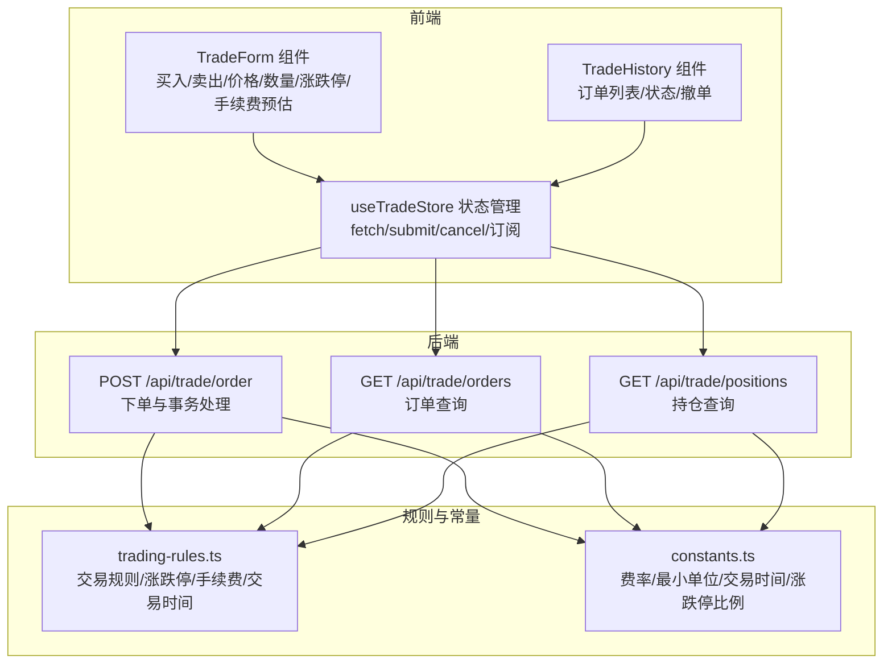
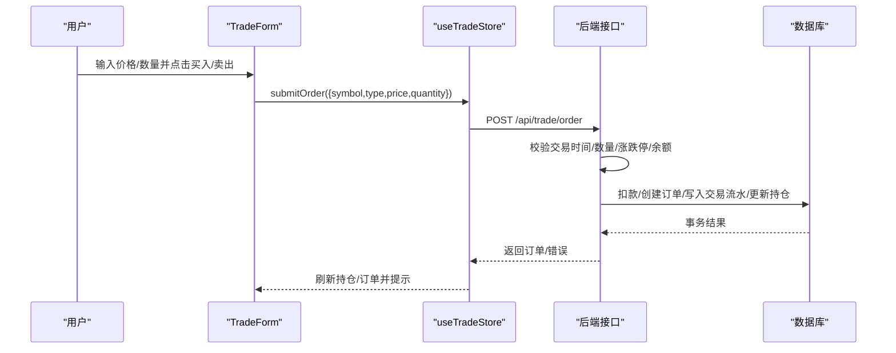
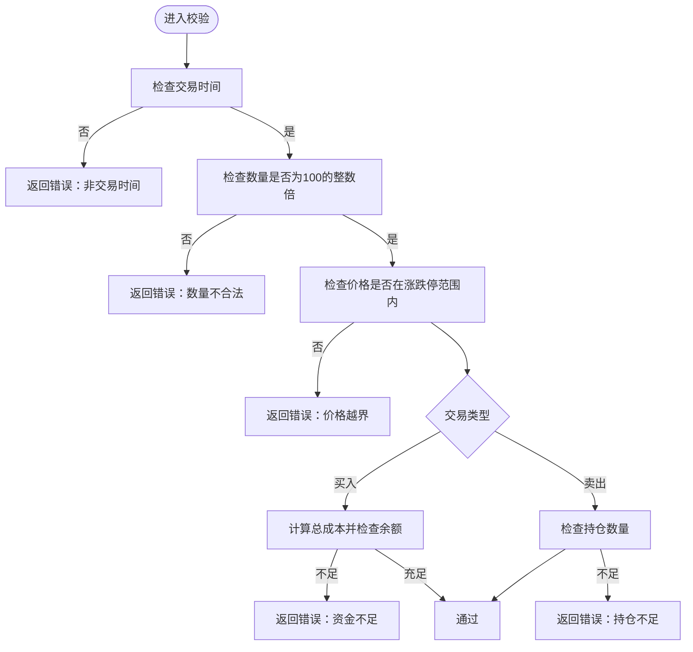
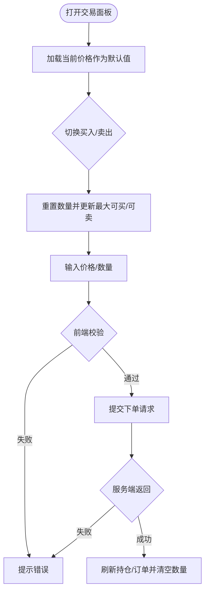
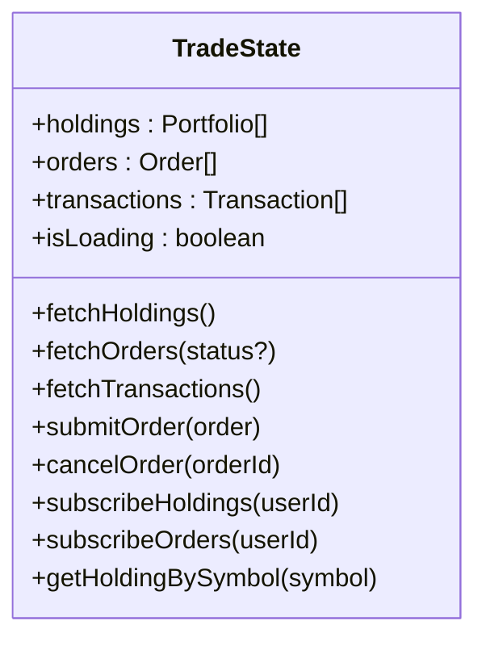
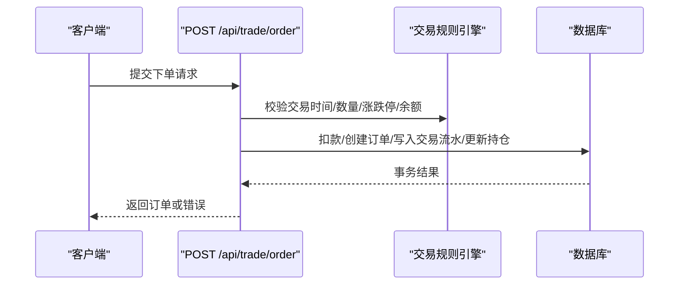
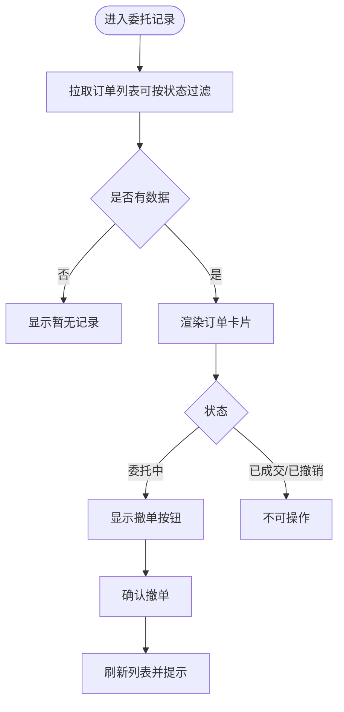
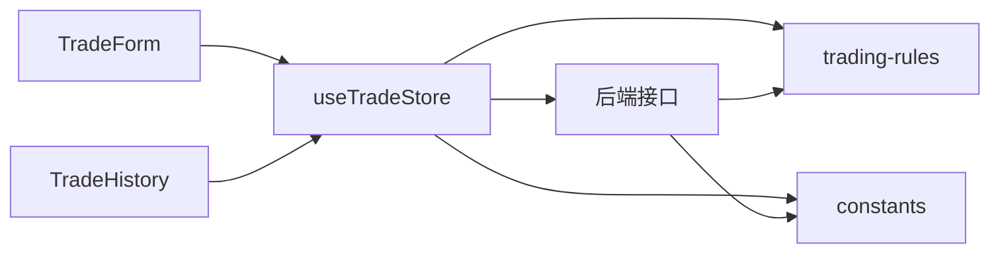

# 交易系统

<cite>
**本文引用的文件**
- [app/api/trade/order/route.ts](file://app/api/trade/order/route.ts)
- [app/api/trade/orders/route.ts](file://app/api/trade/orders/route.ts)
- [app/api/trade/positions/route.ts](file://app/api/trade/positions/route.ts)
- [lib/trading-rules.ts](file://lib/trading-rules.ts)
- [lib/constants.ts](file://lib/constants.ts)
- [components/trade/TradeForm.tsx](file://components/trade/TradeForm.tsx)
- [components/trade/TradeHistory.tsx](file://components/trade/TradeHistory.tsx)
- [stores/useTradeStore.ts](file://stores/useTradeStore.ts)
- [types/index.ts](file://types/index.ts)
- [lib/utils.ts](file://lib/utils.ts)
</cite>

## 目录
1. [简介](#简介)
2. [项目结构](#项目结构)
3. [核心组件](#核心组件)
4. [架构总览](#架构总览)
5. [详细组件分析](#详细组件分析)
6. [依赖关系分析](#依赖关系分析)
7. [性能考量](#性能考量)
8. [故障排查指南](#故障排查指南)
9. [结论](#结论)
10. [附录](#附录)

## 简介
本文件面向虚拟股票交易平台的“仿真交易”能力，系统性阐述交易规则引擎、交易表单组件、交易状态管理、API 接口设计、交易历史与持仓存储、以及安全性与并发控制等主题。目标是帮助开发者与产品人员快速理解并扩展交易模块。

## 项目结构
交易系统由三层组成：
- 前端组件层：负责用户交互、表单校验与状态展示（买入/卖出、价格/数量输入、涨跌停提示、手续费预估）。
- 状态管理层：使用轻量状态库统一拉取与订阅持仓、订单、交易流水，支持实时刷新与本地计算。
- 后端接口层：提供订单提交、订单查询、持仓查询等 RESTful 接口，并在服务端完成交易规则校验与数据库事务处理。

图表来源
- [components/trade/TradeForm.tsx:1-300](file://components/trade/TradeForm.tsx#L1-L300)
- [components/trade/TradeHistory.tsx:1-155](file://components/trade/TradeHistory.tsx#L1-L155)
- [stores/useTradeStore.ts:1-192](file://stores/useTradeStore.ts#L1-L192)
- [app/api/trade/order/route.ts:1-331](file://app/api/trade/order/route.ts#L1-L331)
- [app/api/trade/orders/route.ts:1-66](file://app/api/trade/orders/route.ts#L1-L66)
- [app/api/trade/positions/route.ts:1-46](file://app/api/trade/positions/route.ts#L1-L46)
- [lib/trading-rules.ts:1-272](file://lib/trading-rules.ts#L1-L272)
- [lib/constants.ts:1-101](file://lib/constants.ts#L1-L101)

章节来源
- [components/trade/TradeForm.tsx:1-300](file://components/trade/TradeForm.tsx#L1-L300)
- [components/trade/TradeHistory.tsx:1-155](file://components/trade/TradeHistory.tsx#L1-L155)
- [stores/useTradeStore.ts:1-192](file://stores/useTradeStore.ts#L1-L192)
- [app/api/trade/order/route.ts:1-331](file://app/api/trade/order/route.ts#L1-L331)
- [app/api/trade/orders/route.ts:1-66](file://app/api/trade/orders/route.ts#L1-L66)
- [app/api/trade/positions/route.ts:1-46](file://app/api/trade/positions/route.ts#L1-L46)
- [lib/trading-rules.ts:1-272](file://lib/trading-rules.ts#L1-L272)
- [lib/constants.ts:1-101](file://lib/constants.ts#L1-L101)

## 核心组件
- 交易规则引擎：提供交易时间判断、涨跌停计算、手续费计算、数量合法性校验、T+1 规则接口等。
- 交易表单组件：负责价格/数量输入、涨跌停提示、最大可买/可卖数量计算、手续费预估、下单提交与错误提示。
- 交易状态管理：封装持仓、订单、交易流水的获取与订阅；提供下单/撤单调用与本地计算（如盈亏）。
- API 接口：提供下单、订单查询、持仓查询的 RESTful 接口，服务端完成严格校验与事务处理。

章节来源
- [lib/trading-rules.ts:1-272](file://lib/trading-rules.ts#L1-L272)
- [components/trade/TradeForm.tsx:1-300](file://components/trade/TradeForm.tsx#L1-L300)
- [stores/useTradeStore.ts:1-192](file://stores/useTradeStore.ts#L1-L192)
- [app/api/trade/order/route.ts:1-331](file://app/api/trade/order/route.ts#L1-L331)
- [app/api/trade/orders/route.ts:1-66](file://app/api/trade/orders/route.ts#L1-L66)
- [app/api/trade/positions/route.ts:1-46](file://app/api/trade/positions/route.ts#L1-L46)

## 架构总览
交易从“前端表单”开始，经“状态管理”调用后端接口，服务端在“交易规则引擎”与“常量配置”下进行严格校验，随后在数据库中执行多步事务（资金变动、订单创建、交易流水、持仓更新），最终返回结果并触发前端订阅刷新。

图表来源
- [components/trade/TradeForm.tsx:91-134](file://components/trade/TradeForm.tsx#L91-L134)
- [stores/useTradeStore.ts:99-121](file://stores/useTradeStore.ts#L99-L121)
- [app/api/trade/order/route.ts:11-331](file://app/api/trade/order/route.ts#L11-L331)

## 详细组件分析

### 交易规则引擎
- 交易时间：支持 A 股工作日的上午与下午两个交易时段。
- 涨跌停限制：根据股票板块（主板/科创板/创业板/北交所）采用不同涨跌幅限制比例。
- 手续费：双向收取佣金，最低收费阈值；卖出单边收取印花税。
- 数量单位：最小交易单位为 100 股（1 手）。
- T+1：提供 T+1 规则接口（实际实现需结合买入时间记录）。
- 订单校验：提供买入/卖出订单的综合校验函数，返回通过与否及错误原因。

图表来源
- [lib/trading-rules.ts:170-247](file://lib/trading-rules.ts#L170-L247)
- [lib/constants.ts:15-27](file://lib/constants.ts#L15-L27)

章节来源
- [lib/trading-rules.ts:1-272](file://lib/trading-rules.ts#L1-L272)
- [lib/constants.ts:1-101](file://lib/constants.ts#L1-L101)

### 交易表单组件（买入/卖出）
- 交互逻辑：支持买入/卖出切换、价格与数量输入、涨跌停快捷按钮、全仓按钮、手续费预估展示。
- 校验策略：在前端进行基础校验（交易时间、数量单位、资金/持仓上限），并在提交时调用状态管理发起下单请求。
- 实时反馈：根据交易时间显示提示；下单成功/失败通过全局提示反馈。

图表来源
- [components/trade/TradeForm.tsx:33-134](file://components/trade/TradeForm.tsx#L33-L134)

章节来源
- [components/trade/TradeForm.tsx:1-300](file://components/trade/TradeForm.tsx#L1-L300)
- [lib/trading-rules.ts:88-125](file://lib/trading-rules.ts#L88-L125)
- [lib/constants.ts:15-27](file://lib/constants.ts#L15-L27)

### 交易状态管理（Zustand）
- 数据源：持仓、订单、交易流水。
- 方法：获取持仓/订单/交易、提交订单、撤单、订阅数据库变更事件以自动刷新。
- 计算：在获取持仓时计算市值、盈亏与盈亏百分比。

图表来源
- [stores/useTradeStore.ts:6-25](file://stores/useTradeStore.ts#L6-L25)

章节来源
- [stores/useTradeStore.ts:1-192](file://stores/useTradeStore.ts#L1-L192)
- [types/index.ts:36-80](file://types/index.ts#L36-L80)

### API 接口设计
- 下单接口
  - 方法与路径：POST /api/trade/order
  - 请求体：symbol、type（buy/sell）、price、quantity、orderType（默认 limit）
  - 校验：交易时间、股票存在性、价格有效性、买入余额、卖出持仓
  - 处理：资金冻结/扣款、创建订单、写入交易流水、更新/新增持仓
  - 响应：返回订单详情
- 订单查询接口
  - 方法与路径：GET /api/trade/orders
  - 查询参数：status、page、limit
  - 响应：分页订单列表与总数
- 持仓查询接口
  - 方法与路径：GET /api/trade/positions
  - 响应：用户有效持仓（含关联股票信息）

图表来源
- [app/api/trade/order/route.ts:11-331](file://app/api/trade/order/route.ts#L11-L331)
- [app/api/trade/orders/route.ts:4-66](file://app/api/trade/orders/route.ts#L4-L66)
- [app/api/trade/positions/route.ts:4-46](file://app/api/trade/positions/route.ts#L4-L46)

章节来源
- [app/api/trade/order/route.ts:1-331](file://app/api/trade/order/route.ts#L1-L331)
- [app/api/trade/orders/route.ts:1-66](file://app/api/trade/orders/route.ts#L1-L66)
- [app/api/trade/positions/route.ts:1-46](file://app/api/trade/positions/route.ts#L1-L46)

### 交易历史记录与状态管理
- 订单状态：pending（委托中）、filled（已成交）、partial（部分成交）、cancelled（已撤销）。
- 展示组件：支持按状态筛选、显示委托价/数量/成交数量/手续费、时间戳、撤单按钮。
- 撤单流程：调用状态管理的撤单方法，触发后端 DELETE（若存在）并刷新列表。

图表来源
- [components/trade/TradeHistory.tsx:16-155](file://components/trade/TradeHistory.tsx#L16-L155)
- [stores/useTradeStore.ts:123-142](file://stores/useTradeStore.ts#L123-L142)

章节来源
- [components/trade/TradeHistory.tsx:1-155](file://components/trade/TradeHistory.tsx#L1-L155)
- [stores/useTradeStore.ts:1-192](file://stores/useTradeStore.ts#L1-L192)
- [types/index.ts:68-80](file://types/index.ts#L68-L80)

## 依赖关系分析
- 组件依赖：TradeForm/TradeHistory 依赖 useTradeStore；useTradeStore 依赖 trading-rules 与 constants；同时依赖 Supabase 客户端进行实时订阅。
- 接口依赖：下单接口依赖交易规则引擎与数据库；订单/持仓接口依赖数据库查询。
- 类型依赖：所有模块共享 types 中的 Order/Transaction/Portfolio 等类型定义。

图表来源
- [components/trade/TradeForm.tsx:13-26](file://components/trade/TradeForm.tsx#L13-L26)
- [components/trade/TradeHistory.tsx:8-14](file://components/trade/TradeHistory.tsx#L8-L14)
- [stores/useTradeStore.ts:3-4](file://stores/useTradeStore.ts#L3-L4)
- [app/api/trade/order/route.ts:3-8](file://app/api/trade/order/route.ts#L3-L8)
- [lib/trading-rules.ts:1](file://lib/trading-rules.ts#L1)
- [lib/constants.ts:1](file://lib/constants.ts#L1)

章节来源
- [components/trade/TradeForm.tsx:1-300](file://components/trade/TradeForm.tsx#L1-L300)
- [components/trade/TradeHistory.tsx:1-155](file://components/trade/TradeHistory.tsx#L1-L155)
- [stores/useTradeStore.ts:1-192](file://stores/useTradeStore.ts#L1-L192)
- [app/api/trade/order/route.ts:1-331](file://app/api/trade/order/route.ts#L1-L331)
- [lib/trading-rules.ts:1-272](file://lib/trading-rules.ts#L1-L272)
- [lib/constants.ts:1-101](file://lib/constants.ts#L1-L101)

## 性能考量
- 前端性能
  - 表单计算：手续费与金额计算在本地进行，减少不必要的网络往返。
  - 列表渲染：委托记录使用虚拟滚动或分页（limit/page）避免一次性渲染大量节点。
- 后端性能
  - 交易接口：在单次请求内完成多步数据库写入，建议使用数据库事务确保原子性。
  - 查询接口：订单查询支持分页与状态过滤，避免全表扫描。
- 实时性
  - 使用 Supabase Realtime 订阅 portfolios/orders 表变化，自动刷新前端视图，降低轮询开销。

[本节为通用指导，无需列出具体文件来源]

## 故障排查指南
- 常见错误与定位
  - 未登录：接口返回鉴权失败，检查认证流程与用户会话。
  - 非交易时间：下单被拒绝，前端显示交易时间提示，可在 getNextTradingTime 获取下一次交易时间。
  - 数量不合法：必须为 100 的整数倍，前端/后端均会校验。
  - 价格越界：超出涨跌停范围，前端/后端均会拒绝。
  - 资金不足：买入总成本超可用余额。
  - 持仓不足：卖出数量超过可用持仓。
  - 服务器错误：后端异常捕获并返回 500，查看服务端日志。
- 建议排查步骤
  - 前端：确认交易时间、数量单位、价格范围、可用资金/持仓。
  - 后端：核对交易时间判断、涨跌停计算、手续费与金额计算、数据库事务顺序。
  - 数据库：检查 profiles/portfolios/orders/transactions 字段完整性与索引。

章节来源
- [components/trade/TradeForm.tsx:91-134](file://components/trade/TradeForm.tsx#L91-L134)
- [app/api/trade/order/route.ts:18-49](file://app/api/trade/order/route.ts#L18-L49)
- [lib/trading-rules.ts:170-247](file://lib/trading-rules.ts#L170-L247)

## 结论
本交易系统以“前端表单 + 状态管理 + 后端接口 + 规则引擎”的清晰分层实现仿真交易。交易规则引擎覆盖交易时间、涨跌停、手续费、数量单位与 T+1 接口；前端提供直观的下单体验与实时状态反馈；后端接口在服务端完成严格校验与事务处理，保障数据一致性。通过 Supabase 实时订阅实现近实时的数据同步，整体具备良好的可维护性与扩展性。

[本节为总结性内容，无需列出具体文件来源]

## 附录

### 交易流程示例（买入）
- 步骤
  - 选择股票并打开交易面板。
  - 输入委托价格与数量（必须为 100 的整数倍）。
  - 点击“买入”，前端进行基础校验并通过状态管理提交请求。
  - 后端校验交易时间、涨跌停、余额与数量，执行事务：扣款、创建订单、写入交易流水、更新/新增持仓。
  - 返回订单详情，前端刷新持仓与订单列表并提示成功。

章节来源
- [components/trade/TradeForm.tsx:91-134](file://components/trade/TradeForm.tsx#L91-L134)
- [stores/useTradeStore.ts:99-121](file://stores/useTradeStore.ts#L99-L121)
- [app/api/trade/order/route.ts:75-210](file://app/api/trade/order/route.ts#L75-L210)

### 交易安全性与并发控制
- 并发控制
  - 服务端下单接口在单次请求内完成多步写入，建议使用数据库事务，确保资金、订单、交易流水、持仓的一致性。
  - 对关键字段（如资金余额）使用“乐观锁版本号”或“行级锁”可进一步增强一致性（需数据库支持）。
- 数据一致性
  - 买入：先扣款再写订单与交易流水，最后更新/新增持仓。
  - 卖出：先写订单与交易流水，再增加资金，最后更新/删除持仓。
- 安全性
  - 所有接口均进行用户鉴权，未登录用户无法访问。
  - 交易规则在前后端均执行，防止绕过校验。

章节来源
- [app/api/trade/order/route.ts:109-197](file://app/api/trade/order/route.ts#L109-L197)
- [app/api/trade/order/route.ts:244-309](file://app/api/trade/order/route.ts#L244-L309)

### API 接口规范（RESTful）
- 下单
  - 方法：POST
  - 路径：/api/trade/order
  - 请求体字段：symbol、type、price、quantity、orderType（可选，默认限价）
  - 成功响应：订单详情（含 order_id、symbol、type、price、quantity、filled_quantity、status、fee、created_at）
  - 错误码：400/401/403/404/500
- 订单查询
  - 方法：GET
  - 路径：/api/trade/orders
  - 查询参数：status（可选）、page（可选，默认 1）、limit（可选，默认 20）
  - 成功响应：data、total、page、limit
  - 错误码：401/500
- 持仓查询
  - 方法：GET
  - 路径：/api/trade/positions
  - 成功响应：data（包含关联股票信息）
  - 错误码：401/500

章节来源
- [app/api/trade/order/route.ts:10-49](file://app/api/trade/order/route.ts#L10-L49)
- [app/api/trade/orders/route.ts:4-57](file://app/api/trade/orders/route.ts#L4-L57)
- [app/api/trade/positions/route.ts:4-37](file://app/api/trade/positions/route.ts#L4-L37)