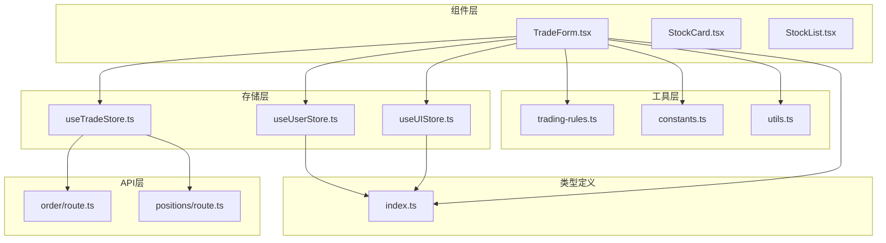
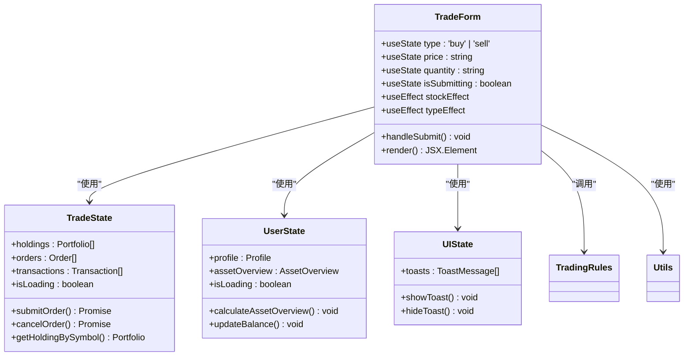
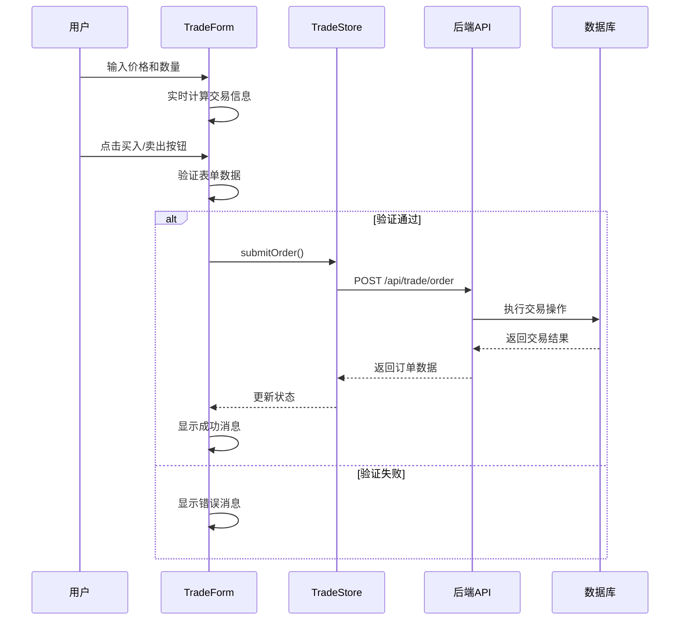
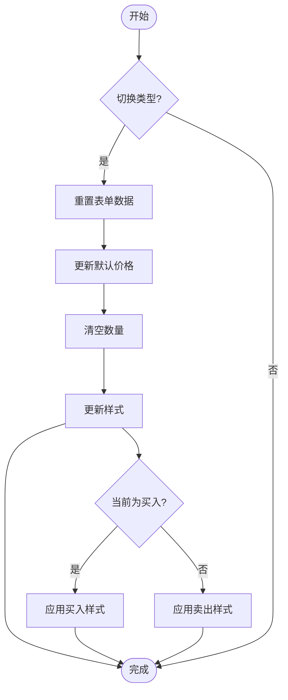
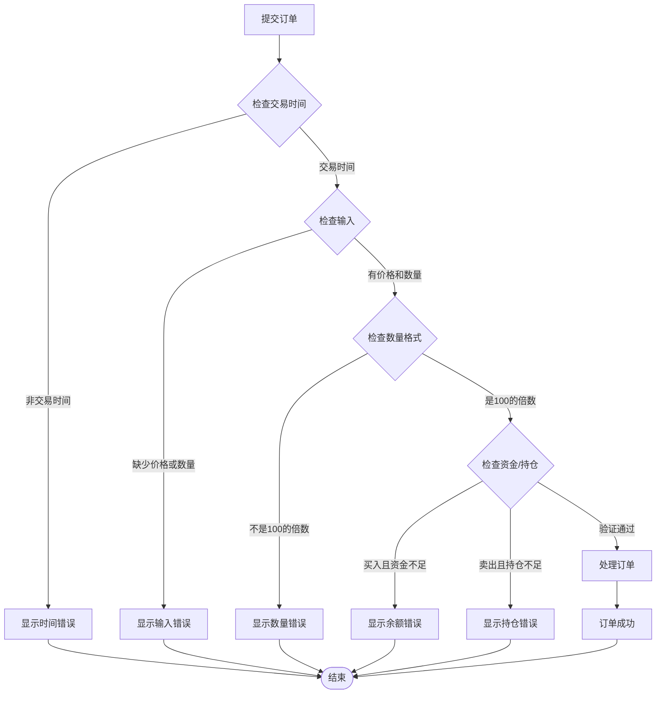
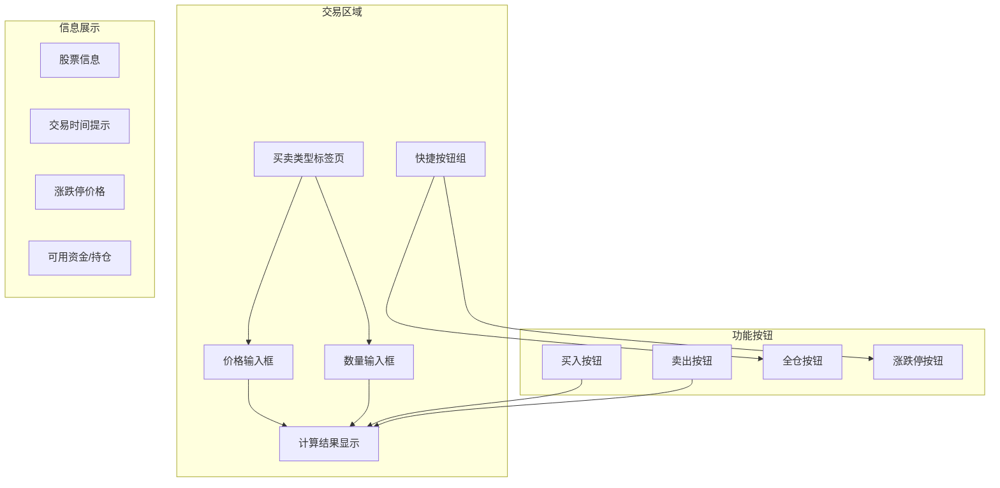
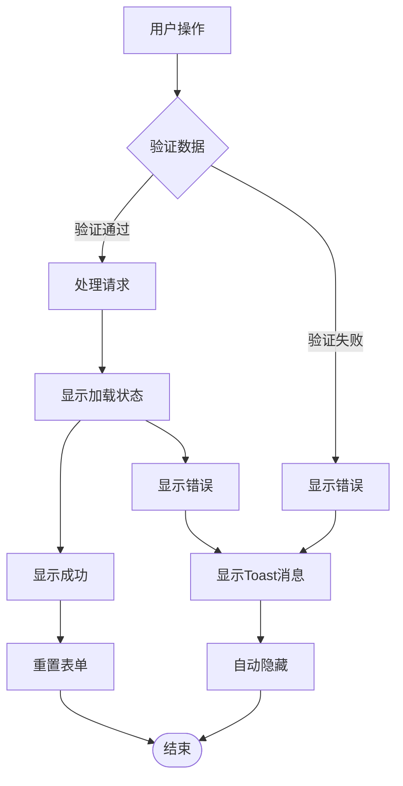
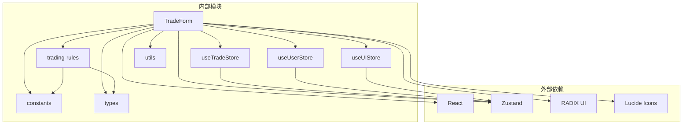

# 交易表单组件

<cite>
**本文档引用的文件**
- [TradeForm.tsx](file://components/trade/TradeForm.tsx)
- [useTradeStore.ts](file://stores/useTradeStore.ts)
- [useUserStore.ts](file://stores/useUserStore.ts)
- [useUIStore.ts](file://stores/useUIStore.ts)
- [trading-rules.ts](file://lib/trading-rules.ts)
- [constants.ts](file://lib/constants.ts)
- [utils.ts](file://lib/utils.ts)
- [index.ts](file://types/index.ts)
- [page.tsx](file://app/(dashboard)/page.tsx)
- [route.ts](file://app/api/trade/order/route.ts)
- [route.ts](file://app/api/trade/positions/route.ts)
- [button.tsx](file://components/ui/button.tsx)
- [tabs.tsx](file://components/ui/tabs.tsx)
</cite>

## 目录
1. [简介](#简介)
2. [项目结构](#项目结构)
3. [核心组件](#核心组件)
4. [架构概览](#架构概览)
5. [详细组件分析](#详细组件分析)
6. [依赖关系分析](#依赖关系分析)
7. [性能考虑](#性能考虑)
8. [故障排除指南](#故障排除指南)
9. [结论](#结论)
10. [附录](#附录)

## 简介

交易表单组件是虚拟股票交易系统的核心交互界面，为用户提供直观、安全的股票买卖功能。该组件实现了完整的交易流程，包括买卖类型切换、实时计算、表单验证、错误处理和用户体验优化等功能。

本组件采用React Hooks和Zustand状态管理，结合TypeScript类型系统，确保了代码的类型安全性和可维护性。通过与后端API的集成，实现了真实的交易功能，包括资金管理、持仓更新和交易历史记录。

## 项目结构

交易表单组件位于`components/trade/`目录下，采用模块化设计，与其他组件和存储层保持清晰的边界：



**图表来源**
- [TradeForm.tsx:1-300](file://components/trade/TradeForm.tsx#L1-L300)
- [useTradeStore.ts:1-192](file://stores/useTradeStore.ts#L1-L192)
- [trading-rules.ts:1-272](file://lib/trading-rules.ts#L1-L272)

**章节来源**
- [TradeForm.tsx:1-300](file://components/trade/TradeForm.tsx#L1-L300)
- [page.tsx:1-99](file://app/(dashboard)/page.tsx#L1-L99)

## 核心组件

### 组件架构设计

交易表单组件采用函数式组件设计，使用React Hooks管理状态和生命周期：



**图表来源**
- [TradeForm.tsx:33-299](file://components/trade/TradeForm.tsx#L33-L299)
- [useTradeStore.ts:6-25](file://stores/useTradeStore.ts#L6-L25)
- [useUserStore.ts:5-13](file://stores/useUserStore.ts#L5-L13)
- [useUIStore.ts:5-18](file://stores/useUIStore.ts#L5-L18)

### Props接口定义

组件接受以下属性：

| 属性名 | 类型 | 必需 | 默认值 | 描述 |
|--------|------|------|--------|------|
| stock | Stock | 否 | undefined | 股票对象，包含股票基本信息 |
| defaultType | 'buy' \| 'sell' | 否 | 'buy' | 默认交易类型 |

**章节来源**
- [TradeForm.tsx:28-31](file://components/trade/TradeForm.tsx#L28-L31)
- [index.ts:11-25](file://types/index.ts#L11-L25)

## 架构概览

交易表单组件采用分层架构设计，各层职责明确：



**图表来源**
- [TradeForm.tsx:91-134](file://components/trade/TradeForm.tsx#L91-L134)
- [useTradeStore.ts:99-121](file://stores/useTradeStore.ts#L99-L121)
- [route.ts:11-331](file://app/api/trade/order/route.ts#L11-L331)

## 详细组件分析

### 买卖类型切换逻辑

组件实现了直观的买卖切换功能，具有以下特性：



**图表来源**
- [TradeForm.tsx:53-59](file://components/trade/TradeForm.tsx#L53-L59)
- [TradeForm.tsx:167-181](file://components/trade/TradeForm.tsx#L167-L181)

#### 样式动态变化

组件使用CSS类名动态绑定实现样式切换：
- 买入状态：红色主题样式
- 卖出状态：绿色主题样式
- 活跃状态：背景色和文字颜色反转

**章节来源**
- [TradeForm.tsx:169-180](file://components/trade/TradeForm.tsx#L169-L180)

### 表单验证机制

组件实现了多层次的表单验证：



**图表来源**
- [TradeForm.tsx:91-134](file://components/trade/TradeForm.tsx#L91-L134)
- [trading-rules.ts:170-201](file://lib/trading-rules.ts#L170-L201)
- [trading-rules.ts:211-247](file://lib/trading-rules.ts#L211-L247)

#### 价格有效性检查

- 涨跌停价格计算：基于前收盘价和股票类型
- 价格范围验证：确保价格在有效范围内
- 实时价格更新：根据当前股价动态调整

#### 数量合法性验证

- 最小交易单位：100股
- 整数倍验证：必须是100的整数倍
- 最大数量限制：买入时基于可用资金，卖出时基于持仓数量

#### 资金充足性计算

- 可用资金计算：基于资产概览中的可用余额
- 总费用计算：包含手续费和印花税
- 实时资金更新：交易完成后自动刷新

#### 持仓可用性判断

- 持仓查询：通过股票代码获取当前持仓
- 卖出验证：确保持仓数量大于等于卖出数量
- T+1规则支持：预留T+1交易规则实现

**章节来源**
- [TradeForm.tsx:83-115](file://components/trade/TradeForm.tsx#L83-L115)
- [trading-rules.ts:88-135](file://lib/trading-rules.ts#L88-L135)

### 实时计算功能

组件实现了多项实时计算功能：

```mermaid
flowchart TD
Input[用户输入] --> CalcAmount[计算成交金额]
CalcAmount --> CalcFee[计算手续费]
CalcFee --> CalcTotal[计算总费用]
CalcTotal --> UpdateDisplay[更新显示]
CalcAmount --> Amount[amount = price × quantity]
CalcFee --> Fee[fee = max(amount × rate, min_fee) + 印花税]
CalcTotal --> Total{交易类型}
Total --> |买入| BuyTotal[total = amount + fee]
Total --> |卖出| SellTotal[total = amount - fee]
UpdateDisplay --> ShowInfo[显示交易信息]
ShowInfo --> BuyColor[买入颜色样式]
ShowInfo --> SellColor[卖出颜色样式]
```

**图表来源**
- [TradeForm.tsx:78-81](file://components/trade/TradeForm.tsx#L78-L81)
- [trading-rules.ts:111-125](file://lib/trading-rules.ts#L111-L125)

#### 成交金额计算

- 基础金额：价格 × 数量
- 精度控制：保留两位小数

#### 手续费计算

- 佣金费率：默认0.025%
- 最低收费：5元
- 印花税：卖出时收取，0.05%

#### 总费用计算

- 买入：成交金额 + 手续费
- 卖出：成交金额 - 手续费

**章节来源**
- [trading-rules.ts:88-125](file://lib/trading-rules.ts#L88-L125)
- [constants.ts:6-13](file://lib/constants.ts#L6-L13)

### 用户界面设计

组件提供了丰富的用户交互功能：



**图表来源**
- [TradeForm.tsx:136-299](file://components/trade/TradeForm.tsx#L136-L299)

#### 价格快捷键设置

- 跌停价格：`getLowerLimitPrice(prevClose, symbol)`
- 涨停价格：`getUpperLimitPrice(prevClose, symbol)`
- 一键设置：点击按钮直接填充价格

#### 数量一键全仓

- 买入全仓：`maxBuyQuantity = availableBalance / price / 100 × 100`
- 卖出全仓：使用当前持仓数量
- 100股递增：确保数量符合交易单位

#### 涨跌停价格显示

- 实时计算：基于前收盘价和股票类型
- 颜色标识：涨停红色，跌停绿色
- 格式化显示：货币格式化

#### 交易时间提示

- 实时检查：`isTradingHour()`
- 时间提醒：非交易时间显示提示
- 下次开市：`getNextTradingTime()`

**章节来源**
- [TradeForm.tsx:159-164](file://components/trade/TradeForm.tsx#L159-L164)
- [TradeForm.tsx:200-235](file://components/trade/TradeForm.tsx#L200-L235)
- [TradeForm.tsx:240-259](file://components/trade/TradeForm.tsx#L240-L259)

### 错误处理和用户体验优化

组件实现了完善的错误处理和用户体验优化：



**图表来源**
- [TradeForm.tsx:91-134](file://components/trade/TradeForm.tsx#L91-L134)
- [useUIStore.ts:47-65](file://stores/useUIStore.ts#L47-L65)

#### 表单重置

- 类型切换：自动重置价格和数量
- 成功交易：清空数量输入框
- 错误处理：保持用户输入以便修正

#### 加载状态管理

- 提交按钮禁用：防止重复提交
- 加载指示器：提交过程中的视觉反馈
- 状态同步：与后端API状态保持一致

#### Toast消息提示

- 多种类型：成功、错误、信息、警告
- 自动隐藏：3秒后自动消失
- 持久化：用户手动关闭前持续显示

**章节来源**
- [TradeForm.tsx:37](file://components/trade/TradeForm.tsx#L37)
- [TradeForm.tsx:282-294](file://components/trade/TradeForm.tsx#L282-L294)
- [useUIStore.ts:47-65](file://stores/useUIStore.ts#L47-L65)

## 依赖关系分析

组件之间的依赖关系如下：



**图表来源**
- [TradeForm.tsx:1-26](file://components/trade/TradeForm.tsx#L1-L26)
- [useTradeStore.ts:1-5](file://stores/useTradeStore.ts#L1-L5)

### 组件耦合度分析

- **低耦合**：组件间通过接口通信，无直接依赖
- **高内聚**：所有交易逻辑集中在单一组件中
- **状态分离**：业务状态与UI状态分离管理

### 外部依赖管理

- **React生态**：使用最新版本的React和相关库
- **类型安全**：完整的TypeScript类型定义
- **样式系统**：Tailwind CSS + Radix UI组件

**章节来源**
- [TradeForm.tsx:10-17](file://components/trade/TradeForm.tsx#L10-L17)
- [useTradeStore.ts:1-4](file://stores/useTradeStore.ts#L1-L4)

## 性能考虑

### 渲染优化

- **条件渲染**：根据交易状态动态渲染不同内容
- **懒加载**：仅在有股票选择时渲染交易表单
- **防抖处理**：输入验证采用防抖策略

### 状态管理优化

- **局部状态**：仅管理组件内部状态
- **全局状态**：通过Zustand集中管理业务状态
- **缓存策略**：避免重复的API调用

### 计算优化

- **记忆化**：使用useMemo优化昂贵的计算
- **批量更新**：合并多个状态更新操作
- **异步处理**：将耗时操作放在后台线程

## 故障排除指南

### 常见问题及解决方案

#### 交易时间错误

**问题**：提示"非交易时间，无法下单"
**原因**：当前时间不在交易时间内
**解决**：等待下一个交易时间或检查系统时间

#### 资金不足错误

**问题**：提示"可用资金不足"
**原因**：计算的总费用超过可用余额
**解决**：
- 检查输入的数量和价格
- 确认可用余额是否正确
- 考虑手续费和印花税的影响

#### 持仓不足错误

**问题**：提示"持仓数量不足"
**原因**：卖出数量超过当前持仓
**解决**：
- 检查持仓列表中的数量
- 确认选择的股票是否正确
- 考虑T+1交易规则

#### 网络连接错误

**问题**：下单失败，提示网络错误
**原因**：API请求超时或服务器错误
**解决**：
- 检查网络连接状态
- 重试操作
- 查看浏览器开发者工具中的错误信息

**章节来源**
- [TradeForm.tsx:92-133](file://components/trade/TradeForm.tsx#L92-L133)
- [useTradeStore.ts:118-121](file://stores/useTradeStore.ts#L118-L121)

## 结论

交易表单组件是一个功能完整、设计合理的金融交易界面。它成功地将复杂的交易逻辑封装在简洁易用的界面中，为用户提供了流畅的交易体验。

组件的主要优势包括：

1. **完整的功能覆盖**：从价格设置到订单提交的全流程支持
2. **强大的验证机制**：多层验证确保交易的安全性
3. **优秀的用户体验**：实时计算、智能提示和友好的错误处理
4. **良好的架构设计**：清晰的分层结构和模块化设计

未来可以考虑的改进方向：
- 添加更多交易类型支持（市价单、止损单等）
- 增强移动端适配
- 添加交易历史和回放功能
- 优化性能表现

## 附录

### 组件使用示例

#### 基本使用

```typescript
// 在页面中使用
<TradeForm stock={selectedStock} defaultType="buy" />

// 作为对话框使用
<Dialog open={isOpen} onOpenChange={setIsOpen}>
  <DialogContent>
    <TradeForm stock={selectedStock} defaultType="sell" />
  </DialogContent>
</Dialog>
```

#### 集成指南

1. **安装依赖**：确保所有必要的依赖包已安装
2. **配置环境变量**：设置交易相关的环境变量
3. **初始化状态**：在应用启动时初始化相关状态
4. **处理回调**：监听订单状态变化并更新UI

#### 自定义扩展方法

1. **添加新的交易类型**：扩展订单类型枚举和验证逻辑
2. **自定义样式**：通过CSS变量定制组件外观
3. **扩展验证规则**：添加更多的业务规则验证
4. **集成第三方服务**：添加实时行情或其他金融服务

**章节来源**
- [page.tsx:84-95](file://app/(dashboard)/page.tsx#L84-L95)
- [TradeForm.tsx:33](file://components/trade/TradeForm.tsx#L33)