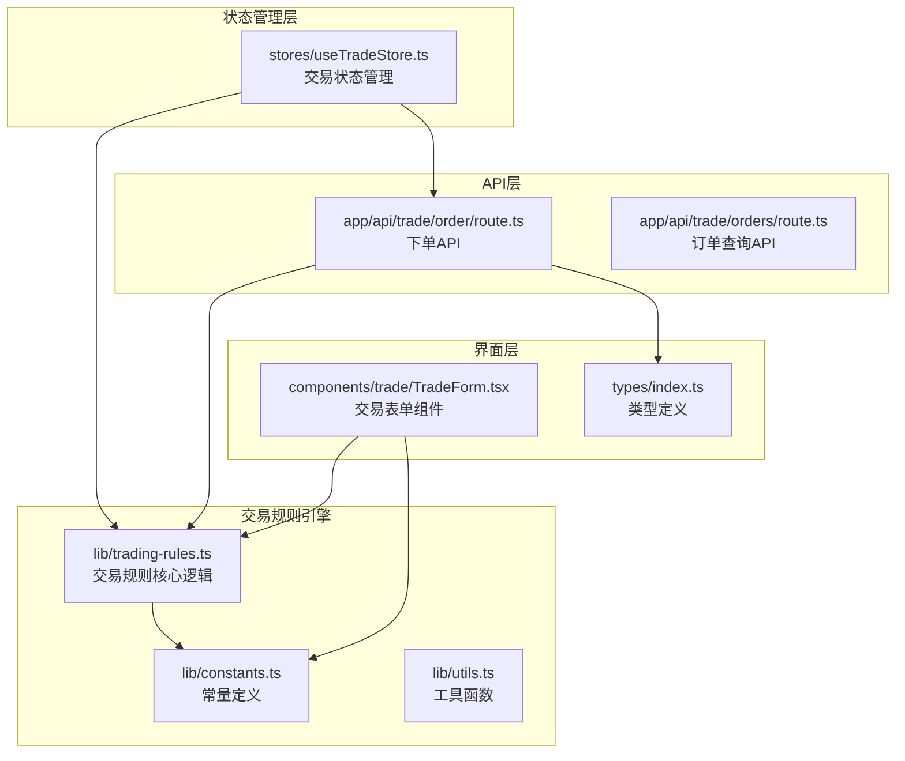
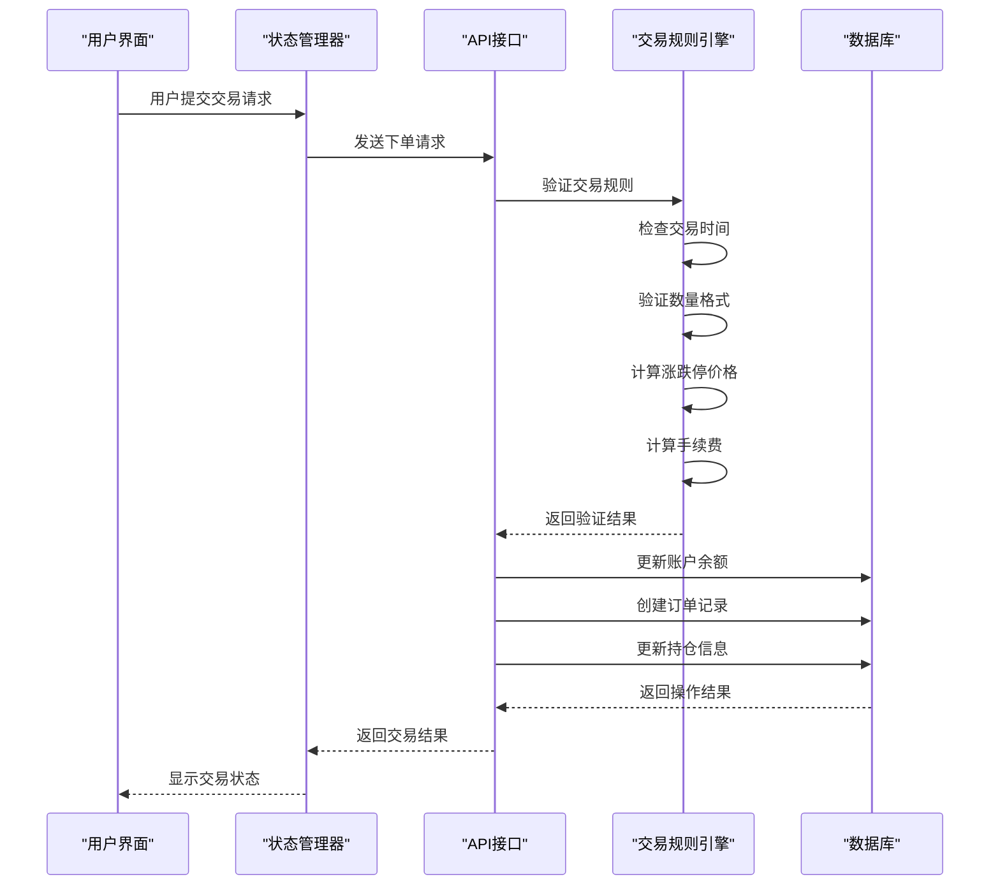
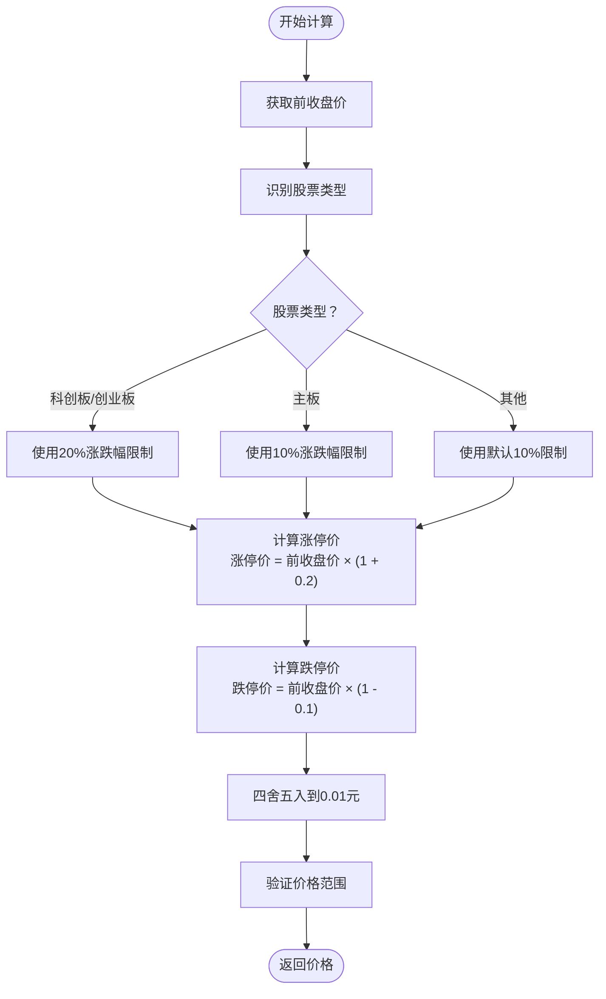
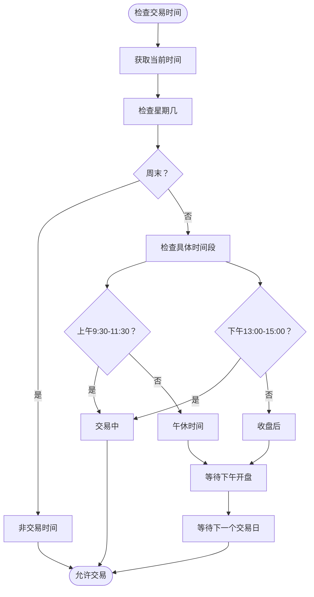
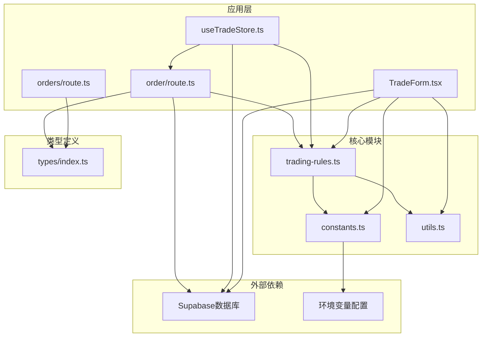

# 交易规则引擎

<cite>
**本文档引用的文件**
- [lib/trading-rules.ts](file://lib/trading-rules.ts)
- [lib/constants.ts](file://lib/constants.ts)
- [types/index.ts](file://types/index.ts)
- [app/api/trade/order/route.ts](file://app/api/trade/order/route.ts)
- [app/api/trade/orders/route.ts](file://app/api/trade/orders/route.ts)
- [stores/useTradeStore.ts](file://stores/useTradeStore.ts)
- [components/trade/TradeForm.tsx](file://components/trade/TradeForm.tsx)
- [lib/utils.ts](file://lib/utils.ts)
</cite>

## 目录
1. [简介](#简介)
2. [项目结构](#项目结构)
3. [核心组件](#核心组件)
4. [架构概览](#架构概览)
5. [详细组件分析](#详细组件分析)
6. [依赖关系分析](#依赖关系分析)
7. [性能考虑](#性能考虑)
8. [故障排除指南](#故障排除指南)
9. [结论](#结论)

## 简介

交易规则引擎是虚拟股票交易系统的核心模块，负责实现A股交易规则的完整逻辑。该引擎涵盖了涨跌停价格计算、手续费计算、交易时间控制、最小交易单位规则和价格精度控制等关键功能。系统采用前后端分离架构，前端使用Next.js构建用户界面，后端通过API接口提供交易服务，数据库使用Supabase进行数据存储。

## 项目结构

交易规则引擎位于项目的`lib`目录下，主要包含以下关键文件：

**图表来源**
- [lib/trading-rules.ts:1-272](file://lib/trading-rules.ts#L1-L272)
- [lib/constants.ts:1-101](file://lib/constants.ts#L1-L101)

**章节来源**
- [lib/trading-rules.ts:1-272](file://lib/trading-rules.ts#L1-L272)
- [lib/constants.ts:1-101](file://lib/constants.ts#L1-L101)

## 核心组件

交易规则引擎由四个核心组件构成：

### 1. 交易规则核心模块
- 涨跌停价格计算算法
- 手续费计算逻辑
- 交易时间控制系统
- 数量和价格验证规则

### 2. 常量配置模块
- 交易费率和费用标准
- 股票类型分类规则
- 交易时间配置
- 最小交易单位设置

### 3. API接口层
- 下单请求处理
- 订单状态管理
- 实时交易验证

### 4. 前端集成层
- 交易表单验证
- 实时价格显示
- 用户交互反馈

**章节来源**
- [lib/trading-rules.ts:1-272](file://lib/trading-rules.ts#L1-L272)
- [lib/constants.ts:1-101](file://lib/constants.ts#L1-L101)

## 架构概览

交易规则引擎采用分层架构设计，确保业务逻辑的清晰分离和可维护性：

**图表来源**
- [app/api/trade/order/route.ts:11-331](file://app/api/trade/order/route.ts#L11-L331)
- [stores/useTradeStore.ts:99-121](file://stores/useTradeStore.ts#L99-L121)

## 详细组件分析

### 涨跌停价格计算算法

涨跌停价格计算是交易规则引擎的核心功能之一，实现了A股市场的价格限制机制。

#### 算法实现原理

**图表来源**
- [lib/trading-rules.ts:62-86](file://lib/trading-rules.ts#L62-L86)
- [lib/constants.ts:61-68](file://lib/constants.ts#L61-L68)

#### 特殊股票类型处理

系统支持四种主要股票类型，每种类型具有不同的涨跌停限制：

| 股票类型 | 代码前缀 | 涨跌停限制 | 适用市场 |
|---------|----------|------------|----------|
| 主板 | 600*, 601*, 603*, 605* | 10% | 上海证券交易所 |
| 科创板 | 688* | 20% | 上海证券交易所 |
| 创业板 | 300*, 301* | 20% | 深圳证券交易所 |
| 北交所 | 43*, 83*, 87* | 10% | 北京证券交易所 |

**章节来源**
- [lib/trading-rules.ts:62-86](file://lib/trading-rules.ts#L62-L86)
- [lib/constants.ts:48-68](file://lib/constants.ts#L48-L68)

### 手续费计算逻辑

手续费计算遵循中国A股市场的标准收费规则，包含佣金和印花税两个部分。

#### 计算流程

**图表来源**
- [lib/trading-rules.ts:93-106](file://lib/trading-rules.ts#L93-L106)

#### 费用结构详解

| 费用类型 | 计算公式 | 最低收费 | 适用场景 |
|---------|----------|----------|----------|
| 佣金 | max(交易金额 × 0.00025, 5元) | 5元 | 买入和卖出双向收取 |
| 印花税 | 交易金额 × 0.0005 | 无最低限制 | 卖出时单边收取 |

**章节来源**
- [lib/trading-rules.ts:93-106](file://lib/trading-rules.ts#L93-L106)
- [lib/constants.ts:6-13](file://lib/constants.ts#L6-L13)

### 交易时间控制系统

交易时间控制确保所有交易都在规定的交易时间内进行，模拟真实的A股市场交易时间。

#### 交易时间规则

**图表来源**
- [lib/trading-rules.ts:7-24](file://lib/trading-rules.ts#L7-L24)

#### 时间控制配置

| 时间段 | 开始时间 | 结束时间 | 状态 |
|-------|----------|----------|------|
| 周一至周五 | 9:30 | 11:30 | 上午交易时段 |
| 周一至周五 | 13:00 | 15:00 | 下午交易时段 |
| 周六、周日 | - | - | 休市时间 |

**章节来源**
- [lib/trading-rules.ts:7-24](file://lib/trading-rules.ts#L7-L24)
- [lib/constants.ts:22-27](file://lib/constants.ts#L22-L27)

### 最小交易单位规则

最小交易单位规则确保所有交易数量都是100股的整数倍，符合A股市场的"手"的概念。

#### 数量验证逻辑

**图表来源**
- [lib/trading-rules.ts:130-135](file://lib/trading-rules.ts#L130-L135)

#### 数量格式化

系统提供数量格式化功能，将股数转换为"手"的表达方式：
- 100股 = 1手
- 200股 = 2手
- 1500股 = 15手

**章节来源**
- [lib/trading-rules.ts:130-143](file://lib/trading-rules.ts#L130-L143)
- [lib/constants.ts:15-16](file://lib/constants.ts#L15-L16)

### 价格精度控制

价格精度控制确保所有价格都精确到0.01元，符合人民币最小面额的限制。

#### 精度控制机制

**图表来源**
- [lib/trading-rules.ts:62-86](file://lib/trading-rules.ts#L62-L86)

#### 边界条件处理

系统在价格计算中处理多种边界情况：
- 涨停价计算：`Math.round(prevClose * (1 + limitPercent) * 100) / 100`
- 跌停价计算：`Math.round(prevClose * (1 - limitPercent) * 100) / 100`
- 手续费计算：`Math.round(fee * 100) / 100`
- 总成本计算：`Math.round(total * 100) / 100`

**章节来源**
- [lib/trading-rules.ts:62-125](file://lib/trading-rules.ts#L62-L125)

### 订单验证系统

订单验证系统综合了所有交易规则，确保每笔交易都符合A股市场的规定。

#### 买入订单验证流程

**图表来源**
- [lib/trading-rules.ts:170-201](file://lib/trading-rules.ts#L170-L201)

#### 卖出订单验证流程

**图表来源**
- [lib/trading-rules.ts:211-247](file://lib/trading-rules.ts#L211-L247)

**章节来源**
- [lib/trading-rules.ts:170-247](file://lib/trading-rules.ts#L170-L247)

## 依赖关系分析

交易规则引擎的依赖关系体现了清晰的分层架构：

**图表来源**
- [lib/trading-rules.ts:1-272](file://lib/trading-rules.ts#L1-L272)
- [lib/constants.ts:1-101](file://lib/constants.ts#L1-L101)

**章节来源**
- [lib/trading-rules.ts:1-272](file://lib/trading-rules.ts#L1-L272)
- [lib/constants.ts:1-101](file://lib/constants.ts#L1-L101)

## 性能考虑

交易规则引擎在设计时充分考虑了性能优化：

### 1. 算法复杂度分析
- **时间复杂度**：所有核心算法均为O(1)，包括价格计算、费用计算、数量验证等
- **空间复杂度**：O(1)，不依赖于输入规模的额外内存分配

### 2. 缓存策略
- 股票类型识别结果可缓存，避免重复的正则表达式匹配
- 常量值直接从配置对象读取，减少重复计算

### 3. 内存优化
- 使用`Math.round()`进行数值舍入，避免浮点数精度问题
- 统一的价格精度控制，减少重复的舍入操作

### 4. 并发处理
- API接口支持并发请求处理
- 状态管理器提供异步操作支持

## 故障排除指南

### 常见问题及解决方案

#### 1. 交易时间相关错误
**问题**：提示"非交易时间，无法下单"
**原因**：当前时间不在9:30-11:30或13:00-15:00范围内
**解决**：等待到下一个交易时间再进行交易

#### 2. 数量格式错误
**问题**：提示"交易数量必须是100股的整数倍"
**原因**：输入的数量不是100的倍数
**解决**：调整数量为100、200、300等的倍数

#### 3. 价格超出限制
**问题**：提示委托价格必须在涨跌停范围内
**原因**：输入价格超出了计算的涨跌停价格
**解决**：使用涨停价或跌停价作为参考价格

#### 4. 资金不足
**问题**：提示可用资金不足
**原因**：账户余额小于总交易成本
**解决**：检查账户余额或减少交易数量

**章节来源**
- [lib/trading-rules.ts:170-247](file://lib/trading-rules.ts#L170-L247)

### 调试建议

1. **启用开发模式**：在开发环境中查看详细的错误信息
2. **检查网络连接**：确保API接口正常访问
3. **验证数据格式**：确认传入的数据类型和格式正确
4. **监控交易时间**：使用`getNextTradingTime()`获取准确的交易时间提示

## 结论

交易规则引擎成功实现了A股市场的核心交易规则，包括：

1. **完整的涨跌停价格计算**：支持主板和科创板/创业板的不同涨跌幅限制
2. **标准化的手续费计算**：符合中国A股市场的收费规则
3. **严格的交易时间控制**：模拟真实的交易时段和休市时间
4. **精确的数量和价格控制**：确保交易符合最小单位和精度要求

该引擎采用模块化设计，具有良好的可扩展性和可维护性，为虚拟股票交易系统提供了坚实的业务基础。通过合理的错误处理和用户反馈机制，确保了用户体验的流畅性和准确性。

未来可以考虑的功能增强包括：
- 更详细的T+1交易规则实现
- 更多的股票类型支持
- 实时交易监控和异常检测
- 更丰富的交易策略支持