# 交易规则引擎

<cite>
**本文档引用的文件**
- [lib/trading-rules.ts](file://lib/trading-rules.ts)
- [lib/constants.ts](file://lib/constants.ts)
- [lib/utils.ts](file://lib/utils.ts)
- [types/index.ts](file://types/index.ts)
- [app/api/trade/order/route.ts](file://app/api/trade/order/route.ts)
- [app/api/trade/orders/route.ts](file://app/api/trade/orders/route.ts)
- [stores/useTradeStore.ts](file://stores/useTradeStore.ts)
- [components/trade/TradeForm.tsx](file://components/trade/TradeForm.tsx)
- [app/api/cron/update-prices/route.ts](file://app/api/cron/update-prices/route.ts)
</cite>

## 更新摘要
**变更内容**
- 交易时间验证逻辑已从API层迁移到业务逻辑层，提升代码复用性和可测试性
- 新增forceNonTrading参数支持测试环境的强制下单功能
- T+1交易规则得到完善，canSellToday函数提供更精确的日期比较
- 交易时间控制系统得到优化，支持更灵活的时区处理
- 前端交易表单集成了非交易时间的二次确认机制

## 目录
1. [简介](#简介)
2. [项目结构](#项目结构)
3. [核心组件](#核心组件)
4. [架构概览](#架构概览)
5. [详细组件分析](#详细组件分析)
6. [依赖关系分析](#依赖关系分析)
7. [性能考虑](#性能考虑)
8. [故障排除指南](#故障排除指南)
9. [结论](#结论)

## 简介

交易规则引擎是虚拟股票交易系统的核心模块，负责实现A股交易规则的完整逻辑。该引擎涵盖了涨跌停价格计算、手续费计算、交易时间控制、最小交易单位规则和价格精度控制等关键功能。系统采用前后端分离架构，前端使用Next.js构建用户界面，后端通过API接口提供交易服务，数据库使用Supabase进行数据存储。

**更新** 交易规则引擎已完成重大架构升级：交易时间验证逻辑已从API层迁移到业务逻辑层，新增forceNonTrading参数支持测试环境，T+1交易规则得到完善，为系统的稳定性和可维护性提供了更强保障。

## 项目结构

交易规则引擎位于项目的`lib`目录下，主要包含以下关键文件：

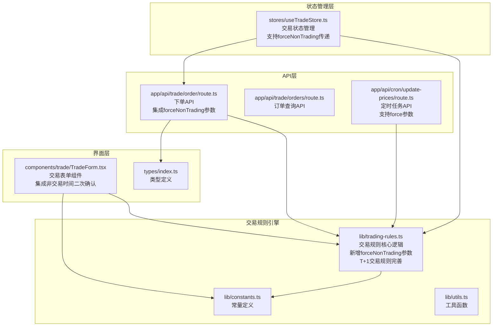

**图表来源**
- [lib/trading-rules.ts:1-283](file://lib/trading-rules.ts#L1-L283)
- [lib/constants.ts:1-101](file://lib/constants.ts#L1-L101)

**章节来源**
- [lib/trading-rules.ts:1-283](file://lib/trading-rules.ts#L1-L283)
- [lib/constants.ts:1-101](file://lib/constants.ts#L1-L101)

## 核心组件

交易规则引擎由四个核心组件构成：

### 1. 交易规则核心模块
- 涨跌停价格计算算法
- 手续费计算逻辑
- **新增** 交易时间验证逻辑（迁移自API层）
- **新增** forceNonTrading参数支持测试环境
- **完善** T+1交易规则（canSellToday函数）
- 交易时间控制系统
- 数量和价格验证规则

### 2. 常量配置模块
- 交易费率和费用标准
- 股票类型分类规则
- **改进** 交易时间配置（UTC+8时区）
- 最小交易单位设置

### 3. API接口层
- 下单请求处理
- 订单状态管理
- **新增** forceNonTrading参数验证
- 实时交易验证

### 4. 前端集成层
- 交易表单验证
- 实时价格显示
- **增强** 交易时间提示和用户反馈
- **新增** 非交易时间二次确认机制

**章节来源**
- [lib/trading-rules.ts:1-283](file://lib/trading-rules.ts#L1-L283)
- [lib/constants.ts:1-101](file://lib/constants.ts#L1-L101)

## 架构概览

交易规则引擎采用分层架构设计，确保业务逻辑的清晰分离和可维护性：

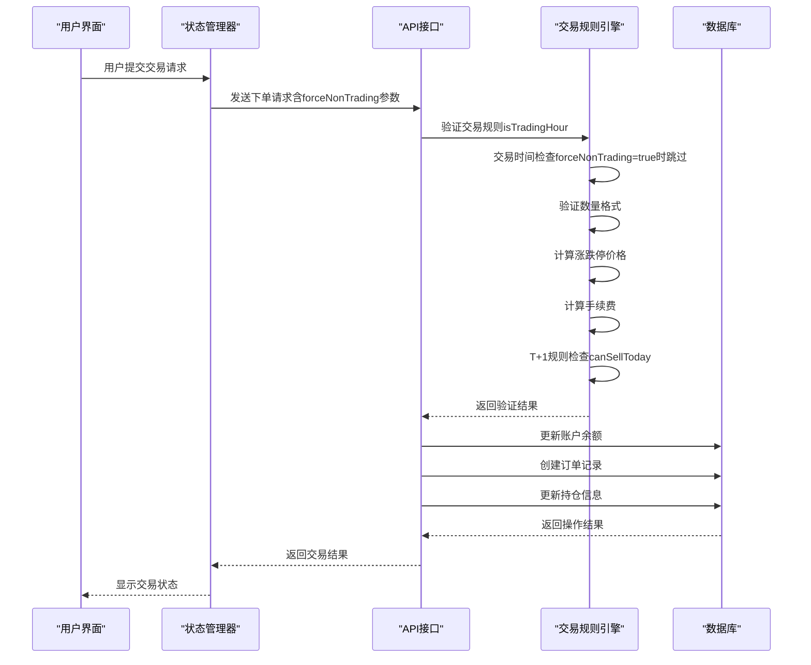

**图表来源**
- [app/api/trade/order/route.ts:28-95](file://app/api/trade/order/route.ts#L28-L95)
- [stores/useTradeStore.ts:100-122](file://stores/useTradeStore.ts#L100-L122)

## 详细组件分析

### 交易时间验证逻辑迁移

**更新** 交易时间验证逻辑已从API层完全迁移到业务逻辑层，提升了代码的复用性和可测试性。

#### 迁移后的交易时间验证流程

**图表来源**
- [lib/trading-rules.ts:24-37](file://lib/trading-rules.ts#L24-L37)

#### 交易时间验证函数详解

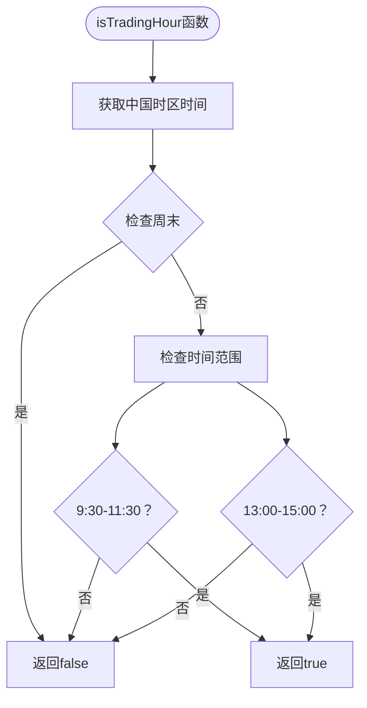

**图表来源**
- [lib/trading-rules.ts:24-37](file://lib/trading-rules.ts#L24-L37)

**章节来源**
- [lib/trading-rules.ts:24-37](file://lib/trading-rules.ts#L24-L37)

### forceNonTrading参数支持

**新增** 新增forceNonTrading参数，支持测试环境的强制下单功能。

#### 强制下单参数验证流程

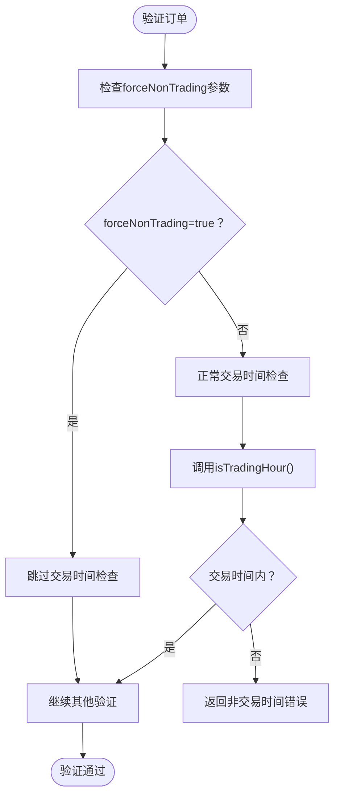

**图表来源**
- [lib/trading-rules.ts:187-190](file://lib/trading-rules.ts#L187-L190)
- [lib/trading-rules.ts:230-233](file://lib/trading-rules.ts#L230-L233)

#### API层集成forceNonTrading参数

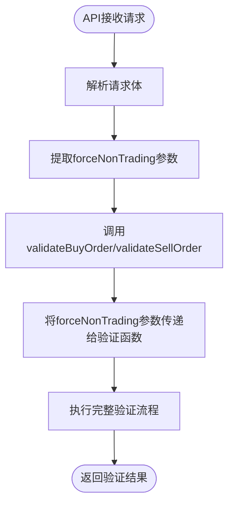

**图表来源**
- [app/api/trade/order/route.ts:28](file://app/api/trade/order/route.ts#L28)
- [app/api/trade/order/route.ts:88-95](file://app/api/trade/order/route.ts#L88-L95)
- [app/api/trade/order/route.ts:227-235](file://app/api/trade/order/route.ts#L227-L235)

**章节来源**
- [lib/trading-rules.ts:185-190](file://lib/trading-rules.ts#L185-L190)
- [lib/trading-rules.ts:228-233](file://lib/trading-rules.ts#L228-L233)
- [app/api/trade/order/route.ts:28](file://app/api/trade/order/route.ts#L28)
- [app/api/trade/order/route.ts:88-95](file://app/api/trade/order/route.ts#L88-L95)
- [app/api/trade/order/route.ts:227-235](file://app/api/trade/order/route.ts#L227-L235)

### T+1交易规则完善

**完善** T+1交易规则得到显著改进，canSellToday函数提供更精确的日期比较逻辑。

#### T+1规则检查流程

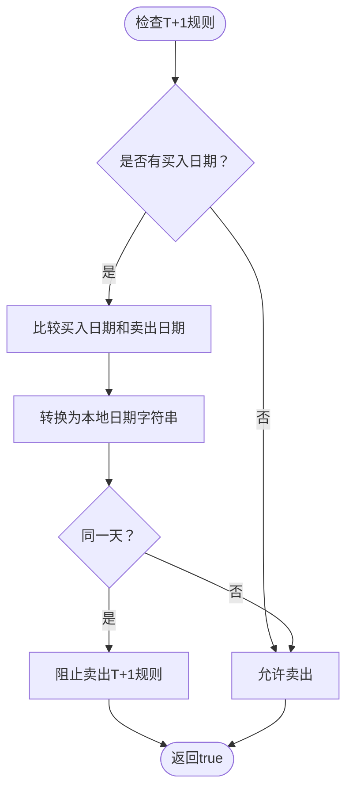

**图表来源**
- [lib/trading-rules.ts:159-169](file://lib/trading-rules.ts#L159-L169)

#### T+1规则验证函数实现

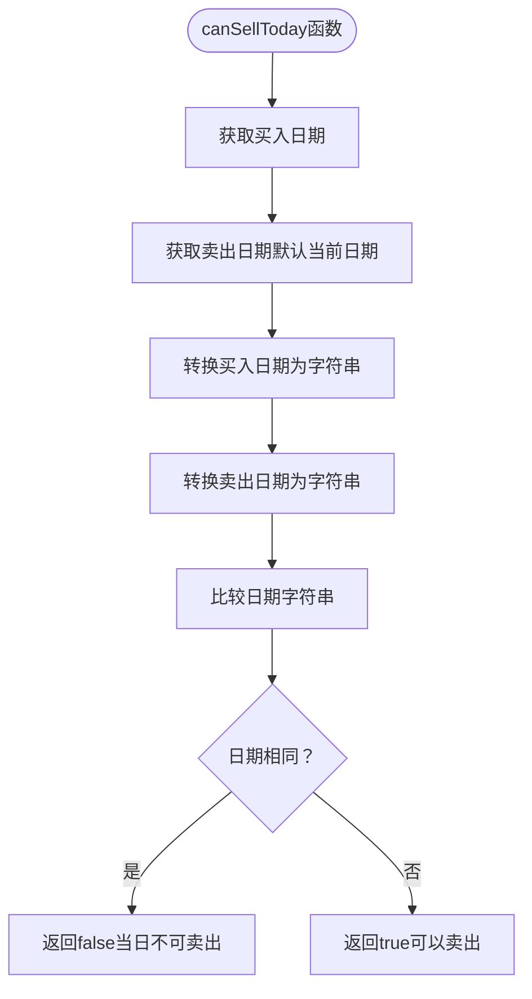

**图表来源**
- [lib/trading-rules.ts:159-169](file://lib/trading-rules.ts#L159-L169)

**章节来源**
- [lib/trading-rules.ts:159-169](file://lib/trading-rules.ts#L159-L169)

### 中国时区时间处理系统

**更新** 交易规则引擎现在包含完整的中国时区时间处理系统，确保所有交易时间验证都基于UTC+8时区。

#### getChinaTime函数实现

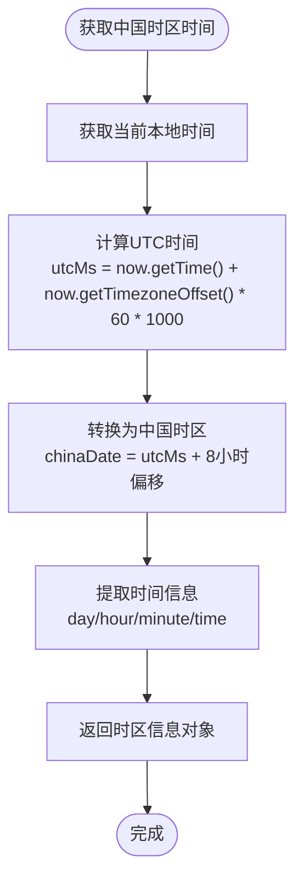

**图表来源**
- [lib/trading-rules.ts:6-18](file://lib/trading-rules.ts#L6-L18)

#### 时区转换算法详解

系统采用标准的UTC到本地时区转换算法：

1. **获取本地时间**：`const now = new Date()`
2. **计算UTC毫秒数**：`const utcMs = now.getTime() + now.getTimezoneOffset() * 60 * 1000`
3. **添加8小时偏移**：`const chinaDate = new Date(utcMs + 8 * 60 * 60 * 1000)`
4. **提取时区信息**：返回星期、小时、分钟和时间戳

#### 时区处理优势

- **跨时区兼容**：无论服务器部署在哪个时区，都能正确转换为北京时间
- **一致性保证**：所有交易时间验证都基于统一的UTC+8标准
- **部署灵活性**：无需担心服务器时区配置差异

**章节来源**
- [lib/trading-rules.ts:6-18](file://lib/trading-rules.ts#L6-L18)

### 交易时间控制系统

**更新** 交易时间控制现在基于getChinaTime函数提供的准确时区信息，确保跨时区部署的一致性。

#### 改进的交易时间验证流程

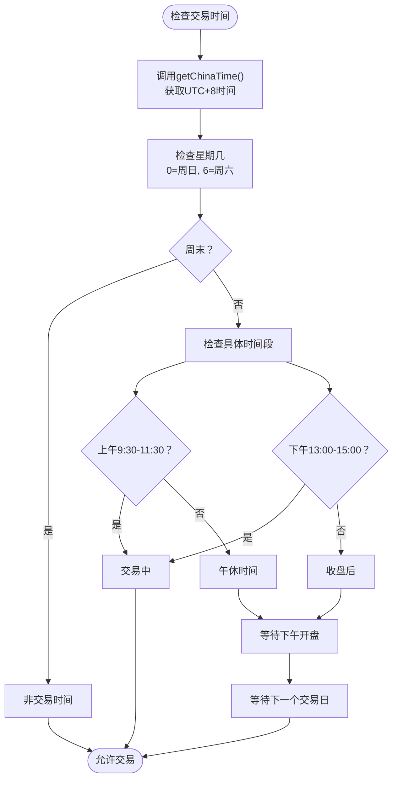

**图表来源**
- [lib/trading-rules.ts:24-37](file://lib/trading-rules.ts#L24-L37)

#### 改进的交易时间提示系统

**新增** getNextTradingTime函数提供更智能的交易时间提示：

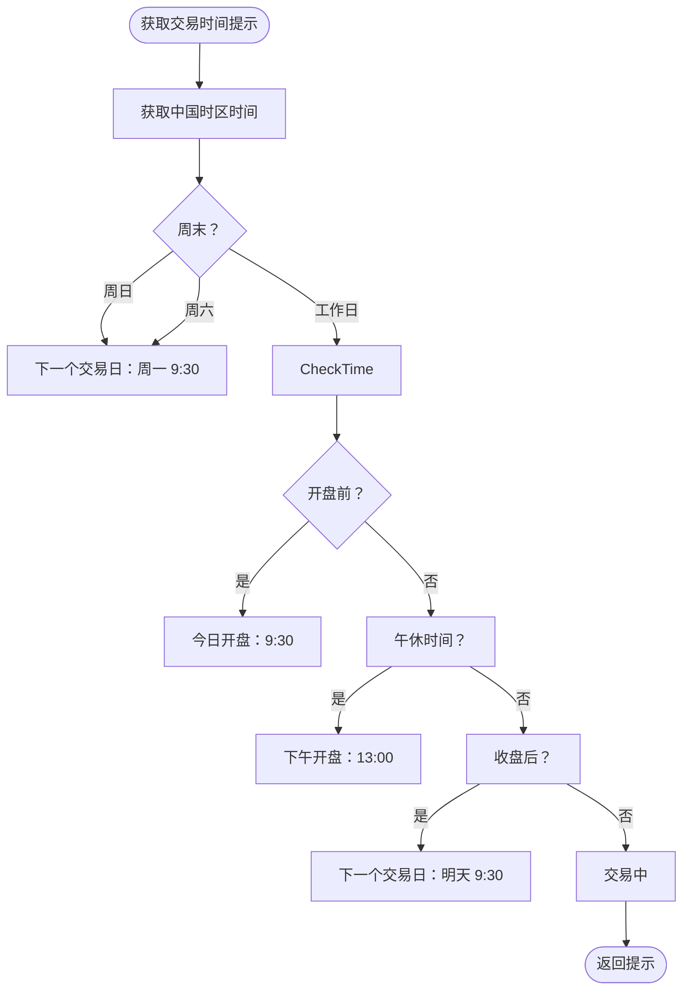

**图表来源**
- [lib/trading-rules.ts:42-66](file://lib/trading-rules.ts#L42-L66)

#### 交易时间配置

| 时间段 | 开始时间 | 结束时间 | 状态 | 时区说明 |
|-------|----------|----------|------|----------|
| 周一至周五 | 9:30 | 11:30 | 上午交易时段 | UTC+8 |
| 周一至周五 | 13:00 | 15:00 | 下午交易时段 | UTC+8 |
| 周六、周日 | - | - | 休市时间 | UTC+8 |

**章节来源**
- [lib/trading-rules.ts:24-66](file://lib/trading-rules.ts#L24-L66)
- [lib/constants.ts:22-27](file://lib/constants.ts#L22-L27)

### 涨跌停价格计算算法

涨跌停价格计算是交易规则引擎的核心功能之一，实现了A股市场的价格限制机制。

#### 算法实现原理

**图表来源**
- [lib/trading-rules.ts:71-95](file://lib/trading-rules.ts#L71-L95)
- [lib/constants.ts:61-68](file://lib/constants.ts#L61-L68)

#### 特殊股票类型处理

系统支持四种主要股票类型，每种类型具有不同的涨跌停限制：

| 股票类型 | 代码前缀 | 涨跌停限制 | 适用市场 |
|---------|----------|------------|----------|
| 主板 | 600*, 601*, 603*, 605* | 10% | 上海证券交易所 |
| 科创板 | 688* | 20% | 上海证券交易所 |
| 创业板 | 300*, 301* | 20% | 深圳证券交易所 |
| 北交所 | 43*, 83*, 87* | 10% | 北京证券交易所 |

**章节来源**
- [lib/trading-rules.ts:71-95](file://lib/trading-rules.ts#L71-L95)
- [lib/constants.ts:48-68](file://lib/constants.ts#L48-L68)

### 手续费计算逻辑

手续费计算遵循中国A股市场的标准收费规则，包含佣金和印花税两个部分。

#### 计算流程

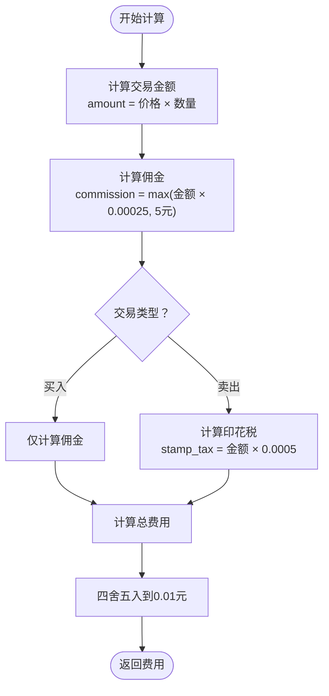

**图表来源**
- [lib/trading-rules.ts:102-115](file://lib/trading-rules.ts#L102-L115)

#### 费用结构详解

| 费用类型 | 计算公式 | 最低收费 | 适用场景 |
|---------|----------|----------|----------|
| 佣金 | max(交易金额 × 0.00025, 5元) | 5元 | 买入和卖出双向收取 |
| 印花税 | 交易金额 × 0.0005 | 无最低限制 | 卖出时单边收取 |

**章节来源**
- [lib/trading-rules.ts:102-115](file://lib/trading-rules.ts#L102-L115)
- [lib/constants.ts:6-13](file://lib/constants.ts#L6-L13)

### 最小交易单位规则

最小交易单位规则确保所有交易数量都是100股的整数倍，符合A股市场的"手"的概念。

#### 数量验证逻辑

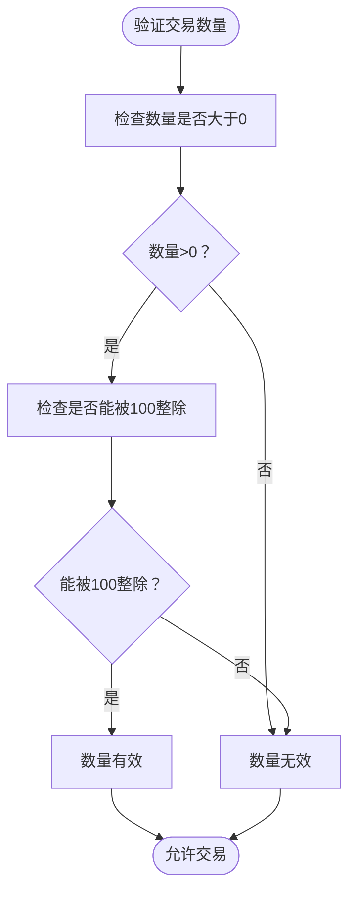

**图表来源**
- [lib/trading-rules.ts:139-144](file://lib/trading-rules.ts#L139-L144)

#### 数量格式化

系统提供数量格式化功能，将股数转换为"手"的表达方式：
- 100股 = 1手
- 200股 = 2手
- 1500股 = 15手

**章节来源**
- [lib/trading-rules.ts:139-152](file://lib/trading-rules.ts#L139-L152)
- [lib/constants.ts:15-16](file://lib/constants.ts#L15-L16)

### 价格精度控制

价格精度控制确保所有价格都精确到0.01元，符合人民币最小面额的限制。

#### 精度控制机制

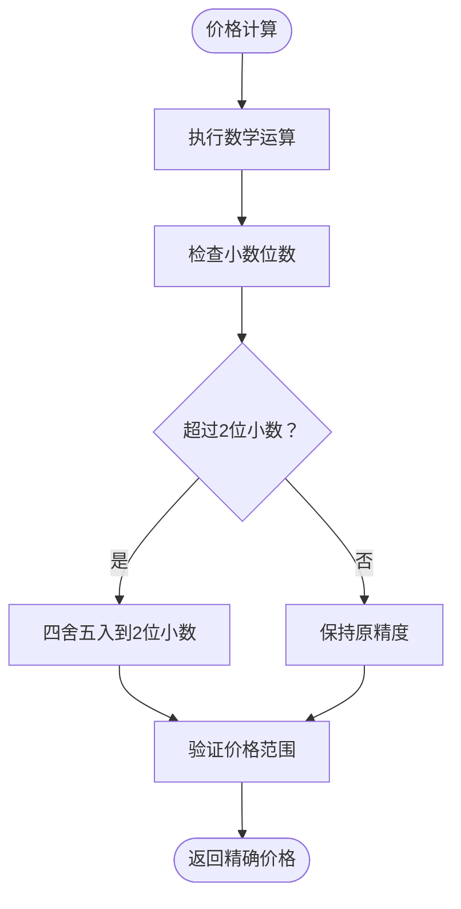

**图表来源**
- [lib/trading-rules.ts:71-95](file://lib/trading-rules.ts#L71-L95)

#### 边界条件处理

系统在价格计算中处理多种边界情况：
- 涨停价计算：`Math.round(prevClose * (1 + limitPercent) * 100) / 100`
- 跌停价计算：`Math.round(prevClose * (1 - limitPercent) * 100) / 100`
- 手续费计算：`Math.round(fee * 100) / 100`
- 总成本计算：`Math.round(total * 100) / 100`

**章节来源**
- [lib/trading-rules.ts:71-134](file://lib/trading-rules.ts#L71-L134)

### 订单验证系统

订单验证系统综合了所有交易规则，确保每笔交易都符合A股市场的规定。

#### 买入订单验证流程

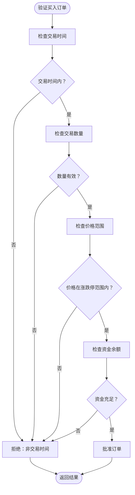

**图表来源**
- [lib/trading-rules.ts:179-210](file://lib/trading-rules.ts#L179-L210)

#### 卖出订单验证流程

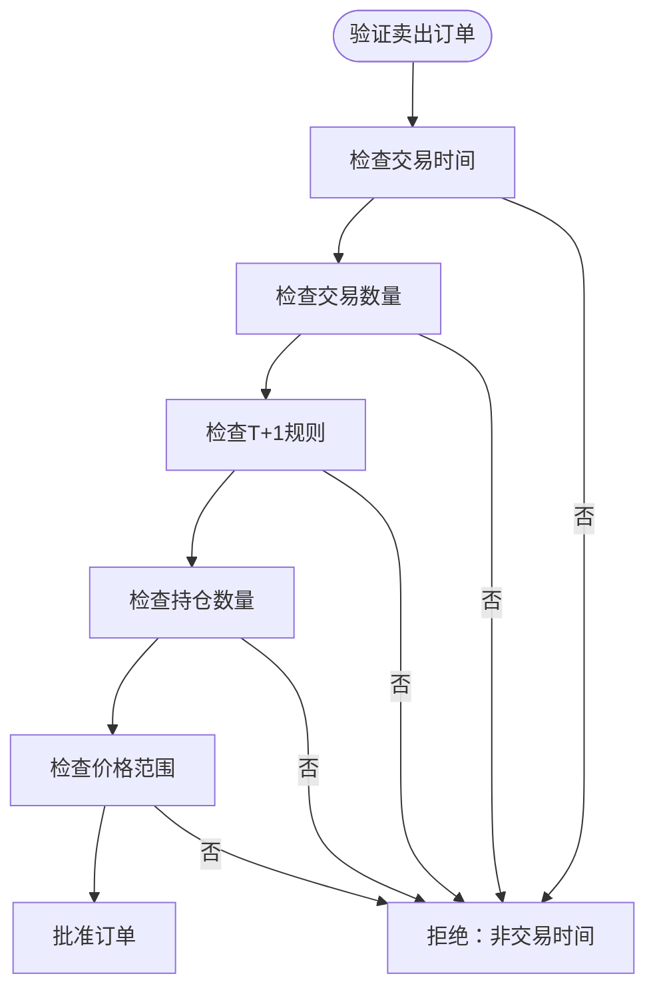

**图表来源**
- [lib/trading-rules.ts:221-258](file://lib/trading-rules.ts#L221-L258)

**章节来源**
- [lib/trading-rules.ts:179-258](file://lib/trading-rules.ts#L179-L258)

### 前端交易表单集成

**更新** 前端交易表单集成了非交易时间的二次确认机制，提升了用户体验。

#### 非交易时间二次确认流程

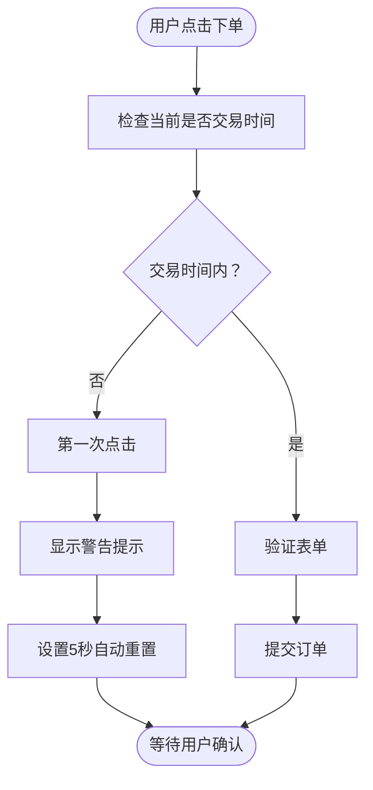

**图表来源**
- [components/trade/TradeForm.tsx:85-97](file://components/trade/TradeForm.tsx#L85-L97)

#### 前端强制下单参数传递

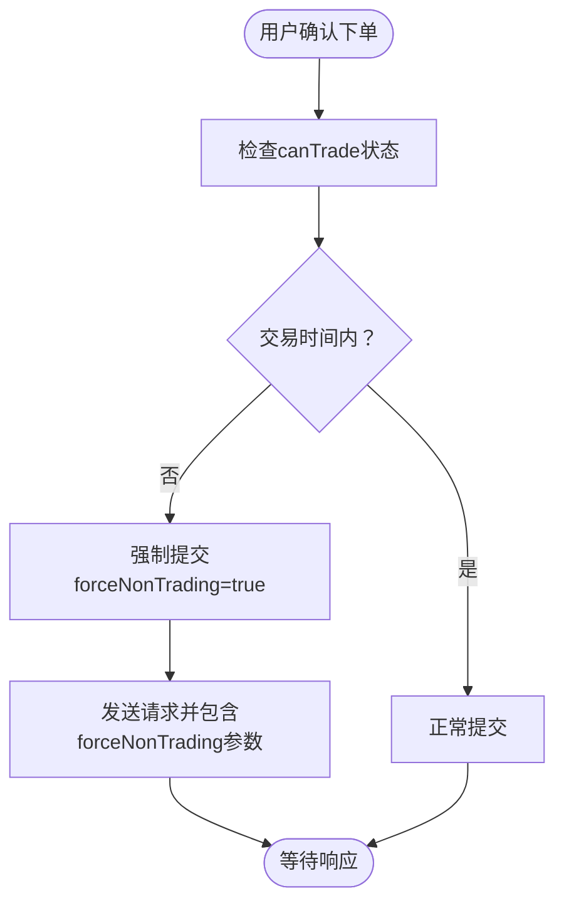

**图表来源**
- [components/trade/TradeForm.tsx:121-127](file://components/trade/TradeForm.tsx#L121-L127)

**章节来源**
- [components/trade/TradeForm.tsx:85-137](file://components/trade/TradeForm.tsx#L85-L137)

## 依赖关系分析

交易规则引擎的依赖关系体现了清晰的分层架构：

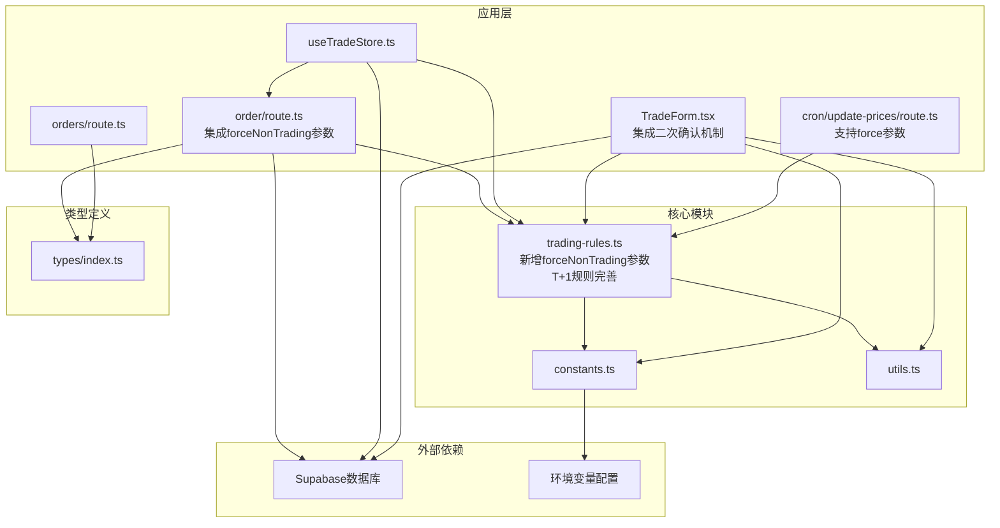

**图表来源**
- [lib/trading-rules.ts:1-283](file://lib/trading-rules.ts#L1-L283)
- [lib/constants.ts:1-101](file://lib/constants.ts#L1-L101)

**章节来源**
- [lib/trading-rules.ts:1-283](file://lib/trading-rules.ts#L1-L283)
- [lib/constants.ts:1-101](file://lib/constants.ts#L1-L101)

## 性能考虑

交易规则引擎在设计时充分考虑了性能优化：

### 1. 算法复杂度分析
- **时间复杂度**：所有核心算法均为O(1)，包括价格计算、费用计算、数量验证等
- **空间复杂度**：O(1)，不依赖于输入规模的额外内存分配

### 2. 缓存策略
- 股票类型识别结果可缓存，避免重复的正则表达式匹配
- 常量值直接从配置对象读取，减少重复计算
- **新增** 时区转换结果可缓存，避免重复的时区计算

### 3. 内存优化
- 使用`Math.round()`进行数值舍入，避免浮点数精度问题
- 统一的价格精度控制，减少重复的舍入操作
- **优化** 时区转换使用一次性计算，避免重复的Date对象创建

### 4. 并发处理
- API接口支持并发请求处理
- 状态管理器提供异步操作支持
- **改进** 交易时间检查支持高并发场景

### 5. **新增** 测试环境优化
- forceNonTrading参数支持测试环境的快速验证
- 避免了重复的交易时间检查，提升测试效率
- 支持批量测试场景下的强制下单

## 故障排除指南

### 常见问题及解决方案

#### 1. 交易时间相关错误
**问题**：提示"非交易时间，无法下单"
**原因**：当前时间不在9:30-11:30或13:00-15:00范围内
**解决**：等待到下一个交易时间再进行交易

#### 2. 数量格式错误
**问题**：提示"交易数量必须是100股的整数倍"
**原因**：输入的数量不是100的倍数
**解决**：调整数量为100、200、300等的倍数

#### 3. 价格超出限制
**问题**：提示委托价格必须在涨跌停范围内
**原因**：输入价格超出了计算的涨跌停价格
**解决**：使用涨停价或跌停价作为参考价格

#### 4. 资金不足
**问题**：提示可用资金不足
**原因**：账户余额小于总交易成本
**解决**：检查账户余额或减少交易数量

#### 5. **新增** T+1规则错误
**问题**：提示"A股实行T+1交易，当日买入的股票次日才能卖出"
**原因**：尝试在同一天内卖出刚买入的股票
**解决**：等待到下一个交易日再进行卖出操作

#### 6. **新增** 测试环境强制下单问题
**问题**：测试环境无法下单
**原因**：forceNonTrading参数未正确传递
**解决**：确保在测试环境中正确设置forceNonTrading=true

#### 7. **新增** 时区相关问题
**问题**：交易时间显示与预期不符
**原因**：服务器时区配置不正确
**解决**：系统自动使用getChinaTime函数进行时区转换，无需手动配置

**章节来源**
- [lib/trading-rules.ts:179-258](file://lib/trading-rules.ts#L179-L258)

### 调试建议

1. **启用开发模式**：在开发环境中查看详细的错误信息
2. **检查网络连接**：确保API接口正常访问
3. **验证数据格式**：确认传入的数据类型和格式正确
4. **监控交易时间**：使用`getNextTradingTime()`获取准确的交易时间提示
5. ****新增** 验证时区转换**：检查getChinaTime函数返回的时区信息是否正确
6. ****新增** 测试环境验证**：使用forceNonTrading参数进行测试环境的强制下单验证

## 结论

交易规则引擎成功实现了A股市场的核心交易规则，包括：

1. **完整的涨跌停价格计算**：支持主板和科创板/创业板的不同涨跌幅限制
2. **标准化的手续费计算**：符合中国A股市场的收费规则
3. ****更新** 严格的交易时间控制**：基于UTC+8时区的精确时间验证，支持跨时区部署
4. **精确的数量和价格控制**：确保交易符合最小单位和精度要求
5. ****新增** 完善的时区处理系统**：自动处理不同服务器时区的部署问题
6. ****新增** 强大的测试支持**：forceNonTrading参数为测试环境提供便利
7. ****完善** 的T+1交易规则**：canSellToday函数提供精确的日期比较

**更新** 本次重大架构改进的核心价值在于：

- **代码复用性提升**：交易时间验证逻辑从API层迁移到业务逻辑层，提高了代码的复用性和可测试性
- **测试环境友好**：forceNonTrading参数为测试环境提供了灵活的强制下单支持
- **规则完整性增强**：T+1交易规则得到完善，canSellToday函数提供更精确的日期比较
- **用户体验优化**：前端集成了非交易时间的二次确认机制，提升了用户交互体验

该引擎采用模块化设计，具有良好的可扩展性和可维护性，为虚拟股票交易系统提供了坚实的业务基础。通过合理的错误处理和用户反馈机制，确保了用户体验的流畅性和准确性。

未来可以考虑的功能增强包括：
- 更详细的T+1交易规则实现（基于数据库记录的精确买入时间）
- 更多的股票类型支持
- 实时交易监控和异常检测
- 更丰富的交易策略支持
- **新增** 时区配置的动态调整功能
- **新增** 交易规则的实时配置和热更新机制