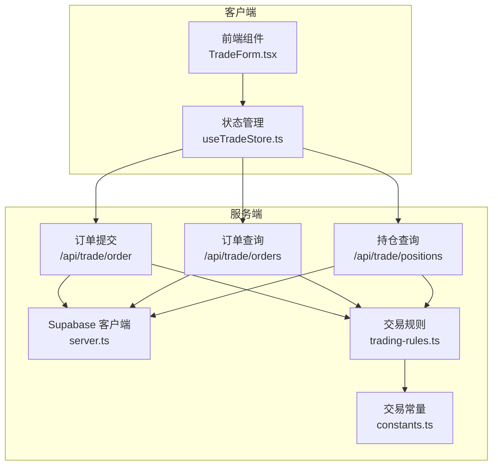
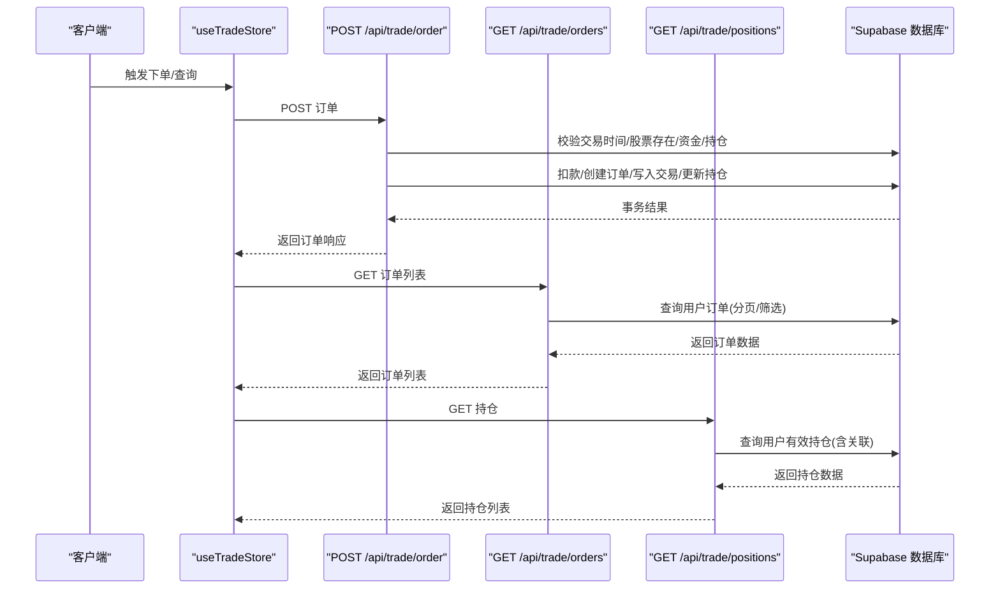
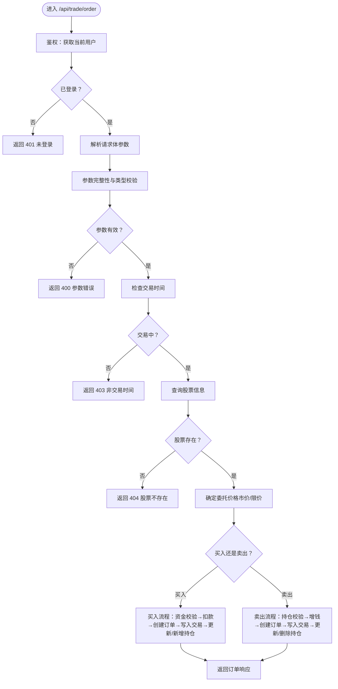
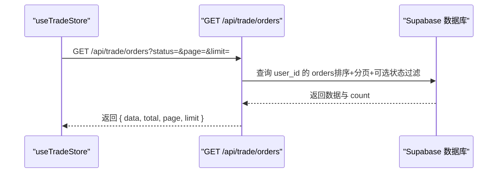
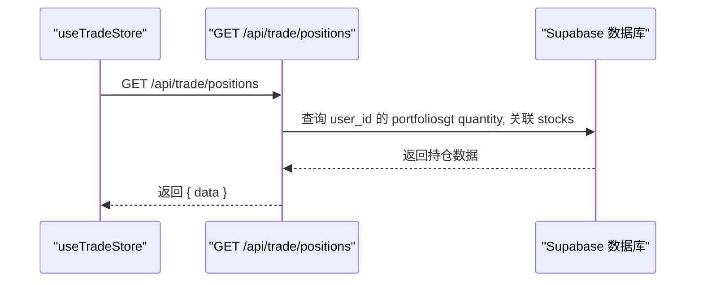
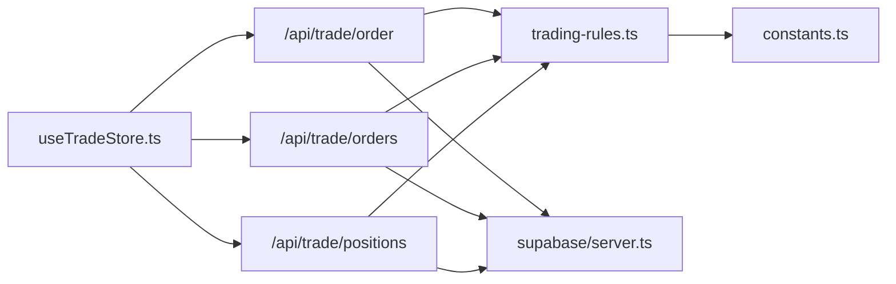

# 订单API接口

<cite>
**本文引用的文件**
- [app/api/trade/order/route.ts](file://app/api/trade/order/route.ts)
- [app/api/trade/orders/route.ts](file://app/api/trade/orders/route.ts)
- [app/api/trade/positions/route.ts](file://app/api/trade/positions/route.ts)
- [lib/trading-rules.ts](file://lib/trading-rules.ts)
- [lib/constants.ts](file://lib/constants.ts)
- [lib/supabase/server.ts](file://lib/supabase/server.ts)
- [lib/supabase/proxy.ts](file://lib/supabase/proxy.ts)
- [types/index.ts](file://types/index.ts)
- [stores/useTradeStore.ts](file://stores/useTradeStore.ts)
- [components/trade/TradeForm.tsx](file://components/trade/TradeForm.tsx)
- [docs/API接口规范.md](file://docs/API接口规范.md)
</cite>

## 目录
1. [简介](#简介)
2. [项目结构](#项目结构)
3. [核心组件](#核心组件)
4. [架构总览](#架构总览)
5. [详细组件分析](#详细组件分析)
6. [依赖关系分析](#依赖关系分析)
7. [性能考量](#性能考量)
8. [故障排查指南](#故障排查指南)
9. [结论](#结论)
10. [附录](#附录)

## 简介
本文件面向“订单API接口”的完整技术文档，涵盖以下内容：
- RESTful API 设计规范：HTTP 方法、URL 路径、状态码使用
- 订单提交接口：请求参数校验、业务规则检查、数据库事务处理、响应格式
- 订单查询接口：单个订单、批量订单、条件筛选、分页机制
- 持仓查询接口：可用持仓计算、成本均价更新、盈亏实时计算
- 安全机制：身份认证、权限检查、请求频率限制与防刷策略
- API 调用示例：curl 命令、JavaScript 代码、错误处理模式
- 版本管理、向后兼容性与迁移指南

## 项目结构
本项目采用 Next.js App Router，交易相关 API 位于 app/api/trade 下，核心逻辑集中在路由处理器中，业务规则与常量分别位于 lib 目录，前端通过 stores 与组件发起调用。

图表来源
- [app/api/trade/order/route.ts:1-331](file://app/api/trade/order/route.ts#L1-L331)
- [app/api/trade/orders/route.ts:1-66](file://app/api/trade/orders/route.ts#L1-L66)
- [app/api/trade/positions/route.ts:1-46](file://app/api/trade/positions/route.ts#L1-L46)
- [lib/trading-rules.ts:1-272](file://lib/trading-rules.ts#L1-L272)
- [lib/constants.ts:1-101](file://lib/constants.ts#L1-L101)
- [lib/supabase/server.ts:1-35](file://lib/supabase/server.ts#L1-L35)
- [stores/useTradeStore.ts:1-192](file://stores/useTradeStore.ts#L1-L192)
- [components/trade/TradeForm.tsx:1-234](file://components/trade/TradeForm.tsx#L1-L234)

章节来源
- [app/api/trade/order/route.ts:1-331](file://app/api/trade/order/route.ts#L1-L331)
- [app/api/trade/orders/route.ts:1-66](file://app/api/trade/orders/route.ts#L1-L66)
- [app/api/trade/positions/route.ts:1-46](file://app/api/trade/positions/route.ts#L1-L46)
- [lib/trading-rules.ts:1-272](file://lib/trading-rules.ts#L1-L272)
- [lib/constants.ts:1-101](file://lib/constants.ts#L1-L101)
- [lib/supabase/server.ts:1-35](file://lib/supabase/server.ts#L1-L35)
- [stores/useTradeStore.ts:1-192](file://stores/useTradeStore.ts#L1-L192)
- [components/trade/TradeForm.tsx:1-234](file://components/trade/TradeForm.tsx#L1-L234)

## 核心组件
- 订单提交接口：负责接收买入/卖出委托，执行交易规则校验、资金与持仓更新、生成订单与交易记录。
- 订单查询接口：支持按状态筛选、分页查询用户的委托记录。
- 持仓查询接口：返回用户当前有效持仓，包含成本均价、当前市值、盈亏等计算字段。
- 交易规则与常量：提供交易时间判断、涨跌停限制、手续费计算、数量单位等规则。
- Supabase 客户端：封装服务端客户端创建与会话同步，确保鉴权与数据库访问一致。

章节来源
- [app/api/trade/order/route.ts:1-331](file://app/api/trade/order/route.ts#L1-L331)
- [app/api/trade/orders/route.ts:1-66](file://app/api/trade/orders/route.ts#L1-L66)
- [app/api/trade/positions/route.ts:1-46](file://app/api/trade/positions/route.ts#L1-L46)
- [lib/trading-rules.ts:1-272](file://lib/trading-rules.ts#L1-L272)
- [lib/constants.ts:1-101](file://lib/constants.ts#L1-L101)
- [lib/supabase/server.ts:1-35](file://lib/supabase/server.ts#L1-L35)

## 架构总览
下图展示从客户端到服务端的调用链路与关键处理步骤：

图表来源
- [stores/useTradeStore.ts:99-121](file://stores/useTradeStore.ts#L99-L121)
- [app/api/trade/order/route.ts:11-331](file://app/api/trade/order/route.ts#L11-L331)
- [app/api/trade/orders/route.ts:5-66](file://app/api/trade/orders/route.ts#L5-L66)
- [app/api/trade/positions/route.ts:5-46](file://app/api/trade/positions/route.ts#L5-L46)

## 详细组件分析

### 订单提交接口（POST /api/trade/order）
- 功能概述
  - 仅允许已登录用户提交委托，支持买入/卖出两种类型。
  - 限价单与市价单：市价单按当前股价成交；限价单需满足涨跌停范围与交易时间。
  - 严格的资金与持仓校验，失败即回滚，成功后写入订单、交易与持仓记录。
- 请求参数
  - symbol：股票代码（必填）
  - type：交易类型 buy/sell（必填）
  - price：委托价格（市价单可传 0，后端按最新价成交）
  - quantity：委托数量（股，必须为 100 的整数倍）
  - orderType：limit/market（默认 limit）
- 业务规则
  - 交易时间：仅在 A 股交易时段内允许下单。
  - 数量单位：必须为 100 的整数倍。
  - 涨跌停限制：委托价格必须在涨跌停范围内。
  - 资金/持仓：买入需可用余额充足；卖出需持有足够数量。
- 数据库事务
  - 买入：扣减可用余额 → 创建订单 → 写入交易 → 更新/新增持仓（均价与数量）。
  - 卖出：增加可用余额 → 创建订单 → 写入交易 → 更新/删除持仓（清仓则删除记录）。
- 响应格式
  - 成功返回：order_id、symbol、type、price、quantity、filled_quantity、status、fee、created_at。
  - 失败返回：统一错误对象，包含错误信息与状态码。
- 安全与鉴权
  - 通过 Supabase Auth 获取当前用户，未登录返回 401。
  - 交易时间外返回 403。
  - 参数缺失/非法返回 400。
  - 数据库错误返回 500。

图表来源
- [app/api/trade/order/route.ts:11-331](file://app/api/trade/order/route.ts#L11-L331)
- [lib/trading-rules.ts:164-247](file://lib/trading-rules.ts#L164-L247)
- [lib/constants.ts:1-101](file://lib/constants.ts#L1-L101)

章节来源
- [app/api/trade/order/route.ts:1-331](file://app/api/trade/order/route.ts#L1-L331)
- [lib/trading-rules.ts:1-272](file://lib/trading-rules.ts#L1-L272)
- [lib/constants.ts:1-101](file://lib/constants.ts#L1-L101)
- [lib/supabase/server.ts:1-35](file://lib/supabase/server.ts#L1-L35)
- [types/index.ts:68-80](file://types/index.ts#L68-L80)

### 订单查询接口（GET /api/trade/orders）
- 功能概述
  - 返回当前用户的历史委托记录，支持按 status 筛选与分页。
- 查询参数
  - status：订单状态（filled/pending/cancelled）
  - page：页码（默认 1）
  - limit：每页数量（默认 20，最大 100）
- 响应结构
  - data：订单数组
  - total：总数
  - page、limit：当前页与每页数量
- 安全与鉴权
  - 未登录返回 401；数据库错误返回 500。

图表来源
- [app/api/trade/orders/route.ts:5-66](file://app/api/trade/orders/route.ts#L5-L66)
- [stores/useTradeStore.ts:68-84](file://stores/useTradeStore.ts#L68-L84)

章节来源
- [app/api/trade/orders/route.ts:1-66](file://app/api/trade/orders/route.ts#L1-L66)
- [stores/useTradeStore.ts:68-84](file://stores/useTradeStore.ts#L68-L84)
- [lib/constants.ts:70-79](file://lib/constants.ts#L70-L79)

### 持仓查询接口（GET /api/trade/positions）
- 功能概述
  - 返回用户当前有效持仓（quantity > 0），并关联股票信息。
  - 前端可基于返回数据计算市值、盈亏与盈亏百分比。
- 响应结构
  - data：持仓数组，包含 stock 关联字段
- 安全与鉴权
  - 未登录返回 401；数据库错误返回 500。

图表来源
- [app/api/trade/positions/route.ts:5-46](file://app/api/trade/positions/route.ts#L5-L46)
- [stores/useTradeStore.ts:33-66](file://stores/useTradeStore.ts#L33-L66)

章节来源
- [app/api/trade/positions/route.ts:1-46](file://app/api/trade/positions/route.ts#L1-L46)
- [stores/useTradeStore.ts:33-66](file://stores/useTradeStore.ts#L33-L66)

### 交易规则与常量
- 交易时间：A 股工作日 9:30-11:30、13:00-15:00。
- 涨跌停限制：主板 10%，科创板/创业板 20%。
- 手续费：佣金 ≥ max(交易金额×费率, 最低收费)，卖出另收印花税。
- 数量单位：1 手 = 100 股。
- 盈亏计算：利润 = (现价 - 成本均价) × 数量；百分比 = 利润 ÷ 成本 ÷ 数量 × 100。

章节来源
- [lib/trading-rules.ts:1-272](file://lib/trading-rules.ts#L1-L272)
- [lib/constants.ts:1-101](file://lib/constants.ts#L1-L101)

### 安全机制
- 身份认证
  - 所有需要用户身份的接口均通过 Supabase Auth 的 JWT Token 鉴权。
  - 服务端通过 createClient 获取当前用户，未登录统一返回 401。
- 权限检查
  - 仅允许查询/操作当前用户的数据（如 orders.user_id = 当前用户）。
- 请求频率限制与防刷
  - 代码中未发现显式的速率限制实现；建议在网关或边缘层引入限流策略（例如基于 IP/用户维度的令牌桶算法）。
- 会话同步
  - 代理中间件确保浏览器与服务端会话一致，避免随机登出问题。

章节来源
- [lib/supabase/server.ts:1-35](file://lib/supabase/server.ts#L1-L35)
- [lib/supabase/proxy.ts:1-77](file://lib/supabase/proxy.ts#L1-L77)
- [app/api/trade/order/route.ts:15-23](file://app/api/trade/order/route.ts#L15-L23)
- [app/api/trade/orders/route.ts:9-17](file://app/api/trade/orders/route.ts#L9-L17)
- [app/api/trade/positions/route.ts:9-17](file://app/api/trade/positions/route.ts#L9-L17)

### API 调用示例
- curl（提交订单）
  - 请将 <token> 替换为实际 JWT 令牌，将 <symbol>、<price>、<quantity> 替换为真实值。
  - 买入示例：curl -X POST https://your-domain/api/trade/order -H "Authorization: Bearer <token>" -H "Content-Type: application/json" -d '{"symbol":"<symbol>","type":"buy","price":<price>,"quantity":<quantity>}'
  - 卖出示例：curl -X POST https://your-domain/api/trade/order -H "Authorization: Bearer <token>" -H "Content-Type: application/json" -d '{"symbol":"<symbol>","type":"sell","price":<price>,"quantity":<quantity>}'
- JavaScript（fetch）
  - 参考状态管理中的提交与查询方法路径：
    - 提交订单：[submitOrder:99-121](file://stores/useTradeStore.ts#L99-L121)
    - 查询订单：[fetchOrders:68-84](file://stores/useTradeStore.ts#L68-L84)
    - 查询持仓：[fetchHoldings:33-66](file://stores/useTradeStore.ts#L33-L66)
- 错误处理模式
  - 读取响应 JSON 并根据 res.ok 判断；若非 2xx，读取 { error } 字段进行提示。
  - 参考：[submitOrder 错误分支:109-111](file://stores/useTradeStore.ts#L109-L111)

章节来源
- [stores/useTradeStore.ts:99-121](file://stores/useTradeStore.ts#L99-L121)
- [stores/useTradeStore.ts:68-84](file://stores/useTradeStore.ts#L68-L84)
- [stores/useTradeStore.ts:33-66](file://stores/useTradeStore.ts#L33-L66)

### API 版本管理、兼容性与迁移
- 版本策略
  - Base URL 为 /api，可在路径中加入版本号，如 /api/v1/trade/order。
- 向后兼容
  - 新增字段以可选形式返回，避免破坏既有客户端。
  - 对于字段重命名或删除，保留旧字段一段时间并标注废弃。
- 迁移指南
  - 在文档中明确变更点与过渡期；对客户端发出兼容性提示。
  - 参考现有接口规范文档的版本记录与错误码规范。

章节来源
- [docs/API接口规范.md:1-16](file://docs/API接口规范.md#L1-L16)

## 依赖关系分析
- 组件耦合
  - 路由处理器强依赖 trading-rules 与 constants，用于业务规则与参数校验。
  - 前端通过 useTradeStore 统一发起请求，减少重复逻辑。
- 外部依赖
  - Supabase：鉴权与数据库访问。
  - 浏览器/Node 环境：Next.js App Router 与 fetch。
- 潜在循环依赖
  - 未见直接循环导入；路由与工具函数解耦良好。

图表来源
- [app/api/trade/order/route.ts:1-331](file://app/api/trade/order/route.ts#L1-L331)
- [app/api/trade/orders/route.ts:1-66](file://app/api/trade/orders/route.ts#L1-L66)
- [app/api/trade/positions/route.ts:1-46](file://app/api/trade/positions/route.ts#L1-L46)
- [lib/trading-rules.ts:1-272](file://lib/trading-rules.ts#L1-L272)
- [lib/constants.ts:1-101](file://lib/constants.ts#L1-L101)
- [lib/supabase/server.ts:1-35](file://lib/supabase/server.ts#L1-L35)
- [stores/useTradeStore.ts:1-192](file://stores/useTradeStore.ts#L1-L192)

章节来源
- [app/api/trade/order/route.ts:1-331](file://app/api/trade/order/route.ts#L1-L331)
- [app/api/trade/orders/route.ts:1-66](file://app/api/trade/orders/route.ts#L1-L66)
- [app/api/trade/positions/route.ts:1-46](file://app/api/trade/positions/route.ts#L1-L46)
- [lib/trading-rules.ts:1-272](file://lib/trading-rules.ts#L1-L272)
- [lib/constants.ts:1-101](file://lib/constants.ts#L1-L101)
- [lib/supabase/server.ts:1-35](file://lib/supabase/server.ts#L1-L35)
- [stores/useTradeStore.ts:1-192](file://stores/useTradeStore.ts#L1-L192)

## 性能考量
- 数据库查询优化
  - 订单与持仓查询均按 user_id 过滤并建立索引，避免全表扫描。
  - 分页使用 range(offset, offset+limit-1)，注意 limit 最大值控制。
- 事务与一致性
  - 买入/卖出涉及多步写入，建议在同一事务中完成，保证资金、订单、交易、持仓的一致性。
- 前端缓存与订阅
  - 前端通过 Supabase Realtime 订阅 portfolios 与 orders 表变化，减少轮询开销。
- 交易规则预计算
  - 前端 TradeForm 中提前计算涨跌停与手续费，降低后端压力。

## 故障排查指南
- 常见错误与定位
  - 401 未登录：检查 Authorization 头与 Supabase 会话是否正确传递。
  - 403 非交易时间：确认 isTradingHour 逻辑与当前时区设置。
  - 400 参数错误：核对 symbol/type/price/quantity 是否符合规则。
  - 404 股票不存在：确认 stocks 表中是否存在该 symbol。
  - 500 服务器错误：查看后端日志，关注数据库写入异常。
- 建议排查步骤
  - 使用 curl 直接调用接口，排除前端状态管理问题。
  - 检查 Supabase 数据库中 profiles/portfolios/orders/transactions 表数据是否一致。
  - 在交易时间前后分别测试，确认 isTradingHour 返回值。

章节来源
- [app/api/trade/order/route.ts:18-23](file://app/api/trade/order/route.ts#L18-L23)
- [app/api/trade/order/route.ts:44-49](file://app/api/trade/order/route.ts#L44-L49)
- [app/api/trade/order/route.ts:58-63](file://app/api/trade/order/route.ts#L58-L63)
- [app/api/trade/orders/route.ts:12-17](file://app/api/trade/orders/route.ts#L12-L17)
- [app/api/trade/positions/route.ts:12-17](file://app/api/trade/positions/route.ts#L12-L17)

## 结论
本订单API接口遵循 RESTful 设计，结合交易规则与数据库事务，实现了从下单到持仓更新的闭环。通过 Supabase 实现实时订阅与鉴权，前端以状态管理统一调度，整体具备良好的扩展性与可维护性。建议后续完善速率限制与更细粒度的错误码，持续演进版本管理与兼容策略。

## 附录
- API 接口规范参考
  - [API 接口规范.md:261-304](file://docs/API接口规范.md#L261-L304)（订单提交）
  - [API 接口规范.md:307-334](file://docs/API接口规范.md#L307-L334)（持仓查询）
  - [API 接口规范.md:338-377](file://docs/API接口规范.md#L338-L377)（订单查询）
  - [API 接口规范.md:567-577](file://docs/API接口规范.md#L567-L577)（错误码规范）