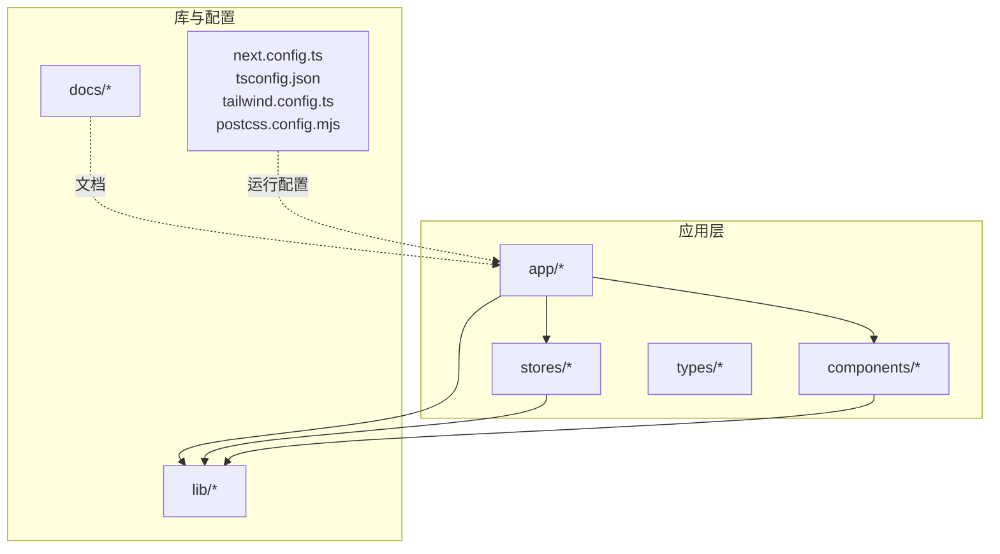
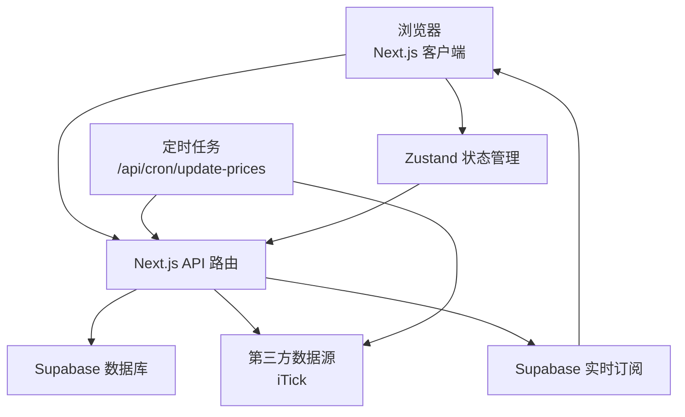
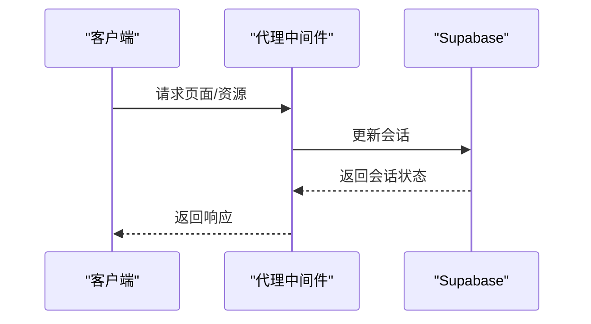
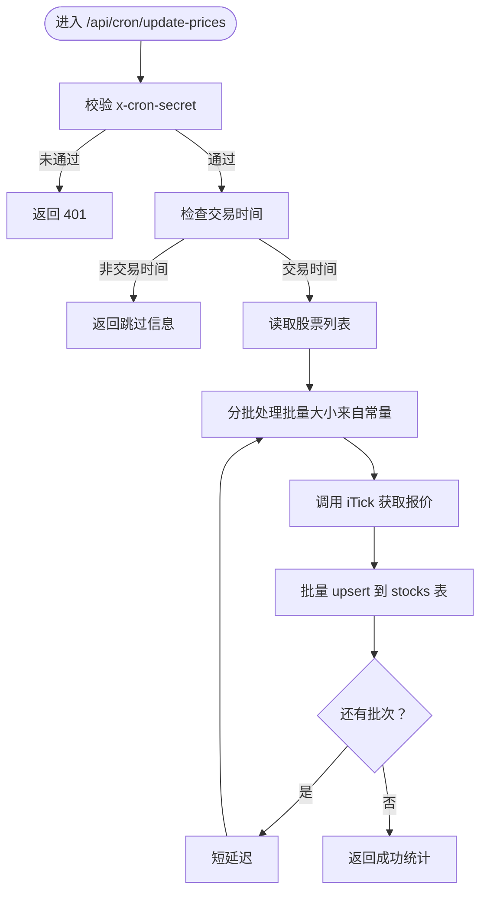
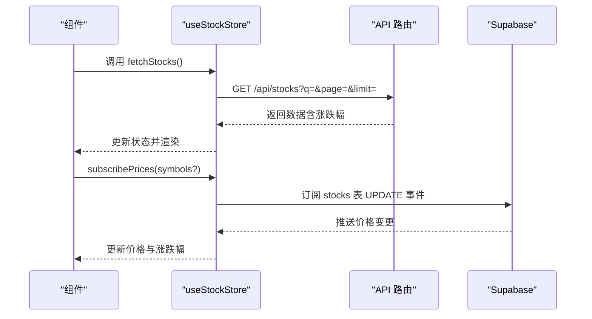
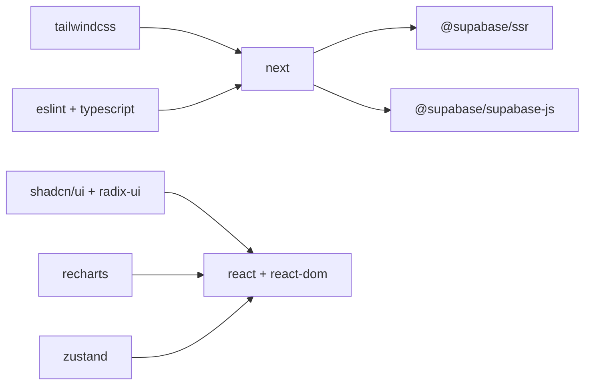

# 快速开始

<cite>
**本文引用的文件**
- [README.md](file://README.md)
- [package.json](file://package.json)
- [docs/环境变量清单.md](file://docs/环境变量清单.md)
- [lib/supabase/client.ts](file://lib/supabase/client.ts)
- [next.config.ts](file://next.config.ts)
- [components/tutorial/connect-supabase-steps.tsx](file://components/tutorial/connect-supabase-steps.tsx)
- [components/tutorial/fetch-data-steps.tsx](file://components/tutorial/fetch-data-steps.tsx)
- [components/tutorial/sign-up-user-steps.tsx](file://components/tutorial/sign-up-user-steps.tsx)
- [proxy.ts](file://proxy.ts)
- [app/api/cron/update-prices/route.ts](file://app/api/cron/update-prices/route.ts)
- [app/api/stocks/route.ts](file://app/api/stocks/route.ts)
- [stores/useStockStore.ts](file://stores/useStockStore.ts)
- [lib/constants.ts](file://lib/constants.ts)
</cite>

## 目录
1. [简介](#简介)
2. [项目结构](#项目结构)
3. [核心组件](#核心组件)
4. [架构总览](#架构总览)
5. [详细组件解析](#详细组件解析)
6. [依赖关系分析](#依赖关系分析)
7. [性能注意事项](#性能注意事项)
8. [故障排除指南](#故障排除指南)
9. [结论](#结论)
10. [附录](#附录)

## 简介
本指南面向首次搭建虚拟股票交易系统的开发者，目标是帮助你在最短时间内完成从零到一的本地开发环境准备与运行。你将学到：
- 如何在 Supabase 上创建项目并获取所需凭据
- 如何安装依赖、配置包管理器与 Node.js 版本
- 如何正确编写 .env.local 并理解每个环境变量的作用
- 如何启动本地开发服务器、启用热重载与开发工具
- 如何在不同操作系统上执行命令
- 常见初始化问题与排障方法

## 项目结构
该项目采用 Next.js App Router 结构，核心目录与职责概览如下：
- app：应用页面、API 路由与布局
- components：通用 UI 组件与教程组件
- lib：Supabase 客户端封装、常量与业务规则
- stores：基于 Zustand 的全局状态管理
- types：TypeScript 类型定义
- docs：文档与环境变量清单

**图表来源**
- [next.config.ts:1-8](file://next.config.ts#L1-L8)
- [package.json:1-44](file://package.json#L1-L44)

**章节来源**
- [package.json:1-44](file://package.json#L1-L44)
- [next.config.ts:1-8](file://next.config.ts#L1-L8)

## 核心组件
- Supabase 客户端封装：在浏览器侧与服务端侧分别创建客户端，确保凭据按需暴露。
- API 路由：提供定时任务、股票列表查询等后端能力。
- 状态管理：使用 Zustand 管理股票列表、自选股与实时订阅。
- 环境变量：集中管理 Supabase、第三方数据源与功能开关。

**章节来源**
- [lib/supabase/client.ts:1-9](file://lib/supabase/client.ts#L1-L9)
- [app/api/cron/update-prices/route.ts:1-150](file://app/api/cron/update-prices/route.ts#L1-L150)
- [stores/useStockStore.ts:1-184](file://stores/useStockStore.ts#L1-L184)
- [lib/constants.ts:1-101](file://lib/constants.ts#L1-L101)

## 架构总览
下图展示了从浏览器到 Supabase 的典型交互链路，以及定时任务如何拉取第三方数据源并写回数据库。

**图表来源**
- [stores/useStockStore.ts:125-150](file://stores/useStockStore.ts#L125-L150)
- [app/api/cron/update-prices/route.ts:10-150](file://app/api/cron/update-prices/route.ts#L10-L150)
- [lib/supabase/client.ts:1-9](file://lib/supabase/client.ts#L1-L9)

## 详细组件解析

### 环境准备与 .env.local 配置
- 在 Supabase 仪表盘创建项目，获取项目 URL 与匿名/发布键。
- 在项目根目录创建 .env.local，填入以下关键变量：
  - NEXT_PUBLIC_SUPABASE_URL：Supabase 项目 URL
  - NEXT_PUBLIC_SUPABASE_PUBLISHABLE_KEY：发布键（前端）
  - SUPABASE_SERVICE_ROLE_KEY：服务端密钥（仅服务端）
  - ITICK_API_KEY：iTick 数据源密钥
  - 可选：CRON_SECRET、功能开关与初始资金等

提示：
- 发布键与项目 URL 可在 Supabase 项目设置 → API 中找到
- 服务端密钥仅用于 API 路由或服务端逻辑，切勿暴露到前端
- 若使用 Vercel 部署，需在 Vercel 项目设置中添加对应环境变量

**章节来源**
- [README.md:76-98](file://README.md#L76-L98)
- [docs/环境变量清单.md:21-125](file://docs/环境变量清单.md#L21-L125)

### 依赖安装与包管理器选择
- 推荐使用 Node.js LTS 版本（具体版本号请参考项目依赖声明）
- 支持的包管理器：npm、yarn、pnpm（任选其一）
- 安装命令示例（以 npm 为例）：
  - npm ci 或 npm install
- 开发脚本已在 package.json 中定义：
  - dev：启动 Next.js 开发服务器
  - build：构建应用
  - start：生产启动
  - lint：运行 ESLint

**章节来源**
- [package.json:1-44](file://package.json#L1-L44)
- [README.md:56-74](file://README.md#L56-L74)

### 本地开发服务器启动与热重载
- 启动开发服务器：
  - npm run dev
- 浏览器访问 http://localhost:3000
- 修改代码后，Next.js 将自动热重载页面
- 如需验证环境变量是否生效，可访问 /api/health（参考环境变量清单文档）

**章节来源**
- [README.md:89-98](file://README.md#L89-L98)
- [docs/环境变量清单.md:137-153](file://docs/环境变量清单.md#L137-L153)

### Supabase 客户端初始化与代理中间件
- 浏览器端客户端初始化使用 NEXT_PUBLIC_SUPABASE_URL 与发布键
- 服务端客户端使用服务端密钥，用于高权限操作
- 代理中间件用于维护会话状态，匹配除静态资源外的所有请求路径

**图表来源**
- [proxy.ts:1-21](file://proxy.ts#L1-L21)
- [lib/supabase/client.ts:1-9](file://lib/supabase/client.ts#L1-L9)

**章节来源**
- [lib/supabase/client.ts:1-9](file://lib/supabase/client.ts#L1-L9)
- [proxy.ts:1-21](file://proxy.ts#L1-L21)

### 定时任务：更新股票价格
- 路由：/api/cron/update-prices
- 触发方式：通过 Vercel Cron 或外部调度器携带 x-cron-secret（可选）
- 逻辑要点：
  - 校验 CRON_SECRET（如配置）
  - 检查交易时间
  - 分批从 iTick 拉取行情并 upsert 到 stocks 表
  - 返回更新统计

**图表来源**
- [app/api/cron/update-prices/route.ts:10-150](file://app/api/cron/update-prices/route.ts#L10-L150)
- [lib/constants.ts:70-79](file://lib/constants.ts#L70-L79)

**章节来源**
- [app/api/cron/update-prices/route.ts:1-150](file://app/api/cron/update-prices/route.ts#L1-L150)
- [lib/constants.ts:70-79](file://lib/constants.ts#L70-L79)

### 股票列表查询与分页
- 路由：/api/stocks
- 支持关键词搜索、分页与排序
- 返回字段包含涨跌额与涨跌幅计算

**章节来源**
- [app/api/stocks/route.ts:1-69](file://app/api/stocks/route.ts#L1-L69)

### 状态管理与实时订阅
- 使用 Zustand 管理股票列表、自选股、搜索关键字与分页
- 通过 Supabase 实时订阅监听 stocks 表更新，实现价格热更新
- 提供添加/移除自选股、刷新列表等操作

**图表来源**
- [stores/useStockStore.ts:33-57](file://stores/useStockStore.ts#L33-L57)
- [stores/useStockStore.ts:125-150](file://stores/useStockStore.ts#L125-L150)
- [app/api/stocks/route.ts:46-60](file://app/api/stocks/route.ts#L46-L60)

**章节来源**
- [stores/useStockStore.ts:1-184](file://stores/useStockStore.ts#L1-L184)

### 环境变量清单与验证
- 关键变量与获取方式详见“环境变量清单”
- 可通过 /api/health 验证变量是否加载成功

**章节来源**
- [docs/环境变量清单.md:19-153](file://docs/环境变量清单.md#L19-L153)

## 依赖关系分析
- Next.js：应用框架与开发服务器
- @supabase/supabase-js 与 @supabase/ssr：数据库与认证客户端
- Radix UI、shadcn/ui：UI 组件库
- Tailwind CSS：样式工具
- recharts：图表可视化
- zustand：轻量状态管理
- TypeScript 与 ESLint：类型与代码质量保障

**图表来源**
- [package.json:9-29](file://package.json#L9-L29)
- [package.json:30-42](file://package.json#L30-L42)

**章节来源**
- [package.json:1-44](file://package.json#L1-L44)

## 性能注意事项
- 分页与批量：API 已限制最大分页大小并使用批量请求减少第三方调用次数
- 实时订阅：仅对展示的股票符号进行过滤订阅，降低带宽与 CPU 占用
- 缓存组件：开启组件缓存以提升渲染性能
- 超时与重试：定时任务对第三方接口设置了超时，避免阻塞

**章节来源**
- [lib/constants.ts:70-79](file://lib/constants.ts#L70-L79)
- [next.config.ts:3-5](file://next.config.ts#L3-L5)
- [app/api/cron/update-prices/route.ts:62-72](file://app/api/cron/update-prices/route.ts#L62-L72)

## 故障排除指南
常见问题与解决方案：
- 环境变量未生效
  - 确认 .env.local 已创建且变量拼写正确
  - 重启开发服务器并刷新页面
  - 参考“连接 Supabase 步骤”组件中的提示
- 无法连接 Supabase
  - 检查 NEXT_PUBLIC_SUPABASE_URL 与发布键是否来自同一项目
  - 确认项目已启用 RLS 并配置相应策略（如允许公开读取）
- 定时任务 401
  - 若配置了 CRON_SECRET，请在请求头中携带 x-cron-secret
- 第三方数据源错误
  - 检查 ITICK_API_KEY 是否有效
  - 查看 API 返回的错误日志，确认网络可达性与超时设置
- Vercel 部署重定向 URL
  - 根据部署环境在 Supabase 设置中配置正确的重定向 URL

**章节来源**
- [components/tutorial/connect-supabase-steps.tsx:21-52](file://components/tutorial/connect-supabase-steps.tsx#L21-L52)
- [components/tutorial/fetch-data-steps.tsx:82-123](file://components/tutorial/fetch-data-steps.tsx#L82-L123)
- [components/tutorial/sign-up-user-steps.tsx:8-75](file://components/tutorial/sign-up-user-steps.tsx#L8-L75)
- [app/api/cron/update-prices/route.ts:12-19](file://app/api/cron/update-prices/route.ts#L12-L19)

## 结论
按照本指南完成 Supabase 项目创建、环境变量配置与依赖安装后，你即可启动本地开发服务器并体验完整的股票列表、自选股与实时价格更新流程。建议在开发过程中结合环境变量清单与 API 路由文档，逐步扩展交易下单、持仓管理等功能模块。

## 附录

### 不同操作系统命令示例
- Windows（PowerShell）
  - 创建 .env.local 并编辑
  - npm install / npm run dev
- macOS/Linux
  - cp .env.example .env.local
  - npm install && npm run dev

**章节来源**
- [README.md:76-98](file://README.md#L76-L98)