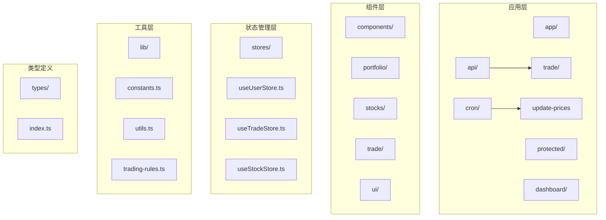
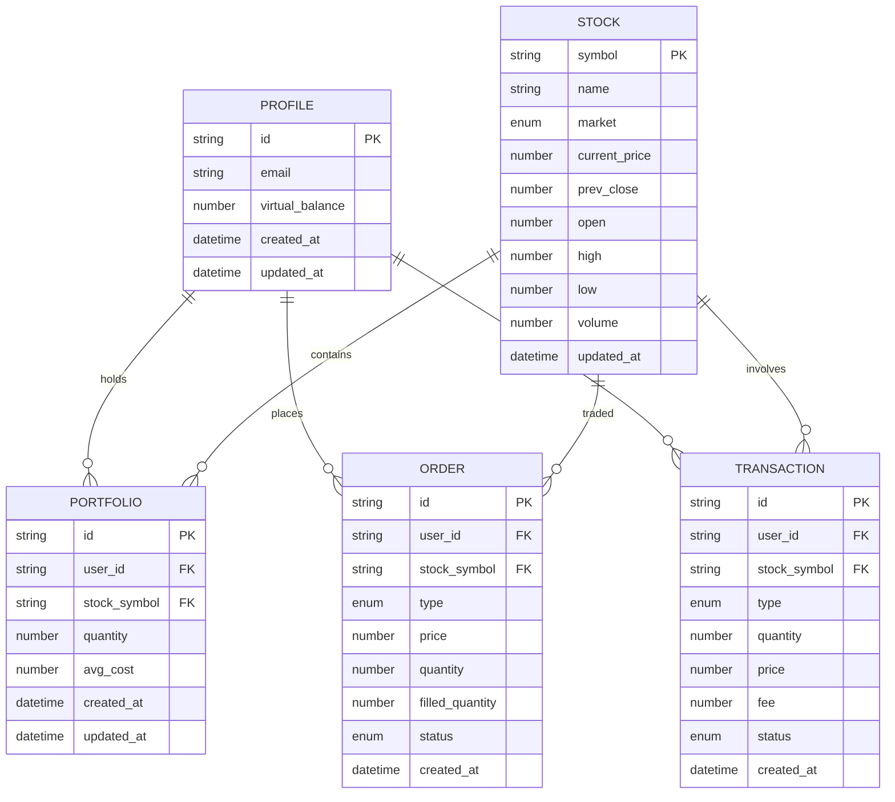
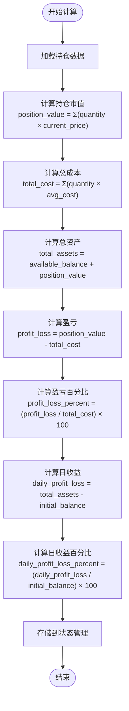
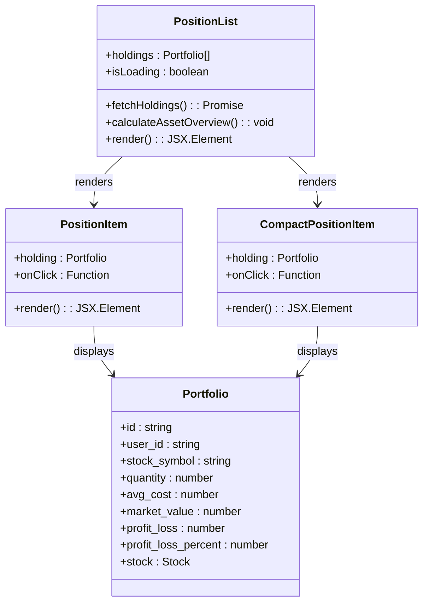
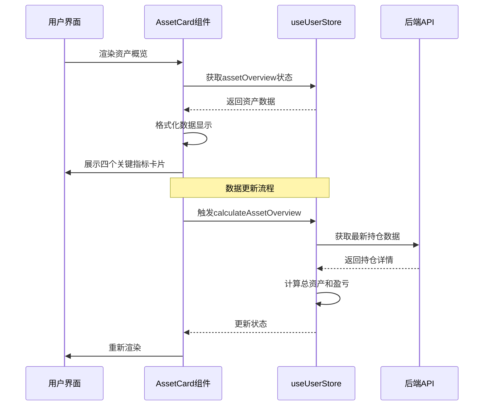
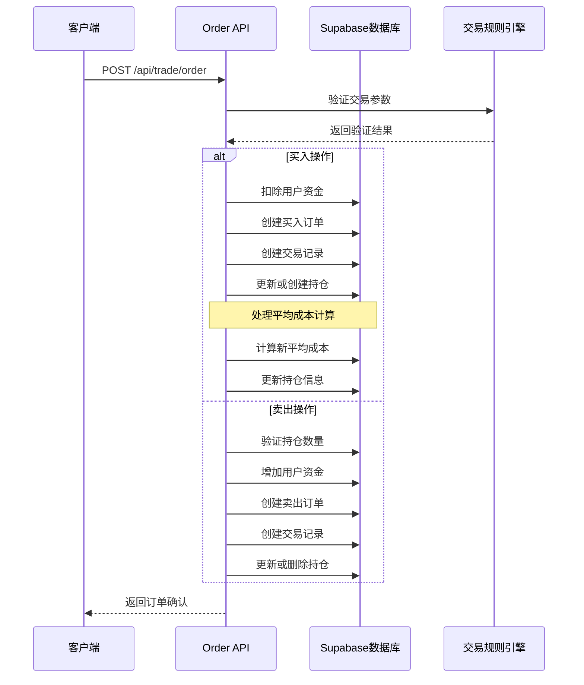
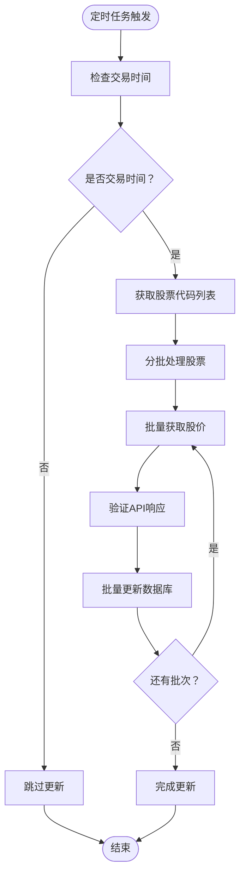
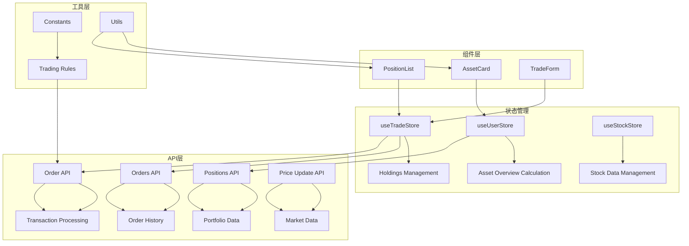

# 持仓管理系统

<cite>
**本文档引用的文件**
- [app/api/trade/positions/route.ts](file://app/api/trade/positions/route.ts)
- [components/portfolio/PositionList.tsx](file://components/portfolio/PositionList.tsx)
- [stores/useUserStore.ts](file://stores/useUserStore.ts)
- [types/index.ts](file://types/index.ts)
- [lib/constants.ts](file://lib/constants.ts)
- [stores/useTradeStore.ts](file://stores/useTradeStore.ts)
- [app/api/cron/update-prices/route.ts](file://app/api/cron/update-prices/route.ts)
- [lib/utils.ts](file://lib/utils.ts)
- [components/portfolio/AssetCard.tsx](file://components/portfolio/AssetCard.tsx)
- [app/api/trade/orders/route.ts](file://app/api/trade/orders/route.ts)
- [lib/trading-rules.ts](file://lib/trading-rules.ts)
- [app/api/trade/order/route.ts](file://app/api/trade/order/route.ts)
- [stores/index.ts](file://stores/index.ts)
- [app/(dashboard)/page.tsx](file://app/(dashboard)/page.tsx)
- [app/layout.tsx](file://app/layout.tsx)
</cite>

## 目录
1. [简介](#简介)
2. [项目结构](#项目结构)
3. [核心组件](#核心组件)
4. [架构概览](#架构概览)
5. [详细组件分析](#详细组件分析)
6. [依赖关系分析](#依赖关系分析)
7. [性能考虑](#性能考虑)
8. [故障排除指南](#故障排除指南)
9. [结论](#结论)

## 简介

虚拟股票交易平台的持仓管理系统是一个完整的资产管理解决方案，专注于提供实时的持仓跟踪、资产概览和交易执行功能。该系统基于Next.js构建，采用React状态管理，通过Supabase进行数据持久化，实现了从数据模型设计到前端展示的完整闭环。

系统的核心功能包括：
- 实时持仓数据管理与计算
- 资产概览与盈亏统计
- 股票价格实时更新机制
- 交易订单处理与资金管理
- 用户资产增减与历史记录追踪

## 项目结构

项目采用模块化的组织方式，按照功能域进行文件分离：

**图表来源**
- [app/api/trade/positions/route.ts:1-46](file://app/api/trade/positions/route.ts#L1-L46)
- [components/portfolio/PositionList.tsx:1-194](file://components/portfolio/PositionList.tsx#L1-L194)
- [stores/useUserStore.ts:1-110](file://stores/useUserStore.ts#L1-L110)

**章节来源**
- [app/api/trade/positions/route.ts:1-46](file://app/api/trade/positions/route.ts#L1-L46)
- [components/portfolio/PositionList.tsx:1-194](file://components/portfolio/PositionList.tsx#L1-L194)
- [stores/useUserStore.ts:1-110](file://stores/useUserStore.ts#L1-L110)

## 核心组件

### 数据模型设计

系统采用强类型的数据模型来确保数据的一致性和完整性：

**图表来源**
- [types/index.ts:1-166](file://types/index.ts#L1-L166)

### 资产概览计算

系统实现了完整的资产概览计算功能，包括总资产、可用资金、持仓市值和盈亏统计：

**图表来源**
- [stores/useUserStore.ts:53-86](file://stores/useUserStore.ts#L53-L86)

**章节来源**
- [types/index.ts:1-166](file://types/index.ts#L1-L166)
- [stores/useUserStore.ts:53-86](file://stores/useUserStore.ts#L53-L86)

## 架构概览

系统采用前后端分离的架构模式，通过API路由处理业务逻辑，使用状态管理器协调组件间的数据流：

```mermaid
graph TB
subgraph "前端层"
A[Dashboard Page]
B[AssetCard]
C[PositionList]
D[TradeForm]
end
subgraph "状态管理层"
E[useUserStore]
F[useTradeStore]
G[useStockStore]
end
subgraph "API层"
H[Positions API]
I[Orders API]
J[Order API]
K[Price Update API]
end
subgraph "数据层"
L[Supabase Database]
M[iTick API]
end
A --> B
A --> C
A --> D
B --> E
C --> F
D --> F
E --> H
F --> I
F --> J
H --> L
I --> L
J --> L
K --> M
K --> L
L --> E
L --> F
```

**图表来源**
- [app/(dashboard)/page.tsx:17-99](file://app/(dashboard)/page.tsx#L17-L99)
- [stores/useUserStore.ts:15-110](file://stores/useUserStore.ts#L15-L110)
- [stores/useTradeStore.ts:27-192](file://stores/useTradeStore.ts#L27-L192)

## 详细组件分析

### 持仓列表组件

PositionList组件负责展示用户的持仓信息，提供了完整的数据展示、排序和交互功能：

**图表来源**
- [components/portfolio/PositionList.tsx:19-194](file://components/portfolio/PositionList.tsx#L19-L194)
- [types/index.ts:36-51](file://types/index.ts#L36-L51)

组件特性包括：
- **数据加载**：自动获取用户持仓数据并计算盈亏
- **格式化显示**：使用工具函数格式化货币、数字和百分比
- **响应式设计**：支持紧凑模式和完整模式
- **交互功能**：点击股票进入交易界面
- **状态管理**：集成资产概览计算

**章节来源**
- [components/portfolio/PositionList.tsx:19-194](file://components/portfolio/PositionList.tsx#L19-L194)
- [lib/utils.ts:13-47](file://lib/utils.ts#L13-L47)

### 资产概览卡片

AssetCard组件提供直观的资产概览展示，包含总资产、可用资金、持仓市值和累计盈亏等关键指标：

**图表来源**
- [components/portfolio/AssetCard.tsx:14-92](file://components/portfolio/AssetCard.tsx#L14-L92)
- [stores/useUserStore.ts:53-86](file://stores/useUserStore.ts#L53-L86)

**章节来源**
- [components/portfolio/AssetCard.tsx:14-92](file://components/portfolio/AssetCard.tsx#L14-L92)
- [stores/useUserStore.ts:53-86](file://stores/useUserStore.ts#L53-L86)

### 交易订单处理

订单处理系统实现了完整的买入和卖出流程，包括验证、资金管理和持仓更新：

**图表来源**
- [app/api/trade/order/route.ts:10-331](file://app/api/trade/order/route.ts#L10-L331)
- [lib/trading-rules.ts:170-247](file://lib/trading-rules.ts#L170-L247)

**章节来源**
- [app/api/trade/order/route.ts:10-331](file://app/api/trade/order/route.ts#L10-L331)
- [lib/trading-rules.ts:88-125](file://lib/trading-rules.ts#L88-L125)

### 实时价格更新机制

系统实现了定时价格更新机制，通过Cron任务定期从外部API获取最新股价：

**图表来源**
- [app/api/cron/update-prices/route.ts:10-150](file://app/api/cron/update-prices/route.ts#L10-L150)

**章节来源**
- [app/api/cron/update-prices/route.ts:10-150](file://app/api/cron/update-prices/route.ts#L10-L150)
- [lib/constants.ts:70-95](file://lib/constants.ts#L70-L95)

## 依赖关系分析

系统各组件间的依赖关系清晰明确，遵循单一职责原则：

**图表来源**
- [stores/index.ts:1-7](file://stores/index.ts#L1-L7)
- [lib/trading-rules.ts:1-272](file://lib/trading-rules.ts#L1-L272)
- [lib/constants.ts:1-101](file://lib/constants.ts#L1-L101)

**章节来源**
- [stores/index.ts:1-7](file://stores/index.ts#L1-L7)
- [lib/trading-rules.ts:1-272](file://lib/trading-rules.ts#L1-L272)

## 性能考虑

系统在多个层面进行了性能优化：

### 数据缓存策略
- **实时订阅**：使用Supabase实时监听数据变更
- **批量更新**：股票价格更新采用分批处理减少API调用
- **状态缓存**：Zustand状态管理器避免不必要的重渲染

### 网络优化
- **请求去重**：避免重复的API请求
- **超时控制**：设置合理的请求超时时间
- **错误重试**：实现智能的错误处理和重试机制

### 前端性能
- **懒加载**：组件按需加载
- **虚拟滚动**：大量数据时使用虚拟化技术
- **防抖节流**：输入和搜索操作的性能优化

## 故障排除指南

### 常见问题及解决方案

**持仓数据不更新**
1. 检查Supabase连接状态
2. 验证实时订阅是否正常工作
3. 确认用户认证状态

**价格更新失败**
1. 检查Cron密钥配置
2. 验证API密钥有效性
3. 确认交易时间判断逻辑

**交易订单异常**
1. 检查交易规则验证
2. 确认资金余额充足
3. 验证股票代码有效性

**章节来源**
- [app/api/cron/update-prices/route.ts:12-19](file://app/api/cron/update-prices/route.ts#L12-L19)
- [lib/trading-rules.ts:170-201](file://lib/trading-rules.ts#L170-L201)

## 结论

虚拟股票交易平台的持仓管理系统展现了现代Web应用的最佳实践，通过合理的架构设计、完善的类型系统和高效的性能优化，为用户提供了一个功能完整、响应迅速的虚拟股票交易体验。

系统的主要优势包括：
- **数据一致性**：强类型系统确保数据完整性
- **实时性**：多层实时更新机制保证数据新鲜度
- **可扩展性**：模块化设计便于功能扩展
- **用户体验**：直观的界面和流畅的交互体验

未来可以考虑的功能增强包括：
- 更丰富的技术分析工具
- 多维度的资产统计报表
- 风险评估和投资建议功能
- 移动端原生应用支持