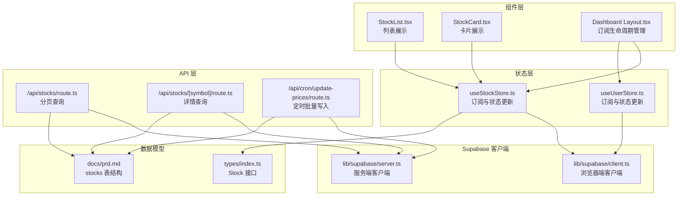
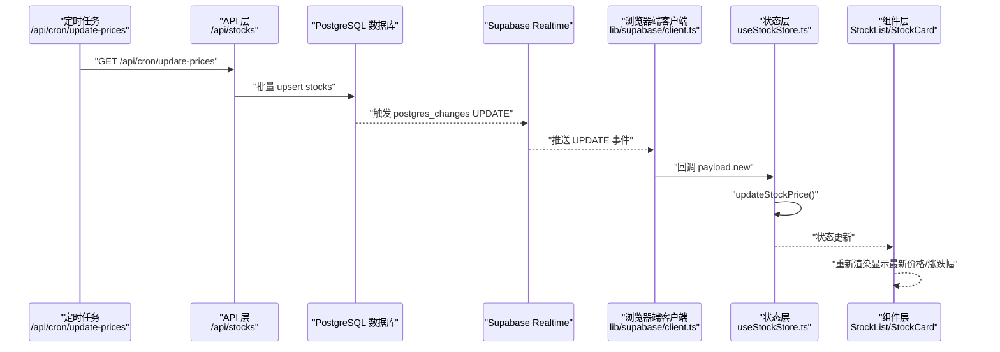
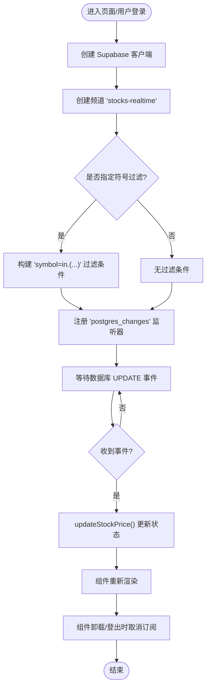
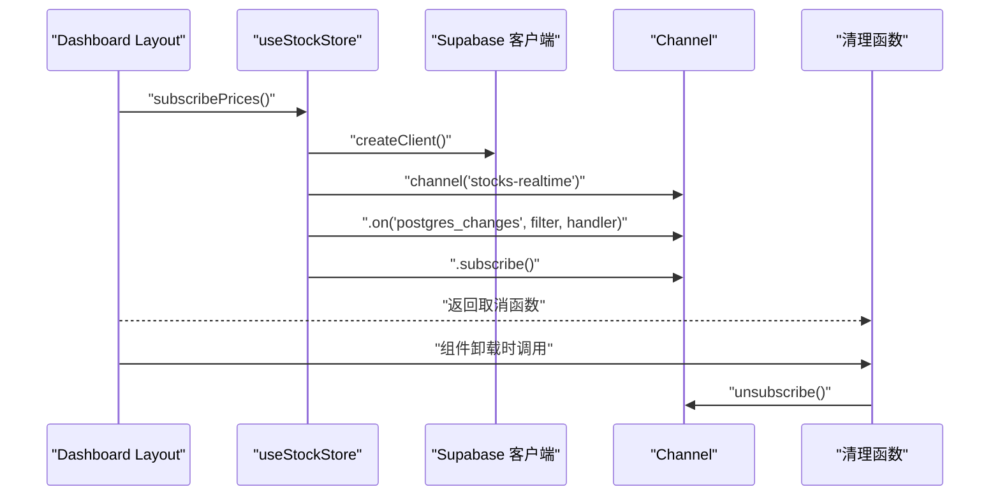
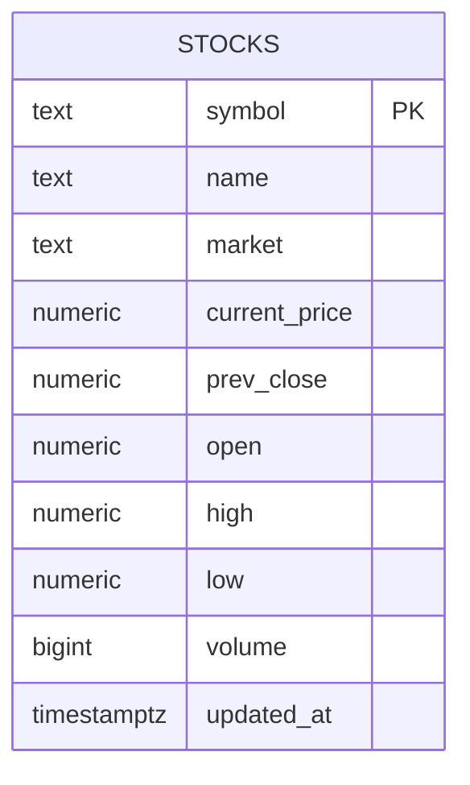
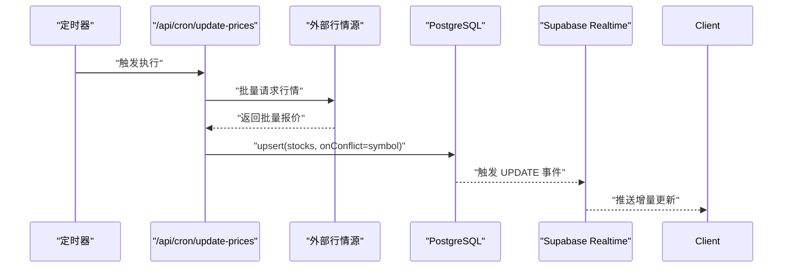
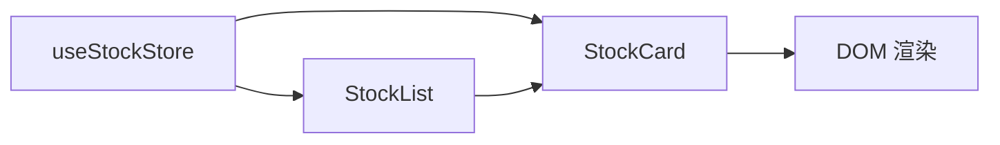
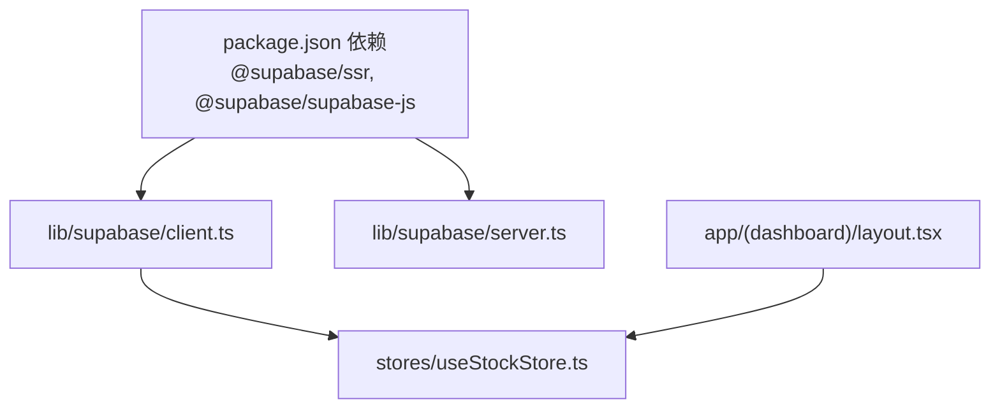

# 实时数据同步

<cite>
**本文引用的文件**
- [lib/supabase/client.ts](file://lib/supabase/client.ts)
- [lib/supabase/server.ts](file://lib/supabase/server.ts)
- [stores/useStockStore.ts](file://stores/useStockStore.ts)
- [stores/useUserStore.ts](file://stores/useUserStore.ts)
- [app/(dashboard)/layout.tsx](file://app/(dashboard)/layout.tsx)
- [components/stocks/StockList.tsx](file://components/stocks/StockList.tsx)
- [components/stocks/StockCard.tsx](file://components/stocks/StockCard.tsx)
- [app/api/stocks/route.ts](file://app/api/stocks/route.ts)
- [app/api/stocks/[symbol]/route.ts](file://app/api/stocks/[symbol]/route.ts)
- [app/api/cron/update-prices/route.ts](file://app/api/cron/update-prices/route.ts)
- [types/index.ts](file://types/index.ts)
- [lib/constants.ts](file://lib/constants.ts)
- [docs/状态管理结构.md](file://docs/状态管理结构.md)
- [docs/prd.md](file://docs/prd.md)
- [package.json](file://package.json)
</cite>

## 目录
1. [简介](#简介)
2. [项目结构](#项目结构)
3. [核心组件](#核心组件)
4. [架构总览](#架构总览)
5. [详细组件分析](#详细组件分析)
6. [依赖关系分析](#依赖关系分析)
7. [性能考量](#性能考量)
8. [故障排查指南](#故障排查指南)
9. [结论](#结论)
10. [附录](#附录)

## 简介
本文件系统性阐述本项目中基于 Supabase Realtime 的实时数据同步机制，重点覆盖以下方面：
- Realtime 的工作原理与 WebSocket 连接机制
- 如何通过 Supabase 客户端订阅数据库变更事件，实现前端与数据库的双向数据同步
- stocks 表开启 Realtime 后如何实现行情数据的实时推送（价格变更、成交量等）
- 前端订阅的建立、数据监听与连接管理
- 性能优化策略（增量更新、批量推送、连接池管理）
- 网络中断与重连机制
- 代码示例路径与最佳实践（含错误处理与状态管理）
- 与轮询等其他同步方式的对比与选择策略

## 项目结构
围绕 Supabase Realtime 的实现，项目采用“状态层 + API 层 + 组件层”的分层组织：
- 状态层：使用 Zustand Store 管理应用状态与订阅生命周期
- API 层：Next.js App Router API 提供数据读取与定时写入
- 组件层：React 组件负责展示与交互
- Supabase 客户端：分别提供浏览器端与服务端客户端封装

**图表来源**
- [app/(dashboard)/layout.tsx:41-62](file://app/(dashboard)/layout.tsx#L41-L62)
- [stores/useStockStore.ts:125-150](file://stores/useStockStore.ts#L125-L150)
- [stores/useUserStore.ts:88-109](file://stores/useUserStore.ts#L88-L109)
- [lib/supabase/client.ts:1-9](file://lib/supabase/client.ts#L1-L9)
- [lib/supabase/server.ts:1-35](file://lib/supabase/server.ts#L1-L35)
- [types/index.ts:10-25](file://types/index.ts#L10-L25)
- [docs/prd.md:113-127](file://docs/prd.md#L113-L127)

**章节来源**
- [lib/supabase/client.ts:1-9](file://lib/supabase/client.ts#L1-L9)
- [lib/supabase/server.ts:1-35](file://lib/supabase/server.ts#L1-L35)
- [stores/useStockStore.ts:125-150](file://stores/useStockStore.ts#L125-L150)
- [stores/useUserStore.ts:88-109](file://stores/useUserStore.ts#L88-L109)
- [app/(dashboard)/layout.tsx:41-62](file://app/(dashboard)/layout.tsx#L41-L62)
- [types/index.ts:10-25](file://types/index.ts#L10-L25)
- [docs/prd.md:113-127](file://docs/prd.md#L113-L127)

## 核心组件
- Supabase 浏览器端客户端：用于在前端建立 Realtime 订阅
- Supabase 服务端客户端：用于在 API 层进行数据库读写与批量 upsert
- 股票状态管理（useStockStore）：负责订阅 stocks 表的 UPDATE 事件，更新股价与涨跌幅
- 用户状态管理（useUserStore）：演示同构的 Realtime 订阅模式
- 布局组件（Dashboard Layout）：集中管理订阅生命周期，保证登录态下的自动订阅与清理
- 股票列表与卡片组件：消费状态层数据，实时反映价格变动
- API 路由：提供分页查询、详情查询与定时批量写入

**章节来源**
- [lib/supabase/client.ts:1-9](file://lib/supabase/client.ts#L1-L9)
- [lib/supabase/server.ts:1-35](file://lib/supabase/server.ts#L1-L35)
- [stores/useStockStore.ts:125-150](file://stores/useStockStore.ts#L125-L150)
- [stores/useUserStore.ts:88-109](file://stores/useUserStore.ts#L88-L109)
- [app/(dashboard)/layout.tsx:41-62](file://app/(dashboard)/layout.tsx#L41-L62)
- [components/stocks/StockList.tsx:19-136](file://components/stocks/StockList.tsx#L19-L136)
- [components/stocks/StockCard.tsx:19-150](file://components/stocks/StockCard.tsx#L19-L150)
- [app/api/stocks/route.ts:1-69](file://app/api/stocks/route.ts#L1-L69)
- [app/api/stocks/[symbol]/route.ts:1-50](file://app/api/stocks/[symbol]/route.ts#L1-L50)
- [app/api/cron/update-prices/route.ts:1-150](file://app/api/cron/update-prices/route.ts#L1-L150)

## 架构总览
Supabase Realtime 以 PostgreSQL 触发器为基础，将数据库变更事件推送到 WebSocket 通道。前端通过 Supabase 客户端在指定频道上订阅目标表的变更事件，收到增量数据后更新本地状态，从而实现“数据库 -> Realtime -> 前端”的实时链路。

**图表来源**
- [app/api/cron/update-prices/route.ts:109-113](file://app/api/cron/update-prices/route.ts#L109-L113)
- [stores/useStockStore.ts:142-144](file://stores/useStockStore.ts#L142-L144)
- [components/stocks/StockList.tsx:76-98](file://components/stocks/StockList.tsx#L76-L98)
- [components/stocks/StockCard.tsx:29-32](file://components/stocks/StockCard.tsx#L29-L32)

## 详细组件分析

### Supabase Realtime 订阅与连接管理
- 订阅建立：在状态层通过浏览器端客户端创建频道并注册 postgres_changes 监听器；支持按条件过滤（如按股票代码集合）
- 事件处理：当数据库发生 UPDATE 时，回调中提取 payload.new 并调用状态更新方法
- 连接管理：订阅返回一个取消函数，可在组件卸载或用户登出时调用以释放资源

**图表来源**
- [stores/useStockStore.ts:125-150](file://stores/useStockStore.ts#L125-L150)
- [stores/useStockStore.ts:152-177](file://stores/useStockStore.ts#L152-L177)
- [app/(dashboard)/layout.tsx:50-62](file://app/(dashboard)/layout.tsx#L50-L62)

**章节来源**
- [stores/useStockStore.ts:125-150](file://stores/useStockStore.ts#L125-L150)
- [stores/useStockStore.ts:152-177](file://stores/useStockStore.ts#L152-L177)
- [app/(dashboard)/layout.tsx:50-62](file://app/(dashboard)/layout.tsx#L50-L62)

### 前端订阅生命周期管理
- 在仪表盘布局中统一初始化订阅，确保用户登录后立即建立 Realtime 连接
- 订阅清理：在 useEffect 返回的清理函数中取消所有订阅，防止内存泄漏与重复订阅

**图表来源**
- [app/(dashboard)/layout.tsx:50-62](file://app/(dashboard)/layout.tsx#L50-L62)
- [stores/useStockStore.ts:125-150](file://stores/useStockStore.ts#L125-L150)

**章节来源**
- [app/(dashboard)/layout.tsx:41-62](file://app/(dashboard)/layout.tsx#L41-L62)
- [stores/useStockStore.ts:125-150](file://stores/useStockStore.ts#L125-L150)

### 数据模型与数据库结构
- 股票数据模型包含当前价、昨收、开盘、最高、最低、成交量与更新时间等字段
- stocks 表结构定义了主键与默认时间戳字段，支撑 Realtime 的变更事件推送

**图表来源**
- [types/index.ts:10-25](file://types/index.ts#L10-L25)
- [docs/prd.md:113-127](file://docs/prd.md#L113-L127)

**章节来源**
- [types/index.ts:10-25](file://types/index.ts#L10-L25)
- [docs/prd.md:113-127](file://docs/prd.md#L113-L127)

### API 层与批量写入
- 分页查询与详情查询：提供股票列表与单只股票详情的读取能力
- 定时批量写入：在交易时间内从外部行情源抓取数据，按批次 upsert 到 stocks 表，触发 Realtime 事件

**图表来源**
- [app/api/cron/update-prices/route.ts:57-131](file://app/api/cron/update-prices/route.ts#L57-L131)
- [app/api/stocks/route.ts:22-34](file://app/api/stocks/route.ts#L22-L34)
- [app/api/stocks/[symbol]/route.ts:13-17](file://app/api/stocks/[symbol]/route.ts#L13-L17)

**章节来源**
- [app/api/stocks/route.ts:1-69](file://app/api/stocks/route.ts#L1-L69)
- [app/api/stocks/[symbol]/route.ts:1-50](file://app/api/stocks/[symbol]/route.ts#L1-L50)
- [app/api/cron/update-prices/route.ts:1-150](file://app/api/cron/update-prices/route.ts#L1-L150)

### 组件层的数据消费与展示
- 列表组件：根据状态层数据渲染股票卡片，支持加载骨架屏与分页
- 卡片组件：展示当前价、涨跌额与涨跌幅，依据涨跌状态切换颜色

**图表来源**
- [components/stocks/StockList.tsx:76-98](file://components/stocks/StockList.tsx#L76-L98)
- [components/stocks/StockCard.tsx:29-32](file://components/stocks/StockCard.tsx#L29-L32)

**章节来源**
- [components/stocks/StockList.tsx:19-136](file://components/stocks/StockList.tsx#L19-L136)
- [components/stocks/StockCard.tsx:19-150](file://components/stocks/StockCard.tsx#L19-L150)

## 依赖关系分析
- Supabase 客户端：浏览器端与服务端客户端分别用于前端订阅与后端写入
- 状态层：Zustand Store 提供订阅与状态更新逻辑
- 组件层：消费状态并渲染
- API 层：提供数据读取与定时写入

**图表来源**
- [package.json:16-17](file://package.json#L16-L17)
- [lib/supabase/client.ts:1-9](file://lib/supabase/client.ts#L1-L9)
- [lib/supabase/server.ts:1-35](file://lib/supabase/server.ts#L1-L35)
- [stores/useStockStore.ts:125-150](file://stores/useStockStore.ts#L125-L150)
- [app/(dashboard)/layout.tsx:50-62](file://app/(dashboard)/layout.tsx#L50-L62)

**章节来源**
- [package.json:16-17](file://package.json#L16-L17)
- [lib/supabase/client.ts:1-9](file://lib/supabase/client.ts#L1-L9)
- [lib/supabase/server.ts:1-35](file://lib/supabase/server.ts#L1-L35)
- [stores/useStockStore.ts:125-150](file://stores/useStockStore.ts#L125-L150)
- [app/(dashboard)/layout.tsx:50-62](file://app/(dashboard)/layout.tsx#L50-L62)

## 性能考量
- 增量更新：仅处理 UPDATE 事件并更新 payload.new 字段，减少不必要的全量刷新
- 批量推送：后端按批次 upsert，降低频繁写入带来的事件风暴
- 连接池管理：浏览器端客户端复用同一实例，避免重复握手；订阅返回清理函数，避免连接泄露
- 分页与过滤：前端分页与按符号过滤可降低传输与渲染压力
- 刷新间隔：UI 常量中定义了刷新间隔，可用于控制轮询或心跳节奏（本项目以 Realtime 为主）

**章节来源**
- [stores/useStockStore.ts:125-150](file://stores/useStockStore.ts#L125-L150)
- [app/api/cron/update-prices/route.ts:57-131](file://app/api/cron/update-prices/route.ts#L57-L131)
- [lib/constants.ts:71-95](file://lib/constants.ts#L71-L95)

## 故障排查指南
- 订阅未生效
  - 检查用户登录态与订阅初始化顺序
  - 确认频道名与过滤条件正确
  - 参考订阅生命周期管理与清理流程
- 事件未到达
  - 确认数据库 UPDATE 是否发生且满足过滤条件
  - 检查 Supabase Realtime 服务状态
- 网络中断与重连
  - 使用返回的取消函数在组件卸载时清理订阅
  - 在用户登录态变化时重建订阅
- 错误处理与状态管理
  - API 层对错误进行统一返回与日志记录
  - 组件层在加载与空状态时提供占位与提示

**章节来源**
- [app/(dashboard)/layout.tsx:50-62](file://app/(dashboard)/layout.tsx#L50-L62)
- [stores/useStockStore.ts:125-150](file://stores/useStockStore.ts#L125-L150)
- [app/api/stocks/route.ts:38-44](file://app/api/stocks/route.ts#L38-L44)
- [app/api/cron/update-prices/route.ts:142-148](file://app/api/cron/update-prices/route.ts#L142-L148)

## 结论
本项目通过 Supabase Realtime 实现了从数据库到前端的高效实时数据同步。浏览器端客户端负责订阅，服务端 API 负责批量写入，状态层与组件层协同完成增量更新与渲染。配合合理的过滤、分页与清理机制，系统在性能与可靠性之间取得了良好平衡。

## 附录
- 代码示例路径（不直接展示代码内容）
  - 浏览器端客户端创建：[lib/supabase/client.ts:3-8](file://lib/supabase/client.ts#L3-L8)
  - 服务端客户端创建：[lib/supabase/server.ts:9-34](file://lib/supabase/server.ts#L9-L34)
  - 股票订阅与更新：[stores/useStockStore.ts:125-177](file://stores/useStockStore.ts#L125-L177)
  - 用户订阅示例：[stores/useUserStore.ts:88-109](file://stores/useUserStore.ts#L88-L109)
  - 订阅生命周期管理：[app/(dashboard)/layout.tsx:50-62](file://app/(dashboard)/layout.tsx#L50-L62)
  - 分页查询 API：[app/api/stocks/route.ts:6-68](file://app/api/stocks/route.ts#L6-L68)
  - 详情查询 API：[app/api/stocks/[symbol]/route.ts:5-49](file://app/api/stocks/[symbol]/route.ts#L5-L49)
  - 定时批量写入：[app/api/cron/update-prices/route.ts:10-149](file://app/api/cron/update-prices/route.ts#L10-L149)
  - 数据模型定义：[types/index.ts:10-25](file://types/index.ts#L10-L25)
  - 数据库表结构：[docs/prd.md:113-127](file://docs/prd.md#L113-L127)
  - Store 协作与集成模式：[docs/状态管理结构.md:434-457](file://docs/状态管理结构.md#L434-L457)
  - 依赖声明：[package.json:16-17](file://package.json#L16-L17)