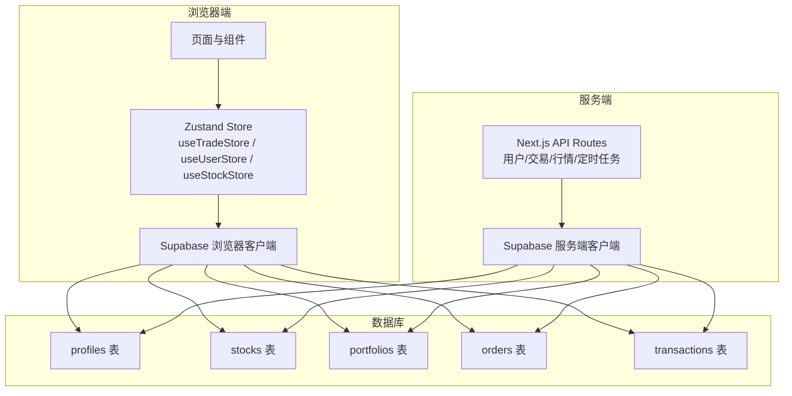
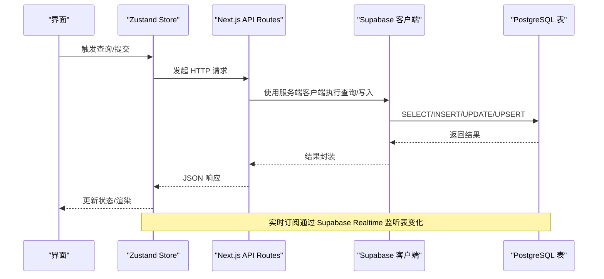
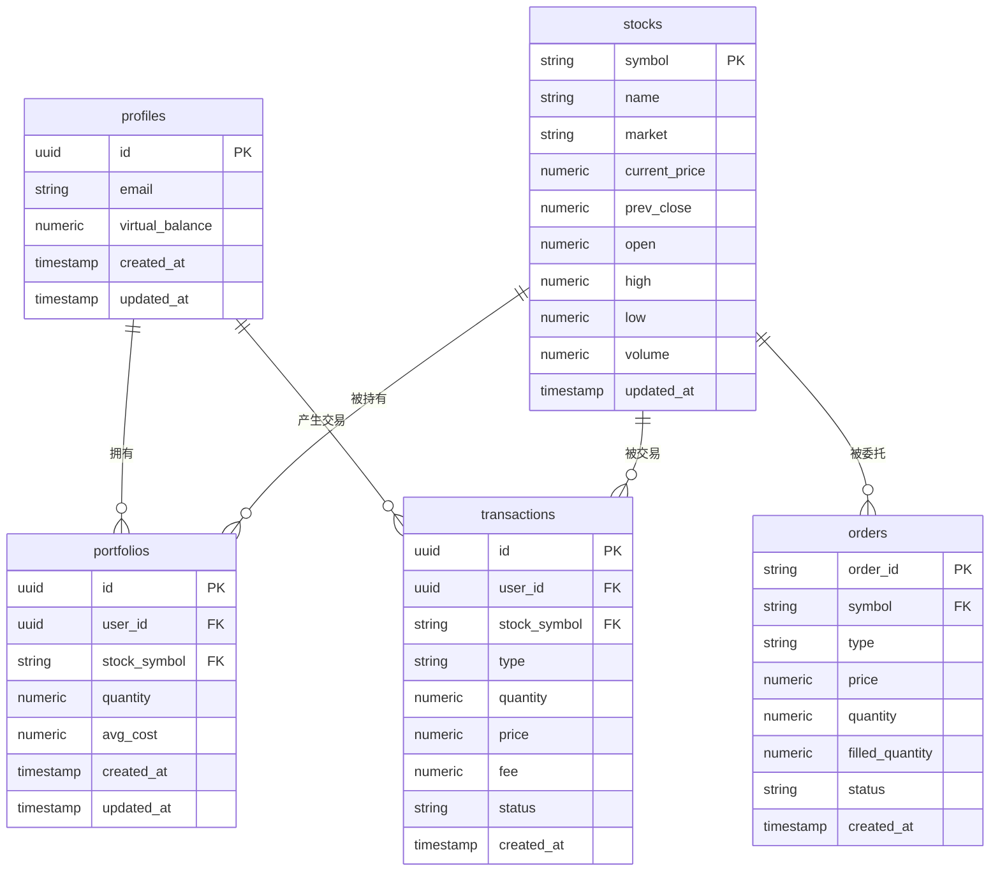
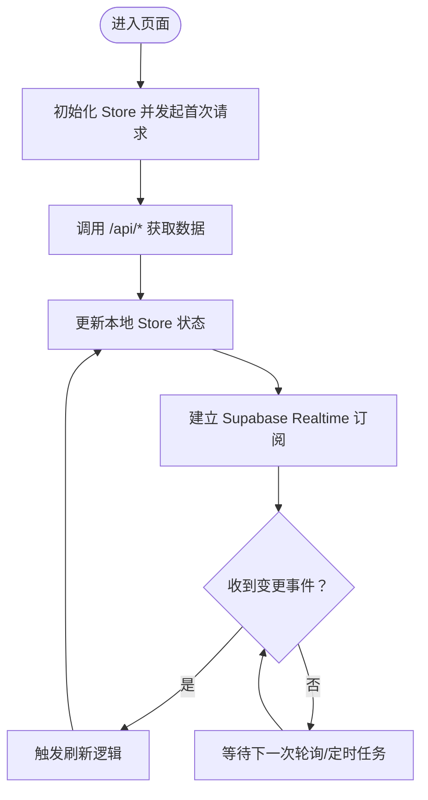
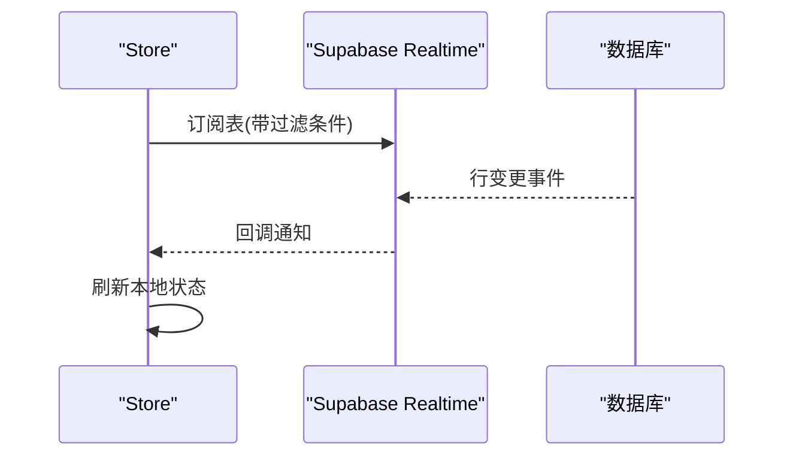
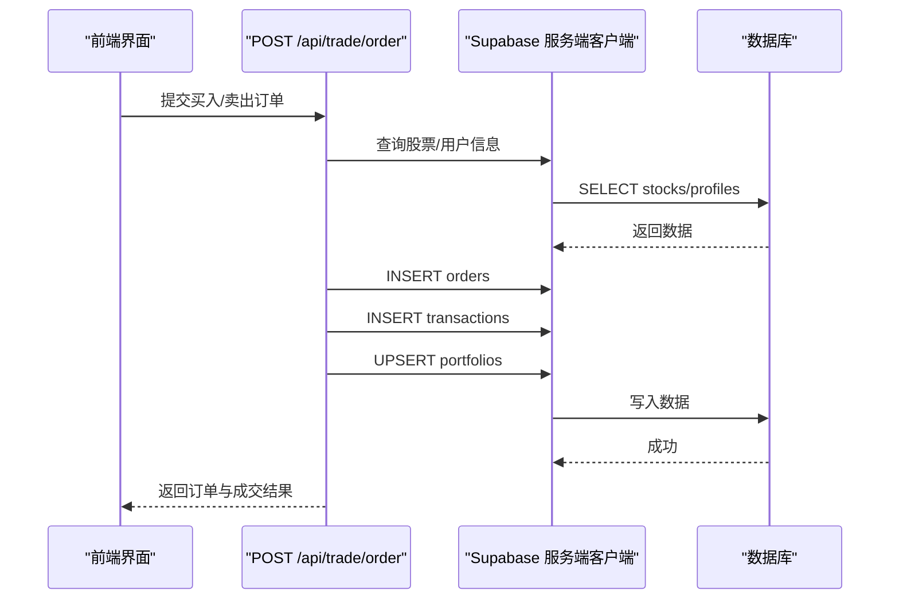
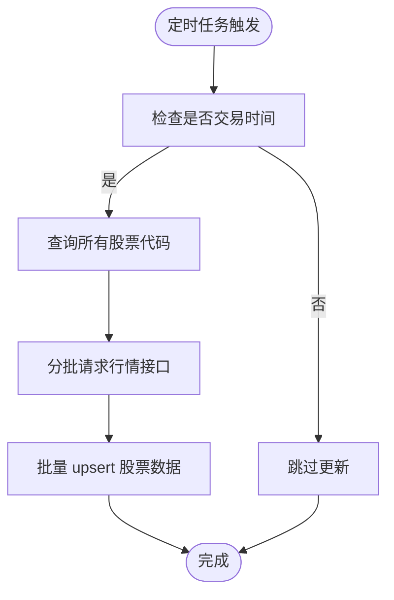
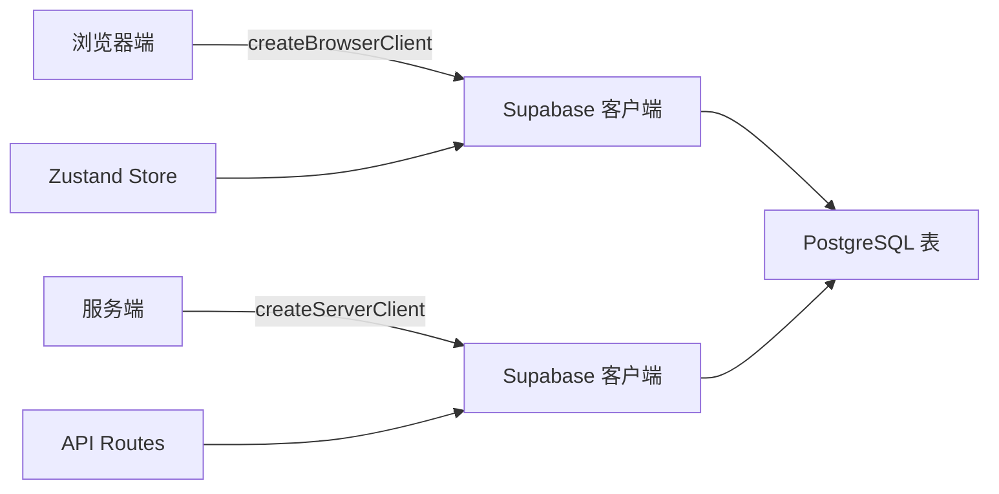

# 数据库设计

<cite>
**本文引用的文件**
- [lib/supabase/client.ts](file://lib/supabase/client.ts)
- [lib/supabase/server.ts](file://lib/supabase/server.ts)
- [types/index.ts](file://types/index.ts)
- [lib/constants.ts](file://lib/constants.ts)
- [lib/utils.ts](file://lib/utils.ts)
- [stores/useTradeStore.ts](file://stores/useTradeStore.ts)
- [stores/useUserStore.ts](file://stores/useUserStore.ts)
- [stores/useStockStore.ts](file://stores/useStockStore.ts)
- [app/api/user/profile/route.ts](file://app/api/user/profile/route.ts)
- [app/api/trade/positions/route.ts](file://app/api/trade/positions/route.ts)
- [app/api/trade/orders/route.ts](file://app/api/trade/orders/route.ts)
- [app/api/trade/order/route.ts](file://app/api/trade/order/route.ts)
- [app/api/cron/update-prices/route.ts](file://app/api/cron/update-prices/route.ts)
- [docs/状态管理结构.md](file://docs/状态管理结构.md)
</cite>

## 目录
1. [简介](#简介)
2. [项目结构](#项目结构)
3. [核心组件](#核心组件)
4. [架构总览](#架构总览)
5. [详细组件分析](#详细组件分析)
6. [依赖分析](#依赖分析)
7. [性能考虑](#性能考虑)
8. [故障排查指南](#故障排查指南)
9. [结论](#结论)
10. [附录](#附录)

## 简介
本文件面向虚拟股票交易平台的数据库设计与实现，基于仓库中的实际代码进行系统性梳理，重点覆盖以下方面：
- 数据模型与实体关系：用户、股票、持仓、交易、订单等核心表的字段与关系
- 外键约束与索引设计：基于查询模式与业务规则推导的索引策略
- 行级安全策略（RLS）：用户数据隔离与权限控制的配置思路
- 数据访问模式：查询优化与缓存策略
- 数据生命周期管理：归档与清理策略
- 实时数据同步：Supabase Realtime 的配置与使用
- 数据迁移与版本管理：演进策略
- 性能监控与优化建议

## 项目结构
该项目采用前端驱动的全栈架构，数据库层由 Supabase 提供，应用通过 API Routes 与浏览器端 Store 进行交互，并借助 Supabase Realtime 实现实时订阅。

图表来源
- [lib/supabase/client.ts:1-9](file://lib/supabase/client.ts#L1-L9)
- [lib/supabase/server.ts:1-34](file://lib/supabase/server.ts#L1-L34)
- [stores/useTradeStore.ts:144-186](file://stores/useTradeStore.ts#L144-L186)
- [stores/useUserStore.ts:88-108](file://stores/useUserStore.ts#L88-L108)
- [stores/useStockStore.ts:125-140](file://stores/useStockStore.ts#L125-L140)
- [app/api/user/profile/route.ts:19-23](file://app/api/user/profile/route.ts#L19-L23)
- [app/api/trade/positions/route.ts:19-27](file://app/api/trade/positions/route.ts#L19-L27)
- [app/api/trade/orders/route.ts:28-42](file://app/api/trade/orders/route.ts#L28-L42)
- [app/api/trade/order/route.ts:52-63](file://app/api/trade/order/route.ts#L52-L63)
- [app/api/cron/update-prices/route.ts:31-43](file://app/api/cron/update-prices/route.ts#L31-L43)

章节来源
- [lib/supabase/client.ts:1-9](file://lib/supabase/client.ts#L1-L9)
- [lib/supabase/server.ts:1-34](file://lib/supabase/server.ts#L1-L34)
- [stores/useTradeStore.ts:144-186](file://stores/useTradeStore.ts#L144-L186)
- [stores/useUserStore.ts:88-108](file://stores/useUserStore.ts#L88-L108)
- [stores/useStockStore.ts:125-140](file://stores/useStockStore.ts#L125-L140)
- [app/api/user/profile/route.ts:19-23](file://app/api/user/profile/route.ts#L19-L23)
- [app/api/trade/positions/route.ts:19-27](file://app/api/trade/positions/route.ts#L19-L27)
- [app/api/trade/orders/route.ts:28-42](file://app/api/trade/orders/route.ts#L28-L42)
- [app/api/trade/order/route.ts:52-63](file://app/api/trade/order/route.ts#L52-L63)
- [app/api/cron/update-prices/route.ts:31-43](file://app/api/cron/update-prices/route.ts#L31-L43)

## 核心组件
- 用户表 profiles：存储用户标识、邮箱、虚拟资金余额等
- 股票表 stocks：存储股票代码、名称、市场、实时/历史价格与成交量
- 持仓表 portfolios：存储用户对某只股票的持有数量与平均成本
- 订单表 orders：存储用户的委托订单（限价/市价、数量、状态等）
- 交易表 transactions：存储已成交的交易明细（含手续费、成交价、方向）

章节来源
- [types/index.ts:2-8](file://types/index.ts#L2-L8)
- [types/index.ts:11-25](file://types/index.ts#L11-L25)
- [types/index.ts:37-51](file://types/index.ts#L37-L51)
- [types/index.ts:54-66](file://types/index.ts#L54-L66)
- [types/index.ts:69-80](file://types/index.ts#L69-L80)

## 架构总览
下图展示从浏览器端 Store 到 API Routes，再到 Supabase 数据库的完整调用链路，以及 Supabase Realtime 的订阅机制。

图表来源
- [stores/useTradeStore.ts:33-66](file://stores/useTradeStore.ts#L33-L66)
- [stores/useTradeStore.ts:144-186](file://stores/useTradeStore.ts#L144-L186)
- [app/api/trade/positions/route.ts:19-37](file://app/api/trade/positions/route.ts#L19-L37)
- [app/api/trade/orders/route.ts:28-57](file://app/api/trade/orders/route.ts#L28-L57)
- [app/api/trade/order/route.ts:152-163](file://app/api/trade/order/route.ts#L152-L163)
- [lib/supabase/server.ts:9-33](file://lib/supabase/server.ts#L9-L33)

## 详细组件分析

### 数据模型与实体关系
- 用户 profiles
  - 字段要点：id（主键）、email、virtual_balance、created_at、updated_at
  - 用途：用户身份识别与可用资金管理
- 股票 stocks
  - 字段要点：symbol（主键）、name、market、current_price、prev_close、open、high、low、volume、updated_at
  - 用途：实时/历史行情数据
- 持仓 portfolios
  - 字段要点：id（主键）、user_id（外键至 profiles）、stock_symbol（外键至 stocks）、quantity、avg_cost、created_at、updated_at
  - 用途：用户对每只股票的持有情况
- 订单 orders
  - 字段要点：order_id（主键）、symbol（外键至 stocks）、type、price、quantity、filled_quantity、status、created_at
  - 用途：用户委托订单
- 交易 transactions
  - 字段要点：id（主键）、user_id（外键至 profiles）、stock_symbol（外键至 stocks）、type、quantity、price、fee、status、created_at
  - 用途：成交明细

图表来源
- [types/index.ts:2-8](file://types/index.ts#L2-L8)
- [types/index.ts:11-25](file://types/index.ts#L11-L25)
- [types/index.ts:37-51](file://types/index.ts#L37-L51)
- [types/index.ts:54-80](file://types/index.ts#L54-L80)

章节来源
- [types/index.ts:2-8](file://types/index.ts#L2-L8)
- [types/index.ts:11-25](file://types/index.ts#L11-L25)
- [types/index.ts:37-51](file://types/index.ts#L37-L51)
- [types/index.ts:54-80](file://types/index.ts#L54-L80)

### 外键约束与索引设计
- 外键约束
  - portfolios.user_id → profiles.id
  - portfolios.stock_symbol → stocks.symbol
  - orders.symbol → stocks.symbol
  - transactions.user_id → profiles.id
  - transactions.stock_symbol → stocks.symbol
- 推荐索引
  - profiles(id)
  - stocks(symbol)
  - portfolios(user_id, stock_symbol)
  - orders(user_id, created_at)
  - transactions(user_id, created_at)
  - stocks(updated_at)（用于批量更新后的排序/扫描）
- 查询路径与索引匹配
  - 持仓查询：按 user_id 过滤，按 updated_at 排序 → 建议复合索引(user_id, updated_at)
  - 订单查询：按 user_id 过滤，支持 status 过滤与分页 → 建议复合索引(user_id, status, created_at)
  - 交易查询：按 user_id 过滤，按 created_at 排序 → 建议复合索引(user_id, created_at)
  - 股票更新：按 symbol upsert → 建议 stocks(symbol) 唯一索引

章节来源
- [app/api/trade/positions/route.ts:20-27](file://app/api/trade/positions/route.ts#L20-L27)
- [app/api/trade/orders/route.ts:28-42](file://app/api/trade/orders/route.ts#L28-L42)
- [app/api/trade/order/route.ts:165-197](file://app/api/trade/order/route.ts#L165-L197)
- [app/api/cron/update-prices/route.ts:109-113](file://app/api/cron/update-prices/route.ts#L109-L113)

### 行级安全策略（RLS）
- 目标
  - 确保用户只能读取/修改自己的数据（profiles、portfolios、orders、transactions）
- 配置建议
  - 为每张表启用 RLS
  - 定义策略：如 portfolios 表策略要求 user_id = current_setting('request.jwt.claims') -> id
  - 对 stocks 表可设置为“公开读”，但仅允许按 symbol 过滤的查询
  - 对 orders/transactions 表策略需结合 user_id 与 created_at 等字段
- 权限最小化
  - 应用层使用服务端客户端（携带 JWT）执行写操作
  - 浏览器端仅用于订阅与展示，不直接写库

章节来源
- [lib/supabase/server.ts:9-33](file://lib/supabase/server.ts#L9-L33)
- [stores/useTradeStore.ts:144-186](file://stores/useTradeStore.ts#L144-L186)
- [stores/useUserStore.ts:88-108](file://stores/useUserStore.ts#L88-L108)

### 数据访问模式与缓存策略
- 访问模式
  - 浏览器端 Store 通过 fetch 调用 API Routes，再由服务端客户端访问数据库
  - 实时订阅：Store 基于 Supabase Realtime 监听表变化，自动刷新本地状态
- 缓存策略
  - Store 内部状态缓存：useTradeStore/useUserStore/useStockStore 维护本地状态
  - API 层无显式服务端缓存：可通过边缘缓存（CDN/反向代理）对只读接口做短期缓存
  - 定时任务：update-prices API 批量 upsert 股票行情，减少频繁查询

图表来源
- [stores/useTradeStore.ts:33-66](file://stores/useTradeStore.ts#L33-L66)
- [stores/useTradeStore.ts:144-186](file://stores/useTradeStore.ts#L144-L186)
- [stores/useUserStore.ts:20-37](file://stores/useUserStore.ts#L20-L37)
- [stores/useStockStore.ts:125-140](file://stores/useStockStore.ts#L125-L140)
- [docs/状态管理结构.md:434-457](file://docs/状态管理结构.md#L434-L457)

章节来源
- [stores/useTradeStore.ts:33-66](file://stores/useTradeStore.ts#L33-L66)
- [stores/useTradeStore.ts:144-186](file://stores/useTradeStore.ts#L144-L186)
- [stores/useUserStore.ts:20-37](file://stores/useUserStore.ts#L20-L37)
- [stores/useStockStore.ts:125-140](file://stores/useStockStore.ts#L125-L140)
- [docs/状态管理结构.md:422-457](file://docs/状态管理结构.md#L422-L457)

### 数据生命周期管理
- 数据归档
  - 交易记录与历史行情可按月/季度归档至独立表或对象存储，保留最近 N 期活跃数据
- 清理策略
  - 已撤销/过期订单可定期清理（保留一定时间窗口用于审计）
  - 临时测试数据与演示数据定期清理
- 版本与兼容
  - 新增列时使用默认值与非空约束兼容旧数据
  - 通过迁移脚本逐步添加索引与 RLS 策略

章节来源
- [app/api/cron/update-prices/route.ts:109-113](file://app/api/cron/update-prices/route.ts#L109-L113)

### 实时数据同步机制（Supabase Realtime）
- 订阅范围
  - 持仓：监听 portfolios 表 user_id 过滤
  - 订单：监听 orders 表 user_id 过滤
  - 用户资料：监听 profiles 表 id 过滤
  - 股价：监听 stocks 表 symbol 过滤
- 订阅生命周期
  - 在布局或页面挂载时建立订阅，卸载时解绑
- 变更处理
  - 收到 UPDATE/INSERT/DELETE 事件后，触发 Store 刷新逻辑

图表来源
- [stores/useTradeStore.ts:144-186](file://stores/useTradeStore.ts#L144-L186)
- [stores/useUserStore.ts:88-108](file://stores/useUserStore.ts#L88-L108)
- [stores/useStockStore.ts:125-140](file://stores/useStockStore.ts#L125-L140)
- [docs/状态管理结构.md:434-457](file://docs/状态管理结构.md#L434-L457)

章节来源
- [stores/useTradeStore.ts:144-186](file://stores/useTradeStore.ts#L144-L186)
- [stores/useUserStore.ts:88-108](file://stores/useUserStore.ts#L88-L108)
- [stores/useStockStore.ts:125-140](file://stores/useStockStore.ts#L125-L140)
- [docs/状态管理结构.md:434-457](file://docs/状态管理结构.md#L434-L457)

### 数据迁移方案与版本管理
- 迁移策略
  - 使用 Supabase 的 SQL Migration 或版本化 SQL 文件管理结构变更
  - 先添加列/索引，再回填数据，最后启用 RLS
- 版本管理
  - 将迁移脚本纳入版本控制，按功能模块拆分
  - 发布前先在预生产环境验证迁移与查询性能

章节来源
- [lib/supabase/server.ts:9-33](file://lib/supabase/server.ts#L9-L33)

### API 与数据流示例

#### 下单流程（顺序图）

图表来源
- [app/api/trade/order/route.ts:52-63](file://app/api/trade/order/route.ts#L52-L63)
- [app/api/trade/order/route.ts:152-163](file://app/api/trade/order/route.ts#L152-L163)
- [app/api/trade/order/route.ts:165-197](file://app/api/trade/order/route.ts#L165-L197)

章节来源
- [app/api/trade/order/route.ts:52-63](file://app/api/trade/order/route.ts#L52-L63)
- [app/api/trade/order/route.ts:152-163](file://app/api/trade/order/route.ts#L152-L163)
- [app/api/trade/order/route.ts:165-197](file://app/api/trade/order/route.ts#L165-L197)

#### 定时更新股价（流程图）

图表来源
- [app/api/cron/update-prices/route.ts:22-27](file://app/api/cron/update-prices/route.ts#L22-L27)
- [app/api/cron/update-prices/route.ts:58-131](file://app/api/cron/update-prices/route.ts#L58-L131)
- [app/api/cron/update-prices/route.ts:109-113](file://app/api/cron/update-prices/route.ts#L109-L113)

章节来源
- [app/api/cron/update-prices/route.ts:22-27](file://app/api/cron/update-prices/route.ts#L22-L27)
- [app/api/cron/update-prices/route.ts:58-131](file://app/api/cron/update-prices/route.ts#L58-L131)
- [app/api/cron/update-prices/route.ts:109-113](file://app/api/cron/update-prices/route.ts#L109-L113)

## 依赖分析
- 客户端与服务端
  - 浏览器端使用 createClient（发布密钥）进行实时订阅与轻量查询
  - 服务端使用 createClient（服务端密钥）执行写操作与复杂查询
- Store 与 API
  - Store 通过 fetch 调用 API Routes，API Routes 再调用 Supabase 客户端
- 实时订阅
  - Store 基于 Supabase Realtime 的 postgres_changes 事件驱动状态刷新

图表来源
- [lib/supabase/client.ts:1-9](file://lib/supabase/client.ts#L1-L9)
- [lib/supabase/server.ts:1-34](file://lib/supabase/server.ts#L1-L34)
- [stores/useTradeStore.ts:144-186](file://stores/useTradeStore.ts#L144-L186)
- [stores/useUserStore.ts:88-108](file://stores/useUserStore.ts#L88-L108)
- [stores/useStockStore.ts:125-140](file://stores/useStockStore.ts#L125-L140)
- [app/api/trade/positions/route.ts:19-37](file://app/api/trade/positions/route.ts#L19-L37)

章节来源
- [lib/supabase/client.ts:1-9](file://lib/supabase/client.ts#L1-L9)
- [lib/supabase/server.ts:1-34](file://lib/supabase/server.ts#L1-L34)
- [stores/useTradeStore.ts:144-186](file://stores/useTradeStore.ts#L144-L186)
- [stores/useUserStore.ts:88-108](file://stores/useUserStore.ts#L88-L108)
- [stores/useStockStore.ts:125-140](file://stores/useStockStore.ts#L125-L140)
- [app/api/trade/positions/route.ts:19-37](file://app/api/trade/positions/route.ts#L19-L37)

## 性能考虑
- 查询优化
  - 为高频过滤字段（user_id、symbol、status、created_at）建立复合索引
  - 使用 select 列白名单与嵌套关联（如 portfolios.stock:stocks.*）减少传输
- 写入优化
  - 批量 upsert（update-prices）降低往返次数
  - 事务内原子性写入（orders → transactions → portfolios）
- 实时订阅
  - 使用精确过滤条件（user_id=eq.${userId}）减少广播
  - 控制订阅粒度（按用户或按符号）
- 缓存与限流
  - 对只读接口做短期缓存（CDN/反向代理）
  - 对外部行情接口设置超时与重试

章节来源
- [app/api/trade/positions/route.ts:21-23](file://app/api/trade/positions/route.ts#L21-L23)
- [app/api/trade/orders/route.ts:28-42](file://app/api/trade/orders/route.ts#L28-L42)
- [app/api/cron/update-prices/route.ts:58-131](file://app/api/cron/update-prices/route.ts#L58-L131)
- [stores/useTradeStore.ts:144-186](file://stores/useTradeStore.ts#L144-L186)

## 故障排查指南
- 认证与授权
  - 若出现 401，请检查用户登录态与服务端客户端是否正确传递 JWT
- 查询异常
  - 检查索引是否存在、查询条件是否命中索引
  - 对嵌套关联查询，确认字段别名与表名一致
- 实时订阅
  - 确认订阅过滤条件与用户 ID 匹配
  - 检查订阅生命周期（挂载/卸载）
- 外部接口
  - update-prices 定时任务若超时，检查外部行情接口可用性与超时设置

章节来源
- [app/api/user/profile/route.ts:12-17](file://app/api/user/profile/route.ts#L12-L17)
- [app/api/trade/positions/route.ts:29-35](file://app/api/trade/positions/route.ts#L29-L35)
- [app/api/trade/orders/route.ts:44-50](file://app/api/trade/orders/route.ts#L44-L50)
- [stores/useTradeStore.ts:144-186](file://stores/useTradeStore.ts#L144-L186)
- [app/api/cron/update-prices/route.ts:62-72](file://app/api/cron/update-prices/route.ts#L62-L72)

## 结论
本设计以 Supabase 为核心，结合浏览器端 Store 与服务端 API Routes，实现了用户数据隔离、高效查询与实时同步。通过合理的索引与批量写入策略，配合 RLS 与订阅机制，满足了虚拟股票交易场景下的数据一致性与用户体验需求。后续可在缓存、归档与迁移管理上进一步完善。

## 附录
- 环境变量与格式化工具
  - 环境变量检查与格式化工具用于运行时校验与 UI 展示

章节来源
- [lib/utils.ts:9-11](file://lib/utils.ts#L9-L11)
- [lib/utils.ts:14-46](file://lib/utils.ts#L14-L46)