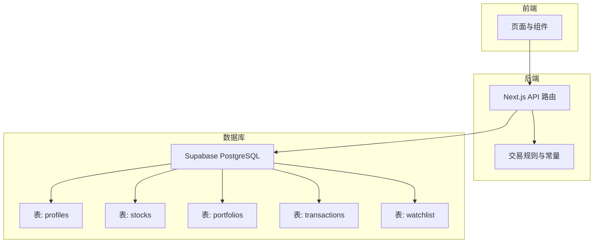
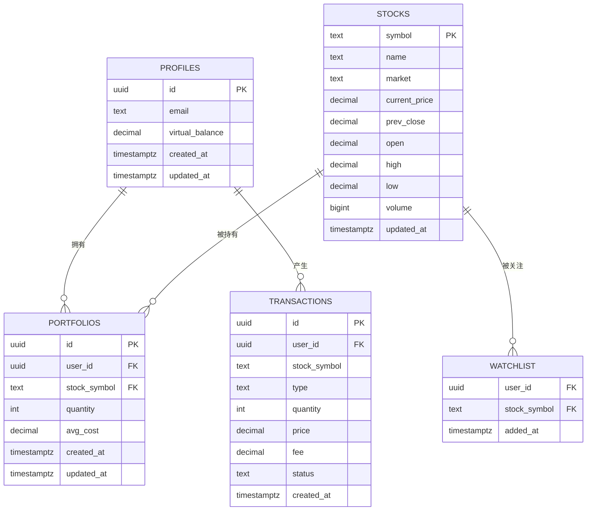
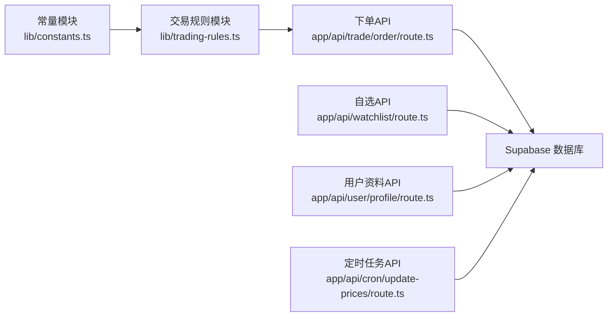

# 数据模型设计

<cite>
**本文引用的文件**
- [docs/prd.md](file://docs/prd.md)
- [lib/constants.ts](file://lib/constants.ts)
- [lib/trading-rules.ts](file://lib/trading-rules.ts)
- [types/index.ts](file://types/index.ts)
- [app/api/user/profile/route.ts](file://app/api/user/profile/route.ts)
- [app/api/watchlist/route.ts](file://app/api/watchlist/route.ts)
- [app/api/cron/update-prices/route.ts](file://app/api/cron/update-prices/route.ts)
- [app/api/stocks/route.ts](file://app/api/stocks/route.ts)
- [app/api/stocks/[symbol]/route.ts](file://app/api/stocks/[symbol]/route.ts)
- [app/api/trade/order/route.ts](file://app/api/trade/order/route.ts)
- [lib/supabase/client.ts](file://lib/supabase/client.ts)
</cite>

## 目录
1. [简介](#简介)
2. [项目结构](#项目结构)
3. [核心组件](#核心组件)
4. [架构总览](#架构总览)
5. [详细组件分析](#详细组件分析)
6. [依赖分析](#依赖分析)
7. [性能考虑](#性能考虑)
8. [故障排查指南](#故障排查指南)
9. [结论](#结论)
10. [附录](#附录)

## 简介
本文件为虚拟股票交易平台的数据模型设计文档，围绕核心数据实体与表结构进行系统化说明。依据项目PRD与代码实现，明确各表的字段定义、数据类型、约束条件与业务用途，解释主键、外键与唯一性约束，梳理表间关联关系与引用完整性策略（含ON DELETE CASCADE）。同时结合交易规则与业务逻辑（如T+1规则、涨跌停限制、手续费与印花税等），阐述数据模型如何支撑交易流程与风控要求。

## 项目结构
本项目采用Next.js + Supabase架构，数据层通过PostgreSQL（Supabase管理）实现，前端通过Supabase Realtime订阅实时更新。数据模型以profiles、stocks、portfolios、transactions、watchlist五张表为核心，配合交易规则与API路由共同实现完整的仿真交易闭环。

**图表来源**
- [docs/prd.md:96-166](file://docs/prd.md#L96-L166)
- [lib/trading-rules.ts:1-272](file://lib/trading-rules.ts#L1-L272)
- [lib/constants.ts:1-101](file://lib/constants.ts#L1-L101)

**章节来源**
- [docs/prd.md:96-166](file://docs/prd.md#L96-L166)

## 核心组件
本节对五大核心表逐一进行字段定义、数据类型、约束与业务用途说明，并给出建表语句路径与字段说明。

- profiles（用户扩展信息）
  - 字段与类型
    - id: UUID（主键，引用Supabase auth.users，ON DELETE CASCADE）
    - email: TEXT
    - virtual_balance: DECIMAL(18,2)，默认值为1000000.00
    - created_at: TIMESTAMPTZ，默认NOW()
    - updated_at: TIMESTAMPTZ，默认NOW()
  - 约束与用途
    - 主键：id
    - 外键：id -> auth.users ON DELETE CASCADE
    - 业务用途：存储用户虚拟资金余额与基本信息；初始虚拟资金在常量中设定
  - 建表语句路径
    - [docs/prd.md:102-111](file://docs/prd.md#L102-L111)

- stocks（股票基础信息）
  - 字段与类型
    - symbol: TEXT（主键）
    - name: TEXT NOT NULL
    - market: TEXT，默认'A'
    - current_price: DECIMAL(10,3)
    - prev_close: DECIMAL(10,3)
    - open: DECIMAL(10,3)
    - high: DECIMAL(10,3)
    - low: DECIMAL(10,3)
    - volume: BIGINT
    - updated_at: TIMESTAMPTZ，默认NOW()
  - 约束与用途
    - 主键：symbol
    - 业务用途：存储股票基础行情数据，支持定时任务批量更新
  - 建表语句路径
    - [docs/prd.md:113-127](file://docs/prd.md#L113-L127)

- portfolios（用户持仓）
  - 字段与类型
    - id: UUID（主键，默认gen_random_uuid()）
    - user_id: UUID（外键，REFERENCES profiles(id) ON DELETE CASCADE）
    - stock_symbol: TEXT（外键，REFERENCES stocks(symbol)）
    - quantity: INT NOT NULL，CHECK (quantity > 0)
    - avg_cost: DECIMAL(10,3) NOT NULL
    - created_at: TIMESTAMPTZ，默认NOW()
    - updated_at: TIMESTAMPTZ，默认NOW()
    - 唯一性：UNIQUE(user_id, stock_symbol)
  - 约束与用途
    - 主键：id
    - 外键：user_id -> profiles(id) ON DELETE CASCADE；stock_symbol -> stocks(symbol)
    - 唯一性：同一用户对同一股票仅允许一条持仓记录
    - 业务用途：记录用户的持有数量与成本价，用于计算市值与盈亏
  - 建表语句路径
    - [docs/prd.md:129-141](file://docs/prd.md#L129-L141)

- transactions（交易记录）
  - 字段与类型
    - id: UUID（主键，默认gen_random_uuid()）
    - user_id: UUID（外键，REFERENCES profiles(id) ON DELETE CASCADE）
    - stock_symbol: TEXT NOT NULL
    - type: TEXT，CHECK (type IN ('buy', 'sell'))
    - quantity: INT NOT NULL
    - price: DECIMAL(10,3) NOT NULL
    - fee: DECIMAL(10,3)，默认0
    - status: TEXT，默认'filled'
    - created_at: TIMESTAMPTZ，默认NOW()
  - 约束与用途
    - 主键：id
    - 外键：user_id -> profiles(id) ON DELETE CASCADE
    - 业务用途：记录每笔成交明细，支持查询历史成交与统计分析
  - 建表语句路径
    - [docs/prd.md:143-156](file://docs/prd.md#L143-L156)

- watchlist（自选股）
  - 字段与类型
    - user_id: UUID（外键，REFERENCES profiles(id) ON DELETE CASCADE）
    - stock_symbol: TEXT（外键，REFERENCES stocks(symbol) ON DELETE CASCADE）
    - added_at: TIMESTAMPTZ，默认NOW()
    - 主键：PRIMARY KEY(user_id, stock_symbol)
  - 约束与用途
    - 主键：(user_id, stock_symbol)
    - 外键：user_id -> profiles(id) ON DELETE CASCADE；stock_symbol -> stocks(symbol) ON DELETE CASCADE
    - 业务用途：记录用户关注的股票，支持自定义排序与实时行情更新
  - 建表语句路径
    - [docs/prd.md:158-166](file://docs/prd.md#L158-L166)

**章节来源**
- [docs/prd.md:96-166](file://docs/prd.md#L96-L166)
- [types/index.ts:1-166](file://types/index.ts#L1-L166)

## 架构总览
下图展示了数据模型在系统中的角色与交互关系，以及与交易规则、API路由的映射。

**图表来源**
- [docs/prd.md:102-166](file://docs/prd.md#L102-L166)

## 详细组件分析

### profiles 表
- 设计目的与业务用途
  - 存储用户虚拟资金账户信息，初始虚拟资金在常量中设定，确保新用户注册即有充足的仿真资金参与交易。
- 主键与外键
  - 主键：id（UUID）
  - 外键：id -> auth.users（ON DELETE CASCADE），保证用户删除时自动清理其资料
- 时间戳字段
  - created_at、updated_at：统一使用TIMESTAMPTZ，默认NOW()，便于审计与排序
- 字段精度与范围
  - virtual_balance：DECIMAL(18,2)，支持百万级资金且保留两位小数，满足仿真交易精度需求
- 与交易规则的关系
  - 交易时用于校验可用资金与增减虚拟余额，确保资金流闭环

**章节来源**
- [docs/prd.md:102-111](file://docs/prd.md#L102-L111)
- [lib/constants.ts:1-27](file://lib/constants.ts#L1-L27)

### stocks 表
- 设计目的与业务用途
  - 存储股票基础行情数据，支持定时任务批量更新，前端通过Realtime订阅实时展示
- 主键与外键
  - 主键：symbol（TEXT）
- 字段精度与范围
  - 价格字段（current_price、prev_close、open、high、low）：DECIMAL(10,3)，保留三位小数，满足A股价格精度
  - volume：BIGINT，支持大成交量
- 与交易规则的关系
  - 作为交易校验的基础数据源，用于涨跌停限制与市价单价格获取

**章节来源**
- [docs/prd.md:113-127](file://docs/prd.md#L113-L127)
- [app/api/cron/update-prices/route.ts:109-115](file://app/api/cron/update-prices/route.ts#L109-L115)

### portfolios 表
- 设计目的与业务用途
  - 记录用户对某股票的持仓数量与平均成本，用于计算市值、浮动盈亏与收益曲线
- 主键与外键
  - 主键：id（UUID）
  - 外键：user_id -> profiles(id)（ON DELETE CASCADE）；stock_symbol -> stocks(symbol)
- 唯一性约束
  - UNIQUE(user_id, stock_symbol)：防止重复持仓同一股票
- 字段精度与范围
  - quantity：INT，CHECK (quantity > 0)，确保持有数量为正
  - avg_cost：DECIMAL(10,3)，记录持仓加权平均成本
- 与交易规则的关系
  - 交易撮合后更新或新增持仓记录，支持T+1规则（通过其他逻辑实现）

**章节来源**
- [docs/prd.md:129-141](file://docs/prd.md#L129-L141)
- [app/api/trade/order/route.ts:166-197](file://app/api/trade/order/route.ts#L166-L197)

### transactions 表
- 设计目的与业务用途
  - 记录每笔成交明细，支持历史成交查询、统计分析与复盘
- 主键与外键
  - 主键：id（UUID）
  - 外键：user_id -> profiles(id)（ON DELETE CASCADE）
- 字段精度与范围
  - price、fee：DECIMAL(10,3)，满足交易金额与手续费精度
  - status：默认'filled'，支持'cancelled'、'partial'等状态
- 与交易规则的关系
  - 与orders表配合（PRD中提及），记录最终成交结果与费用

**章节来源**
- [docs/prd.md:143-156](file://docs/prd.md#L143-L156)
- [app/api/trade/order/route.ts:152-163](file://app/api/trade/order/route.ts#L152-L163)

### watchlist 表
- 设计目的与业务用途
  - 记录用户关注的股票，支持自定义排序与实时行情更新
- 主键与外键
  - 主键：(user_id, stock_symbol)
  - 外键：user_id -> profiles(id)（ON DELETE CASCADE）；stock_symbol -> stocks(symbol)（ON DELETE CASCADE）
- 与API的映射
  - API路由通过join查询关联股票详情并返回带涨跌幅的自选股列表

**章节来源**
- [docs/prd.md:158-166](file://docs/prd.md#L158-L166)
- [app/api/watchlist/route.ts:19-48](file://app/api/watchlist/route.ts#L19-L48)

### 交易规则与数据模型映射
- T+1规则
  - PRD中明确A股T+1规则，但当前交易API实现未直接体现买入时间记录与T+1校验逻辑。建议在portfolios或新增表中增加买入时间字段，以便在卖出校验时判断是否满足T+1。
- 涨跌停限制
  - 通过常量与规则函数计算涨跌停价格，交易API在下单时进行价格范围校验，确保委托价格在合理区间内。
- 手续费与印花税
  - 通过规则函数计算佣金与印花税，交易API在撮合后写入fee字段，确保资金与费用的准确性。

**章节来源**
- [lib/trading-rules.ts:145-247](file://lib/trading-rules.ts#L145-L247)
- [lib/constants.ts:1-27](file://lib/constants.ts#L1-L27)
- [app/api/trade/order/route.ts:91-104](file://app/api/trade/order/route.ts#L91-L104)

## 依赖分析
- 组件耦合与协作
  - API路由依赖交易规则模块与Supabase客户端，负责参数校验、业务规则判断与数据库写入
  - 数据模型通过外键与唯一性约束保证引用完整性与数据一致性
- 外部依赖与集成点
  - Supabase：PostgreSQL、Auth、Realtime、Row Level Security
  - 第三方行情API：定时任务从外部数据源拉取数据并批量更新stocks表

**图表来源**
- [lib/trading-rules.ts:1-272](file://lib/trading-rules.ts#L1-L272)
- [lib/constants.ts:1-101](file://lib/constants.ts#L1-L101)
- [app/api/trade/order/route.ts:1-331](file://app/api/trade/order/route.ts#L1-L331)
- [app/api/watchlist/route.ts:1-89](file://app/api/watchlist/route.ts#L1-L89)
- [app/api/user/profile/route.ts:1-42](file://app/api/user/profile/route.ts#L1-L42)
- [app/api/cron/update-prices/route.ts:109-115](file://app/api/cron/update-prices/route.ts#L109-L115)

**章节来源**
- [lib/trading-rules.ts:1-272](file://lib/trading-rules.ts#L1-L272)
- [lib/constants.ts:1-101](file://lib/constants.ts#L1-L101)
- [app/api/trade/order/route.ts:1-331](file://app/api/trade/order/route.ts#L1-L331)
- [app/api/watchlist/route.ts:1-89](file://app/api/watchlist/route.ts#L1-L89)
- [app/api/user/profile/route.ts:1-42](file://app/api/user/profile/route.ts#L1-L42)
- [app/api/cron/update-prices/route.ts:109-115](file://app/api/cron/update-prices/route.ts#L109-L115)

## 性能考虑
- 数据类型选择
  - DECIMAL(10,3)/DECIMAL(18,2)：兼顾精度与存储空间，避免浮点误差
  - BIGINT：支持大成交量与资金规模
- 索引与查询
  - 建议在profiles.id、portfolios.user_id、transactions.user_id、watchlist.user_id上建立索引，加速用户维度查询
  - 在stocks.symbol上保持主键索引，确保股票查询高效
- 实时性
  - stocks表开启Supabase Realtime，结合定时任务批量更新，降低前端轮询压力
- 写入性能
  - 交易撮合采用单条插入与更新，建议在高频场景下评估批量写入策略

## 故障排查指南
- 常见问题与定位
  - 未登录或鉴权失败：检查API路由中auth.getUser()返回，确认Supabase RLS策略与会话有效性
  - 股票不存在：下单时校验stocks表是否存在对应symbol
  - 资金不足：买入时校验profiles.virtual_balance是否大于等于总成本
  - 持仓不足：卖出时校验portfolios.quantity是否大于等于委托数量
  - 非交易时间：isTradingHour()返回false时禁止下单
  - 涨跌停超限：委托价格超出getUpperLimitPrice()/getLowerLimitPrice()范围
- 关键调用链参考
  - 下单API：POST /api/trade/order
  - 自选股API：GET /api/watchlist
  - 用户资料API：GET /api/user/profile
  - 定时更新API：GET /api/cron/update-prices

**章节来源**
- [app/api/trade/order/route.ts:43-49](file://app/api/trade/order/route.ts#L43-L49)
- [app/api/trade/order/route.ts:75-104](file://app/api/trade/order/route.ts#L75-L104)
- [app/api/trade/order/route.ts:212-242](file://app/api/trade/order/route.ts#L212-L242)
- [app/api/watchlist/route.ts:58-89](file://app/api/watchlist/route.ts#L58-L89)
- [app/api/user/profile/route.ts:4-41](file://app/api/user/profile/route.ts#L4-L41)
- [app/api/cron/update-prices/route.ts:109-115](file://app/api/cron/update-prices/route.ts#L109-L115)

## 结论
本数据模型以profiles、stocks、portfolios、transactions、watchlist为核心，通过明确的主外键关系与约束，支撑了完整的仿真交易流程。结合交易规则模块，实现了涨跌停限制、手续费与印花税计算、T+1规则等关键业务逻辑。建议在后续版本中完善T+1校验（如新增买入时间字段）与索引优化，进一步提升性能与可维护性。

## 附录
- 完整建表语句路径
  - [profiles:102-111](file://docs/prd.md#L102-L111)
  - [stocks:113-127](file://docs/prd.md#L113-L127)
  - [portfolios:129-141](file://docs/prd.md#L129-L141)
  - [transactions:143-156](file://docs/prd.md#L143-L156)
  - [watchlist:158-166](file://docs/prd.md#L158-L166)
- 关键类型定义路径
  - [types/index.ts:1-166](file://types/index.ts#L1-L166)
- Supabase客户端初始化
  - [lib/supabase/client.ts:1-9](file://lib/supabase/client.ts#L1-L9)