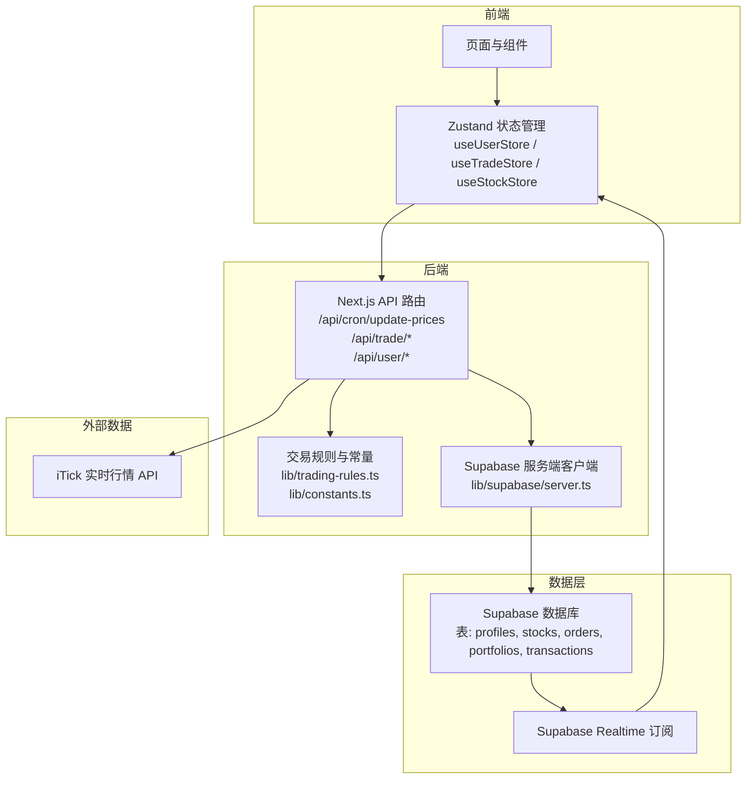
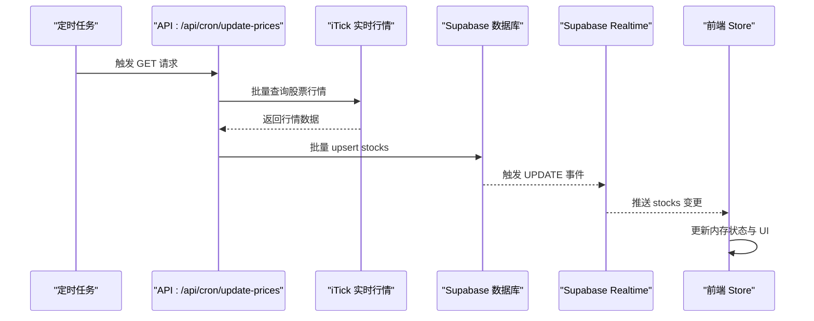
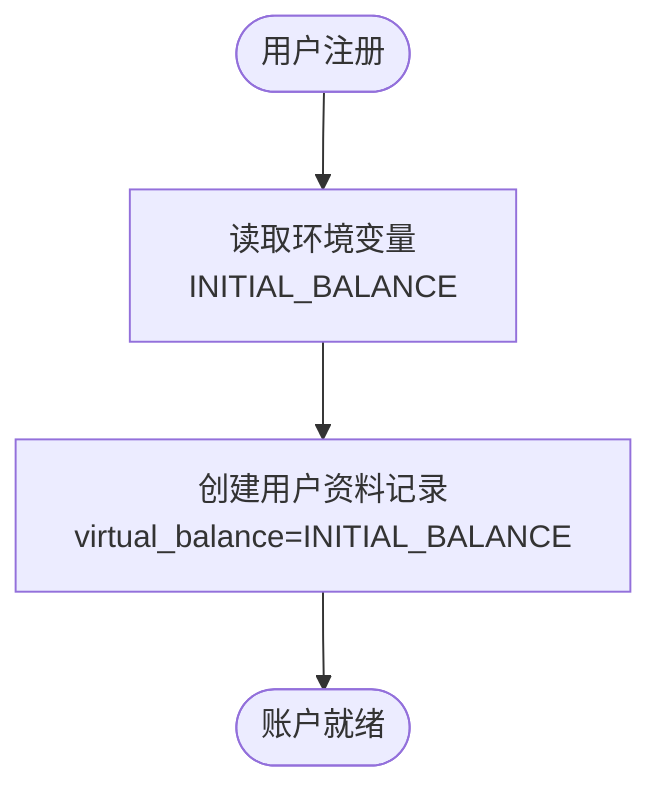
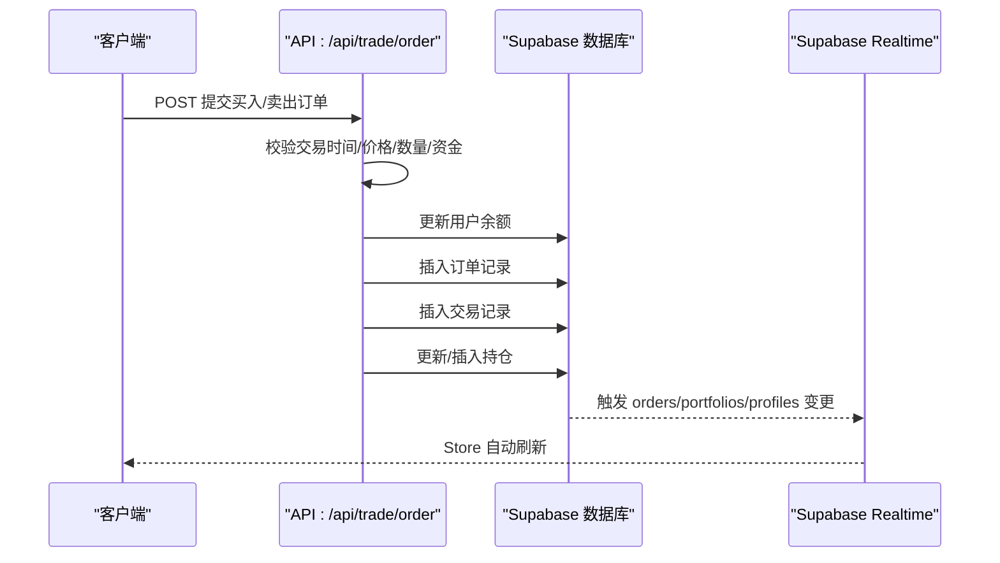
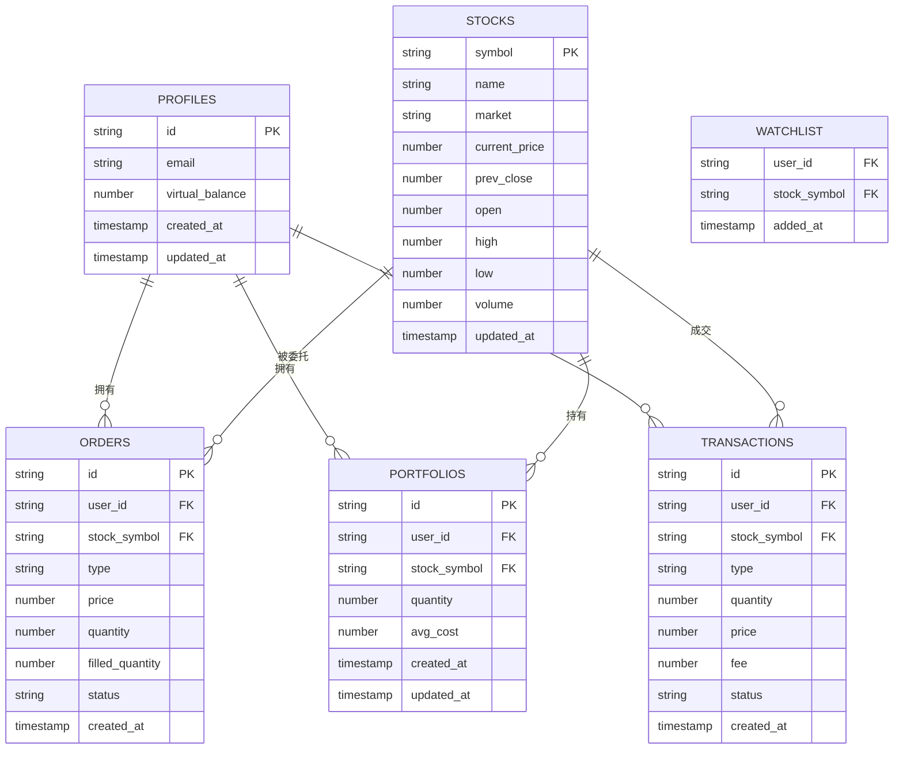
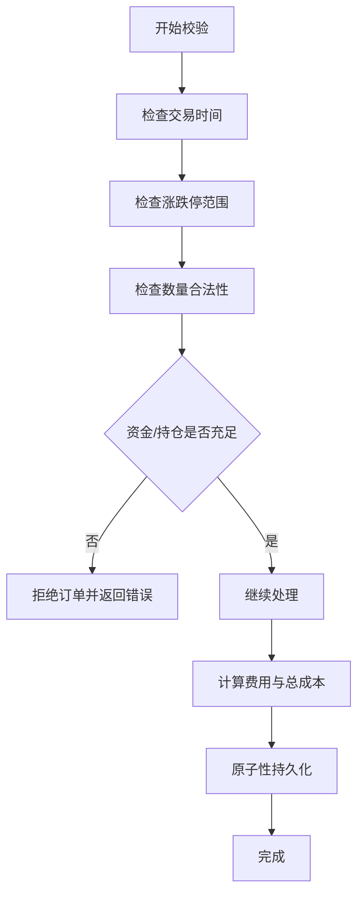
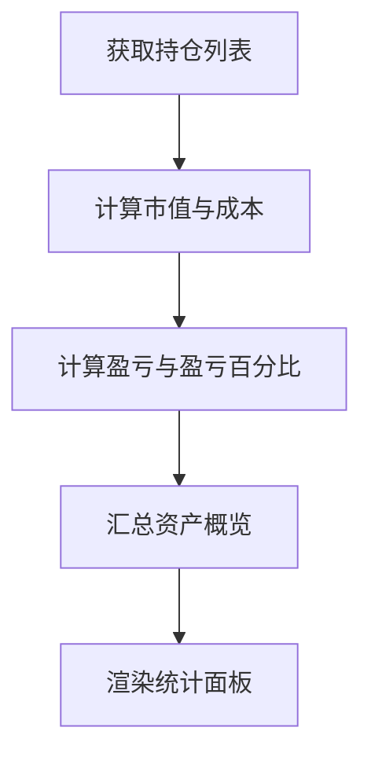
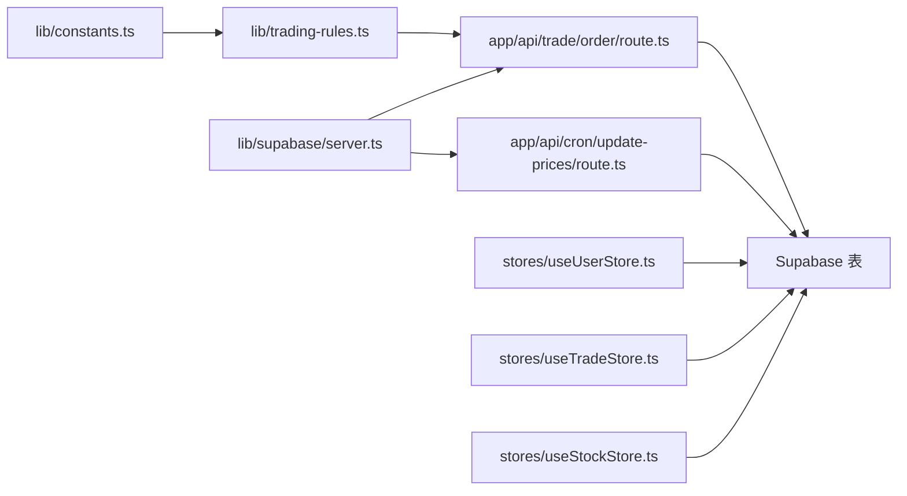

# 数据生命周期管理

<cite>
**本文引用的文件**
- [README.md](file://README.md)
- [package.json](file://package.json)
- [lib/constants.ts](file://lib/constants.ts)
- [lib/trading-rules.ts](file://lib/trading-rules.ts)
- [lib/supabase/server.ts](file://lib/supabase/server.ts)
- [types/index.ts](file://types/index.ts)
- [app/api/cron/update-prices/route.ts](file://app/api/cron/update-prices/route.ts)
- [app/api/user/profile/route.ts](file://app/api/user/profile/route.ts)
- [app/api/trade/order/route.ts](file://app/api/trade/order/route.ts)
- [app/api/trade/orders/route.ts](file://app/api/trade/orders/route.ts)
- [app/api/trade/positions/route.ts](file://app/api/trade/positions/route.ts)
- [stores/useUserStore.ts](file://stores/useUserStore.ts)
- [stores/useTradeStore.ts](file://stores/useTradeStore.ts)
- [stores/useStockStore.ts](file://stores/useStockStore.ts)
- [docs/数据源对接说明.md](file://docs/数据源对接说明.md)
- [docs/环境变量清单.md](file://docs/环境变量清单.md)
</cite>

## 目录
1. [简介](#简介)
2. [项目结构](#项目结构)
3. [核心组件](#核心组件)
4. [架构总览](#架构总览)
5. [详细组件分析](#详细组件分析)
6. [依赖关系分析](#依赖关系分析)
7. [性能考量](#性能考量)
8. [故障排查指南](#故障排查指南)
9. [结论](#结论)
10. [附录](#附录)

## 简介
本文件系统化梳理虚拟股票交易平台的数据生命周期管理策略，围绕数据的创建、更新、归档与清理，以及用户注册初始资金、交易数据生成与存储、备份与恢复、迁移与升级、数据质量控制、统计分析与隐私合规等维度展开。平台基于 Next.js + Supabase + Vercel 架构，采用 Supabase Realtime 实现实时数据订阅，通过定时任务拉取第三方行情数据并批量写入数据库。

## 项目结构
项目采用按功能域划分的目录组织方式，API 路由集中于 app/api 下，业务逻辑位于 lib，类型定义位于 types，状态管理位于 stores，文档位于 docs。

图表来源
- [app/api/cron/update-prices/route.ts:1-150](file://app/api/cron/update-prices/route.ts#L1-L150)
- [lib/supabase/server.ts:1-35](file://lib/supabase/server.ts#L1-L35)
- [stores/useStockStore.ts:1-184](file://stores/useStockStore.ts#L1-L184)
- [stores/useTradeStore.ts:1-192](file://stores/useTradeStore.ts#L1-L192)
- [stores/useUserStore.ts:1-110](file://stores/useUserStore.ts#L1-L110)

章节来源
- [README.md: 1-110:1-110](file://README.md#L1-L110)
- [package.json: 1-44:1-44](file://package.json#L1-L44)

## 核心组件
- 数据模型与类型：用户资料、股票、持仓、订单、交易记录、自选股等类型定义，支撑数据结构一致性与前后端契约。
- 交易规则与常量：交易时间、涨跌停、手续费、最小交易单位等规则，保障交易合法性与财务计算准确性。
- API 路由：定时更新股价、用户资料、交易下单、订单与持仓查询等，负责数据的创建、更新与查询。
- 状态管理：Zustand Store 封装用户资产概览、交易数据、股票订阅与价格更新，结合 Supabase Realtime 实现实时同步。
- Supabase 客户端：服务端客户端封装，确保在 API 路由中正确读写数据库并遵循 RLS 策略。

章节来源
- [types/index.ts: 1-166:1-166](file://types/index.ts#L1-L166)
- [lib/constants.ts: 1-101:1-101](file://lib/constants.ts#L1-L101)
- [lib/trading-rules.ts: 1-272:1-272](file://lib/trading-rules.ts#L1-L272)
- [lib/supabase/server.ts: 1-35:1-35](file://lib/supabase/server.ts#L1-L35)
- [stores/useUserStore.ts: 1-110:1-110](file://stores/useUserStore.ts#L1-L110)
- [stores/useTradeStore.ts: 1-192:1-192](file://stores/useTradeStore.ts#L1-L192)
- [stores/useStockStore.ts: 1-184:1-184](file://stores/useStockStore.ts#L1-L184)

## 架构总览
平台数据流以 Supabase 为核心，前端通过 Zustand Store 与 API 路由交互，API 路由通过 Supabase 服务端客户端访问数据库；定时任务在交易时段拉取第三方行情并批量写入 stocks 表，Supabase Realtime 将变更推送给前端 Store，实现数据的实时更新。

图表来源
- [app/api/cron/update-prices/route.ts:1-150](file://app/api/cron/update-prices/route.ts#L1-L150)
- [stores/useStockStore.ts:125-150](file://stores/useStockStore.ts#L125-L150)
- [docs/数据源对接说明.md:140-172](file://docs/数据源对接说明.md#L140-L172)

## 详细组件分析

### 数据创建与初始资金策略
- 用户注册时的初始虚拟资金来源于环境变量配置，交易常量中提供默认值，确保新用户账户具备充足的模拟交易额度。
- 用户资料查询 API 从 profiles 表读取用户信息，包含虚拟余额字段，作为交易与资产概览的基础。

图表来源
- [lib/constants.ts:3-4](file://lib/constants.ts#L3-L4)
- [app/api/user/profile/route.ts:1-42](file://app/api/user/profile/route.ts#L1-L42)

章节来源
- [lib/constants.ts: 3-4:3-4](file://lib/constants.ts#L3-L4)
- [app/api/user/profile/route.ts: 1-L42:1-42](file://app/api/user/profile/route.ts#L1-L42)

### 日常交易数据生成与更新
- 交易下单流程：校验交易时间、价格与数量合法性，计算费用，原子性地扣款/入金、创建订单、生成交易记录、更新或新增持仓。
- 订单与持仓查询：支持按状态过滤、分页查询，返回用户维度的委托与持仓明细。
- 股价更新：交易时段内定时拉取第三方行情，批量 upsert 到 stocks 表，触发 Realtime 事件，前端 Store 实时更新。

图表来源
- [app/api/trade/order/route.ts:1-331](file://app/api/trade/order/route.ts#L1-L331)
- [stores/useTradeStore.ts:144-186](file://stores/useTradeStore.ts#L144-L186)

章节来源
- [app/api/trade/order/route.ts: 1-L331:1-331](file://app/api/trade/order/route.ts#L1-L331)
- [app/api/trade/orders/route.ts: 1-L66:1-66](file://app/api/trade/orders/route.ts#L1-L66)
- [app/api/trade/positions/route.ts: 1-L46:1-46](file://app/api/trade/positions/route.ts#L1-L46)

### 数据存储策略与保留期限
- 表结构与字段：profiles（用户资料与虚拟余额）、stocks（实时/历史行情）、orders（委托记录）、portfolios（持仓）、transactions（交易记录）、watchlist（自选股）。
- 保留策略：当前仓库未定义明确的归档与清理策略。建议结合业务需求制定保留周期（如交易记录、订单、日志等），并配合数据库分区或归档表实现生命周期管理。

图表来源
- [types/index.ts:2-89](file://types/index.ts#L2-L89)

章节来源
- [types/index.ts: 1-L166:1-166](file://types/index.ts#L1-L166)

### 备份与恢复机制
- 当前仓库未提供显式的备份与恢复脚本或策略。建议结合 Supabase 的备份能力与外部存储（对象存储）实现定期备份与灾难恢复演练，确保在数据丢失或服务中断时能快速回滚与恢复。

[本节为通用建议，不直接分析具体文件]

### 数据迁移与升级策略
- Schema 变更与迁移脚本：当前仓库未包含数据库迁移脚本。建议采用 Supabase 的模式演进能力或引入迁移工具，确保字段扩展、索引优化与约束调整的可控与可追溯。
- 数据迁移：涉及字段重命名、类型变更或表拆分时，应先在预生产环境验证，再灰度发布到生产。

[本节为通用建议，不直接分析具体文件]

### 数据质量控制与验证
- 输入校验：交易下单前对交易时间、价格区间、数量合法性、资金/持仓充足性进行严格校验。
- 财务一致性：费用计算与总成本计算在规则模块中统一实现，减少误差。
- 实时一致性：通过 Supabase Realtime 订阅保证前端与后端状态一致，避免脏读与竞态。

图表来源
- [lib/trading-rules.ts:170-247](file://lib/trading-rules.ts#L170-L247)
- [app/api/trade/order/route.ts:91-104](file://app/api/trade/order/route.ts#L91-L104)

章节来源
- [lib/trading-rules.ts: 170-L247:170-247](file://lib/trading-rules.ts#L170-L247)
- [app/api/trade/order/route.ts: 91-L104:91-104](file://app/api/trade/order/route.ts#L91-L104)

### 数据统计与分析
- 用户资产概览：根据可用余额与持仓市值计算总资产、总盈亏与日收益等指标，用于前端展示。
- 交易统计：类型化定义了交易统计所需字段，可用于后续实现胜率、最大回撤、夏普比率等指标。
- 实时订阅：通过 Store 订阅 portfolios 与 orders 表变更，动态刷新统计数据。

图表来源
- [stores/useUserStore.ts:53-86](file://stores/useUserStore.ts#L53-L86)
- [stores/useTradeStore.ts:33-66](file://stores/useTradeStore.ts#L33-L66)

章节来源
- [stores/useUserStore.ts: 53-L86:53-86](file://stores/useUserStore.ts#L53-L86)
- [stores/useTradeStore.ts: 33-L66:33-66](file://stores/useTradeStore.ts#L33-L66)
- [types/index.ts: 102-L112:102-112](file://types/index.ts#L102-L112)

### 数据隐私保护与合规
- 用户数据删除与留存期：当前仓库未提供删除请求处理与数据留存期管理的具体实现。建议在用户申请删除时，清理其 profiles、orders、transactions、portfolios、watchlist 等关联数据，并遵守 GDPR/CCPA 等法规要求。
- 环境变量安全：服务端密钥不应暴露于前端，需通过环境变量与 Next.js 构建机制正确隔离。

章节来源
- [docs/环境变量清单.md: 128-L134:128-134](file://docs/环境变量清单.md#L128-L134)

## 依赖关系分析
- 组件耦合：API 路由依赖交易规则与 Supabase 客户端；Store 依赖 API 路由与 Supabase Realtime；交易规则与常量为纯函数，低耦合高内聚。
- 外部依赖：iTick API 用于行情数据；Supabase 提供数据库与 Realtime；Next.js 提供 API 路由与 SSR 能力。

图表来源
- [lib/trading-rules.ts:1-272](file://lib/trading-rules.ts#L1-L272)
- [lib/constants.ts:1-101](file://lib/constants.ts#L1-L101)
- [lib/supabase/server.ts:1-35](file://lib/supabase/server.ts#L1-L35)
- [app/api/trade/order/route.ts:1-331](file://app/api/trade/order/route.ts#L1-L331)
- [app/api/cron/update-prices/route.ts:1-150](file://app/api/cron/update-prices/route.ts#L1-L150)
- [stores/useUserStore.ts:1-110](file://stores/useUserStore.ts#L1-L110)
- [stores/useTradeStore.ts:1-192](file://stores/useTradeStore.ts#L1-L192)
- [stores/useStockStore.ts:1-184](file://stores/useStockStore.ts#L1-L184)

章节来源
- [lib/trading-rules.ts: 1-L272:1-272](file://lib/trading-rules.ts#L1-L272)
- [lib/constants.ts: 1-L101:1-101](file://lib/constants.ts#L1-L101)
- [lib/supabase/server.ts: 1-L35:1-35](file://lib/supabase/server.ts#L1-L35)
- [app/api/trade/order/route.ts: 1-L331:1-331](file://app/api/trade/order/route.ts#L1-L331)
- [app/api/cron/update-prices/route.ts: 1-L150:1-150](file://app/api/cron/update-prices/route.ts#L1-L150)
- [stores/useUserStore.ts: 1-L110:1-110](file://stores/useUserStore.ts#L1-L110)
- [stores/useTradeStore.ts: 1-L192:1-192](file://stores/useTradeStore.ts#L1-L192)
- [stores/useStockStore.ts: 1-L184:1-184](file://stores/useStockStore.ts#L1-L184)

## 性能考量
- 批量更新：定时任务按批次拉取行情并批量 upsert，减少数据库往返与锁竞争。
- 实时订阅：通过 Supabase Realtime 降低轮询开销，提升用户体验。
- 前端缓存：Store 内部状态与本地计算（如资产概览）减少重复请求。
- 交易路径：下单为单次事务写入，建议在高并发下评估数据库写入压力与索引策略。

[本节提供通用指导，不直接分析具体文件]

## 故障排查指南
- 定时任务未触发：检查 Cron 密钥与调度配置，确认交易时段判断逻辑。
- 行情拉取失败：关注第三方 API 超时与返回格式，记录错误日志并重试。
- 数据库写入失败：检查 upsert 字段映射与冲突键，确认 RLS 策略允许写入。
- 实时订阅未生效：确认频道名称与过滤条件，检查前端 Store 订阅回调。

章节来源
- [app/api/cron/update-prices/route.ts: 12-L27:12-27](file://app/api/cron/update-prices/route.ts#L12-L27)
- [docs/数据源对接说明.md: 238-L247:238-247](file://docs/数据源对接说明.md#L238-L247)
- [stores/useStockStore.ts: 125-L150:125-150](file://stores/useStockStore.ts#L125-L150)

## 结论
本项目已建立清晰的数据模型与交易流程，通过 Supabase Realtime 实现实时数据同步，并在交易时段内定时拉取第三方行情。建议在后续迭代中补充数据生命周期策略（归档/清理）、备份与恢复方案、数据库迁移脚本与数据隐私合规机制，以满足生产级数据治理要求。

## 附录
- 环境变量清单与安全配置参考文档，涵盖 Supabase、iTick、功能开关等关键变量及其作用域与获取方式。

章节来源
- [docs/环境变量清单.md: 1-L153:1-153](file://docs/环境变量清单.md#L1-L153)