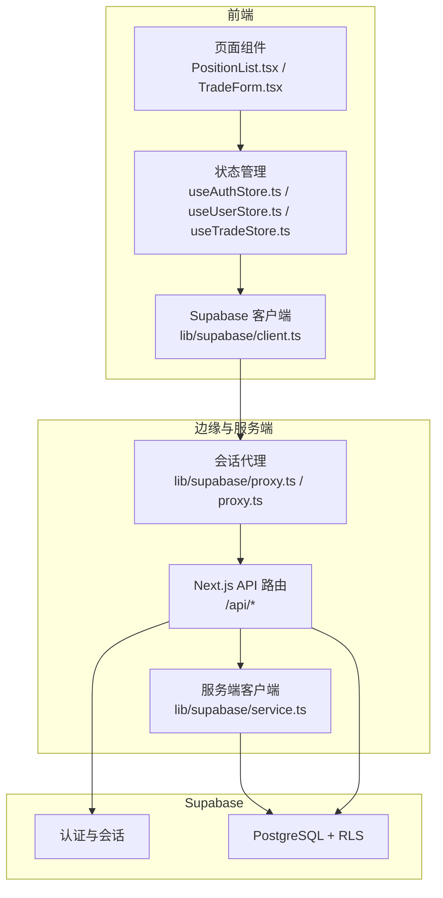
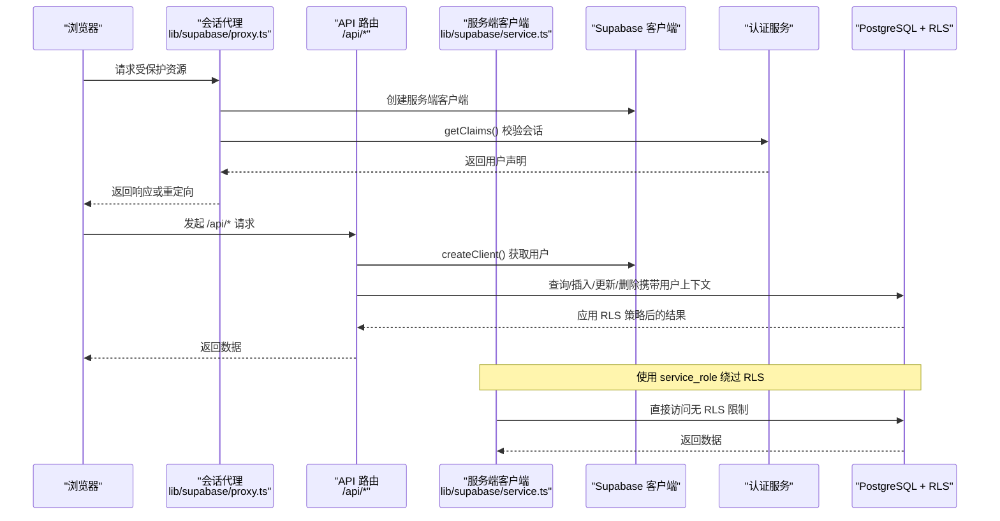
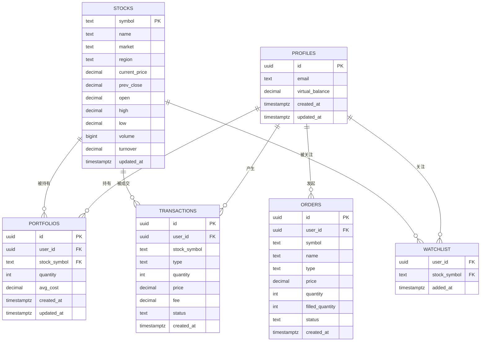
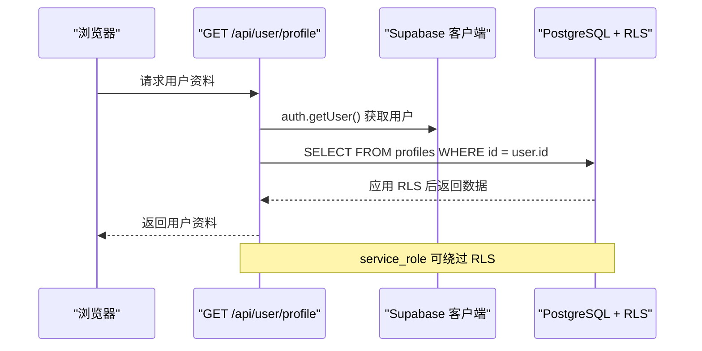
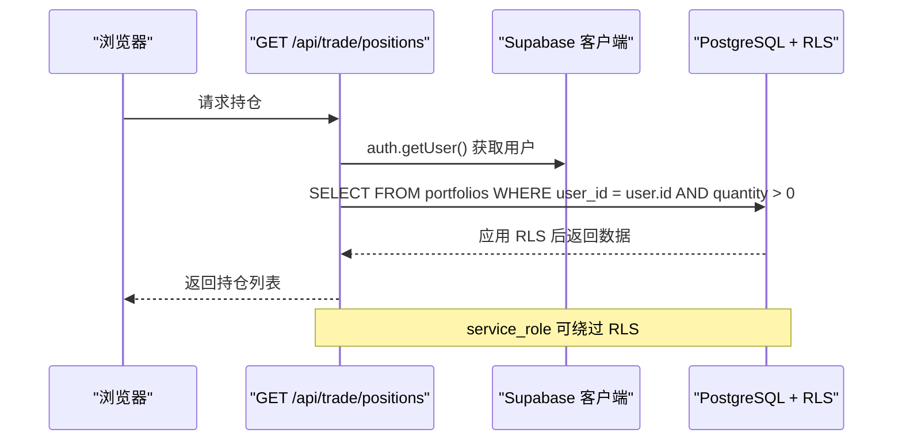
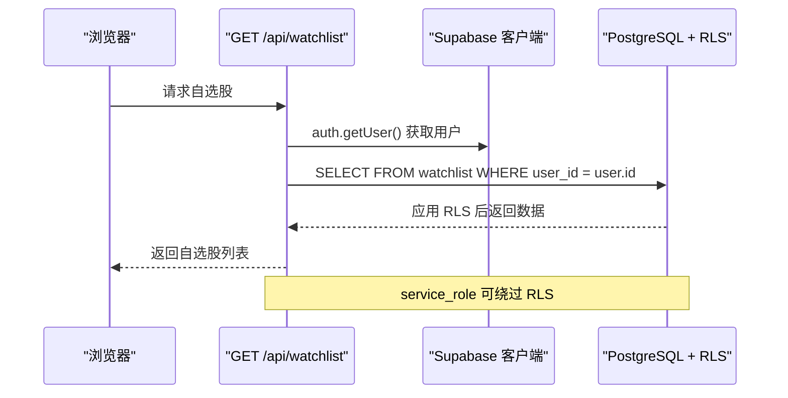
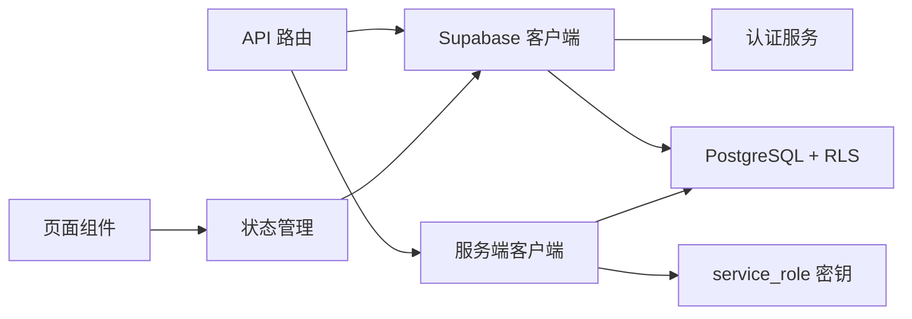

# 行级安全策略

<cite>
**本文引用的文件**
- [lib/supabase/client.ts](file://lib/supabase/client.ts)
- [lib/supabase/proxy.ts](file://lib/supabase/proxy.ts)
- [lib/supabase/service.ts](file://lib/supabase/service.ts)
- [stores/useAuthStore.ts](file://stores/useAuthStore.ts)
- [stores/useUserStore.ts](file://stores/useUserStore.ts)
- [stores/useTradeStore.ts](file://stores/useTradeStore.ts)
- [types/index.ts](file://types/index.ts)
- [app/api/user/profile/route.ts](file://app/api/user/profile/route.ts)
- [app/api/watchlist/route.ts](file://app/api/watchlist/route.ts)
- [app/api/watchlist/[symbol]/route.ts](file://app/api/watchlist/[symbol]/route.ts)
- [app/api/trade/positions/route.ts](file://app/api/trade/positions/route.ts)
- [app/api/trade/orders/route.ts](file://app/api/trade/orders/route.ts)
- [app/api/trade/order/route.ts](file://app/api/trade/order/route.ts)
- [components/portfolio/PositionList.tsx](file://components/portfolio/PositionList.tsx)
- [components/trade/TradeForm.tsx](file://components/trade/TradeForm.tsx)
- [components/auth-button.tsx](file://components/auth-button.tsx)
- [proxy.ts](file://proxy.ts)
- [docs/prd.md](file://docs/prd.md)
- [components/tutorial/fetch-data-steps.tsx](file://components/tutorial/fetch-data-steps.tsx)
- [supabase/schema.sql](file://supabase/schema.sql)
- [supabase/fix-rls-service-role.sql](file://supabase/fix-rls-service-role.sql)
</cite>

## 更新摘要
**变更内容**
- 更新RLS策略语法：将`auth.role()`替换为`(SELECT auth.role())`以兼容新版本Supabase
- 新增服务端客户端实现：提供使用service_role绕过RLS的服务端访问
- 完善RLS策略文档：详细说明兼容性改进和最佳实践

## 目录
1. [引言](#引言)
2. [项目结构](#项目结构)
3. [核心组件](#核心组件)
4. [架构总览](#架构总览)
5. [详细组件分析](#详细组件分析)
6. [依赖关系分析](#依赖关系分析)
7. [性能考量](#性能考量)
8. [故障排查指南](#故障排查指南)
9. [结论](#结论)
10. [附录](#附录)

## 引言
本文件围绕 Supabase 数据库的行级安全策略（Row Level Security, RLS）进行系统化说明，结合项目中的实际表结构与 API 调用路径，解释如何通过 RLS 实现用户数据隔离、多租户隔离与数据安全保护。重点涵盖：
- RLS 策略的配置原理与实现方式
- auth.uid() 与 auth.role() 在策略中的作用与最佳实践
- 各表（profiles、portfolios、watchlist、orders、transactions、stocks）的策略设计思路
- 策略执行顺序与优先级、冲突规避
- 完整策略 SQL 示例（SELECT/INSERT/UPDATE/DELETE）
- RLS 与应用层权限控制的协作方式
- 多租户隔离与调试方法、常见问题与解决方案
- **新增**：兼容性改进：auth.role() 到 (SELECT auth.role()) 的语法升级

## 项目结构
项目采用 Next.js App Router 架构，前端通过 Supabase 客户端与服务端代理访问数据库。RLS 策略在数据库层面生效，应用层通过 API 路由与客户端 SDK 进行鉴权与数据访问。新增的服务端客户端支持使用 service_role 绕过 RLS 进行后台操作。

**图表来源**
- [lib/supabase/client.ts:1-9](file://lib/supabase/client.ts#L1-L9)
- [lib/supabase/proxy.ts:1-77](file://lib/supabase/proxy.ts#L1-L77)
- [lib/supabase/service.ts:1-22](file://lib/supabase/service.ts#L1-L22)
- [proxy.ts:1-20](file://proxy.ts#L1-L20)
- [stores/useAuthStore.ts:1-103](file://stores/useAuthStore.ts#L1-L103)
- [stores/useUserStore.ts:1-110](file://stores/useUserStore.ts#L1-L110)
- [stores/useTradeStore.ts:1-192](file://stores/useTradeStore.ts#L1-L192)
- [app/api/user/profile/route.ts:1-42](file://app/api/user/profile/route.ts#L1-L42)
- [app/api/watchlist/route.ts:1-129](file://app/api/watchlist/route.ts#L1-L129)
- [app/api/watchlist/[symbol]/route.ts:1-50](file://app/api/watchlist/[symbol]/route.ts#L1-L50)
- [app/api/trade/positions/route.ts:1-45](file://app/api/trade/positions/route.ts#L1-L45)
- [app/api/trade/orders/route.ts:1-66](file://app/api/trade/orders/route.ts#L1-L66)
- [app/api/trade/order/route.ts:46-330](file://app/api/trade/order/route.ts#L46-L330)

**章节来源**
- [lib/supabase/client.ts:1-9](file://lib/supabase/client.ts#L1-L9)
- [lib/supabase/proxy.ts:1-77](file://lib/supabase/proxy.ts#L1-L77)
- [lib/supabase/service.ts:1-22](file://lib/supabase/service.ts#L1-L22)
- [proxy.ts:1-20](file://proxy.ts#L1-L20)
- [stores/useAuthStore.ts:1-103](file://stores/useAuthStore.ts#L1-L103)
- [stores/useUserStore.ts:1-110](file://stores/useUserStore.ts#L1-L110)
- [stores/useTradeStore.ts:1-192](file://stores/useTradeStore.ts#L1-L192)

## 核心组件
- Supabase 客户端与代理
  - 浏览器端客户端用于 Realtime 订阅与查询
  - 服务端代理负责会话同步与登录态校验
- **新增**：服务端客户端
  - 使用 service_role 密钥创建客户端实例
  - 绕过 RLS 策略，用于后台任务和系统操作
  - 仅在服务端 API 路由中使用，不暴露给客户端
- 认证与会话状态管理
  - useAuthStore 管理登录态与用户信息
  - useUserStore 与 useTradeStore 管理用户资料与交易相关数据
- API 路由
  - 各 /api/* 路由统一通过 Supabase 服务端客户端获取当前用户并进行数据访问
- 数据模型
  - types/index.ts 定义了 profiles、portfolios、watchlist、orders、transactions、stocks 等类型

**章节来源**
- [lib/supabase/client.ts:1-9](file://lib/supabase/client.ts#L1-L9)
- [lib/supabase/proxy.ts:1-77](file://lib/supabase/proxy.ts#L1-L77)
- [lib/supabase/service.ts:1-22](file://lib/supabase/service.ts#L1-L22)
- [stores/useAuthStore.ts:1-103](file://stores/useAuthStore.ts#L1-L103)
- [stores/useUserStore.ts:1-110](file://stores/useUserStore.ts#L1-L110)
- [stores/useTradeStore.ts:1-192](file://stores/useTradeStore.ts#L1-L192)
- [types/index.ts:1-166](file://types/index.ts#L1-L166)

## 架构总览
下图展示了从浏览器到数据库的请求链路，强调 RLS 在数据库层对每条查询进行强制访问控制，并展示服务端客户端绕过 RLS 的能力：

**图表来源**
- [lib/supabase/proxy.ts:5-76](file://lib/supabase/proxy.ts#L5-L76)
- [lib/supabase/service.ts:3-21](file://lib/supabase/service.ts#L3-L21)
- [proxy.ts:1-20](file://proxy.ts#L1-L20)
- [app/api/user/profile/route.ts:5-33](file://app/api/user/profile/route.ts#L5-L33)
- [app/api/watchlist/route.ts:9-34](file://app/api/watchlist/route.ts#L9-L34)
- [app/api/trade/positions/route.ts:9-37](file://app/api/trade/positions/route.ts#L9-L37)

## 详细组件分析

### 数据模型与表关系

**图表来源**
- [docs/prd.md:102-166](file://docs/prd.md#L102-L166)
- [types/index.ts:2-89](file://types/index.ts#L2-L89)

**章节来源**
- [docs/prd.md:96-166](file://docs/prd.md#L96-L166)
- [types/index.ts:1-166](file://types/index.ts#L1-L166)

### RLS 策略设计与执行顺序
- 策略启用
  - 对每张涉及用户数据的表启用 RLS：ALTER TABLE ... ENABLE ROW LEVEL SECURITY
- 策略类型
  - FOR SELECT：限定可见范围（如按 user_id 或 id 等）
  - FOR INSERT：限定可插入的字段与来源（如仅允许当前用户）
  - FOR UPDATE：限定可更新的范围与条件
  - FOR DELETE：限定可删除的范围
  - **新增**：FOR ALL：对所有操作类型应用策略
- 执行顺序与优先级
  - PostgreSQL 会对同一操作类型（如 SELECT）应用多个策略，最终结果是"允许集合"的交集与"拒绝集合"的并集。建议：
    - 将"允许"策略放在前面，尽量缩小范围
    - 将"拒绝"策略作为兜底，避免误放
    - 避免策略冲突：不要对同一范围同时出现允许与拒绝
- **更新**：auth.role() 兼容性改进
  - 新版本 Supabase 中需要使用 `(SELECT auth.role())` 而不是 `auth.role()`
  - 保持相同安全功能的同时确保与最新基础设施的兼容性
  - 主要用于 service_role 的策略判断
- auth.uid() 的使用
  - 在策略表达式中使用 auth.uid() 获取当前认证用户的 ID，实现用户级隔离
  - 与应用层的会话同步配合，确保策略上下文正确传递

**章节来源**
- [docs/prd.md:168-177](file://docs/prd.md#L168-L177)
- [components/tutorial/fetch-data-steps.tsx:82-123](file://components/tutorial/fetch-data-steps.tsx#L82-L123)
- [supabase/fix-rls-service-role.sql:2-31](file://supabase/fix-rls-service-role.sql#L2-L31)
- [supabase/schema.sql:121-143](file://supabase/schema.sql#L121-L143)

### profiles 表：用户资料隔离
- 设计目标
  - 每个用户只能访问自己的资料
- 策略要点
  - SELECT/UPDATE 使用 auth.uid() = id
  - **新增**：service_role 使用 `(SELECT auth.role()) = 'service_role'` 绕过策略
- 应用层体现
  - API 路由通过 Supabase 服务端客户端获取当前用户并按 id 查询
  - 前端通过 useUserStore 订阅 profile 变更

**图表来源**
- [app/api/user/profile/route.ts:5-33](file://app/api/user/profile/route.ts#L5-L33)
- [stores/useUserStore.ts:20-37](file://stores/useUserStore.ts#L20-L37)
- [supabase/schema.sql:127](file://supabase/schema.sql#L127)

**章节来源**
- [app/api/user/profile/route.ts:1-42](file://app/api/user/profile/route.ts#L1-L42)
- [stores/useUserStore.ts:1-110](file://stores/useUserStore.ts#L1-L110)
- [docs/prd.md:168-177](file://docs/prd.md#L168-L177)
- [supabase/schema.sql:124-127](file://supabase/schema.sql#L124-L127)

### portfolios 表：持仓数据隔离
- 设计目标
  - 用户只能看到自己的持仓
- 策略要点
  - SELECT/UPDATE/DELETE 使用 auth.uid() = user_id
  - **新增**：service_role 使用 `(SELECT auth.role()) = 'service_role'` 绕过策略
- 应用层体现
  - API 路由按 user_id 查询并过滤 quantity > 0
  - 前端通过 useTradeStore 订阅 portfolios 变化

**图表来源**
- [app/api/trade/positions/route.ts:5-37](file://app/api/trade/positions/route.ts#L5-L37)
- [stores/useTradeStore.ts:144-164](file://stores/useTradeStore.ts#L144-L164)
- [supabase/schema.sql:135](file://supabase/schema.sql#L135)

**章节来源**
- [app/api/trade/positions/route.ts:1-45](file://app/api/trade/positions/route.ts#L1-L45)
- [stores/useTradeStore.ts:1-192](file://stores/useTradeStore.ts#L1-L192)

### watchlist 表：自选股隔离
- 设计目标
  - 用户只能管理自己的自选股
- 策略要点
  - SELECT/INSERT 使用 auth.uid() = user_id
  - **新增**：service_role 使用 `(SELECT auth.role()) = 'service_role'` 绕过策略
- 应用层体现
  - GET：按 user_id 查询并关联 stocks
  - POST：upsert(user_id, stock_symbol) 冲突处理
  - DELETE：按 user_id 与 stock_symbol 删除

**图表来源**
- [app/api/watchlist/route.ts:4-48](file://app/api/watchlist/route.ts#L4-L48)
- [app/api/watchlist/[symbol]/route.ts:4-41](file://app/api/watchlist/[symbol]/route.ts#L4-L41)
- [supabase/schema.sql:131](file://supabase/schema.sql#L131)

**章节来源**
- [app/api/watchlist/route.ts:1-129](file://app/api/watchlist/route.ts#L1-L129)
- [app/api/watchlist/[symbol]/route.ts:1-50](file://app/api/watchlist/[symbol]/route.ts#L1-L50)

### orders 与 transactions 表：委托与成交隔离
- 设计目标
  - 用户只能查看/修改自己的委托与成交记录
- 策略要点
  - SELECT/UPDATE 使用 auth.uid() = user_id
  - **新增**：service_role 使用 `(SELECT auth.role()) = 'service_role'` 绕过策略
- 应用层体现
  - GET /api/trade/orders：按 user_id 过滤并分页
  - 交易流程中写入 orders 与 transactions，均受 RLS 保护

**图表来源**
- [app/api/trade/orders/route.ts:4-57](file://app/api/trade/orders/route.ts#L4-L57)
- [supabase/schema.sql:139](file://supabase/schema.sql#L139)

**章节来源**
- [app/api/trade/orders/route.ts:1-66](file://app/api/trade/orders/route.ts#L1-L66)

### stocks 表：公开行情数据
- 设计目标
  - 股票基础信息可公开查询，但不暴露敏感字段
- 策略要点
  - SELECT 可允许匿名或受限访问（根据业务需求）
  - INSERT/UPDATE/DELETE 严格限制（管理员或后台）
  - **新增**：service_role 使用 `(SELECT auth.role()) = 'service_role'` 绕过策略
- 应用层体现
  - watchlist 与 positions 接口通过关联查询获取行情

**章节来源**
- [docs/prd.md:113-127](file://docs/prd.md#L113-L127)
- [app/api/watchlist/route.ts:19-48](file://app/api/watchlist/route.ts#L19-L48)
- [app/api/trade/positions/route.ts:19-37](file://app/api/trade/positions/route.ts#L19-L37)
- [supabase/schema.sql:121-122](file://supabase/schema.sql#L121-L122)

### 多租户隔离与数据安全
- 多租户思路
  - 通过 user_id 字段实现天然的租户隔离
  - 所有涉及用户数据的查询均以 user_id 作为过滤条件
- 安全边界
  - 应用层与数据库层双重校验：API 路由获取用户 + RLS 策略
  - 会话代理确保浏览器与服务端会话一致，防止会话漂移
- **新增**：服务端访问控制
  - 使用 service_role 绕过 RLS 进行后台任务
  - 仅在服务端 API 路由中使用，确保安全性

**章节来源**
- [lib/supabase/proxy.ts:5-76](file://lib/supabase/proxy.ts#L5-L76)
- [lib/supabase/service.ts:3-21](file://lib/supabase/service.ts#L3-L21)
- [proxy.ts:1-20](file://proxy.ts#L1-L20)

## 依赖关系分析
- 组件耦合
  - API 路由依赖 Supabase 服务端客户端与认证服务
  - **新增**：服务端客户端依赖环境变量中的 service_role 密钥
  - 前端 Store 依赖 Supabase 浏览器客户端与 Realtime 订阅
- 外部依赖
  - Supabase PostgreSQL、Auth、Realtime
  - 第三方行情数据源（PRD 中提及）
- 潜在循环依赖
  - 未发现直接循环依赖；各模块职责清晰

**图表来源**
- [lib/supabase/client.ts:1-9](file://lib/supabase/client.ts#L1-L9)
- [lib/supabase/proxy.ts:1-77](file://lib/supabase/proxy.ts#L1-L77)
- [lib/supabase/service.ts:7-21](file://lib/supabase/service.ts#L7-L21)
- [stores/useAuthStore.ts:1-103](file://stores/useAuthStore.ts#L1-L103)
- [stores/useUserStore.ts:1-110](file://stores/useUserStore.ts#L1-L110)
- [stores/useTradeStore.ts:1-192](file://stores/useTradeStore.ts#L1-L192)

**章节来源**
- [lib/supabase/client.ts:1-9](file://lib/supabase/client.ts#L1-L9)
- [lib/supabase/proxy.ts:1-77](file://lib/supabase/proxy.ts#L1-L77)
- [lib/supabase/service.ts:1-22](file://lib/supabase/service.ts#L1-L22)
- [stores/useAuthStore.ts:1-103](file://stores/useAuthStore.ts#L1-L103)
- [stores/useUserStore.ts:1-110](file://stores/useUserStore.ts#L1-L110)
- [stores/useTradeStore.ts:1-192](file://stores/useTradeStore.ts#L1-L192)

## 性能考量
- RLS 开销
  - 策略评估发生在查询计划执行前，通常影响较小
  - 建议为 user_id、id 等常用过滤字段建立索引
- **更新**：auth.role() 语法优化
  - 使用 `(SELECT auth.role())` 语法确保与新版本 Supabase 兼容
  - 性能开销与直接调用相同，但确保功能稳定性
- Realtime 订阅
  - 使用事件过滤（如 filter: user_id=eq.{userId}）降低订阅负载
- 查询优化
  - 仅选择必要字段，避免 SELECT *
  - 合理使用 LIMIT、OFFSET 或游标分页

[本节为通用指导，无需特定文件来源]

## 故障排查指南
- 常见问题
  - 未登录或会话失效：检查代理与认证声明获取逻辑
  - 查询无数据：确认 RLS 策略是否正确启用且表达式匹配
  - 权限冲突：检查同一范围是否存在允许与拒绝策略
  - **新增**：auth.role() 语法错误：确认使用 `(SELECT auth.role())` 而非 `auth.role()`
  - **新增**：service_role 访问失败：检查环境变量配置和密钥有效性
- 调试方法
  - 在 API 路由中打印用户 ID 与查询条件，核对策略上下文
  - 使用 Supabase SQL Editor 手动执行策略表达式验证
  - 通过 Realtime 订阅观察数据变更事件是否按预期触发
  - **新增**：测试 service_role 访问：使用服务端客户端验证绕过 RLS 功能
- 会话同步
  - 确保代理返回的响应对象包含原始 cookies，避免浏览器与服务端会话不同步

**章节来源**
- [lib/supabase/proxy.ts:45-76](file://lib/supabase/proxy.ts#L45-L76)
- [lib/supabase/service.ts:11-13](file://lib/supabase/service.ts#L11-L13)
- [components/auth-button.tsx:6-29](file://components/auth-button.tsx#L6-L29)
- [components/tutorial/fetch-data-steps.tsx:82-123](file://components/tutorial/fetch-data-steps.tsx#L82-L123)
- [supabase/fix-rls-service-role.sql:2-31](file://supabase/fix-rls-service-role.sql#L2-L31)

## 结论
本项目通过 Supabase 的 RLS 与应用层认证、状态管理、API 路由协同，实现了完善的用户数据隔离与多租户保护。**最新的兼容性改进**确保了与新版本 Supabase 的无缝集成，通过将 `auth.role()` 更新为 `(SELECT auth.role())` 语法，既保持了相同的安全功能，又确保了与最新基础设施的兼容性。新增的服务端客户端支持使用 service_role 绕过 RLS 进行后台操作，为复杂的业务场景提供了灵活的解决方案。遵循"策略先行、上下文一致、事件过滤、语法兼容"的原则，可在保证安全的同时获得良好的开发体验与运行性能。

[本节为总结，无需特定文件来源]

## 附录

### RLS 策略 SQL 示例（含兼容性改进）
- profiles 表
  - 启用 RLS：ALTER TABLE profiles ENABLE ROW LEVEL SECURITY
  - SELECT 策略：FOR SELECT USING (auth.uid() = id)
  - UPDATE 策略：FOR UPDATE USING (auth.uid() = id)
  - **新增**：service_role 策略：FOR ALL USING ((SELECT auth.role()) = 'service_role')
- portfolios 表
  - SELECT/UPDATE/DELETE 策略：FOR SELECT/UPDATE/DELETE USING (auth.uid() = user_id)
  - **新增**：service_role 策略：FOR ALL USING ((SELECT auth.role()) = 'service_role')
- watchlist 表
  - SELECT/INSERT 策略：FOR SELECT/INSERT USING (auth.uid() = user_id)
  - **新增**：service_role 策略：FOR ALL USING ((SELECT auth.role()) = 'service_role')
- orders/transactions 表
  - SELECT/UPDATE 策略：FOR SELECT/UPDATE USING (auth.uid() = user_id)
  - **新增**：service_role 策略：FOR ALL USING ((SELECT auth.role()) = 'service_role')
- stocks 表
  - SELECT 策略：FOR SELECT USING (true)
  - **新增**：service_role 策略：FOR ALL USING ((SELECT auth.role()) = 'service_role')

**章节来源**
- [docs/prd.md:168-177](file://docs/prd.md#L168-L177)
- [supabase/schema.sql:121-143](file://supabase/schema.sql#L121-L143)
- [supabase/fix-rls-service-role.sql:2-31](file://supabase/fix-rls-service-role.sql#L2-L31)

### 服务端客户端使用指南
- 创建服务端客户端
  - 使用 `createServiceClient()` 函数创建客户端实例
  - 自动使用 service_role 密钥，绕过 RLS 策略
  - 仅在服务端 API 路由中使用，不要暴露给客户端
- 环境变量配置
  - `NEXT_PUBLIC_SUPABASE_URL`：Supabase 项目 URL
  - `SUPABASE_SERVICE_ROLE_KEY`：service_role 密钥
- 使用场景
  - 后台任务执行
  - 系统维护操作
  - 数据批量处理
  - 跨用户数据访问

**章节来源**
- [lib/supabase/service.ts:1-22](file://lib/supabase/service.ts#L1-L22)