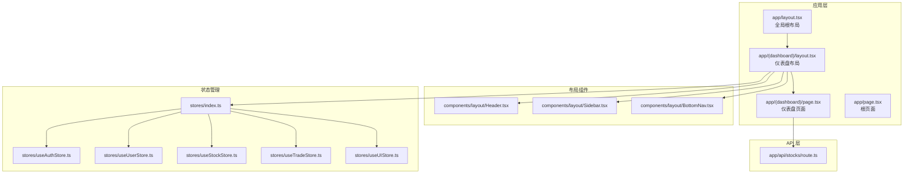
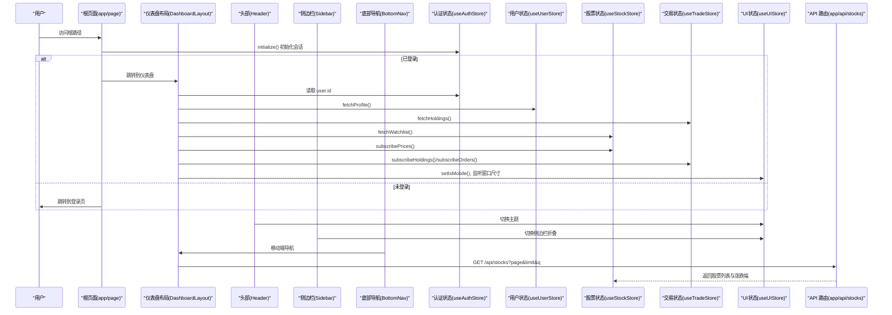
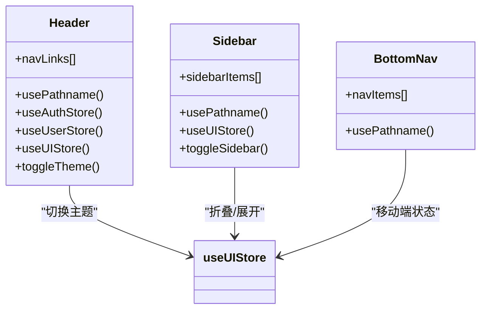
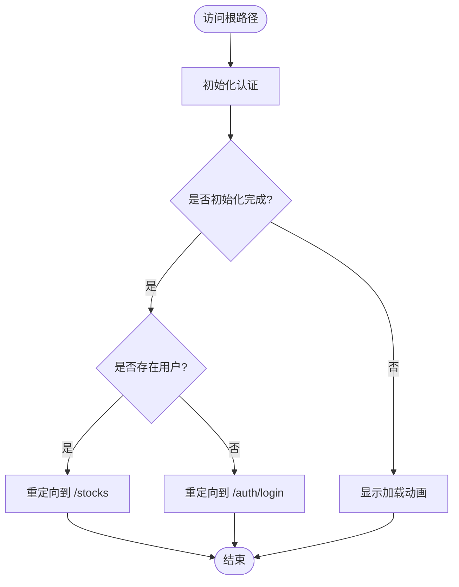
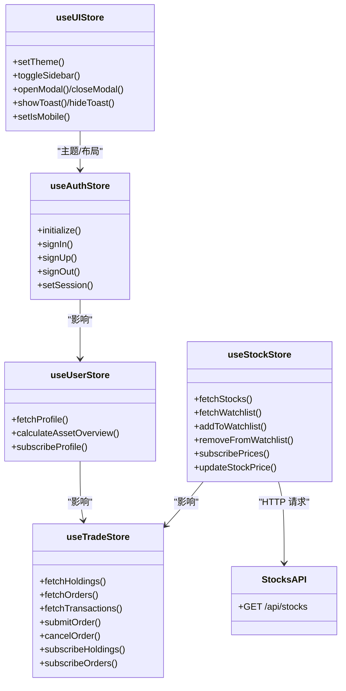
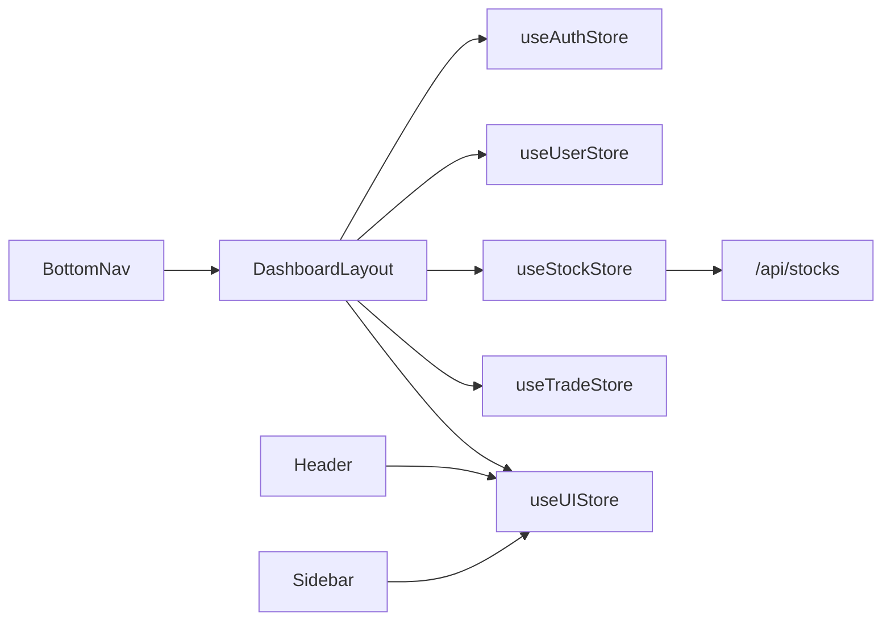

# 前端架构

<cite>
**本文引用的文件**
- [app/layout.tsx](file://app/layout.tsx)
- [app/(dashboard)/layout.tsx](file://app/(dashboard)/layout.tsx)
- [app/(dashboard)/page.tsx](file://app/(dashboard)/page.tsx)
- [app/page.tsx](file://app/page.tsx)
- [components/layout/Header.tsx](file://components/layout/Header.tsx)
- [components/layout/Sidebar.tsx](file://components/layout/Sidebar.tsx)
- [components/layout/BottomNav.tsx](file://components/layout/BottomNav.tsx)
- [stores/index.ts](file://stores/index.ts)
- [stores/useAuthStore.ts](file://stores/useAuthStore.ts)
- [stores/useUserStore.ts](file://stores/useUserStore.ts)
- [stores/useStockStore.ts](file://stores/useStockStore.ts)
- [stores/useTradeStore.ts](file://stores/useTradeStore.ts)
- [stores/useUIStore.ts](file://stores/useUIStore.ts)
- [app/api/stocks/route.ts](file://app/api/stocks/route.ts)
- [types/index.ts](file://types/index.ts)
- [lib/constants.ts](file://lib/constants.ts)
- [lib/utils.ts](file://lib/utils.ts)
</cite>

## 目录
1. [引言](#引言)
2. [项目结构](#项目结构)
3. [核心组件](#核心组件)
4. [架构总览](#架构总览)
5. [详细组件分析](#详细组件分析)
6. [依赖分析](#依赖分析)
7. [性能考虑](#性能考虑)
8. [故障排查指南](#故障排查指南)
9. [结论](#结论)
10. [附录](#附录)

## 引言
本文件面向前端工程师与产品/运营人员，系统性梳理基于 Next.js 15 的虚拟股票交易前端架构，重点覆盖：
- 应用路由与页面组件组织（根页面、嵌套路由、受保护区域）
- 全局布局 RootLayout 的主题系统、字体配置与元数据
- 布局组件（Header、Sidebar、BottomNav）的设计理念与交互关系
- 前端状态管理与后端 API 的集成模式
- 响应式设计原则与用户体验优化策略

## 项目结构
项目采用 Next.js App Router 的目录约定，按功能域划分 app 与 components，并通过 stores 提供跨组件状态共享。

图表来源
- [app/layout.tsx:1-42](file://app/layout.tsx#L1-L42)
- [app/(dashboard)/layout.tsx:1-100](file://app/(dashboard)/layout.tsx#L1-L100)
- [app/(dashboard)/page.tsx:1-99](file://app/(dashboard)/page.tsx#L1-L99)
- [app/page.tsx:1-30](file://app/page.tsx#L1-L30)
- [components/layout/Header.tsx:1-205](file://components/layout/Header.tsx#L1-L205)
- [components/layout/Sidebar.tsx:1-115](file://components/layout/Sidebar.tsx#L1-L115)
- [components/layout/BottomNav.tsx:1-55](file://components/layout/BottomNav.tsx#L1-L55)
- [stores/index.ts:1-7](file://stores/index.ts#L1-L7)
- [stores/useAuthStore.ts:1-104](file://stores/useAuthStore.ts#L1-L104)
- [stores/useUserStore.ts:1-110](file://stores/useUserStore.ts#L1-L110)
- [stores/useStockStore.ts:1-184](file://stores/useStockStore.ts#L1-L184)
- [stores/useTradeStore.ts:1-192](file://stores/useTradeStore.ts#L1-L192)
- [stores/useUIStore.ts:1-78](file://stores/useUIStore.ts#L1-L78)
- [app/api/stocks/route.ts:1-69](file://app/api/stocks/route.ts#L1-L69)

章节来源
- [app/layout.tsx:1-42](file://app/layout.tsx#L1-L42)
- [app/(dashboard)/layout.tsx:1-100](file://app/(dashboard)/layout.tsx#L1-L100)
- [app/(dashboard)/page.tsx:1-99](file://app/(dashboard)/page.tsx#L1-L99)
- [app/page.tsx:1-30](file://app/page.tsx#L1-L30)

## 核心组件
- 全局根布局 RootLayout：统一注入字体、主题提供器与元数据，作为所有页面的容器。
- 仪表盘布局 DashboardLayout：在客户端侧初始化认证、订阅实时数据、管理移动端状态与侧边栏折叠。
- 布局组件：Header（顶部导航）、Sidebar（桌面端侧边栏）、BottomNav（移动端底部导航），协同实现一致的导航体验。
- 状态管理：以 Zustand 为核心，拆分为认证、用户、股票、交易、UI 等多个 Store，分别负责领域数据与 UI 状态。
- API 集成：通过 Next.js App Router 的 API 路由对接 Supabase 与后端服务，提供股票列表、自选股、交易等能力。

章节来源
- [app/layout.tsx:10-42](file://app/layout.tsx#L10-L42)
- [app/(dashboard)/layout.tsx:14-99](file://app/(dashboard)/layout.tsx#L14-L99)
- [components/layout/Header.tsx:21-205](file://components/layout/Header.tsx#L21-L205)
- [components/layout/Sidebar.tsx:26-115](file://components/layout/Sidebar.tsx#L26-L115)
- [components/layout/BottomNav.tsx:21-55](file://components/layout/BottomNav.tsx#L21-L55)
- [stores/index.ts:1-7](file://stores/index.ts#L1-L7)

## 架构总览
下图展示从用户交互到后端 API 的端到端流程，以及状态在 Store 间的流转。

图表来源
- [app/page.tsx:7-29](file://app/page.tsx#L7-L29)
- [app/(dashboard)/layout.tsx:19-62](file://app/(dashboard)/layout.tsx#L19-L62)
- [components/layout/Header.tsx:28-31](file://components/layout/Header.tsx#L28-L31)
- [components/layout/Sidebar.tsx:42-51](file://components/layout/Sidebar.tsx#L42-L51)
- [components/layout/BottomNav.tsx:29-41](file://components/layout/BottomNav.tsx#L29-L41)
- [stores/useAuthStore.ts:81-102](file://stores/useAuthStore.ts#L81-L102)
- [stores/useUserStore.ts:20-37](file://stores/useUserStore.ts#L20-L37)
- [stores/useStockStore.ts:33-57](file://stores/useStockStore.ts#L33-L57)
- [app/api/stocks/route.ts:6-68](file://app/api/stocks/route.ts#L6-L68)

## 详细组件分析

### 全局根布局 RootLayout
- 字体系统：使用 Google Fonts 的 Geist 字体，通过变量类名注入，支持字体回退与显示策略。
- 主题系统：通过 next-themes 的 ThemeProvider 在类名上切换 light/dark/system，禁用水波效果过渡以避免首屏闪烁。
- 元数据：设置站点基础地址、标题与描述，适配 Vercel 部署或本地开发环境。
- 结构：包裹 html/body，确保子组件继承字体与主题上下文。

章节来源
- [app/layout.tsx:10-42](file://app/layout.tsx#L10-L42)

### 仪表盘布局 DashboardLayout
- 客户端特性：启用 use client，集中管理认证初始化、实时订阅与移动端检测。
- 认证初始化：首次挂载时调用 initialize，监听 Supabase 认证状态变化，维护 user/isInitialized。
- 实时订阅：
  - 用户资料：subscribeProfile
  - 持仓与订单：subscribeHoldings、subscribeOrders
  - 股价：subscribePrices
- 数据加载：登录后拉取用户资料、持仓与自选股；订阅建立后自动刷新。
- UI 状态：根据窗口宽度设置移动端状态；控制侧边栏折叠与主内容区边距。
- 渲染：在未初始化完成时显示加载动画；已登录跳转至 /stocks，未登录跳转至 /auth/login。

章节来源
- [app/(dashboard)/layout.tsx:14-99](file://app/(dashboard)/layout.tsx#L14-L99)

### 布局组件：Header、Sidebar、BottomNav
- Header
  - 导航：桌面端水平导航，移动端显示汉堡菜单触发侧边栏。
  - 主题切换：通过 UI Store 切换 light/dark。
  - 资产概览：展示总资产与可用余额，格式化货币。
  - 用户菜单：移动端可查看资产，支持切换主题与退出登录。
- Sidebar
  - 桌面端固定侧边栏，支持折叠/展开，图标+文字或仅图标模式。
  - 导航高亮：根据 pathname 或前缀匹配判断激活项。
  - 设置入口：底部设置入口，支持折叠模式下的提示标题。
- BottomNav
  - 移动端底部导航，图标+标签，激活态高亮。
  - 与 Sidebar 协同：在移动端不显示侧边栏，通过 BottomNav 快速切换主要模块。

图表来源
- [components/layout/Header.tsx:21-205](file://components/layout/Header.tsx#L21-L205)
- [components/layout/Sidebar.tsx:26-115](file://components/layout/Sidebar.tsx#L26-L115)
- [components/layout/BottomNav.tsx:21-55](file://components/layout/BottomNav.tsx#L21-L55)

章节来源
- [components/layout/Header.tsx:21-205](file://components/layout/Header.tsx#L21-L205)
- [components/layout/Sidebar.tsx:26-115](file://components/layout/Sidebar.tsx#L26-L115)
- [components/layout/BottomNav.tsx:21-55](file://components/layout/BottomNav.tsx#L21-L55)

### 页面组件组织：根页面到嵌套路由
- 根页面 app/page.tsx：根据认证状态重定向至 /stocks 或 /auth/login，期间显示加载指示。
- 仪表盘页面 app/(dashboard)/page.tsx：作为仪表盘布局的子页面，展示资产卡片、持仓列表与热门股票，支持快速交易弹窗。
- 嵌套路由：通过 Next.js App Router 的目录结构实现，如 /stocks、/trade、/portfolio 等，均在仪表盘布局下渲染。

图表来源
- [app/page.tsx:7-29](file://app/page.tsx#L7-L29)

章节来源
- [app/page.tsx:1-30](file://app/page.tsx#L1-L30)
- [app/(dashboard)/page.tsx:1-99](file://app/(dashboard)/page.tsx#L1-L99)

### 前端状态管理与后端 API 集成
- 认证状态 useAuthStore：封装 Supabase 会话、登录/注册/登出与 onAuthStateChange 监听，维护 isInitialized 与 user。
- 用户状态 useUserStore：拉取用户资料、计算资产概览、订阅 profile 更新。
- 股票状态 useStockStore：分页获取股票列表、管理自选股、订阅股价更新并计算涨跌幅。
- 交易状态 useTradeStore：获取持仓/订单/成交记录、提交/撤销订单、订阅持仓与订单变更。
- UI 状态 useUIStore：主题、侧边栏折叠、模态框、Toast、移动端状态持久化。
- API 集成：app/api/stocks/route.ts 提供分页搜索与排序的股票列表接口，返回计算后的涨跌幅字段。

图表来源
- [stores/useAuthStore.ts:17-103](file://stores/useAuthStore.ts#L17-L103)
- [stores/useUserStore.ts:15-110](file://stores/useUserStore.ts#L15-L110)
- [stores/useStockStore.ts:23-184](file://stores/useStockStore.ts#L23-L184)
- [stores/useTradeStore.ts:27-192](file://stores/useTradeStore.ts#L27-L192)
- [stores/useUIStore.ts:20-78](file://stores/useUIStore.ts#L20-L78)
- [app/api/stocks/route.ts:6-68](file://app/api/stocks/route.ts#L6-L68)

章节来源
- [stores/index.ts:1-7](file://stores/index.ts#L1-L7)
- [stores/useAuthStore.ts:1-104](file://stores/useAuthStore.ts#L1-L104)
- [stores/useUserStore.ts:1-110](file://stores/useUserStore.ts#L1-L110)
- [stores/useStockStore.ts:1-184](file://stores/useStockStore.ts#L1-L184)
- [stores/useTradeStore.ts:1-192](file://stores/useTradeStore.ts#L1-L192)
- [stores/useUIStore.ts:1-78](file://stores/useUIStore.ts#L1-L78)
- [app/api/stocks/route.ts:1-69](file://app/api/stocks/route.ts#L1-L69)

## 依赖分析
- 组件耦合：DashboardLayout 依赖所有 Store，承担“粘合层”职责；布局组件仅依赖 UI Store 与认证/用户 Store 的只读数据。
- 外部依赖：next-themes、Supabase 客户端、lucide-react 图标库、Tailwind CSS。
- 类型系统：types/index.ts 定义了用户、股票、持仓、订单、交易、资产概览等核心类型，贯穿 Store 与组件。

图表来源
- [app/(dashboard)/layout.tsx:19-62](file://app/(dashboard)/layout.tsx#L19-L62)
- [components/layout/Header.tsx:25-26](file://components/layout/Header.tsx#L25-L26)
- [components/layout/Sidebar.tsx:28-28](file://components/layout/Sidebar.tsx#L28-L28)
- [components/layout/BottomNav.tsx:22-22](file://components/layout/BottomNav.tsx#L22-L22)
- [stores/useStockStore.ts:42-42](file://stores/useStockStore.ts#L42-L42)
- [app/api/stocks/route.ts:6-68](file://app/api/stocks/route.ts#L6-L68)

章节来源
- [types/index.ts:1-166](file://types/index.ts#L1-L166)

## 性能考虑
- 首屏与水波效果：RootLayout 禁用主题切换过渡，避免首屏闪烁。
- 字体加载：Geist 字体使用字体交换策略，提升渲染性能。
- 实时订阅：仅在用户登录后建立订阅，减少无效连接；订阅在组件卸载时清理。
- 分页与限流：API 默认分页大小与最大值限制，避免一次性传输过多数据。
- 移动端优化：移动端隐藏侧边栏，使用 BottomNav 提升触达效率；Sidebar 折叠时减少宽度占用。
- 本地存储：UI Store 使用持久化中间件，保存主题与侧边栏状态，提升二次访问体验。

## 故障排查指南
- 认证未初始化：DashboardLayout 在 isInitialized 为 false 时显示加载动画，检查 Supabase 会话初始化与 onAuthStateChange 是否正常。
- 实时数据不同步：确认 subscribeProfile/subscribeHoldings/subscribeOrders/subscribePrices 的回调是否被正确调用与清理。
- 股价不更新：检查 Supabase Realtime 过滤条件与频道名称，确认 updateStockPrice 的映射逻辑。
- API 请求失败：核对 /api/stocks 的查询参数与分页范围，检查服务端日志与错误响应。
- 移动端布局异常：检查 setIsMobile 的窗口监听与 Sidebar 折叠逻辑，确认主内容区边距计算。

章节来源
- [app/(dashboard)/layout.tsx:25-62](file://app/(dashboard)/layout.tsx#L25-L62)
- [stores/useStockStore.ts:125-150](file://stores/useStockStore.ts#L125-L150)
- [app/api/stocks/route.ts:6-68](file://app/api/stocks/route.ts#L6-L68)

## 结论
该前端架构以 Next.js 15 App Router 为基础，结合 Zustand 实现清晰的状态分离与跨组件共享；通过 Supabase 实现实时数据订阅与认证集成；布局组件与 Store 解耦，便于扩展与维护。配合响应式设计与主题系统，为用户提供一致且高效的交易体验。

## 附录
- 常量与工具：lib/constants.ts 定义交易规则、API 分页与 UI 断点；lib/utils.ts 提供格式化工具函数。
- 类型定义：types/index.ts 提供完整的领域模型，保障 Store 与组件的数据一致性。

章节来源
- [lib/constants.ts:1-101](file://lib/constants.ts#L1-L101)
- [lib/utils.ts:1-47](file://lib/utils.ts#L1-L47)
- [types/index.ts:1-166](file://types/index.ts#L1-L166)