# 仪表板系统

<cite>
**本文档引用的文件**
- [app/layout.tsx](file://app/layout.tsx)
- [app/(dashboard)/layout.tsx](file://app/(dashboard)/layout.tsx)
- [app/(dashboard)/analysis/page.tsx](file://app/(dashboard)/analysis/page.tsx)
- [app/(dashboard)/portfolio/page.tsx](file://app/(dashboard)/portfolio/page.tsx)
- [app/api/user/stats/route.ts](file://app/api/user/stats/route.ts)
- [stores/index.ts](file://stores/index.ts)
- [lib/constants.ts](file://lib/constants.ts)
- [types/index.ts](file://types/index.ts)
- [stores/useAuthStore.ts](file://stores/useAuthStore.ts)
- [stores/useUserStore.ts](file://stores/useUserStore.ts)
- [stores/useStockStore.ts](file://stores/useStockStore.ts)
- [stores/useTradeStore.ts](file://stores/useTradeStore.ts)
- [stores/useUIStore.ts](file://stores/useUIStore.ts)
- [components/portfolio/AssetCard.tsx](file://components/portfolio/AssetCard.tsx)
- [components/layout/Header.tsx](file://components/layout/Header.tsx)
- [components/layout/Sidebar.tsx](file://components/layout/Sidebar.tsx)
- [components/layout/BottomNav.tsx](file://components/layout/BottomNav.tsx)
- [lib/trading-rules.ts](file://lib/trading-rules.ts)
</cite>

## 更新摘要
**变更内容**
- 新增实时用户统计数据API和前端集成
- 分析页面和投资组合页面显示动态统计信息
- 统一用户统计数据的获取和展示机制
- 集成实时数据订阅以保持统计数据的实时性

## 目录
1. [简介](#简介)
2. [项目结构](#项目结构)
3. [核心组件](#核心组件)
4. [架构概览](#架构概览)
5. [详细组件分析](#详细组件分析)
6. [实时用户统计数据系统](#实时用户统计数据系统)
7. [依赖关系分析](#依赖关系分析)
8. [性能考虑](#性能考虑)
9. [故障排除指南](#故障排除指南)
10. [结论](#结论)

## 简介

仪表板系统是一个基于Next.js和Supabase构建的虚拟股票交易平台，提供实时行情、交易执行、资产管理和风险控制等功能。系统采用现代化的前端架构，结合状态管理、实时数据订阅和响应式设计，为用户提供完整的股票交易体验。

**更新** 系统现已集成实时用户统计数据功能，分析页面和投资组合页面能够动态显示用户的交易统计信息，包括胜率、总收益率、交易次数等关键指标。

## 项目结构

该项目采用模块化的文件组织方式，主要分为以下几个核心目录：

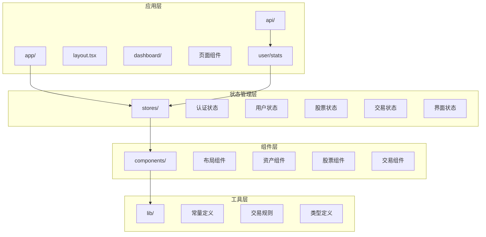

**图表来源**
- [app/layout.tsx:1-42](file://app/layout.tsx#L1-L42)
- [stores/index.ts:1-7](file://stores/index.ts#L1-L7)
- [app/api/user/stats/route.ts:1-103](file://app/api/user/stats/route.ts#L1-L103)

**章节来源**
- [app/layout.tsx:1-42](file://app/layout.tsx#L1-L42)
- [stores/index.ts:1-7](file://stores/index.ts#L1-L7)

## 核心组件

### 状态管理系统

系统采用Zustand作为状态管理解决方案，提供了五个核心状态存储：

1. **认证状态 (AuthStore)**: 处理用户身份验证和会话管理
2. **用户状态 (UserStore)**: 管理用户资料和资产概览
3. **股票状态 (StockStore)**: 维护股票数据和自选股列表
4. **交易状态 (TradeStore)**: 处理持仓、订单和交易历史
5. **界面状态 (UIStore)**: 控制主题、导航和用户交互

### 实时数据订阅

系统通过Supabase Realtime功能实现实时数据更新，包括：
- 股票价格实时更新
- 用户持仓变更通知
- 订单状态更新
- 用户资料变更

**更新** 新增用户统计数据的实时订阅机制，确保分析页面和投资组合页面显示最新的交易统计信息。

**章节来源**
- [stores/useAuthStore.ts:1-104](file://stores/useAuthStore.ts#L1-L104)
- [stores/useUserStore.ts:1-107](file://stores/useUserStore.ts#L1-L107)
- [stores/useStockStore.ts:1-184](file://stores/useStockStore.ts#L1-L184)
- [stores/useTradeStore.ts:1-192](file://stores/useTradeStore.ts#L1-L192)
- [stores/useUIStore.ts:1-78](file://stores/useUIStore.ts#L1-L78)

## 架构概览

系统采用分层架构设计，确保各组件职责清晰、耦合度低：

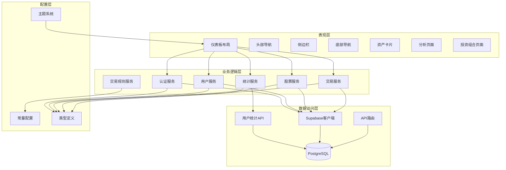

**图表来源**
- [app/(dashboard)/layout.tsx:1-160](file://app/(dashboard)/layout.tsx#L1-L160)
- [lib/constants.ts:1-101](file://lib/constants.ts#L1-L101)
- [types/index.ts:1-166](file://types/index.ts#L1-L166)

## 详细组件分析

### 仪表板布局组件

仪表板布局是整个系统的主容器，负责协调各个子组件的工作：

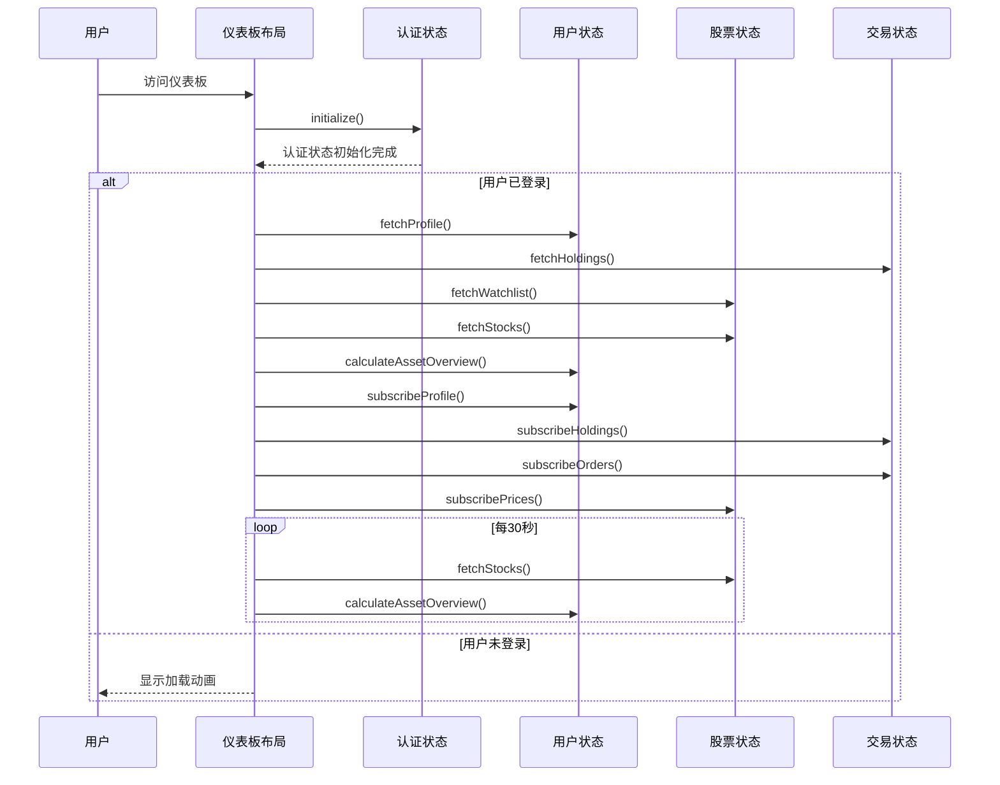

**图表来源**
- [app/(dashboard)/layout.tsx:26-106](file://app/(dashboard)/layout.tsx#L26-L106)

#### 核心功能特性

1. **认证初始化**: 在应用启动时检查用户认证状态
2. **数据预加载**: 登录后立即加载用户资料、持仓和股票数据
3. **实时订阅**: 建立多个实时数据通道
4. **定时刷新**: 每30秒轮询更新股票价格
5. **响应式设计**: 自动检测移动设备并调整界面布局

**章节来源**
- [app/(dashboard)/layout.tsx:1-160](file://app/(dashboard)/layout.tsx#L1-L160)

### 资产卡片组件

资产卡片展示用户的总资产概览信息：

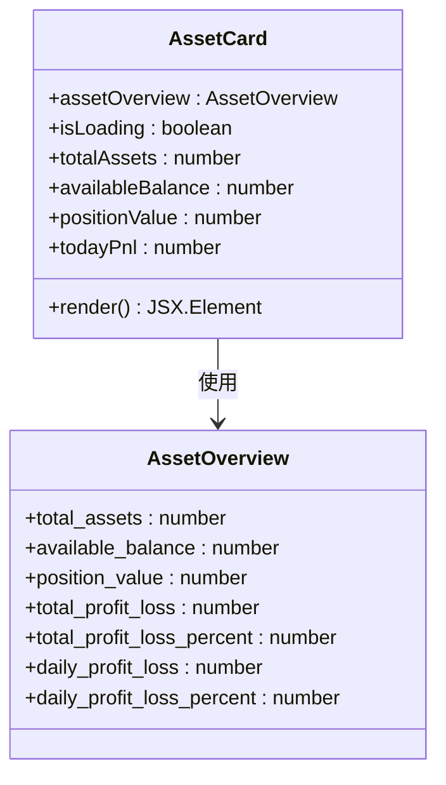

**图表来源**
- [components/portfolio/AssetCard.tsx:1-63](file://components/portfolio/AssetCard.tsx#L1-L63)
- [types/index.ts:91-100](file://types/index.ts#L91-L100)

#### 数据展示逻辑

资产卡片通过以下步骤计算和展示数据：

1. **总资产计算**: 可用余额 + 持仓市值
2. **盈亏计算**: 持仓市值 - 持仓成本
3. **百分比计算**: 盈亏 / 持仓成本 × 100%
4. **今日收益**: 总资产 - 初始资金 (1,000,000)

**章节来源**
- [components/portfolio/AssetCard.tsx:1-63](file://components/portfolio/AssetCard.tsx#L1-L63)
- [stores/useUserStore.ts:50-83](file://stores/useUserStore.ts#L50-L83)

### 股票状态管理

股票状态管理负责维护股票数据和自选股列表：

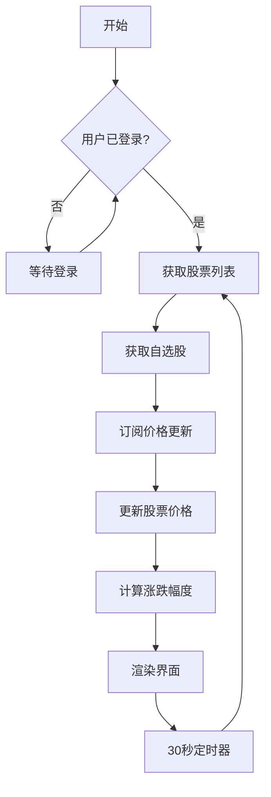

**图表来源**
- [stores/useStockStore.ts:33-57](file://stores/useStockStore.ts#L33-L57)
- [stores/useStockStore.ts:125-150](file://stores/useStockStore.ts#L125-L150)

#### 核心功能

1. **股票数据获取**: 支持关键词搜索和分页查询
2. **自选股管理**: 添加、删除和同步自选股列表
3. **实时价格更新**: 通过WebSocket接收实时股价变动
4. **价格计算**: 自动计算涨跌额和涨跌幅

**章节来源**
- [stores/useStockStore.ts:1-184](file://stores/useStockStore.ts#L1-L184)

### 交易状态管理

交易状态管理处理用户的交易活动：

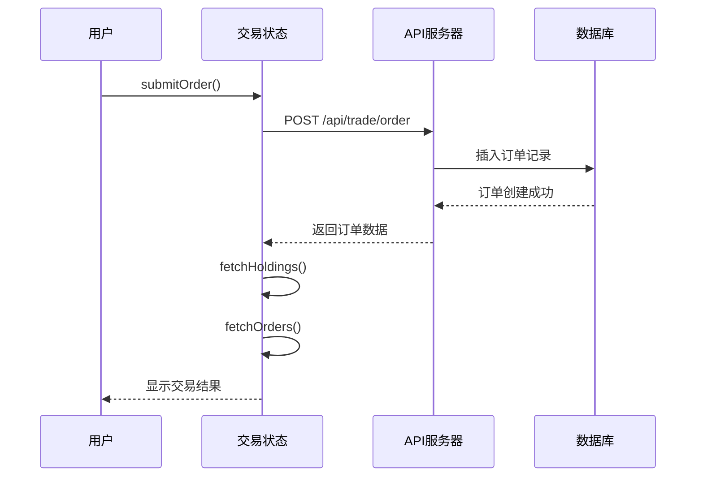

**图表来源**
- [stores/useTradeStore.ts:99-121](file://stores/useTradeStore.ts#L99-L121)

#### 交易流程

1. **订单提交**: 验证订单合法性后提交到服务器
2. **实时更新**: 通过实时订阅获取订单状态变化
3. **持仓更新**: 自动更新用户的持仓情况
4. **费用计算**: 计算交易手续费和印花税

**章节来源**
- [stores/useTradeStore.ts:1-192](file://stores/useTradeStore.ts#L1-L192)

### 交易规则引擎

系统内置完整的A股交易规则验证机制：

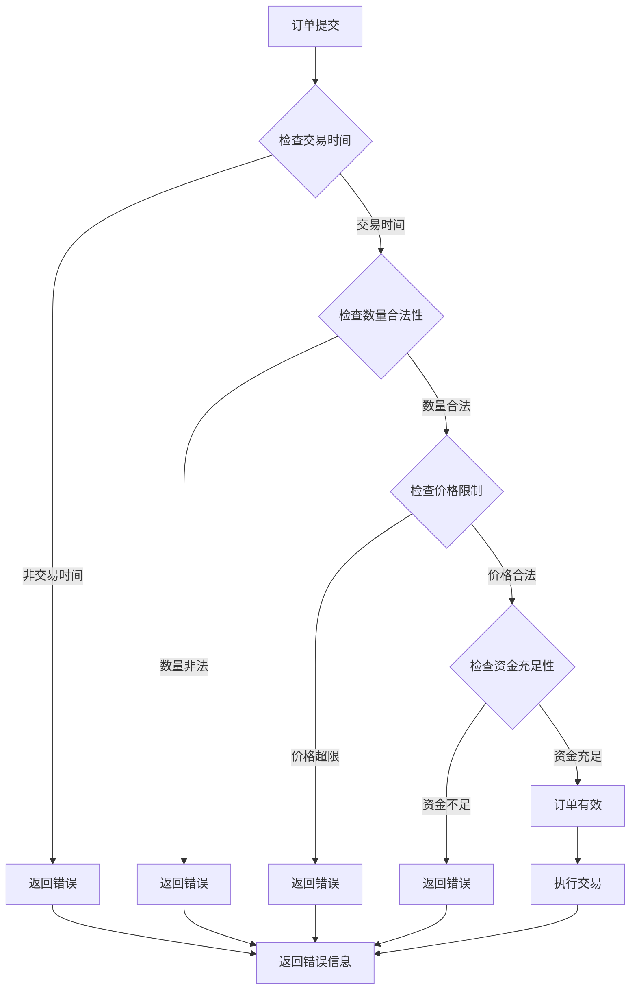

**图表来源**
- [lib/trading-rules.ts:170-201](file://lib/trading-rules.ts#L170-L201)

#### 规则特性

1. **交易时间**: 支持A股工作日交易时间验证
2. **价格限制**: 实现涨跌停板机制
3. **数量规则**: 股票交易必须是100股的整数倍
4. **费用计算**: 包含佣金和印花税的完整费用体系

**章节来源**
- [lib/trading-rules.ts:1-272](file://lib/trading-rules.ts#L1-L272)

## 实时用户统计数据系统

**新增** 系统集成了完整的实时用户统计数据功能，为用户提供个性化的交易数据分析。

### 用户统计API

系统提供专门的API端点来获取用户的交易统计数据：

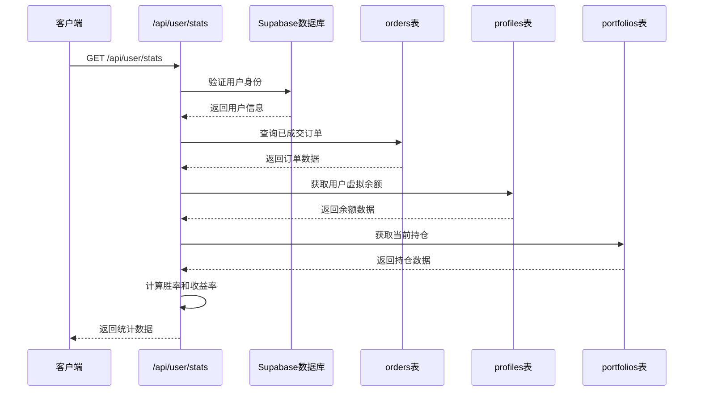

**图表来源**
- [app/api/user/stats/route.ts:1-103](file://app/api/user/stats/route.ts#L1-L103)

#### 统计数据计算逻辑

API端点计算以下关键指标：

1. **交易次数**: 统计用户已完成的交易笔数
2. **胜率**: 计算盈利交易占总交易的比例
3. **总收益率**: 基于初始资金1,000,000计算的总收益百分比
4. **最大回撤**: 当前版本为0（复杂计算需要历史净值数据）

**章节来源**
- [app/api/user/stats/route.ts:1-103](file://app/api/user/stats/route.ts#L1-L103)

### 分析页面实时统计

分析页面集成了实时用户统计数据展示：

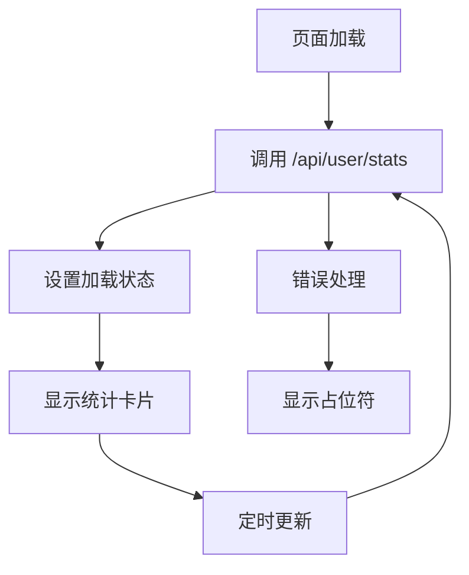

**图表来源**
- [app/(dashboard)/analysis/page.tsx:35-45](file://app/(dashboard)/analysis/page.tsx#L35-L45)

#### 统计卡片展示

分析页面显示以下动态统计信息：

1. **交易次数**: 用户已完成的交易总次数
2. **胜率**: 盈利交易占比，绿色显示正值，红色显示负值
3. **首板观察池**: 基于实时数据的股票筛选结果
4. **五大回调战法**: 技术分析信号的实时展示

**章节来源**
- [app/(dashboard)/analysis/page.tsx:71-94](file://app/(dashboard)/analysis/page.tsx#L71-L94)

### 投资组合页面实时统计

投资组合页面同样集成了实时用户统计数据：

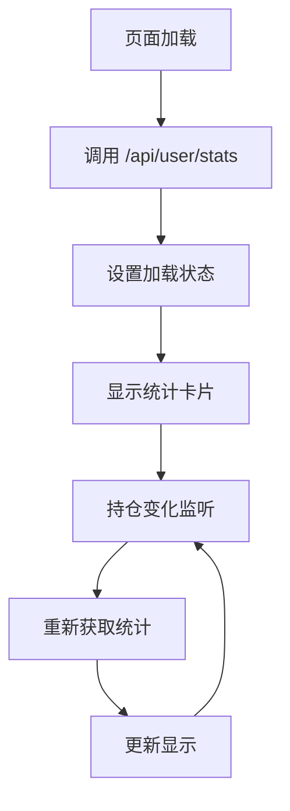

**图表来源**
- [app/(dashboard)/portfolio/page.tsx:30-35](file://app/(dashboard)/portfolio/page.tsx#L30-L35)

#### 统计卡片展示

投资组合页面显示以下动态统计信息：

1. **总收益率**: 基于总资产变化计算的总收益百分比
2. **总资产**: 可用余额 + 持仓市值
3. **胜率**: 盈利交易占比
4. **交易次数**: 用户已完成的交易总次数

**章节来源**
- [app/(dashboard)/portfolio/page.tsx:49-72](file://app/(dashboard)/portfolio/page.tsx#L49-L72)

### 实时数据订阅集成

系统通过以下机制确保统计数据的实时性：

1. **页面级订阅**: 分析页面和投资组合页面在挂载时自动获取统计数据
2. **状态变化监听**: 投资组合页面监听持仓变化，自动重新计算统计数据
3. **定时刷新**: 页面定期重新获取统计数据，确保数据新鲜度
4. **错误处理**: 统一的错误处理机制，避免统计数据获取失败影响整体体验

**章节来源**
- [app/(dashboard)/analysis/page.tsx:35-45](file://app/(dashboard)/analysis/page.tsx#L35-L45)
- [app/(dashboard)/portfolio/page.tsx:30-35](file://app/(dashboard)/portfolio/page.tsx#L30-L35)

## 依赖关系分析

系统采用模块化设计，各组件间依赖关系清晰：

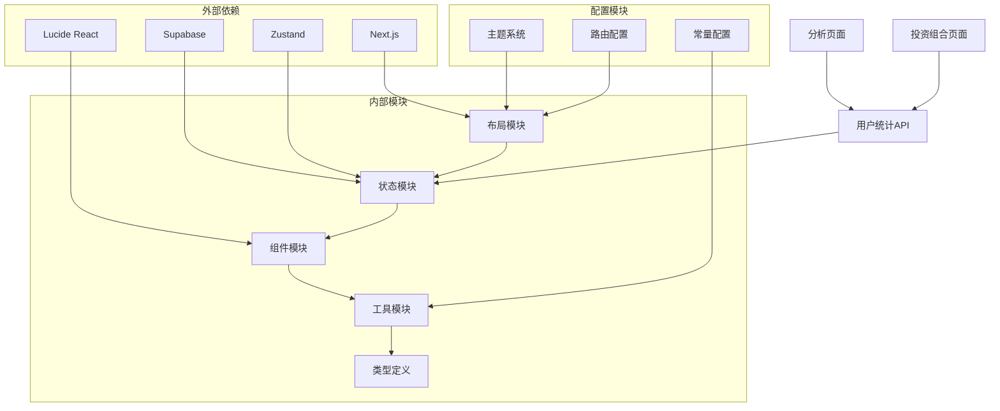

**图表来源**
- [app/layout.tsx:1-42](file://app/layout.tsx#L1-L42)
- [stores/index.ts:1-7](file://stores/index.ts#L1-L7)

### 核心依赖关系

1. **Next.js**: 提供React框架和路由系统
2. **Supabase**: 提供认证、数据库和实时订阅功能
3. **Zustand**: 提供轻量级状态管理
4. **Lucide React**: 提供图标组件库

**章节来源**
- [app/layout.tsx:1-42](file://app/layout.tsx#L1-L42)
- [stores/index.ts:1-7](file://stores/index.ts#L1-L7)

## 性能考虑

### 实时数据优化

系统通过以下策略优化实时数据性能：

1. **轮询更新**: 每30秒更新一次股票价格，避免频繁请求
2. **增量更新**: 只更新发生变化的数据，减少DOM操作
3. **缓存策略**: 利用浏览器缓存减少重复请求
4. **连接池**: 复用Supabase连接，避免频繁建立连接
5. **统计数据缓存**: 分析页面和投资组合页面缓存统计数据，减少API调用频率

### 状态管理优化

1. **状态分区**: 将不同类型的用户数据分离到独立的状态存储
2. **选择性更新**: 只在必要时触发组件重新渲染
3. **持久化存储**: 使用localStorage保存UI状态，提升用户体验
4. **实时订阅管理**: 统一管理实时订阅的生命周期，避免内存泄漏

## 故障排除指南

### 常见问题及解决方案

#### 认证问题
- **问题**: 用户登录后无法进入仪表板
- **原因**: 认证状态初始化失败
- **解决**: 检查Supabase配置和网络连接

#### 实时数据异常
- **问题**: 股价不更新或更新延迟
- **原因**: WebSocket连接中断
- **解决**: 检查网络状况和Supabase服务状态

#### 交易失败
- **问题**: 下单后订单状态异常
- **原因**: 交易规则验证失败
- **解决**: 检查交易时间、资金余额和价格限制

#### 统计数据获取失败
- **问题**: 分析页面和投资组合页面的统计信息显示为占位符
- **原因**: /api/user/stats API调用失败或用户未登录
- **解决**: 检查API端点状态、用户认证状态和网络连接

**章节来源**
- [stores/useAuthStore.ts:81-102](file://stores/useAuthStore.ts#L81-L102)
- [stores/useStockStore.ts:125-150](file://stores/useStockStore.ts#L125-L150)
- [lib/trading-rules.ts:170-201](file://lib/trading-rules.ts#L170-L201)
- [app/api/user/stats/route.ts:10-12](file://app/api/user/stats/route.ts#L10-L12)

## 结论

仪表板系统通过现代化的技术栈和合理的架构设计，为用户提供了完整的虚拟股票交易体验。系统的主要优势包括：

1. **实时性**: 通过Supabase Realtime实现数据的实时更新
2. **响应式**: 支持桌面端和移动端的自适应布局
3. **可扩展性**: 模块化的架构便于功能扩展和维护
4. **用户体验**: 流畅的交互和直观的界面设计
5. **个性化**: 实时用户统计数据提供个性化的交易分析

**更新** 新增的实时用户统计数据功能显著提升了系统的智能化水平，为用户提供了更加丰富和实用的交易分析工具。分析页面和投资组合页面的动态统计信息展示，使用户能够实时掌握自己的交易表现和市场动态。

未来可以考虑的功能增强包括：增加更详细的交易统计指标、实现历史数据回溯分析、添加自定义预警功能等。