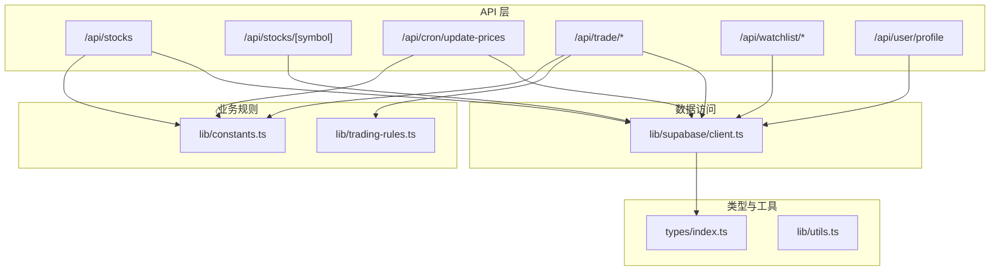
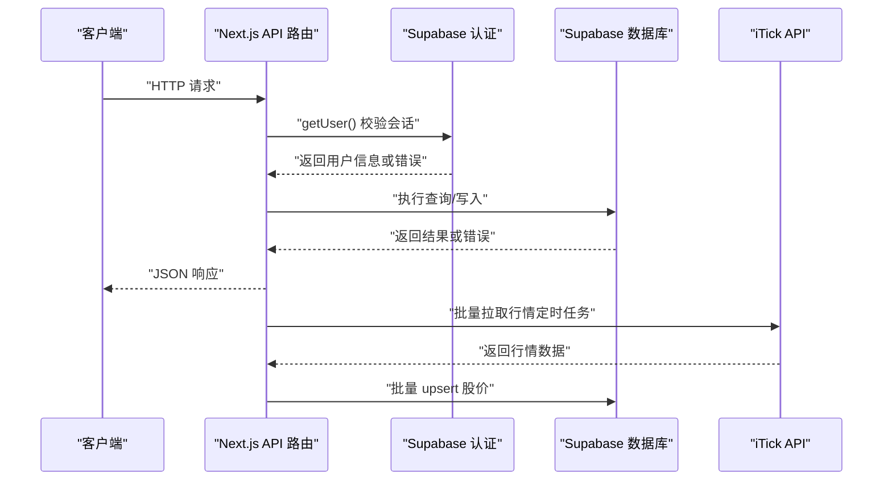
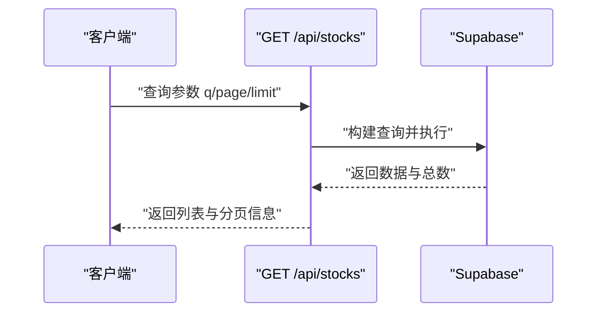
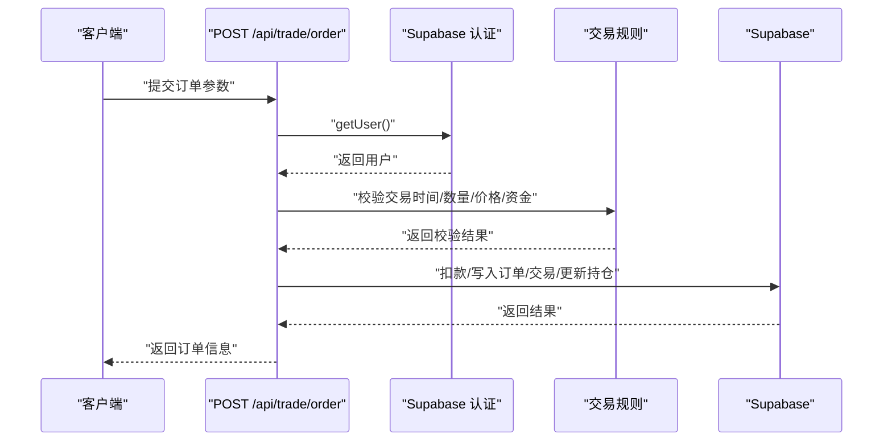
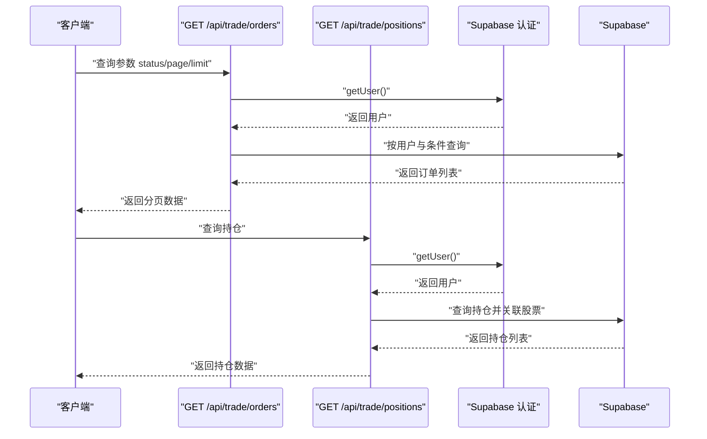
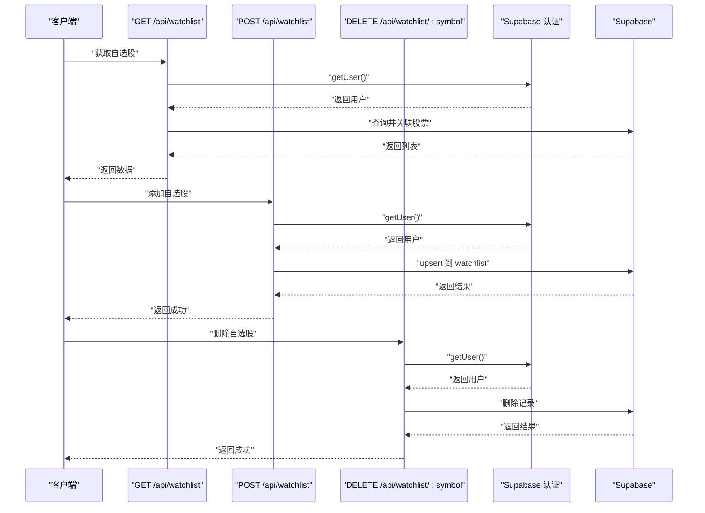
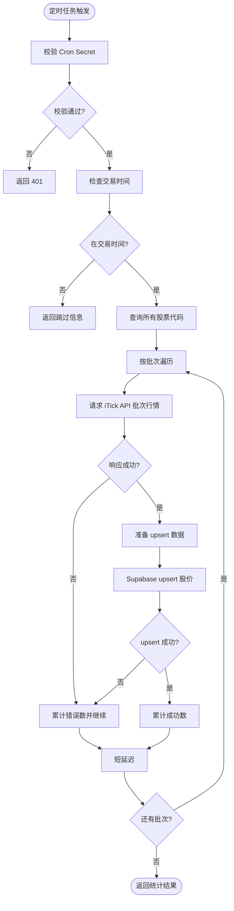
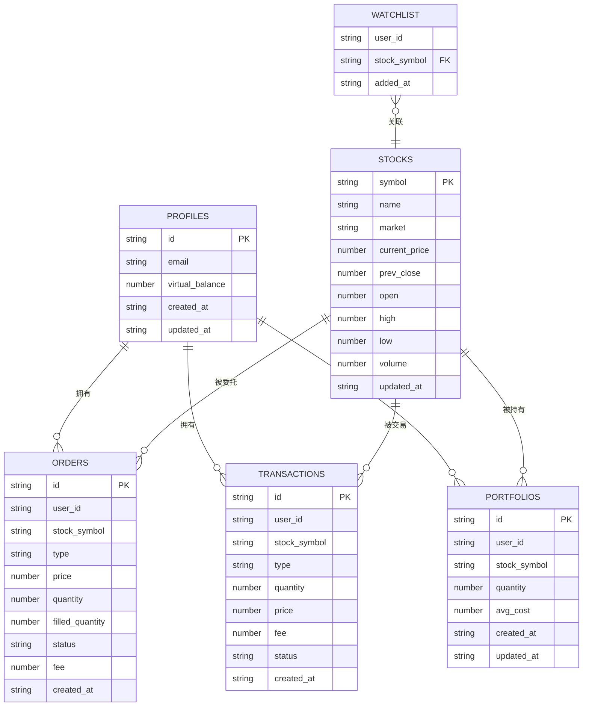
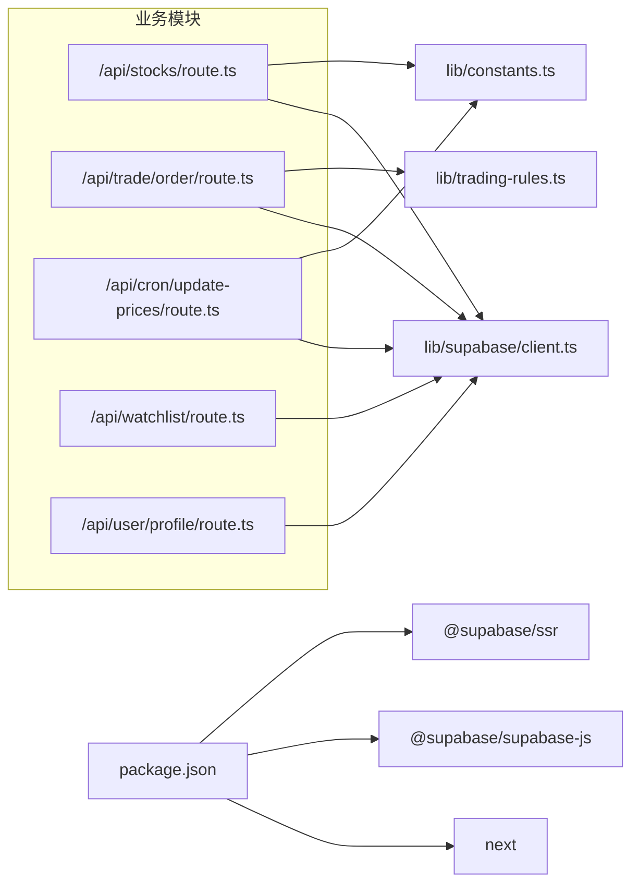

# 后端架构

<cite>
**本文引用的文件**
- [app/api/stocks/route.ts](file://app/api/stocks/route.ts)
- [app/api/stocks/[symbol]/route.ts](file://app/api/stocks/[symbol]/route.ts)
- [app/api/cron/update-prices/route.ts](file://app/api/cron/update-prices/route.ts)
- [app/api/trade/order/route.ts](file://app/api/trade/order/route.ts)
- [app/api/trade/orders/route.ts](file://app/api/trade/orders/route.ts)
- [app/api/trade/positions/route.ts](file://app/api/trade/positions/route.ts)
- [app/api/watchlist/route.ts](file://app/api/watchlist/route.ts)
- [app/api/watchlist/[symbol]/route.ts](file://app/api/watchlist/[symbol]/route.ts)
- [app/api/user/profile/route.ts](file://app/api/user/profile/route.ts)
- [lib/supabase/client.ts](file://lib/supabase/client.ts)
- [lib/constants.ts](file://lib/constants.ts)
- [lib/trading-rules.ts](file://lib/trading-rules.ts)
- [types/index.ts](file://types/index.ts)
- [lib/utils.ts](file://lib/utils.ts)
- [package.json](file://package.json)
</cite>

## 目录
1. [简介](#简介)
2. [项目结构](#项目结构)
3. [核心组件](#核心组件)
4. [架构总览](#架构总览)
5. [详细组件分析](#详细组件分析)
6. [依赖关系分析](#依赖关系分析)
7. [性能考量](#性能考量)
8. [故障排查指南](#故障排查指南)
9. [结论](#结论)
10. [附录](#附录)

## 简介
本文件系统性梳理该项目的后端架构，重点围绕 Next.js App Router 的 API 路由设计模式与实现原理展开，覆盖 RESTful 组织结构、路由命名规范、HTTP 方法映射、数据库层交互（Supabase）、定时任务（Vercel Cron Jobs + iTick API）同步机制、错误处理策略与 API 版本管理建议，并补充安全与性能优化要点。文档面向不同技术背景读者，力求以渐进方式呈现复杂主题。

## 项目结构
后端 API 路由采用 Next.js App Router 的约定式路由：每个 API 路径对应一个 route.ts 文件，通过导出的 HTTP 方法函数（GET/POST/DELETE 等）响应请求。数据库访问统一通过 Supabase 客户端封装，业务规则集中在独立模块中，类型定义集中于 types 目录，便于前后端共享。

图表来源
- [app/api/stocks/route.ts:1-69](file://app/api/stocks/route.ts#L1-L69)
- [app/api/stocks/[symbol]/route.ts](file://app/api/stocks/[symbol]/route.ts#L1-L51)
- [app/api/cron/update-prices/route.ts:1-150](file://app/api/cron/update-prices/route.ts#L1-L150)
- [app/api/trade/order/route.ts:1-331](file://app/api/trade/order/route.ts#L1-L331)
- [app/api/trade/orders/route.ts:1-66](file://app/api/trade/orders/route.ts#L1-L66)
- [app/api/trade/positions/route.ts:1-46](file://app/api/trade/positions/route.ts#L1-L46)
- [app/api/watchlist/route.ts:1-129](file://app/api/watchlist/route.ts#L1-L129)
- [app/api/watchlist/[symbol]/route.ts](file://app/api/watchlist/[symbol]/route.ts#L1-L50)
- [app/api/user/profile/route.ts:1-42](file://app/api/user/profile/route.ts#L1-L42)
- [lib/supabase/client.ts:1-9](file://lib/supabase/client.ts#L1-L9)
- [lib/trading-rules.ts:1-272](file://lib/trading-rules.ts#L1-L272)
- [lib/constants.ts:1-101](file://lib/constants.ts#L1-L101)
- [types/index.ts:1-166](file://types/index.ts#L1-L166)

章节来源
- [app/api/stocks/route.ts:1-69](file://app/api/stocks/route.ts#L1-L69)
- [app/api/stocks/[symbol]/route.ts](file://app/api/stocks/[symbol]/route.ts#L1-L51)
- [app/api/cron/update-prices/route.ts:1-150](file://app/api/cron/update-prices/route.ts#L1-L150)
- [app/api/trade/order/route.ts:1-331](file://app/api/trade/order/route.ts#L1-L331)
- [app/api/trade/orders/route.ts:1-66](file://app/api/trade/orders/route.ts#L1-L66)
- [app/api/trade/positions/route.ts:1-46](file://app/api/trade/positions/route.ts#L1-L46)
- [app/api/watchlist/route.ts:1-129](file://app/api/watchlist/route.ts#L1-L129)
- [app/api/watchlist/[symbol]/route.ts](file://app/api/watchlist/[symbol]/route.ts#L1-L50)
- [app/api/user/profile/route.ts:1-42](file://app/api/user/profile/route.ts#L1-L42)
- [lib/supabase/client.ts:1-9](file://lib/supabase/client.ts#L1-L9)
- [lib/trading-rules.ts:1-272](file://lib/trading-rules.ts#L1-L272)
- [lib/constants.ts:1-101](file://lib/constants.ts#L1-L101)
- [types/index.ts:1-166](file://types/index.ts#L1-L166)

## 核心组件
- API 路由层：基于 App Router 的 route.ts 文件组织，按资源划分目录，支持动态路由参数与查询参数。
- 数据访问层：通过 Supabase 客户端封装统一访问数据库，支持认证、查询、插入、更新、upsert 等操作。
- 业务规则层：交易时间判断、价格涨跌停校验、手续费与印花税计算、数量合法性等规则集中管理。
- 常量与类型：交易常量、API 常量、前端 UI 常量、以及前后端共享的类型定义。
- 工具与格式化：环境变量检查、货币/数字/百分比/成交量格式化等辅助函数。

章节来源
- [lib/supabase/client.ts:1-9](file://lib/supabase/client.ts#L1-L9)
- [lib/trading-rules.ts:1-272](file://lib/trading-rules.ts#L1-L272)
- [lib/constants.ts:1-101](file://lib/constants.ts#L1-L101)
- [types/index.ts:1-166](file://types/index.ts#L1-L166)
- [lib/utils.ts:1-47](file://lib/utils.ts#L1-L47)

## 架构总览
下图展示从客户端到 API、再到数据库与外部 iTick 行情服务的整体调用链路与职责边界。

图表来源
- [app/api/trade/order/route.ts:1-331](file://app/api/trade/order/route.ts#L1-L331)
- [app/api/cron/update-prices/route.ts:1-150](file://app/api/cron/update-prices/route.ts#L1-L150)
- [lib/supabase/client.ts:1-9](file://lib/supabase/client.ts#L1-L9)

## 详细组件分析

### 股票列表与详情 API
- 股票列表：支持关键词搜索、分页、按交易量排序；返回时计算涨跌幅与涨跌幅百分比。
- 单只股票详情：根据路径参数查询，返回时同样计算涨跌幅字段。
- 错误处理：针对“无结果”与通用错误分别返回 404 与 500。

图表来源
- [app/api/stocks/route.ts:1-69](file://app/api/stocks/route.ts#L1-L69)

章节来源
- [app/api/stocks/route.ts:1-69](file://app/api/stocks/route.ts#L1-L69)
- [app/api/stocks/[symbol]/route.ts](file://app/api/stocks/[symbol]/route.ts#L1-L51)

### 交易委托 API
- 身份校验：使用 Supabase 认证获取当前用户。
- 交易时间与规则：在交易时间内允许下单，校验数量、价格涨跌停范围、可用资金等。
- 买入流程：扣减虚拟余额、创建已成交订单、生成交易记录、更新或新增持仓。
- 卖出流程：校验持仓数量、计算收益、增加虚拟余额、创建已成交订单与交易记录、更新或删除持仓。
- 错误处理：参数缺失、未登录、非交易时间、资金不足、股票不存在等场景返回相应状态码。

图表来源
- [app/api/trade/order/route.ts:1-331](file://app/api/trade/order/route.ts#L1-L331)
- [lib/trading-rules.ts:1-272](file://lib/trading-rules.ts#L1-L272)

章节来源
- [app/api/trade/order/route.ts:1-331](file://app/api/trade/order/route.ts#L1-L331)
- [lib/trading-rules.ts:1-272](file://lib/trading-rules.ts#L1-L272)

### 委托记录与持仓 API
- 委托记录：按用户过滤、支持状态筛选、分页查询。
- 持仓：关联股票信息，过滤持有数量大于 0 的记录，按更新时间倒序。

图表来源
- [app/api/trade/orders/route.ts:1-66](file://app/api/trade/orders/route.ts#L1-L66)
- [app/api/trade/positions/route.ts:1-46](file://app/api/trade/positions/route.ts#L1-L46)

章节来源
- [app/api/trade/orders/route.ts:1-66](file://app/api/trade/orders/route.ts#L1-L66)
- [app/api/trade/positions/route.ts:1-46](file://app/api/trade/positions/route.ts#L1-L46)

### 自选股 API
- 列表：关联股票信息，计算涨跌幅字段。
- 新增：校验股票存在性，使用 upsert 防止重复。
- 删除：按用户与股票符号删除。

图表来源
- [app/api/watchlist/route.ts:1-129](file://app/api/watchlist/route.ts#L1-L129)
- [app/api/watchlist/[symbol]/route.ts](file://app/api/watchlist/[symbol]/route.ts#L1-L50)

章节来源
- [app/api/watchlist/route.ts:1-129](file://app/api/watchlist/route.ts#L1-L129)
- [app/api/watchlist/[symbol]/route.ts](file://app/api/watchlist/[symbol]/route.ts#L1-L50)

### 用户资料 API
- 获取当前用户资料，基于 Supabase 认证与 profiles 表。

章节来源
- [app/api/user/profile/route.ts:1-42](file://app/api/user/profile/route.ts#L1-L42)

### 定时任务与行情同步
- 触发方式：Vercel Cron Jobs 定时触发 /api/cron/update-prices。
- 安全校验：可选 x-cron-secret 头部校验。
- 交易时间检查：仅在交易时段执行更新。
- 批量拉取：按批次向 iTick API 请求行情，设置超时与错误重试策略。
- 批量写入：使用 upsert 按 symbol 冲突更新，记录成功/失败计数。

图表来源
- [app/api/cron/update-prices/route.ts:1-150](file://app/api/cron/update-prices/route.ts#L1-L150)
- [lib/constants.ts:70-80](file://lib/constants.ts#L70-L80)

章节来源
- [app/api/cron/update-prices/route.ts:1-150](file://app/api/cron/update-prices/route.ts#L1-L150)
- [lib/constants.ts:70-80](file://lib/constants.ts#L70-L80)

### 数据模型与类型
以下实体与字段来自类型定义文件，用于约束 API 返回与前端消费：

图表来源
- [types/index.ts:1-166](file://types/index.ts#L1-L166)

章节来源
- [types/index.ts:1-166](file://types/index.ts#L1-L166)

## 依赖关系分析
- 外部依赖：Next.js、Supabase 客户端与 SSR 辅助库、React 生态等。
- 内部依赖：API 路由依赖 Supabase 客户端与业务规则模块；交易相关路由还依赖常量模块；类型定义被前后端共享。

图表来源
- [package.json:1-44](file://package.json#L1-L44)
- [lib/supabase/client.ts:1-9](file://lib/supabase/client.ts#L1-L9)
- [lib/trading-rules.ts:1-272](file://lib/trading-rules.ts#L1-L272)
- [lib/constants.ts:1-101](file://lib/constants.ts#L1-L101)
- [app/api/stocks/route.ts:1-69](file://app/api/stocks/route.ts#L1-L69)
- [app/api/trade/order/route.ts:1-331](file://app/api/trade/order/route.ts#L1-L331)
- [app/api/cron/update-prices/route.ts:1-150](file://app/api/cron/update-prices/route.ts#L1-L150)
- [app/api/watchlist/route.ts:1-129](file://app/api/watchlist/route.ts#L1-L129)
- [app/api/user/profile/route.ts:1-42](file://app/api/user/profile/route.ts#L1-L42)

章节来源
- [package.json:1-44](file://package.json#L1-L44)
- [lib/supabase/client.ts:1-9](file://lib/supabase/client.ts#L1-L9)
- [lib/trading-rules.ts:1-272](file://lib/trading-rules.ts#L1-L272)
- [lib/constants.ts:1-101](file://lib/constants.ts#L1-L101)
- [app/api/stocks/route.ts:1-69](file://app/api/stocks/route.ts#L1-L69)
- [app/api/trade/order/route.ts:1-331](file://app/api/trade/order/route.ts#L1-L331)
- [app/api/cron/update-prices/route.ts:1-150](file://app/api/cron/update-prices/route.ts#L1-L150)
- [app/api/watchlist/route.ts:1-129](file://app/api/watchlist/route.ts#L1-L129)
- [app/api/user/profile/route.ts:1-42](file://app/api/user/profile/route.ts#L1-L42)

## 性能考量
- 查询优化
  - 使用 select 明确字段，避免 * 导致的网络与解析开销。
  - 对高频查询（如股票列表、自选股）使用索引列（如 symbol、user_id）进行过滤与排序。
  - 分页参数限制最大页大小，防止大偏移导致的性能问题。
- 批量操作
  - 定时任务按批次拉取与 upsert，减少单次请求压力；批次大小与延迟需结合外部 API 速率限制调整。
- 缓存与刷新
  - 前端可利用短期缓存与轮询间隔控制（UI 常量中提供刷新间隔参考），降低后端压力。
- 网络与超时
  - 外部 API 请求设置合理超时，异常快速失败并记录错误计数，避免阻塞主流程。

## 故障排查指南
- 认证失败
  - 现象：返回 401 未登录。
  - 排查：确认 Supabase 会话有效、请求头携带正确 Cookie 或 Authorization。
- 参数错误
  - 现象：返回 400 参数不完整/错误。
  - 排查：核对必填字段与类型，确保前端传参符合后端期望。
- 资源不存在
  - 现象：返回 404 股票不存在/自选股不存在。
  - 排查：确认 symbol 是否正确、数据库中是否存在对应记录。
- 业务规则拒绝
  - 现象：返回 400 交易被拒（非交易时间、数量非法、价格越界、资金不足等）。
  - 排查：检查交易时间、数量是否为最小单位整数倍、价格是否在涨跌停范围内、可用资金是否充足。
- 数据库错误
  - 现象：返回 500 数据库操作失败。
  - 排查：查看后端日志中的错误堆栈，定位具体 SQL 操作与权限问题。
- 定时任务异常
  - 现象：返回 500 或部分批次失败。
  - 排查：检查 Cron Secret、交易时间、iTick API Key/Endpoint、网络超时与响应格式。

章节来源
- [app/api/trade/order/route.ts:1-331](file://app/api/trade/order/route.ts#L1-L331)
- [app/api/watchlist/route.ts:1-129](file://app/api/watchlist/route.ts#L1-L129)
- [app/api/cron/update-prices/route.ts:1-150](file://app/api/cron/update-prices/route.ts#L1-L150)

## 结论
本项目采用清晰的 API 路由分层与统一的数据库访问封装，结合完善的业务规则与类型定义，实现了从行情查询、自选股管理到交易委托与持仓管理的闭环。定时任务通过 Vercel Cron Jobs 与 iTick API 实现稳定的价格同步。建议后续在错误处理与 API 版本管理方面进一步标准化响应结构与版本号策略，以提升可维护性与演进能力。

## 附录
- API 版本管理建议
  - 在路由前缀引入版本号，例如 /api/v1/stocks，便于未来平滑迁移。
  - 保持向后兼容或在变更时提供迁移指引与过渡期。
- 安全加固建议
  - 对外暴露的定时任务接口建议强制使用 x-cron-secret 校验。
  - 严格限制查询字段与分页参数，避免 N+1 查询与过度暴露敏感数据。
  - 对高频接口增加速率限制与熔断保护，防止突发流量冲击。