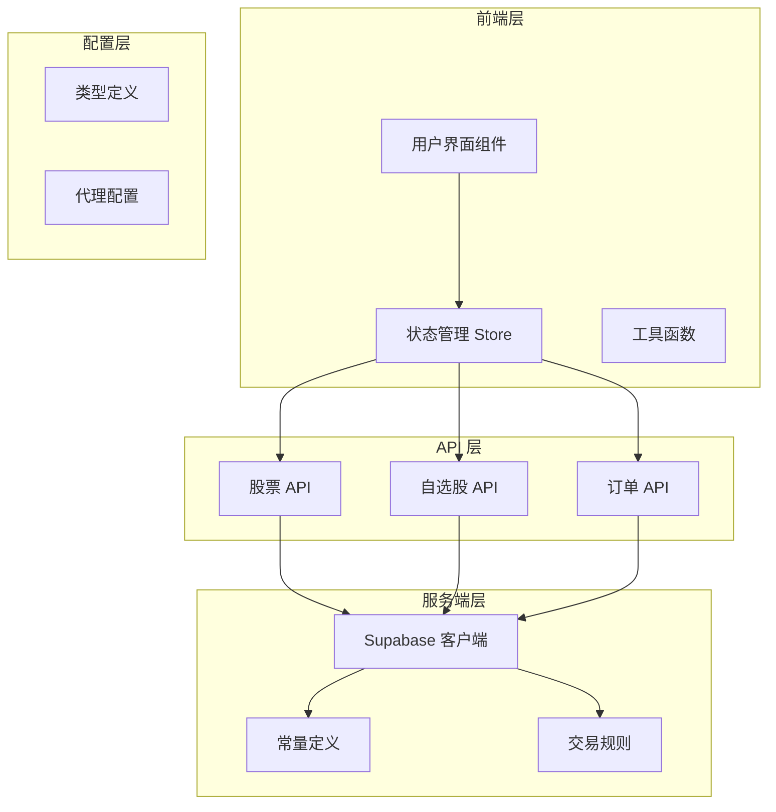
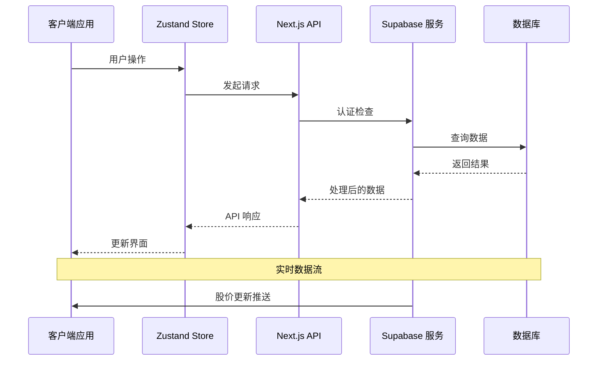
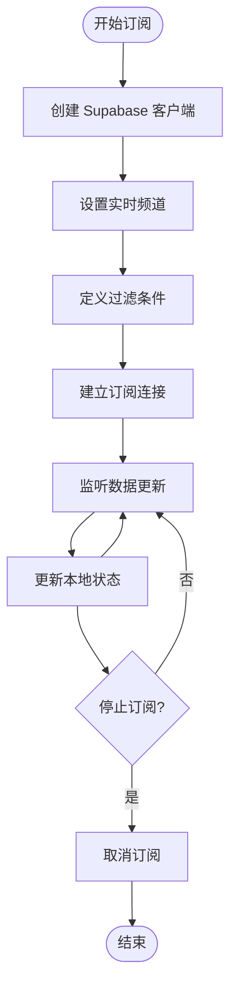
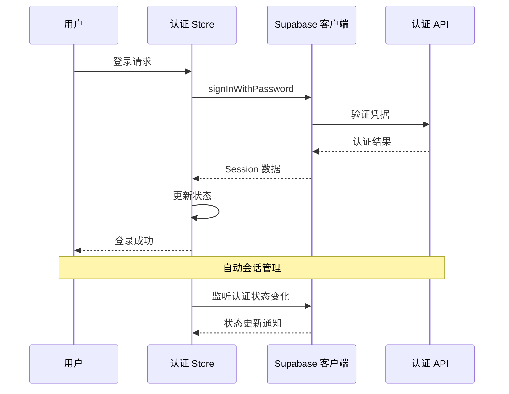

# 服务端客户端库

<cite>
**本文档引用的文件**
- [README.md](file://README.md)
- [package.json](file://package.json)
- [lib/constants.ts](file://lib/constants.ts)
- [lib/trading-rules.ts](file://lib/trading-rules.ts)
- [lib/utils.ts](file://lib/utils.ts)
- [lib/supabase/client.ts](file://lib/supabase/client.ts)
- [lib/supabase/server.ts](file://lib/supabase/server.ts)
- [stores/index.ts](file://stores/index.ts)
- [stores/useAuthStore.ts](file://stores/useAuthStore.ts)
- [stores/useStockStore.ts](file://stores/useStockStore.ts)
- [app/api/stocks/route.ts](file://app/api/stocks/route.ts)
- [app/api/watchlist/route.ts](file://app/api/watchlist/route.ts)
- [app/api/trade/orders/route.ts](file://app/api/trade/orders/route.ts)
- [types/index.ts](file://types/index.ts)
- [proxy.ts](file://proxy.ts)
</cite>

## 目录
1. [简介](#简介)
2. [项目结构](#项目结构)
3. [核心组件](#核心组件)
4. [架构概览](#架构概览)
5. [详细组件分析](#详细组件分析)
6. [依赖关系分析](#依赖关系分析)
7. [性能考虑](#性能考虑)
8. [故障排除指南](#故障排除指南)
9. [结论](#结论)

## 简介

这是一个基于 Next.js 和 Supabase 的虚拟股票交易系统。该项目实现了完整的客户端-服务端架构，包括用户认证、股票行情获取、自选股管理、交易委托等功能。系统采用 TypeScript 开发，使用 Zustand 进行状态管理，通过 Supabase 提供数据库和实时订阅功能。

## 项目结构

项目采用模块化的组织方式，主要分为以下几个部分：



**图表来源**
- [lib/supabase/client.ts:1-9](file://lib/supabase/client.ts#L1-L9)
- [lib/supabase/server.ts:1-35](file://lib/supabase/server.ts#L1-L35)
- [stores/useAuthStore.ts:1-104](file://stores/useAuthStore.ts#L1-L104)
- [stores/useStockStore.ts:1-184](file://stores/useStockStore.ts#L1-L184)

**章节来源**
- [README.md:1-110](file://README.md#L1-L110)
- [package.json:1-44](file://package.json#L1-L44)

## 核心组件

### Supabase 客户端库

系统提供了完整的 Supabase 客户端库，支持浏览器端和服务器端的不同使用场景：

#### 浏览器客户端
- **用途**：用于前端组件和客户端逻辑
- **特性**：自动处理 Cookie 会话，支持认证状态监听
- **初始化**：从环境变量读取 Supabase URL 和密钥

#### 服务器端客户端
- **用途**：用于 API 路由和服务器逻辑
- **特性**：通过 Next.js cookies API 管理会话状态
- **安全**：支持服务端专用客户端绕过 RLS 限制

**章节来源**
- [lib/supabase/client.ts:1-9](file://lib/supabase/client.ts#L1-L9)
- [lib/supabase/server.ts:1-35](file://lib/supabase/server.ts#L1-L35)

### 状态管理 Store

系统使用 Zustand 实现状态管理，包含多个专门的 Store：

#### 认证 Store (useAuthStore)
- **功能**：用户会话管理、登录注册、登出
- **特性**：自动初始化会话状态、监听认证变化
- **数据**：Session、User、加载状态

#### 股票 Store (useStockStore)
- **功能**：股票数据获取、自选股管理、实时价格订阅
- **特性**：支持搜索、分页、实时更新
- **数据**：股票列表、自选股、搜索关键词

**章节来源**
- [stores/useAuthStore.ts:1-104](file://stores/useAuthStore.ts#L1-L104)
- [stores/useStockStore.ts:1-184](file://stores/useStockStore.ts#L1-L184)

### 交易规则引擎

系统实现了完整的 A 股交易规则：

#### 交易时间控制
- **工作日**：周一至周五
- **交易时段**：9:30-11:30, 13:00-15:00
- **周末**：非交易日

#### 价格限制
- **主板**：±10%
- **科创板/创业板**：±20%
- **涨跌停价计算**：基于前收盘价

#### 手续费计算
- **佣金**：万分之2.5，最低5元
- **印花税**：卖出单边收取万分之5
- **交易单位**：100股（1手）的整数倍

**章节来源**
- [lib/trading-rules.ts:1-281](file://lib/trading-rules.ts#L1-L281)
- [lib/constants.ts:1-101](file://lib/constants.ts#L1-L101)

## 架构概览

系统采用分层架构设计，确保前后端分离和职责明确：



**图表来源**
- [stores/useStockStore.ts:125-150](file://stores/useStockStore.ts#L125-L150)
- [app/api/stocks/route.ts:1-69](file://app/api/stocks/route.ts#L1-L69)

## 详细组件分析

### API 路由系统

#### 股票 API (GET /api/stocks)
- **功能**：获取股票列表，支持搜索和分页
- **特性**：按成交量排序、计算涨跌幅、支持关键词搜索
- **权限**：公开访问

#### 自选股 API
- **GET /api/watchlist**：获取用户自选股列表
- **POST /api/watchlist**：添加自选股
- **DELETE /api/watchlist/:symbol**：移除自选股
- **权限**：需要用户认证

#### 订单 API (GET /api/trade/orders)
- **功能**：获取用户委托记录
- **特性**：支持状态过滤、分页查询
- **权限**：需要用户认证

**章节来源**
- [app/api/stocks/route.ts:1-69](file://app/api/stocks/route.ts#L1-L69)
- [app/api/watchlist/route.ts:1-132](file://app/api/watchlist/route.ts#L1-L132)
- [app/api/trade/orders/route.ts:1-66](file://app/api/trade/orders/route.ts#L1-L66)

### 实时数据订阅

系统使用 Supabase Realtime 功能实现实时股价更新：



**图表来源**
- [stores/useStockStore.ts:125-150](file://stores/useStockStore.ts#L125-L150)

**章节来源**
- [stores/useStockStore.ts:125-177](file://stores/useStockStore.ts#L125-L177)

### 认证流程

系统采用 Supabase Auth 提供用户认证功能：



**图表来源**
- [stores/useAuthStore.ts:31-48](file://stores/useAuthStore.ts#L31-L48)
- [stores/useAuthStore.ts:94-101](file://stores/useAuthStore.ts#L94-L101)

**章节来源**
- [stores/useAuthStore.ts:1-104](file://stores/useAuthStore.ts#L1-L104)

## 依赖关系分析

系统的核心依赖关系如下：

```mermaid
graph LR
subgraph "运行时依赖"
Next[Next.js]
React[React]
Zustand[Zustand]
SupabaseJS[@supabase/supabase-js]
SSR[@supabase/ssr]
end
subgraph "开发依赖"
TypeScript[TypeScript]
Tailwind[Tailwind CSS]
ESLint[ESLint]
end
subgraph "业务逻辑"
Constants[常量定义]
TradingRules[交易规则]
Utils[工具函数]
Stores[状态管理]
API[API 路由]
end
Next --> React
React --> Zustand
Zustand --> Stores
Stores --> API
API --> SupabaseJS
SupabaseJS --> SSR
Constants --> TradingRules
TradingRules --> Stores
Utils --> Stores
```

**图表来源**
- [package.json:9-29](file://package.json#L9-L29)
- [lib/constants.ts:1-101](file://lib/constants.ts#L1-L101)
- [lib/trading-rules.ts:1-281](file://lib/trading-rules.ts#L1-L281)

**章节来源**
- [package.json:1-44](file://package.json#L1-L44)

## 性能考虑

### 缓存策略
- **实时数据缓存**：使用本地状态缓存最近的股票数据
- **分页优化**：API 层面限制最大分页大小，避免大数据量查询
- **批量更新**：实时订阅支持批量数据更新，减少不必要的重渲染

### 网络优化
- **请求合并**：多个组件共享相同的 API 请求
- **防抖处理**：搜索功能实现防抖，避免频繁请求
- **连接复用**：Supabase 客户端连接复用，减少握手开销

### 内存管理
- **状态清理**：组件卸载时自动清理订阅和定时器
- **数据压缩**：只存储必要的数据字段，避免内存泄漏

## 故障排除指南

### 常见问题及解决方案

#### Supabase 连接问题
- **症状**：API 调用失败，认证状态异常
- **原因**：环境变量配置错误或网络连接问题
- **解决**：检查 `.env.local` 文件中的 Supabase 配置

#### 实时订阅失效
- **症状**：股价更新不及时
- **原因**：WebSocket 连接断开或订阅被意外取消
- **解决**：重新建立订阅连接，检查网络状况

#### 认证状态不同步
- **症状**：登录状态与实际不符
- **原因**：客户端和服务端会话状态不一致
- **解决**：调用 `initialize` 方法重新同步会话状态

**章节来源**
- [lib/utils.ts:8-11](file://lib/utils.ts#L8-L11)
- [stores/useAuthStore.ts:81-102](file://stores/useAuthStore.ts#L81-L102)

## 结论

这个虚拟股票交易系统展示了现代 Web 应用的最佳实践，包括：

1. **清晰的架构分层**：前端、API、数据层职责明确
2. **完整的功能实现**：从用户认证到实时数据更新的全栈功能
3. **优秀的开发体验**：TypeScript 类型安全，Zustand 简洁的状态管理
4. **可扩展的设计**：模块化结构便于功能扩展和维护

系统特别适合学习 Next.js 13+ App Router 的使用，以及如何在实际项目中集成 Supabase 进行全栈开发。通过合理的架构设计和性能优化，为用户提供流畅的股票交易体验。