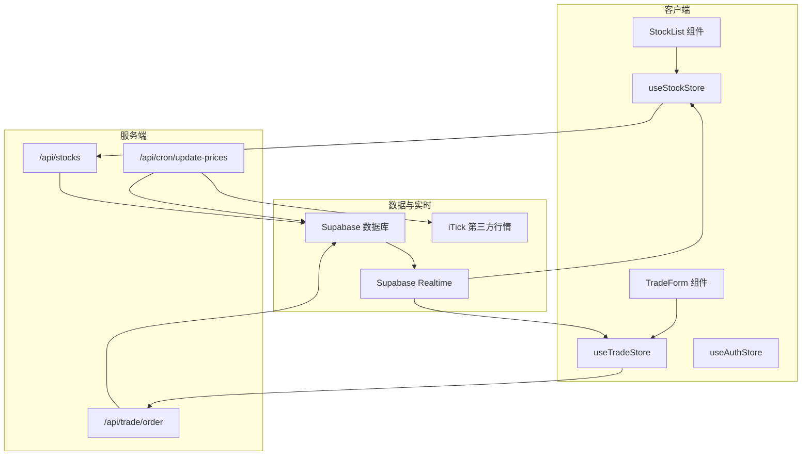
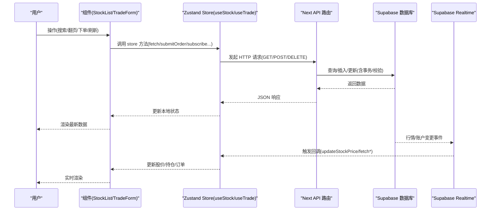
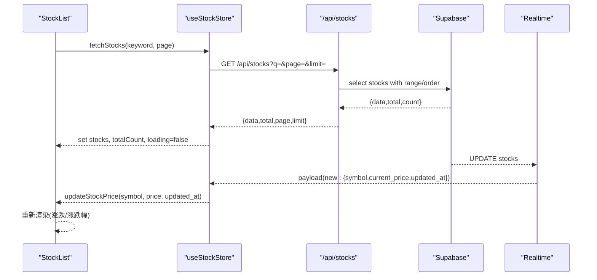
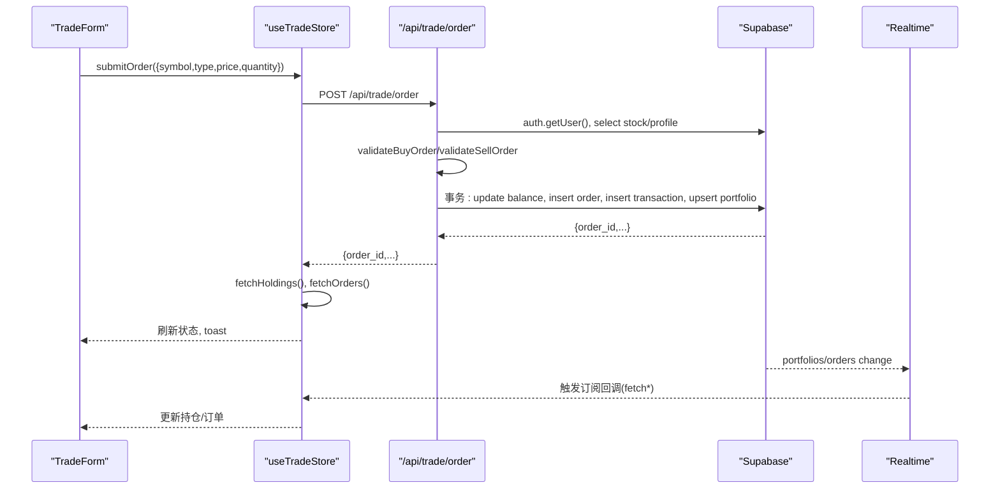
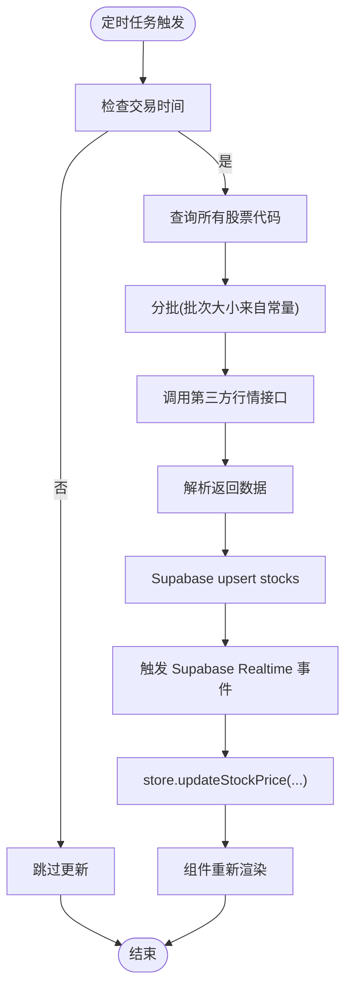
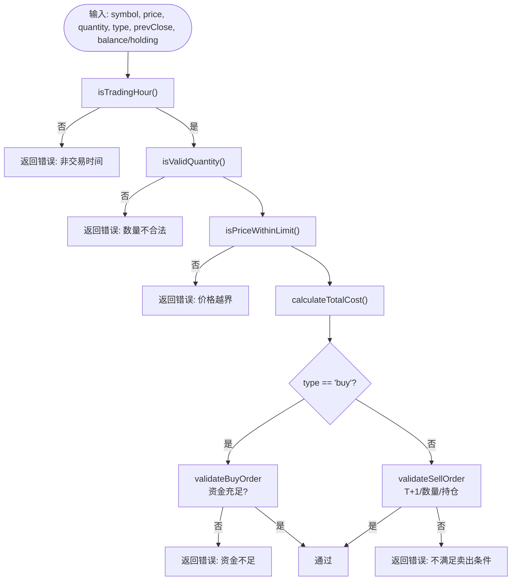
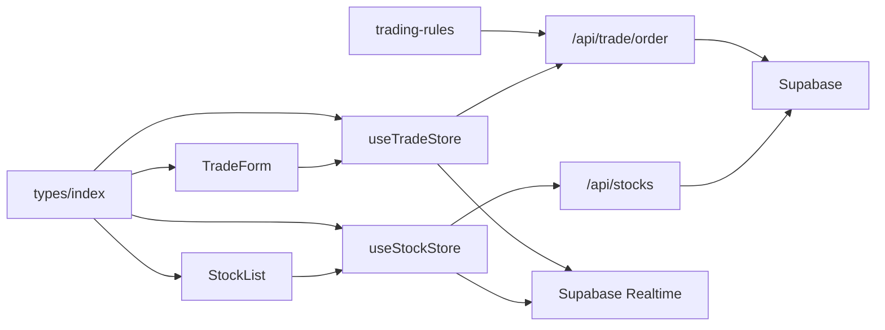

# 数据流架构

<cite>
**本文引用的文件**
- [app/page.tsx](file://app/page.tsx)
- [stores/index.ts](file://stores/index.ts)
- [stores/useStockStore.ts](file://stores/useStockStore.ts)
- [stores/useTradeStore.ts](file://stores/useTradeStore.ts)
- [stores/useAuthStore.ts](file://stores/useAuthStore.ts)
- [components/stocks/StockList.tsx](file://components/stocks/StockList.tsx)
- [components/trade/TradeForm.tsx](file://components/trade/TradeForm.tsx)
- [lib/trading-rules.ts](file://lib/trading-rules.ts)
- [lib/constants.ts](file://lib/constants.ts)
- [lib/utils.ts](file://lib/utils.ts)
- [lib/supabase/client.ts](file://lib/supabase/client.ts)
- [types/index.ts](file://types/index.ts)
- [app/api/stocks/route.ts](file://app/api/stocks/route.ts)
- [app/api/trade/order/route.ts](file://app/api/trade/order/route.ts)
- [app/api/cron/update-prices/route.ts](file://app/api/cron/update-prices/route.ts)
</cite>

## 目录
1. [引言](#引言)
2. [项目结构](#项目结构)
3. [核心组件](#核心组件)
4. [架构总览](#架构总览)
5. [详细组件分析](#详细组件分析)
6. [依赖关系分析](#依赖关系分析)
7. [性能考量](#性能考量)
8. [故障排查指南](#故障排查指南)
9. [结论](#结论)
10. [附录](#附录)

## 引言
本文件面向虚拟股票交易系统，系统性梳理从用户操作到最终渲染的完整数据流路径，覆盖组件状态、store 状态、API 请求与数据库响应；阐述实时数据更新机制（Supabase 实时订阅与第三方行情 API 同步）；说明数据验证与转换流程（交易规则引擎）；解释缓存策略与数据一致性保障；并提供数据流监控与调试方法。

## 项目结构
系统采用 Next.js App Router + Zustand 状态管理 + Supabase 数据与实时订阅 + 自定义交易规则引擎的分层架构。前端组件通过 store 发起 API 请求，store 再调用 Supabase 读写数据库；同时通过 Supabase Realtime 订阅实现股价与账户数据的近实时更新；定时任务通过 Cron 接口拉取第三方行情并批量写入数据库。

图表来源
- [components/stocks/StockList.tsx:1-136](file://components/stocks/StockList.tsx#L1-L136)
- [components/trade/TradeForm.tsx:1-234](file://components/trade/TradeForm.tsx#L1-L234)
- [stores/useStockStore.ts:1-184](file://stores/useStockStore.ts#L1-L184)
- [stores/useTradeStore.ts:1-192](file://stores/useTradeStore.ts#L1-L192)
- [stores/useAuthStore.ts:1-104](file://stores/useAuthStore.ts#L1-L104)
- [app/api/stocks/route.ts:1-69](file://app/api/stocks/route.ts#L1-L69)
- [app/api/trade/order/route.ts:1-331](file://app/api/trade/order/route.ts#L1-L331)
- [app/api/cron/update-prices/route.ts:1-150](file://app/api/cron/update-prices/route.ts#L1-L150)
- [lib/supabase/client.ts:1-9](file://lib/supabase/client.ts#L1-L9)

章节来源
- [stores/index.ts:1-7](file://stores/index.ts#L1-L7)
- [lib/constants.ts:1-101](file://lib/constants.ts#L1-L101)

## 核心组件
- 状态管理（Zustand）
  - useStockStore：负责股票列表、自选股、搜索关键词、分页、实时订阅与股价更新。
  - useTradeStore：负责持仓、订单、交易流水的获取与提交，以及账户与订单的实时订阅。
  - useAuthStore：负责认证会话初始化、登录/注册/登出与状态监听。
- 业务规则引擎（lib/trading-rules.ts）
  - 交易时间判断、涨跌停计算、手续费与总成本计算、数量校验、T+1 规则、买入/卖出校验、盈亏计算等。
- 类型定义（types/index.ts）
  - 统一定义 Stock、Portfolio、Order、Transaction、WatchlistItem、AssetOverview 等核心数据模型。
- Supabase 客户端（lib/supabase/client.ts）
  - 浏览器端 Supabase 客户端封装，供 store 与组件使用。
- 常量与工具（lib/constants.ts、lib/utils.ts）
  - 交易常量（费率、涨跌停、交易时间）、API 常量、UI 常量、格式化工具等。

章节来源
- [stores/useStockStore.ts:1-184](file://stores/useStockStore.ts#L1-L184)
- [stores/useTradeStore.ts:1-192](file://stores/useTradeStore.ts#L1-L192)
- [stores/useAuthStore.ts:1-104](file://stores/useAuthStore.ts#L1-L104)
- [lib/trading-rules.ts:1-272](file://lib/trading-rules.ts#L1-L272)
- [types/index.ts:1-166](file://types/index.ts#L1-L166)
- [lib/supabase/client.ts:1-9](file://lib/supabase/client.ts#L1-L9)
- [lib/constants.ts:1-101](file://lib/constants.ts#L1-L101)
- [lib/utils.ts:1-47](file://lib/utils.ts#L1-L47)

## 架构总览
系统数据流分为“请求链路”和“实时链路”两部分：
- 请求链路：组件 → store → API → Supabase → 数据库；返回时 store 更新本地状态，组件重新渲染。
- 实时链路：Supabase Realtime → store 回调 → 更新股价/账户 → 组件渲染；第三方行情通过定时任务批量写入数据库。

图表来源
- [components/stocks/StockList.tsx:1-136](file://components/stocks/StockList.tsx#L1-L136)
- [components/trade/TradeForm.tsx:1-234](file://components/trade/TradeForm.tsx#L1-L234)
- [stores/useStockStore.ts:1-184](file://stores/useStockStore.ts#L1-L184)
- [stores/useTradeStore.ts:1-192](file://stores/useTradeStore.ts#L1-L192)
- [app/api/stocks/route.ts:1-69](file://app/api/stocks/route.ts#L1-L69)
- [app/api/trade/order/route.ts:1-331](file://app/api/trade/order/route.ts#L1-L331)
- [lib/supabase/client.ts:1-9](file://lib/supabase/client.ts#L1-L9)

## 详细组件分析

### 股票列表数据流（StockList → useStockStore → API → Supabase）
- 组件职责：展示搜索框、分页、加载骨架、股票卡片；触发 store 的搜索与分页。
- store 职责：维护 stocks/watchlist/searchKeyword/currentPage/totalCount/isLoading；发起 /api/stocks；订阅股价实时更新；更新股价与涨跌幅。
- API 职责：接收 q/page/limit，查询 stocks 并计算涨跌幅，返回分页结果。
- 数据一致性：store 在收到 Supabase UPDATE 事件时，同步更新股价、涨跌额与涨跌幅。

图表来源
- [components/stocks/StockList.tsx:1-136](file://components/stocks/StockList.tsx#L1-L136)
- [stores/useStockStore.ts:1-184](file://stores/useStockStore.ts#L1-L184)
- [app/api/stocks/route.ts:1-69](file://app/api/stocks/route.ts#L1-L69)

章节来源
- [components/stocks/StockList.tsx:1-136](file://components/stocks/StockList.tsx#L1-L136)
- [stores/useStockStore.ts:1-184](file://stores/useStockStore.ts#L1-L184)
- [app/api/stocks/route.ts:1-69](file://app/api/stocks/route.ts#L1-L69)

### 交易下单数据流（TradeForm → useTradeStore → API → Supabase 事务）
- 组件职责：根据当前股价设置默认价格，校验交易时间、数量、资金/持仓、涨跌停；提交订单。
- store 职责：submitOrder 调用 /api/trade/order；成功后刷新持仓与订单；提供取消订单能力；订阅账户与订单实时更新。
- API 职责：校验登录、交易时间、股票存在性、价格有效性；执行买入/卖出校验与费用计算；在单据中使用数据库事务确保资金、订单、交易、持仓一致性。
- 数据一致性：通过 Supabase 事务与实时订阅保障最终一致。

图表来源
- [components/trade/TradeForm.tsx:1-234](file://components/trade/TradeForm.tsx#L1-L234)
- [stores/useTradeStore.ts:1-192](file://stores/useTradeStore.ts#L1-L192)
- [app/api/trade/order/route.ts:1-331](file://app/api/trade/order/route.ts#L1-L331)
- [lib/trading-rules.ts:1-272](file://lib/trading-rules.ts#L1-L272)

章节来源
- [components/trade/TradeForm.tsx:1-234](file://components/trade/TradeForm.tsx#L1-L234)
- [stores/useTradeStore.ts:1-192](file://stores/useTradeStore.ts#L1-L192)
- [app/api/trade/order/route.ts:1-331](file://app/api/trade/order/route.ts#L1-L331)
- [lib/trading-rules.ts:1-272](file://lib/trading-rules.ts#L1-L272)

### 实时数据更新机制（Supabase Realtime + 定时任务）
- Supabase Realtime
  - 股价：订阅 stocks 表的 UPDATE 事件，store.updateStockPrice 同步更新股价与涨跌幅。
  - 账户：订阅 portfolios 表的任意事件，store.fetchHoldings 刷新持仓；订阅 orders 表的任意事件，store.fetchOrders 刷新订单。
- 定时任务
  - Cron 接口在交易时间内批量拉取第三方行情，upsert 到 stocks 表，驱动 Realtime 事件，从而实现股价的持续更新。

图表来源
- [app/api/cron/update-prices/route.ts:1-150](file://app/api/cron/update-prices/route.ts#L1-L150)
- [lib/constants.ts:70-95](file://lib/constants.ts#L70-L95)
- [stores/useStockStore.ts:125-150](file://stores/useStockStore.ts#L125-L150)

章节来源
- [stores/useStockStore.ts:125-150](file://stores/useStockStore.ts#L125-L150)
- [stores/useTradeStore.ts:144-186](file://stores/useTradeStore.ts#L144-L186)
- [app/api/cron/update-prices/route.ts:1-150](file://app/api/cron/update-prices/route.ts#L1-L150)
- [lib/constants.ts:70-95](file://lib/constants.ts#L70-L95)

### 数据验证与转换流程（交易规则引擎）
- 交易时间：isTradingHour、getNextTradingTime。
- 涨跌停：getUpperLimitPrice、getLowerLimitPrice、isPriceWithinLimit。
- 费用与成本：calculateFee、calculateTotalCost。
- 数量与单位：isValidQuantity、formatQuantity。
- T+1：canSellToday。
- 买入/卖出校验：validateBuyOrder、validateSellOrder。
- 盈亏与市值：calculateProfitLoss、calculateMarketValue。

图表来源
- [lib/trading-rules.ts:1-272](file://lib/trading-rules.ts#L1-L272)

章节来源
- [lib/trading-rules.ts:1-272](file://lib/trading-rules.ts#L1-L272)

### 缓存策略与数据一致性
- 组件级缓存：React 组件自身渲染缓存，store 状态变更触发重渲染。
- Store 级缓存：useStockStore/useTradeStore 内部状态作为主要缓存，避免重复请求。
- 数据库一致性：交易下单使用 Supabase 事务，确保资金、订单、交易、持仓原子性更新。
- 实时一致性：Supabase Realtime 订阅保证股价与账户变更的近实时同步，store 以最新数据驱动渲染。

章节来源
- [stores/useStockStore.ts:1-184](file://stores/useStockStore.ts#L1-L184)
- [stores/useTradeStore.ts:1-192](file://stores/useTradeStore.ts#L1-L192)
- [app/api/trade/order/route.ts:1-331](file://app/api/trade/order/route.ts#L1-L331)

### 数据流监控与调试方法
- 控制台日志
  - store 中的 fetch 失败与 API 错误均输出日志，便于定位问题。
  - 定时任务接口记录批次错误与 upsert 错误。
- 网络面板
  - 使用浏览器开发者工具查看 /api/* 请求与响应，核对参数与返回体。
- Supabase 调试
  - 检查 Realtime 订阅通道是否正常，确认事件是否到达客户端。
  - 核对数据库表结构与索引，确保查询与 upsert 性能。
- 交易规则调试
  - 使用 trading-rules 的函数在组件或控制台中验证价格、费用、数量与校验结果。
- 常量与环境变量
  - 检查 lib/constants.ts 中的费率、涨跌停、交易时间与 API 常量是否正确；确认环境变量是否加载。

章节来源
- [stores/useStockStore.ts:52-56](file://stores/useStockStore.ts#L52-L56)
- [stores/useTradeStore.ts:61-65](file://stores/useTradeStore.ts#L61-L65)
- [app/api/cron/update-prices/route.ts:142-148](file://app/api/cron/update-prices/route.ts#L142-L148)
- [lib/constants.ts:1-101](file://lib/constants.ts#L1-L101)

## 依赖关系分析
- 组件依赖 store：StockList 依赖 useStockStore；TradeForm 依赖 useTradeStore 与 useUserStore/useUIStore。
- store 依赖 Supabase 客户端：createClient 用于 Realtime 订阅与数据库访问。
- API 依赖 Supabase 客户端与交易规则：/api/stocks 与 /api/trade/order 均依赖 Supabase；下单 API 依赖 trading-rules。
- 类型统一：types/index.ts 为全栈共享的数据契约，避免前后端不一致。

图表来源
- [components/stocks/StockList.tsx:1-136](file://components/stocks/StockList.tsx#L1-L136)
- [components/trade/TradeForm.tsx:1-234](file://components/trade/TradeForm.tsx#L1-L234)
- [stores/useStockStore.ts:1-184](file://stores/useStockStore.ts#L1-L184)
- [stores/useTradeStore.ts:1-192](file://stores/useTradeStore.ts#L1-L192)
- [app/api/stocks/route.ts:1-69](file://app/api/stocks/route.ts#L1-L69)
- [app/api/trade/order/route.ts:1-331](file://app/api/trade/order/route.ts#L1-L331)
- [lib/trading-rules.ts:1-272](file://lib/trading-rules.ts#L1-L272)
- [types/index.ts:1-166](file://types/index.ts#L1-L166)

章节来源
- [types/index.ts:1-166](file://types/index.ts#L1-L166)

## 性能考量
- 分页与批量：/api/stocks 使用 range + order，避免全表扫描；定时任务按批次拉取第三方行情，减少单次请求压力。
- 实时订阅：仅订阅必要表与过滤条件，降低消息风暴。
- 本地缓存：store 内部状态作为缓存，避免重复请求；组件按需渲染，减少重绘。
- 事务优化：下单使用单事务，减少多次往返与中间态不一致风险。
- 格式化开销：UI 层格式化（货币/百分比/成交量）在渲染时进行，建议在 store 中预计算展示字段以减轻渲染负担。

## 故障排查指南
- 认证问题
  - 检查 useAuthStore 初始化与 onAuthStateChange 是否正常；确认 Supabase 环境变量是否正确。
- 股价不更新
  - 确认 Supabase Realtime 通道订阅是否建立；检查 /api/cron/update-prices 是否在交易时间运行且无错误。
- 下单失败
  - 查看 /api/trade/order 的返回错误；核对交易时间、数量、价格、资金/持仓是否满足 validateBuyOrder/validateSellOrder。
- 数据不一致
  - 检查 Supabase 事务是否成功；确认实时订阅回调是否触发 fetch* 刷新。
- 性能问题
  - 检查分页参数与批次大小；观察网络面板与数据库查询计划；评估组件重渲染频率。

章节来源
- [stores/useAuthStore.ts:81-102](file://stores/useAuthStore.ts#L81-L102)
- [stores/useStockStore.ts:125-150](file://stores/useStockStore.ts#L125-L150)
- [app/api/trade/order/route.ts:1-331](file://app/api/trade/order/route.ts#L1-L331)
- [app/api/cron/update-prices/route.ts:1-150](file://app/api/cron/update-prices/route.ts#L1-L150)

## 结论
本系统通过清晰的分层与严格的契约（类型与规则），实现了从前端交互到数据库事务的完整闭环；借助 Supabase Realtime 与定时任务，确保了股价与账户数据的实时性与一致性；交易规则引擎贯穿请求链路，保障了业务合规与用户体验。建议在后续迭代中进一步沉淀监控指标与告警，完善异常回滚与重试策略，并在 store 中预计算展示字段以提升渲染性能。

## 附录
- 快速入口
  - 首页重定向：app/page.tsx
  - 统一导出 store：stores/index.ts
  - Supabase 客户端：lib/supabase/client.ts
  - 交易规则：lib/trading-rules.ts
  - 常量与工具：lib/constants.ts、lib/utils.ts
  - 类型定义：types/index.ts

章节来源
- [app/page.tsx:1-8](file://app/page.tsx#L1-L8)
- [stores/index.ts:1-7](file://stores/index.ts#L1-L7)
- [lib/supabase/client.ts:1-9](file://lib/supabase/client.ts#L1-L9)
- [lib/trading-rules.ts:1-272](file://lib/trading-rules.ts#L1-L272)
- [lib/constants.ts:1-101](file://lib/constants.ts#L1-L101)
- [lib/utils.ts:1-47](file://lib/utils.ts#L1-L47)
- [types/index.ts:1-166](file://types/index.ts#L1-L166)