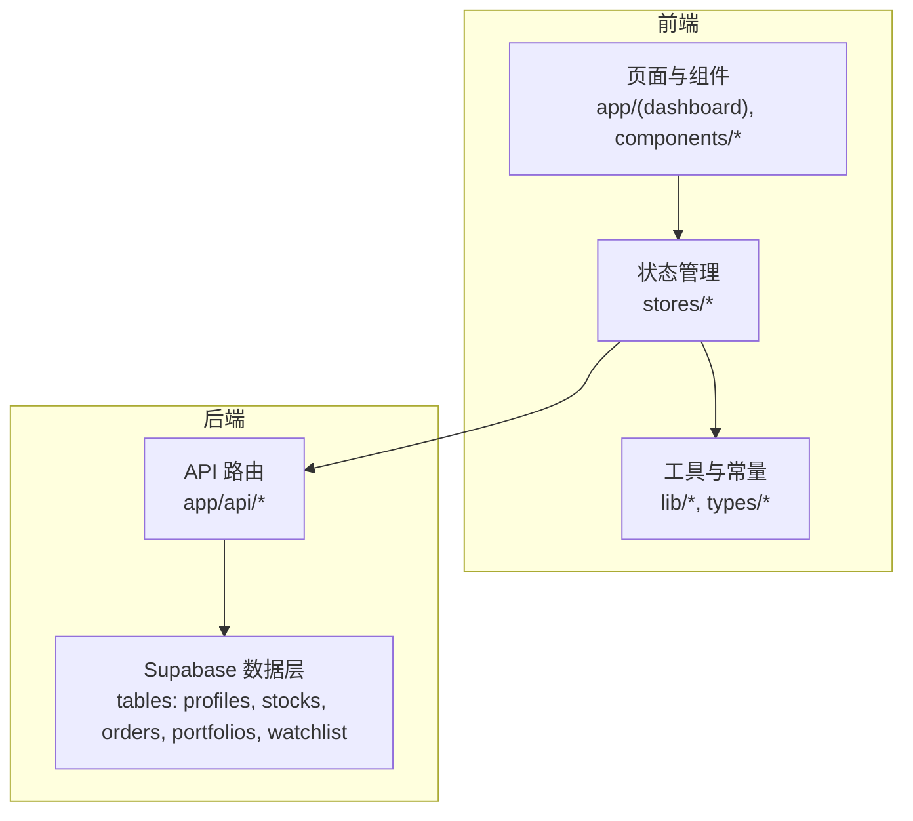
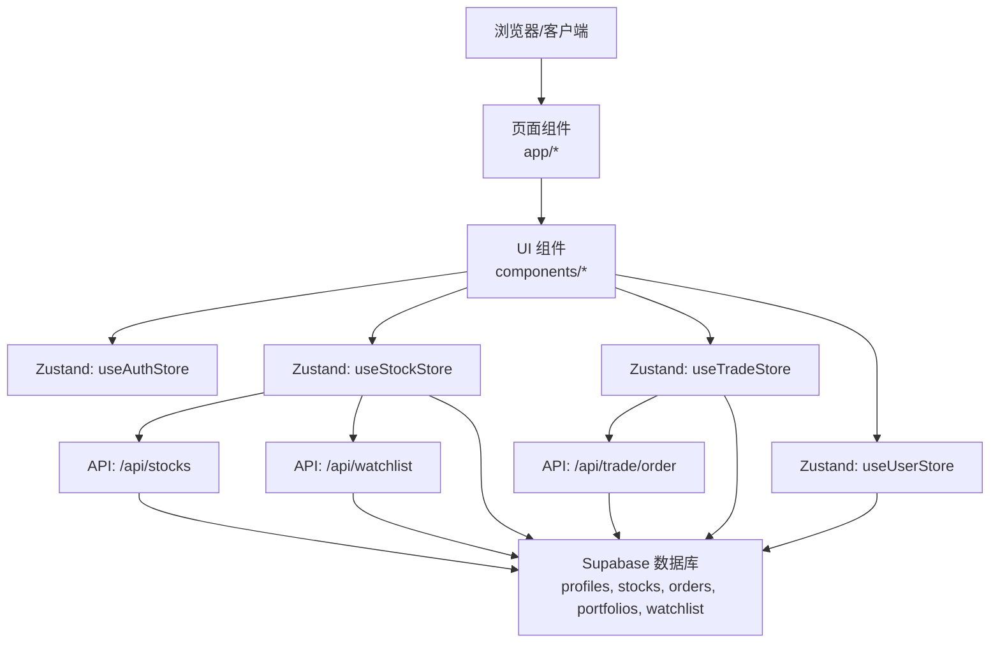
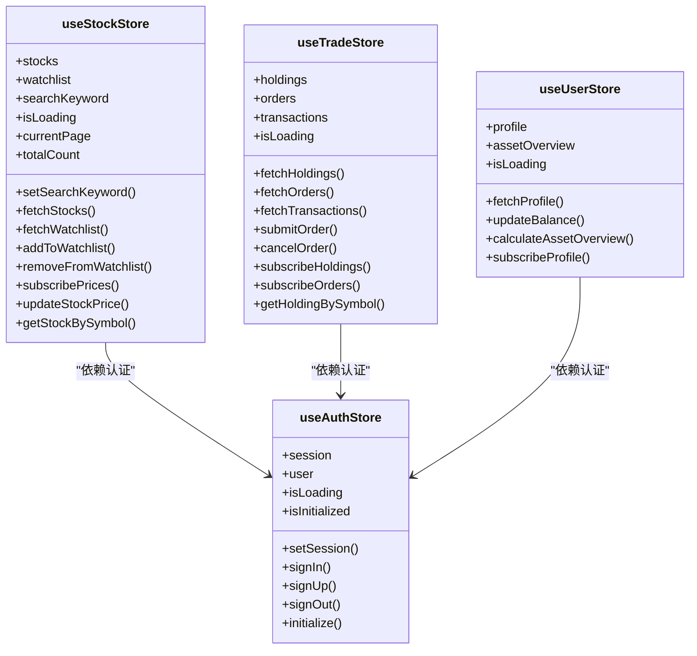
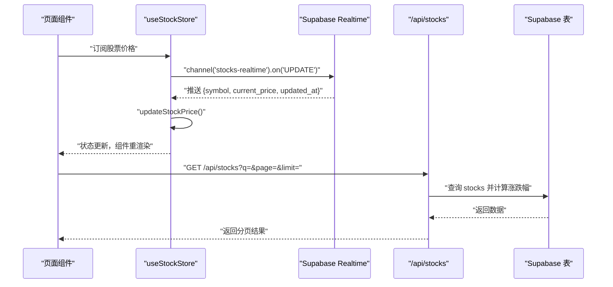
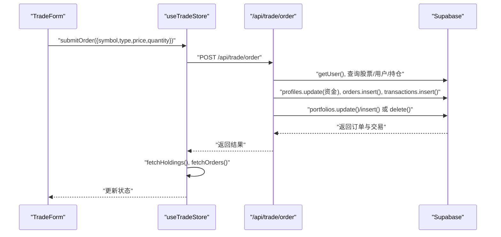
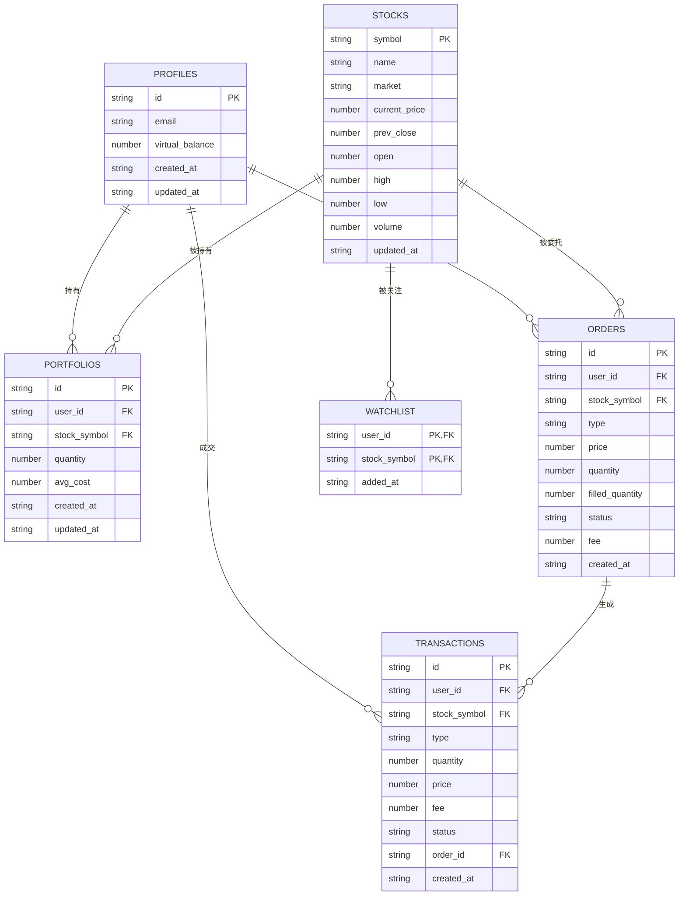
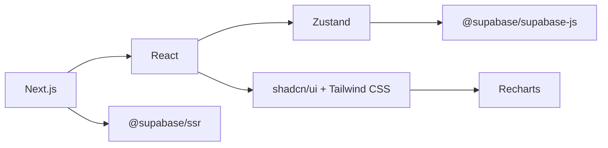

# 架构设计

<cite>
**本文引用的文件**
- [README.md](file://README.md)
- [package.json](file://package.json)
- [next.config.ts](file://next.config.ts)
- [lib/constants.ts](file://lib/constants.ts)
- [lib/utils.ts](file://lib/utils.ts)
- [lib/trading-rules.ts](file://lib/trading-rules.ts)
- [types/index.ts](file://types/index.ts)
- [stores/index.ts](file://stores/index.ts)
- [stores/useAuthStore.ts](file://stores/useAuthStore.ts)
- [stores/useStockStore.ts](file://stores/useStockStore.ts)
- [stores/useTradeStore.ts](file://stores/useTradeStore.ts)
- [stores/useUserStore.ts](file://stores/useUserStore.ts)
- [app/api/stocks/route.ts](file://app/api/stocks/route.ts)
- [app/api/trade/order/route.ts](file://app/api/trade/order/route.ts)
- [app/api/watchlist/route.ts](file://app/api/watchlist/route.ts)
</cite>

## 目录
1. [引言](#引言)
2. [项目结构](#项目结构)
3. [核心组件](#核心组件)
4. [架构总览](#架构总览)
5. [详细组件分析](#详细组件分析)
6. [依赖关系分析](#依赖关系分析)
7. [性能考量](#性能考量)
8. [故障排查指南](#故障排查指南)
9. [结论](#结论)
10. [附录](#附录)

## 引言
本系统是一个基于 Next.js App Router 的虚拟股票交易应用，采用前后端分离与实时订阅相结合的架构。前端通过组件化设计与 Zustand 状态管理实现交互与数据流控制；后端以 API 路由为核心，连接 Supabase 数据层，提供交易、行情、自选股等业务能力。系统支持 Supabase 实时订阅、交易规则校验、以及可配置的交易常量与 UI 常量。

## 项目结构
- 前端采用 Next.js App Router，页面与 API 路由分层清晰，组件位于 components 目录，UI 基于 shadcn/ui 与 Tailwind CSS。
- 状态管理统一使用 Zustand，按功能拆分为多个 Store（认证、用户、股票、交易、UI）。
- 后端 API 路由位于 app/api 下，分别处理股票、交易、自选股、用户资料等请求。
- 工具与常量位于 lib 与 types 目录，提供交易规则、格式化工具、类型定义与全局常量。

**图表来源**
- [next.config.ts:1-8](file://next.config.ts#L1-L8)
- [stores/index.ts:1-7](file://stores/index.ts#L1-L7)
- [app/api/stocks/route.ts:1-69](file://app/api/stocks/route.ts#L1-L69)
- [app/api/trade/order/route.ts:1-331](file://app/api/trade/order/route.ts#L1-L331)
- [app/api/watchlist/route.ts:1-129](file://app/api/watchlist/route.ts#L1-L129)

**章节来源**
- [README.md:20-35](file://README.md#L20-L35)
- [package.json:9-29](file://package.json#L9-L29)
- [next.config.ts:1-8](file://next.config.ts#L1-L8)

## 核心组件
- 状态管理（Zustand）
  - useAuthStore：负责认证态初始化、登录/注册/登出与会话监听。
  - useStockStore：负责股票列表、自选股、实时价格订阅与搜索。
  - useTradeStore：负责持仓、订单、成交历史的获取与订阅，下单与撤单。
  - useUserStore：负责用户资料与资产概览的计算与订阅。
- API 路由
  - /api/stocks：分页查询股票列表，计算涨跌幅。
  - /api/trade/order：提交买入/卖出委托，执行资金、订单、交易、持仓的事务性更新。
  - /api/watchlist：获取/添加自选股，返回带涨跌幅的组合数据。
- 工具与常量
  - lib/constants.ts：交易常量、股票代码规则、API 常量、UI 常量与功能开关。
  - lib/trading-rules.ts：交易时间、涨跌停、手续费、数量校验、盈亏计算等规则。
  - lib/utils.ts：格式化工具（货币、数字、百分比、成交量）。
  - types/index.ts：用户、股票、K线、持仓、交易、订单、自选股、资产概览等类型定义。

**章节来源**
- [stores/useAuthStore.ts:1-104](file://stores/useAuthStore.ts#L1-L104)
- [stores/useStockStore.ts:1-184](file://stores/useStockStore.ts#L1-L184)
- [stores/useTradeStore.ts:1-192](file://stores/useTradeStore.ts#L1-L192)
- [stores/useUserStore.ts:1-110](file://stores/useUserStore.ts#L1-L110)
- [app/api/stocks/route.ts:1-69](file://app/api/stocks/route.ts#L1-L69)
- [app/api/trade/order/route.ts:1-331](file://app/api/trade/order/route.ts#L1-L331)
- [app/api/watchlist/route.ts:1-129](file://app/api/watchlist/route.ts#L1-L129)
- [lib/constants.ts:1-101](file://lib/constants.ts#L1-L101)
- [lib/trading-rules.ts:1-272](file://lib/trading-rules.ts#L1-L272)
- [lib/utils.ts:1-47](file://lib/utils.ts#L1-L47)
- [types/index.ts:1-166](file://types/index.ts#L1-L166)

## 架构总览
系统采用“前端组件 + Zustand 状态 + Next.js API 路由 + Supabase”的分层架构：
- 前端层：页面组件与 UI 组件通过 Zustand Store 管理状态，发起 HTTP 请求或订阅 Supabase 实时事件。
- 状态管理层：各 Store 负责各自域的数据获取、缓存与订阅，避免跨域耦合。
- API 层：Next.js App Router 的 API 路由作为服务端入口，封装业务逻辑与数据库操作。
- 数据层：Supabase 提供认证、表结构与实时变更订阅。

**图表来源**
- [stores/useAuthStore.ts:1-104](file://stores/useAuthStore.ts#L1-L104)
- [stores/useStockStore.ts:1-184](file://stores/useStockStore.ts#L1-L184)
- [stores/useTradeStore.ts:1-192](file://stores/useTradeStore.ts#L1-L192)
- [stores/useUserStore.ts:1-110](file://stores/useUserStore.ts#L1-L110)
- [app/api/stocks/route.ts:1-69](file://app/api/stocks/route.ts#L1-L69)
- [app/api/trade/order/route.ts:1-331](file://app/api/trade/order/route.ts#L1-L331)
- [app/api/watchlist/route.ts:1-129](file://app/api/watchlist/route.ts#L1-L129)

## 详细组件分析

### 状态管理架构（Zustand）
- 设计模式
  - 每个 Store 独立维护自身状态与方法，通过 create 定义，避免全局状态混乱。
  - Store 内部通过 set/get 访问与更新状态，支持异步数据拉取与订阅回调。
- 组件间数据流
  - 页面组件通过 Hook 访问 Store，Store 通过 API 或 Supabase 订阅更新状态。
  - 订阅函数返回解绑函数，便于组件卸载时清理资源。
- 认证与用户
  - useAuthStore 初始化时读取会话并监听 Auth 状态变化；useUserStore 订阅 profiles 表更新。
- 股票与自选股
  - useStockStore 提供分页查询、关键词搜索、自选股增删、实时价格订阅与更新。
- 交易
  - useTradeStore 提供持仓、订单、成交查询，下单/撤单调用 API 并触发订阅刷新。

**图表来源**
- [stores/useAuthStore.ts:1-104](file://stores/useAuthStore.ts#L1-L104)
- [stores/useStockStore.ts:1-184](file://stores/useStockStore.ts#L1-L184)
- [stores/useTradeStore.ts:1-192](file://stores/useTradeStore.ts#L1-L192)
- [stores/useUserStore.ts:1-110](file://stores/useUserStore.ts#L1-L110)

**章节来源**
- [stores/index.ts:1-7](file://stores/index.ts#L1-L7)
- [stores/useAuthStore.ts:1-104](file://stores/useAuthStore.ts#L1-L104)
- [stores/useStockStore.ts:1-184](file://stores/useStockStore.ts#L1-L184)
- [stores/useTradeStore.ts:1-192](file://stores/useTradeStore.ts#L1-L192)
- [stores/useUserStore.ts:1-110](file://stores/useUserStore.ts#L1-L110)

### 实时数据更新机制
- Supabase 实时订阅
  - 股票价格：useStockStore 订阅 stocks 表 UPDATE 事件，收到新报价后更新本地状态。
  - 持仓与订单：useTradeStore 订阅 portfolios 与 orders 表变更，自动刷新对应列表。
  - 用户资料：useUserStore 订阅 profiles 表 UPDATE，保持用户余额与概览同步。
- 第三方 API 集成
  - 库中定义了 iTick API 常量与批量大小，为后续接入行情数据提供扩展点（当前路由未直接调用）。

**图表来源**
- [stores/useStockStore.ts:125-150](file://stores/useStockStore.ts#L125-L150)
- [app/api/stocks/route.ts:5-69](file://app/api/stocks/route.ts#L5-L69)

**章节来源**
- [stores/useStockStore.ts:125-150](file://stores/useStockStore.ts#L125-L150)
- [stores/useTradeStore.ts:144-164](file://stores/useTradeStore.ts#L144-L164)
- [stores/useUserStore.ts:88-108](file://stores/useUserStore.ts#L88-L108)
- [app/api/stocks/route.ts:5-69](file://app/api/stocks/route.ts#L5-L69)

### 交易流程（下单与撤单）
- 下单流程
  - 校验登录、交易时间、价格与数量、涨跌停范围、资金/持仓是否充足。
  - 买入：冻结资金、创建订单、生成交易、更新/新增持仓。
  - 卖出：释放资金、创建订单、生成交易、更新/删除持仓。
- 撤单流程
  - 调用 API 删除订单，刷新订单列表。

**图表来源**
- [stores/useTradeStore.ts:99-121](file://stores/useTradeStore.ts#L99-L121)
- [app/api/trade/order/route.ts:10-331](file://app/api/trade/order/route.ts#L10-L331)

**章节来源**
- [stores/useTradeStore.ts:99-121](file://stores/useTradeStore.ts#L99-L121)
- [app/api/trade/order/route.ts:10-331](file://app/api/trade/order/route.ts#L10-L331)

### 数据模型设计
- 核心实体关系
  - 用户（profiles）：拥有虚拟资金，与 orders、transactions、portfolios、watchlist 关联。
  - 股票（stocks）：行情数据，被 watchlist 与 orders 关联。
  - 持仓（portfolios）：用户对某只股票的持有情况，关联 stocks。
  - 订单（orders）：委托记录，关联 users 与 stocks。
  - 交易（transactions）：成交明细，关联 users 与 orders。
  - 自选股（watchlist）：用户关注的股票集合，关联 users 与 stocks。
- 类型定义
  - types/index.ts 中定义了 Profile、Stock、KlineData、Portfolio、Transaction、Order、WatchlistItem、AssetOverview、TradeStatistics、PerformanceData 等类型，覆盖交易全链路。

**图表来源**
- [types/index.ts:1-166](file://types/index.ts#L1-L166)

**章节来源**
- [types/index.ts:1-166](file://types/index.ts#L1-L166)

### 前端架构与组件化设计
- Next.js App Router
  - 页面路由与 API 路由分离，页面组件位于 app/*，API 路由位于 app/api/*。
  - 布局与通用样式位于 app/layout.tsx 与 app/globals.css。
- 组件组织
  - components/layout：底部导航、头部、侧边栏等布局组件。
  - components/portfolio、components/stocks、components/trade、components/watchlist：功能域组件。
  - components/ui：基础 UI 组件（按钮、卡片、输入框等）。
- 组件与 Store 的关系
  - 页面组件通过 Hook 访问 Store，Store 负责数据获取与订阅，组件仅负责展示与交互。

**章节来源**
- [README.md:20-35](file://README.md#L20-L35)

## 依赖关系分析
- 技术栈
  - 前端：Next.js、React、Zustand、shadcn/ui、Tailwind CSS、Recharts。
  - 后端：Next.js App Router API 路由、Supabase（认证与数据库）。
  - 工具：date-fns、lucide-react、next-themes。
- 关键依赖
  - @supabase/supabase-js、@supabase/ssr：用于客户端/服务端 Supabase 客户端与会话管理。
  - zustand：轻量状态管理，替代 Redux。
  - recharts：用于图表展示（如收益走势）。

**图表来源**
- [package.json:9-29](file://package.json#L9-L29)

**章节来源**
- [package.json:1-44](file://package.json#L1-L44)

## 性能考量
- 前端性能
  - Next.js 缓存组件配置，减少重复渲染开销。
  - Zustand Store 按域拆分，避免全局状态风暴；订阅返回解绑函数，防止内存泄漏。
- 后端性能
  - API 路由使用分页查询与排序，限制最大页大小，降低数据库压力。
  - Supabase 实时订阅按需过滤（如 stocks 的 symbol in (...)），减少广播范围。
- 数据处理
  - 前端 Store 在收到实时更新后批量更新状态，避免频繁重渲染。
  - 交易计算在服务端完成，保证一致性与准确性。

**章节来源**
- [next.config.ts:1-8](file://next.config.ts#L1-L8)
- [lib/constants.ts:70-79](file://lib/constants.ts#L70-L79)
- [stores/useStockStore.ts:125-150](file://stores/useStockStore.ts#L125-L150)

## 故障排查指南
- 认证问题
  - useAuthStore.initialize 会在初始化时获取会话并监听状态变化；若登录异常，检查 Supabase 会话与回调地址。
- 股票数据异常
  - useStockStore.fetchStocks 与 API /api/stocks 返回的涨跌幅由服务端计算；若显示异常，检查 stocks 表字段与查询条件。
- 交易失败
  - /api/trade/order 对下单/撤单有严格校验（时间、数量、价格、资金/持仓）。查看返回的错误信息定位问题。
- 实时订阅未生效
  - 确认 Supabase Realtime 是否启用，订阅过滤条件是否正确，组件卸载时是否调用了返回的解绑函数。

**章节来源**
- [stores/useAuthStore.ts:81-102](file://stores/useAuthStore.ts#L81-L102)
- [app/api/stocks/route.ts:55-60](file://app/api/stocks/route.ts#L55-L60)
- [app/api/trade/order/route.ts:18-49](file://app/api/trade/order/route.ts#L18-L49)
- [stores/useStockStore.ts:125-150](file://stores/useStockStore.ts#L125-L150)

## 结论
本系统通过清晰的前后端分层、组件化设计与 Zustand 状态管理，实现了稳定且可扩展的虚拟股票交易体验。结合 Supabase 的认证与实时订阅能力，系统在保证一致性的同时具备良好的可维护性与扩展性。未来可在行情数据接入、策略分析与风控模块上进一步增强。

## 附录
- 系统边界
  - 前端：页面与组件、状态管理、UI 组件。
  - 后端：API 路由、数据库表与 Supabase 认证。
- 技术约束
  - 交易时间、涨跌停、手续费与最小交易单位均来自常量与规则模块。
- 扩展建议
  - 接入第三方行情 API（已预留常量），增加策略分析模块（Signal、AlertConfig）与回测框架。