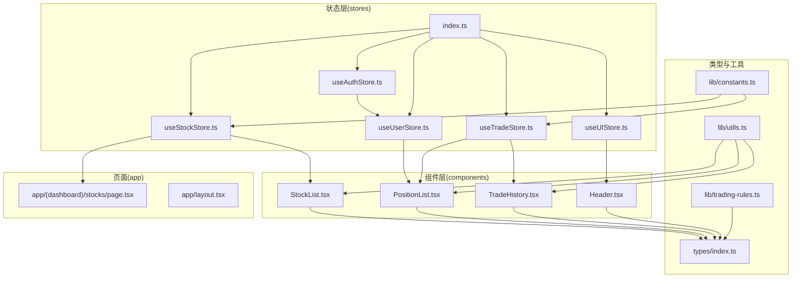
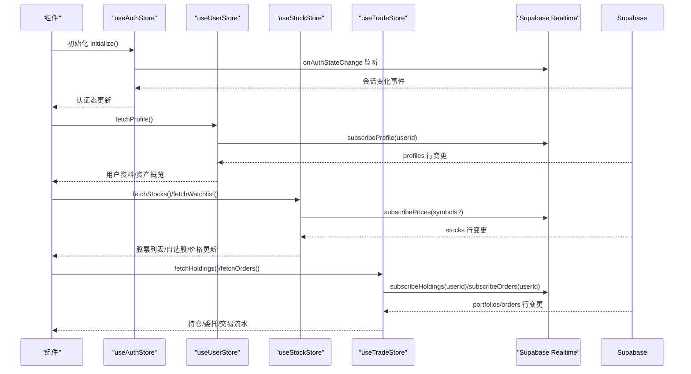
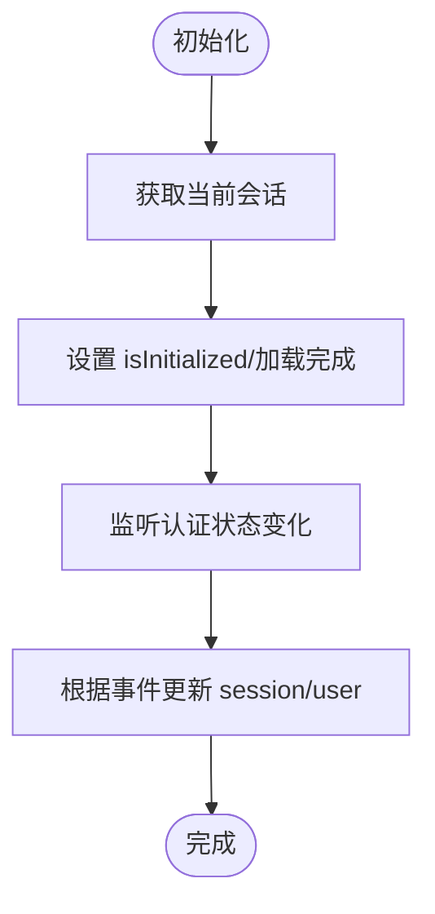
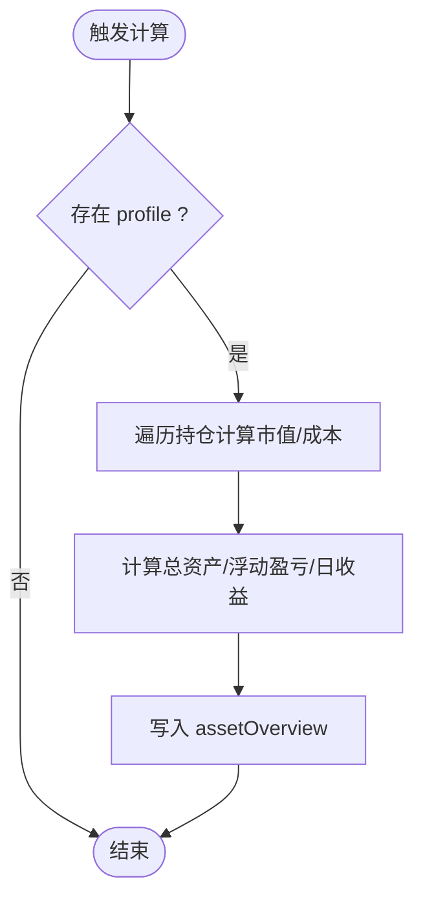
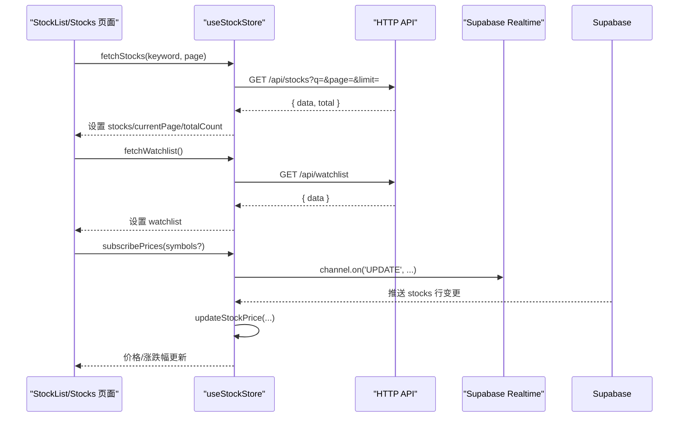
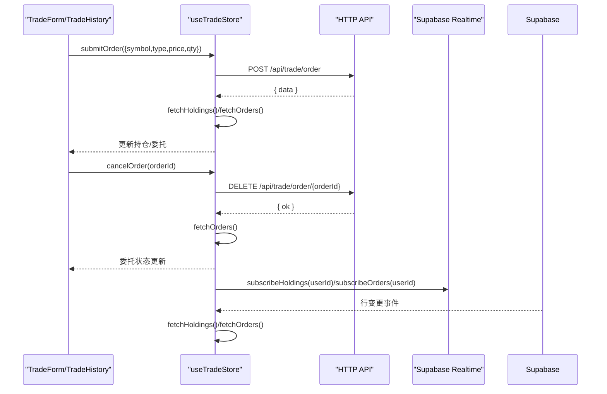
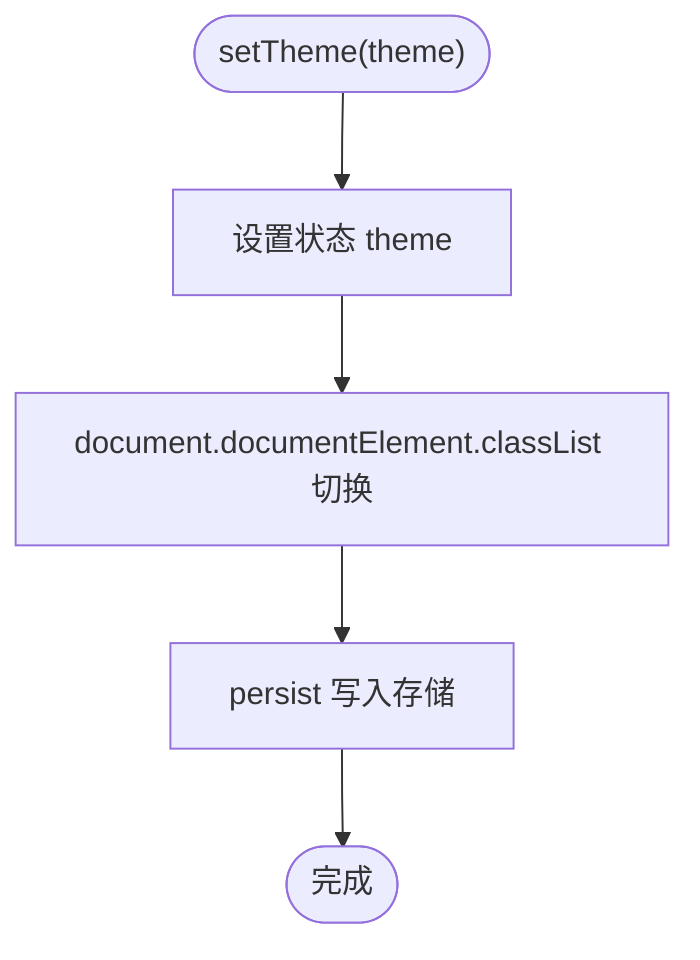
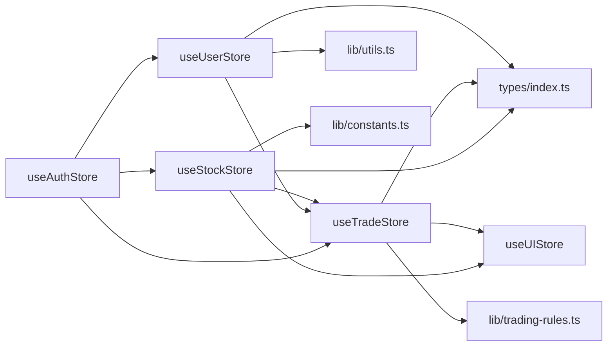

# 状态管理架构

<cite>
**本文引用的文件**
- [stores/index.ts](file://stores/index.ts)
- [stores/useAuthStore.ts](file://stores/useAuthStore.ts)
- [stores/useStockStore.ts](file://stores/useStockStore.ts)
- [stores/useTradeStore.ts](file://stores/useTradeStore.ts)
- [stores/useUIStore.ts](file://stores/useUIStore.ts)
- [stores/useUserStore.ts](file://stores/useUserStore.ts)
- [types/index.ts](file://types/index.ts)
- [lib/constants.ts](file://lib/constants.ts)
- [lib/trading-rules.ts](file://lib/trading-rules.ts)
- [lib/utils.ts](file://lib/utils.ts)
- [components/stocks/StockList.tsx](file://components/stocks/StockList.tsx)
- [components/portfolio/PositionList.tsx](file://components/portfolio/PositionList.tsx)
- [components/trade/TradeHistory.tsx](file://components/trade/TradeHistory.tsx)
- [components/layout/Header.tsx](file://components/layout/Header.tsx)
- [app/(dashboard)/stocks/page.tsx](file://app/(dashboard)/stocks/page.tsx)
- [app/layout.tsx](file://app/layout.tsx)
</cite>

## 目录
1. [引言](#引言)
2. [项目结构](#项目结构)
3. [核心组件](#核心组件)
4. [架构总览](#架构总览)
5. [详细组件分析](#详细组件分析)
6. [依赖关系分析](#依赖关系分析)
7. [性能考量](#性能考量)
8. [故障排查指南](#故障排查指南)
9. [结论](#结论)
10. [附录](#附录)

## 引言
本文件系统性梳理项目基于 Zustand 的状态管理架构，聚焦以下目标：
- 解释 store 的设计模式：状态定义、action 函数、selector 优化
- 阐述各 store 间的依赖关系与数据流转：useAuthStore、useStockStore、useTradeStore、useUserStore、useUIStore
- 说明组件与 store 的绑定模式与状态订阅机制
- 解释状态持久化策略与跨组件状态共享方案
- 提供状态调试与性能优化建议

## 项目结构
仓库采用按功能域划分的目录组织，状态管理集中在 stores 目录，类型定义在 types 目录，业务工具在 lib 目录，UI 组件在 components 目录，页面在 app 目录。

图表来源
- [stores/index.ts:1-7](file://stores/index.ts#L1-L7)
- [stores/useAuthStore.ts:1-104](file://stores/useAuthStore.ts#L1-L104)
- [stores/useUserStore.ts:1-110](file://stores/useUserStore.ts#L1-L110)
- [stores/useStockStore.ts:1-184](file://stores/useStockStore.ts#L1-L184)
- [stores/useTradeStore.ts:1-192](file://stores/useTradeStore.ts#L1-L192)
- [stores/useUIStore.ts:1-78](file://stores/useUIStore.ts#L1-L78)
- [types/index.ts:1-166](file://types/index.ts#L1-L166)
- [lib/trading-rules.ts:1-272](file://lib/trading-rules.ts#L1-L272)
- [lib/constants.ts:1-101](file://lib/constants.ts#L1-L101)
- [lib/utils.ts:1-47](file://lib/utils.ts#L1-L47)
- [components/stocks/StockList.tsx:1-47](file://components/stocks/StockList.tsx#L1-L47)
- [components/portfolio/PositionList.tsx:1-194](file://components/portfolio/PositionList.tsx#L1-L194)
- [components/trade/TradeHistory.tsx:1-155](file://components/trade/TradeHistory.tsx#L1-L155)
- [components/layout/Header.tsx:1-96](file://components/layout/Header.tsx#L1-L96)
- [app/(dashboard)/stocks/page.tsx:1-39](file://app/(dashboard)/stocks/page.tsx#L1-L39)
- [app/layout.tsx:1-42](file://app/layout.tsx#L1-L42)

章节来源
- [stores/index.ts:1-7](file://stores/index.ts#L1-L7)
- [stores/useAuthStore.ts:1-104](file://stores/useAuthStore.ts#L1-L104)
- [stores/useUserStore.ts:1-110](file://stores/useUserStore.ts#L1-L110)
- [stores/useStockStore.ts:1-184](file://stores/useStockStore.ts#L1-L184)
- [stores/useTradeStore.ts:1-192](file://stores/useTradeStore.ts#L1-L192)
- [stores/useUIStore.ts:1-78](file://stores/useUIStore.ts#L1-L78)
- [types/index.ts:1-166](file://types/index.ts#L1-L166)
- [lib/constants.ts:1-101](file://lib/constants.ts#L1-L101)
- [lib/trading-rules.ts:1-272](file://lib/trading-rules.ts#L1-L272)
- [lib/utils.ts:1-47](file://lib/utils.ts#L1-L47)
- [components/stocks/StockList.tsx:1-47](file://components/stocks/StockList.tsx#L1-L47)
- [components/portfolio/PositionList.tsx:1-194](file://components/portfolio/PositionList.tsx#L1-L194)
- [components/trade/TradeHistory.tsx:1-155](file://components/trade/TradeHistory.tsx#L1-L155)
- [components/layout/Header.tsx:1-96](file://components/layout/Header.tsx#L1-L96)
- [app/(dashboard)/stocks/page.tsx:1-39](file://app/(dashboard)/stocks/page.tsx#L1-L39)
- [app/layout.tsx:1-42](file://app/layout.tsx#L1-L42)

## 核心组件
- useAuthStore：负责认证态（会话、用户、加载状态），提供登录、注册、登出、初始化等动作，并监听 Supabase 认证状态变化。
- useUserStore：负责用户资料与资产概览，提供资料拉取、余额更新、资产概览计算、Profile 实时订阅。
- useStockStore：负责股票列表、自选股、搜索、分页、实时行情订阅与价格更新、按符号查询。
- useTradeStore：负责持仓、委托、交易流水，提供下单、撤单、实时订阅（持仓/订单），以及按符号查询持仓。
- useUIStore：负责主题、侧边栏折叠、模态框、消息提示、移动端状态，使用 persist 中间件实现主题与侧边栏状态持久化。

章节来源
- [stores/useAuthStore.ts:5-15](file://stores/useAuthStore.ts#L5-L15)
- [stores/useUserStore.ts:5-13](file://stores/useUserStore.ts#L5-L13)
- [stores/useStockStore.ts:6-21](file://stores/useStockStore.ts#L6-L21)
- [stores/useTradeStore.ts:6-25](file://stores/useTradeStore.ts#L6-L25)
- [stores/useUIStore.ts:5-18](file://stores/useUIStore.ts#L5-L18)

## 架构总览
Zustand 通过 create 定义 store，内部通过 set/get 更新与读取状态；store 之间通过函数调用与外部 API/SSE（Supabase Realtime）协同工作。组件通过 hooks 方式订阅 store，实现细粒度渲染与高性能更新。

图表来源
- [stores/useAuthStore.ts:81-102](file://stores/useAuthStore.ts#L81-L102)
- [stores/useUserStore.ts:88-108](file://stores/useUserStore.ts#L88-L108)
- [stores/useStockStore.ts:125-150](file://stores/useStockStore.ts#L125-L150)
- [stores/useTradeStore.ts:144-186](file://stores/useTradeStore.ts#L144-L186)

## 详细组件分析

### useAuthStore：认证状态管理
- 状态定义：session、user、isLoading、isInitialized
- 动作函数：setSession、signIn、signUp、signOut、initialize
- 设计要点：
  - initialize 中先 getSession，再 onAuthStateChange 监听，确保初始化完成与后续状态同步
  - signIn/signUp/signOut 通过 Supabase 客户端执行，成功后 set 对应状态
- 与组件绑定：Header 在有用户时渲染，体现认证态对 UI 的影响

图表来源
- [stores/useAuthStore.ts:81-102](file://stores/useAuthStore.ts#L81-L102)

章节来源
- [stores/useAuthStore.ts:5-15](file://stores/useAuthStore.ts#L5-L15)
- [stores/useAuthStore.ts:17-103](file://stores/useAuthStore.ts#L17-L103)
- [components/layout/Header.tsx:10-31](file://components/layout/Header.tsx#L10-L31)

### useUserStore：用户资料与资产概览
- 状态定义：profile、assetOverview、isLoading
- 动作函数：fetchProfile、updateBalance、calculateAssetOverview、subscribeProfile
- 设计要点：
  - calculateAssetOverview 基于持仓与账户余额计算总资产、浮动盈亏、日收益等
  - subscribeProfile 基于 Supabase Realtime 订阅 profiles 表，实时同步用户资料
- 与组件绑定：PositionList 使用 calculateAssetOverview 计算并展示资产概览

图表来源
- [stores/useUserStore.ts:53-86](file://stores/useUserStore.ts#L53-L86)

章节来源
- [stores/useUserStore.ts:5-13](file://stores/useUserStore.ts#L5-L13)
- [stores/useUserStore.ts:15-109](file://stores/useUserStore.ts#L15-L109)
- [components/portfolio/PositionList.tsx:24-43](file://components/portfolio/PositionList.tsx#L24-L43)

### useStockStore：股票列表与实时行情
- 状态定义：stocks、watchlist、searchKeyword、isLoading、currentPage、totalCount
- 动作函数：setSearchKeyword、fetchStocks、fetchWatchlist、addToWatchlist、removeFromWatchlist、subscribePrices、updateStockPrice、getStockBySymbol
- 设计要点：
  - subscribePrices 基于 Supabase Realtime 订阅 stocks 表 UPDATE 事件，回调中调用 updateStockPrice 批量更新两处列表
  - updateStockPrice 同时更新 stocks 与 watchlist，保证两个视图一致
  - getStockBySymbol 从内存中快速查找，避免重复请求
- 与组件绑定：StockList、Stocks 页面使用 fetchStocks/fetchWatchlist/add/remove，TradeForm 通过 getStockBySymbol 获取实时价格

图表来源
- [stores/useStockStore.ts:33-78](file://stores/useStockStore.ts#L33-L78)
- [stores/useStockStore.ts:125-150](file://stores/useStockStore.ts#L125-L150)
- [stores/useStockStore.ts:152-177](file://stores/useStockStore.ts#L152-L177)

章节来源
- [stores/useStockStore.ts:6-21](file://stores/useStockStore.ts#L6-L21)
- [stores/useStockStore.ts:23-183](file://stores/useStockStore.ts#L23-L183)
- [components/stocks/StockList.tsx:19-47](file://components/stocks/StockList.tsx#L19-L47)
- [app/(dashboard)/stocks/page.tsx:14-39](file://app/(dashboard)/stocks/page.tsx#L14-L39)

### useTradeStore：交易相关状态
- 状态定义：holdings、orders、transactions、isLoading
- 动作函数：fetchHoldings、fetchOrders、fetchTransactions、submitOrder、cancelOrder、subscribeHoldings、subscribeOrders、getHoldingBySymbol
- 设计要点：
  - submitOrder 成功后刷新 holdings 与 orders，并可联动刷新用户资料（在组件中调用）
  - subscribeHoldings/subscribeOrders 基于 Supabase Realtime 订阅 portfolios/orders 表，自动拉取最新数据
  - calculateProfitLoss 由 trading-rules 提供，用于计算持仓浮动盈亏
- 与组件绑定：TradeHistory 展示委托记录并支持撤单；PositionList 展示持仓并联动资产概览

图表来源
- [stores/useTradeStore.ts:99-142](file://stores/useTradeStore.ts#L99-L142)
- [stores/useTradeStore.ts:144-186](file://stores/useTradeStore.ts#L144-L186)

章节来源
- [stores/useTradeStore.ts:6-25](file://stores/useTradeStore.ts#L6-L25)
- [stores/useTradeStore.ts:27-191](file://stores/useTradeStore.ts#L27-L191)
- [components/trade/TradeHistory.tsx:16-36](file://components/trade/TradeHistory.tsx#L16-L36)
- [components/portfolio/PositionList.tsx:24-43](file://components/portfolio/PositionList.tsx#L24-L43)

### useUIStore：UI 状态与持久化
- 状态定义：theme、sidebarCollapsed、activeModal、toasts、isMobile
- 动作函数：setTheme、toggleSidebar、openModal、closeModal、showToast、hideToast、setIsMobile
- 设计要点：
  - 使用 persist 中间件，仅持久化 theme 与 sidebarCollapsed
  - setTheme 同步修改 documentElement 的 class，驱动全局样式切换
  - showToast 自动 3 秒后隐藏，避免手动管理
- 与组件绑定：Header 使用 setTheme 控制主题切换；StockList 使用 isMobile 控制布局

图表来源
- [stores/useUIStore.ts:29-37](file://stores/useUIStore.ts#L29-L37)
- [stores/useUIStore.ts:69-76](file://stores/useUIStore.ts#L69-L76)

章节来源
- [stores/useUIStore.ts:5-18](file://stores/useUIStore.ts#L5-L18)
- [stores/useUIStore.ts:20-77](file://stores/useUIStore.ts#L20-L77)
- [components/layout/Header.tsx:54-60](file://components/layout/Header.tsx#L54-L60)
- [components/stocks/StockList.tsx:33](file://components/stocks/StockList.tsx#L33)

## 依赖关系分析
- 组件与 store 的绑定模式
  - 组件通过解构 useXxxStore 获取状态与动作，如 useStockStore() 返回 stocks/searchKeyword/setSearchKeyword/fetchStocks 等
  - 页面组件在 useEffect 中触发首次数据拉取，如 Stocks 页面同时拉取股票列表与自选股
- store 间依赖与协作
  - 认证初始化完成后，其他 store 可安全地进行数据拉取与订阅
  - 下单成功后，tradeStore 刷新持仓与订单；若需联动用户余额，可在组件中调用 userStore.fetchProfile
  - 实时订阅由各 store 内部维护，返回清理函数，由页面或布局统一管理生命周期
- 类型与工具依赖
  - types/index.ts 定义了 Stock、Portfolio、Order、Transaction、AssetOverview 等核心类型
  - lib/constants.ts 提供交易常量与分页、刷新间隔等配置
  - lib/trading-rules.ts 提供交易校验、费用计算、盈亏计算等纯函数
  - lib/utils.ts 提供格式化工具，被多个组件复用

图表来源
- [stores/useAuthStore.ts:17-103](file://stores/useAuthStore.ts#L17-L103)
- [stores/useUserStore.ts:15-109](file://stores/useUserStore.ts#L15-L109)
- [stores/useStockStore.ts:23-183](file://stores/useStockStore.ts#L23-L183)
- [stores/useTradeStore.ts:27-191](file://stores/useTradeStore.ts#L27-L191)
- [stores/useUIStore.ts:20-77](file://stores/useUIStore.ts#L20-L77)
- [types/index.ts:1-166](file://types/index.ts#L1-L166)
- [lib/constants.ts:70-95](file://lib/constants.ts#L70-L95)
- [lib/trading-rules.ts:250-272](file://lib/trading-rules.ts#L250-L272)
- [lib/utils.ts:14-46](file://lib/utils.ts#L14-L46)

章节来源
- [stores/index.ts:1-7](file://stores/index.ts#L1-L7)
- [types/index.ts:1-166](file://types/index.ts#L1-L166)
- [lib/constants.ts:1-101](file://lib/constants.ts#L1-L101)
- [lib/trading-rules.ts:1-272](file://lib/trading-rules.ts#L1-L272)
- [lib/utils.ts:1-47](file://lib/utils.ts#L1-L47)

## 性能考量
- selector 优化
  - 使用解构只订阅所需字段，避免不必要的重渲染，如在 StockList 中仅解构所需字段
  - 对高频渲染组件，优先使用局部 selector，减少全局订阅范围
- 数据更新策略
  - useStockStore.updateStockPrice 通过一次 set 批量更新两个列表，降低多次 set 的开销
  - useTradeStore.submitOrder/cancelOrder 成功后仅刷新必要数据，避免全量拉取
- 订阅生命周期
  - 订阅返回清理函数，应在页面卸载或依赖变化时及时取消，防止内存泄漏与无效网络请求
- 分页与搜索
  - useStockStore.fetchStocks 支持分页与关键词，结合防抖输入，减少无效请求
- 格式化与计算
  - 将格式化逻辑放入 lib/utils.ts，避免在渲染路径中重复计算
  - 资产概览计算在 userStore.calculateAssetOverview 中集中处理，避免组件内分散逻辑

## 故障排查指南
- 认证相关
  - 若登录后 UI 未更新，检查 useAuthStore.initialize 是否正确监听 onAuthStateChange 并 set 了 session/user
  - 若注册后无提示，检查 signUp 返回的消息是否被 UI 正确消费
- 实时订阅
  - 若股价不更新，确认 subscribePrices 已正确建立通道且过滤条件正确
  - 若持仓/委托不更新，确认 subscribeHoldings/subscribeOrders 的 userId 参数与用户匹配
- 网络与错误
  - 所有异步动作均包含 try/catch 与 finally 设置 isLoading 结束，检查控制台错误信息
  - 对于 API 返回错误，store 返回 { error }，组件应显示 toast 或错误提示
- 持久化
  - 主题与侧边栏状态异常，检查 useUIStore.persist 配置与存储键名

章节来源
- [stores/useAuthStore.ts:31-48](file://stores/useAuthStore.ts#L31-L48)
- [stores/useAuthStore.ts:50-69](file://stores/useAuthStore.ts#L50-L69)
- [stores/useStockStore.ts:125-150](file://stores/useStockStore.ts#L125-L150)
- [stores/useTradeStore.ts:144-186](file://stores/useTradeStore.ts#L144-L186)
- [stores/useUIStore.ts:47-65](file://stores/useUIStore.ts#L47-L65)

## 结论
本项目采用 Zustand 实现清晰的模块化状态管理：useAuthStore 负责认证态，useUserStore 管理用户资料与资产概览，useStockStore 负责股票与实时行情，useTradeStore 管理交易相关数据，useUIStore 提供 UI 状态与持久化。store 之间通过动作调用与 Supabase Realtime 协作，组件通过细粒度订阅实现高效渲染。配合 selector 优化、订阅生命周期管理与工具函数抽象，整体具备良好的可维护性与扩展性。

## 附录
- 统一导出入口：stores/index.ts 将各 store 统一导出，便于组件按需引入
- 页面主题：app/layout.tsx 使用 next-themes 提供主题切换基础，配合 useUIStore.setTheme 实现 DOM 级别切换

章节来源
- [stores/index.ts:1-7](file://stores/index.ts#L1-L7)
- [app/layout.tsx:22-41](file://app/layout.tsx#L22-L41)