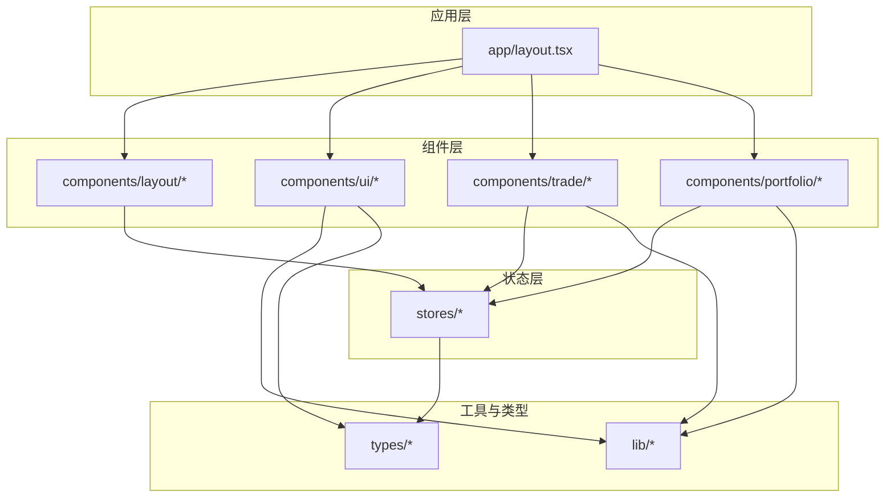
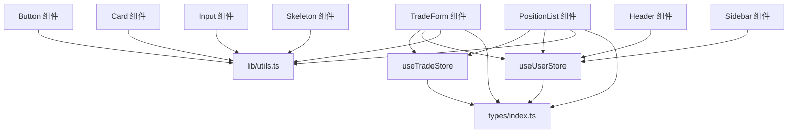
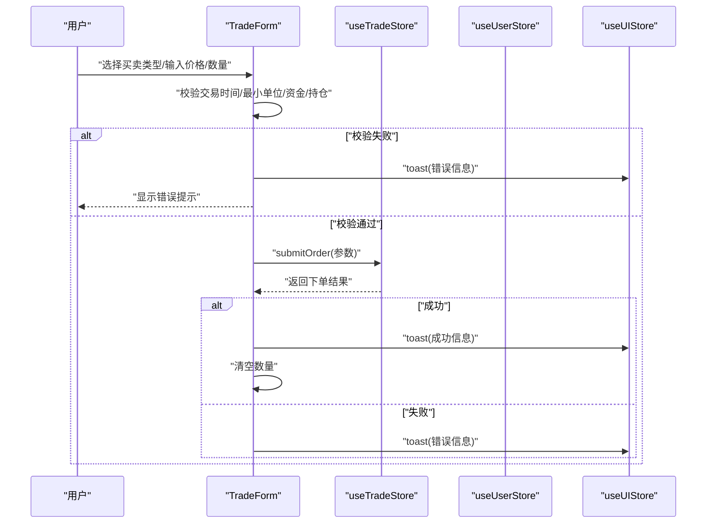
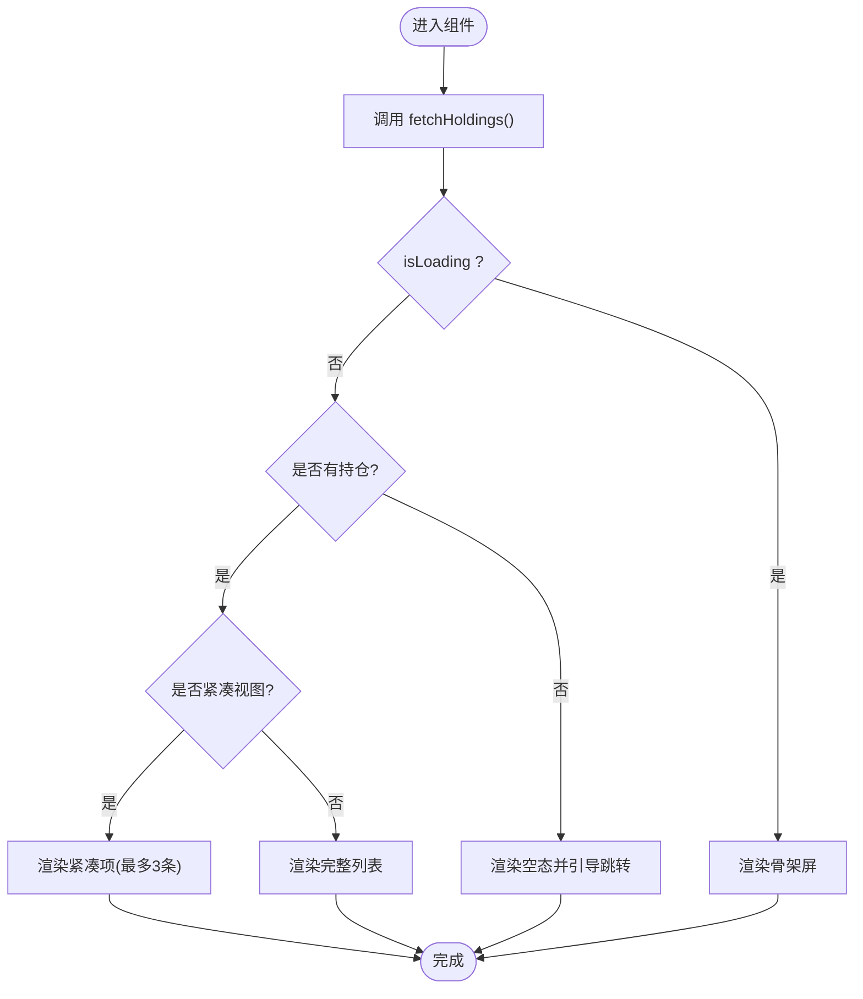
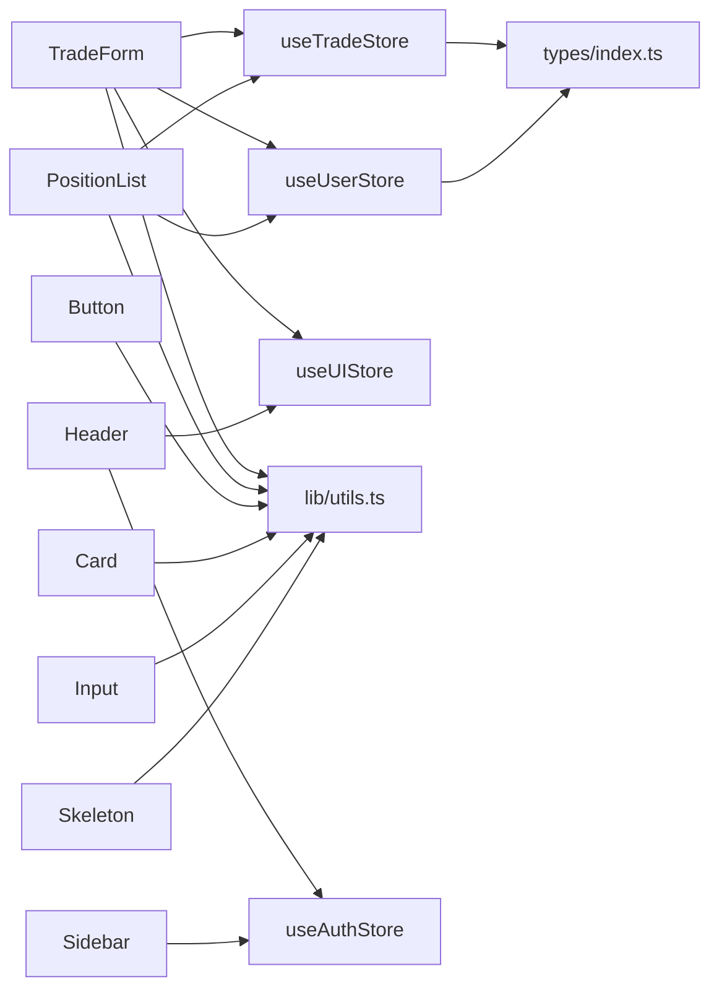

# 组件架构

<cite>
**本文引用的文件**
- [components/trade/TradeForm.tsx](file://components/trade/TradeForm.tsx)
- [components/portfolio/PositionList.tsx](file://components/portfolio/PositionList.tsx)
- [components/layout/Header.tsx](file://components/layout/Header.tsx)
- [components/layout/Sidebar.tsx](file://components/layout/Sidebar.tsx)
- [components/ui/button.tsx](file://components/ui/button.tsx)
- [components/ui/card.tsx](file://components/ui/card.tsx)
- [components/ui/input.tsx](file://components/ui/input.tsx)
- [components/ui/skeleton.tsx](file://components/ui/skeleton.tsx)
- [stores/index.ts](file://stores/index.ts)
- [stores/useTradeStore.ts](file://stores/useTradeStore.ts)
- [stores/useUserStore.ts](file://stores/useUserStore.ts)
- [lib/utils.ts](file://lib/utils.ts)
- [types/index.ts](file://types/index.ts)
- [app/layout.tsx](file://app/layout.tsx)
- [tailwind.config.ts](file://tailwind.config.ts)
</cite>

## 目录
1. [简介](#简介)
2. [项目结构](#项目结构)
3. [核心组件](#核心组件)
4. [架构总览](#架构总览)
5. [组件详解](#组件详解)
6. [依赖关系分析](#依赖关系分析)
7. [性能与可维护性](#性能与可维护性)
8. [故障排查指南](#故障排查指南)
9. [结论](#结论)
10. [附录](#附录)

## 简介
本文件系统性梳理虚拟股票交易系统的组件架构，聚焦以下目标：
- UI组件设计模式与复用策略：以shadcn/ui风格为基础，结合自定义样式变量与工具函数，形成统一的视觉与交互语言。
- 组件定制与主题适配：通过CSS变量与Tailwind扩展，实现明暗主题与品牌色系的一致性。
- 功能组件架构：深入解析TradeForm、PositionList等核心业务组件的职责划分、状态管理与数据流。
- 组件通信模式：props传递、事件回调与状态共享（Zustand）的协作方式。
- 可测试性与可维护性：接口清晰、职责单一、依赖明确，便于单元测试与长期演进。
- 性能优化与最佳实践：懒加载、条件渲染、计算缓存与副作用控制。

## 项目结构
项目采用“按功能域分层”的组织方式：
- app：应用根布局与页面容器，负责主题提供器与全局样式注入。
- components：按领域拆分的UI与业务组件，如布局、交易、组合、股票等。
- stores：集中式状态管理（Zustand），封装交易、用户、UI等状态与副作用。
- lib：通用工具与业务规则（格式化、交易规则常量等）。
- types：全栈共享的数据模型与API响应结构。
- docs：项目文档与规范说明。

图表来源
- [app/layout.tsx:22-41](file://app/layout.tsx#L22-L41)
- [stores/index.ts:1-7](file://stores/index.ts#L1-L7)

章节来源
- [app/layout.tsx:1-42](file://app/layout.tsx#L1-L42)
- [stores/index.ts:1-7](file://stores/index.ts#L1-L7)

## 核心组件
本节从设计模式、数据结构与处理逻辑三个维度，对关键组件进行剖析。

- 设计模式
  - 组合优先：通过Card、Button、Input等基础组件组合成复杂界面，遵循“可组合、可变体”的设计原则。
  - 受控与非受控混合：输入类组件（Input）采用受控模式；布局与交互（Header、Sidebar）采用本地状态与外部状态结合。
  - 分离关注点：UI组件专注展示与交互，业务组件（TradeForm、PositionList）负责业务逻辑与状态调用。
- 数据结构
  - 类型体系：Stock、Portfolio、Order、Transaction、AssetOverview等，覆盖行情、持仓、交易、资产概览等核心领域。
  - 工具函数：cn、formatCurrency、formatNumber、formatPercent、formatVolume等，统一格式化与样式合并。
- 处理逻辑
  - TradeForm：交易时间校验、涨跌停价、最小交易单位、最大买卖数量、下单提交与结果反馈。
  - PositionList：持仓列表加载、空态与紧凑视图、点击回调、资产概览联动计算。

章节来源
- [components/ui/button.tsx:1-58](file://components/ui/button.tsx#L1-L58)
- [components/ui/card.tsx:1-84](file://components/ui/card.tsx#L1-L84)
- [components/ui/input.tsx:1-23](file://components/ui/input.tsx#L1-L23)
- [components/ui/skeleton.tsx:1-16](file://components/ui/skeleton.tsx#L1-L16)
- [lib/utils.ts:1-47](file://lib/utils.ts#L1-L47)
- [types/index.ts:1-166](file://types/index.ts#L1-L166)

## 架构总览
系统采用“组件 + 状态 + 工具 + 类型”的分层架构：
- 组件层：布局（Header、Sidebar）、通用UI（Button、Card、Input、Skeleton）与业务组件（TradeForm、PositionList）。
- 状态层：Zustand Store（useTradeStore、useUserStore）集中管理交易、用户与UI状态，并通过订阅机制实时同步。
- 工具层：格式化、样式合并、环境检测等工具函数，贯穿各组件。
- 类型层：统一的数据模型与API响应结构，保障前后端契约一致。

图表来源
- [components/ui/button.tsx:1-58](file://components/ui/button.tsx#L1-L58)
- [components/ui/card.tsx:1-84](file://components/ui/card.tsx#L1-L84)
- [components/ui/input.tsx:1-23](file://components/ui/input.tsx#L1-L23)
- [components/ui/skeleton.tsx:1-16](file://components/ui/skeleton.tsx#L1-L16)
- [components/layout/Header.tsx:1-96](file://components/layout/Header.tsx#L1-L96)
- [components/layout/Sidebar.tsx:1-80](file://components/layout/Sidebar.tsx#L1-L80)
- [components/trade/TradeForm.tsx:1-234](file://components/trade/TradeForm.tsx#L1-L234)
- [components/portfolio/PositionList.tsx:1-194](file://components/portfolio/PositionList.tsx#L1-L194)
- [stores/useTradeStore.ts:1-192](file://stores/useTradeStore.ts#L1-L192)
- [stores/useUserStore.ts:1-110](file://stores/useUserStore.ts#L1-L110)
- [lib/utils.ts:1-47](file://lib/utils.ts#L1-L47)
- [types/index.ts:1-166](file://types/index.ts#L1-L166)

## 组件详解

### TradeForm：交易表单组件
- 职责
  - 展示与收集用户输入（委托价格、数量），根据买卖类型动态计算最大可买/可卖数量。
  - 校验交易时间、最小单位、资金与持仓约束，提交订单并反馈结果。
- 设计要点
  - 使用受控组件（Input）接收数值输入，配合本地状态驱动UI。
  - 通过useTradeStore、useUserStore、useUIStore读取状态与触发副作用。
  - 通过lib/trading-rules与lib/constants进行业务规则判断与格式化输出。
- 交互流程（序列图）

图表来源
- [components/trade/TradeForm.tsx:84-127](file://components/trade/TradeForm.tsx#L84-L127)
- [stores/useTradeStore.ts:99-121](file://stores/useTradeStore.ts#L99-L121)
- [stores/useUserStore.ts:15-110](file://stores/useUserStore.ts#L15-L110)

章节来源
- [components/trade/TradeForm.tsx:1-234](file://components/trade/TradeForm.tsx#L1-L234)
- [stores/useTradeStore.ts:1-192](file://stores/useTradeStore.ts#L1-L192)
- [stores/useUserStore.ts:1-110](file://stores/useUserStore.ts#L1-L110)
- [lib/utils.ts:13-35](file://lib/utils.ts#L13-L35)

### PositionList：持仓列表组件
- 职责
  - 加载并展示用户持仓，支持紧凑视图与完整视图，提供点击回调跳转到股票详情。
  - 在持仓变化时联动计算资产概览（资产总额、浮动盈亏等）。
- 设计要点
  - 通过useTradeStore.fetchHoldings与useUserStore.calculateAssetOverview进行数据拉取与计算。
  - 使用Skeleton在加载态提供良好体验；空态引导至股票列表。
  - 内部拆分PositionItem与CompactPositionItem，体现“单一职责”与“可复用”。
- 流程图（加载与渲染）

图表来源
- [components/portfolio/PositionList.tsx:24-112](file://components/portfolio/PositionList.tsx#L24-L112)
- [stores/useTradeStore.ts:33-66](file://stores/useTradeStore.ts#L33-L66)
- [stores/useUserStore.ts:53-86](file://stores/useUserStore.ts#L53-L86)

章节来源
- [components/portfolio/PositionList.tsx:1-194](file://components/portfolio/PositionList.tsx#L1-L194)
- [stores/useTradeStore.ts:1-192](file://stores/useTradeStore.ts#L1-L192)
- [stores/useUserStore.ts:1-110](file://stores/useUserStore.ts#L1-L110)

### Header：顶部导航与搜索
- 职责
  - 展示Logo、通知、主题切换与搜索入口；在用户存在时渲染。
  - 搜索框展开/收起与清空逻辑，主题切换通过next-themes实现。
- 设计要点
  - 本地状态控制搜索框显隐与输入值；通过useUIStore预留toast能力。
  - 使用CSS变量统一颜色与边框，保证主题一致性。

章节来源
- [components/layout/Header.tsx:1-96](file://components/layout/Header.tsx#L1-L96)

### Sidebar：侧边导航
- 职责
  - 渲染导航项，高亮当前路由；展示初始资金与登出按钮。
- 设计要点
  - 使用usePathname进行路由匹配；通过cn合并样式，支持激活态背景。

章节来源
- [components/layout/Sidebar.tsx:1-80](file://components/layout/Sidebar.tsx#L1-L80)

### UI组件库（shadcn/ui风格）
- Button：通过cva定义变体与尺寸，支持asChild插槽，满足不同场景。
- Card：卡片容器与子块（Header/Title/Description/Content/Footer）解耦，便于组合。
- Input：统一输入样式与焦点态，支持受控模式。
- Skeleton：骨架屏动画，提升加载体验。

章节来源
- [components/ui/button.tsx:1-58](file://components/ui/button.tsx#L1-L58)
- [components/ui/card.tsx:1-84](file://components/ui/card.tsx#L1-L84)
- [components/ui/input.tsx:1-23](file://components/ui/input.tsx#L1-L23)
- [components/ui/skeleton.tsx:1-16](file://components/ui/skeleton.tsx#L1-L16)

## 依赖关系分析
- 组件到状态
  - TradeForm依赖useTradeStore（下单、查询）、useUserStore（资产概览）、useUIStore（消息提示）。
  - PositionList依赖useTradeStore（持仓列表）、useUserStore（资产概览计算）。
  - Header/Sidebar依赖useAuthStore与useUIStore（主题切换、消息提示）。
- 组件到工具
  - 所有组件通过lib/utils进行样式合并与数据格式化。
- 状态到类型
  - Zustand Store与类型文件types/index.ts强绑定，确保数据结构一致。
- 主题与样式
  - app/layout.tsx提供ThemeProvider；tailwind.config.ts扩展颜色与圆角变量，组件通过CSS变量消费。

图表来源
- [components/trade/TradeForm.tsx:31-33](file://components/trade/TradeForm.tsx#L31-L33)
- [components/portfolio/PositionList.tsx:25-26](file://components/portfolio/PositionList.tsx#L25-L26)
- [components/layout/Header.tsx:6-13](file://components/layout/Header.tsx#L6-L13)
- [components/layout/Sidebar.tsx:6-19](file://components/layout/Sidebar.tsx#L6-L19)
- [stores/index.ts:1-7](file://stores/index.ts#L1-L7)
- [lib/utils.ts:1-6](file://lib/utils.ts#L1-L6)
- [types/index.ts:1-166](file://types/index.ts#L1-L166)

章节来源
- [stores/index.ts:1-7](file://stores/index.ts#L1-L7)
- [lib/utils.ts:1-47](file://lib/utils.ts#L1-L47)
- [types/index.ts:1-166](file://types/index.ts#L1-L166)

## 性能与可维护性
- 性能优化
  - 条件渲染：在无持仓时渲染空态而非空列表，减少DOM节点与重排。
  - 懒加载与骨架屏：PositionList在加载时使用Skeleton，改善感知性能。
  - 状态订阅：useTradeStore与useUserStore通过Supabase变更事件自动刷新，避免轮询。
  - 输入受控：TradeForm使用受控Input，避免不必要的重渲染。
- 可维护性
  - 单一职责：PositionItem/CompactPositionItem拆分，职责清晰。
  - 明确接口：组件props仅暴露必要字段，回调通过事件函数传递。
  - 类型安全：所有状态与API响应均在types/index.ts中定义，IDE友好。
- 最佳实践
  - 将UI样式变量集中在CSS变量中，统一由Tailwind扩展，便于主题切换与品牌定制。
  - 将格式化逻辑收敛到lib/utils.ts，避免重复实现。
  - 将业务规则收敛到lib/trading-rules.ts与lib/constants.ts，保持组件简洁。

[本节为通用指导，不直接分析具体文件，故无章节来源]

## 故障排查指南
- 下单失败
  - 检查交易时间与最小单位、资金/持仓限制是否满足。
  - 查看useUIStore的toast提示与useTradeStore.submitOrder返回值。
- 持仓未更新
  - 确认useTradeStore.subscribeHoldings是否建立，以及fetchHoldings是否被调用。
  - 检查后端API /api/trade/positions返回结构与数据完整性。
- 主题不生效
  - 确认app/layout.tsx中的ThemeProvider配置与tailwind.config.ts的颜色扩展。
  - 检查CSS变量是否正确消费（如var(--guzhang-bg-app)）。

章节来源
- [components/trade/TradeForm.tsx:84-127](file://components/trade/TradeForm.tsx#L84-L127)
- [stores/useTradeStore.ts:144-164](file://stores/useTradeStore.ts#L144-L164)
- [app/layout.tsx:30-37](file://app/layout.tsx#L30-L37)
- [tailwind.config.ts:12-62](file://tailwind.config.ts#L12-L62)

## 结论
本项目以shadcn/ui风格为基础，结合自定义CSS变量与Zustand状态管理，构建了清晰、可复用且易于维护的组件体系。TradeForm与PositionList等核心组件通过明确的职责划分与严格的类型约束，实现了业务逻辑与UI表现的解耦。建议持续完善测试覆盖与文档规范，以支撑长期演进。

[本节为总结性内容，不直接分析具体文件，故无章节来源]

## 附录
- 主题与样式变量
  - 通过Tailwind扩展颜色与圆角变量，组件消费var(--*)变量实现主题切换。
- 统一工具函数
  - cn用于样式合并，format系列用于货币/数字/百分比/成交量格式化。
- 类型契约
  - 所有状态与API响应在types/index.ts中定义，确保前后端一致性。

章节来源
- [tailwind.config.ts:12-62](file://tailwind.config.ts#L12-L62)
- [lib/utils.ts:4-46](file://lib/utils.ts#L4-L46)
- [types/index.ts:1-166](file://types/index.ts#L1-L166)