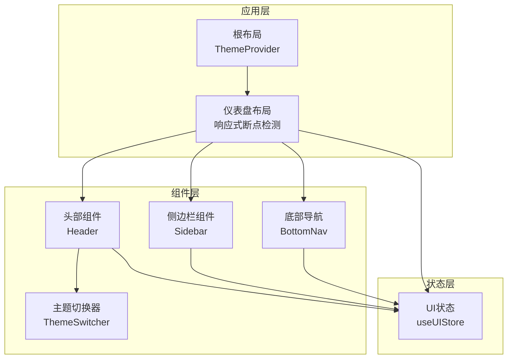
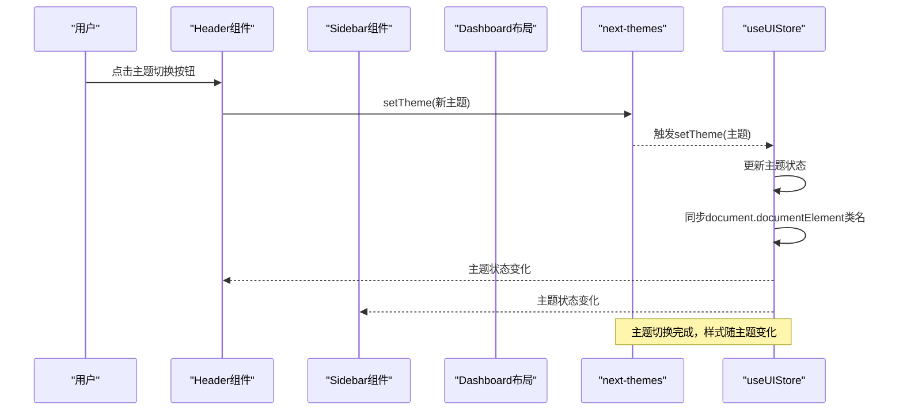
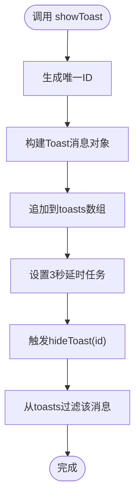
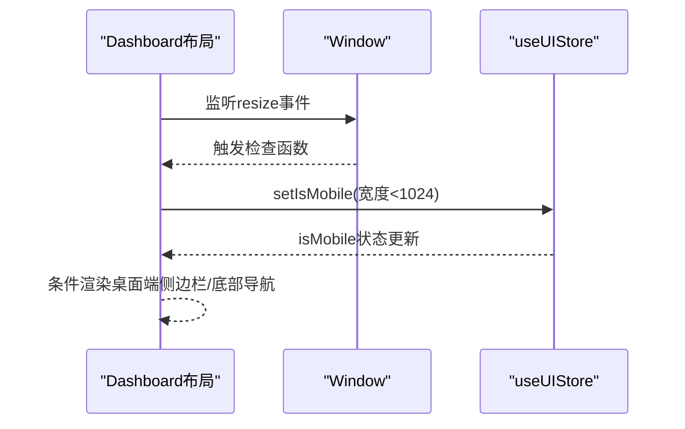
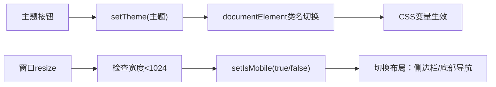
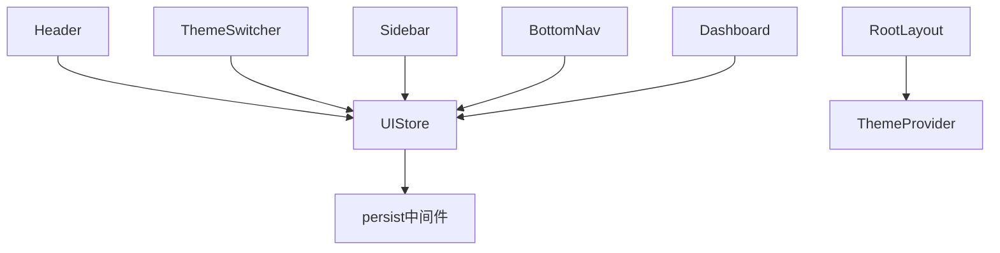

# UI状态管理

<cite>
**本文引用的文件**
- [useUIStore.ts](file://stores/useUIStore.ts)
- [index.ts](file://stores/index.ts)
- [Header.tsx](file://components/layout/Header.tsx)
- [Sidebar.tsx](file://components/layout/Sidebar.tsx)
- [BottomNav.tsx](file://components/layout/BottomNav.tsx)
- [theme-switcher.tsx](file://components/theme-switcher.tsx)
- [layout.tsx](file://app/layout.tsx)
- [layout.tsx](file://app/(dashboard)/layout.tsx)
- [index.ts](file://types/index.ts)
- [状态管理结构.md](file://docs/状态管理结构.md)
</cite>

## 目录
1. [简介](#简介)
2. [项目结构](#项目结构)
3. [核心组件](#核心组件)
4. [架构总览](#架构总览)
5. [详细组件分析](#详细组件分析)
6. [依赖关系分析](#依赖关系分析)
7. [性能考量](#性能考量)
8. [故障排查指南](#故障排查指南)
9. [结论](#结论)
10. [附录](#附录)

## 简介
本文件系统性阐述本项目的UI状态管理实现，重点围绕useUIStore的状态设计与行为，覆盖主题切换、侧边栏展开/折叠、移动端断点检测、全局提示Toast以及状态持久化策略。同时说明UI状态与组件的绑定机制（状态订阅与组件更新策略）、跨组件共享与通信方式、性能优化手段（状态分割与更新节流）、测试与调试方法，以及最佳实践与设计模式。

## 项目结构
UI状态管理采用Zustand作为状态容器，按功能域拆分Store，UI状态集中在useUIStore中，配合全局主题Provider与响应式断点检测，实现跨组件共享与一致的视觉体验。

图表来源
- [layout.tsx:22-41](file://app/layout.tsx#L22-L41)
- [layout.tsx](file://app/(dashboard)/layout.tsx#L14-L104)
- [Header.tsx:10-31](file://components/layout/Header.tsx#L10-L31)
- [Sidebar.tsx:17-21](file://components/layout/Sidebar.tsx#L17-L21)
- [BottomNav.tsx:16-19](file://components/layout/BottomNav.tsx#L16-L19)
- [theme-switcher.tsx:15-26](file://components/theme-switcher.tsx#L15-L26)
- [useUIStore.ts:20-77](file://stores/useUIStore.ts#L20-L77)

章节来源
- [layout.tsx:22-41](file://app/layout.tsx#L22-L41)
- [layout.tsx](file://app/(dashboard)/layout.tsx#L14-L104)

## 核心组件
- useUIStore：负责主题、侧边栏折叠、活动模态、Toast消息与移动端断点标记等UI状态的集中管理，支持持久化存储。
- Header：展示顶部工具栏，集成主题切换按钮与搜索交互，使用UI状态控制Toast显示。
- Sidebar：桌面端侧边栏导航，受UI状态影响的可见性与布局。
- BottomNav：移动端底部导航，响应路由变化。
- ThemeSwitcher：基于next-themes的主题切换组件，与UI状态协同工作。
- 根布局与仪表盘布局：根布局提供ThemeProvider，仪表盘布局负责响应式断点检测与实时订阅。

章节来源
- [useUIStore.ts:5-18](file://stores/useUIStore.ts#L5-L18)
- [Header.tsx:10-31](file://components/layout/Header.tsx#L10-L31)
- [Sidebar.tsx:17-21](file://components/layout/Sidebar.tsx#L17-L21)
- [BottomNav.tsx:16-19](file://components/layout/BottomNav.tsx#L16-L19)
- [theme-switcher.tsx:15-26](file://components/theme-switcher.tsx#L15-L26)
- [layout.tsx:22-41](file://app/layout.tsx#L22-L41)
- [layout.tsx](file://app/(dashboard)/layout.tsx#L14-L104)

## 架构总览
UI状态管理采用“状态容器 + 主题Provider + 响应式断点检测”的组合方案：
- 状态容器：Zustand + persist中间件，仅持久化非敏感UI偏好（主题、侧边栏折叠）。
- 主题系统：next-themes提供主题切换能力，useUIStore.setTheme同步DOM类名以驱动CSS变量。
- 响应式断点：仪表盘布局监听窗口尺寸，设置isMobile标记，驱动移动端/桌面端UI差异。
- 组件绑定：组件通过useUIStore订阅状态，按需渲染与更新。

图表来源
- [Header.tsx:54-60](file://components/layout/Header.tsx#L54-L60)
- [useUIStore.ts:29-37](file://stores/useUIStore.ts#L29-L37)
- [layout.tsx:30-37](file://app/layout.tsx#L30-L37)

## 详细组件分析

### useUIStore状态设计与持久化
- 状态字段
  - theme：当前主题（light/dark），用于驱动DOM类名与CSS变量。
  - sidebarCollapsed：侧边栏是否折叠，影响桌面端侧边栏可见性。
  - activeModal：当前激活的模态标识，用于控制模态显隐。
  - toasts：Toast消息队列，支持多条消息叠加。
  - isMobile：移动端断点标记，影响底部导航与侧边栏布局。
- 动作方法
  - setTheme：更新主题并同步到document.documentElement类名。
  - toggleSidebar：切换侧边栏折叠状态。
  - openModal/closeModal：控制模态显隐。
  - showToast/hideToast：添加与移除Toast消息，支持定时自动隐藏。
  - setIsMobile：设置移动端断点标记。
- 持久化策略
  - 使用persist中间件，仅持久化theme与sidebarCollapsed，避免持久化敏感业务数据。
  - 存储键名为ui-storage，确保跨会话恢复UI偏好。

图表来源
- [useUIStore.ts:47-65](file://stores/useUIStore.ts#L47-L65)

章节来源
- [useUIStore.ts:5-18](file://stores/useUIStore.ts#L5-L18)
- [useUIStore.ts:20-77](file://stores/useUIStore.ts#L20-L77)
- [index.ts:1-7](file://stores/index.ts#L1-L7)
- [状态管理结构.md:378-418](file://docs/状态管理结构.md#L378-L418)

### UI状态与组件绑定机制
- Header组件
  - 订阅UI状态：使用useUIStore访问showToast与主题信息。
  - 交互行为：点击主题切换按钮调用next-themes的setTheme，间接触发useUIStore.setTheme。
- Sidebar组件
  - 依赖Auth状态判断是否渲染；桌面端默认显示，受sidebarCollapsed影响。
- BottomNav组件
  - 基于路由路径高亮当前项，移动端固定在底部。
- Dashboard布局
  - 初始化认证状态与实时订阅。
  - 监听窗口尺寸变化，调用setIsMobile设置isMobile标记，驱动移动端/桌面端布局切换。

图表来源
- [layout.tsx](file://app/(dashboard)/layout.tsx#L30-L39)
- [Sidebar.tsx:24-29](file://components/layout/Sidebar.tsx#L24-L29)
- [BottomNav.tsx:20-26](file://components/layout/BottomNav.tsx#L20-L26)

章节来源
- [Header.tsx:10-31](file://components/layout/Header.tsx#L10-L31)
- [Sidebar.tsx:17-21](file://components/layout/Sidebar.tsx#L17-L21)
- [BottomNav.tsx:16-19](file://components/layout/BottomNav.tsx#L16-L19)
- [layout.tsx](file://app/(dashboard)/layout.tsx#L14-L104)

### 主题切换与响应式断点
- 主题切换
  - Header中的主题按钮与ThemeSwitcher均通过next-themes切换主题。
  - useUIStore.setTheme同步document.documentElement类名，确保CSS变量生效。
- 响应式断点
  - 当窗口宽度小于1024像素时，isMobile为true，隐藏桌面端侧边栏，显示底部导航。
  - CSS媒体查询与Tailwind类共同作用，实现移动端与桌面端布局差异。

图表来源
- [Header.tsx:54-60](file://components/layout/Header.tsx#L54-L60)
- [theme-switcher.tsx:55-72](file://components/theme-switcher.tsx#L55-L72)
- [useUIStore.ts:29-37](file://stores/useUIStore.ts#L29-L37)
- [layout.tsx](file://app/(dashboard)/layout.tsx#L30-L39)
- [layout.tsx](file://app/(dashboard)/layout.tsx#L82-L101)

章节来源
- [Header.tsx:54-60](file://components/layout/Header.tsx#L54-L60)
- [theme-switcher.tsx:55-72](file://components/theme-switcher.tsx#L55-L72)
- [useUIStore.ts:29-37](file://stores/useUIStore.ts#L29-L37)
- [layout.tsx](file://app/(dashboard)/layout.tsx#L30-L39)
- [layout.tsx](file://app/(dashboard)/layout.tsx#L82-L101)

### Toast消息与模态管理
- Toast
  - 通过showToast添加消息，自动3秒后hideToast移除。
  - toasts数组支持多条消息叠加，组件可按需消费。
- 模态
  - openModal/closeModal控制activeModal，组件根据其值决定是否渲染模态。

章节来源
- [useUIStore.ts:47-65](file://stores/useUIStore.ts#L47-L65)
- [index.ts:161-165](file://types/index.ts#L161-L165)

### 跨组件共享与通信
- 共享机制
  - 所有组件通过useUIStore订阅状态，无需层层props传递。
  - Dashboard布局统一初始化与订阅，保证状态一致性。
- 通信方式
  - 主题切换：Header/ThemeSwitcher -> next-themes -> useUIStore.setTheme -> DOM类名 -> 样式更新。
  - 响应式切换：Dashboard布局 -> useUIStore.setIsMobile -> Sidebar/BottomNav条件渲染。

章节来源
- [index.ts:1-7](file://stores/index.ts#L1-L7)
- [layout.tsx](file://app/(dashboard)/layout.tsx#L14-L104)

## 依赖关系分析
- 组件依赖
  - Header依赖useUIStore与next-themes。
  - Sidebar/BottomNav依赖路由与useUIStore的isMobile。
  - ThemeSwitcher依赖next-themes。
- 状态依赖
  - useUIStore依赖persist中间件进行持久化。
  - 根布局提供ThemeProvider，确保主题系统正常工作。

图表来源
- [Header.tsx:6-13](file://components/layout/Header.tsx#L6-L13)
- [theme-switcher.tsx:12-17](file://components/theme-switcher.tsx#L12-L17)
- [Sidebar.tsx:6-19](file://components/layout/Sidebar.tsx#L6-L19)
- [BottomNav.tsx:4-17](file://components/layout/BottomNav.tsx#L4-L17)
- [layout.tsx](file://app/(dashboard)/layout.tsx#L11-L23)
- [layout.tsx:30-37](file://app/layout.tsx#L30-L37)
- [useUIStore.ts:21-76](file://stores/useUIStore.ts#L21-L76)

章节来源
- [Header.tsx:6-13](file://components/layout/Header.tsx#L6-L13)
- [theme-switcher.tsx:12-17](file://components/theme-switcher.tsx#L12-L17)
- [Sidebar.tsx:6-19](file://components/layout/Sidebar.tsx#L6-L19)
- [BottomNav.tsx:4-17](file://components/layout/BottomNav.tsx#L4-L17)
- [layout.tsx](file://app/(dashboard)/layout.tsx#L11-L23)
- [layout.tsx:30-37](file://app/layout.tsx#L30-L37)
- [useUIStore.ts:21-76](file://stores/useUIStore.ts#L21-L76)

## 性能考量
- 状态分割
  - 将UI状态与业务状态分离，避免无关业务更新触发UI组件重渲染。
- 更新节流
  - resize事件监听建议结合防抖，减少频繁计算与状态写入。
- 渲染优化
  - Sidebar/BottomNav按isMobile条件渲染，降低不必要的DOM节点。
  - Toast消息采用队列管理，避免重复渲染相同消息。
- 持久化范围
  - 仅持久化UI偏好（主题、侧边栏折叠），避免持久化大体量数据。

章节来源
- [useUIStore.ts:69-76](file://stores/useUIStore.ts#L69-L76)
- [layout.tsx](file://app/(dashboard)/layout.tsx#L30-L39)

## 故障排查指南
- 主题切换无效
  - 检查useUIStore.setTheme是否被调用，确认document.documentElement类名已更新。
  - 确认根布局ThemeProvider已正确包裹应用。
- 移动端布局异常
  - 检查Dashboard布局的resize监听与setIsMobile调用。
  - 确认CSS媒体查询与Tailwind类生效。
- Toast不显示或不消失
  - 检查showToast调用与定时任务是否执行。
  - 确认hideToast按ID正确过滤toasts数组。
- 模态无法关闭
  - 检查closeModal是否被调用，activeModal是否重置为null。

章节来源
- [useUIStore.ts:29-37](file://stores/useUIStore.ts#L29-L37)
- [useUIStore.ts:47-65](file://stores/useUIStore.ts#L47-L65)
- [layout.tsx](file://app/(dashboard)/layout.tsx#L30-L39)
- [layout.tsx:30-37](file://app/layout.tsx#L30-L37)

## 结论
本项目的UI状态管理以Zustand为核心，结合next-themes与响应式断点检测，实现了主题切换、侧边栏控制、移动端适配与Toast管理的统一治理。通过状态分割与最小化持久化范围，兼顾了易用性与性能。建议在生产环境中进一步引入防抖与更细粒度的订阅控制，以提升复杂场景下的稳定性与可维护性。

## 附录
- 最佳实践
  - 将UI偏好与业务数据分离，仅持久化UI偏好。
  - 使用条件渲染与媒体查询控制移动端/桌面端差异。
  - 对高频事件（如resize）进行节流/防抖处理。
  - 明确状态边界，避免跨Store的强耦合。
- 设计模式
  - 状态容器模式：集中管理UI状态，组件通过订阅使用。
  - Provider模式：ThemeProvider统一提供主题上下文。
  - 条件渲染模式：根据isMobile切换布局元素。