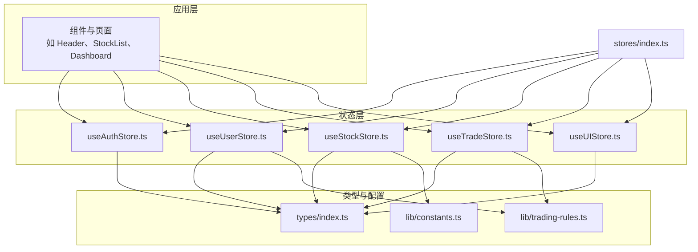
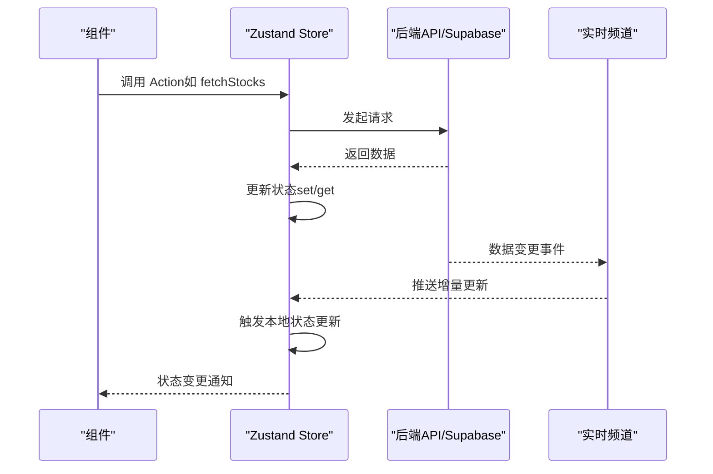
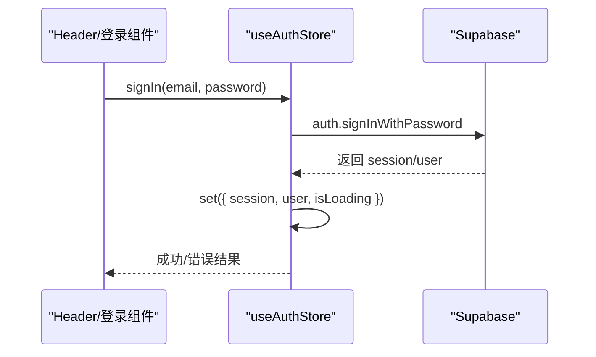
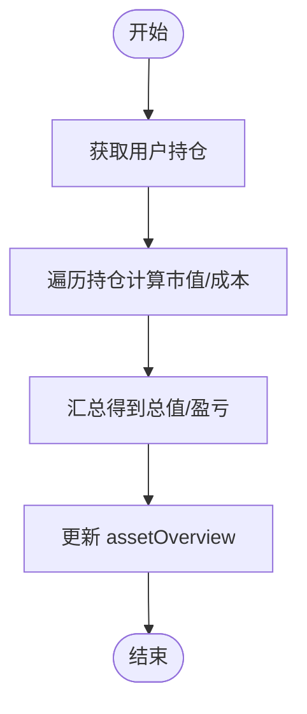
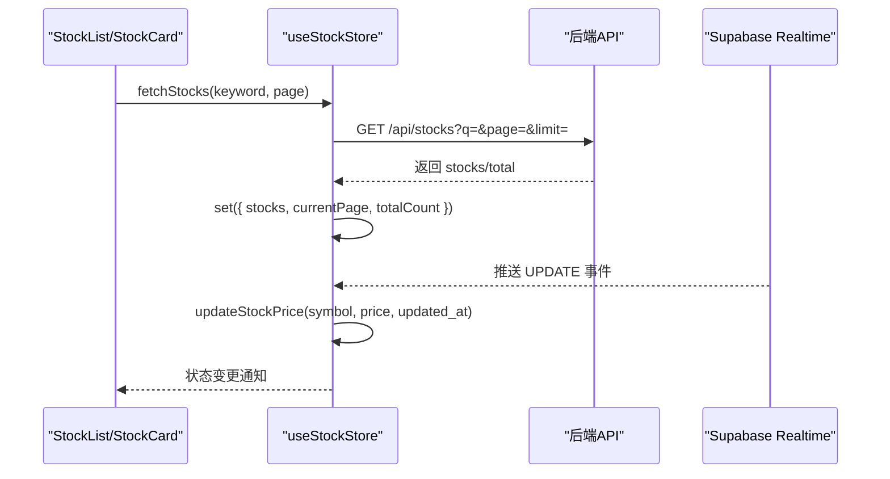
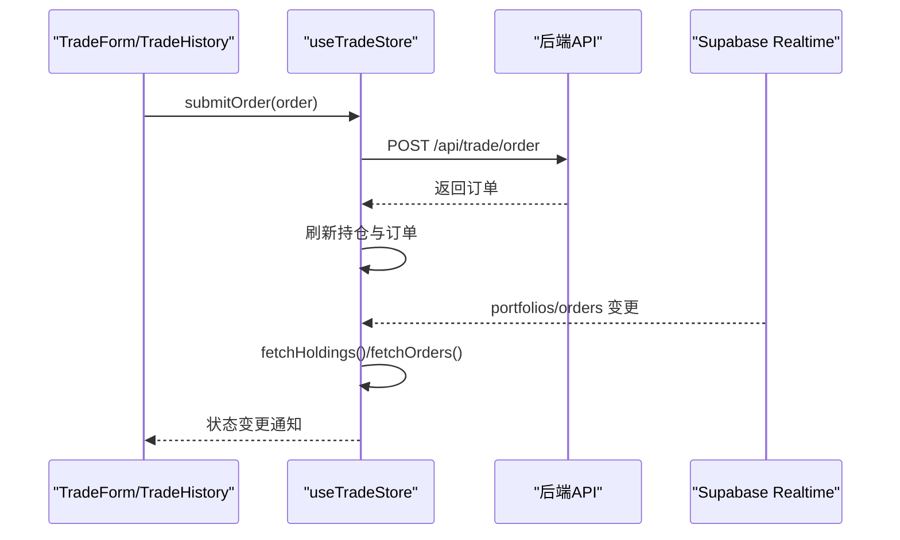
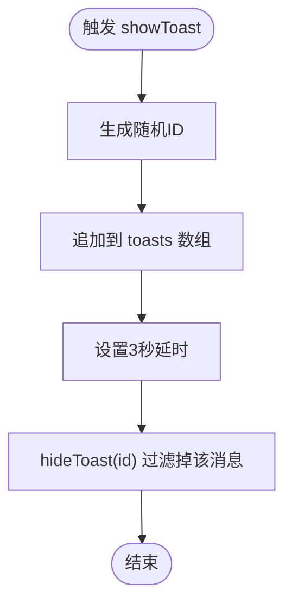
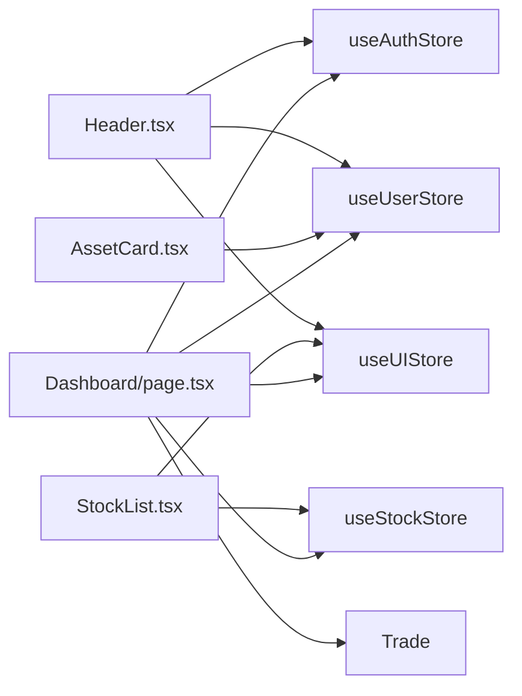

# Zustand Store 架构

<cite>
**本文档引用的文件**
- [stores/index.ts](file://stores/index.ts)
- [stores/useAuthStore.ts](file://stores/useAuthStore.ts)
- [stores/useStockStore.ts](file://stores/useStockStore.ts)
- [stores/useTradeStore.ts](file://stores/useTradeStore.ts)
- [stores/useUIStore.ts](file://stores/useUIStore.ts)
- [stores/useUserStore.ts](file://stores/useUserStore.ts)
- [types/index.ts](file://types/index.ts)
- [lib/constants.ts](file://lib/constants.ts)
- [lib/trading-rules.ts](file://lib/trading-rules.ts)
- [components/layout/Header.tsx](file://components/layout/Header.tsx)
- [components/portfolio/AssetCard.tsx](file://components/portfolio/AssetCard.tsx)
- [components/stocks/StockList.tsx](file://components/stocks/StockList.tsx)
- [app/(dashboard)/page.tsx](file://app/(dashboard)/page.tsx)
</cite>

## 目录
1. [简介](#简介)
2. [项目结构](#项目结构)
3. [核心组件](#核心组件)
4. [架构总览](#架构总览)
5. [详细组件分析](#详细组件分析)
6. [依赖关系分析](#依赖关系分析)
7. [性能考虑](#性能考虑)
8. [故障排除指南](#故障排除指南)
9. [结论](#结论)
10. [附录](#附录)

## 简介
本文件系统性梳理虚拟股票交易平台基于 Zustand 的状态管理架构，重点阐述以下方面：
- Store 创建模式与命名约定
- 统一导出机制与模块化设计
- Store 间的依赖关系与数据共享策略
- 状态定义最佳实践（结构设计、Action 组织、更新模式）
- 生命周期管理与内存优化
- Store 组合与拆分指导
- 性能监控与调试工具使用

## 项目结构
项目采用按功能域划分的模块化组织方式，Store 层位于 stores 目录，统一通过 index.ts 提供集中导出，便于全局按需引入与维护。

图表来源
- [stores/index.ts:1-7](file://stores/index.ts#L1-L7)
- [stores/useAuthStore.ts:1-104](file://stores/useAuthStore.ts#L1-L104)
- [stores/useUserStore.ts:1-110](file://stores/useUserStore.ts#L1-L110)
- [stores/useStockStore.ts:1-184](file://stores/useStockStore.ts#L1-L184)
- [stores/useTradeStore.ts:1-192](file://stores/useTradeStore.ts#L1-L192)
- [stores/useUIStore.ts:1-78](file://stores/useUIStore.ts#L1-L78)
- [types/index.ts:1-166](file://types/index.ts#L1-L166)
- [lib/constants.ts:1-101](file://lib/constants.ts#L1-L101)
- [lib/trading-rules.ts:1-272](file://lib/trading-rules.ts#L1-L272)

章节来源
- [stores/index.ts:1-7](file://stores/index.ts#L1-L7)

## 核心组件
本项目共包含五个独立但相互协作的 Store：
- 认证与会话管理：useAuthStore
- 用户资料与资产概览：useUserStore
- 股票行情与自选股：useStockStore
- 交易与订单管理：useTradeStore
- UI 状态与持久化：useUIStore

这些 Store 通过统一导出入口集中暴露，便于组件层以单一 import 路径获取所需状态与动作。

章节来源
- [stores/useAuthStore.ts:1-104](file://stores/useAuthStore.ts#L1-L104)
- [stores/useUserStore.ts:1-110](file://stores/useUserStore.ts#L1-L110)
- [stores/useStockStore.ts:1-184](file://stores/useStockStore.ts#L1-L184)
- [stores/useTradeStore.ts:1-192](file://stores/useTradeStore.ts#L1-L192)
- [stores/useUIStore.ts:1-78](file://stores/useUIStore.ts#L1-L78)
- [stores/index.ts:1-7](file://stores/index.ts#L1-L7)

## 架构总览
Store 架构遵循“单一职责 + 轻量耦合”的设计原则：
- 每个 Store 负责一个明确的功能域，避免状态交叉污染
- 通过 Supabase Realtime 实现实时订阅，确保前端与后端状态一致
- 使用 persist 中间件对 UI 状态进行本地持久化，提升用户体验
- 类型系统贯穿 Store 定义，保证 Action 与状态结构的强类型约束

图表来源
- [stores/useStockStore.ts:33-57](file://stores/useStockStore.ts#L33-L57)
- [stores/useTradeStore.ts:144-164](file://stores/useTradeStore.ts#L144-L164)
- [stores/useUserStore.ts:88-108](file://stores/useUserStore.ts#L88-L108)

## 详细组件分析

### 认证与会话管理（useAuthStore）
- 职责：处理用户登录、注册、登出与会话初始化；监听 Supabase 认证状态变化
- 关键特性：
  - 初始化流程：读取当前会话并设置 isInitialized
  - 认证状态监听：自动同步 session/user 状态
  - 错误处理：统一返回错误信息，便于 UI 层展示
- 设计要点：
  - 使用 createClient 创建 Supabase 客户端实例
  - 将 session/user 同步到本地状态，避免跨组件重复查询

图表来源
- [stores/useAuthStore.ts:31-48](file://stores/useAuthStore.ts#L31-L48)
- [stores/useAuthStore.ts:81-102](file://stores/useAuthStore.ts#L81-L102)

章节来源
- [stores/useAuthStore.ts:1-104](file://stores/useAuthStore.ts#L1-L104)

### 用户资料与资产概览（useUserStore）
- 职责：加载用户资料、计算资产概览、订阅资料变更
- 关键特性：
  - 资产概览计算：根据持仓与可用余额动态计算总资产、盈亏等指标
  - 余额更新：联动更新资产概览中的可用余额与总资产
  - 实时订阅：监听 profiles 表变更，保持资料一致性
- 设计要点：
  - 通过 get() 获取当前状态，避免重复查询
  - 计算逻辑集中在 Store 内部，组件只负责展示

图表来源
- [stores/useUserStore.ts:53-86](file://stores/useUserStore.ts#L53-L86)

章节来源
- [stores/useUserStore.ts:1-110](file://stores/useUserStore.ts#L1-L110)

### 股票行情与自选股（useStockStore）
- 职责：获取股票列表、搜索、管理自选股、订阅实时价格
- 关键特性：
  - 分页与搜索：支持关键词与页码参数
  - 自选股增删：调用后端 API 并刷新本地列表
  - 实时订阅：基于 Supabase Realtime 监听 stocks 表更新
  - 价格更新：同时更新 stocks 与 watchlist 中对应股票的价格与涨跌幅
- 设计要点：
  - 使用 get().fetchWatchlist() 在异步操作后刷新自选股
  - updateStockPrice 通过映射同时更新两个列表，保证一致性

图表来源
- [stores/useStockStore.ts:33-78](file://stores/useStockStore.ts#L33-L78)
- [stores/useStockStore.ts:125-150](file://stores/useStockStore.ts#L125-L150)
- [stores/useStockStore.ts:152-177](file://stores/useStockStore.ts#L152-L177)

章节来源
- [stores/useStockStore.ts:1-184](file://stores/useStockStore.ts#L1-L184)

### 交易与订单管理（useTradeStore）
- 职责：获取持仓、订单与成交历史，提交/撤销订单，订阅交易变更
- 关键特性：
  - 订单提交：调用后端接口，成功后刷新持仓与订单
  - 订单撤销：调用后端接口，成功后刷新订单
  - 实时订阅：分别监听 portfolios 与 orders 表，确保交易状态实时更新
- 设计要点：
  - 使用 calculateProfitLoss 计算持仓盈亏，Store 内聚计算逻辑
  - 通过 get().fetchHoldings() 与 get().fetchOrders() 在异步操作后刷新

图表来源
- [stores/useTradeStore.ts:99-121](file://stores/useTradeStore.ts#L99-L121)
- [stores/useTradeStore.ts:144-164](file://stores/useTradeStore.ts#L144-L164)
- [stores/useTradeStore.ts:166-186](file://stores/useTradeStore.ts#L166-L186)

章节来源
- [stores/useTradeStore.ts:1-192](file://stores/useTradeStore.ts#L1-L192)
- [lib/trading-rules.ts:250-264](file://lib/trading-rules.ts#L250-L264)

### UI 状态与持久化（useUIStore）
- 职责：主题切换、侧边栏折叠、模态框控制、消息提示、移动端状态、本地持久化
- 关键特性：
  - 主题同步：动态切换 document.documentElement 类名
  - 消息提示：自动生成唯一 ID，3 秒后自动隐藏
  - 持久化：使用 persist 中间件仅持久化 theme 与 sidebarCollapsed
- 设计要点：
  - 通过 partialize 精准选择持久化字段，减少存储开销
  - isMobile 用于响应式布局控制

图表来源
- [stores/useUIStore.ts:47-65](file://stores/useUIStore.ts#L47-L65)

章节来源
- [stores/useUIStore.ts:1-78](file://stores/useUIStore.ts#L1-L78)

## 依赖关系分析
Store 之间的依赖关系清晰且松散耦合：
- 组件层通过统一导出入口导入所需 Store
- Store 之间无直接互相依赖，通过后端 API 与 Supabase Realtime 协同
- 类型系统集中定义于 types/index.ts，被各 Store 引用
- 业务规则集中于 lib/trading-rules.ts，被 useTradeStore 与 useUserStore 使用

图表来源
- [components/layout/Header.tsx:16-25](file://components/layout/Header.tsx#L16-L25)
- [components/portfolio/AssetCard.tsx:4-15](file://components/portfolio/AssetCard.tsx#L4-L15)
- [components/stocks/StockList.tsx:9-33](file://components/stocks/StockList.tsx#L9-L33)
- [app/(dashboard)/page.tsx:5-33](file://app/(dashboard)/page.tsx#L5-L33)

章节来源
- [stores/index.ts:1-7](file://stores/index.ts#L1-L7)
- [types/index.ts:1-166](file://types/index.ts#L1-L166)
- [lib/trading-rules.ts:1-272](file://lib/trading-rules.ts#L1-L272)

## 性能考虑
- 状态更新粒度：优先使用局部 set，避免不必要的全量替换
- 计算字段：在 Store 内部计算（如持仓盈亏、价格涨跌幅），减少组件重复计算
- 实时订阅：仅订阅必要频道，及时 unsubscribe，避免内存泄漏
- 持久化：使用 persist 中间件精准选择字段，降低存储与序列化开销
- 分页与搜索：结合 API 分页参数，避免一次性加载大量数据
- 渲染优化：利用组件层的 loading 状态与骨架屏，提升交互体验

## 故障排除指南
- 登录/注册失败：检查返回的错误信息，确认 Supabase 配置与网络连通性
- 股价不更新：确认 Supabase Realtime 订阅是否建立，检查过滤条件与表权限
- 订单提交/撤销异常：查看后端返回的错误信息，确认交易时间与数量合法性
- 资产概览不准确：核对持仓数据与当前价格，确保计算逻辑正确
- UI 状态未持久化：检查 persist 配置与浏览器存储权限

章节来源
- [stores/useAuthStore.ts:38-47](file://stores/useAuthStore.ts#L38-L47)
- [stores/useStockStore.ts:125-150](file://stores/useStockStore.ts#L125-L150)
- [stores/useTradeStore.ts:99-121](file://stores/useTradeStore.ts#L99-L121)
- [stores/useUserStore.ts:53-86](file://stores/useUserStore.ts#L53-L86)
- [stores/useUIStore.ts:69-76](file://stores/useUIStore.ts#L69-L76)

## 结论
本项目采用模块化的 Zustand Store 架构，通过清晰的职责划分、统一导出机制与类型约束，实现了高内聚、低耦合的状态管理方案。配合 Supabase Realtime 与持久化中间件，既保证了数据的实时性与用户体验，又兼顾了性能与可维护性。建议在后续迭代中持续关注订阅清理、计算逻辑优化与错误处理的标准化。

## 附录

### Store 创建模式与命名约定
- 文件命名：useXxxStore.ts，统一以 use 前缀与 Store 后缀
- 导出方式：默认导出 create 返回的函数，便于组件直接解构使用
- 类型定义：在接口中显式声明状态与 Action，增强可读性与可维护性

章节来源
- [stores/useAuthStore.ts:1-15](file://stores/useAuthStore.ts#L1-L15)
- [stores/useStockStore.ts:6-21](file://stores/useStockStore.ts#L6-L21)
- [stores/useTradeStore.ts:6-25](file://stores/useTradeStore.ts#L6-L25)
- [stores/useUserStore.ts:5-13](file://stores/useUserStore.ts#L5-L13)
- [stores/useUIStore.ts:5-18](file://stores/useUIStore.ts#L5-L18)

### 统一导出机制与模块化设计
- 统一导出：通过 stores/index.ts 汇总导出，简化组件导入路径
- 模块化：每个 Store 独立维护，职责单一，便于测试与扩展

章节来源
- [stores/index.ts:1-7](file://stores/index.ts#L1-L7)

### 状态定义最佳实践
- 结构设计：将计算字段与展示字段分离，Store 内部负责计算
- Action 组织：按功能域划分 Action，避免跨 Store 调用
- 更新模式：优先使用 set 的对象形式，必要时使用函数式更新保证原子性

章节来源
- [stores/useStockStore.ts:152-177](file://stores/useStockStore.ts#L152-L177)
- [stores/useUserStore.ts:39-51](file://stores/useUserStore.ts#L39-L51)
- [stores/useTradeStore.ts:99-121](file://stores/useTradeStore.ts#L99-L121)

### 生命周期管理与内存优化
- 订阅管理：在组件卸载时调用返回的取消函数，避免内存泄漏
- 持久化：仅持久化必要字段，减少存储与序列化开销
- 清理策略：在 Store 外围提供清理函数，便于在路由切换时释放资源

章节来源
- [stores/useStockStore.ts:149](file://stores/useStockStore.ts#L149)
- [stores/useTradeStore.ts:163](file://stores/useTradeStore.ts#L163)
- [stores/useTradeStore.ts:185](file://stores/useTradeStore.ts#L185)
- [stores/useUserStore.ts:108](file://stores/useUserStore.ts#L108)
- [stores/useUIStore.ts:69-76](file://stores/useUIStore.ts#L69-L76)

### Store 组合与拆分指导
- 组合场景：当多个 Store 共享同一数据源时，可考虑合并为复合 Store，减少重复请求
- 拆分场景：当 Store 过于臃肿或职责不清时，应拆分为更细粒度的 Store
- 评估标准：以职责边界、复用频率与性能影响为依据

### 性能监控与调试工具使用
- 开发者工具：使用 React DevTools 与 Zustand Devtools 监控状态变化
- 日志记录：在关键 Action 中输出日志，定位异步流程问题
- 实时调试：通过 Supabase Dashboard 查看频道订阅与事件推送情况