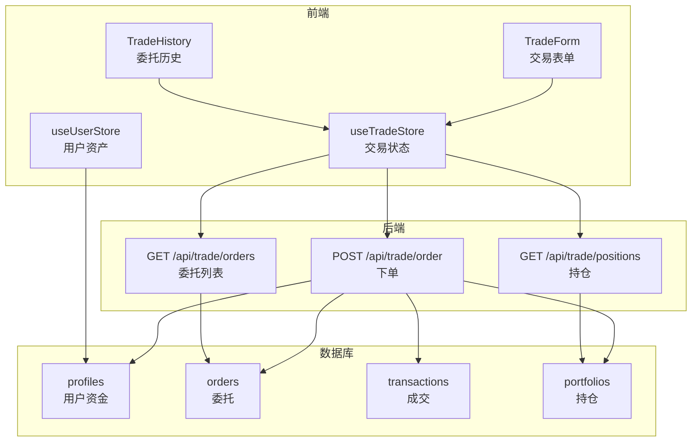
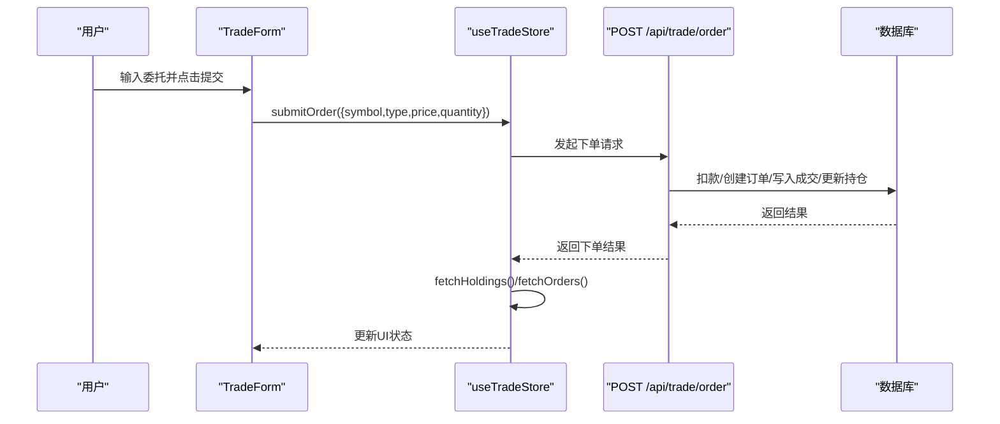
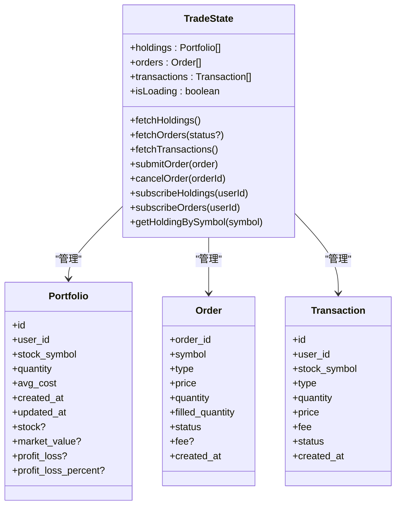
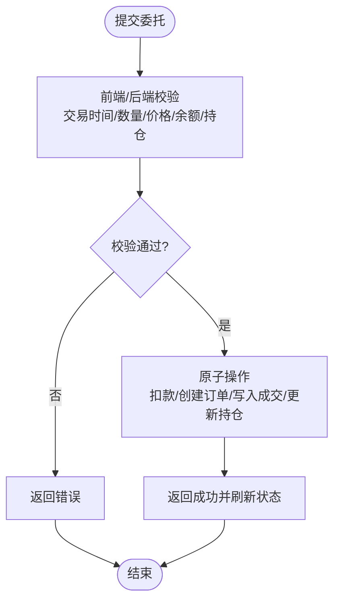
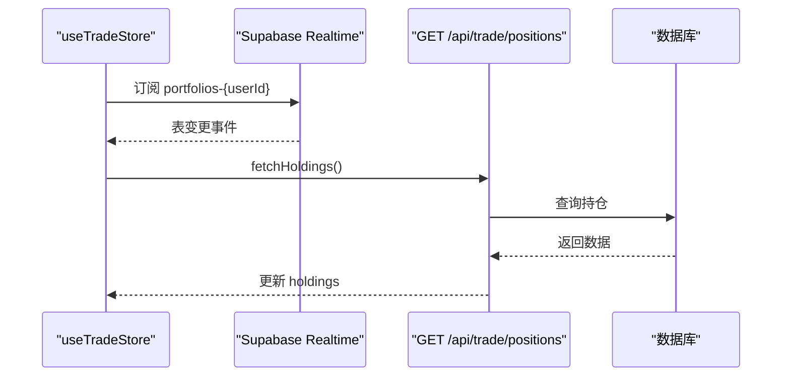
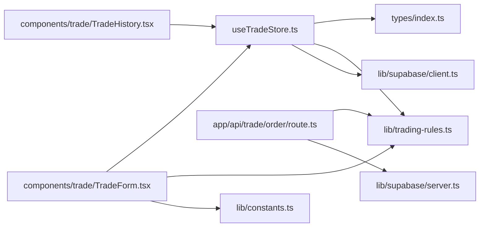

# 交易状态管理

<cite>
**本文引用的文件**
- [stores/useTradeStore.ts](file://stores/useTradeStore.ts)
- [lib/trading-rules.ts](file://lib/trading-rules.ts)
- [types/index.ts](file://types/index.ts)
- [app/api/trade/order/route.ts](file://app/api/trade/order/route.ts)
- [app/api/trade/orders/route.ts](file://app/api/trade/orders/route.ts)
- [app/api/trade/positions/route.ts](file://app/api/trade/positions/route.ts)
- [lib/constants.ts](file://lib/constants.ts)
- [components/trade/TradeForm.tsx](file://components/trade/TradeForm.tsx)
- [components/trade/TradeHistory.tsx](file://components/trade/TradeHistory.tsx)
- [stores/useUserStore.ts](file://stores/useUserStore.ts)
- [lib/supabase/client.ts](file://lib/supabase/client.ts)
- [lib/supabase/server.ts](file://lib/supabase/server.ts)
</cite>

## 目录
1. [简介](#简介)
2. [项目结构](#项目结构)
3. [核心组件](#核心组件)
4. [架构总览](#架构总览)
5. [详细组件分析](#详细组件分析)
6. [依赖关系分析](#依赖关系分析)
7. [性能考量](#性能考量)
8. [故障排查指南](#故障排查指南)
9. [结论](#结论)
10. [附录](#附录)

## 简介
本文件系统性阐述虚拟股票交易系统的“交易状态管理”实现，围绕 useTradeStore 的数据结构设计（持仓、委托、成交），交易状态生命周期（创建、执行、完成），与 API 接口的同步机制（实时数据更新与状态回滚），以及交易状态的验证与约束检查（可用余额、持仓限制、交易规则）。同时覆盖持久化与恢复、并发控制与冲突解决策略，并提供调试与性能监控建议。

## 项目结构
交易状态管理涉及前端状态层（Zustand）、业务规则层（交易规则与常量）、API 层（Next.js Route Handlers）以及 Supabase Realtime 订阅。核心交互路径如下：

图表来源
- [components/trade/TradeForm.tsx:1-234](file://components/trade/TradeForm.tsx#L1-L234)
- [components/trade/TradeHistory.tsx:1-155](file://components/trade/TradeHistory.tsx#L1-L155)
- [stores/useTradeStore.ts:1-192](file://stores/useTradeStore.ts#L1-L192)
- [stores/useUserStore.ts:1-110](file://stores/useUserStore.ts#L1-L110)
- [app/api/trade/order/route.ts:1-331](file://app/api/trade/order/route.ts#L1-L331)
- [app/api/trade/orders/route.ts:1-66](file://app/api/trade/orders/route.ts#L1-L66)
- [app/api/trade/positions/route.ts:1-46](file://app/api/trade/positions/route.ts#L1-L46)

章节来源
- [stores/useTradeStore.ts:1-192](file://stores/useTradeStore.ts#L1-L192)
- [components/trade/TradeForm.tsx:1-234](file://components/trade/TradeForm.tsx#L1-L234)
- [components/trade/TradeHistory.tsx:1-155](file://components/trade/TradeHistory.tsx#L1-L155)
- [stores/useUserStore.ts:1-110](file://stores/useUserStore.ts#L1-L110)
- [app/api/trade/order/route.ts:1-331](file://app/api/trade/order/route.ts#L1-L331)
- [app/api/trade/orders/route.ts:1-66](file://app/api/trade/orders/route.ts#L1-L66)
- [app/api/trade/positions/route.ts:1-46](file://app/api/trade/positions/route.ts#L1-L46)

## 核心组件
- useTradeStore：集中管理持仓、委托、成交三类数据，提供加载、提交、撤单、订阅等能力；负责与后端 API 同步，并在下单成功后刷新持仓与委托列表。
- 交易规则与常量：提供交易时间判断、涨跌停校验、手续费计算、数量校验、T+1 规则等。
- 类型定义：明确 Portfolio、Order、Transaction 等核心数据模型及其字段。
- API 层：提供下单、委托列表、持仓查询接口，实现下单的原子性处理（资金、订单、成交、持仓四步）。
- UI 组件：TradeForm 负责下单输入与前端校验，TradeHistory 展示委托状态与支持撤单。

章节来源
- [stores/useTradeStore.ts:6-25](file://stores/useTradeStore.ts#L6-L25)
- [lib/trading-rules.ts:1-272](file://lib/trading-rules.ts#L1-L272)
- [types/index.ts:37-80](file://types/index.ts#L37-L80)
- [app/api/trade/order/route.ts:10-331](file://app/api/trade/order/route.ts#L10-L331)
- [components/trade/TradeForm.tsx:20-127](file://components/trade/TradeForm.tsx#L20-L127)
- [components/trade/TradeHistory.tsx:16-36](file://components/trade/TradeHistory.tsx#L16-L36)

## 架构总览
交易状态管理采用“前端状态 + 后端原子操作 + 数据库”的三层协同：
- 前端通过 useTradeStore 维护视图所需的状态，并通过 fetch* 方法与后端同步。
- 后端在下单接口内以事务方式保证资金、订单、成交、持仓的一致性。
- Supabase Realtime 订阅用于在数据库变更时触发前端刷新，确保 UI 与后端一致。

图表来源
- [components/trade/TradeForm.tsx:84-127](file://components/trade/TradeForm.tsx#L84-L127)
- [stores/useTradeStore.ts:99-121](file://stores/useTradeStore.ts#L99-L121)
- [app/api/trade/order/route.ts:11-331](file://app/api/trade/order/route.ts#L11-L331)

## 详细组件分析

### useTradeStore 数据结构设计
- 持仓（holdings）：包含用户持有的每只股票的数量、平均成本、当前股价、市值、盈亏等计算字段。
- 委托（orders）：记录每笔委托的委托价、数量、已成交量、状态（pending/filled/partial/cancelled）等。
- 成交（transactions）：记录每笔成交的类型、价格、数量、手续费、状态等。
- 订阅（subscribeHoldings/subscribeOrders）：基于 Supabase Realtime 在 portfolios 和 orders 表变更时自动刷新前端状态。
- 辅助方法：按 symbol 查询持仓、加载持仓/委托/成交、提交订单、撤单。

图表来源
- [stores/useTradeStore.ts:6-25](file://stores/useTradeStore.ts#L6-L25)
- [types/index.ts:37-80](file://types/index.ts#L37-L80)

章节来源
- [stores/useTradeStore.ts:27-191](file://stores/useTradeStore.ts#L27-L191)
- [types/index.ts:37-80](file://types/index.ts#L37-L80)

### 交易状态生命周期管理
- 订单创建：前端提交委托，后端进行交易时间、数量、价格范围、可用资金/持仓等校验，随后原子性地扣款、创建订单、写入成交、更新/新增持仓。
- 订单执行：后端根据市价或限价生成成交记录，更新委托状态为 filled/partial（若后续扩展）。
- 订单完成：委托状态变为 filled，前端刷新持仓与委托列表，用户资产随之更新。

图表来源
- [components/trade/TradeForm.tsx:84-127](file://components/trade/TradeForm.tsx#L84-L127)
- [app/api/trade/order/route.ts:43-331](file://app/api/trade/order/route.ts#L43-L331)
- [lib/trading-rules.ts:170-247](file://lib/trading-rules.ts#L170-L247)

章节来源
- [components/trade/TradeForm.tsx:84-127](file://components/trade/TradeForm.tsx#L84-L127)
- [app/api/trade/order/route.ts:43-331](file://app/api/trade/order/route.ts#L43-L331)
- [lib/trading-rules.ts:170-247](file://lib/trading-rules.ts#L170-L247)

### 交易状态与 API 接口的同步机制
- 实时数据更新：通过 Supabase Realtime 订阅 portfolios 与 orders 表，当数据库发生变化时自动触发前端刷新。
- 状态回滚：当前实现以“下单即完成”的方式简化流程；若未来引入部分成交或撤单，可在后端事务中回滚并同步到前端。

图表来源
- [stores/useTradeStore.ts:144-164](file://stores/useTradeStore.ts#L144-L164)
- [app/api/trade/positions/route.ts:19-37](file://app/api/trade/positions/route.ts#L19-L37)

章节来源
- [stores/useTradeStore.ts:144-186](file://stores/useTradeStore.ts#L144-L186)
- [app/api/trade/positions/route.ts:19-37](file://app/api/trade/positions/route.ts#L19-L37)

### 交易状态的验证与约束检查
- 交易时间：仅在工作日上午 9:30-11:30、下午 13:00-15:00 允许下单。
- 数量单位：必须为 100 的整数倍。
- 价格限制：委托价格需在涨跌停范围内。
- 资金与持仓：买入需可用资金充足；卖出需持有足够数量。
- T+1 规则：当日买入的股票次日才能卖出（接口预留）。

章节来源
- [lib/trading-rules.ts:7-24](file://lib/trading-rules.ts#L7-L24)
- [lib/trading-rules.ts:130-135](file://lib/trading-rules.ts#L130-L135)
- [lib/trading-rules.ts:170-201](file://lib/trading-rules.ts#L170-L201)
- [lib/trading-rules.ts:211-247](file://lib/trading-rules.ts#L211-L247)
- [lib/constants.ts:15-27](file://lib/constants.ts#L15-L27)

### 交易状态的持久化与恢复机制
- 持久化：下单成功后，后端将资金变动、订单、成交、持仓等写入数据库，确保状态持久化。
- 恢复：前端通过 fetch* 方法从后端拉取最新状态；Supabase 订阅在数据库变更时主动推送更新，避免 UI 与后端脱节。

章节来源
- [app/api/trade/order/route.ts:110-197](file://app/api/trade/order/route.ts#L110-L197)
- [app/api/trade/order/route.ts:254-310](file://app/api/trade/order/route.ts#L254-L310)
- [stores/useTradeStore.ts:33-97](file://stores/useTradeStore.ts#L33-L97)

### 并发控制与冲突解决策略
- 原子性保障：下单接口使用数据库事务，确保资金、订单、成交、持仓的强一致性。
- 并发冲突：若出现多用户同时修改同一资源，建议在数据库层面使用行级锁或乐观锁；前端可通过请求去重与状态合并减少抖动。
- 实时一致性：通过 Supabase 订阅保证数据库变更的即时推送，降低竞态条件。

章节来源
- [app/api/trade/order/route.ts:110-197](file://app/api/trade/order/route.ts#L110-L197)
- [app/api/trade/order/route.ts:254-310](file://app/api/trade/order/route.ts#L254-L310)
- [stores/useTradeStore.ts:144-186](file://stores/useTradeStore.ts#L144-L186)

### 调试工具与性能监控
- 调试：在 useTradeStore 中设置 isLoading 标志，UI 层显示加载状态；在 API 层打印错误日志；使用浏览器 Network 面板观察请求与响应。
- 性能：合理分页（orders 接口支持分页）；减少不必要的订阅；对高频刷新场景设置节流；在前端缓存最近一次有效数据，避免重复渲染。

章节来源
- [stores/useTradeStore.ts:33-97](file://stores/useTradeStore.ts#L33-L97)
- [app/api/trade/orders/route.ts:19-57](file://app/api/trade/orders/route.ts#L19-L57)

## 依赖关系分析
- useTradeStore 依赖：
  - 类型定义（Portfolio/Order/Transaction）
  - 交易规则（校验与计算）
  - Supabase 客户端（Realtime 订阅）
- API 层依赖：
  - Supabase 服务端客户端（读取用户会话）
  - 交易规则（下单校验与费用计算）
- UI 组件依赖：
  - useTradeStore 与 useUserStore（展示与联动）

图表来源
- [stores/useTradeStore.ts:1-5](file://stores/useTradeStore.ts#L1-L5)
- [types/index.ts:1-166](file://types/index.ts#L1-L166)
- [lib/trading-rules.ts:1-2](file://lib/trading-rules.ts#L1-L2)
- [lib/supabase/client.ts:1-9](file://lib/supabase/client.ts#L1-L9)
- [app/api/trade/order/route.ts:1-8](file://app/api/trade/order/route.ts#L1-L8)
- [lib/supabase/server.ts:1-35](file://lib/supabase/server.ts#L1-L35)
- [components/trade/TradeForm.tsx:1-18](file://components/trade/TradeForm.tsx#L1-L18)
- [lib/constants.ts:1-101](file://lib/constants.ts#L1-L101)

章节来源
- [stores/useTradeStore.ts:1-5](file://stores/useTradeStore.ts#L1-L5)
- [app/api/trade/order/route.ts:1-8](file://app/api/trade/order/route.ts#L1-L8)
- [components/trade/TradeForm.tsx:1-18](file://components/trade/TradeForm.tsx#L1-L18)

## 性能考量
- 请求合并：在短时间内多次下单/撤单时，前端可合并状态更新，避免频繁渲染。
- 缓存策略：对静态数据（如股票基础信息）进行本地缓存；对实时数据（价格、委托）使用订阅驱动更新。
- 分页与懒加载：委托列表支持分页，避免一次性加载过多数据。
- 错峰刷新：结合 UI 常量中的刷新间隔，避免过于频繁的轮询。

## 故障排查指南
- 常见错误与定位
  - 未登录：认证失败，返回 401；检查 Supabase 会话。
  - 非交易时间：下单被拒绝；检查 isTradingHour。
  - 数量非法：数量不是 100 的整数倍；检查前端/后端校验。
  - 价格越界：委托价格超出涨跌停；检查 getUpperLimitPrice/getLowerLimitPrice。
  - 资金不足：可用余额小于总成本；检查 calculateTotalCost 与 profiles.virtual_balance。
  - 持仓不足：卖出数量超过持有；检查 portfolios.quantity。
- 日志与监控
  - 后端：在下单接口捕获异常并记录错误日志。
  - 前端：在 useTradeStore 的 fetch* 方法中设置 isLoading 并在 finally 中关闭，便于 UI 反馈。

章节来源
- [app/api/trade/order/route.ts:18-49](file://app/api/trade/order/route.ts#L18-L49)
- [lib/trading-rules.ts:170-247](file://lib/trading-rules.ts#L170-L247)
- [stores/useTradeStore.ts:33-97](file://stores/useTradeStore.ts#L33-L97)

## 结论
本系统通过前端 Zustand 状态管理、后端原子事务与 Supabase 实时订阅，实现了交易状态的高一致性与实时性。数据结构清晰、校验完备、接口职责单一，具备良好的可维护性与扩展性。建议在后续迭代中引入部分成交、更细粒度的并发控制与更完善的错误回滚策略。

## 附录
- 交易常量与规则
  - 手续费率、最低手续费、印花税、最小交易单位、涨跌停比例、交易时间等均通过常量集中管理，便于配置与审计。
- 类型体系
  - 通过 TypeScript 类型定义明确数据模型，降低前后端耦合与运行时错误。

章节来源
- [lib/constants.ts:2-27](file://lib/constants.ts#L2-L27)
- [types/index.ts:37-80](file://types/index.ts#L37-L80)