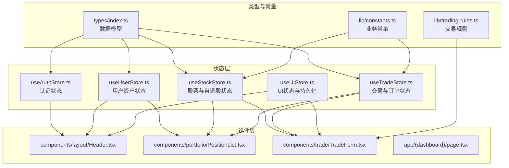
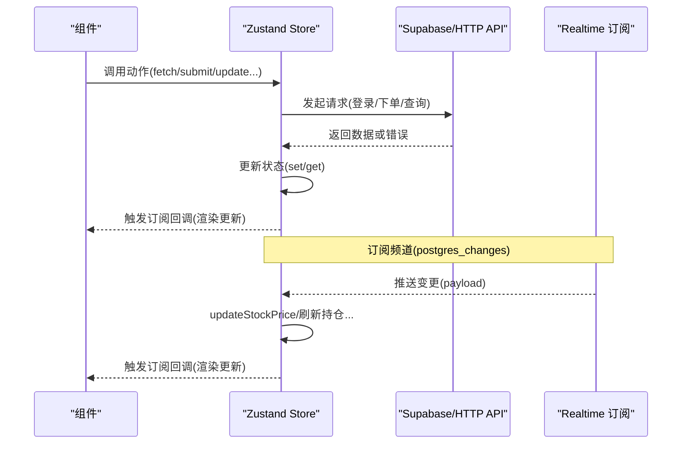
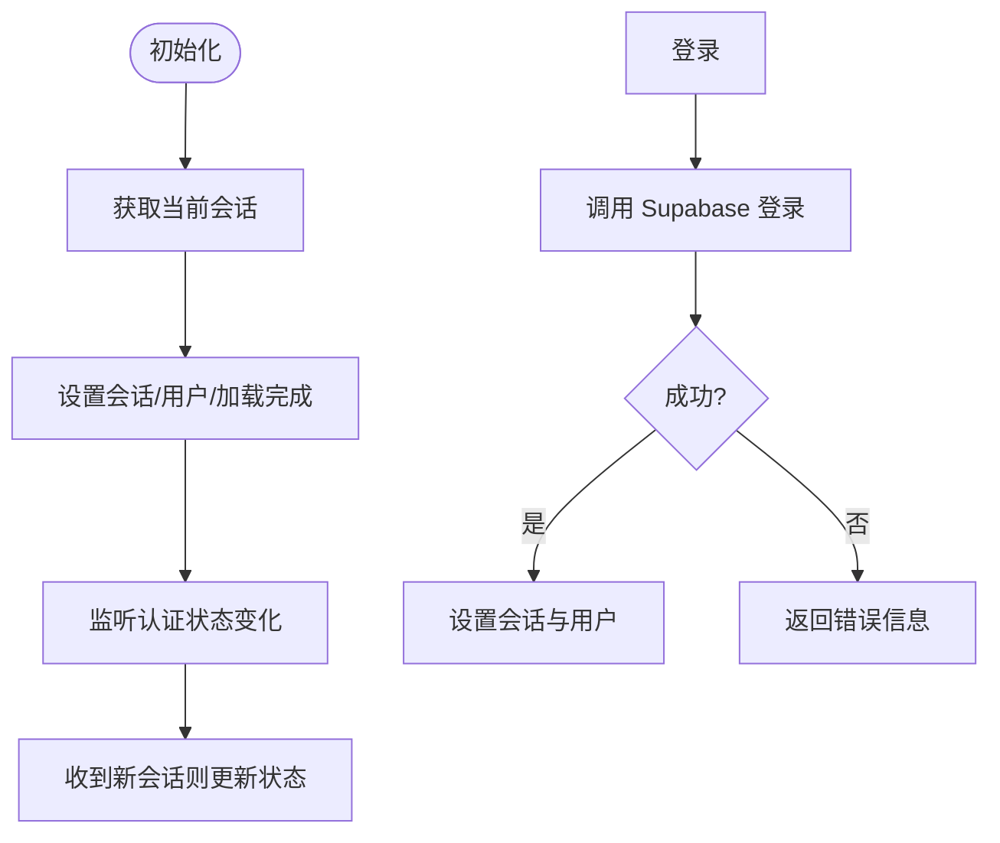
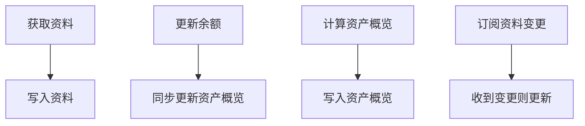
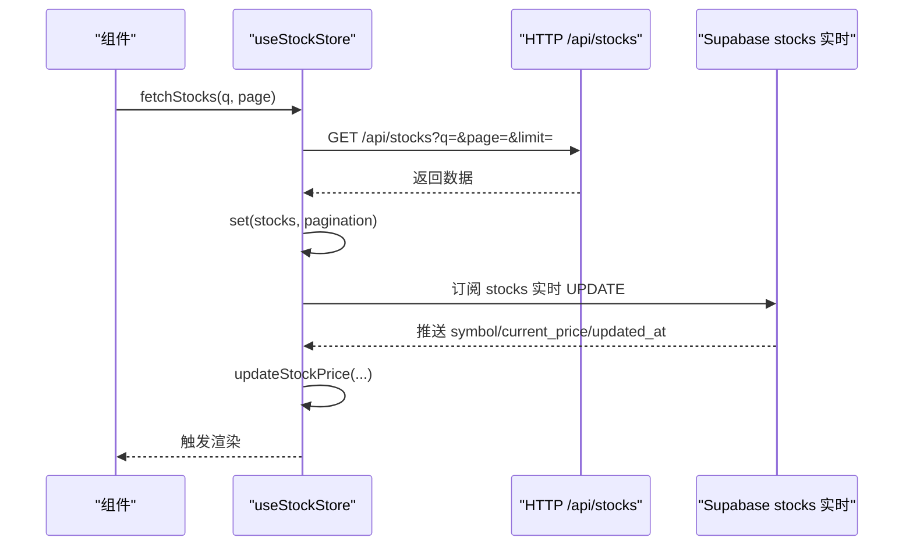
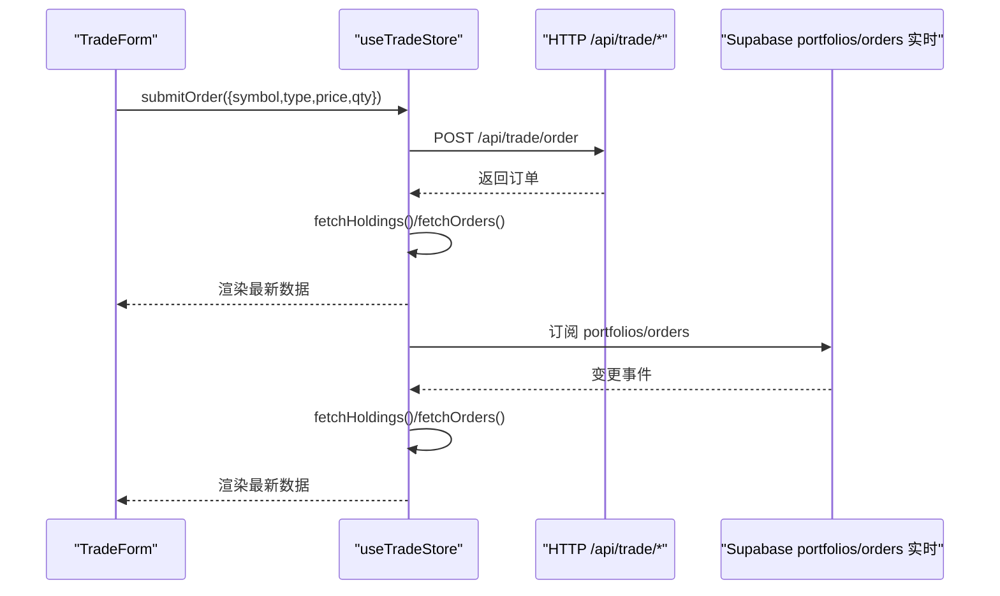
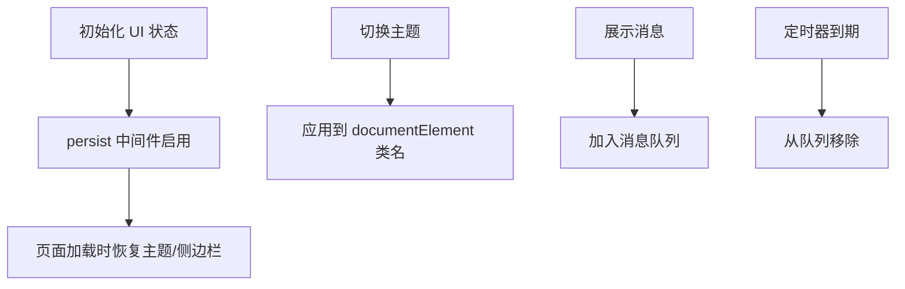
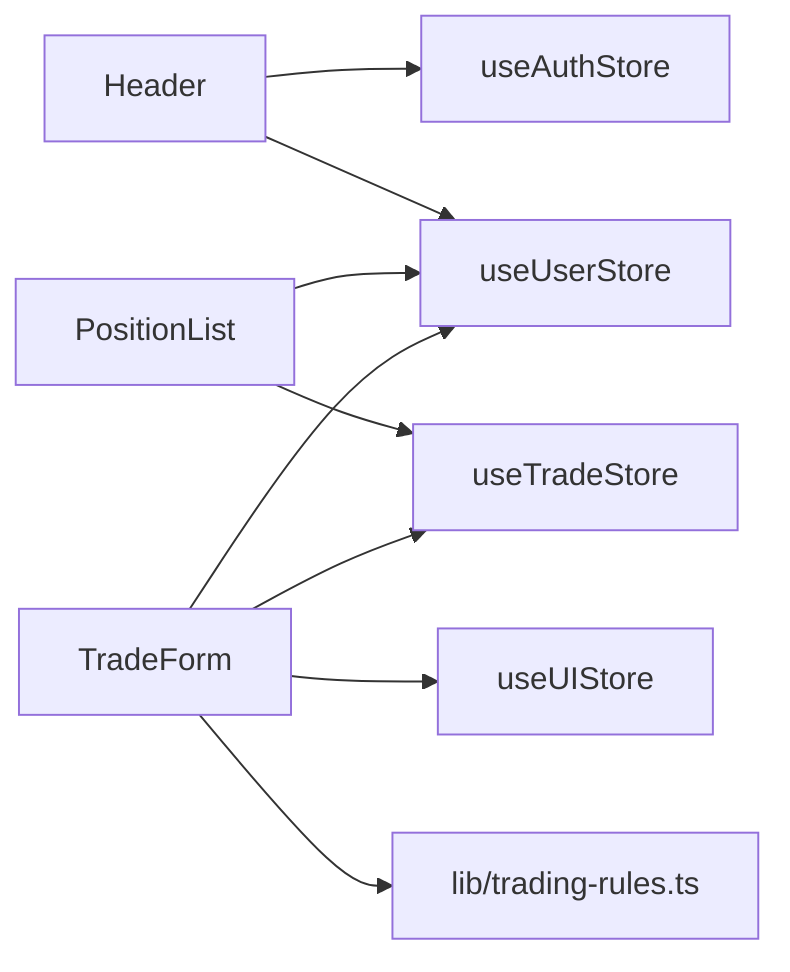
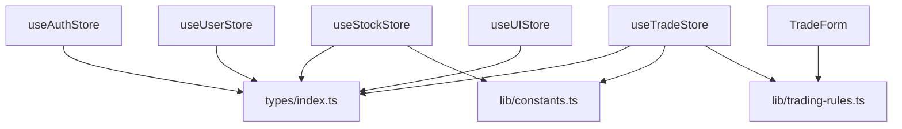

# 状态管理系统

<cite>
**本文引用的文件**
- [stores/index.ts](file://stores/index.ts)
- [stores/useAuthStore.ts](file://stores/useAuthStore.ts)
- [stores/useStockStore.ts](file://stores/useStockStore.ts)
- [stores/useTradeStore.ts](file://stores/useTradeStore.ts)
- [stores/useUIStore.ts](file://stores/useUIStore.ts)
- [stores/useUserStore.ts](file://stores/useUserStore.ts)
- [types/index.ts](file://types/index.ts)
- [lib/constants.ts](file://lib/constants.ts)
- [lib/trading-rules.ts](file://lib/trading-rules.ts)
- [lib/utils.ts](file://lib/utils.ts)
- [components/layout/Header.tsx](file://components/layout/Header.tsx)
- [components/portfolio/PositionList.tsx](file://components/portfolio/PositionList.tsx)
- [components/trade/TradeForm.tsx](file://components/trade/TradeForm.tsx)
- [app/(dashboard)/page.tsx](file://app/(dashboard)/page.tsx)
</cite>

## 目录
1. [简介](#简介)
2. [项目结构](#项目结构)
3. [核心组件](#核心组件)
4. [架构总览](#架构总览)
5. [详细组件分析](#详细组件分析)
6. [依赖关系分析](#依赖关系分析)
7. [性能考量](#性能考量)
8. [故障排查指南](#故障排查指南)
9. [结论](#结论)
10. [附录](#附录)

## 简介
本文件系统性阐述虚拟股票交易平台基于 Zustand 的状态管理实现，覆盖 store 设计模式、状态与动作定义、状态更新机制、store 间依赖与数据流、UI 状态持久化策略、组件订阅与 useStore hook 使用方式、异步更新与错误处理、调试与开发辅助，以及最佳实践与性能优化建议。目标是帮助开发者快速理解并高效扩展状态管理方案。

## 项目结构
状态管理采用按功能域划分的 store 文件组织方式，统一通过入口导出，便于全局按需引入与维护。各 store 聚焦单一职责：认证、用户资产、股票行情、交易、UI 状态。

图表来源
- [stores/index.ts:1-7](file://stores/index.ts#L1-L7)
- [stores/useAuthStore.ts:1-104](file://stores/useAuthStore.ts#L1-L104)
- [stores/useUserStore.ts:1-110](file://stores/useUserStore.ts#L1-L110)
- [stores/useStockStore.ts:1-184](file://stores/useStockStore.ts#L1-L184)
- [stores/useTradeStore.ts:1-192](file://stores/useTradeStore.ts#L1-L192)
- [stores/useUIStore.ts:1-78](file://stores/useUIStore.ts#L1-L78)
- [types/index.ts:1-166](file://types/index.ts#L1-L166)
- [lib/constants.ts:1-101](file://lib/constants.ts#L1-L101)
- [lib/trading-rules.ts:1-272](file://lib/trading-rules.ts#L1-L272)
- [components/layout/Header.tsx:1-205](file://components/layout/Header.tsx#L1-L205)
- [components/portfolio/PositionList.tsx:1-194](file://components/portfolio/PositionList.tsx#L1-L194)
- [components/trade/TradeForm.tsx:1-300](file://components/trade/TradeForm.tsx#L1-L300)
- [app/(dashboard)/page.tsx:1-99](file://app/(dashboard)/page.tsx#L1-L99)

章节来源
- [stores/index.ts:1-7](file://stores/index.ts#L1-L7)

## 核心组件
- useAuthStore：负责认证会话、登录/注册/登出、初始化与认证状态监听。
- useUserStore：负责用户资料、资产概览计算、余额更新、实时订阅。
- useStockStore：负责股票列表、自选股、搜索、实时价格订阅与更新。
- useTradeStore：负责持仓、订单、交易历史、下单/撤单、实时订阅。
- useUIStore：负责主题、侧边栏、模态框、消息提示、移动端状态与持久化。

章节来源
- [stores/useAuthStore.ts:1-104](file://stores/useAuthStore.ts#L1-L104)
- [stores/useUserStore.ts:1-110](file://stores/useUserStore.ts#L1-L110)
- [stores/useStockStore.ts:1-184](file://stores/useStockStore.ts#L1-L184)
- [stores/useTradeStore.ts:1-192](file://stores/useTradeStore.ts#L1-L192)
- [stores/useUIStore.ts:1-78](file://stores/useUIStore.ts#L1-L78)

## 架构总览
Zustand store 通过 create 定义状态与派生函数，结合 Supabase Realtime 实现实时数据同步；UI 层通过 useStore 订阅状态并触发异步动作；交易规则与常量模块提供跨 store 的业务校验与格式化能力。

图表来源
- [stores/useAuthStore.ts:31-79](file://stores/useAuthStore.ts#L31-L79)
- [stores/useStockStore.ts:125-150](file://stores/useStockStore.ts#L125-L150)
- [stores/useTradeStore.ts:144-186](file://stores/useTradeStore.ts#L144-L186)
- [stores/useUserStore.ts:88-108](file://stores/useUserStore.ts#L88-L108)

## 详细组件分析

### useAuthStore：认证状态管理
- 状态定义：会话、用户、加载状态、初始化完成标记。
- 动作设计：设置会话、登录、注册、登出、初始化监听。
- 实时集成：getSession 初始化，onAuthStateChange 监听会话变化。
- 错误处理：对登录/注册/登出返回错误信息，避免静默失败。

图表来源
- [stores/useAuthStore.ts:81-102](file://stores/useAuthStore.ts#L81-L102)
- [stores/useAuthStore.ts:31-48](file://stores/useAuthStore.ts#L31-L48)

章节来源
- [stores/useAuthStore.ts:1-104](file://stores/useAuthStore.ts#L1-L104)

### useUserStore：用户资产与概览
- 状态定义：用户资料、资产概览、加载状态。
- 动作设计：获取资料、更新余额、计算资产概览、订阅资料变更。
- 数据联动：与持仓数据联动计算市场价值、盈亏与收益曲线。

图表来源
- [stores/useUserStore.ts:20-37](file://stores/useUserStore.ts#L20-L37)
- [stores/useUserStore.ts:39-51](file://stores/useUserStore.ts#L39-L51)
- [stores/useUserStore.ts:53-86](file://stores/useUserStore.ts#L53-L86)
- [stores/useUserStore.ts:88-108](file://stores/useUserStore.ts#L88-L108)

章节来源
- [stores/useUserStore.ts:1-110](file://stores/useUserStore.ts#L1-L110)

### useStockStore：股票与自选股
- 状态定义：股票列表、自选股、搜索关键词、分页与加载状态。
- 动作设计：搜索/分页获取股票、获取自选股、增删自选股、订阅实时价格、按符号检索。
- 实时更新：通过 Supabase Realtime 监听 stocks 表 UPDATE，批量更新价格与涨跌。

图表来源
- [stores/useStockStore.ts:33-57](file://stores/useStockStore.ts#L33-L57)
- [stores/useStockStore.ts:59-78](file://stores/useStockStore.ts#L59-L78)
- [stores/useStockStore.ts:80-123](file://stores/useStockStore.ts#L80-L123)
- [stores/useStockStore.ts:125-150](file://stores/useStockStore.ts#L125-L150)
- [stores/useStockStore.ts:152-177](file://stores/useStockStore.ts#L152-L177)

章节来源
- [stores/useStockStore.ts:1-184](file://stores/useStockStore.ts#L1-L184)

### useTradeStore：交易与订单
- 状态定义：持仓、订单、交易历史、加载状态。
- 动作设计：获取持仓/订单/交易、提交订单、撤销订单、订阅持仓与订单变更。
- 数据联动：下单/撤单后刷新持仓与订单；根据实时价格计算盈亏。

图表来源
- [stores/useTradeStore.ts:99-121](file://stores/useTradeStore.ts#L99-L121)
- [stores/useTradeStore.ts:123-142](file://stores/useTradeStore.ts#L123-L142)
- [stores/useTradeStore.ts:144-164](file://stores/useTradeStore.ts#L144-L164)
- [stores/useTradeStore.ts:166-186](file://stores/useTradeStore.ts#L166-L186)

章节来源
- [stores/useTradeStore.ts:1-192](file://stores/useTradeStore.ts#L1-L192)

### useUIStore：UI 状态与持久化
- 状态定义：主题、侧边栏折叠、活动模态框、消息队列、移动端状态。
- 动作设计：切换主题、切换侧边栏、打开/关闭模态、展示/隐藏消息、设置移动端状态。
- 持久化策略：使用 persist 中间件，仅持久化主题与侧边栏状态，减少存储体积。

图表来源
- [stores/useUIStore.ts:20-77](file://stores/useUIStore.ts#L20-L77)

章节来源
- [stores/useUIStore.ts:1-78](file://stores/useUIStore.ts#L1-L78)

### 组件绑定与数据流
- 头部组件 Header 订阅认证与资产概览，动态展示总资产与可用余额。
- 持仓列表 PositionList 订阅持仓并计算资产概览，支持紧凑视图与点击跳转交易。
- 交易表单 TradeForm 订阅用户资产与交易规则，执行下单校验与提交。

图表来源
- [components/layout/Header.tsx:16-25](file://components/layout/Header.tsx#L16-L25)
- [components/portfolio/PositionList.tsx:24-43](file://components/portfolio/PositionList.tsx#L24-L43)
- [components/trade/TradeForm.tsx:33-41](file://components/trade/TradeForm.tsx#L33-L41)

章节来源
- [components/layout/Header.tsx:1-205](file://components/layout/Header.tsx#L1-L205)
- [components/portfolio/PositionList.tsx:1-194](file://components/portfolio/PositionList.tsx#L1-L194)
- [components/trade/TradeForm.tsx:1-300](file://components/trade/TradeForm.tsx#L1-L300)

## 依赖关系分析
- store 间耦合度低，通过 useStore 分别订阅各自状态，避免跨 store 的直接依赖。
- useStockStore 与 useTradeStore 通过 Supabase Realtime 间接协同，均能独立工作。
- useUIStore 依赖 persist 中间件，不与其他 store 存在运行时耦合。
- 交易规则与常量模块被多个 store 与组件复用，形成稳定的业务边界。

图表来源
- [types/index.ts:1-166](file://types/index.ts#L1-L166)
- [lib/constants.ts:1-101](file://lib/constants.ts#L1-L101)
- [lib/trading-rules.ts:1-272](file://lib/trading-rules.ts#L1-L272)

章节来源
- [types/index.ts:1-166](file://types/index.ts#L1-L166)
- [lib/constants.ts:1-101](file://lib/constants.ts#L1-L101)
- [lib/trading-rules.ts:1-272](file://lib/trading-rules.ts#L1-L272)

## 性能考量
- 订阅粒度控制：仅订阅必要频道，避免过度推送导致频繁重渲染。
- 批量更新：updateStockPrice 对 stocks 与 watchlist 同步更新，减少重复计算。
- 加载状态：fetch* 动作统一设置 isLoading，避免 UI 闪烁与重复请求。
- 持久化瘦身：useUIStore 仅持久化轻量状态，降低存储与初始化开销。
- 组件订阅优化：组件内使用必要的状态片段，避免不必要的订阅范围扩大。

## 故障排查指南
- 认证问题：检查 Supabase 会话初始化与 onAuthStateChange 回调是否正确设置。
- 实时订阅：确认 Supabase Realtime 通道名称与过滤条件一致，检查订阅返回的取消函数是否正确释放。
- 交易失败：核对下单参数、交易时间、数量合法性与资金/持仓约束，查看错误返回与 toast 提示。
- 数据不一致：确认 fetch* 后续调用顺序与 get().action() 的调用时机，避免竞态。

章节来源
- [stores/useAuthStore.ts:81-102](file://stores/useAuthStore.ts#L81-L102)
- [stores/useStockStore.ts:125-150](file://stores/useStockStore.ts#L125-L150)
- [stores/useTradeStore.ts:99-142](file://stores/useTradeStore.ts#L99-L142)

## 结论
本状态管理方案以 Zustand 为核心，围绕认证、用户、股票、交易、UI 五大维度构建清晰的 store 边界，结合 Supabase Realtime 实现实时数据同步，配合交易规则与常量模块提供强健的业务校验。通过持久化与订阅优化，兼顾了用户体验与性能表现。建议后续持续关注订阅释放与错误链路完善，以进一步提升稳定性与可观测性。

## 附录

### 状态持久化策略
- useUIStore 使用 persist 中间件，持久化主题与侧边栏折叠状态，恢复时同步到 documentElement 类名，确保主题一致性。
- 入口统一导出，便于集中管理与按需引入。

章节来源
- [stores/useUIStore.ts:20-77](file://stores/useUIStore.ts#L20-L77)
- [stores/index.ts:1-7](file://stores/index.ts#L1-L7)

### 状态订阅与组件绑定
- 组件通过 useStore 订阅所需状态片段，避免全局订阅引发的过度渲染。
- 在组件生命周期中触发 store 动作（如 useEffect），保证数据及时加载与更新。

章节来源
- [components/layout/Header.tsx:21-26](file://components/layout/Header.tsx#L21-L26)
- [components/portfolio/PositionList.tsx:24-43](file://components/portfolio/PositionList.tsx#L24-L43)
- [components/trade/TradeForm.tsx:33-41](file://components/trade/TradeForm.tsx#L33-L41)

### 异步状态更新与错误处理
- fetch* 动作统一设置 isLoading 并在 finally 中清理，保证 UI 状态一致。
- 对外返回 { success/error } 或 { message/error }，便于组件层统一处理。

章节来源
- [stores/useStockStore.ts:33-57](file://stores/useStockStore.ts#L33-L57)
- [stores/useTradeStore.ts:99-142](file://stores/useTradeStore.ts#L99-L142)

### 状态调试与开发辅助
- 使用浏览器 Redux DevTools（Zustand Devtools）可观察 actions 与状态变化。
- 在开发环境打印关键流程日志，定位异步动作与订阅回调的执行路径。

[本节为通用指导，无需特定文件引用]