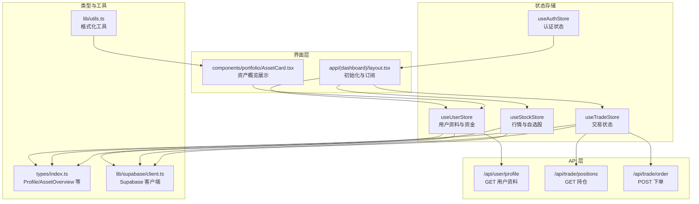
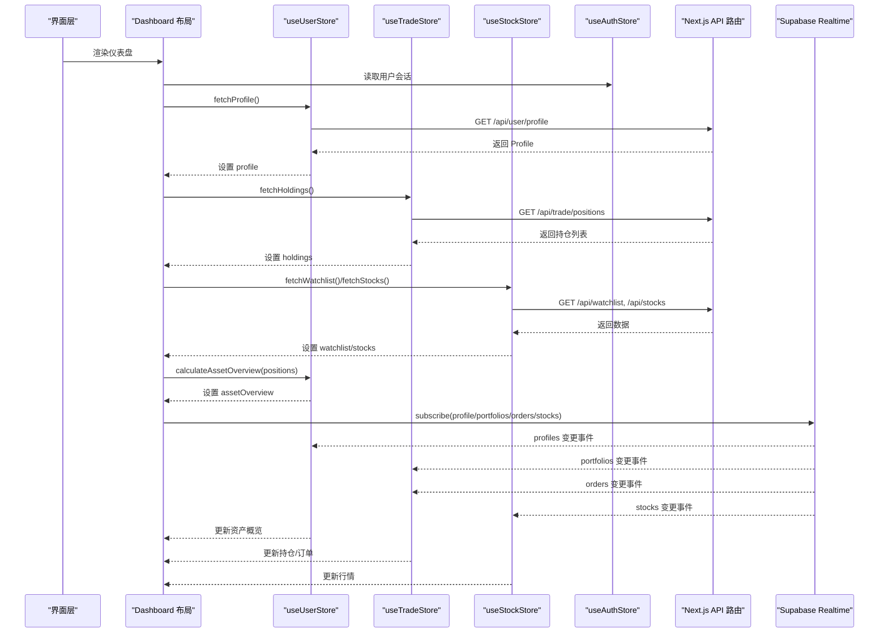
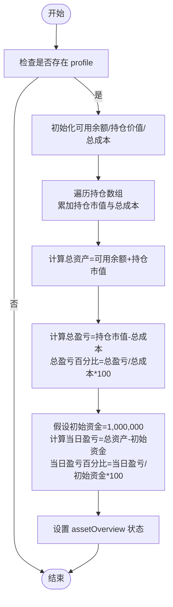
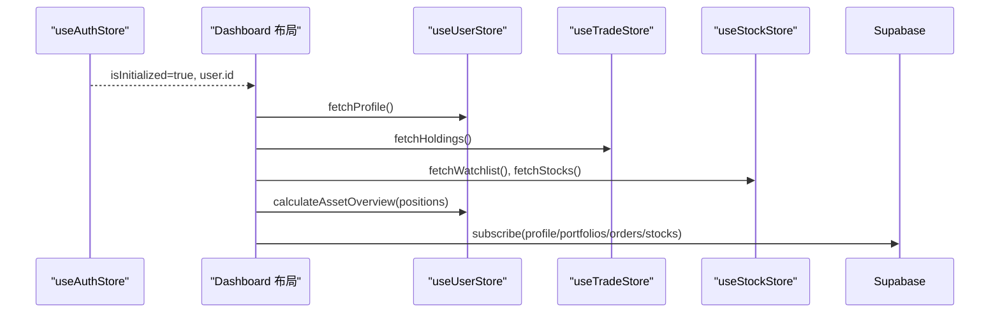
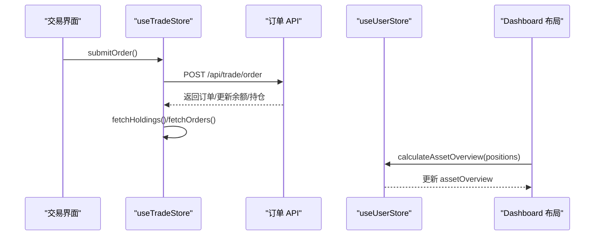
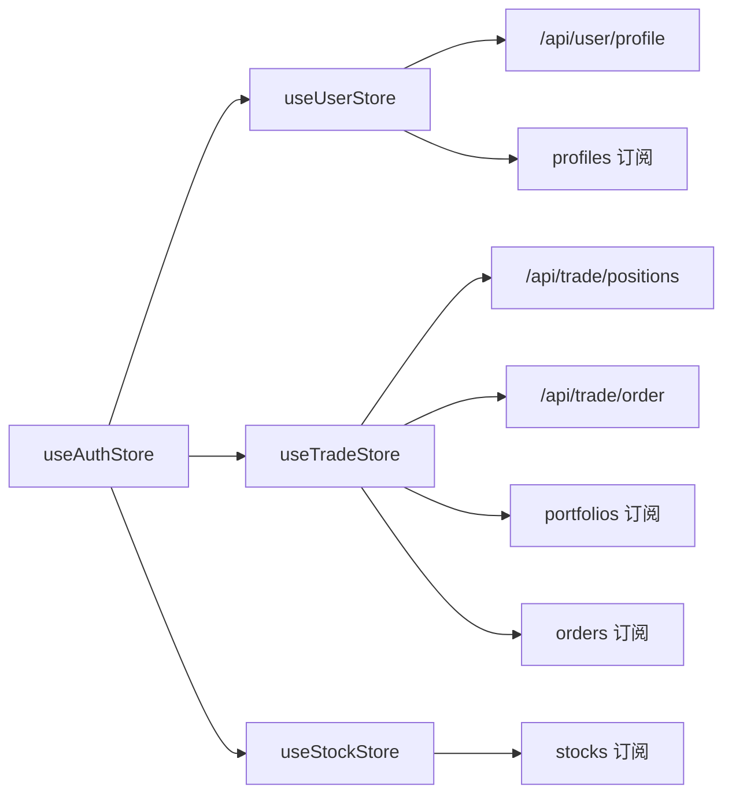
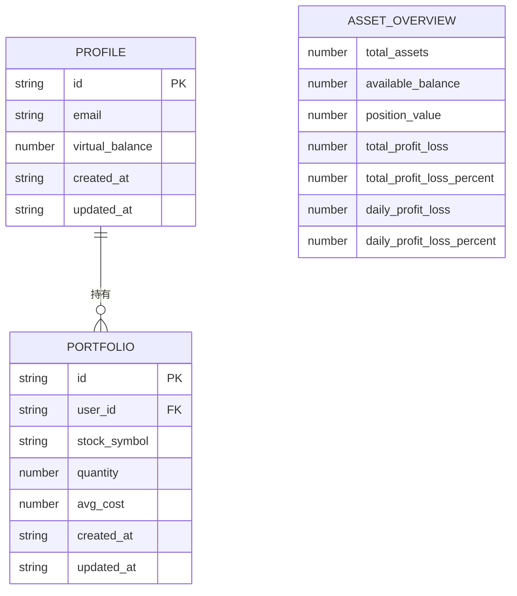

# 用户数据状态管理

<cite>
**本文档引用的文件**
- [useUserStore.ts](file://stores/useUserStore.ts)
- [useAuthStore.ts](file://stores/useAuthStore.ts)
- [useTradeStore.ts](file://stores/useTradeStore.ts)
- [useStockStore.ts](file://stores/useStockStore.ts)
- [index.ts](file://stores/index.ts)
- [types/index.ts](file://types/index.ts)
- [app/api/user/profile/route.ts](file://app/api/user/profile/route.ts)
- [app/api/trade/positions/route.ts](file://app/api/trade/positions/route.ts)
- [app/api/trade/order/route.ts](file://app/api/trade/order/route.ts)
- [app/(dashboard)/layout.tsx](file://app/(dashboard)/layout.tsx)
- [components/portfolio/AssetCard.tsx](file://components/portfolio/AssetCard.tsx)
- [lib/supabase/client.ts](file://lib/supabase/client.ts)
- [lib/trading-rules.ts](file://lib/trading-rules.ts)
- [lib/utils.ts](file://lib/utils.ts)
- [docs/状态管理结构.md](file://docs/状态管理结构.md)
- [supabase/schema.sql](file://supabase/schema.sql)
</cite>

## 目录
1. [简介](#简介)
2. [项目结构](#项目结构)
3. [核心组件](#核心组件)
4. [架构概览](#架构概览)
5. [详细组件分析](#详细组件分析)
6. [依赖关系分析](#依赖关系分析)
7. [性能考量](#性能考量)
8. [故障排除指南](#故障排除指南)
9. [结论](#结论)
10. [附录](#附录)

## 简介
本文件系统性阐述虚拟股票交易系统的用户数据状态管理体系，重点覆盖用户个人信息与账户状态的建模、获取与更新机制、与其它状态存储的协作关系、安全与隐私保护、版本管理与迁移策略、错误处理与数据修复机制，以及调试与监控方法。目标是帮助开发者与产品人员全面理解用户数据在前端状态层的设计与实现。

## 项目结构
用户数据状态管理由多个独立但相互协作的状态存储组成，采用按功能域划分的模块化设计：
- 认证状态：useAuthStore 管理会话与用户身份
- 用户资料与资金：useUserStore 管理用户档案、可用余额与资产概览
- 交易状态：useTradeStore 管理持仓、订单与成交记录
- 行情与自选股：useStockStore 管理股票列表、自选股与实时行情
- 类型定义：types/index.ts 提供 Profile、AssetOverview 等强类型支撑
- API 层：Next.js App Router API 路由负责用户资料、持仓等后端接口
- 实时订阅：Supabase Realtime 订阅数据库变更，驱动状态更新

**图表来源**
- [useAuthStore.ts:17-103](file://stores/useAuthStore.ts#L17-L103)
- [useUserStore.ts:15-106](file://stores/useUserStore.ts#L15-L106)
- [useTradeStore.ts:27-191](file://stores/useTradeStore.ts#L27-L191)
- [useStockStore.ts:23-183](file://stores/useStockStore.ts#L23-L183)
- [types/index.ts:2-100](file://types/index.ts#L2-L100)
- [app/api/user/profile/route.ts:5-41](file://app/api/user/profile/route.ts#L5-L41)
- [app/api/trade/positions/route.ts:4-45](file://app/api/trade/positions/route.ts#L4-L45)
- [app/api/trade/order/route.ts:94-230](file://app/api/trade/order/route.ts#L94-L230)
- [app/(dashboard)/layout.tsx:42-96](file://app/(dashboard)/layout.tsx#L42-L96)
- [components/portfolio/AssetCard.tsx:7-43](file://components/portfolio/AssetCard.tsx#L7-L43)
- [lib/supabase/client.ts:3-8](file://lib/supabase/client.ts#L3-L8)
- [lib/utils.ts:14-35](file://lib/utils.ts#L14-L35)

**章节来源**
- [stores/index.ts:1-7](file://stores/index.ts#L1-L7)
- [docs/状态管理结构.md:1-457](file://docs/状态管理结构.md#L1-L457)

## 核心组件
本节聚焦用户数据状态的核心构成与职责边界。

- useUserStore：负责用户资料、可用余额与资产概览的获取、更新与计算
  - 数据结构：profile（用户档案）、assetOverview（资产概览）、isLoading（加载状态）
  - 关键方法：fetchProfile（拉取用户资料）、updateBalance（更新余额并联动资产概览）、calculateAssetOverview（基于持仓计算资产概览）、subscribeProfile（基于 Supabase Realtime 订阅资料变更）
- useAuthStore：负责认证会话与用户身份的管理
  - 数据结构：session、user、isLoading、isInitialized
  - 关键方法：setSession、signIn、signUp、signOut、initialize
- useTradeStore：负责交易相关状态（持仓、订单、成交），并与用户余额联动
  - 数据结构：holdings、orders、transactions、isLoading
  - 关键方法：fetchHoldings、fetchOrders、fetchTransactions、submitOrder、cancelOrder、subscribeHoldings、subscribeOrders、getHoldingBySymbol
- useStockStore：负责股票列表、自选股与实时行情
  - 数据结构：stocks、watchlist、searchKeyword、isLoading、currentPage、totalCount
  - 关键方法：fetchStocks、fetchWatchlist、addToWatchlist、removeFromWatchlist、subscribePrices、updateStockPrice、getStockBySymbol
- 类型定义：Profile、AssetOverview 等强类型确保数据结构一致性与可维护性

**章节来源**
- [useUserStore.ts:5-13](file://stores/useUserStore.ts#L5-L13)
- [useUserStore.ts:15-106](file://stores/useUserStore.ts#L15-L106)
- [useAuthStore.ts:5-15](file://useAuthStore.ts#L5-L15)
- [useAuthStore.ts:17-103](file://useAuthStore.ts#L17-L103)
- [useTradeStore.ts:6-25](file://useTradeStore.ts#L6-L25)
- [useTradeStore.ts:27-191](file://useTradeStore.ts#L27-L191)
- [useStockStore.ts:6-21](file://useStockStore.ts#L6-L21)
- [useStockStore.ts:23-183](file://useStockStore.ts#L23-L183)
- [types/index.ts:2-100](file://types/index.ts#L2-L100)

## 架构概览
用户数据状态管理遵循“状态存储 + API 层 + 实时订阅”的三层架构：
- 状态存储层：Zustand Store 提供响应式状态与副作用逻辑
- API 层：Next.js App Router API 路由封装后端数据访问，统一鉴权与错误处理
- 实时订阅层：Supabase Realtime 订阅数据库变更，触发状态更新

**图表来源**
- [app/(dashboard)/layout.tsx:42-96](file://app/(dashboard)/layout.tsx#L42-L96)
- [useUserStore.ts:20-34](file://stores/useUserStore.ts#L20-L34)
- [useTradeStore.ts:33-66](file://stores/useTradeStore.ts#L33-L66)
- [useStockStore.ts:59-78](file://stores/useStockStore.ts#L59-L78)
- [app/api/user/profile/route.ts:5-41](file://app/api/user/profile/route.ts#L5-L41)
- [app/api/trade/positions/route.ts:4-45](file://app/api/trade/positions/route.ts#L4-L45)
- [useUserStore.ts:85-105](file://stores/useUserStore.ts#L85-L105)
- [useTradeStore.ts:144-186](file://stores/useTradeStore.ts#L144-L186)
- [useStockStore.ts:125-150](file://stores/useStockStore.ts#L125-L150)

## 详细组件分析

### useUserStore：用户资料与资产概览
- 数据结构设计
  - profile：包含用户标识、邮箱、虚拟余额、创建与更新时间
  - assetOverview：包含总资产、可用余额、持仓市值、总盈亏、总盈亏百分比、当日盈亏与百分比等
- 获取与更新机制
  - fetchProfile：通过 /api/user/profile 拉取用户资料，设置 isLoading 并在 finally 中重置
  - updateBalance：在更新用户余额的同时，联动更新资产概览中的可用余额与总资产
  - calculateAssetOverview：根据传入的持仓数组（含数量、均价、当前价）计算资产概览，包含总市值、总盈亏、总盈亏百分比、以固定初始资金为基准的当日盈亏与百分比
- 实时订阅
  - subscribeProfile：基于 Supabase Realtime 订阅 profiles 表的 UPDATE 事件，当用户资料更新时自动刷新 profile
- 与交易状态的协作
  - 在下单成功后，交易状态会刷新持仓与订单，Dashboard 布局会重新计算资产概览，从而保持用户资产视图与交易状态一致

**图表来源**
- [useUserStore.ts:50-83](file://stores/useUserStore.ts#L50-L83)

**章节来源**
- [useUserStore.ts:5-13](file://stores/useUserStore.ts#L5-L13)
- [useUserStore.ts:15-106](file://stores/useUserStore.ts#L15-L106)
- [types/index.ts:2-100](file://types/index.ts#L2-L100)
- [app/api/user/profile/route.ts:5-41](file://app/api/user/profile/route.ts#L5-L41)

### 认证状态与用户数据的联动
- useAuthStore.initialize：初始化时获取当前会话并监听认证状态变化，确保用户登录态稳定
- Dashboard 布局在用户 ID 存在时，先拉取用户资料与交易、行情数据，再建立实时订阅，保证初始状态完整且后续数据实时更新

**图表来源**
- [useAuthStore.ts:81-102](file://stores/useAuthStore.ts#L81-L102)
- [app/(dashboard)/layout.tsx:42-96](file://app/(dashboard)/layout.tsx#L42-L96)

**章节来源**
- [useAuthStore.ts:17-103](file://stores/useAuthStore.ts#L17-L103)
- [app/(dashboard)/layout.tsx:42-96](file://app/(dashboard)/layout.tsx#L42-L96)

### 交易状态对用户数据的影响
- 下单流程：交易 API 在成功创建订单后，会更新用户余额与持仓，随后交易状态会刷新相关列表
- 资产概览联动：交易状态刷新后，Dashboard 布局会重新计算资产概览，确保用户看到最新的总资产与可用余额

**图表来源**
- [useTradeStore.ts:99-121](file://stores/useTradeStore.ts#L99-L121)
- [app/api/trade/order/route.ts:94-230](file://app/api/trade/order/route.ts#L94-L230)
- [app/(dashboard)/layout.tsx:98-107](file://app/(dashboard)/layout.tsx#L98-L107)

**章节来源**
- [useTradeStore.ts:27-191](file://stores/useTradeStore.ts#L27-L191)
- [app/api/trade/order/route.ts:94-230](file://app/api/trade/order/route.ts#L94-L230)
- [app/(dashboard)/layout.tsx:98-107](file://app/(dashboard)/layout.tsx#L98-L107)

### 行情与自选股对用户数据的间接影响
- useStockStore.subscribePrices：订阅 stocks 表的 UPDATE 事件，实时更新股价与涨跌幅
- Dashboard 布局定时刷新股票列表并在刷新后重新计算资产概览，确保资产视图随行情波动而更新

**章节来源**
- [useStockStore.ts:125-150](file://stores/useStockStore.ts#L125-L150)
- [app/(dashboard)/layout.tsx:76-87](file://app/(dashboard)/layout.tsx#L76-L87)

## 依赖关系分析
- 组件耦合与内聚
  - useUserStore 与 useTradeStore 通过资产概览计算产生松耦合关联，仅在布局层协调数据流
  - useAuthStore 为其他 Store 的初始化与订阅提供前提条件
  - useStockStore 与 useTradeStore 通过 Supabase Realtime 形成独立的订阅链路，降低耦合度
- 外部依赖
  - Supabase Realtime：用于数据库变更的实时推送
  - Next.js App Router API：提供统一的后端接口入口
  - 浏览器环境变量：NEXT_PUBLIC_SUPABASE_URL 与 NEXT_PUBLIC_SUPABASE_PUBLISHABLE_KEY

**图表来源**
- [useAuthStore.ts:17-103](file://stores/useAuthStore.ts#L17-L103)
- [useUserStore.ts:85-105](file://stores/useUserStore.ts#L85-L105)
- [useTradeStore.ts:144-186](file://stores/useTradeStore.ts#L144-L186)
- [useStockStore.ts:125-150](file://stores/useStockStore.ts#L125-L150)
- [app/api/user/profile/route.ts:5-41](file://app/api/user/profile/route.ts#L5-L41)
- [app/api/trade/positions/route.ts:4-45](file://app/api/trade/positions/route.ts#L4-L45)
- [app/api/trade/order/route.ts:94-230](file://app/api/trade/order/route.ts#L94-L230)
- [supabase/schema.sql:148-151](file://supabase/schema.sql#L148-L151)

**章节来源**
- [stores/index.ts:1-7](file://stores/index.ts#L1-L7)
- [lib/supabase/client.ts:3-8](file://lib/supabase/client.ts#L3-L8)
- [supabase/schema.sql:148-151](file://supabase/schema.sql#L148-L151)

## 性能考量
- 实时订阅的开销控制
  - 使用 Supabase Realtime 订阅时，通过精确的过滤条件（如按用户 ID 或股票符号集合）减少不必要的事件推送
  - 对于高频更新（如行情），采用定时刷新策略（交易时段内定期拉取）与增量更新（仅更新受影响的股票）相结合
- 状态更新的批处理
  - 在布局层集中触发资产概览计算，避免多次细粒度更新导致的重复计算
- 网络请求优化
  - API 层统一处理鉴权与错误，前端仅关注状态更新，减少重复请求与无效渲染

[本节为通用性能建议，无需特定文件引用]

## 故障排除指南
- 常见错误与处理
  - 未登录访问用户资料：API 返回 401，前端应引导用户登录
  - 获取用户资料失败：API 返回 500，前端应提示重试或检查网络
  - 计算资产概览时缺少 profile：在没有用户资料的情况下跳过计算，等待资料就绪
  - 交易下单失败：API 返回错误信息，前端应展示具体原因并允许用户修正
- 数据修复机制
  - 当资产概览与持仓不一致时，可通过重新计算资产概览修复
  - 当实时订阅断开时，可在布局层重新建立订阅并手动触发一次数据刷新
- 调试与监控
  - 在布局层打印关键状态（如 holdings、assetOverview）的变化轨迹
  - 使用浏览器开发者工具观察网络请求与 Supabase Realtime 事件
  - 在组件中增加加载状态与错误状态的可视化反馈

**章节来源**
- [app/api/user/profile/route.ts:12-17](file://app/api/user/profile/route.ts#L12-L17)
- [app/api/user/profile/route.ts:25-31](file://app/api/user/profile/route.ts#L25-L31)
- [useUserStore.ts:50-83](file://stores/useUserStore.ts#L50-L83)
- [useTradeStore.ts:99-121](file://stores/useTradeStore.ts#L99-L121)

## 结论
用户数据状态管理通过清晰的 Store 分层、严格的类型约束、完善的实时订阅与 API 协作，实现了用户资料、账户余额与资产概览的一致性与实时性。配合合理的错误处理与调试手段，系统在复杂交易场景下仍能保持良好的用户体验与数据准确性。

[本节为总结性内容，无需特定文件引用]

## 附录

### 数据模型与类型定义

**图表来源**
- [types/index.ts:2-100](file://types/index.ts#L2-L100)

### 用户数据安全与隐私
- 认证与授权
  - API 层统一通过 getUser 鉴权，未登录用户无法访问用户资料与交易数据
- 最小暴露原则
  - 仅在必要时传输与展示用户敏感信息（如余额），并在 UI 层进行格式化显示
- 实时订阅权限
  - 订阅时按用户 ID 过滤，避免跨用户数据泄露

**章节来源**
- [app/api/user/profile/route.ts:9-17](file://app/api/user/profile/route.ts#L9-L17)
- [app/api/trade/positions/route.ts:9-17](file://app/api/trade/positions/route.ts#L9-L17)
- [useUserStore.ts:85-105](file://stores/useUserStore.ts#L85-L105)
- [useTradeStore.ts:144-186](file://stores/useTradeStore.ts#L144-L186)
- [useStockStore.ts:125-150](file://stores/useStockStore.ts#L125-L150)

### 版本管理与迁移策略
- 状态结构演进
  - 通过类型定义（Profile、AssetOverview）明确字段含义与默认值，便于后续扩展
- 数据迁移
  - 若需调整字段命名或新增字段，应在 API 层与 Store 层同时兼容旧数据格式，逐步迁移
- 持久化策略
  - 文档指出：用户偏好使用 localStorage 持久化，但敏感数据（如持仓、资金）不持久化，每次会话从服务端获取，降低风险

**章节来源**
- [docs/状态管理结构.md:11-14](file://docs/状态管理结构.md#L11-L14)
- [types/index.ts:2-100](file://types/index.ts#L2-L100)

### 用户数据状态的调试与监控方法
- 调试技巧
  - 在布局层打印 user、holdings、assetOverview 的变化，定位数据不一致问题
  - 观察 Supabase Realtime 事件是否按预期触发，确认订阅通道与过滤条件正确
- 监控建议
  - 记录 API 请求的成功率与耗时，识别异常波动
  - 在 UI 层增加加载与错误状态的可视化提示，提升可观测性

**章节来源**
- [app/(dashboard)/layout.tsx:42-96](file://app/(dashboard)/layout.tsx#L42-L96)
- [components/portfolio/AssetCard.tsx:7-43](file://components/portfolio/AssetCard.tsx#L7-L43)