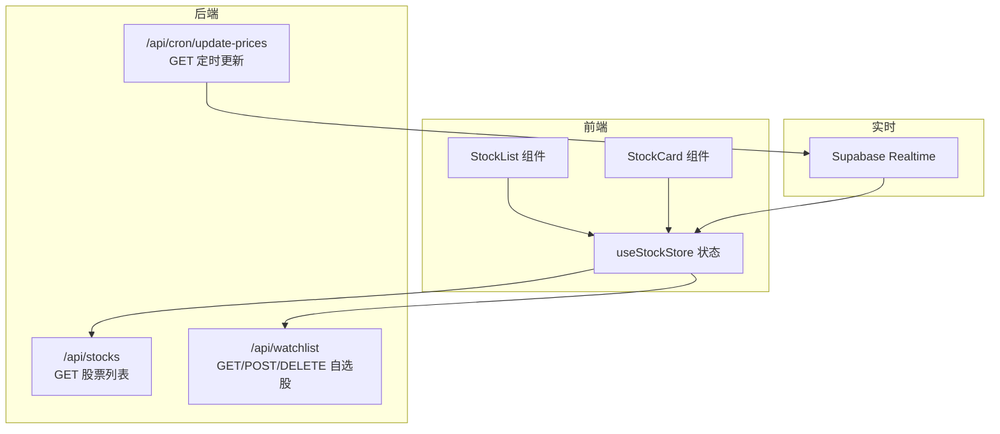
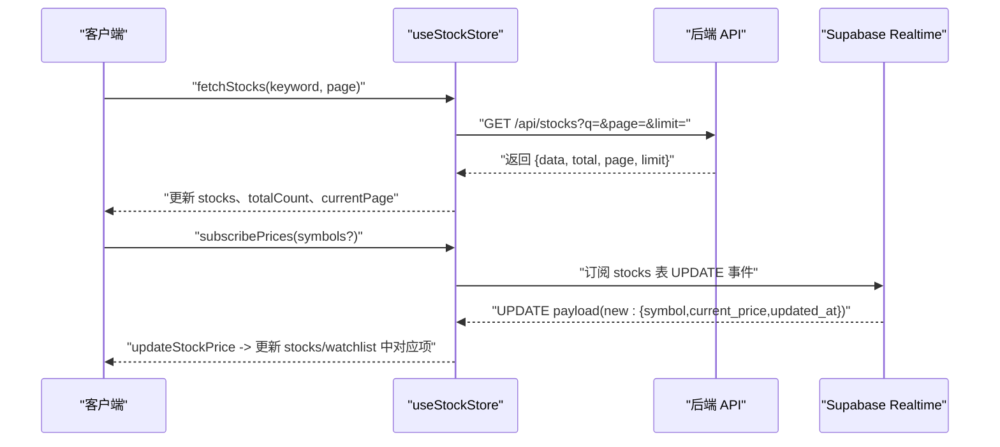
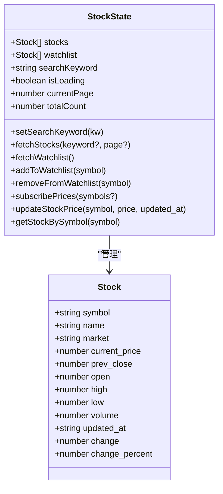
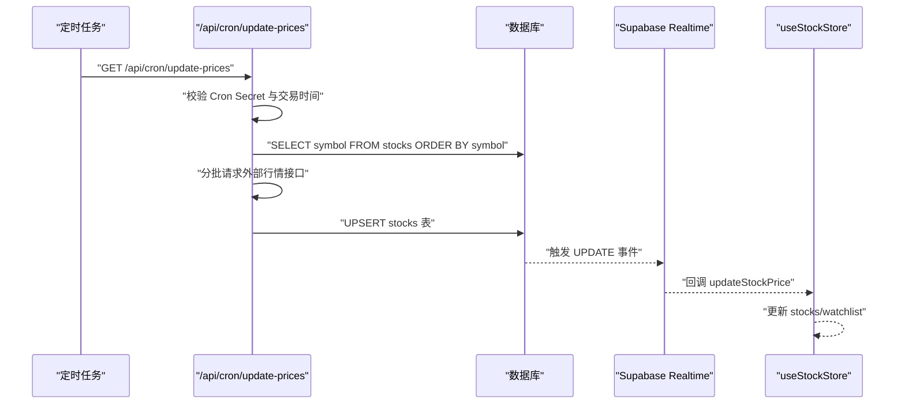
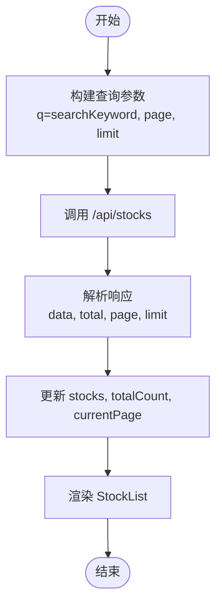
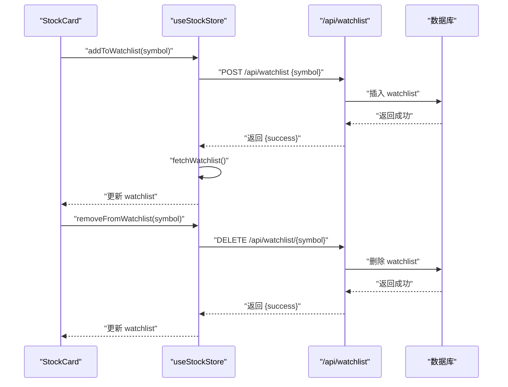
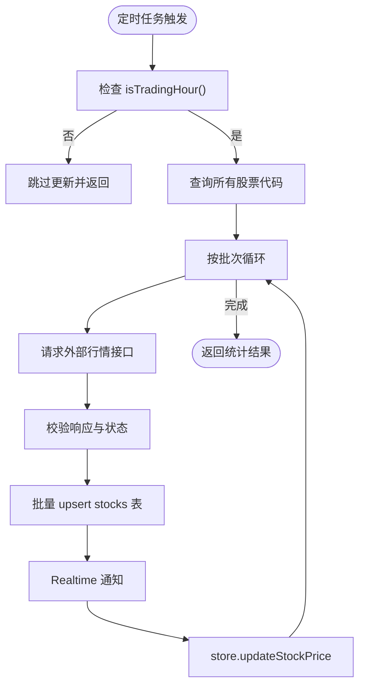
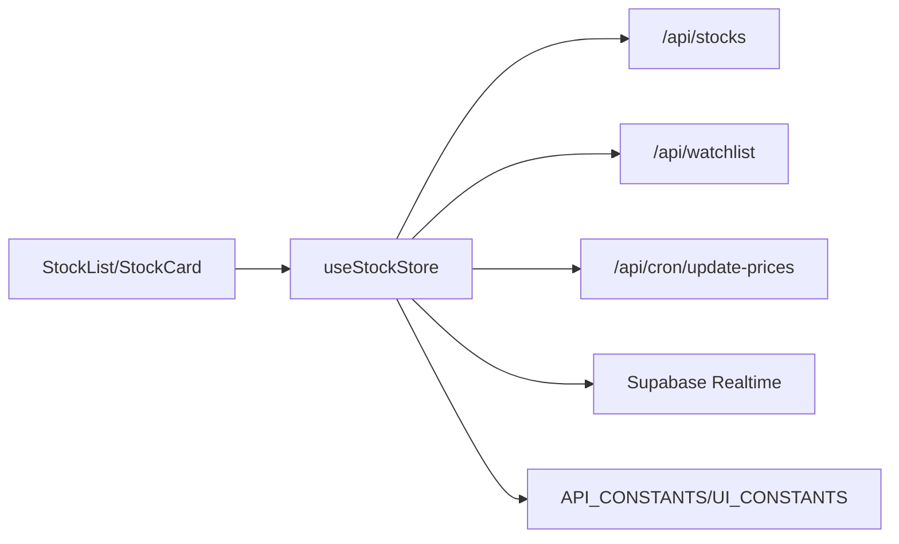

# 股票数据状态管理

<cite>
**本文引用的文件**
- [useStockStore.ts](file://stores/useStockStore.ts)
- [route.ts](file://app/api/stocks/route.ts)
- [route.ts](file://app/api/cron/update-prices/route.ts)
- [constants.ts](file://lib/constants.ts)
- [index.ts](file://types/index.ts)
- [StockList.tsx](file://components/stocks/StockList.tsx)
- [StockCard.tsx](file://components/stocks/StockCard.tsx)
- [状态管理结构.md](file://docs/状态管理结构.md)
- [API接口规范.md](file://docs/API接口规范.md)
- [trading-rules.ts](file://lib/trading-rules.ts)
- [utils.ts](file://lib/utils.ts)
</cite>

## 目录
1. [简介](#简介)
2. [项目结构](#项目结构)
3. [核心组件](#核心组件)
4. [架构总览](#架构总览)
5. [详细组件分析](#详细组件分析)
6. [依赖关系分析](#依赖关系分析)
7. [性能考量](#性能考量)
8. [故障排查指南](#故障排查指南)
9. [结论](#结论)
10. [附录](#附录)

## 简介
本文件围绕虚拟股票交易系统中的“股票数据状态管理”进行深入解析，重点覆盖以下方面：
- useStockStore 的数据结构设计与职责边界
- 股票数据的获取、更新与实时订阅机制
- 过滤、排序与搜索的状态管理
- 与定时任务的集成（价格更新与数据同步）
- 本地缓存与性能优化策略
- 数据一致性与错误恢复机制
- 调试与监控方法

## 项目结构
系统采用前端状态管理与后端 API 的清晰分层：
- 前端状态管理：基于 Zustand 的 useStockStore 管理股票列表、自选股、搜索关键字与加载状态
- 后端 API：提供股票列表查询、自选股管理、定时批量更新等接口
- 实时订阅：通过 Supabase Realtime 订阅数据库变更，驱动前端状态更新
- UI 组件：StockList 与 StockCard 展示与交互，绑定 useStockStore

图表来源
- [useStockStore.ts:23-183](file://stores/useStockStore.ts#L23-L183)
- [route.ts:6-68](file://app/api/stocks/route.ts#L6-L68)
- [route.ts:9-149](file://app/api/cron/update-prices/route.ts#L9-L149)

章节来源
- [useStockStore.ts:1-184](file://stores/useStockStore.ts#L1-L184)
- [route.ts:1-69](file://app/api/stocks/route.ts#L1-L69)
- [route.ts:1-150](file://app/api/cron/update-prices/route.ts#L1-L150)

## 核心组件
- useStockStore：负责股票列表、自选股、搜索关键字、加载状态、实时订阅与价格更新
- StockList/StockCard：负责渲染与交互，触发搜索、分页与自选股操作
- API 层：提供股票列表查询、自选股增删、定时批量更新
- Supabase Realtime：监听 stocks 表更新，回调驱动前端状态更新

章节来源
- [useStockStore.ts:6-21](file://stores/useStockStore.ts#L6-L21)
- [StockList.tsx:19-39](file://components/stocks/StockList.tsx#L19-L39)
- [StockCard.tsx:19-52](file://components/stocks/StockCard.tsx#L19-L52)

## 架构总览
系统遵循“前端状态 + 后端 API + 实时订阅”的三层架构：
- 前端状态：Zustand store 维护 stocks、watchlist、searchKeyword、isLoading、currentPage、totalCount
- 后端 API：Next.js API Route 提供查询、自选股管理、定时更新
- 实时订阅：Supabase Realtime 订阅 stocks 表 UPDATE 事件，回调中调用 store 的 updateStockPrice

图表来源
- [useStockStore.ts:33-57](file://stores/useStockStore.ts#L33-L57)
- [useStockStore.ts:125-150](file://stores/useStockStore.ts#L125-L150)
- [useStockStore.ts:152-177](file://stores/useStockStore.ts#L152-L177)
- [route.ts:6-68](file://app/api/stocks/route.ts#L6-L68)

章节来源
- [useStockStore.ts:33-177](file://stores/useStockStore.ts#L33-L177)
- [route.ts:6-68](file://app/api/stocks/route.ts#L6-L68)

## 详细组件分析

### useStockStore 数据结构与职责
- 状态字段
  - stocks：当前展示的股票数组，包含 symbol、name、market、current_price、prev_close、open、high、low、volume、updated_at，以及计算字段 change、change_percent
  - watchlist：自选股数组，结构与 stocks 对齐
  - searchKeyword：当前搜索关键字
  - isLoading：加载状态
  - currentPage、totalCount：分页控制
- 关键方法
  - setSearchKeyword：设置搜索关键字
  - fetchStocks：根据关键字与分页参数调用 /api/stocks，更新 stocks、totalCount、currentPage
  - fetchWatchlist：调用 /api/watchlist，将结果映射为 Stock 格式并更新 watchlist
  - addToWatchlist/removeFromWatchlist：调用 /api/watchlist 的 POST/DELETE，成功后刷新 watchlist
  - subscribePrices：通过 Supabase Realtime 订阅 stocks 表 UPDATE 事件，回调中调用 updateStockPrice
  - updateStockPrice：根据 symbol 更新 stocks 与 watchlist 中对应股票的 current_price、updated_at、change、change_percent
  - getStockBySymbol：在 stocks 与 watchlist 中查找指定 symbol 的股票

图表来源
- [useStockStore.ts:6-21](file://stores/useStockStore.ts#L6-L21)
- [index.ts:11-25](file://types/index.ts#L11-L25)

章节来源
- [useStockStore.ts:23-183](file://stores/useStockStore.ts#L23-L183)
- [index.ts:11-25](file://types/index.ts#L11-L25)

### 股票数据获取与更新机制
- 列表获取
  - 前端：useStockStore.fetchStocks 构造查询参数（q、page、limit），调用 /api/stocks
  - 后端：app/api/stocks/route.ts 解析查询参数，执行数据库查询，按 volume 降序分页返回，同时计算 change 与 change_percent
- 实时订阅
  - 前端：subscribePrices 基于 Supabase Realtime 订阅 stocks 表 UPDATE 事件，回调中调用 updateStockPrice
  - 后端：定时任务 /api/cron/update-prices 在交易时间内批量更新 stocks 表，触发 Realtime 事件
- 定时任务集成
  - /api/cron/update-prices 仅在 isTradingHour() 为真时执行，按批次调用外部行情接口，批量 upsert 到 stocks 表

图表来源
- [route.ts:9-149](file://app/api/cron/update-prices/route.ts#L9-L149)
- [trading-rules.ts:7-24](file://lib/trading-rules.ts#L7-L24)
- [useStockStore.ts:125-150](file://stores/useStockStore.ts#L125-L150)
- [useStockStore.ts:152-177](file://stores/useStockStore.ts#L152-L177)

章节来源
- [route.ts:6-68](file://app/api/stocks/route.ts#L6-L68)
- [route.ts:9-149](file://app/api/cron/update-prices/route.ts#L9-L149)
- [trading-rules.ts:7-24](file://lib/trading-rules.ts#L7-L24)

### 过滤、排序与搜索
- 搜索
  - 前端：StockList 使用 searchKeyword 作为输入，通过 setSearchKeyword 设置 store 中的关键字
  - 后端：/api/stocks 支持 q 查询参数，按 symbol 或 name 进行模糊匹配
- 排序
  - 后端：按 volume 降序排序，确保高成交量股票优先展示
- 分页
  - 前端：StockList 支持上一页/下一页导航，结合 useStockStore.currentPage 与 totalCount
  - 后端：/api/stocks 支持 page 与 limit 参数，limit 受 API_CONSTANTS 限制

图表来源
- [useStockStore.ts:33-57](file://stores/useStockStore.ts#L33-L57)
- [route.ts:10-34](file://app/api/stocks/route.ts#L10-L34)
- [StockList.tsx:36-52](file://components/stocks/StockList.tsx#L36-L52)

章节来源
- [StockList.tsx:19-135](file://components/stocks/StockList.tsx#L19-L135)
- [route.ts:6-68](file://app/api/stocks/route.ts#L6-L68)
- [constants.ts:71-79](file://lib/constants.ts#L71-L79)

### 自选股管理与状态联动
- 新增/移除自选股
  - 前端：addToWatchlist/removeFromWatchlist 调用 /api/watchlist 的 POST/DELETE，成功后 fetchWatchlist 刷新本地状态
  - 后端：/api/watchlist 提供 GET/POST/DELETE，返回标准化响应
- watchlist 与 stocks 的联动
  - updateStockPrice 同时更新 stocks 与 watchlist 中的对应股票，保持两者一致

图表来源
- [useStockStore.ts:80-123](file://stores/useStockStore.ts#L80-L123)
- [StockCard.tsx:34-52](file://components/stocks/StockCard.tsx#L34-L52)

章节来源
- [useStockStore.ts:80-123](file://stores/useStockStore.ts#L80-L123)
- [StockCard.tsx:19-150](file://components/stocks/StockCard.tsx#L19-L150)

### 与定时任务的集成与数据同步
- 交易时间检查
  - /api/cron/update-prices 在非交易时间直接返回提示，避免无效请求
- 批量更新策略
  - 按 API_CONSTANTS.ITICK_BATCH_SIZE 分批请求外部行情接口，减少单次请求压力
  - 使用 AbortSignal.timeout 控制请求超时，防止阻塞
  - upsert 写入数据库，触发 Supabase Realtime 事件，最终由前端 store 更新
- 数据一致性
  - 前端 store 在 updateStockPrice 中同时更新 stocks 与 watchlist，避免视图不一致

图表来源
- [route.ts:21-131](file://app/api/cron/update-prices/route.ts#L21-L131)
- [useStockStore.ts:152-177](file://stores/useStockStore.ts#L152-L177)
- [trading-rules.ts:7-24](file://lib/trading-rules.ts#L7-L24)

章节来源
- [route.ts:9-149](file://app/api/cron/update-prices/route.ts#L9-L149)
- [trading-rules.ts:7-24](file://lib/trading-rules.ts#L7-L24)

### 本地缓存与性能优化
- 前端缓存策略
  - useStockStore 本地维护 stocks 与 watchlist，避免重复请求
  - 分页与搜索状态（searchKeyword、currentPage、totalCount）减少不必要的重绘
- 后端缓存与限制
  - API_CONSTANTS.DEFAULT_PAGE_SIZE 与 MAX_PAGE_SIZE 控制分页规模
  - /api/stocks 限制每页最大值，降低数据库压力
- 实时订阅优化
  - subscribePrices 支持按 symbols 过滤，减少无关更新
  - updateStockPrice 使用 map 逐项更新，避免全量替换
- UI 性能
  - StockList 使用骨架屏与分页，提升大列表渲染体验
  - utils.formatCurrency/formatPercent 用于格式化显示，减少重复计算

章节来源
- [constants.ts:71-79](file://lib/constants.ts#L71-L79)
- [useStockStore.ts:125-177](file://stores/useStockStore.ts#L125-L177)
- [StockList.tsx:77-98](file://components/stocks/StockList.tsx#L77-L98)
- [utils.ts:13-35](file://lib/utils.ts#L13-L35)

### 数据一致性与错误恢复
- 数据一致性
  - updateStockPrice 同时更新 stocks 与 watchlist，确保视图一致
  - 定时任务批量 upsert，避免部分更新导致的中间态
- 错误处理
  - 前端：fetchStocks/fetchWatchlist/addToWatchlist/removeFromWatchlist 在 try/catch 中捕获异常并设置 isLoading=false
  - 后端：/api/stocks 与 /api/cron/update-prices 对错误进行日志记录与标准响应
- 恢复机制
  - 自选股变更后主动 fetchWatchlist，确保本地状态与服务端一致
  - 实时订阅失败时，可通过手动刷新或重新订阅恢复

章节来源
- [useStockStore.ts:33-123](file://stores/useStockStore.ts#L33-L123)
- [route.ts:38-44](file://app/api/stocks/route.ts#L38-L44)
- [route.ts:74-86](file://app/api/cron/update-prices/route.ts#L74-L86)

### 调试与监控方法
- 前端调试
  - 在组件中打印 useStockStore 的状态变化，确认 fetchStocks、updateStockPrice 是否生效
  - 使用浏览器开发者工具查看网络请求，核对 /api/stocks 与 /api/watchlist 的响应
- 后端监控
  - 查看 /api/cron/update-prices 的返回统计（updated、errors、total），判断批量更新成功率
  - 校验 isTradingHour() 逻辑，确保非交易时间跳过更新
- 实时链路验证
  - 在 Supabase Dashboard 观察 stocks 表 UPDATE 事件是否触发
  - 在前端组件中增加日志，确认 updateStockPrice 回调被调用

章节来源
- [route.ts:133-140](file://app/api/cron/update-prices/route.ts#L133-L140)
- [useStockStore.ts:125-177](file://stores/useStockStore.ts#L125-L177)

## 依赖关系分析
- 组件与状态
  - StockList/StockCard 依赖 useStockStore 的状态与方法
- 状态与 API
  - useStockStore 依赖 /api/stocks、/api/watchlist、/api/cron/update-prices
- 状态与实时
  - useStockStore 依赖 Supabase Realtime 订阅
- 常量与配置
  - API_CONSTANTS 影响分页与批量大小
  - UI_CONSTANTS 影响刷新间隔（用于 UI 层的刷新策略）

图表来源
- [useStockStore.ts:1-4](file://stores/useStockStore.ts#L1-L4)
- [constants.ts:71-95](file://lib/constants.ts#L71-L95)

章节来源
- [useStockStore.ts:1-4](file://stores/useStockStore.ts#L1-L4)
- [constants.ts:71-95](file://lib/constants.ts#L71-L95)

## 性能考量
- 分页与批量
  - 合理设置 DEFAULT_PAGE_SIZE 与 MAX_PAGE_SIZE，避免一次性加载过多数据
  - 定时任务按批次更新，降低外部接口与数据库压力
- 实时订阅粒度
  - subscribePrices 支持按 symbols 过滤，减少无关更新
- 渲染优化
  - 使用骨架屏与分页，避免长列表渲染卡顿
  - 格式化函数集中处理，减少重复计算

## 故障排查指南
- 列表为空或加载异常
  - 检查 /api/stocks 的查询参数与数据库连接
  - 确认 searchKeyword 与分页参数传递正确
- 自选股无法更新
  - 核对 /api/watchlist 的 POST/DELETE 返回值
  - 确认 fetchWatchlist 是否在成功后被调用
- 实时价格不更新
  - 检查 Supabase Realtime 订阅是否建立
  - 确认 /api/cron/update-prices 是否在交易时间内运行
- 定时任务失败
  - 查看 /api/cron/update-prices 的错误计数与超时日志
  - 校验外部行情接口的可用性与配额

章节来源
- [useStockStore.ts:33-123](file://stores/useStockStore.ts#L33-L123)
- [route.ts:38-44](file://app/api/stocks/route.ts#L38-L44)
- [route.ts:74-86](file://app/api/cron/update-prices/route.ts#L74-L86)

## 结论
本系统通过 Zustand 管理股票数据状态，结合后端 API 与 Supabase Realtime 实现高效的数据获取与实时更新。通过合理的分页、批量更新与订阅过滤策略，系统在性能与一致性之间取得平衡。建议在生产环境中进一步完善错误上报与监控告警，以保障数据更新的稳定性。

## 附录
- API 接口规范参考：[API接口规范.md](file://docs/API接口规范.md)
- 状态管理结构参考：[状态管理结构.md](file://docs/状态管理结构.md)