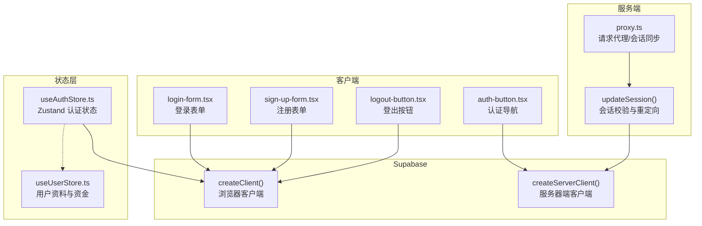
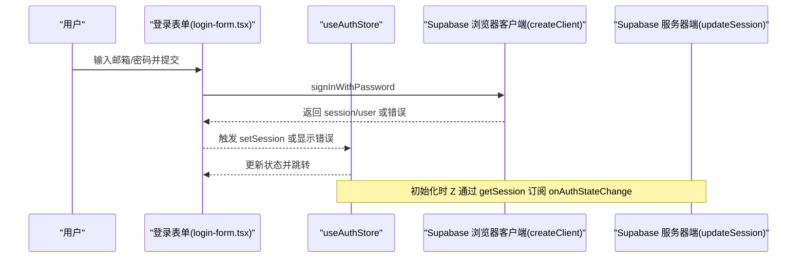
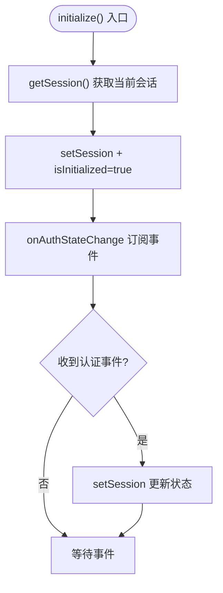
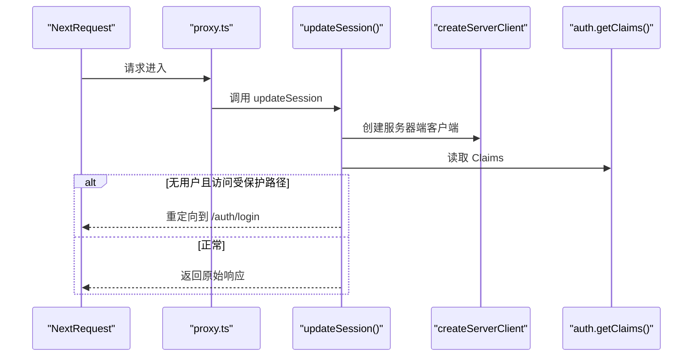
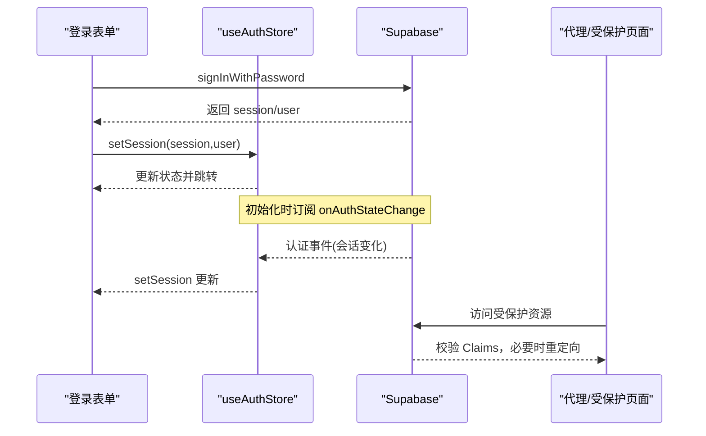
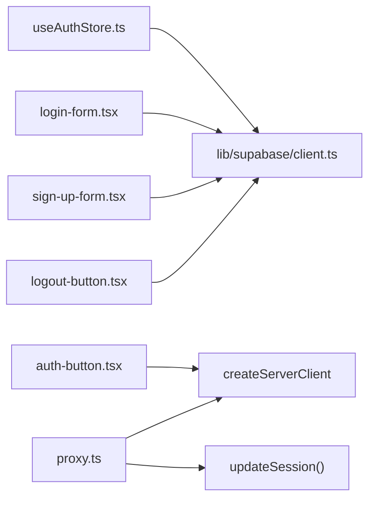

# 认证状态管理

<cite>
**本文档引用的文件**
- [useAuthStore.ts](file://stores/useAuthStore.ts)
- [client.ts](file://lib/supabase/client.ts)
- [proxy.ts](file://lib/supabase/proxy.ts)
- [index.ts](file://stores/index.ts)
- [login-form.tsx](file://components/login-form.tsx)
- [sign-up-form.tsx](file://components/sign-up-form.tsx)
- [logout-button.tsx](file://components/logout-button.tsx)
- [auth-button.tsx](file://components/auth-button.tsx)
- [layout.tsx](file://app/layout.tsx)
- [page.tsx](file://app/page.tsx)
- [protected-layout.tsx](file://app/protected/layout.tsx)
- [protected-page.tsx](file://app/protected/page.tsx)
- [route.ts](file://app/auth/confirm/route.ts)
- [状态管理结构.md](file://docs/状态管理结构.md)
- [index.ts](file://types/index.ts)
</cite>

## 目录
1. [简介](#简介)
2. [项目结构](#项目结构)
3. [核心组件](#核心组件)
4. [架构总览](#架构总览)
5. [详细组件分析](#详细组件分析)
6. [依赖关系分析](#依赖关系分析)
7. [性能考虑](#性能考虑)
8. [故障排除指南](#故障排除指南)
9. [结论](#结论)
10. [附录](#附录)

## 简介
本文件系统性阐述本项目的认证状态管理体系，重点围绕 useAuthStore 的实现原理与使用方式，涵盖登录状态、会话管理、权限控制、数据结构设计、状态更新机制（登录、登出、自动续期）、与 Supabase 认证系统的集成与同步机制、持久化策略与安全考量、错误处理与异常恢复，以及认证状态的调试与监控方法。目标是帮助开发者快速理解并正确使用认证状态管理，同时为后续扩展权限体系提供清晰的参考。

## 项目结构
认证相关的核心文件分布如下：
- 状态层：stores/useAuthStore.ts（Zustand 认证状态存储）
- Supabase 客户端封装：lib/supabase/client.ts
- 服务器端会话同步与保护：lib/supabase/proxy.ts
- 页面与组件：app/*、components/*（登录、注册、登出、认证按钮等）
- 类型定义：types/index.ts（用户与认证相关类型）

**图表来源**
- [useAuthStore.ts:1-104](file://stores/useAuthStore.ts#L1-L104)
- [client.ts:1-9](file://lib/supabase/client.ts#L1-L9)
- [proxy.ts:1-77](file://lib/supabase/proxy.ts#L1-L77)
- [login-form.tsx:1-129](file://components/login-form.tsx#L1-L129)
- [sign-up-form.tsx:1-121](file://components/sign-up-form.tsx#L1-L121)
- [logout-button.tsx:1-18](file://components/logout-button.tsx#L1-L18)
- [auth-button.tsx:1-30](file://components/auth-button.tsx#L1-L30)

**章节来源**
- [useAuthStore.ts:1-104](file://stores/useAuthStore.ts#L1-L104)
- [client.ts:1-9](file://lib/supabase/client.ts#L1-L9)
- [proxy.ts:1-77](file://lib/supabase/proxy.ts#L1-L77)

## 核心组件
- useAuthStore：基于 Zustand 的认证状态存储，负责会话读取、登录/注册/登出、初始化与认证状态监听。
- Supabase 客户端：浏览器端 createClient 用于前端交互；服务器端 createServerClient 用于代理与 SSR。
- 代理中间件：proxy.ts 将请求交给 updateSession 进行会话同步与保护。
- 页面与组件：登录、注册、登出、认证导航等 UI 组件与路由页面。

**章节来源**
- [useAuthStore.ts:1-104](file://stores/useAuthStore.ts#L1-L104)
- [client.ts:1-9](file://lib/supabase/client.ts#L1-L9)
- [proxy.ts:1-77](file://lib/supabase/proxy.ts#L1-L77)

## 架构总览
认证状态管理采用“前端状态 + Supabase 同步”的双轨机制：
- 前端：useAuthStore 以内存状态维护 session 与 user，初始化时拉取当前会话并订阅 Supabase 的认证状态变化事件，确保 UI 与后端状态保持一致。
- 服务端：proxy.ts 在每次请求时通过 updateSession 校验会话有效性，必要时重定向至登录页，保证受保护资源的访问控制。

**图表来源**
- [login-form.tsx:25-44](file://components/login-form.tsx#L25-L44)
- [useAuthStore.ts:31-48](file://stores/useAuthStore.ts#L31-L48)
- [client.ts:3-8](file://lib/supabase/client.ts#L3-L8)

**章节来源**
- [useAuthStore.ts:1-104](file://stores/useAuthStore.ts#L1-L104)
- [login-form.tsx:1-129](file://components/login-form.tsx#L1-L129)

## 详细组件分析

### useAuthStore 实现原理
- 数据结构设计
  - session：Supabase 会话对象，包含用户信息与令牌上下文。
  - user：当前登录用户对象。
  - isLoading：初始化与操作过程中的加载状态。
  - isInitialized：初始化完成标记。
- 核心方法
  - setSession：设置会话并同步 user，结束加载。
  - signIn：调用 Supabase 登录接口，成功后写入状态。
  - signUp：调用 Supabase 注册接口，返回消息或错误。
  - signOut：调用 Supabase 注销，清空状态。
  - initialize：获取当前会话并订阅认证状态变化事件。
- 更新机制
  - 初始化：getSession → setSession → isInitialized=true。
  - 认证事件：onAuthStateChange → setSession。
  - 登录/注册/登出：对应 setSession 或清空状态。
- 权限控制
  - 通过 Supabase Claims（在服务器端获取）判断是否具备访问受保护资源的权限。
  - 代理层在请求到达时进行校验，未登录且访问受保护路径则重定向。

**图表来源**
- [useAuthStore.ts:81-102](file://stores/useAuthStore.ts#L81-L102)

**章节来源**
- [useAuthStore.ts:1-104](file://stores/useAuthStore.ts#L1-L104)
- [状态管理结构.md:35-78](file://docs/状态管理结构.md#L35-L78)

### 与 Supabase 的集成与同步
- 浏览器端
  - createClient：封装 NEXT_PUBLIC_SUPABASE_URL 与 NEXT_PUBLIC_SUPABASE_PUBLISHABLE_KEY，供前端调用。
  - useAuthStore 使用 createClient 进行登录、注册、注销与会话查询。
- 服务器端
  - createServerClient：在代理函数 updateSession 中创建，读取/写入 Cookie，确保前后端会话一致。
  - getClaims：在服务器端获取用户 Claims，作为权限判断依据。
  - 代理匹配器：proxy.ts 对非静态资源路径统一走会话校验。
- 回调与确认
  - 注册回调：在注册时配置 emailRedirectTo，引导用户回到应用。
  - OTP 验证：app/auth/confirm/route.ts 处理邮箱验证码确认，成功后重定向。

**图表来源**
- [proxy.ts:5-76](file://lib/supabase/proxy.ts#L5-L76)
- [client.ts:3-8](file://lib/supabase/client.ts#L3-L8)
- [route.ts:6-30](file://app/auth/confirm/route.ts#L6-L30)

**章节来源**
- [client.ts:1-9](file://lib/supabase/client.ts#L1-L9)
- [proxy.ts:1-77](file://lib/supabase/proxy.ts#L1-L77)
- [route.ts:1-30](file://app/auth/confirm/route.ts#L1-L30)

### 登录、登出与自动续期流程
- 登录
  - 前端：login-form.tsx 调用 Supabase 登录接口，成功后跳转到行情页。
  - 状态：useAuthStore 写入 session 与 user，结束加载。
- 注册
  - 前端：sign-up-form.tsx 调用 Supabase 注册接口，根据返回消息提示用户。
  - 状态：useAuthStore 内部处理注册结果，前端路由跳转到注册成功页。
- 登出
  - 前端：logout-button.tsx 调用 Supabase 注销，然后跳转到登录页。
  - 状态：useAuthStore 清空 session 与 user。
- 自动续期
  - 初始化时通过 getSession 获取当前会话，随后 onAuthStateChange 监听认证状态变化，确保 UI 与后端状态同步。

**图表来源**
- [login-form.tsx:25-44](file://components/login-form.tsx#L25-L44)
- [useAuthStore.ts:31-102](file://stores/useAuthStore.ts#L31-L102)
- [proxy.ts:50-60](file://lib/supabase/proxy.ts#L50-L60)

**章节来源**
- [login-form.tsx:1-129](file://components/login-form.tsx#L1-L129)
- [sign-up-form.tsx:1-121](file://components/sign-up-form.tsx#L1-L121)
- [logout-button.tsx:1-18](file://components/logout-button.tsx#L1-L18)
- [useAuthStore.ts:1-104](file://stores/useAuthStore.ts#L1-L104)
- [proxy.ts:1-77](file://lib/supabase/proxy.ts#L1-L77)

### 认证状态的数据结构设计
- 认证状态键值
  - session：Supabase 会话对象，包含用户标识、令牌上下文等。
  - user：当前用户对象，由 session.user 提供。
  - isLoading：初始化与操作期间的加载状态。
  - isInitialized：初始化完成标志。
- 用户信息与权限
  - 用户信息：通过 Supabase Claims 在服务器端获取，作为权限判断依据。
  - 权限级别：项目中未显式定义角色/权限枚举，建议在 Supabase Auth 中通过 Roles/Claims 扩展。

**章节来源**
- [useAuthStore.ts:5-15](file://stores/useAuthStore.ts#L5-L15)
- [auth-button.tsx:6-12](file://components/auth-button.tsx#L6-L12)
- [proxy.ts:45-48](file://lib/supabase/proxy.ts#L45-L48)

### 持久化策略与安全考虑
- 持久化策略
  - 前端状态：useAuthStore 仅在内存中维护 session/user，不进行持久化，避免敏感信息泄露。
  - 用户偏好：文档中提到使用 persist 中间件存入 localStorage，但认证状态不在其中。
- 安全考虑
  - 服务器端必须调用 getClaims，否则在 SSR 场景下可能出现用户被随机登出的问题。
  - 代理层必须返回 updateSession 返回的响应对象，避免浏览器与服务器 Cookie 不一致导致会话提前终止。
  - 注册回调与 OTP 验证需正确配置重定向地址，防止钓鱼与会话劫持。

**章节来源**
- [状态管理结构.md:9-14](file://docs/状态管理结构.md#L9-L14)
- [proxy.ts:41-43](file://lib/supabase/proxy.ts#L41-L43)
- [proxy.ts:62-76](file://lib/supabase/proxy.ts#L62-L76)

### 错误处理与异常恢复
- 前端错误处理
  - 登录/注册：捕获 Supabase 返回的 error 并展示给用户。
  - 注销：调用 signOut 后清空状态，确保 UI 一致性。
- 服务器端错误处理
  - 代理层在访问受保护资源时，若无有效 Claims，则重定向到登录页。
  - OTP 验证失败时重定向到错误页并携带错误信息。
- 异常恢复
  - 初始化完成后，onAuthStateChange 会持续监听认证事件，自动恢复状态。
  - 代理层确保会话一致性，减少因 Cookie 不一致导致的异常。

**章节来源**
- [login-form.tsx:36-44](file://components/login-form.tsx#L36-L44)
- [sign-up-form.tsx:42-57](file://components/sign-up-form.tsx#L42-L57)
- [useAuthStore.ts:38-40](file://stores/useAuthStore.ts#L38-L40)
- [proxy.ts:50-60](file://lib/supabase/proxy.ts#L50-L60)
- [route.ts:12-26](file://app/auth/confirm/route.ts#L12-L26)

### 认证状态调试与监控
- 前端调试
  - 在登录成功后打印或查看 useAuthStore 的 session/user，确认状态写入成功。
  - 在初始化时检查 isInitialized 与 isLoading 的变化。
- 服务器端调试
  - 在受保护页面中输出 Claims，确认权限判断逻辑。
  - 通过代理日志观察重定向行为，定位会话问题。
- 监控建议
  - 记录认证事件（登录、登出、会话过期）的时间戳与用户 ID。
  - 监控代理层的重定向次数，识别异常访问模式。

**章节来源**
- [useAuthStore.ts:81-102](file://stores/useAuthStore.ts#L81-L102)
- [protected-page.tsx:8-17](file://app/protected/page.tsx#L8-L17)
- [proxy.ts:50-60](file://lib/supabase/proxy.ts#L50-L60)

## 依赖关系分析
- 组件耦合
  - useAuthStore 依赖 Supabase 浏览器客户端 createClient。
  - 代理层依赖 createServerClient 与 getClaims。
  - 页面与组件通过 createClient 与 Supabase 交互。
- 外部依赖
  - Supabase SSR 客户端：createBrowserClient/createServerClient。
  - Next.js 代理与匹配器：proxy.ts。
- 接口契约
  - 认证状态变更通过 onAuthStateChange 事件传播，确保全局状态一致性。

**图表来源**
- [useAuthStore.ts:1-104](file://stores/useAuthStore.ts#L1-L104)
- [client.ts:1-9](file://lib/supabase/client.ts#L1-L9)
- [proxy.ts:1-77](file://lib/supabase/proxy.ts#L1-L77)
- [login-form.tsx:1-129](file://components/login-form.tsx#L1-L129)
- [sign-up-form.tsx:1-121](file://components/sign-up-form.tsx#L1-L121)
- [logout-button.tsx:1-18](file://components/logout-button.tsx#L1-L18)
- [auth-button.tsx:1-30](file://components/auth-button.tsx#L1-L30)

**章节来源**
- [index.ts:1-7](file://stores/index.ts#L1-L7)
- [layout.tsx:1-42](file://app/layout.tsx#L1-L42)
- [page.tsx:1-7](file://app/page.tsx#L1-L7)
- [protected-layout.tsx:1-56](file://app/protected/layout.tsx#L1-L56)

## 性能考虑
- 状态更新频率：onAuthStateChange 会在认证状态变化时触发，避免不必要的重复渲染。
- 初始化成本：getSession 仅在初始化时调用一次，随后依赖事件驱动更新。
- 服务器端开销：代理层仅在受保护路径生效，减少对静态资源的影响。
- 建议：对频繁触发的状态更新进行节流或去抖，避免 UI 卡顿。

## 故障排除指南
- 用户被随机登出
  - 检查是否在 SSR 中调用了 getClaims。
  - 确认代理层返回的是 updateSession 的响应对象。
- 登录后无法访问受保护页面
  - 检查代理匹配器是否正确拦截请求。
  - 确认 Claims 是否存在且有效。
- 注册后未收到邮件或无法跳转
  - 检查 emailRedirectTo 配置是否正确。
  - 确认 OTP 验证路由是否正常工作。

**章节来源**
- [proxy.ts:41-43](file://lib/supabase/proxy.ts#L41-L43)
- [proxy.ts:62-76](file://lib/supabase/proxy.ts#L62-L76)
- [route.ts:6-30](file://app/auth/confirm/route.ts#L6-L30)

## 结论
本项目的认证状态管理通过 useAuthStore 与 Supabase 的紧密协作，实现了从前端状态到服务器端会话的双向同步。初始化与事件监听确保了状态的一致性，代理层提供了可靠的权限控制与会话保护。遵循文档中的安全与调试建议，可进一步提升系统的稳定性与可观测性。

## 附录
- 相关类型定义：用户资料与资产概览等类型位于 types/index.ts，便于在认证状态下扩展用户信息与权限映射。

**章节来源**
- [index.ts:1-166](file://types/index.ts#L1-L166)