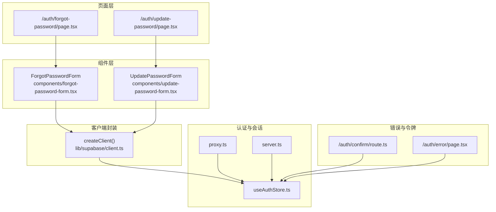
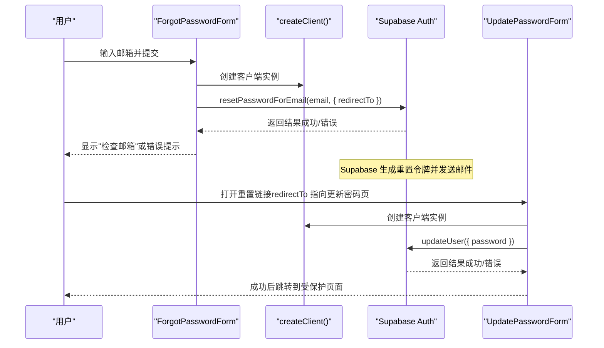
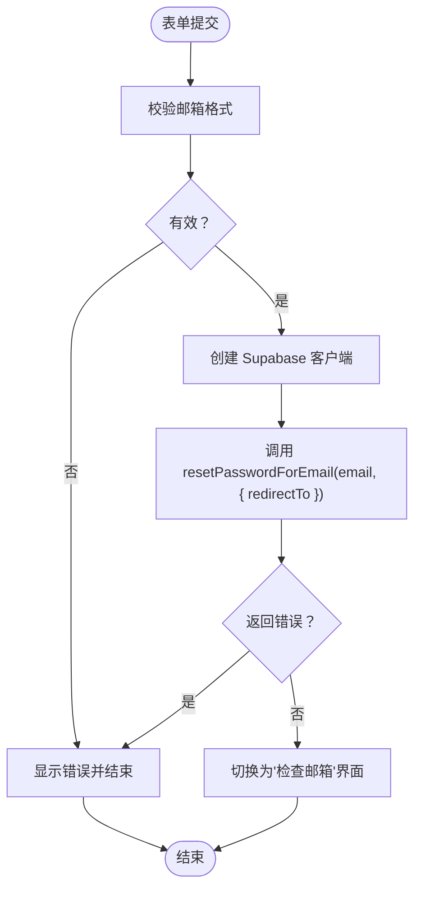
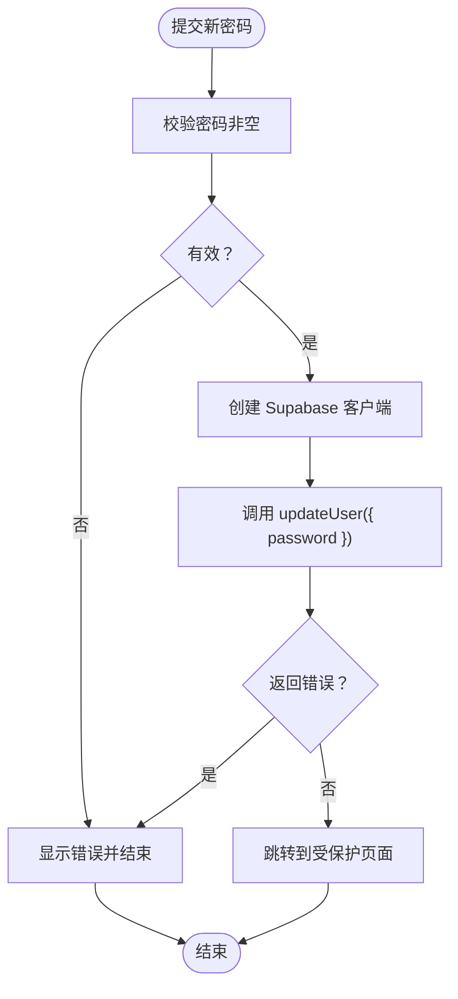
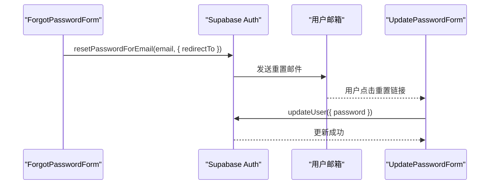
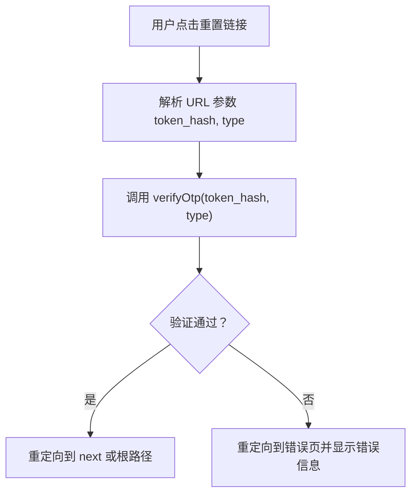
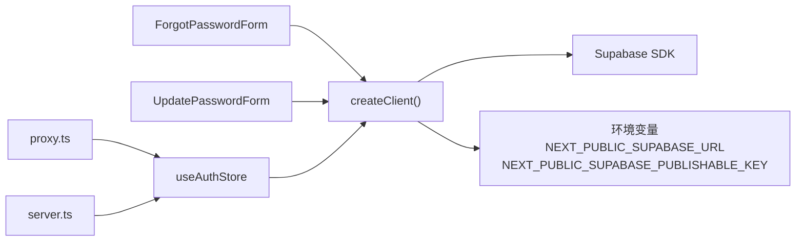

# 密码重置

<cite>
**本文档引用的文件**
- [app/auth/forgot-password/page.tsx](file://app/auth/forgot-password/page.tsx)
- [app/auth/update-password/page.tsx](file://app/auth/update-password/page.tsx)
- [components/forgot-password-form.tsx](file://components/forgot-password-form.tsx)
- [components/update-password-form.tsx](file://components/update-password-form.tsx)
- [lib/supabase/client.ts](file://lib/supabase/client.ts)
- [lib/utils.ts](file://lib/utils.ts)
- [stores/useAuthStore.ts](file://stores/useAuthStore.ts)
- [app/auth/error/page.tsx](file://app/auth/error/page.tsx)
- [app/auth/confirm/route.ts](file://app/auth/confirm/route.ts)
- [lib/supabase/server.ts](file://lib/supabase/server.ts)
- [lib/supabase/proxy.ts](file://lib/supabase/proxy.ts)
- [package.json](file://package.json)
</cite>

## 更新摘要
**所做的更改**
- 更新了密码重置表单的中文国际化内容
- 完善了标题、描述、标签、占位符和按钮文本的中文翻译
- 修正了部分英文文本为中文表述
- 保持了原有的技术架构和功能说明不变

## 目录
1. [简介](#简介)
2. [项目结构](#项目结构)
3. [核心组件](#核心组件)
4. [架构总览](#架构总览)
5. [详细组件分析](#详细组件分析)
6. [依赖关系分析](#依赖关系分析)
7. [性能考量](#性能考量)
8. [故障排除指南](#故障排除指南)
9. [结论](#结论)
10. [附录](#附录)

## 简介
本文件系统性阐述本项目的"密码重置"功能，覆盖从用户忘记密码到重置完成的完整流程。重点包括：
- ForgotPasswordForm 组件的邮箱输入、验证与重置邮件发送逻辑
- Supabase Auth 的重置密码能力（resetPasswordForEmail 方法）与重置链接生成
- UpdatePasswordForm 组件的密码更新与提交流程
- 重置令牌验证机制（URL 参数解析、令牌有效性检查与过期处理）
- 安全考虑（令牌安全性、重置链接有效期、防重放攻击）
- 用户体验优化（进度指示、成功确认、错误提示）
- 错误处理策略与故障排除建议
- 完整的代码示例路径与安全最佳实践

## 项目结构
密码重置功能涉及以下关键文件与职责划分：
- 页面层：forgot-password 页面负责渲染 ForgotPasswordForm；update-password 页面负责渲染 UpdatePasswordForm
- 组件层：ForgotPasswordForm 负责邮箱输入与重置邮件发送；UpdatePasswordForm 负责新密码输入与提交
- 客户端封装：lib/supabase/client.ts 提供 Supabase 浏览器端客户端实例
- 认证状态：stores/useAuthStore.ts 管理会话与用户状态
- 错误展示：app/auth/error/page.tsx 展示错误信息
- 令牌校验：app/auth/confirm/route.ts 处理 OTP 验证（与邮箱确认相关）
- 会话代理：lib/supabase/proxy.ts 与 lib/supabase/server.ts 管理会话同步与 Cookie 同步

**图表来源**
- [app/auth/forgot-password/page.tsx:1-12](file://app/auth/forgot-password/page.tsx#L1-L12)
- [app/auth/update-password/page.tsx:1-12](file://app/auth/update-password/page.tsx#L1-L12)
- [components/forgot-password-form.tsx:1-103](file://components/forgot-password-form.tsx#L1-L103)
- [components/update-password-form.tsx:1-79](file://components/update-password-form.tsx#L1-L79)
- [lib/supabase/client.ts:1-9](file://lib/supabase/client.ts#L1-L9)
- [stores/useAuthStore.ts:1-104](file://stores/useAuthStore.ts#L1-L104)
- [lib/supabase/proxy.ts:1-76](file://lib/supabase/proxy.ts#L1-L76)
- [lib/supabase/server.ts:1-34](file://lib/supabase/server.ts#L1-L34)
- [app/auth/error/page.tsx:1-52](file://app/auth/error/page.tsx#L1-L52)
- [app/auth/confirm/route.ts:1-31](file://app/auth/confirm/route.ts#L1-L31)

**章节来源**
- [app/auth/forgot-password/page.tsx:1-12](file://app/auth/forgot-password/page.tsx#L1-L12)
- [app/auth/update-password/page.tsx:1-12](file://app/auth/update-password/page.tsx#L1-L12)
- [components/forgot-password-form.tsx:1-103](file://components/forgot-password-form.tsx#L1-L103)
- [components/update-password-form.tsx:1-79](file://components/update-password-form.tsx#L1-L79)
- [lib/supabase/client.ts:1-9](file://lib/supabase/client.ts#L1-L9)
- [stores/useAuthStore.ts:1-104](file://stores/useAuthStore.ts#L1-L104)
- [app/auth/error/page.tsx:1-52](file://app/auth/error/page.tsx#L1-L52)
- [app/auth/confirm/route.ts:1-31](file://app/auth/confirm/route.ts#L1-L31)
- [lib/supabase/proxy.ts:1-76](file://lib/supabase/proxy.ts#L1-L76)
- [lib/supabase/server.ts:1-34](file://lib/supabase/server.ts#L1-L34)

## 核心组件
- ForgotPasswordForm：负责邮箱输入、表单校验、调用 Supabase 的重置密码 API 并显示反馈
- UpdatePasswordForm：负责新密码输入、提交并更新用户密码，完成后跳转至受保护页面
- createClient：封装 Supabase 浏览器端客户端，读取 NEXT_PUBLIC_* 环境变量
- useAuthStore：集中管理认证状态与会话变更监听
- 错误页与令牌校验：统一错误展示与 OTP 验证（与邮箱确认相关）

**章节来源**
- [components/forgot-password-form.tsx:1-103](file://components/forgot-password-form.tsx#L1-L103)
- [components/update-password-form.tsx:1-79](file://components/update-password-form.tsx#L1-L79)
- [lib/supabase/client.ts:1-9](file://lib/supabase/client.ts#L1-L9)
- [stores/useAuthStore.ts:1-104](file://stores/useAuthStore.ts#L1-L104)
- [app/auth/error/page.tsx:1-52](file://app/auth/error/page.tsx#L1-L52)
- [app/auth/confirm/route.ts:1-31](file://app/auth/confirm/route.ts#L1-L31)

## 架构总览
密码重置的整体流程如下：
- 用户在忘记密码页面输入邮箱，点击"发送重置邮件"
- 前端调用 Supabase 的重置密码 API，携带 redirectTo（指向更新密码页面）
- Supabase 发送包含重置链接的邮件
- 用户点击链接进入更新密码页面，填写新密码并提交
- 前端调用 updateUser 更新密码，完成后跳转到受保护页面

**图表来源**
- [components/forgot-password-form.tsx:27-44](file://components/forgot-password-form.tsx#L27-L44)
- [components/update-password-form.tsx:27-43](file://components/update-password-form.tsx#L27-L43)
- [lib/supabase/client.ts:3-8](file://lib/supabase/client.ts#L3-L8)

## 详细组件分析

### ForgotPasswordForm 组件
- 功能要点
  - 邮箱输入与表单校验
  - 调用 Supabase 的重置密码 API（resetPasswordForEmail），传入 redirectTo 指向更新密码页面
  - 成功时切换 UI 显示"检查邮箱"，失败时显示错误信息
  - 加载态控制与按钮禁用
- 国际化内容
  - 标题："找回密码"（第63行）
  - 描述："输入您的邮箱，我们将发送重置密码的链接"（第65-66行）
  - 标签："邮箱地址"（第72行）
  - 占位符："请输入注册邮箱"（第76行）
  - 按钮文本："发送重置邮件"（第84行）
  - 成功消息："请查收邮箱"（第51行）、"密码重置邮件已发送"（第52行）
  - 成功描述："如果...将会收到一封密码重置邮件"（第56行）
  - 登录链接："已有账号？返回登录"（第88-94行）
- 关键实现路径
  - 表单提交与 API 调用：[handleForgotPassword:27-44](file://components/forgot-password-form.tsx#L27-L44)
  - UI 切换与错误展示：[render logic:46-101](file://components/forgot-password-form.tsx#L46-L101)
  - Supabase 客户端创建：[createClient:3-8](file://lib/supabase/client.ts#L3-L8)

**图表来源**
- [components/forgot-password-form.tsx:27-44](file://components/forgot-password-form.tsx#L27-L44)

**章节来源**
- [components/forgot-password-form.tsx:1-103](file://components/forgot-password-form.tsx#L1-L103)
- [lib/supabase/client.ts:1-9](file://lib/supabase/client.ts#L1-L9)

### UpdatePasswordForm 组件
- 功能要点
  - 新密码输入与必填校验
  - 调用 Supabase 的 updateUser 更新密码
  - 成功后跳转到受保护页面（已存在活跃会话）
  - 错误处理与加载态控制
- 国际化内容
  - 标题："重置密码"（第49行）
  - 描述："请在下方输入您的新密码"（第50-52行）
  - 标签："新密码"（第58行）
  - 占位符："请输入新密码"（第62行）
  - 按钮文本："保存新密码"（第70行）
- 关键实现路径
  - 表单提交与 API 调用：[handleForgotPassword:27-43](file://components/update-password-form.tsx#L27-L43)
  - UI 与路由跳转：[render & router.push:45-77](file://components/update-password-form.tsx#L45-L77)
  - Supabase 客户端创建：[createClient:3-8](file://lib/supabase/client.ts#L3-L8)

**图表来源**
- [components/update-password-form.tsx:27-43](file://components/update-password-form.tsx#L27-L43)

**章节来源**
- [components/update-password-form.tsx:1-79](file://components/update-password-form.tsx#L1-L79)
- [lib/supabase/client.ts:1-9](file://lib/supabase/client.ts#L1-L9)

### Supabase Auth 重置密码流程
- resetPasswordForEmail
  - 作用：向用户邮箱发送重置密码邮件，邮件中包含重置链接
  - 关键点：需要配置 redirectTo，确保用户点击链接后进入更新密码页面
  - 实现参考：[resetPasswordForEmail 调用:34-36](file://components/forgot-password-form.tsx#L34-L36)
- updateUser
  - 作用：在用户已有活跃会话下更新其密码
  - 实现参考：[updateUser 调用](file://components/update-password-form.tsx#L34)
- 会话与客户端
  - createClient 使用 NEXT_PUBLIC_* 环境变量初始化浏览器端客户端
  - 实现参考：[createClient:3-8](file://lib/supabase/client.ts#L3-L8)
  - 环境变量清单参考：[环境变量清单:21-30](file://docs/环境变量清单.md#L21-L30)

**图表来源**
- [components/forgot-password-form.tsx:34-36](file://components/forgot-password-form.tsx#L34-L36)
- [components/update-password-form.tsx](file://components/update-password-form.tsx#L34)
- [lib/supabase/client.ts:3-8](file://lib/supabase/client.ts#L3-L8)

**章节来源**
- [components/forgot-password-form.tsx:27-44](file://components/forgot-password-form.tsx#L27-L44)
- [components/update-password-form.tsx:27-43](file://components/update-password-form.tsx#L27-L43)
- [lib/supabase/client.ts:1-9](file://lib/supabase/client.ts#L1-L9)
- [docs/环境变量清单.md:21-30](file://docs/环境变量清单.md#L21-L30)

### 重置令牌验证机制
- URL 参数解析
  - redirectTo 指向更新密码页面，Supabase 在邮件中生成包含 token_hash 与 type 的链接
  - 实现参考：[redirectTo 配置:34-36](file://components/forgot-password-form.tsx#L34-L36)
- 令牌有效性检查
  - 当用户点击链接时，Supabase 会验证令牌有效性
  - 若验证失败，重定向到错误页面并携带错误信息
  - 实现参考：[verifyOtp 与错误处理:12-26](file://app/auth/confirm/route.ts#L12-L26)
- 过期处理
  - Supabase 默认的重置令牌有效期与过期行为由 Supabase 控制
  - 应用层通过错误页展示具体错误信息，便于用户重新发起重置

**图表来源**
- [app/auth/confirm/route.ts:6-26](file://app/auth/confirm/route.ts#L6-L26)

**章节来源**
- [components/forgot-password-form.tsx:34-36](file://components/forgot-password-form.tsx#L34-L36)
- [app/auth/confirm/route.ts:1-31](file://app/auth/confirm/route.ts#L1-L31)

### 安全考虑
- 令牌安全性
  - 重置令牌由 Supabase 生成并加密，应用侧仅接收与传递
  - 不应将令牌明文记录到日志或存储中
- 重置链接有效期
  - Supabase 默认提供有效期控制，过期后链接失效
  - 应用层应引导用户重新发起重置请求
- 防重放攻击
  - Supabase 令牌具备一次性与时效性特征，减少重放风险
  - 应用层避免缓存或重复使用同一链接
- 环境变量与客户端初始化
  - 浏览器端仅使用 NEXT_PUBLIC_* 变量初始化客户端，避免泄露密钥
  - 参考：[createClient:3-8](file://lib/supabase/client.ts#L3-L8)、[环境变量清单:21-30](file://docs/环境变量清单.md#L21-L30)

**章节来源**
- [lib/supabase/client.ts:1-9](file://lib/supabase/client.ts#L1-L9)
- [docs/环境变量清单.md:21-30](file://docs/环境变量清单.md#L21-L30)

### 用户体验优化
- 进度指示
  - 发送邮件与保存新密码时显示加载态与禁用按钮
  - 参考：[加载态与按钮禁用:83-85](file://components/forgot-password-form.tsx#L83-L85)、[加载态与按钮禁用:69-71](file://components/update-password-form.tsx#L69-L71)
- 成功确认
  - 发送邮件成功后切换为"检查邮箱"卡片提示
  - 参考：[成功 UI 切换:48-60](file://components/forgot-password-form.tsx#L48-L60)
- 错误提示
  - 统一错误展示页面，支持错误码与消息
  - 参考：[错误页:1-52](file://app/auth/error/page.tsx#L1-L52)

**章节来源**
- [components/forgot-password-form.tsx:48-60](file://components/forgot-password-form.tsx#L48-L60)
- [components/forgot-password-form.tsx:83-85](file://components/forgot-password-form.tsx#L83-L85)
- [components/update-password-form.tsx:69-71](file://components/update-password-form.tsx#L69-L71)
- [app/auth/error/page.tsx:1-52](file://app/auth/error/page.tsx#L1-L52)

## 依赖关系分析
- 组件与客户端
  - ForgotPasswordForm 与 UpdatePasswordForm 均依赖 createClient 初始化 Supabase 客户端
- 认证状态与会话
  - useAuthStore 管理会话与状态变更，为页面与组件提供一致的认证上下文
- 会话代理与服务器端客户端
  - proxy.ts 与 server.ts 确保会话与 Cookie 在 SSR/CSR 场景下保持一致
- 依赖库
  - @supabase/ssr 与 @supabase/supabase-js 提供浏览器端与服务器端客户端能力
  - 参考：[package.json 依赖:16-17](file://package.json#L16-L17)

**图表来源**
- [components/forgot-password-form.tsx](file://components/forgot-password-form.tsx#L29)
- [components/update-password-form.tsx](file://components/update-password-form.tsx#L29)
- [lib/supabase/client.ts:3-8](file://lib/supabase/client.ts#L3-L8)
- [stores/useAuthStore.ts:1-104](file://stores/useAuthStore.ts#L1-L104)
- [lib/supabase/proxy.ts:1-76](file://lib/supabase/proxy.ts#L1-L76)
- [lib/supabase/server.ts:1-34](file://lib/supabase/server.ts#L1-L34)
- [package.json:16-17](file://package.json#L16-L17)

**章节来源**
- [components/forgot-password-form.tsx](file://components/forgot-password-form.tsx#L29)
- [components/update-password-form.tsx](file://components/update-password-form.tsx#L29)
- [lib/supabase/client.ts:1-9](file://lib/supabase/client.ts#L1-L9)
- [stores/useAuthStore.ts:1-104](file://stores/useAuthStore.ts#L1-L104)
- [lib/supabase/proxy.ts:1-76](file://lib/supabase/proxy.ts#L1-L76)
- [lib/supabase/server.ts:1-34](file://lib/supabase/server.ts#L1-L34)
- [package.json:16-17](file://package.json#L16-L17)

## 性能考量
- 减少不必要的重渲染
  - 将 createClient 放在组件内部或按需创建，避免全局单例导致的频繁重建
- 请求并发与节流
  - 避免在短时间内重复提交重置请求，可在 UI 上增加防抖
- 会话同步
  - 使用 proxy.ts 与 server.ts 确保会话一致性，减少因 Cookie 不一致导致的额外请求

## 故障排除指南
- 无法发送重置邮件
  - 检查 Supabase 仪表板中的"URL 配置"，确保 redirectTo 已添加到允许的重定向地址
  - 参考：[redirectTo 配置位置注释:34-36](file://components/forgot-password-form.tsx#L34-L36)
- 重置链接无效或过期
  - Supabase 默认提供有效期控制，过期后需重新发起重置
  - 错误页会显示具体错误信息，便于定位问题
  - 参考：[错误页展示:1-52](file://app/auth/error/page.tsx#L1-L52)、[verifyOtp 错误处理:22-26](file://app/auth/confirm/route.ts#L22-L26)
- 环境变量未配置
  - 确认 NEXT_PUBLIC_SUPABASE_URL 与 NEXT_PUBLIC_SUPABASE_PUBLISHABLE_KEY 已正确设置
  - 参考：[环境变量清单:21-30](file://docs/环境变量清单.md#L21-L30)、[createClient:3-8](file://lib/supabase/client.ts#L3-L8)
- 会话不同步
  - 确保使用 proxy.ts 与 server.ts 正确同步 Cookie 与会话
  - 参考：[proxy.ts:1-76](file://lib/supabase/proxy.ts#L1-L76)、[server.ts:1-34](file://lib/supabase/server.ts#L1-L34)

**章节来源**
- [components/forgot-password-form.tsx:34-36](file://components/forgot-password-form.tsx#L34-L36)
- [app/auth/error/page.tsx:1-52](file://app/auth/error/page.tsx#L1-L52)
- [app/auth/confirm/route.ts:22-26](file://app/auth/confirm/route.ts#L22-L26)
- [docs/环境变量清单.md:21-30](file://docs/环境变量清单.md#L21-L30)
- [lib/supabase/client.ts:3-8](file://lib/supabase/client.ts#L3-L8)
- [lib/supabase/proxy.ts:1-76](file://lib/supabase/proxy.ts#L1-L76)
- [lib/supabase/server.ts:1-34](file://lib/supabase/server.ts#L1-L34)

## 结论
本项目的密码重置功能通过 ForgotPasswordForm 与 UpdatePasswordForm 两个核心组件，结合 Supabase Auth 的重置密码能力，实现了从邮箱验证、重置邮件发送到新密码更新的完整闭环。配合统一的错误页与会话代理机制，既保证了安全性，也提升了用户体验。最新的国际化更新使得整个密码重置流程完全支持中文界面，包括标题、标签、占位符、按钮文本和成功消息等40多行中文内容，显著改善了中文用户的使用体验。建议在生产环境中严格遵循环境变量配置与令牌有效期策略，并持续关注 Supabase 的最新安全实践。

## 附录
- 代码示例路径
  - 忘记密码页面入口：[app/auth/forgot-password/page.tsx:1-12](file://app/auth/forgot-password/page.tsx#L1-L12)
  - 更新密码页面入口：[app/auth/update-password/page.tsx:1-12](file://app/auth/update-password/page.tsx#L1-L12)
  - ForgotPasswordForm 实现：[components/forgot-password-form.tsx:1-103](file://components/forgot-password-form.tsx#L1-L103)
  - UpdatePasswordForm 实现：[components/update-password-form.tsx:1-79](file://components/update-password-form.tsx#L1-L79)
  - Supabase 客户端封装：[lib/supabase/client.ts:1-9](file://lib/supabase/client.ts#L1-L9)
  - 认证状态管理：[stores/useAuthStore.ts:1-104](file://stores/useAuthStore.ts#L1-L104)
  - 错误页展示：[app/auth/error/page.tsx:1-52](file://app/auth/error/page.tsx#L1-L52)
  - 令牌验证路由：[app/auth/confirm/route.ts:1-31](file://app/auth/confirm/route.ts#L1-L31)
  - 会话代理与服务器端客户端：[lib/supabase/proxy.ts:1-76](file://lib/supabase/proxy.ts#L1-L76)、[lib/supabase/server.ts:1-34](file://lib/supabase/server.ts#L1-L34)
  - 依赖声明：[package.json:16-17](file://package.json#L16-L17)