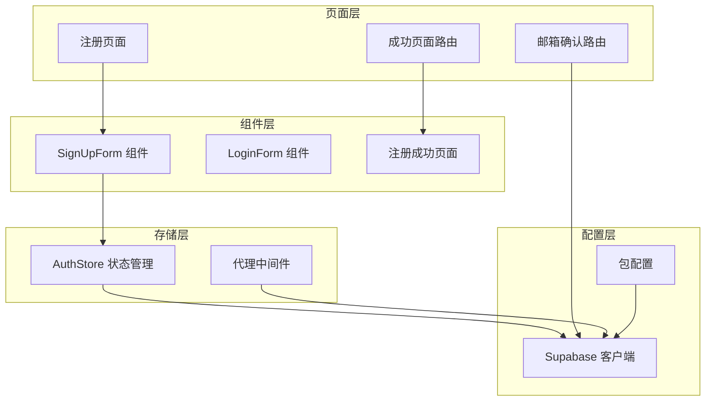
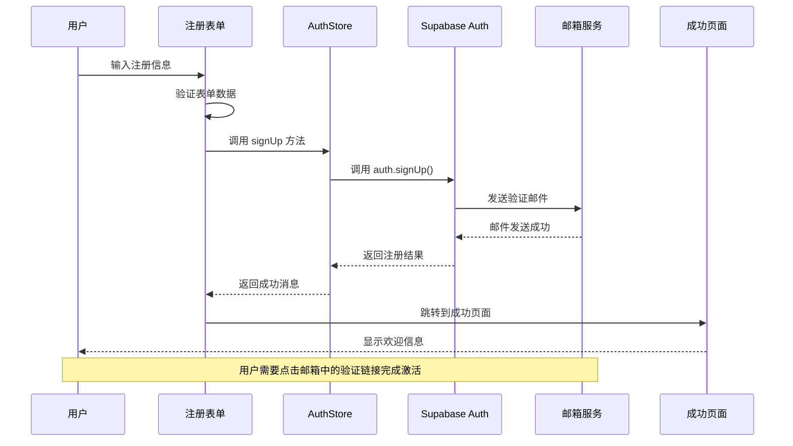
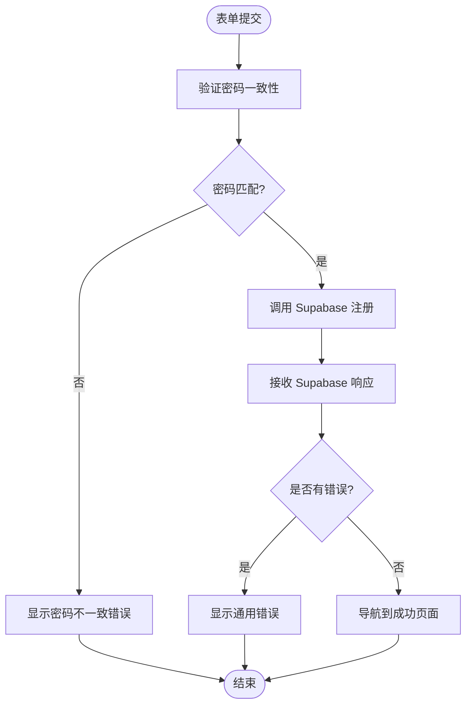
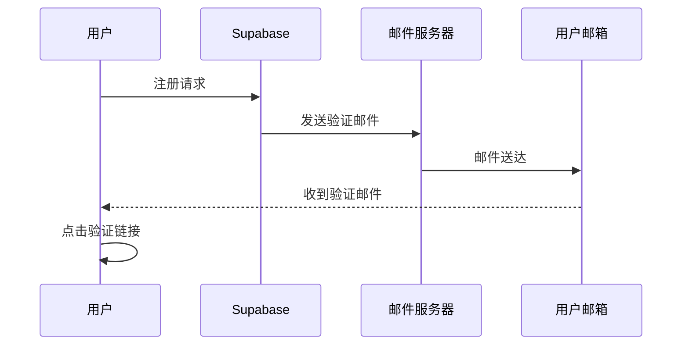
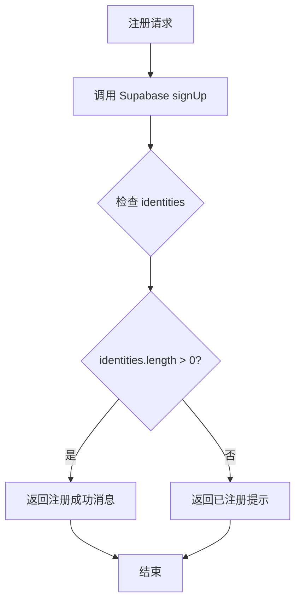
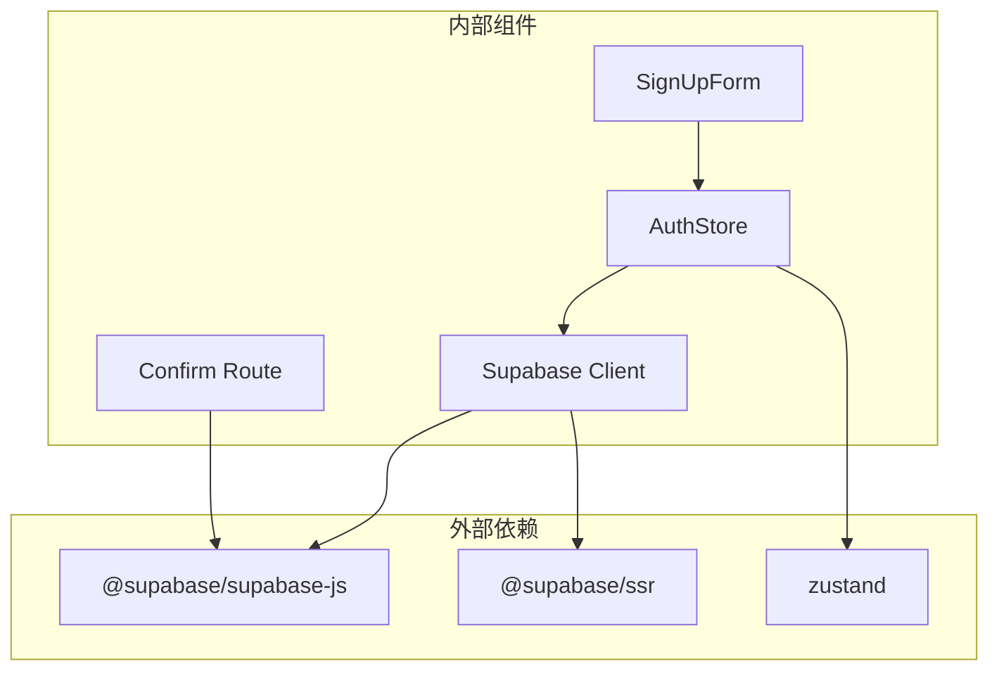

# 用户注册系统

<cite>
**本文档引用的文件**
- [components/sign-up-form.tsx](file://components/sign-up-form.tsx)
- [app/auth/sign-up/page.tsx](file://app/auth/sign-up/page.tsx)
- [lib/supabase/client.ts](file://lib/supabase/client.ts)
- [stores/useAuthStore.ts](file://stores/useAuthStore.ts)
- [app/auth/sign-up-success/page.tsx](file://app/auth/sign-up-success/page.tsx)
- [app/auth/confirm/route.ts](file://app/auth/confirm/route.ts)
- [components/login-form.tsx](file://components/login-form.tsx)
- [components/tutorial/sign-up-user-steps.tsx](file://components/tutorial/sign-up-user-steps.tsx)
- [lib/supabase/proxy.ts](file://lib/supabase/proxy.ts)
- [package.json](file://package.json)
</cite>

## 目录
1. [简介](#简介)
2. [项目结构](#项目结构)
3. [核心组件](#核心组件)
4. [架构概览](#架构概览)
5. [详细组件分析](#详细组件分析)
6. [依赖关系分析](#依赖关系分析)
7. [性能考虑](#性能考虑)
8. [故障排除指南](#故障排除指南)
9. [结论](#结论)

## 简介

本项目是一个基于 Next.js 和 Supabase 的虚拟股票交易应用，用户注册系统是整个应用的核心功能模块之一。该系统提供了完整的用户注册流程，包括表单验证、邮箱验证、账户激活和错误处理等完整功能。

用户注册系统采用现代化的前端架构，使用 React Hooks 进行状态管理，通过 Supabase Auth 提供认证服务，实现了从用户注册到账户激活的完整闭环。

## 项目结构

用户注册相关的文件组织结构如下：

**图表来源**
- [components/sign-up-form.tsx:1-121](file://components/sign-up-form.tsx#L1-L121)
- [app/auth/sign-up/page.tsx:1-12](file://app/auth/sign-up/page.tsx#L1-L12)
- [stores/useAuthStore.ts:1-104](file://stores/useAuthStore.ts#L1-L104)

**章节来源**
- [components/sign-up-form.tsx:1-121](file://components/sign-up-form.tsx#L1-L121)
- [app/auth/sign-up/page.tsx:1-12](file://app/auth/sign-up/page.tsx#L1-L12)
- [stores/useAuthStore.ts:1-104](file://stores/useAuthStore.ts#L1-L104)

## 核心组件

### 注册表单组件 (SignUpForm)

SignUpForm 是用户注册的核心界面组件，负责收集用户输入并处理注册逻辑。

**主要特性：**
- 双重密码验证确保密码一致性
- 实时表单状态管理
- 加载状态指示器
- 错误消息显示
- 导航到登录页面的链接

**表单字段设计：**
- 邮箱字段：支持标准邮箱格式验证
- 密码字段：隐藏输入，支持密码强度要求
- 确认密码字段：确保两次输入一致

**章节来源**
- [components/sign-up-form.tsx:19-121](file://components/sign-up-form.tsx#L19-L121)

### 认证状态管理 (useAuthStore)

AuthStore 使用 Zustand 状态管理库，提供全局认证状态管理。

**核心功能：**
- 用户会话状态管理
- 注册和登录操作封装
- 认证状态监听
- 自动初始化机制

**状态属性：**
- session: 当前用户会话信息
- user: 当前用户对象
- isLoading: 加载状态
- isInitialized: 初始化状态

**章节来源**
- [stores/useAuthStore.ts:1-104](file://stores/useAuthStore.ts#L1-L104)

### Supabase 客户端配置

Supabase 客户端通过环境变量进行配置，支持浏览器端和服务器端的不同客户端实例。

**配置要点：**
- NEXT_PUBLIC_SUPABASE_URL: Supabase 项目 URL
- NEXT_PUBLIC_SUPABASE_PUBLISHABLE_KEY: 发布密钥
- SSR 客户端支持

**章节来源**
- [lib/supabase/client.ts:1-9](file://lib/supabase/client.ts#L1-L9)

## 架构概览

用户注册系统的整体架构采用分层设计，确保了良好的可维护性和扩展性。

**图表来源**
- [components/sign-up-form.tsx:30-57](file://components/sign-up-form.tsx#L30-L57)
- [stores/useAuthStore.ts:50-69](file://stores/useAuthStore.ts#L50-L69)
- [app/auth/sign-up-success/page.tsx:9-33](file://app/auth/sign-up-success/page.tsx#L9-L33)

## 详细组件分析

### 注册表单组件深度分析

#### 表单验证逻辑

注册表单实现了多层次的验证机制：

**图表来源**
- [components/sign-up-form.tsx:30-57](file://components/sign-up-form.tsx#L30-L57)

#### Supabase Auth signUp 方法调用

注册流程的核心是调用 Supabase 的 signUp 方法，该方法支持以下参数：

**必需参数：**
- email: 用户邮箱地址
- password: 用户密码

**可选配置：**
- options.emailRedirectTo: 邮箱验证后的重定向 URL
- 自动发送验证邮件

**章节来源**
- [components/sign-up-form.tsx:42-51](file://components/sign-up-form.tsx#L42-L51)
- [stores/useAuthStore.ts:50-58](file://stores/useAuthStore.ts#L50-L58)

### 邮箱验证机制

#### 邮件发送流程

当用户成功注册时，Supabase 会自动发送验证邮件到用户的邮箱地址。邮件内容包含一个安全的验证链接。

**图表来源**
- [components/sign-up-form.tsx:42-49](file://components/sign-up-form.tsx#L42-L49)

#### 验证链接处理

邮箱验证通过专门的路由处理，该路由负责验证用户提供的 token_hash：

**验证流程：**
1. 从 URL 参数中提取 token_hash 和 type
2. 调用 Supabase 的 verifyOtp 方法
3. 根据验证结果进行重定向
4. 处理验证失败的情况

**章节来源**
- [app/auth/confirm/route.ts:6-30](file://app/auth/confirm/route.ts#L6-L30)

### 重复注册检测

系统实现了智能的重复注册检测机制，通过检查用户的身份信息来判断是否已经存在。

**图表来源**
- [stores/useAuthStore.ts:64-66](file://stores/useAuthStore.ts#L64-L66)

**章节来源**
- [stores/useAuthStore.ts:64-66](file://stores/useAuthStore.ts#L64-L66)

### 注册成功后的用户体验

#### 成功页面设计

注册成功页面提供了清晰的用户指导信息，帮助用户完成账户激活流程。

**页面元素：**
- 感谢信息标题
- 邮箱检查提示
- 详细的操作说明
- 响应式设计适配

**章节来源**
- [app/auth/sign-up-success/page.tsx:9-33](file://app/auth/sign-up-success/page.tsx#L9-L33)

### 错误处理策略

系统实现了多层次的错误处理机制：

#### 表单级错误处理
- 密码不一致错误
- 网络连接错误
- 服务器响应错误

#### 认证级错误处理
- 用户名已存在
- 邮箱格式无效
- 密码强度不足
- 系统内部错误

**章节来源**
- [components/sign-up-form.tsx:36-56](file://components/sign-up-form.tsx#L36-L56)
- [stores/useAuthStore.ts:60-62](file://stores/useAuthStore.ts#L60-L62)

## 依赖关系分析

用户注册系统的关键依赖关系如下：

**图表来源**
- [package.json:9-28](file://package.json#L9-L28)
- [components/sign-up-form.tsx:3](file://components/sign-up-form.tsx#L3)
- [stores/useAuthStore.ts:1](file://stores/useAuthStore.ts#L1)

**章节来源**
- [package.json:9-28](file://package.json#L9-L28)
- [components/sign-up-form.tsx:3](file://components/sign-up-form.tsx#L3)
- [stores/useAuthStore.ts:1](file://stores/useAuthStore.ts#L1)

## 性能考虑

### 状态管理优化

- 使用 Zustand 减少不必要的重新渲染
- 局部状态管理避免全局状态污染
- 异步操作的加载状态管理

### 网络请求优化

- 避免重复的认证检查
- 合理的错误重试机制
- 连接池管理和资源回收

### 用户体验优化

- 即时反馈的加载状态
- 渐进式验证减少用户等待
- 响应式设计适配不同设备

## 故障排除指南

### 常见问题及解决方案

#### 注册页面无法访问
**可能原因：**
- 环境变量配置错误
- Supabase 项目未正确设置
- 网络连接问题

**解决步骤：**
1. 检查 `.env.local` 文件中的 Supabase 配置
2. 验证 Supabase 项目的 URL 和密钥
3. 确认网络连接正常

#### 邮箱验证失败
**可能原因：**
- 邮箱服务器配置错误
- 验证链接过期
- 防火墙阻止邮件发送

**解决步骤：**
1. 检查 Supabase 的邮箱配置
2. 验证域名和 SPF 记录
3. 测试邮件发送功能

#### 重复注册检测异常
**可能原因：**
- 用户身份信息缓存问题
- 数据库同步延迟
- 并发注册冲突

**解决步骤：**
1. 清除浏览器缓存
2. 等待数据库同步完成
3. 检查并发控制机制

**章节来源**
- [components/tutorial/sign-up-user-steps.tsx:1-91](file://components/tutorial/sign-up-user-steps.tsx#L1-L91)

## 结论

用户注册系统通过精心设计的架构和完善的错误处理机制，为用户提供了流畅的注册体验。系统的主要优势包括：

1. **完整的认证流程**：从注册到验证的全链路支持
2. **友好的用户界面**：直观的表单设计和清晰的反馈信息
3. **健壮的错误处理**：多层级的错误捕获和用户提示
4. **可扩展的架构**：基于 Zustand 的状态管理和模块化设计

该系统为虚拟股票交易应用奠定了坚实的用户基础，为后续的功能扩展提供了良好的技术支撑。