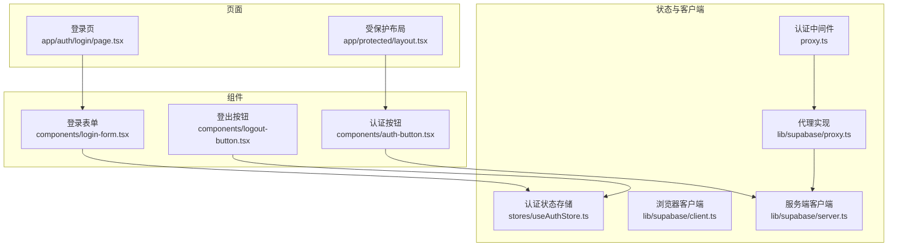
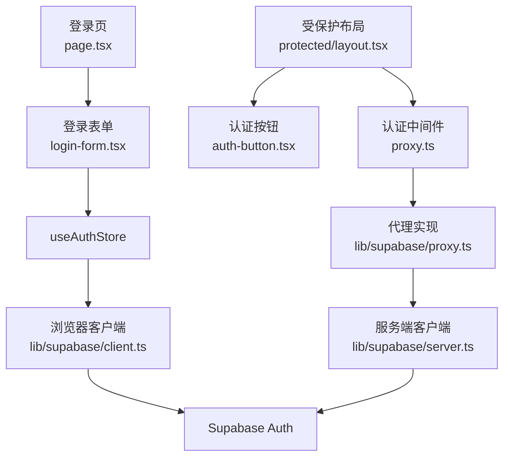
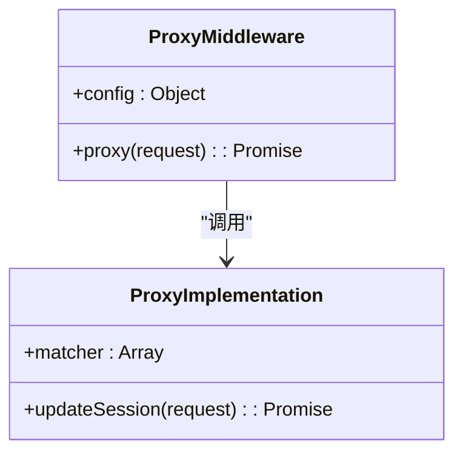
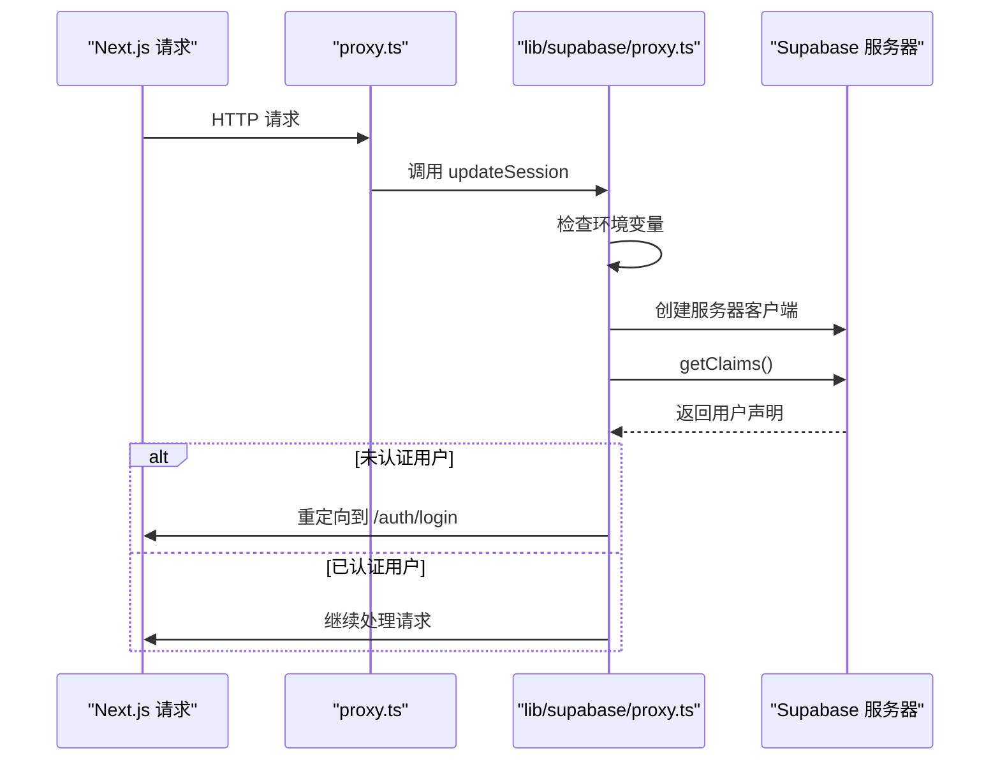
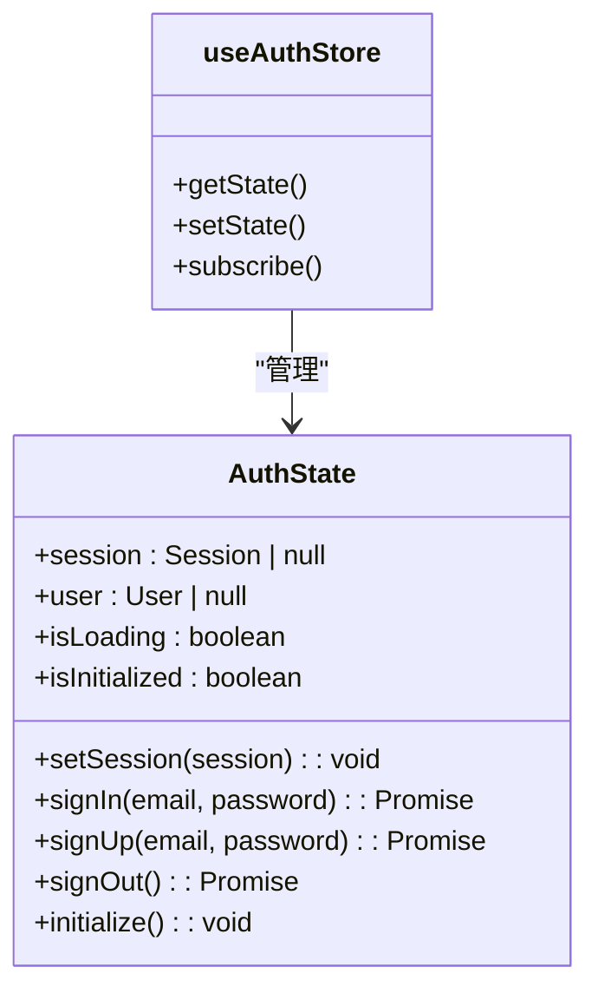
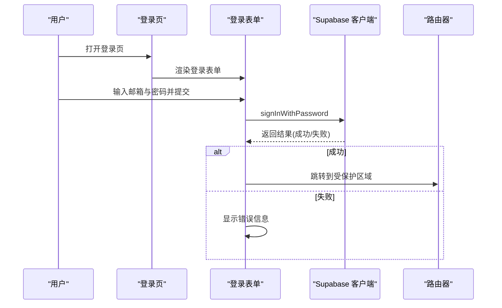
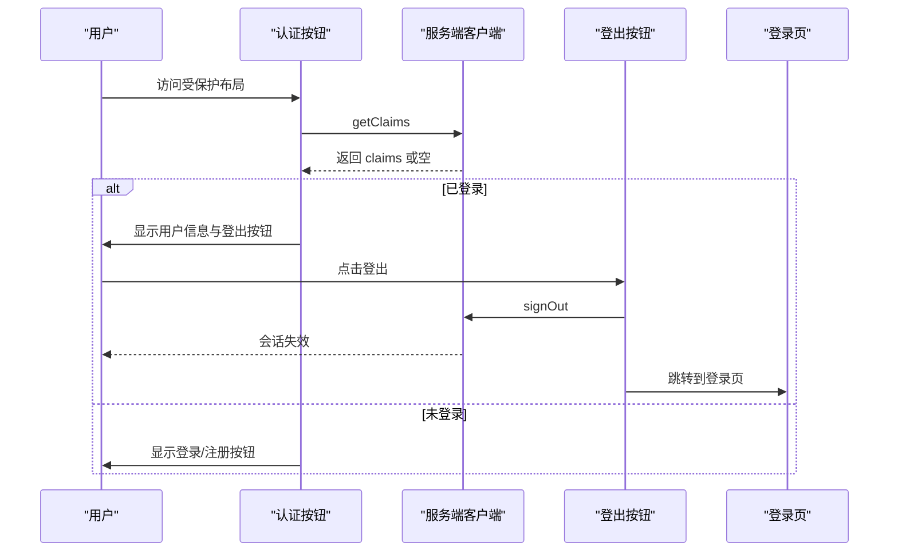
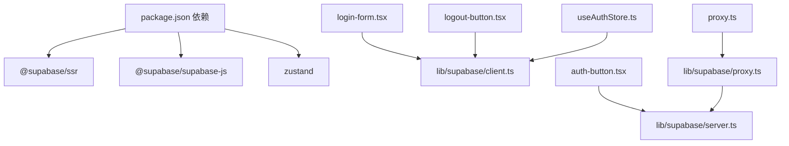

# 用户认证系统

<cite>
**本文档引用的文件**
- [proxy.ts](file://proxy.ts)
- [lib/supabase/proxy.ts](file://lib/supabase/proxy.ts)
- [lib/supabase/client.ts](file://lib/supabase/client.ts)
- [lib/supabase/server.ts](file://lib/supabase/server.ts)
- [lib/utils.ts](file://lib/utils.ts)
- [stores/useAuthStore.ts](file://stores/useAuthStore.ts)
- [components/login-form.tsx](file://components/login-form.tsx)
- [components/auth-button.tsx](file://components/auth-button.tsx)
- [components/logout-button.tsx](file://components/logout-button.tsx)
- [app/auth/login/page.tsx](file://app/auth/login/page.tsx)
- [app/protected/layout.tsx](file://app/protected/layout.tsx)
- [package.json](file://package.json)
</cite>

## 更新摘要
**所做更改**
- 更新认证中间件架构：从 middleware.ts 重命名为 proxy.ts
- 函数名从 middleware 修正为 proxy，保持相同会话管理功能
- 新增 lib/supabase/proxy.ts 作为实际代理实现文件
- 更新认证中间件配置与匹配规则

## 目录
1. [简介](#简介)
2. [项目结构](#项目结构)
3. [核心组件](#核心组件)
4. [架构总览](#架构总览)
5. [详细组件分析](#详细组件分析)
6. [依赖关系分析](#依赖关系分析)
7. [性能考虑](#性能考虑)
8. [故障排除指南](#故障排除指南)
9. [结论](#结论)
10. [附录](#附录)

## 简介
本文件面向虚拟股票交易平台的用户认证系统，系统基于 Supabase Auth 实现，覆盖密码认证、会话管理、权限控制与状态同步。文档重点阐述以下内容：
- Supabase Auth 集成方案：密码认证、邮箱 OTP 验证、重置密码流程
- 认证状态管理：useAuthStore 的设计模式与状态同步机制
- 注册与登录流程：邮箱验证、密码安全策略、账户激活
- 登出与中间件路由保护：服务端与客户端的协同
- 安全最佳实践、会话超时与多设备登录管理
- 具体的代码示例路径与集成指南

**更新** 认证中间件已从 middleware.ts 重命名为 proxy.ts，函数名修正为 proxy，符合 Next.js 16 命名约定，同时新增了专门的代理实现文件 lib/supabase/proxy.ts。

## 项目结构
认证相关模块主要分布在以下位置：
- 页面层：登录、注册、忘记密码、邮箱确认等页面
- 组件层：登录表单、注册表单、忘记密码表单、更新密码表单、登出按钮、认证按钮
- 状态层：Zustand 认证状态存储（useAuthStore）
- Supabase 客户端封装：浏览器端与服务端客户端
- 受保护布局：认证后可见的受保护区域
- 认证中间件：新的 proxy.ts 文件替代原有的 middleware.ts

**图表来源**
- [app/auth/login/page.tsx:1-10](file://app/auth/login/page.tsx#L1-L10)
- [app/protected/layout.tsx:1-56](file://app/protected/layout.tsx#L1-L56)
- [components/login-form.tsx:1-129](file://components/login-form.tsx#L1-L129)
- [components/auth-button.tsx:1-30](file://components/auth-button.tsx#L1-L30)
- [components/logout-button.tsx:1-18](file://components/logout-button.tsx#L1-L18)
- [stores/useAuthStore.ts:1-104](file://stores/useAuthStore.ts#L1-L104)
- [lib/supabase/client.ts:1-9](file://lib/supabase/client.ts#L1-L9)
- [lib/supabase/server.ts:1-35](file://lib/supabase/server.ts#L1-L35)
- [proxy.ts:1-21](file://proxy.ts#L1-L21)
- [lib/supabase/proxy.ts:1-78](file://lib/supabase/proxy.ts#L1-L78)

**章节来源**
- [proxy.ts:1-21](file://proxy.ts#L1-L21)
- [lib/supabase/proxy.ts:1-78](file://lib/supabase/proxy.ts#L1-L78)
- [app/auth/login/page.tsx:1-10](file://app/auth/login/page.tsx#L1-L10)
- [app/protected/layout.tsx:1-56](file://app/protected/layout.tsx#L1-L56)
- [components/login-form.tsx:1-129](file://components/login-form.tsx#L1-L129)
- [stores/useAuthStore.ts:1-104](file://stores/useAuthStore.ts#L1-L104)
- [lib/supabase/client.ts:1-9](file://lib/supabase/client.ts#L1-L9)
- [lib/supabase/server.ts:1-35](file://lib/supabase/server.ts#L1-L35)

## 核心组件
- 浏览器端 Supabase 客户端：封装 NEXT_PUBLIC_SUPABASE_URL 与发布密钥，供前端调用
- 服务端 Supabase 客户端：通过 cookies 读写会话，用于服务端渲染与 SSR
- useAuthStore：集中管理认证状态（会话、用户、加载状态），提供 signIn、signUp、signOut、initialize 方法
- 登录/注册表单：负责输入校验、调用 Supabase Auth API、错误处理与路由跳转
- 认证中间件：新的 proxy.ts 文件替代原有 middleware.ts，提供会话刷新与路由保护
- 代理实现：lib/supabase/proxy.ts 中的 updateSession 函数，处理会话验证与重定向逻辑
- 认证按钮与登出按钮：在受保护布局中显示用户信息或引导登录/注册

**更新** 新增了专门的认证中间件文件 proxy.ts 和代理实现文件 lib/supabase/proxy.ts，提供更清晰的会话管理与路由保护功能。

**章节来源**
- [proxy.ts:1-21](file://proxy.ts#L1-L21)
- [lib/supabase/proxy.ts:1-78](file://lib/supabase/proxy.ts#L1-L78)
- [lib/supabase/client.ts:1-9](file://lib/supabase/client.ts#L1-L9)
- [lib/supabase/server.ts:1-35](file://lib/supabase/server.ts#L1-L35)
- [stores/useAuthStore.ts:1-104](file://stores/useAuthStore.ts#L1-L104)
- [components/login-form.tsx:1-129](file://components/login-form.tsx#L1-L129)
- [components/auth-button.tsx:1-30](file://components/auth-button.tsx#L1-L30)
- [components/logout-button.tsx:1-18](file://components/logout-button.tsx#L1-L18)

## 架构总览
系统采用"页面 + 组件 + 状态 + Supabase 客户端 + 认证中间件"的分层架构：
- 前端页面负责导航与展示
- 表单组件负责用户交互与调用 Supabase API
- Zustand 状态存储统一管理认证状态与生命周期
- 浏览器端与服务端客户端分别处理客户端与 SSR 场景下的会话读写
- 新的认证中间件提供会话刷新与路由保护，替代原有的 middleware.ts

**图表来源**
- [app/auth/login/page.tsx:1-10](file://app/auth/login/page.tsx#L1-L10)
- [app/protected/layout.tsx:1-56](file://app/protected/layout.tsx#L1-L56)
- [components/login-form.tsx:1-129](file://components/login-form.tsx#L1-L129)
- [components/auth-button.tsx:1-30](file://components/auth-button.tsx#L1-L30)
- [stores/useAuthStore.ts:1-104](file://stores/useAuthStore.ts#L1-L104)
- [lib/supabase/client.ts:1-9](file://lib/supabase/client.ts#L1-L9)
- [proxy.ts:1-21](file://proxy.ts#L1-L21)
- [lib/supabase/proxy.ts:1-78](file://lib/supabase/proxy.ts#L1-L78)
- [lib/supabase/server.ts:1-35](file://lib/supabase/server.ts#L1-L35)

## 详细组件分析

### 认证中间件：proxy.ts 与代理实现
新的认证中间件架构采用分层设计：
- proxy.ts：导出 proxy 函数作为 Next.js 16 兼容的中间件入口
- lib/supabase/proxy.ts：包含 updateSession 函数，处理会话验证与路由保护
- 匹配器配置：排除静态资源与图像优化文件，仅对动态路由生效

**图表来源**
- [proxy.ts:1-21](file://proxy.ts#L1-L21)
- [lib/supabase/proxy.ts:1-78](file://lib/supabase/proxy.ts#L1-L78)

**章节来源**
- [proxy.ts:1-21](file://proxy.ts#L1-L21)
- [lib/supabase/proxy.ts:1-78](file://lib/supabase/proxy.ts#L1-L78)

### 会话验证与路由保护：updateSession 函数
updateSession 函数提供完整的会话验证与路由保护逻辑：
- 环境变量检查：确保 Supabase 配置完整
- 服务器客户端创建：每次请求创建独立的 Supabase 客户端实例
- 会话获取：通过 getClaims() 获取用户声明信息
- 路由保护：对未认证用户重定向到登录页面
- Cookie 同步：确保浏览器与服务器会话一致性

**图表来源**
- [lib/supabase/proxy.ts:5-77](file://lib/supabase/proxy.ts#L5-L77)
- [proxy.ts:4-6](file://proxy.ts#L4-L6)

**章节来源**
- [lib/supabase/proxy.ts:1-78](file://lib/supabase/proxy.ts#L1-L78)
- [proxy.ts:1-21](file://proxy.ts#L1-L21)

### 认证状态存储：useAuthStore 设计模式
useAuthStore 使用 Zustand 提供集中式状态管理，职责包括：
- 状态字段：session、user、isLoading、isInitialized
- 初始化：getSession 并监听 onAuthStateChange 同步状态
- 操作方法：signIn、signUp、signOut、setSession
- 注册流程：当用户通过邮箱注册且未绑定身份时，返回提示消息

**图表来源**
- [stores/useAuthStore.ts:1-104](file://stores/useAuthStore.ts#L1-L104)

**章节来源**
- [stores/useAuthStore.ts:1-104](file://stores/useAuthStore.ts#L1-L104)

### 登录流程：密码认证与错误处理
- 表单组件负责收集邮箱与密码，调用 Supabase 密码登录
- 成功后跳转至受保护区域；失败时捕获异常并显示错误
- 支持"忘记密码"链接跳转

**图表来源**
- [components/login-form.tsx:1-129](file://components/login-form.tsx#L1-L129)
- [lib/supabase/client.ts:1-9](file://lib/supabase/client.ts#L1-L9)

**章节来源**
- [components/login-form.tsx:1-129](file://components/login-form.tsx#L1-L129)

### 认证按钮与登出按钮：服务端与客户端协同
- 登出按钮：调用 signOut 并跳转到登录页
- 认证按钮：在服务端使用 getClaims 判断是否已登录，显示用户信息或引导登录/注册
- 受保护布局：在 Suspense 包裹下渲染认证按钮

**图表来源**
- [components/auth-button.tsx:1-30](file://components/auth-button.tsx#L1-L30)
- [components/logout-button.tsx:1-18](file://components/logout-button.tsx#L1-L18)
- [lib/supabase/server.ts:1-35](file://lib/supabase/server.ts#L1-L35)
- [app/protected/layout.tsx:1-56](file://app/protected/layout.tsx#L1-L56)

**章节来源**
- [components/auth-button.tsx:1-30](file://components/auth-button.tsx#L1-L30)
- [components/logout-button.tsx:1-18](file://components/logout-button.tsx#L1-L18)
- [app/protected/layout.tsx:1-56](file://app/protected/layout.tsx#L1-L56)

## 依赖关系分析
- 依赖项：@supabase/ssr、@supabase/supabase-js、zustand
- 浏览器端与服务端客户端分别封装 Supabase 客户端实例
- useAuthStore 作为状态中心，被多个表单组件依赖
- 页面与组件通过 Supabase 客户端与后端交互
- 新增的认证中间件提供会话刷新与路由保护功能

**图表来源**
- [package.json:1-44](file://package.json#L1-L44)
- [components/login-form.tsx:1-129](file://components/login-form.tsx#L1-L129)
- [components/auth-button.tsx:1-30](file://components/auth-button.tsx#L1-L30)
- [components/logout-button.tsx:1-18](file://components/logout-button.tsx#L1-L18)
- [stores/useAuthStore.ts:1-104](file://stores/useAuthStore.ts#L1-L104)
- [lib/supabase/client.ts:1-9](file://lib/supabase/client.ts#L1-L9)
- [lib/supabase/server.ts:1-35](file://lib/supabase/server.ts#L1-L35)
- [proxy.ts:1-21](file://proxy.ts#L1-L21)
- [lib/supabase/proxy.ts:1-78](file://lib/supabase/proxy.ts#L1-L78)

**章节来源**
- [package.json:1-44](file://package.json#L1-L44)
- [lib/supabase/client.ts:1-9](file://lib/supabase/client.ts#L1-L9)
- [lib/supabase/server.ts:1-35](file://lib/supabase/server.ts#L1-L35)
- [stores/useAuthStore.ts:1-104](file://stores/useAuthStore.ts#L1-L104)
- [proxy.ts:1-21](file://proxy.ts#L1-L21)
- [lib/supabase/proxy.ts:1-78](file://lib/supabase/proxy.ts#L1-L78)

## 性能考虑
- 客户端与服务端客户端分离：避免全局缓存导致的会话不一致，按需创建客户端实例
- 状态初始化：在应用启动时调用 initialize，一次性拉取会话并订阅状态变化，减少重复查询
- 表单提交：在提交过程中禁用按钮与显示加载状态，提升用户体验并避免重复提交
- 路由保护：受保护布局仅在必要时进行服务端认证判断，避免不必要的 SSR 开销
- 会话刷新：新的认证中间件在每次请求时检查会话有效性，确保用户状态实时同步

**更新** 新的认证中间件架构提供了更高效的会话管理，通过独立的代理实现文件确保会话验证的准确性与时效性。

## 故障排除指南
- 登录失败：检查邮箱/密码是否正确，查看错误提示；确认 Supabase 项目配置与环境变量
- 注册无邮件：确认 Supabase 邮件模板与发件配置；检查邮箱是否被垃圾箱拦截
- 认证中间件问题：检查 proxy.ts 文件是否存在且导出 proxy 函数；确认匹配器配置正确
- 会话不一致：确认 lib/supabase/proxy.ts 中的 updateSession 函数正常执行；检查环境变量设置
- 路由保护失效：验证代理实现中的路由保护逻辑；确认用户声明获取成功
- 登出无效：确认服务端 cookies 写入是否成功；检查跨域与 SameSite 设置

**更新** 新增了认证中间件相关的故障排除指南，包括 proxy.ts 文件检查、代理实现验证和会话一致性诊断。

**章节来源**
- [components/login-form.tsx:1-129](file://components/login-form.tsx#L1-L129)
- [proxy.ts:1-21](file://proxy.ts#L1-L21)
- [lib/supabase/proxy.ts:1-78](file://lib/supabase/proxy.ts#L1-L78)
- [components/auth-button.tsx:1-30](file://components/auth-button.tsx#L1-L30)
- [components/logout-button.tsx:1-18](file://components/logout-button.tsx#L1-L18)

## 结论
本认证系统以 Supabase Auth 为核心，结合 Zustand 状态管理、浏览器/服务端双客户端以及新的认证中间件架构，实现了完整的密码认证、邮箱验证、忘记密码与会话管理流程。通过受保护布局与认证按钮，系统在前端与后端协同下提供了良好的用户体验与安全性保障。新的 proxy.ts 重命名和代理实现分离提升了代码组织性和可维护性，符合 Next.js 16 的命名约定。建议在生产环境中进一步完善密码强度策略、会话超时与多设备登录管理，并持续监控 Supabase 控制台的认证日志与安全事件。

**更新** 新的认证中间件架构显著改进了系统的可维护性和性能，通过明确的文件分离和函数命名规范化，为未来的扩展和维护奠定了良好基础。

## 附录

### 安全最佳实践
- 强密码策略：要求最小长度与复杂度，避免常见弱口令
- 会话超时：设置合理的刷新间隔与自动登出时间
- 多设备登录：允许用户查看与管理活跃会话，支持强制登出特定设备
- CSRF 与 XSS 防护：确保前端与后端的同源策略与安全头配置
- 审计日志：记录关键认证事件，便于追踪与排查

### 会话超时与多设备登录管理
- 会话超时：在 Supabase 控制台配置会话过期时间；在前端定期刷新令牌
- 多设备登录：提供"查看所有会话"与"逐个登出"的能力，增强用户对会话的掌控

### 集成指南
- 环境变量：NEXT_PUBLIC_SUPABASE_URL、NEXT_PUBLIC_SUPABASE_PUBLISHABLE_KEY
- Supabase 配置：启用邮箱+密码认证、配置重定向 URL、设置邮箱模板
- 前端集成：在应用启动时调用 useAuthStore.initialize；在受保护路由中使用认证按钮
- 后端集成：在需要鉴权的服务端逻辑中使用服务端客户端获取用户 claims
- 中间件集成：确保 proxy.ts 正确导出 proxy 函数，配置匹配器规则

**更新** 新增了认证中间件的集成指南，包括 proxy.ts 文件的正确配置和匹配器规则设置。

**章节来源**
- [lib/supabase/client.ts:1-9](file://lib/supabase/client.ts#L1-L9)
- [lib/supabase/server.ts:1-35](file://lib/supabase/server.ts#L1-L35)
- [stores/useAuthStore.ts:1-104](file://stores/useAuthStore.ts#L1-L104)
- [components/auth-button.tsx:1-30](file://components/auth-button.tsx#L1-L30)
- [proxy.ts:1-21](file://proxy.ts#L1-L21)
- [lib/supabase/proxy.ts:1-78](file://lib/supabase/proxy.ts#L1-L78)