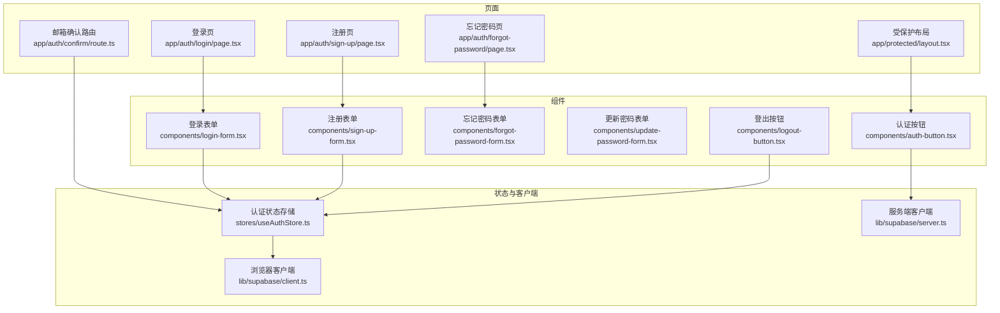
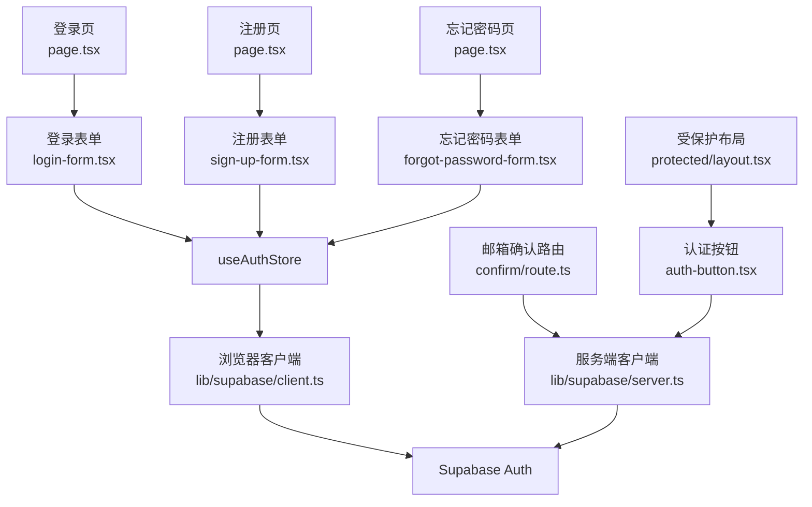
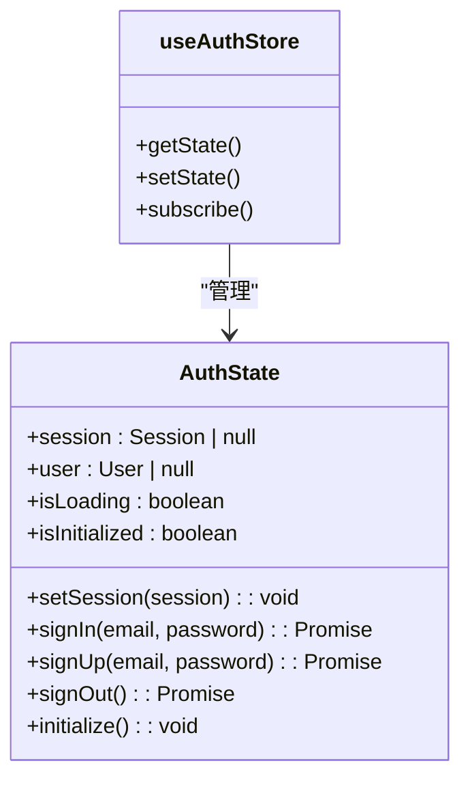
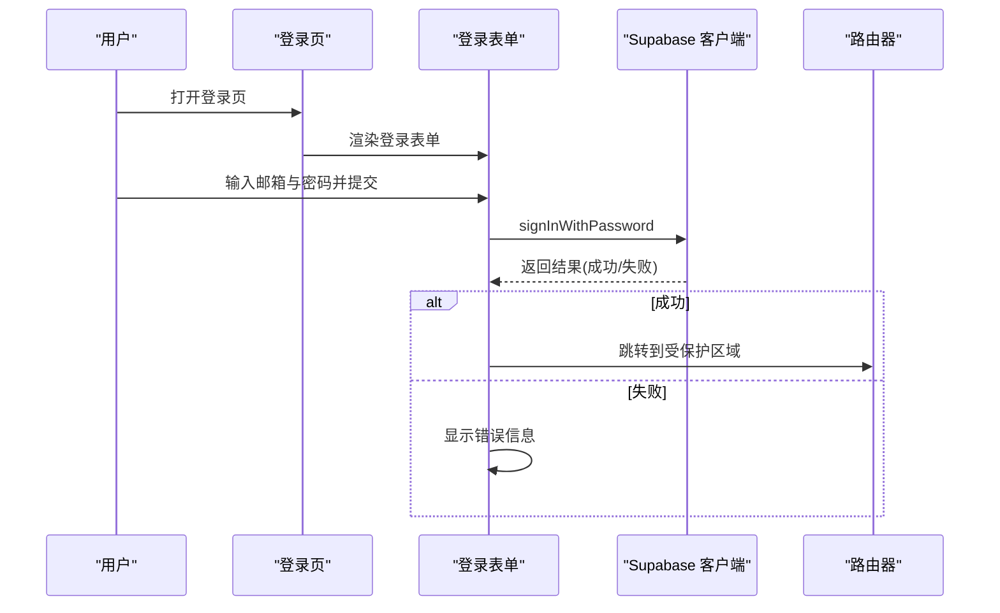
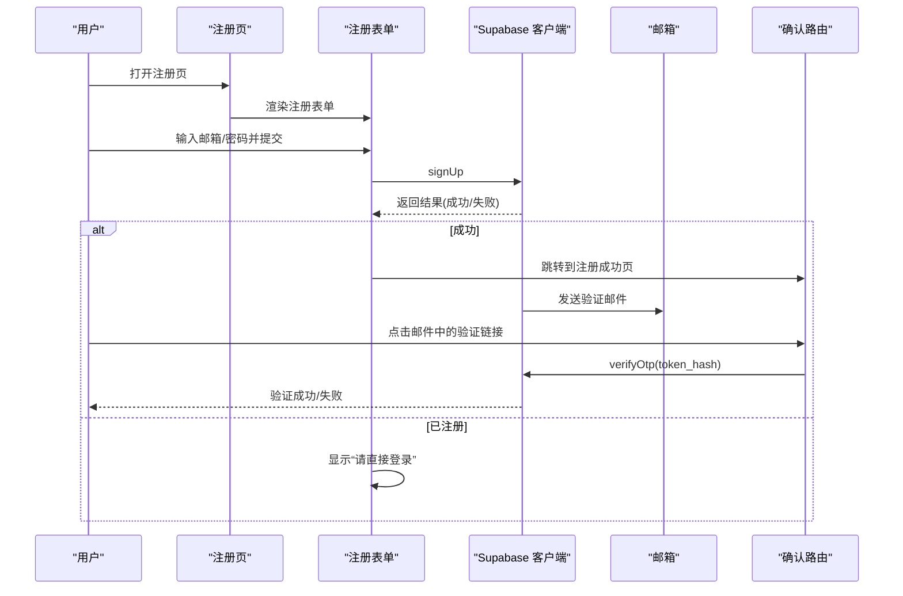
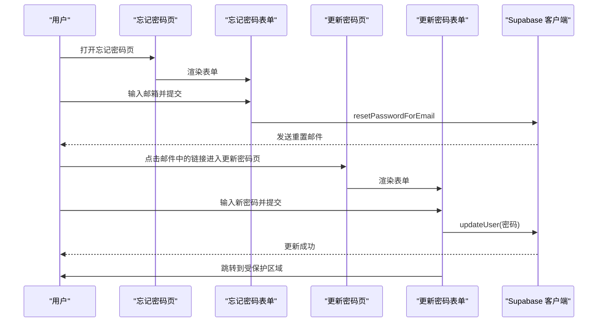
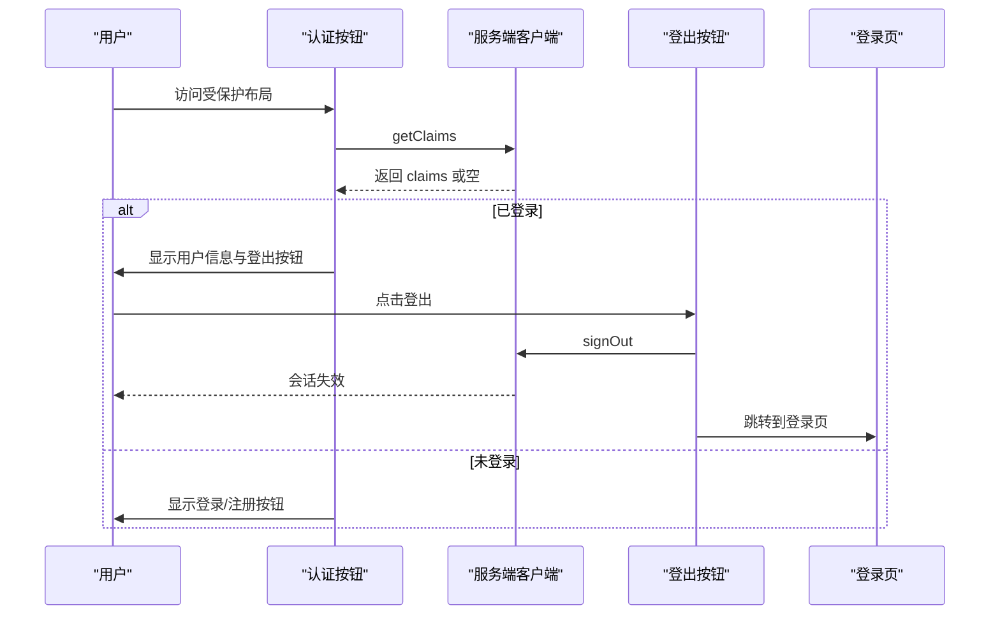
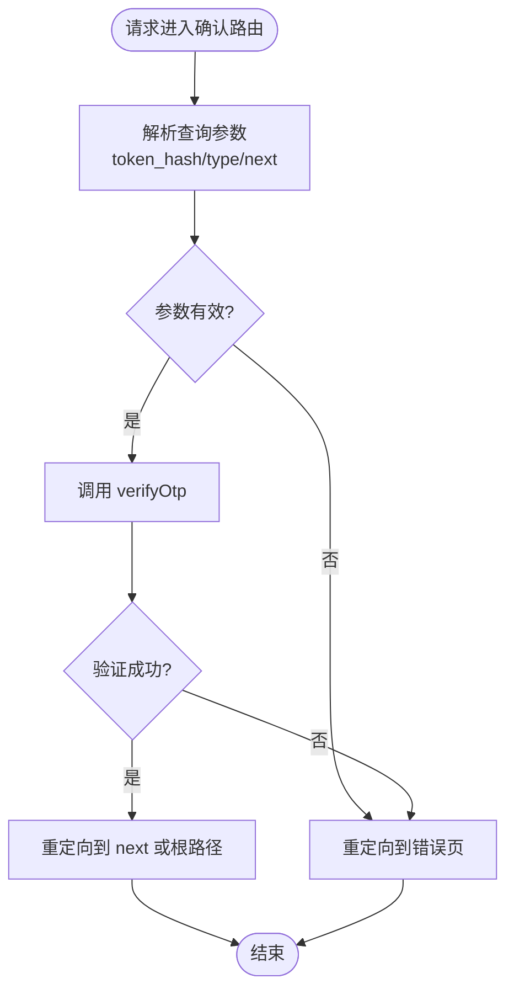
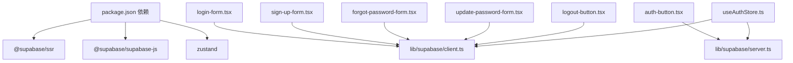

# 用户认证系统

<cite>
**本文档引用的文件**
- [app/auth/login/page.tsx](file://app/auth/login/page.tsx)
- [app/auth/sign-up/page.tsx](file://app/auth/sign-up/page.tsx)
- [components/login-form.tsx](file://components/login-form.tsx)
- [components/sign-up-form.tsx](file://components/sign-up-form.tsx)
- [stores/useAuthStore.ts](file://stores/useAuthStore.ts)
- [lib/supabase/client.ts](file://lib/supabase/client.ts)
- [lib/supabase/server.ts](file://lib/supabase/server.ts)
- [app/auth/confirm/route.ts](file://app/auth/confirm/route.ts)
- [app/auth/forgot-password/page.tsx](file://app/auth/forgot-password/page.tsx)
- [components/forgot-password-form.tsx](file://components/forgot-password-form.tsx)
- [components/update-password-form.tsx](file://components/update-password-form.tsx)
- [components/logout-button.tsx](file://components/logout-button.tsx)
- [components/auth-button.tsx](file://components/auth-button.tsx)
- [app/protected/layout.tsx](file://app/protected/layout.tsx)
- [package.json](file://package.json)
</cite>

## 目录
1. [简介](#简介)
2. [项目结构](#项目结构)
3. [核心组件](#核心组件)
4. [架构总览](#架构总览)
5. [详细组件分析](#详细组件分析)
6. [依赖关系分析](#依赖关系分析)
7. [性能考虑](#性能考虑)
8. [故障排除指南](#故障排除指南)
9. [结论](#结论)
10. [附录](#附录)

## 简介
本文件面向虚拟股票交易平台的用户认证系统，系统基于 Supabase Auth 实现，覆盖密码认证、会话管理、权限控制与状态同步。文档重点阐述以下内容：
- Supabase Auth 集成方案：密码认证、邮箱 OTP 验证、重置密码流程
- 认证状态管理：useAuthStore 的设计模式与状态同步机制
- 注册与登录流程：邮箱验证、密码安全策略、账户激活
- 登出与中间件路由保护：服务端与客户端的协同
- 安全最佳实践、会话超时与多设备登录管理
- 具体的代码示例路径与集成指南

## 项目结构
认证相关模块主要分布在以下位置：
- 页面层：登录、注册、忘记密码、邮箱确认等页面
- 组件层：登录表单、注册表单、忘记密码表单、更新密码表单、登出按钮、认证按钮
- 状态层：Zustand 认证状态存储（useAuthStore）
- Supabase 客户端封装：浏览器端与服务端客户端
- 受保护布局：认证后可见的受保护区域

**图表来源**
- [app/auth/login/page.tsx:1-12](file://app/auth/login/page.tsx#L1-L12)
- [app/auth/sign-up/page.tsx:1-12](file://app/auth/sign-up/page.tsx#L1-L12)
- [app/auth/forgot-password/page.tsx:1-12](file://app/auth/forgot-password/page.tsx#L1-L12)
- [app/auth/confirm/route.ts:1-31](file://app/auth/confirm/route.ts#L1-L31)
- [app/protected/layout.tsx:1-56](file://app/protected/layout.tsx#L1-L56)
- [components/login-form.tsx:1-111](file://components/login-form.tsx#L1-L111)
- [components/sign-up-form.tsx:1-121](file://components/sign-up-form.tsx#L1-L121)
- [components/forgot-password-form.tsx:1-106](file://components/forgot-password-form.tsx#L1-L106)
- [components/update-password-form.tsx:1-79](file://components/update-password-form.tsx#L1-L79)
- [components/logout-button.tsx:1-18](file://components/logout-button.tsx#L1-L18)
- [components/auth-button.tsx:1-30](file://components/auth-button.tsx#L1-L30)
- [stores/useAuthStore.ts:1-104](file://stores/useAuthStore.ts#L1-L104)
- [lib/supabase/client.ts:1-9](file://lib/supabase/client.ts#L1-L9)
- [lib/supabase/server.ts:1-35](file://lib/supabase/server.ts#L1-L35)

**章节来源**
- [app/auth/login/page.tsx:1-12](file://app/auth/login/page.tsx#L1-L12)
- [app/auth/sign-up/page.tsx:1-12](file://app/auth/sign-up/page.tsx#L1-L12)
- [components/login-form.tsx:1-111](file://components/login-form.tsx#L1-L111)
- [components/sign-up-form.tsx:1-121](file://components/sign-up-form.tsx#L1-L121)
- [stores/useAuthStore.ts:1-104](file://stores/useAuthStore.ts#L1-L104)
- [lib/supabase/client.ts:1-9](file://lib/supabase/client.ts#L1-L9)
- [lib/supabase/server.ts:1-35](file://lib/supabase/server.ts#L1-L35)
- [app/protected/layout.tsx:1-56](file://app/protected/layout.tsx#L1-L56)

## 核心组件
- 浏览器端 Supabase 客户端：封装 NEXT_PUBLIC_SUPABASE_URL 与发布密钥，供前端调用
- 服务端 Supabase 客户端：通过 cookies 读写会话，用于服务端渲染与 SSR
- useAuthStore：集中管理认证状态（会话、用户、加载状态），提供 signIn、signUp、signOut、initialize 方法
- 登录/注册表单：负责输入校验、调用 Supabase Auth API、错误处理与路由跳转
- 忘记密码/更新密码：重置密码流程，支持邮箱 OTP 与直接更新密码
- 邮箱确认路由：接收 token_hash 并完成邮箱验证
- 认证按钮与登出按钮：在受保护布局中显示用户信息或引导登录/注册

**章节来源**
- [lib/supabase/client.ts:1-9](file://lib/supabase/client.ts#L1-L9)
- [lib/supabase/server.ts:1-35](file://lib/supabase/server.ts#L1-L35)
- [stores/useAuthStore.ts:1-104](file://stores/useAuthStore.ts#L1-L104)
- [components/login-form.tsx:1-111](file://components/login-form.tsx#L1-L111)
- [components/sign-up-form.tsx:1-121](file://components/sign-up-form.tsx#L1-L121)
- [components/forgot-password-form.tsx:1-106](file://components/forgot-password-form.tsx#L1-L106)
- [components/update-password-form.tsx:1-79](file://components/update-password-form.tsx#L1-L79)
- [app/auth/confirm/route.ts:1-31](file://app/auth/confirm/route.ts#L1-L31)
- [components/auth-button.tsx:1-30](file://components/auth-button.tsx#L1-L30)
- [components/logout-button.tsx:1-18](file://components/logout-button.tsx#L1-L18)

## 架构总览
系统采用“页面 + 组件 + 状态 + Supabase 客户端”的分层架构：
- 前端页面负责导航与展示
- 表单组件负责用户交互与调用 Supabase API
- Zustand 状态存储统一管理认证状态与生命周期
- 浏览器端与服务端客户端分别处理客户端与 SSR 场景下的会话读写

**图表来源**
- [app/auth/login/page.tsx:1-12](file://app/auth/login/page.tsx#L1-L12)
- [app/auth/sign-up/page.tsx:1-12](file://app/auth/sign-up/page.tsx#L1-L12)
- [app/auth/forgot-password/page.tsx:1-12](file://app/auth/forgot-password/page.tsx#L1-L12)
- [components/login-form.tsx:1-111](file://components/login-form.tsx#L1-L111)
- [components/sign-up-form.tsx:1-121](file://components/sign-up-form.tsx#L1-L121)
- [components/forgot-password-form.tsx:1-106](file://components/forgot-password-form.tsx#L1-L106)
- [stores/useAuthStore.ts:1-104](file://stores/useAuthStore.ts#L1-L104)
- [lib/supabase/client.ts:1-9](file://lib/supabase/client.ts#L1-L9)
- [app/auth/confirm/route.ts:1-31](file://app/auth/confirm/route.ts#L1-L31)
- [lib/supabase/server.ts:1-35](file://lib/supabase/server.ts#L1-L35)
- [app/protected/layout.tsx:1-56](file://app/protected/layout.tsx#L1-L56)
- [components/auth-button.tsx:1-30](file://components/auth-button.tsx#L1-L30)

## 详细组件分析

### 认证状态存储：useAuthStore 设计模式
useAuthStore 使用 Zustand 提供集中式状态管理，职责包括：
- 状态字段：session、user、isLoading、isInitialized
- 初始化：getSession 并监听 onAuthStateChange 同步状态
- 操作方法：signIn、signUp、signOut、setSession
- 注册流程：当用户通过邮箱注册且未绑定身份时，返回提示消息

**图表来源**
- [stores/useAuthStore.ts:1-104](file://stores/useAuthStore.ts#L1-L104)

**章节来源**
- [stores/useAuthStore.ts:1-104](file://stores/useAuthStore.ts#L1-L104)

### 登录流程：密码认证与错误处理
- 表单组件负责收集邮箱与密码，调用 Supabase 密码登录
- 成功后跳转至受保护区域；失败时捕获异常并显示错误
- 支持“忘记密码”链接跳转

**图表来源**
- [components/login-form.tsx:1-111](file://components/login-form.tsx#L1-L111)
- [lib/supabase/client.ts:1-9](file://lib/supabase/client.ts#L1-L9)

**章节来源**
- [components/login-form.tsx:1-111](file://components/login-form.tsx#L1-L111)

### 注册流程：邮箱验证与账户激活
- 表单组件进行重复密码校验，调用 Supabase 注册接口
- 注册成功后跳转到“注册成功”页面；若用户已存在则返回提示
- 邮箱验证通过 Supabase 发送的 OTP 链接完成，路由接收 token_hash 并调用 verifyOtp

**图表来源**
- [components/sign-up-form.tsx:1-121](file://components/sign-up-form.tsx#L1-L121)
- [app/auth/confirm/route.ts:1-31](file://app/auth/confirm/route.ts#L1-L31)
- [lib/supabase/client.ts:1-9](file://lib/supabase/client.ts#L1-L9)

**章节来源**
- [components/sign-up-form.tsx:1-121](file://components/sign-up-form.tsx#L1-L121)
- [app/auth/confirm/route.ts:1-31](file://app/auth/confirm/route.ts#L1-L31)

### 忘记密码与重置：邮箱 OTP 与直接更新
- 忘记密码表单：向邮箱发送重置链接，redirectTo 指向更新密码页
- 更新密码表单：接收新密码并调用 updateUser 更新密码
- 成功后跳转到受保护区域

**图表来源**
- [components/forgot-password-form.tsx:1-106](file://components/forgot-password-form.tsx#L1-L106)
- [components/update-password-form.tsx:1-79](file://components/update-password-form.tsx#L1-L79)
- [lib/supabase/client.ts:1-9](file://lib/supabase/client.ts#L1-L9)

**章节来源**
- [components/forgot-password-form.tsx:1-106](file://components/forgot-password-form.tsx#L1-L106)
- [components/update-password-form.tsx:1-79](file://components/update-password-form.tsx#L1-L79)

### 登出与认证按钮：服务端与客户端协同
- 登出按钮：调用 signOut 并跳转到登录页
- 认证按钮：在服务端使用 getClaims 判断是否已登录，显示用户信息或引导登录/注册
- 受保护布局：在 Suspense 包裹下渲染认证按钮

**图表来源**
- [components/auth-button.tsx:1-30](file://components/auth-button.tsx#L1-L30)
- [components/logout-button.tsx:1-18](file://components/logout-button.tsx#L1-L18)
- [lib/supabase/server.ts:1-35](file://lib/supabase/server.ts#L1-L35)
- [app/protected/layout.tsx:1-56](file://app/protected/layout.tsx#L1-L56)

**章节来源**
- [components/auth-button.tsx:1-30](file://components/auth-button.tsx#L1-L30)
- [components/logout-button.tsx:1-18](file://components/logout-button.tsx#L1-L18)
- [app/protected/layout.tsx:1-56](file://app/protected/layout.tsx#L1-L56)

### 邮箱确认路由：OTP 验证与错误处理
- 路由从查询参数读取 token_hash 与类型
- 调用 verifyOtp 完成邮箱验证，成功则重定向到指定路径，失败则跳转到错误页

**图表来源**
- [app/auth/confirm/route.ts:1-31](file://app/auth/confirm/route.ts#L1-L31)

**章节来源**
- [app/auth/confirm/route.ts:1-31](file://app/auth/confirm/route.ts#L1-L31)

## 依赖关系分析
- 依赖项：@supabase/ssr、@supabase/supabase-js、zustand
- 浏览器端与服务端客户端分别封装 Supabase 客户端实例
- useAuthStore 作为状态中心，被多个表单组件依赖
- 页面与组件通过 Supabase 客户端与后端交互

**图表来源**
- [package.json:1-44](file://package.json#L1-L44)
- [components/login-form.tsx:1-111](file://components/login-form.tsx#L1-L111)
- [components/sign-up-form.tsx:1-121](file://components/sign-up-form.tsx#L1-L121)
- [components/forgot-password-form.tsx:1-106](file://components/forgot-password-form.tsx#L1-L106)
- [components/update-password-form.tsx:1-79](file://components/update-password-form.tsx#L1-L79)
- [components/logout-button.tsx:1-18](file://components/logout-button.tsx#L1-L18)
- [components/auth-button.tsx:1-30](file://components/auth-button.tsx#L1-L30)
- [lib/supabase/client.ts:1-9](file://lib/supabase/client.ts#L1-L9)
- [lib/supabase/server.ts:1-35](file://lib/supabase/server.ts#L1-L35)
- [stores/useAuthStore.ts:1-104](file://stores/useAuthStore.ts#L1-L104)

**章节来源**
- [package.json:1-44](file://package.json#L1-L44)
- [lib/supabase/client.ts:1-9](file://lib/supabase/client.ts#L1-L9)
- [lib/supabase/server.ts:1-35](file://lib/supabase/server.ts#L1-L35)
- [stores/useAuthStore.ts:1-104](file://stores/useAuthStore.ts#L1-L104)

## 性能考虑
- 客户端与服务端客户端分离：避免全局缓存导致的会话不一致，按需创建客户端实例
- 状态初始化：在应用启动时调用 initialize，一次性拉取会话并订阅状态变化，减少重复查询
- 表单提交：在提交过程中禁用按钮与显示加载状态，提升用户体验并避免重复提交
- 路由保护：受保护布局仅在必要时进行服务端认证判断，避免不必要的 SSR 开销

## 故障排除指南
- 登录失败：检查邮箱/密码是否正确，查看错误提示；确认 Supabase 项目配置与环境变量
- 注册无邮件：确认 Supabase 邮件模板与发件配置；检查邮箱是否被垃圾箱拦截
- 邮箱确认失败：核对 token_hash 与类型参数是否传递正确；检查 Supabase 控制台中的 URL 配置
- 忘记密码无邮件：确认 redirectTo 是否在 Supabase URL 白名单中；检查浏览器阻止弹窗或广告拦截
- 登出无效：确认服务端 cookies 写入是否成功；检查跨域与 SameSite 设置

**章节来源**
- [components/login-form.tsx:1-111](file://components/login-form.tsx#L1-L111)
- [components/sign-up-form.tsx:1-121](file://components/sign-up-form.tsx#L1-L121)
- [app/auth/confirm/route.ts:1-31](file://app/auth/confirm/route.ts#L1-L31)
- [components/forgot-password-form.tsx:1-106](file://components/forgot-password-form.tsx#L1-L106)
- [components/logout-button.tsx:1-18](file://components/logout-button.tsx#L1-L18)

## 结论
本认证系统以 Supabase Auth 为核心，结合 Zustand 状态管理与浏览器/服务端双客户端，实现了完整的密码认证、邮箱验证、忘记密码与会话管理流程。通过受保护布局与认证按钮，系统在前端与后端协同下提供了良好的用户体验与安全性保障。建议在生产环境中进一步完善密码强度策略、会话超时与多设备登录管理，并持续监控 Supabase 控制台的认证日志与安全事件。

## 附录

### 安全最佳实践
- 强密码策略：要求最小长度与复杂度，避免常见弱口令
- 会话超时：设置合理的刷新间隔与自动登出时间
- 多设备登录：允许用户查看与管理活跃会话，支持强制登出特定设备
- CSRF 与 XSS 防护：确保前端与后端的同源策略与安全头配置
- 审计日志：记录关键认证事件，便于追踪与排查

### 会话超时与多设备登录管理
- 会话超时：在 Supabase 控制台配置会话过期时间；在前端定期刷新令牌
- 多设备登录：提供“查看所有会话”与“逐个登出”的能力，增强用户对会话的掌控

### 集成指南
- 环境变量：NEXT_PUBLIC_SUPABASE_URL、NEXT_PUBLIC_SUPABASE_PUBLISHABLE_KEY
- Supabase 配置：启用邮箱+密码认证、配置重定向 URL、设置邮箱模板
- 前端集成：在应用启动时调用 useAuthStore.initialize；在受保护路由中使用认证按钮
- 后端集成：在需要鉴权的服务端逻辑中使用服务端客户端获取用户 claims

**章节来源**
- [lib/supabase/client.ts:1-9](file://lib/supabase/client.ts#L1-L9)
- [lib/supabase/server.ts:1-35](file://lib/supabase/server.ts#L1-L35)
- [stores/useAuthStore.ts:1-104](file://stores/useAuthStore.ts#L1-L104)
- [components/auth-button.tsx:1-30](file://components/auth-button.tsx#L1-L30)